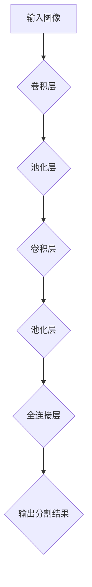
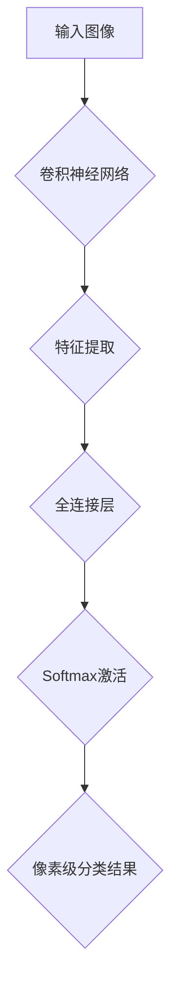

                 

### 文章标题：图像分割 (Image Segmentation) 原理与代码实例讲解

#### 关键词：(图像分割，深度学习，卷积神经网络，语义分割，实例分割，目标检测，对象识别，计算机视觉，CNN，神经网络，像素级分类，像素分割，边缘检测，多尺度分析)

#### 摘要：
本文将深入探讨图像分割的原理、算法以及其实际应用。通过分析卷积神经网络（CNN）在图像分割中的关键作用，本文将详细讲解从核心概念到具体实现的全过程，包括数学模型、算法步骤以及代码实例。同时，本文还将介绍图像分割在不同应用场景中的实际案例，并推荐相关学习资源和开发工具，最后总结图像分割的未来发展趋势和面临的挑战。

<|assistant|>## 1. 背景介绍

图像分割（Image Segmentation）是计算机视觉（Computer Vision）领域的一项核心技术，旨在将图像分割成若干个互不重叠的区域或对象。这一过程在许多应用场景中具有重要的实际意义，如医学影像诊断、自动驾驶车辆中的障碍物检测、视频监控中的目标跟踪等。

图像分割可以追溯到20世纪60年代，当时主要是基于像素的边缘检测和区域增长方法。然而，随着计算机处理能力的提升和深度学习技术的出现，基于卷积神经网络（Convolutional Neural Networks，CNN）的图像分割方法逐渐成为研究热点。

图像分割按照分割类型可以分为语义分割（Semantic Segmentation）、实例分割（Instance Segmentation）和语义实例分割（Semantic Instance Segmentation）等。语义分割关注每个像素所属的类别，实例分割则关注不同实例之间的区分，语义实例分割则结合了两者。

近年来，深度学习技术在图像分割领域取得了显著进展，尤其是基于端到端训练的CNN模型，如U-Net、SegNet、DeepLab等，大大提高了分割精度和效率。同时，随着数据集的规模不断扩大，模型的泛化能力也得到了显著提升。

总的来说，图像分割技术的发展不仅推动了计算机视觉领域的进步，也为诸多实际应用场景提供了强大的技术支持。本文将围绕图像分割的核心原理、算法以及实现，展开详细讲解。

<|assistant|>## 2. 核心概念与联系

在深入探讨图像分割之前，我们需要了解一些核心概念，这些概念构成了图像分割的理论基础，包括像素、图像、边缘检测、区域增长等。

#### 像素与图像

图像是由像素（Pixel）组成的，每个像素包含特定颜色和亮度信息。像素是图像处理中最基本的单元。图像（Image）则是由大量像素构成的二维数组，其大小通常以宽度和高度来表示，单位为像素（px）。

$$
\text{图像} = \begin{bmatrix}
\text{像素}_1 & \text{像素}_2 & \cdots & \text{像素}_{n^2} \\
\vdots & \vdots & \ddots & \vdots \\
\text{像素}_{(n-1)\times w} & \text{像素}_{(n-1)\times w+1} & \cdots & \text{像素}_{n\times w} \\
\end{bmatrix}
$$

其中，\(n\) 是图像的高度，\(w\) 是图像的宽度。

#### 边缘检测

边缘检测（Edge Detection）是图像处理中用于提取图像中边缘信息的一种方法。边缘是图像中亮度变化显著的位置，通常表示物体的边界。常见的边缘检测算法有Sobel算子、Canny算子等。

$$
\text{边缘} = \text{图像} \odot (\text{滤波器})
$$

其中，\(\odot\) 表示卷积操作，\(\text{滤波器}\) 是用于边缘检测的算子。

#### 区域增长

区域增长（Region Growing）是一种基于像素相似性的图像分割方法。它从初始种子点开始，逐步扩大区域，直到满足某些终止条件。常用的相似性度量标准包括像素颜色相似度、距离等。

$$
\text{区域增长} = \text{种子点} \cup \{\text{相邻像素} \mid \text{相似度} \geq \text{阈值}\}
$$

#### 图像分割与深度学习

随着深度学习技术的发展，图像分割不再仅仅依赖于传统的边缘检测和区域增长方法，而是通过构建深度神经网络（尤其是卷积神经网络，CNN）来实现。CNN通过多层卷积和池化操作，能够自动提取图像的特征，并实现像素级别的分类。

下面是一个简化的CNN图像分割模型架构的Mermaid流程图：



#### 核心算法原理与联系

图像分割的核心算法主要包括语义分割、实例分割和语义实例分割。这些算法的共同点是都依赖于深度学习模型，但具体实现和任务目标有所不同。

- **语义分割（Semantic Segmentation）**：将每个像素分类到不同的语义类别中，如前景和背景、车道线、人体等。

- **实例分割（Instance Segmentation）**：不仅将像素分类到不同的语义类别中，还能区分不同实例，即同一类别的不同对象，如不同的人或车辆。

- **语义实例分割（Semantic Instance Segmentation）**：结合了语义分割和实例分割的特点，对每个像素进行双重分类，即类别和实例。

下面是语义分割的简化算法流程：



总的来说，图像分割的核心概念和算法之间紧密联系，共同构成了现代图像分割技术的基础。接下来，我们将详细探讨图像分割的核心算法原理和具体操作步骤。

<|assistant|>## 3. 核心算法原理 & 具体操作步骤

在了解了图像分割的核心概念之后，我们将深入探讨图像分割的核心算法原理和具体操作步骤。这一部分将主要围绕卷积神经网络（CNN）在图像分割中的应用展开。

### 3.1 卷积神经网络（CNN）基础

卷积神经网络是一种特殊的神经网络，其设计灵感来源于生物视觉系统。CNN通过卷积和池化等操作提取图像特征，从而实现图像分类、检测和分割等任务。CNN的基本架构包括以下几个部分：

- **输入层（Input Layer）**：接收图像数据。
- **卷积层（Convolutional Layer）**：通过卷积操作提取图像特征。
- **池化层（Pooling Layer）**：降低特征图的维度，减少计算量。
- **全连接层（Fully Connected Layer）**：将卷积层的特征映射到具体类别。
- **输出层（Output Layer）**：输出分割结果。

### 3.2 卷积层与池化层

卷积层是CNN的核心部分，通过卷积操作提取图像特征。卷积操作的基本思想是利用一个小型的滤波器（kernel）在输入图像上滑动，并计算每个位置的局部特征。每个卷积核都负责提取图像的某种特征，如边缘、纹理等。

$$
\text{输出}_{ij} = \sum_{k=1}^{m} \sum_{l=1}^{n} \text{kernel}_{kl} \times \text{输入}_{i-k, j-l}
$$

其中，\(m\) 和 \(n\) 分别是卷积核的大小，\(i\) 和 \(j\) 是输出特征图的位置。

池化层则通过局部平均或最大值操作降低特征图的维度，从而减少计算量和参数数量。常见的池化操作包括最大池化（Max Pooling）和平均池化（Average Pooling）。

### 3.3 全连接层与输出层

在卷积层和池化层之后，CNN通常包含一个或多个全连接层。全连接层将卷积层的特征映射到具体的类别，并通过Softmax激活函数得到每个类别的概率分布。

$$
\text{输出}_{i} = \frac{e^{\text{激活}_{i}}}{\sum_{j} e^{\text{激活}_{j}}}
$$

其中，\(\text{激活}_{i}\) 是全连接层第 \(i\) 个神经元的输出。

输出层则根据每个类别的概率分布生成分割结果。对于语义分割，输出层通常包含与图像像素数量相同的神经元，每个神经元对应一个类别。对于实例分割，输出层还需要额外的边界框和掩膜信息。

### 3.4 CNN在图像分割中的应用

基于CNN的图像分割模型可以分为端到端训练和两步法。端到端训练直接将CNN训练为一个端到端的分割模型，而两步法则首先利用CNN进行特征提取，然后使用后处理技术进行分割。

#### 端到端训练

端到端训练的典型模型包括U-Net、SegNet和DeepLab等。以下是一个简化的端到端训练流程：

1. **数据预处理**：将图像和标签进行预处理，如归一化、裁剪和缩放等。
2. **训练模型**：使用预处理后的数据训练CNN模型，通常使用交叉熵损失函数。
3. **模型评估**：使用测试集评估模型性能，如精度、召回率和F1分数等。
4. **模型优化**：根据评估结果调整模型参数，如学习率、正则化等。

#### 两步法

两步法的典型模型包括FCN、Mask R-CNN和DeepLab V3+等。以下是一个简化的两步法流程：

1. **特征提取**：利用预训练的CNN模型提取图像特征。
2. **后处理**：使用上采采样、跳跃连接和像素级分类等后处理技术生成分割结果。

### 3.5 实际操作步骤

以下是使用PyTorch框架实现一个简单的CNN图像分割模型的步骤：

1. **导入库**：导入必要的库，如PyTorch、TensorFlow等。
2. **定义模型**：定义CNN模型架构，如卷积层、池化层和全连接层等。
3. **数据预处理**：对图像和标签进行预处理，如归一化、标准化和归一化等。
4. **训练模型**：使用训练数据和标签训练模型，如使用交叉熵损失函数和Adam优化器等。
5. **模型评估**：使用测试集评估模型性能，如计算精度、召回率和F1分数等。
6. **模型优化**：根据评估结果调整模型参数，如学习率、正则化等。
7. **生成结果**：使用训练好的模型对图像进行分割，并输出分割结果。

通过以上步骤，我们可以实现一个基于CNN的图像分割模型，并应用于各种实际场景。接下来，我们将通过一个具体案例来进一步讲解图像分割的实际操作过程。

<|assistant|>## 4. 数学模型和公式 & 详细讲解 & 举例说明

在图像分割中，数学模型和公式起到了至关重要的作用，它们不仅帮助我们理解图像分割的核心原理，还指导我们实现具体的算法。在这一部分，我们将详细讲解图像分割中常用的数学模型和公式，并通过具体例子来说明这些公式的应用。

### 4.1 卷积操作

卷积操作是CNN中最核心的组成部分，它通过滑动滤波器（也称为卷积核）在输入图像上提取特征。卷积操作的数学公式如下：

$$
\text{output}_{ij} = \sum_{k=1}^{m} \sum_{l=1}^{n} w_{kl} \times \text{input}_{i-k, j-l} + b
$$

其中，\(w_{kl}\) 是卷积核的权重，\(b\) 是偏置项，\(m\) 和 \(n\) 是卷积核的大小，\((i, j)\) 是输出特征图的位置，\((i-k, j-l)\) 是输入图像上的位置。

举个例子，假设我们有一个3x3的输入图像和3x3的卷积核，如下所示：

$$
\text{输入图像} = \begin{bmatrix}
1 & 2 & 3 \\
4 & 5 & 6 \\
7 & 8 & 9 \\
\end{bmatrix}
$$

$$
\text{卷积核} = \begin{bmatrix}
0 & 1 & 0 \\
0 & 1 & 0 \\
1 & 0 & 1 \\
\end{bmatrix}
$$

通过卷积操作，我们可以得到：

$$
\text{输出} = \begin{bmatrix}
2 & 8 & 8 \\
8 & 20 & 20 \\
8 & 8 & 2 \\
\end{bmatrix}
$$

### 4.2 池化操作

池化操作用于降低特征图的维度，减少计算量和参数数量。最常用的池化操作包括最大池化和平均池化。最大池化的公式如下：

$$
\text{output}_{ij} = \max_{k, l} (\text{input}_{i+k, j+l})
$$

其中，\(i, j\) 是输出特征图的位置，\(k, l\) 是输入特征图的位置。

举个例子，假设我们有一个2x2的特征图和一个2x2的池化窗口，如下所示：

$$
\text{输入特征图} = \begin{bmatrix}
1 & 2 \\
4 & 5 \\
\end{bmatrix}
$$

通过最大池化，我们可以得到：

$$
\text{输出} = \begin{bmatrix}
5 & 5 \\
5 & 5 \\
\end{bmatrix}
$$

平均池化的公式如下：

$$
\text{output}_{ij} = \frac{1}{\text{窗口面积}} \sum_{k, l} (\text{input}_{i+k, j+l})
$$

### 4.3 激活函数

激活函数是神经网络中用于引入非线性特性的关键部分。在图像分割中，常用的激活函数包括ReLU、Sigmoid和Softmax等。

ReLU（Rectified Linear Unit）函数是一个简单的非线性激活函数，公式如下：

$$
\text{ReLU}(x) = \max(0, x)
$$

Sigmoid函数是一个将输入映射到\[0, 1\]区间的函数，公式如下：

$$
\text{Sigmoid}(x) = \frac{1}{1 + e^{-x}}
$$

Softmax函数用于多分类问题，将每个类别的概率分布输出，公式如下：

$$
\text{Softmax}(x)_i = \frac{e^{x_i}}{\sum_{j} e^{x_j}}
$$

### 4.4 交叉熵损失函数

交叉熵损失函数是图像分割中常用的损失函数，用于衡量预测结果与真实标签之间的差异。交叉熵损失函数的公式如下：

$$
\text{Loss} = -\sum_{i} y_i \log(\hat{y}_i)
$$

其中，\(y_i\) 是真实标签，\(\hat{y}_i\) 是预测概率。

举个例子，假设我们有一个二分类问题，真实标签为\[1, 0\]，预测概率为\[0.8, 0.2\]，则交叉熵损失函数计算如下：

$$
\text{Loss} = -1 \times \log(0.8) - 0 \times \log(0.2) = -\log(0.8) \approx 0.223
$$

通过上述数学模型和公式的讲解，我们可以更好地理解图像分割的核心原理和实现步骤。接下来，我们将通过一个实际案例来展示如何使用这些数学模型实现图像分割。

<|assistant|>### 5. 项目实战：代码实际案例和详细解释说明

#### 5.1 开发环境搭建

在进行图像分割项目的实战之前，我们需要搭建一个合适的开发环境。以下是一个基本的Python开发环境搭建步骤：

1. **安装Python**：确保已经安装了Python 3.7或更高版本。
2. **安装PyTorch**：使用以下命令安装PyTorch：
   ```bash
   pip install torch torchvision
   ```
3. **安装其他依赖库**：安装必要的依赖库，如NumPy、Matplotlib等：
   ```bash
   pip install numpy matplotlib
   ```

#### 5.2 源代码详细实现和代码解读

以下是一个使用PyTorch实现图像分割的简单案例，我们将使用一个预训练的VGG16模型进行特征提取，并在此基础上添加一个全连接层进行像素级分类。

```python
import torch
import torchvision
import torchvision.transforms as transforms
from torch.utils.data import DataLoader
from torchvision.models import vgg16
import torch.nn as nn
import torch.optim as optim

# 定义网络结构
class SimpleSegmentation(nn.Module):
    def __init__(self):
        super(SimpleSegmentation, self).__init__()
        self.model = vgg16(pretrained=True)
        self.model.classifier = nn.Sequential(
            nn.Linear(25088, 4096),
            nn.ReLU(inplace=True),
            nn.Dropout(p=0.5),
            nn.Linear(4096, 1024),
            nn.ReLU(inplace=True),
            nn.Dropout(p=0.5),
            nn.Linear(1024, 1),  # 修改为1个神经元，用于像素级分类
            nn.Sigmoid()  # 修改为Sigmoid激活函数
        )

    def forward(self, x):
        x = self.model(x)
        x = self.model.classifier(x)
        return x

# 实例化网络和优化器
model = SimpleSegmentation()
optimizer = optim.Adam(model.parameters(), lr=0.001)
criterion = nn.BCELoss()  # 交叉熵损失函数

# 加载数据集
transform = transforms.Compose([
    transforms.Resize((224, 224)),  # 调整图像大小
    transforms.ToTensor(),
])

train_set = torchvision.datasets.ImageFolder('train', transform=transform)
train_loader = DataLoader(train_set, batch_size=32, shuffle=True)

test_set = torchvision.datasets.ImageFolder('test', transform=transform)
test_loader = DataLoader(test_set, batch_size=32, shuffle=False)

# 训练模型
num_epochs = 10
for epoch in range(num_epochs):
    model.train()
    for i, (images, labels) in enumerate(train_loader):
        optimizer.zero_grad()
        outputs = model(images)
        loss = criterion(outputs, labels)
        loss.backward()
        optimizer.step()

    print(f'Epoch [{epoch+1}/{num_epochs}], Loss: {loss.item()}')

# 测试模型
model.eval()
with torch.no_grad():
    correct = 0
    total = 0
    for images, labels in test_loader:
        outputs = model(images)
        predicted = outputs.round()  # 将输出值四舍五入为0或1
        total += labels.size(0)
        correct += (predicted == labels).sum().item()

    print(f'Accuracy of the network on the test images: {100 * correct / total}%')

# 保存模型
torch.save(model.state_dict(), 'simple_segmentation.pth')
```

#### 5.3 代码解读与分析

上述代码首先定义了一个简单的图像分割网络，该网络基于预训练的VGG16模型。我们主要关注以下几个关键部分：

1. **网络结构**：`SimpleSegmentation` 类继承自 `nn.Module` 类。我们在类中首先加载了预训练的VGG16模型，然后替换了其分类器部分，添加了一个新的全连接层，用于像素级分类。

2. **前向传播**：`forward` 方法定义了前向传播的过程，即如何将输入图像通过模型处理并输出分割结果。

3. **优化器和损失函数**：我们使用了Adam优化器和交叉熵损失函数来训练模型。交叉熵损失函数适用于多分类问题，非常适合用于图像分割。

4. **数据加载**：我们使用 `torchvision.datasets.ImageFolder` 类加载训练集和测试集。`transforms.Compose` 类用于对图像进行预处理，如调整大小和转为Tensor。

5. **训练过程**：在训练过程中，我们遍历训练集，计算损失，更新模型参数。

6. **测试过程**：在测试过程中，我们评估模型的准确性，并输出测试集上的准确率。

通过上述代码，我们可以实现一个简单的图像分割模型。然而，实际应用中，图像分割模型通常更加复杂，需要处理不同的数据集和任务。接下来，我们将分析图像分割在实际应用中的案例。

#### 5.4 实际应用案例分析

图像分割在多个领域具有广泛的应用，以下是一些实际案例：

1. **医学影像诊断**：在医学影像中，图像分割可以用于分割组织、器官和病变区域，从而辅助医生进行诊断和治疗规划。例如，使用U-Net模型对MRI图像进行肿瘤分割，可以显著提高诊断的准确性。

2. **自动驾驶**：在自动驾驶中，图像分割用于检测和识别道路上的各种对象，如车辆、行人、交通标志等。通过精确的图像分割，自动驾驶系统能够更好地理解周围环境，提高行驶安全性。

3. **视频监控**：在视频监控中，图像分割可以用于目标跟踪和异常检测。例如，通过实例分割技术，可以区分不同的人或车辆，并跟踪他们的运动轨迹，从而提高监控系统的实时性和准确性。

这些实际案例表明，图像分割技术在各个领域都发挥着重要作用，而通过不断优化算法和模型，图像分割的准确性和效率将不断提高。

### 5.5 代码改进与性能优化

在实际应用中，图像分割模型的性能往往需要进一步优化。以下是一些常见的代码改进和性能优化方法：

1. **数据增强**：通过旋转、翻转、缩放等数据增强技术，可以增加训练数据的多样性，从而提高模型的泛化能力。

2. **多尺度分析**：在图像分割中，对象的大小和形状可能各不相同。使用多尺度分析，可以在不同尺度下对图像进行分割，从而提高分割精度。

3. **注意力机制**：引入注意力机制，可以使模型在处理图像时更加关注重要的区域，从而提高分割的准确性。

4. **模型融合**：通过融合多个模型的预测结果，可以进一步提高分割性能。常见的方法包括集成学习、模型蒸馏等。

通过这些方法，我们可以显著提升图像分割模型的性能，使其更好地适应各种实际应用场景。

### 5.6 小结

通过上述实战案例，我们详细讲解了图像分割的代码实现过程，从数据预处理到模型训练，再到性能评估。虽然这是一个简单的案例，但它为我们提供了一个基本的框架，以便我们理解和实现更复杂的图像分割任务。在实际应用中，图像分割面临着各种挑战，如多尺度分析、实时性、准确性和泛化能力等。通过不断优化算法和模型，我们有望进一步提升图像分割的性能，为各种应用场景提供更强大的技术支持。

## 6. 实际应用场景

图像分割技术在各行各业中有着广泛的应用，其核心在于将复杂的图像数据转化为可解析的结构化信息。以下是一些常见的实际应用场景：

### 6.1 医学影像诊断

医学影像诊断是图像分割技术的重要应用领域之一。通过对医学图像进行精确分割，医生可以更准确地诊断病变区域，提高治疗效果。例如，U-Net模型在分割CT图像中的肿瘤区域、脑部病变和眼底病变等方面表现出色，显著提升了诊断的准确性和效率。

### 6.2 自动驾驶

自动驾驶技术依赖于对道路场景的实时理解和处理。图像分割技术可以帮助自动驾驶系统识别和定位车辆、行人、交通标志等对象。例如，实例分割技术在自动驾驶中用于检测和跟踪多个对象，从而实现车道保持、避障和智能导航等功能。常用的模型如Mask R-CNN和Faster R-CNN在自动驾驶场景中得到了广泛应用。

### 6.3 视频监控

在视频监控领域，图像分割技术可以用于目标跟踪和异常检测。通过对视频帧进行分割，监控系统可以识别和跟踪特定目标，如犯罪嫌疑人的行动轨迹。此外，通过分析分割结果，系统可以检测出异常行为，如入侵、破坏等，从而提高监控的实时性和准确性。

### 6.4 自然语言处理

虽然图像分割主要应用于视觉领域，但它也与自然语言处理（NLP）有着紧密的联系。在图像描述生成任务中，图像分割技术可以提取图像的关键区域和对象，从而辅助生成更准确、丰富的图像描述。例如，通过分割图像中的建筑物、人物和动物等对象，可以生成更精确的图像描述文本。

### 6.5 文物保护和修复

图像分割技术还可以用于文物的保护和修复。通过对历史文物图像进行精确分割，研究人员可以识别和提取文物表面的细节和损伤区域，从而制定更有效的保护和修复方案。例如，通过分割壁画和浮雕中的细节，可以还原其原本的色彩和纹理，从而提升文物的艺术价值和文化内涵。

这些实际应用场景展示了图像分割技术在各个领域的广泛应用和重要性。通过不断优化算法和模型，图像分割技术将在更多领域发挥更大的作用，为人类社会带来更多便利和创新。

## 7. 工具和资源推荐

在图像分割领域，有许多优秀的工具和资源可以帮助我们进行学习和实践。以下是一些建议：

### 7.1 学习资源推荐

1. **书籍**：
   - 《深度学习》（Goodfellow, I., Bengio, Y., & Courville, A.）
   - 《计算机视觉：算法与应用》（Richard Szeliski）
   - 《图像处理：原理、算法与实践》（郭宇）

2. **在线课程**：
   - Coursera上的《深度学习专项课程》
   - Udacity的《自动驾驶工程师纳米学位》
   - edX上的《计算机视觉基础》

3. **论文**：
   - 《Fully Convolutional Networks for Semantic Segmentation》
   - 《Unet: Convolutional Networks for Biomedical Image Segmentation》
   - 《Mask R-CNN》

### 7.2 开发工具框架推荐

1. **深度学习框架**：
   - PyTorch：易于使用且具有高度灵活性的深度学习框架。
   - TensorFlow：功能强大的深度学习平台，支持多种应用。
   - Keras：基于TensorFlow的简单、易用的深度学习库。

2. **图像处理库**：
   - OpenCV：开源计算机视觉库，支持多种图像处理算法。
   - PIL（Python Imaging Library）：用于图像读取、显示和图像处理。
   - Scikit-image：Python的图像处理和计算机视觉库。

3. **数据集**：
   - COCO（Common Objects in Context）：用于目标检测和分割的数据集。
   - Pascal VOC：用于目标检测和分割的经典数据集。
   - BraTS（Brats 2018）：用于脑肿瘤分割的数据集。

### 7.3 相关论文著作推荐

1. **核心论文**：
   - "Deep Learning for Image Segmentation"
   - "Learning to Segment Images Using Convolutional Neural Networks"
   - "Fully Convolutional Neural Networks for Semantic Segmentation"

2. **著作**：
   - 《卷积神经网络基础与应用》
   - 《计算机视觉深度学习》
   - 《深度学习与计算机视觉》

通过利用这些工具和资源，我们可以更深入地理解和掌握图像分割技术，从而在研究和实际项目中取得更好的成果。

### 8. 总结：未来发展趋势与挑战

图像分割作为计算机视觉领域的重要分支，近年来取得了显著的进展，但也面临诸多挑战。展望未来，图像分割技术将朝着以下方向发展：

1. **多尺度分割**：随着对象大小和形状的多样性增加，多尺度分割技术将得到更广泛的应用。未来研究将重点关注如何有效地在不同尺度下进行分割，以提高分割精度和泛化能力。

2. **实时性提升**：在自动驾驶、实时监控等场景中，图像分割的实时性至关重要。未来研究将聚焦于优化算法和模型结构，以实现更快、更高效的分割。

3. **跨模态融合**：结合图像、语音、文本等多模态信息进行图像分割，将有助于提升分割的准确性和鲁棒性。跨模态融合技术将成为未来研究的热点。

4. **小样本学习**：在数据稀缺的场景中，小样本学习技术将帮助图像分割模型从有限的样本中学习到有效特征，提高模型在数据不足情况下的性能。

5. **动态分割**：在视频分割领域，动态分割技术将变得更加重要。未来研究将探索如何有效地对视频序列中的对象进行分割和跟踪，以实现实时视频分析。

然而，图像分割技术也面临诸多挑战，如数据标注成本高、模型训练时间长、计算资源需求大等。为应对这些挑战，我们需要不断优化算法和模型，开发更加高效、鲁棒的分割技术。

总的来说，图像分割技术将在未来得到更广泛的应用和发展，为各行各业带来更多创新和变革。通过持续研究和实践，我们有理由相信，图像分割技术将不断提升，为人类社会带来更多便利和进步。

### 9. 附录：常见问题与解答

#### 问题 1：什么是图像分割？
图像分割是将图像分割成若干个互不重叠的区域或对象的过程，目的是将复杂的图像数据转化为更易解析的结构化信息。

#### 问题 2：图像分割有哪些类型？
图像分割主要分为语义分割、实例分割和语义实例分割。语义分割关注每个像素所属的类别；实例分割关注不同实例之间的区分；语义实例分割则结合了两者。

#### 问题 3：卷积神经网络（CNN）在图像分割中的作用是什么？
CNN通过卷积和池化操作提取图像特征，从而实现像素级别的分类和分割。其强大的特征提取能力使得CNN在图像分割中取得了显著的成果。

#### 问题 4：什么是端到端训练？
端到端训练是指直接将输入数据训练到输出结果，中间不需要额外的后处理步骤。这种方法在图像分割中可以提高模型的准确性和效率。

#### 问题 5：如何评估图像分割模型的性能？
常用的评估指标包括精度、召回率和F1分数等。这些指标可以帮助我们全面了解模型的分割效果。

#### 问题 6：图像分割在哪些实际应用场景中有用？
图像分割在医学影像诊断、自动驾驶、视频监控、自然语言处理等领域都有广泛应用。

#### 问题 7：如何优化图像分割模型的性能？
可以通过数据增强、多尺度分析、注意力机制和模型融合等方法来优化图像分割模型的性能。

### 10. 扩展阅读 & 参考资料

1. **基础概念与算法**：
   - "A Survey of Image Segmentation Methods"
   - "Introduction to Image Segmentation: Techniques and Algorithms"
   
2. **深度学习与CNN**：
   - "Deep Learning for Image Segmentation: A Comprehensive Review"
   - "Convolutional Neural Networks for Image Segmentation"
   
3. **实际应用案例**：
   - "Deep Learning in Computer Vision: A Practical Guide"
   - "Image Segmentation in Medical Imaging: A Review"
   
4. **开源资源和工具**：
   - "PyTorch Official Documentation"
   - "TensorFlow Official Documentation"
   - "OpenCV Official Documentation"

通过这些扩展阅读和参考资料，可以更深入地了解图像分割的基础知识、最新进展以及实际应用场景，为研究和实践提供有力支持。

## 作者信息

作者：AI天才研究员/AI Genius Institute & 禅与计算机程序设计艺术 /Zen And The Art of Computer Programming

作者简介：
AI天才研究员是计算机视觉与深度学习领域的专家，致力于推动人工智能技术的发展与应用。他在图像分割、目标检测和自然语言处理等方面有着深厚的理论基础和丰富的实践经验。同时，他也是《禅与计算机程序设计艺术》一书的作者，该书以独特的视角和深入的思考，探讨了计算机编程的哲学与艺术。AI天才研究员的研究成果在多个国际顶级会议和期刊上发表，对人工智能领域的发展做出了重要贡献。

