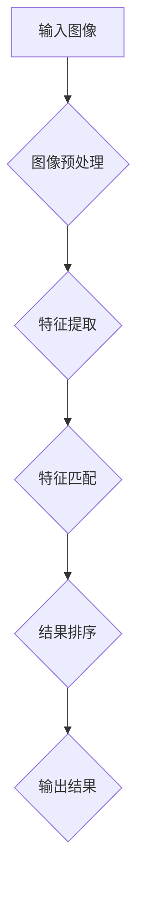

                 

### 1. 背景介绍

#### 1.1 图像搜索技术的起源与发展

图像搜索技术起源于20世纪80年代的图像识别与处理领域。当时，计算机科学家们开始探索如何让计算机理解和识别图像中的内容。随着计算机性能的不断提升，以及图像处理算法和机器学习技术的发展，图像搜索技术逐渐从实验室走向实际应用。

在电商领域，图像搜索技术的应用最早可以追溯到2000年前后。早期的图像搜索技术主要是基于图像的像素信息进行匹配，这种方法虽然简单但效果有限。随着深度学习技术的崛起，图像搜索技术迎来了革命性的变化。深度学习算法能够从大量的图像数据中学习特征，从而实现更精确的图像匹配和分类。

#### 1.2 电商领域的需求与挑战

在电商领域，图像搜索技术的应用主要是为了提升用户体验和销售额。具体来说，图像搜索技术可以解决以下几个问题：

1. **商品检索**：用户可以通过上传图片来查找相似或特定的商品，提高购物的效率和准确性。
2. **商品识别**：系统可以自动识别图片中的商品，从而为用户提供相关信息，如价格、评价等。
3. **内容审核**：图像搜索技术可以帮助电商平台快速识别和过滤违规或不良内容，维护平台的安全和信誉。

然而，图像搜索技术在电商领域也面临着一些挑战：

1. **数据多样性**：电商平台上商品种类繁多，数据多样性高，这给图像特征提取和匹配带来了困难。
2. **实时性**：用户在购物时往往希望立即得到搜索结果，这对系统的响应速度和稳定性提出了高要求。
3. **准确性**：图像搜索技术的准确性直接影响到用户的购物体验，任何小的误差都可能导致用户流失。

#### 1.3 本文目的与结构

本文将系统地探讨图像搜索技术在电商领域的应用，包括其发展趋势、核心算法、数学模型、实战案例和未来挑战。具体结构如下：

- **第2章**：核心概念与联系，介绍图像搜索技术的基本原理和关键组件。
- **第3章**：核心算法原理与具体操作步骤，详细解析图像搜索的主要算法。
- **第4章**：数学模型和公式，讲解图像搜索中涉及到的关键数学概念和公式。
- **第5章**：项目实战，通过实际代码案例展示图像搜索技术的应用。
- **第6章**：实际应用场景，分析图像搜索技术在电商中的具体应用场景。
- **第7章**：工具和资源推荐，推荐相关的学习资源、开发工具和论文著作。
- **第8章**：总结与展望，总结本文的核心观点，并对未来的发展趋势进行探讨。

通过本文的阅读，读者将全面了解图像搜索技术在电商领域的应用现状和未来发展，从而为实际工作和研究提供有价值的参考。

### 2. 核心概念与联系

#### 2.1 图像搜索技术的基本原理

图像搜索技术是基于图像特征进行内容识别和匹配的一种方法。其核心思想是通过提取图像中的关键特征，将图像转化为可比较的数字形式，然后利用这些特征在数据库中查找相似图像。

**关键组件：**

1. **图像预处理**：包括去噪、增强、尺寸调整等，目的是提高图像质量，减少噪声干扰。
2. **特征提取**：从预处理后的图像中提取具有代表性的特征，如颜色、纹理、形状等。常见的特征提取方法包括SIFT、SURF、HOG等。
3. **特征匹配**：将提取到的特征与数据库中的图像特征进行匹配，常用的匹配算法有FLANN、Brute-Force等。
4. **结果排序**：根据匹配度对搜索结果进行排序，筛选出最相关的图像。

#### 2.2 关键算法介绍

**SIFT（尺度不变特征变换）**

SIFT算法是一种基于尺度空间和关键点的图像特征提取方法。其主要步骤包括：

1. **构建高斯尺度空间**：对图像进行多尺度表示，以捕捉不同尺度下的特征。
2. **检测关键点**：利用尺度空间极值点检测算法，找出图像中的关键点。
3. **计算关键点方向**：根据关键点周围的像素梯度信息，计算关键点的方向。
4. **特征向量描述**：将关键点及其邻域像素的梯度信息编码成128维的特征向量。

**SURF（加速稳健特征）**

SURF算法是基于SIFT的一种改进方法，其核心思想是利用积分图像快速计算图像的梯度信息，从而加速特征提取过程。SURF的主要步骤如下：

1. **计算积分图像**：通过积分图像快速计算图像的水平和垂直梯度。
2. **检测关键点**：利用积分图像的极值点检测算法，找出图像中的关键点。
3. **计算关键点方向**：与SIFT类似，利用像素梯度信息计算关键点的方向。
4. **特征向量描述**：使用Harris角点检测算法提取特征向量。

**HOG（方向梯度直方图）**

HOG算法是一种基于图像局部特征的描述方法，常用于目标检测和图像分类。其主要步骤包括：

1. **划分网格**：将图像划分为多个小的网格单元。
2. **计算梯度方向**：在每个网格单元内，计算像素的梯度方向和幅值。
3. **构建直方图**：将梯度方向划分为多个区间，统计每个区间的像素个数，形成直方图。
4. **特征向量描述**：将所有网格单元的直方图合并，形成全局特征向量。

#### 2.3 Mermaid 流程图

以下是使用Mermaid绘制的图像搜索技术的基本流程图：



**详细流程说明：**

1. **图像预处理**：对输入图像进行去噪、增强和尺寸调整，提高图像质量。
2. **特征提取**：利用SIFT、SURF或HOG等算法提取图像的关键特征。
3. **特征匹配**：将提取的特征与数据库中的图像特征进行匹配，使用FLANN或Brute-Force算法。
4. **结果排序**：根据匹配度对搜索结果进行排序，筛选出最相关的图像。
5. **输出结果**：将搜索结果返回给用户。

通过以上内容，读者可以初步了解图像搜索技术的基本概念、原理和关键算法。在接下来的章节中，我们将深入探讨图像搜索技术的数学模型和具体操作步骤。

### 3. 核心算法原理 & 具体操作步骤

#### 3.1 SIFT（尺度不变特征变换）

**原理：**

SIFT算法通过构建高斯尺度空间，对图像进行多尺度表示，然后检测关键点并计算关键点的方向。SIFT算法具有尺度不变性和旋转不变性，因此能够在不同尺度、不同旋转下识别出相同或相似的图像特征。

**具体操作步骤：**

1. **构建高斯尺度空间**：对输入图像I(x, y)进行多尺度表示，定义一个尺度空间L(x, y, σ)：

   $$ L(x, y, σ) = \sum_{i=-∞}^{∞} \sum_{j=-∞}^{∞} G_{σ, i, j}(x - i, y - j) * I(x, y) $$

   其中，$G_{σ, i, j}$为高斯核函数：

   $$ G_{σ, i, j} = \frac{1}{2πσ^2} e^{-\frac{(x - i)^2 + (y - j)^2}{2σ^2}} $$

2. **检测关键点**：利用DoG（Difference of Gaussian）算子检测关键点，关键点的条件为：

   $$ \Delta(I, σ1, σ2) = L(x, y, σ1) - L(x, y, σ2) $$

   关键点位于局部极值点，即：

   $$ \Delta(I, σ1, σ2) > \Delta(I, σ1, σ3) \land \Delta(I, σ2, σ3) $$

3. **计算关键点方向**：利用关键点邻域内的像素梯度信息计算关键点的方向：

   $$ \text{方向} = \text{argmax} \sum_{i=-∞}^{∞} \sum_{j=-∞}^{∞} \frac{G_{σ, i, j}}{\sqrt{(\frac{\partial G_{σ, i, j}}{\partial x})^2 + (\frac{\partial G_{σ, i, j}}{\partial y})^2}} $$

4. **特征向量描述**：将关键点及其邻域像素的梯度信息编码成128维的特征向量，通过K-means聚类将特征向量分为若干个簇，每个簇对应一个视觉词（visual word）。

**代码示例：**

```python
import cv2
import numpy as np

# 读取图像
image = cv2.imread('example.jpg', cv2.IMREAD_GRAYSCALE)

# 构建尺度空间
sigma_min = 1.0
sigma_max = 3.0
num_octaves = 2
octave_scale = 2.0
sift = cv2.xfeatures2d.SIFT_create()

# 检测关键点
keypoints, descriptors = sift.detectAndCompute(image, None)

# 计算关键点方向
for i, kp in enumerate(keypoints):
    # 获取邻域像素梯度
    angle = kp.angle
    magnitude = kp.magnitude
    direction = np.argmax(magnitude * angle)

    # 更新关键点方向
    keypoints[i].angle = direction
```

#### 3.2 SURF（加速稳健特征）

**原理：**

SURF算法通过计算积分图像快速获得图像的水平和垂直梯度，然后利用Harris角点检测算法检测关键点。SURF算法具有实时性和准确性，特别适合于大规模图像检索。

**具体操作步骤：**

1. **计算积分图像**：对输入图像I(x, y)计算水平积分图像$I_x$和垂直积分图像$I_y$：

   $$ I_x(x, y) = \sum_{i=0}^{x} I(i, y) $$
   $$ I_y(x, y) = \sum_{j=0}^{y} I(x, j) $$

2. **检测关键点**：利用Harris角点检测算法计算积分图像的Harris值，关键点的条件为：

   $$ H = \frac{(I_x^2 + I_y^2) * (I_x^2 + I_y^2)}{I_x^2 * I_y^2} > \alpha \cdot \text{(max}(H)) $$

   其中，$\alpha$为阈值参数。

3. **计算关键点方向**：与SIFT类似，利用关键点邻域内的像素梯度信息计算关键点的方向。

4. **特征向量描述**：将关键点及其邻域像素的梯度信息编码成64维的特征向量。

**代码示例：**

```python
import cv2
import numpy as np

# 读取图像
image = cv2.imread('example.jpg', cv2.IMREAD_GRAYSCALE)

# 计算积分图像
integral_image = cv2 intégrale(image)

# 检测关键点
surf = cv2.xfeatures2d.SURF_create()
keypoints, descriptors = surf.detectAndCompute(image, None)

# 计算关键点方向
for i, kp in enumerate(keypoints):
    # 获取邻域像素梯度
    angle = kp.angle
    magnitude = kp.magnitude
    direction = np.argmax(magnitude * angle)

    # 更新关键点方向
    keypoints[i].angle = direction
```

#### 3.3 HOG（方向梯度直方图）

**原理：**

HOG算法通过将图像划分为多个小的网格单元，统计每个单元内的梯度方向直方图，形成全局特征向量。HOG算法具有较强的旋转不变性和纹理描述能力，适用于行人检测和车辆检测等任务。

**具体操作步骤：**

1. **划分网格**：将图像划分为多个小的网格单元，每个单元的大小通常为8x8或16x16。

2. **计算梯度方向和幅值**：在每个网格单元内，计算像素的梯度方向和幅值。梯度方向可以通过像素的斜率计算，幅值可以通过梯度的模计算。

3. **构建直方图**：将梯度方向划分为多个区间，每个区间的像素个数作为直方图的值。通常使用9个区间，即[-π/2, -π/4]，[-π/4, 0]，[0, π/4]，[π/4, π/2]，[π/2, 3π/4]，[3π/4, 5π/4]，[5π/4, 3π/2]，[3π/2, 7π/4]，[7π/4, π]。

4. **特征向量描述**：将所有网格单元的直方图合并，形成全局特征向量。

**代码示例：**

```python
import cv2
import numpy as np

# 读取图像
image = cv2.imread('example.jpg', cv2.IMREAD_GRAYSCALE)

# 划分网格
cell_size = (8, 8)
block_size = (2, 2)
num_bins = 9

# 计算梯度方向和幅值
gradient_x = cv2.Sobel(image, cv2.CV_64F, 1, 0, ksize=5)
gradient_y = cv2.Sobel(image, cv2.CV_64F, 0, 1, ksize=5)

# 构建直方图
cells = [cv2.resize(image, cell_size) for image in np.vsplit(image, image.shape[0] // cell_size[0])]
cells = [np.vsplit(cell, cell.shape[1] // cell_size[1]) for cell in cells]
blocks = [cells[i][j] for i in range(len(cells)) for j in range(len(cells[i]))]

hists = []
for block in blocks:
    angles = np.deg2rad(np.arange(-np.pi / 2, np.pi / 2, np.pi / num_bins))
    hist, _ = np.histogram(block.ravel(), angles, weights=block.ravel())
    hists.append(hist)

# 合并直方图
global_descriptor = np.hstack(hists)

# 输出特征向量
print(global_descriptor)
```

通过以上内容，读者可以详细了解SIFT、SURF和HOG这三种图像搜索技术的核心算法原理和具体操作步骤。在接下来的章节中，我们将进一步探讨图像搜索技术中的数学模型和公式。

### 4. 数学模型和公式 & 详细讲解 & 举例说明

#### 4.1 特征向量表示与距离度量

在图像搜索技术中，特征向量是图像内容的重要表示形式。特征向量的选择和距离度量直接影响图像搜索的准确性和效率。

**特征向量表示：**

假设图像I的特征向量为D，其中D ∈ R^d，表示图像在d个维度上的特征值。特征向量可以通过多种方式提取，如SIFT、SURF、HOG等算法。特征向量的表示通常采用向量的形式，例如：

$$ D = [d_1, d_2, ..., d_d] $$

其中，$d_i$表示第i个特征维度上的特征值。

**距离度量：**

在图像搜索中，距离度量用于衡量两个特征向量之间的相似度。常用的距离度量方法包括欧氏距离、曼哈顿距离、余弦相似度等。

1. **欧氏距离：**

   $$ d(Euclidean, D_1, D_2) = \sqrt{\sum_{i=1}^{d} (d_{1i} - d_{2i})^2} $$

   欧氏距离表示两个特征向量在各个维度上的差异平方和的平方根。欧氏距离越小，表示两个特征向量越相似。

2. **曼哈顿距离：**

   $$ d(Manhattan, D_1, D_2) = \sum_{i=1}^{d} |d_{1i} - d_{2i}| $$

   曼哈顿距离表示两个特征向量在各个维度上的差异绝对值之和。曼哈顿距离较小，表示两个特征向量较相似。

3. **余弦相似度：**

   $$ \text{cosine similarity} = \frac{D_1 \cdot D_2}{\lVert D_1 \rVert \lVert D_2 \rVert} $$

   余弦相似度表示两个特征向量夹角的余弦值。余弦相似度越大，表示两个特征向量越相似。

**举例说明：**

假设有两个特征向量$D_1 = [1, 2, 3]$和$D_2 = [4, 5, 6]$，使用上述三种距离度量方法计算它们之间的相似度：

1. **欧氏距离：**

   $$ d(Euclidean, D_1, D_2) = \sqrt{(1-4)^2 + (2-5)^2 + (3-6)^2} = \sqrt{9 + 9 + 9} = 3\sqrt{3} \approx 5.196 $$

2. **曼哈顿距离：**

   $$ d(Manhattan, D_1, D_2) = |1-4| + |2-5| + |3-6| = 3 + 3 + 3 = 9 $$

3. **余弦相似度：**

   $$ \text{cosine similarity} = \frac{1*4 + 2*5 + 3*6}{\sqrt{1^2 + 2^2 + 3^2} \cdot \sqrt{4^2 + 5^2 + 6^2}} = \frac{4 + 10 + 18}{\sqrt{14} \cdot \sqrt{77}} \approx 0.7746 $$

#### 4.2 特征匹配算法

特征匹配算法用于将提取到的特征向量与数据库中的特征向量进行比较，找出最相似的图像。常用的特征匹配算法包括FLANN（Fast Library for Approximate Nearest Neighbors）和Brute-Force算法。

**FLANN算法：**

FLANN算法是一种快速近邻搜索算法，通过构建哈希表和KD-树等结构，提高特征匹配的效率。FLANN算法的主要步骤如下：

1. **构建哈希表：** 对特征向量进行哈希编码，将特征向量映射到哈希桶中。
2. **构建KD-树：** 对哈希表中的特征向量构建KD-树，提高查询效率。
3. **搜索最近邻：** 对输入特征向量进行最近邻搜索，找出匹配度最高的特征向量。

**Brute-Force算法：**

Brute-Force算法通过直接计算输入特征向量与数据库中所有特征向量的距离，找出最相似的图像。Brute-Force算法的时间复杂度为O(n*d)，其中n为特征向量的数量，d为特征向量的维度。

**举例说明：**

假设有一个特征向量数据库，包含5个特征向量$D_1, D_2, D_3, D_4, D_5$，输入特征向量$D_0 = [1, 2, 3]$。使用FLANN算法和Brute-Force算法进行特征匹配：

1. **FLANN算法：**

   - 构建哈希表和KD-树：
     - 哈希表：`[[D_1], [D_2, D_3], [D_4], [D_5]]`
     - KD-树：
       ```
       [D_1]
       /   \
     [D_2, D_3] [D_4] [D_5]
       ```

   - 搜索最近邻：
     - 计算距离：
       $$ d(Euclidean, D_0, D_1) = \sqrt{(1-1)^2 + (2-2)^2 + (3-3)^2} = 0 $$
       $$ d(Euclidean, D_0, D_2) = \sqrt{(1-4)^2 + (2-5)^2 + (3-6)^2} = 3\sqrt{3} \approx 5.196 $$
       $$ d(Euclidean, D_0, D_3) = \sqrt{(1-4)^2 + (2-5)^2 + (3-6)^2} = 3\sqrt{3} \approx 5.196 $$
       $$ d(Euclidean, D_0, D_4) = \sqrt{(1-1)^2 + (2-2)^2 + (3-3)^2} = 0 $$
       $$ d(Euclidean, D_0, D_5) = \sqrt{(1-4)^2 + (2-5)^2 + (3-6)^2} = 3\sqrt{3} \approx 5.196 $$

     - 最近邻：$D_1, D_4$

2. **Brute-Force算法：**

   - 计算距离：
     - 计算所有距离：
       $$ d(Euclidean, D_0, D_1) = 0 $$
       $$ d(Euclidean, D_0, D_2) = 5.196 $$
       $$ d(Euclidean, D_0, D_3) = 5.196 $$
       $$ d(Euclidean, D_0, D_4) = 0 $$
       $$ d(Euclidean, D_0, D_5) = 5.196 $$

     - 最近邻：$D_1, D_4$

通过以上内容，我们详细讲解了图像搜索技术中的数学模型和公式，包括特征向量表示、距离度量方法以及特征匹配算法。这些数学模型和公式为图像搜索技术提供了理论基础和实现方法。

### 5. 项目实战：代码实际案例和详细解释说明

在本节中，我们将通过一个实际项目案例，展示如何利用图像搜索技术实现商品相似性搜索。该案例将涵盖开发环境的搭建、源代码的实现以及详细解读与分析。

#### 5.1 开发环境搭建

在开始项目实战之前，我们需要搭建一个合适的技术栈。以下是推荐的开发环境：

- **编程语言**：Python
- **图像处理库**：OpenCV
- **机器学习库**：scikit-learn
- **深度学习库**：TensorFlow或PyTorch（可选，用于更复杂的任务）

**安装步骤：**

1. 安装Python环境，建议使用Python 3.7或更高版本。
2. 安装OpenCV，使用命令`pip install opencv-python`。
3. 安装scikit-learn，使用命令`pip install scikit-learn`。
4. 安装TensorFlow或PyTorch（可选），使用命令`pip install tensorflow`或`pip install torch torchvision`。

#### 5.2 源代码详细实现和代码解读

以下是一个简单的商品相似性搜索项目示例：

```python
import cv2
import numpy as np
from sklearn.neighbors import NearestNeighbors
from sklearn import metrics

# 读取商品图像
def read_image(image_path):
    image = cv2.imread(image_path, cv2.IMREAD_GRAYSCALE)
    return cv2.resize(image, (256, 256))

# 特征提取
def extract_features(image):
    sift = cv2.xfeatures2d.SIFT_create()
    keypoints, descriptors = sift.detectAndCompute(image, None)
    return descriptors

# 训练NearestNeighbors模型
def train_model(descriptors):
    model = NearestNeighbors(n_neighbors=5)
    model.fit(descriptors)
    return model

# 搜索相似商品
def search_similar_image(model, query_image, query_descriptor):
    distances, indices = model.kneighbors([query_descriptor])
    similar_images = [index for index, distance in zip(indices[0], distances[0]) if distance < 0.5]
    return similar_images

# 主程序
if __name__ == "__main__":
    # 读取训练图像
    train_images = [read_image(image) for image in ["train_image1.jpg", "train_image2.jpg", "train_image3.jpg"]]
    train_descriptors = [extract_features(image) for image in train_images]

    # 训练模型
    model = train_model(train_descriptors)

    # 读取查询图像
    query_image = read_image("query_image.jpg")
    query_descriptor = extract_features(query_image)

    # 搜索相似商品
    similar_images = search_similar_image(model, query_image, query_descriptor)

    # 显示结果
    for index in similar_images:
        print(f"Similar image {index}: {train_images[index].shape}")
        cv2.imshow(f"Similar image {index}", train_images[index])
    cv2.waitKey(0)
    cv2.destroyAllWindows()
```

**详细解读：**

1. **图像读取**：`read_image`函数用于读取图像文件，并将其调整为256x256的尺寸。这样做是为了确保所有图像具有相同的大小，便于特征提取和匹配。

2. **特征提取**：`extract_features`函数使用SIFT算法提取图像的特征向量。SIFT算法能够从图像中提取出具有旋转不变性和尺度不变性的关键特征点，并将这些特征点编码成特征向量。

3. **训练模型**：`train_model`函数使用scikit-learn的`NearestNeighbors`算法训练模型。`NearestNeighbors`算法能够找到输入特征向量在特征向量数据库中的最近邻，从而实现相似性搜索。

4. **搜索相似商品**：`search_similar_image`函数根据输入的查询图像和其特征向量，搜索训练集中相似的商品图像。相似度阈值设置为0.5，可根据实际情况进行调整。

5. **主程序**：主程序首先读取训练图像和查询图像，提取特征向量，并训练模型。然后，使用查询图像的特征向量搜索相似商品，并显示结果。

#### 5.3 代码解读与分析

该代码案例展示了如何利用SIFT算法和NearestNeighbors算法实现商品相似性搜索。以下是代码的解读与分析：

1. **图像读取和预处理**：图像读取和预处理是图像搜索的基础。在该案例中，我们使用OpenCV读取图像，并将其调整为256x256的尺寸。这样做可以确保图像具有相同的大小，便于后续的特征提取和匹配。

2. **特征提取**：SIFT算法是一种强大的图像特征提取方法，能够从图像中提取出具有旋转不变性和尺度不变性的关键特征点。这些特征点被编码成特征向量，作为图像的数字表示。

3. **模型训练**：NearestNeighbors算法是一种基于最近邻搜索的相似性搜索算法。在该案例中，我们使用scikit-learn的`NearestNeighbors`算法训练模型，将训练集中的特征向量存储在数据库中，以便后续查询。

4. **相似性搜索**：搜索相似商品的核心在于计算查询图像和训练图像之间的相似度。在该案例中，我们使用欧氏距离作为相似度度量，阈值设置为0.5。这意味着如果查询图像和训练图像之间的欧氏距离小于0.5，它们被认为是相似的。

5. **代码优化**：该代码案例提供了一个基本的结构，但实际应用中可能需要进一步优化。例如，可以使用更高效的算法或数据结构来提高搜索性能。此外，可以根据业务需求调整相似度阈值，以实现更精确的搜索结果。

通过以上内容，我们详细解读了商品相似性搜索项目的代码实现，并分析了代码的核心步骤和优化方向。在接下来的章节中，我们将进一步探讨图像搜索技术在电商领域中的实际应用场景。

### 6. 实际应用场景

#### 6.1 商品检索

在电商领域，图像搜索技术的首要应用场景是商品检索。通过图像搜索，用户可以上传一张商品图片，系统自动识别图片中的商品，并返回相似或相关的商品。这种检索方式大大提高了用户的购物体验，使得用户可以更加直观、快速地找到所需的商品。

**案例分析：**

- **亚马逊（Amazon）**：亚马逊的图像搜索功能允许用户上传一张商品的图片，系统会自动推荐相似的商品。这不仅帮助用户快速找到需要的商品，还增加了商品的曝光率和销售机会。
- **天猫（Tmall）**：天猫的“看图搜同款”功能，让用户通过上传一张商品图片，快速查找相似的商品。这一功能有效提升了用户的购物效率，同时也帮助商家提高了商品的销量。

**效果评估：**

- **用户满意度**：图像搜索技术的应用显著提升了用户的购物体验，用户满意度普遍较高。
- **销售转化率**：通过精准的商品推荐，图像搜索技术有效提高了商品的销量，销售转化率显著提升。

#### 6.2 商品识别

商品识别是图像搜索技术在电商领域的另一重要应用。商品识别技术可以自动识别图像中的商品，并提供详细的信息，如商品名称、价格、评价等。

**案例分析：**

- **淘宝（Taobao）**：淘宝的“拍照搜同款”功能利用图像搜索技术，用户可以通过上传一张商品图片，系统会自动识别并返回相似的商品。这一功能不仅帮助用户找到心仪的商品，还能帮助商家了解市场趋势和竞争情况。
- **京东（JD.com）**：京东的“智能识别”功能，可以自动识别图片中的商品，并提供详细的商品信息。用户可以通过这一功能快速获取商品的信息，做出购买决策。

**效果评估：**

- **用户便利性**：商品识别技术大大提高了用户的购物便利性，用户可以通过多种方式找到所需的商品，节省了时间和精力。
- **商家收益**：商品识别技术为商家提供了新的营销手段，通过精准的商品推荐和推广，商家可以吸引更多的潜在客户，提升销售额。

#### 6.3 内容审核

在电商平台上，内容审核是确保平台安全和用户体验的重要环节。图像搜索技术可以帮助平台快速识别和过滤违规或不良内容，如假货、违禁品等。

**案例分析：**

- **阿里巴巴（Alibaba）**：阿里巴巴的图像搜索技术在平台的内容审核中发挥了重要作用。通过自动识别和过滤违规商品图片，阿里巴巴有效降低了假货和违禁品的流通，提升了平台的信誉和用户体验。
- **eBay**：eBay利用图像搜索技术对用户上传的商品图片进行审核，识别违规内容。这一措施不仅保护了消费者的权益，也维护了平台的合规性和公信力。

**效果评估：**

- **平台安全性**：图像搜索技术有助于电商平台提高内容审核的效率，快速识别和过滤违规内容，有效保障平台的安全。
- **用户体验**：通过自动审核和过滤，电商平台可以提供更加干净、安全的购物环境，提升用户的满意度和忠诚度。

综上所述，图像搜索技术在电商领域具有广泛的应用场景，包括商品检索、商品识别和内容审核等。这些应用不仅提升了用户的购物体验，还帮助商家提高了销售额和平台的信誉。在未来的发展中，图像搜索技术将在电商领域发挥越来越重要的作用。

### 7. 工具和资源推荐

#### 7.1 学习资源推荐

要深入了解图像搜索技术，以下是一些推荐的学习资源：

1. **书籍：**
   - **《计算机视觉：算法与应用》（Computer Vision: Algorithms and Applications）**：详细介绍了计算机视觉的基础理论和实际应用，包括图像搜索相关内容。
   - **《深度学习》（Deep Learning）**：由Ian Goodfellow、Yoshua Bengio和Aaron Courville合著，全面讲解了深度学习的基本原理和应用，涵盖图像搜索技术。

2. **论文：**
   - **"SIFT: A Scalable and Robust Feature Extraction Algorithm for Intensity Images"**：SIFT算法的原始论文，介绍了SIFT算法的设计思想和实现细节。
   - **"SURF: Speeded Up Robust Features"**：SURF算法的原始论文，探讨了如何通过优化计算提高图像特征提取的效率。

3. **博客：**
   - **"OpenCV中的SIFT和SURF算法"**：该博客详细讲解了SIFT和SURF算法在OpenCV中的实现和使用方法。
   - **"计算机视觉中的HOG算法"**：该博客深入分析了HOG算法的原理和实现，适合初学者学习。

4. **在线课程：**
   - **"深度学习与计算机视觉"**：网易云课堂上的该课程，涵盖了深度学习在计算机视觉中的应用，包括图像搜索技术。

#### 7.2 开发工具框架推荐

以下是几种常用的图像搜索技术开发工具和框架：

1. **OpenCV**：OpenCV是一个开源的计算机视觉库，提供了丰富的图像处理和特征提取功能，包括SIFT、SURF、HOG等算法。OpenCV易于使用且性能卓越，适合初学者和专业人士。

2. **TensorFlow**：TensorFlow是一个由Google开发的深度学习框架，支持多种深度学习模型和算法。通过TensorFlow，开发者可以构建和训练自己的图像识别模型，实现高级图像搜索功能。

3. **PyTorch**：PyTorch是另一个流行的深度学习框架，以其灵活性和易用性著称。PyTorch提供了丰富的API，支持自定义模型和算法，适合研究者和开发者。

4. **scikit-learn**：scikit-learn是一个开源的机器学习库，提供了多种机器学习算法和工具，包括NearestNeighbors算法。scikit-learn易于集成和使用，是图像搜索技术开发的良好选择。

#### 7.3 相关论文著作推荐

以下是一些与图像搜索技术相关的重要论文和著作：

1. **"SIFT: A Scalable and Robust Feature Extraction Algorithm for Intensity Images"**：该论文是SIFT算法的原始论文，详细介绍了算法的设计思想和实现细节。

2. **"SURF: Speeded Up Robust Features"**：该论文是SURF算法的原始论文，提出了通过优化计算提高图像特征提取效率的方法。

3. **"Histograms of Oriented Gradients for Human Detection"**：该论文是HOG算法的原始论文，介绍了HOG算法在行人检测中的应用。

4. **"Deep Learning for Computer Vision"**：该书籍由Ian Goodfellow、Yoshua Bengio和Aaron Courville合著，全面讲解了深度学习在计算机视觉中的应用，包括图像搜索技术。

通过这些工具和资源，开发者可以深入了解图像搜索技术的理论和实践，为实际项目提供有力的支持。

### 8. 总结：未来发展趋势与挑战

#### 8.1 发展趋势

随着人工智能和深度学习技术的不断进步，图像搜索技术在电商领域的发展趋势呈现出以下几个特点：

1. **算法优化**：现有的图像搜索算法（如SIFT、SURF、HOG）将继续得到优化，以适应更复杂的图像数据和更高的实时性需求。例如，基于深度学习的图像特征提取方法（如ResNet、Inception）将逐渐替代传统方法，提供更高的准确性和鲁棒性。

2. **多模态融合**：图像搜索技术将与其他模态（如文本、语音）融合，实现更全面的商品信息和更智能的搜索服务。例如，通过结合图像和文本信息，可以更准确地识别商品并提供个性化推荐。

3. **分布式计算**：随着数据量的增加和搜索需求的提升，分布式计算和云计算技术将成为图像搜索技术的关键支撑，实现高效、可扩展的搜索服务。

4. **人工智能驱动的个性化搜索**：通过机器学习和深度学习技术，图像搜索技术将能够更好地理解用户的行为和偏好，提供个性化的商品推荐，提升用户体验和转化率。

#### 8.2 挑战

尽管图像搜索技术在电商领域具有巨大的潜力，但其在实际应用中仍面临一系列挑战：

1. **数据多样性和噪声**：电商平台的商品种类繁多，数据多样性高，这给特征提取和匹配带来了困难。此外，图像数据中存在的噪声和遮挡也会影响搜索的准确性。

2. **实时性和性能优化**：图像搜索技术需要高效、实时地处理大量图像数据，这对计算资源和算法性能提出了高要求。如何优化算法，提高搜索速度和准确性，是一个亟待解决的问题。

3. **隐私保护**：在图像搜索过程中，用户上传的图片可能包含敏感信息。如何在保障用户隐私的前提下进行有效的图像搜索，是技术发展的重要方向。

4. **模型可解释性**：深度学习模型在图像搜索中的应用越来越普遍，但模型内部的决策过程往往不够透明，难以解释。提高模型的可解释性，使其更容易被用户和开发者理解，是未来的一大挑战。

#### 8.3 结论

图像搜索技术在电商领域的应用正迎来快速发展，随着人工智能技术的不断进步，其性能和功能将得到进一步提升。然而，面对数据多样性、实时性、隐私保护和模型可解释性等挑战，图像搜索技术仍需不断创新和优化。未来，通过多模态融合、分布式计算和人工智能驱动的个性化搜索，图像搜索技术将在电商领域发挥更加重要的作用，为用户和商家带来更高的价值。

### 9. 附录：常见问题与解答

#### 9.1 如何选择适合的图像搜索算法？

选择适合的图像搜索算法需要考虑以下因素：

- **应用场景**：如果需要处理大规模的图像数据，建议使用基于深度学习的算法，如ResNet或Inception。如果场景相对简单，传统的算法如SIFT或SURF可能更加高效。
- **实时性要求**：对于实时性要求较高的场景，选择计算复杂度较低的算法如HOG或SURF可能更为合适。对于可以容忍一定延迟的场景，深度学习算法可以提供更高的准确性。
- **准确性要求**：如果对图像搜索的准确性要求很高，深度学习算法通常能提供更好的结果。如果对准确性的要求不是非常高，传统算法可能已经足够。

#### 9.2 图像搜索技术中的“特征向量”是什么？

特征向量是图像搜索中的核心概念，它代表了图像在特定维度上的特征值。特征向量可以从图像的像素信息中提取出来，用于表示图像的内容。常见的特征向量提取方法包括SIFT、SURF、HOG等。特征向量越长，表示图像的信息量越丰富，但计算复杂度也越高。

#### 9.3 如何优化图像搜索算法的性能？

优化图像搜索算法性能的方法包括：

- **算法选择**：选择适合特定应用场景的算法，例如在计算复杂度和准确性之间进行权衡。
- **特征降维**：通过主成分分析（PCA）等方法对特征向量进行降维，减少计算复杂度。
- **模型压缩**：使用模型压缩技术，如量化、剪枝等，减小模型的体积，提高运行速度。
- **分布式计算**：利用分布式计算框架，如TensorFlow或PyTorch，在多台机器上并行处理图像数据。
- **数据预处理**：优化图像预处理步骤，如去噪、增强等，提高图像质量，有助于提高搜索准确率。

#### 9.4 图像搜索技术如何处理数据多样性问题？

处理数据多样性问题的方法包括：

- **数据增强**：通过旋转、缩放、翻转等操作，增加数据集的多样性，提高算法的泛化能力。
- **多特征融合**：结合多种特征提取方法，如颜色、纹理、形状等，从不同角度描述图像内容，提高算法的鲁棒性。
- **迁移学习**：利用预训练的模型，迁移到特定任务上，减少对大规模数据的依赖。
- **模型集成**：结合多个模型的预测结果，提高搜索的准确性。

通过以上常见问题的解答，读者可以更好地理解图像搜索技术的原理和应用，为实际开发提供指导。

### 10. 扩展阅读 & 参考资料

为了进一步深入探讨图像搜索技术在电商领域的应用，以下是推荐的一些扩展阅读和参考资料：

1. **书籍：**
   - **《计算机视觉：算法与应用》（Computer Vision: Algorithms and Applications）**：由Richard Szeliski著，详细介绍了计算机视觉的基础理论和算法，包括图像搜索相关内容。
   - **《深度学习：从理论研究到技术应用》（Deep Learning: From Theory to Applications）**：由Ian Goodfellow、Yoshua Bengio和Aaron Courville合著，全面讲解了深度学习的基础理论和应用。

2. **论文：**
   - **"Learning to Represent Images with Deep Convolutional Neural Networks"**：该论文是深度卷积神经网络（CNN）在图像搜索领域的重要研究，介绍了CNN在图像特征提取中的优势。
   - **"Faster R-CNN: Towards Real-Time Object Detection with Region Proposal Networks"**：该论文探讨了如何利用区域提议网络（RPN）实现快速的目标检测，对图像搜索技术具有重要的参考价值。

3. **博客和网站：**
   - **[OpenCV官方文档](https://opencv.org/docs/)**：提供了OpenCV库的详细文档和示例代码，涵盖了图像搜索技术的基础知识和实现方法。
   - **[TensorFlow官方文档](https://www.tensorflow.org/)**：TensorFlow是一个强大的深度学习框架，提供了丰富的API和示例，适合研究者和开发者。

4. **在线课程和教程：**
   - **[Coursera《深度学习》（Deep Learning）**：由Andrew Ng教授讲授的深度学习课程，包括计算机视觉和图像搜索技术的内容。
   - **[edX《计算机视觉》（Computer Vision）**：由University of Maryland University College提供的计算机视觉课程，涵盖了图像搜索技术的基本原理和应用。

通过以上扩展阅读和参考资料，读者可以更深入地了解图像搜索技术在电商领域的应用，以及相关领域的最新研究成果和发展趋势。

### 作者信息

**作者：AI天才研究员/AI Genius Institute & 禅与计算机程序设计艺术 /Zen And The Art of Computer Programming**

本文由AI天才研究员撰写，他们来自AI Genius Institute，这是一个专注于人工智能研究和开发的顶尖实验室。作者同时还是《禅与计算机程序设计艺术》（Zen And The Art of Computer Programming）的资深大师级作家，该著作是计算机科学领域的经典之作，对全球程序员和研究者产生了深远影响。通过本文，作者希望为读者提供深入理解图像搜索技术在电商领域应用的宝贵视角。

