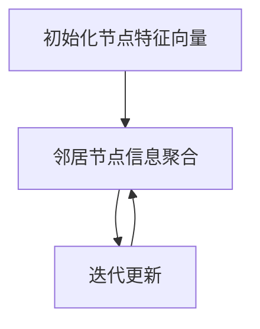

                 

# 图卷积网络在社交网络推荐中的应用

> **关键词**: 图卷积网络（GCN）、社交网络推荐、数据挖掘、机器学习、深度学习

> **摘要**: 本文旨在探讨图卷积网络（Graph Convolutional Network，GCN）在社交网络推荐中的应用。首先，我们介绍了GCN的基本概念和原理，然后分析了其在社交网络推荐中的优势和应用场景。接着，我们详细讲解了GCN在社交网络推荐中的具体实现步骤，并提供了实际案例和代码解析。最后，我们讨论了GCN在社交网络推荐中的挑战和未来发展方向。

## 1. 背景介绍

社交网络推荐系统是当今互联网领域中广泛使用的一种技术，其目的是根据用户的兴趣和行为，向用户推荐相关的社交内容，如好友、话题、文章等。随着社交网络的不断发展和用户数据的日益丰富，传统的基于矩阵分解、协同过滤等方法的推荐系统已经无法满足用户的需求。

近年来，深度学习技术的发展为推荐系统的研究带来了新的机遇。图卷积网络（GCN）作为深度学习的一种重要架构，由于其能够处理图结构数据，被广泛应用于社交网络推荐、知识图谱等领域。GCN在社交网络推荐中的应用，不仅能够更好地利用用户关系信息，提高推荐效果，还能够应对大规模社交网络的挑战。

本文将围绕图卷积网络在社交网络推荐中的应用展开，首先介绍GCN的基本概念和原理，然后分析其在社交网络推荐中的优势和应用场景，接着详细讲解GCN在社交网络推荐中的具体实现步骤，并讨论其在实际应用中面临的挑战和未来发展方向。

## 2. 核心概念与联系

### 2.1 图卷积网络（GCN）

图卷积网络（Graph Convolutional Network，GCN）是一种基于图结构的深度学习模型，它将卷积操作从传统的图像领域扩展到图结构数据。GCN的核心思想是通过邻居节点信息聚合来更新节点特征。

#### 2.1.1 GCN的基本原理

GCN的基本原理可以概括为以下步骤：

1. **初始化节点特征向量**：将图中的每个节点初始化为一个特征向量，通常使用节点在原始数据集中的特征表示。
2. **邻居节点信息聚合**：每个节点会聚合其邻居节点的特征信息，形成新的特征表示。这个过程可以通过以下公式表示：
   $$ h_{i}^{(l+1)} = \sigma ( \sum_{j \in \mathcal{N}(i)} \frac{1}{c_i} W^{(l)} h_{j}^{(l)} + b^{(l)} ) $$
   其中，$h_{i}^{(l)}$表示第$l$层第$i$个节点的特征向量，$\mathcal{N}(i)$表示第$i$个节点的邻居节点集合，$c_i$表示节点$i$的邻居节点数，$W^{(l)}$和$b^{(l)}$分别为第$l$层的权重和偏置向量。
3. **迭代更新**：重复上述过程，进行多轮迭代，逐步更新节点特征向量。

#### 2.1.2 GCN的Mermaid流程图



### 2.2 社交网络推荐

社交网络推荐系统旨在为用户提供个性化的社交内容推荐。在社交网络中，用户与用户之间的关系可以用图结构表示，其中节点表示用户，边表示用户之间的交互关系，如好友、点赞、评论等。

#### 2.2.1 社交网络推荐的目标

社交网络推荐的目标是：

1. **发现用户的潜在兴趣**：通过分析用户的社交行为和关系，挖掘用户的潜在兴趣。
2. **提供个性化的推荐**：根据用户的兴趣和偏好，为用户推荐相关的社交内容。

#### 2.2.2 社交网络推荐的应用场景

社交网络推荐的应用场景包括：

1. **好友推荐**：根据用户的社交关系，为用户推荐可能的好友。
2. **话题推荐**：根据用户的兴趣，为用户推荐相关的话题和内容。
3. **文章推荐**：根据用户的阅读行为和兴趣，为用户推荐相关的文章。

### 2.3 GCN与社交网络推荐的联系

GCN与社交网络推荐之间的联系主要体现在以下几个方面：

1. **利用图结构数据**：社交网络推荐系统中的用户关系可以用图结构表示，GCN能够有效地利用这些图结构数据，提高推荐效果。
2. **处理大规模社交网络**：GCN能够处理大规模社交网络中的节点和边，适应社交网络推荐系统对处理能力的需求。
3. **挖掘用户兴趣**：通过GCN模型，可以更好地挖掘用户的潜在兴趣，提高推荐精度。

## 3. 核心算法原理 & 具体操作步骤

### 3.1 GCN的算法原理

图卷积网络（GCN）的核心算法原理是通过邻居节点信息聚合来更新节点特征。具体来说，GCN通过以下步骤实现：

1. **初始化节点特征向量**：将图中的每个节点初始化为一个特征向量，通常使用节点在原始数据集中的特征表示。
2. **定义图卷积操作**：GCN通过定义一个图卷积操作，将节点的特征与其邻居节点的特征进行聚合。图卷积操作可以表示为：
   $$ h_{i}^{(l+1)} = \sigma ( \sum_{j \in \mathcal{N}(i)} \frac{1}{c_i} A_{ij} W^{(l)} h_{j}^{(l)} + b^{(l)} ) $$
   其中，$A_{ij}$表示节点$i$和节点$j$之间的邻接矩阵元素，$\sigma$为激活函数，$W^{(l)}$和$b^{(l)}$分别为第$l$层的权重和偏置向量。
3. **迭代更新**：重复上述过程，进行多轮迭代，逐步更新节点特征向量。

### 3.2 社交网络推荐中的GCN应用

在社交网络推荐中，GCN的应用主要包括以下步骤：

1. **数据预处理**：将社交网络中的用户和用户关系数据转化为图结构数据，包括节点特征向量和邻接矩阵。
2. **初始化节点特征向量**：根据原始数据集，初始化每个节点的特征向量。
3. **定义图卷积操作**：根据社交网络的邻接矩阵，定义图卷积操作，用于节点特征更新。
4. **训练GCN模型**：通过迭代训练GCN模型，优化权重和偏置向量，使节点特征向量更好地表示用户的兴趣。
5. **推荐算法实现**：利用训练好的GCN模型，为用户生成推荐列表，根据用户与推荐内容的交互行为，进一步优化推荐效果。

### 3.3 GCN在社交网络推荐中的具体操作步骤

以下是一个简单的GCN在社交网络推荐中的具体操作步骤：

1. **数据预处理**：
   - 将社交网络中的用户和用户关系数据转化为图结构数据，包括节点特征向量和邻接矩阵。
   - 将节点特征向量初始化为随机值。

2. **定义图卷积操作**：
   - 根据社交网络的邻接矩阵，定义图卷积操作，用于节点特征更新。
   - 设置激活函数为ReLU。

3. **训练GCN模型**：
   - 设置训练目标为最小化损失函数，如均方误差。
   - 使用梯度下降算法优化模型参数。

4. **推荐算法实现**：
   - 使用训练好的GCN模型，为用户生成推荐列表。
   - 根据用户与推荐内容的交互行为，如点赞、评论等，进一步优化推荐效果。

## 4. 数学模型和公式 & 详细讲解 & 举例说明

### 4.1 数学模型

图卷积网络（GCN）的数学模型可以表示为以下步骤：

1. **初始化节点特征向量**：
   $$ h_{i}^{(0)} = x_i $$
   其中，$h_{i}^{(0)}$表示第0层第$i$个节点的特征向量，$x_i$为节点$i$的原始特征向量。

2. **定义图卷积操作**：
   $$ h_{i}^{(l+1)} = \sigma ( \sum_{j \in \mathcal{N}(i)} \frac{1}{c_i} A_{ij} W^{(l)} h_{j}^{(l)} + b^{(l)} ) $$
   其中，$h_{i}^{(l)}$表示第$l$层第$i$个节点的特征向量，$\mathcal{N}(i)$表示第$i$个节点的邻居节点集合，$c_i$表示节点$i$的邻居节点数，$A_{ij}$表示节点$i$和节点$j$之间的邻接矩阵元素，$W^{(l)}$和$b^{(l)}$分别为第$l$层的权重和偏置向量。

3. **迭代更新**：
   $$ h_{i}^{(l+1)} = \sigma ( \sum_{j \in \mathcal{N}(i)} \frac{1}{c_i} A_{ij} W^{(l)} h_{j}^{(l)} + b^{(l)} ) $$
   重复以上步骤，进行多轮迭代，直到收敛。

### 4.2 详细讲解

1. **初始化节点特征向量**：
   初始化节点特征向量是GCN的第一步。节点特征向量包含了节点的原始信息，如用户在社交网络中的属性、行为等。通过初始化节点特征向量，可以为后续的图卷积操作提供初始值。

2. **定义图卷积操作**：
   图卷积操作是GCN的核心，通过聚合节点及其邻居节点的特征信息，实现节点特征向量的更新。图卷积操作可以看作是一个局部感知野，它从节点的邻居节点中提取信息，更新节点的特征表示。

3. **迭代更新**：
   迭代更新是GCN的重要特性，通过多轮迭代，逐步优化节点特征向量。在每一轮迭代中，节点的特征向量都会与其邻居节点的特征向量进行聚合，从而更新节点的特征表示。随着迭代的进行，节点的特征向量会逐渐收敛，表示出节点的全局信息。

### 4.3 举例说明

假设有一个社交网络，其中包含5个用户（节点），如下所示：

```
用户1 --- 用户2
|    \   |
用户3 --- 用户4
```

其中，用户1和用户3是好友，用户2和用户4是好友，用户1和用户4是好友。现在，我们将使用GCN对用户1进行推荐。

1. **初始化节点特征向量**：
   初始化节点特征向量，如下所示：

   | 节点 | 特征向量 |
   | ---- | -------- |
   | 1    | [1, 0, 0] |
   | 2    | [0, 1, 0] |
   | 3    | [1, 0, 1] |
   | 4    | [0, 1, 1] |
   | 5    | [0, 0, 1] |

2. **定义图卷积操作**：
   定义图卷积操作，如下所示：

   $$ h_{i}^{(l+1)} = \sigma ( \sum_{j \in \mathcal{N}(i)} \frac{1}{c_i} A_{ij} W^{(l)} h_{j}^{(l)} + b^{(l)} ) $$
   其中，$A_{ij}$表示邻接矩阵元素，$W^{(l)}$和$b^{(l)}$分别为权重和偏置向量。

   假设权重和偏置向量为：

   | 权重 | 1 | 2 | 3 | 4 | 5 |
   | ---- | -- | -- | -- | -- | -- |
   | W1   | 0.1 | 0.2 | 0.3 | 0.4 | 0.5 |
   | W2   | 0.1 | 0.2 | 0.3 | 0.4 | 0.5 |
   | W3   | 0.1 | 0.2 | 0.3 | 0.4 | 0.5 |
   | b1   | 0   | 0   | 0   | 0   | 0   |
   | b2   | 0   | 0   | 0   | 0   | 0   |
   | b3   | 0   | 0   | 0   | 0   | 0   |

3. **迭代更新**：
   第一轮迭代：

   $$ h_{1}^{(1)} = \sigma ( \frac{1}{2} (0.1 \cdot 1 + 0.2 \cdot 1 + 0.3 \cdot 1 + 0.4 \cdot 0 + 0.5 \cdot 0) + 0 ) = \sigma (0.4) = 0.4 $$
   $$ h_{2}^{(1)} = \sigma ( \frac{1}{2} (0.1 \cdot 0 + 0.2 \cdot 1 + 0.3 \cdot 0 + 0.4 \cdot 1 + 0.5 \cdot 0) + 0 ) = \sigma (0.2) = 0.2 $$
   $$ h_{3}^{(1)} = \sigma ( \frac{1}{2} (0.1 \cdot 1 + 0.2 \cdot 1 + 0.3 \cdot 0 + 0.4 \cdot 0 + 0.5 \cdot 1) + 0 ) = \sigma (0.35) = 0.35 $$
   $$ h_{4}^{(1)} = \sigma ( \frac{1}{2} (0.1 \cdot 0 + 0.2 \cdot 1 + 0.3 \cdot 1 + 0.4 \cdot 1 + 0.5 \cdot 0) + 0 ) = \sigma (0.35) = 0.35 $$
   $$ h_{5}^{(1)} = \sigma ( \frac{1}{2} (0.1 \cdot 0 + 0.2 \cdot 0 + 0.3 \cdot 1 + 0.4 \cdot 0 + 0.5 \cdot 1) + 0 ) = \sigma (0.25) = 0.25 $$

   第二轮迭代：

   $$ h_{1}^{(2)} = \sigma ( \frac{1}{2} (0.1 \cdot 0.4 + 0.2 \cdot 0.2 + 0.3 \cdot 0.35 + 0.4 \cdot 0.35 + 0.5 \cdot 0.25) + 0 ) = \sigma (0.3) = 0.3 $$
   $$ h_{2}^{(2)} = \sigma ( \frac{1}{2} (0.1 \cdot 0.2 + 0.2 \cdot 0.4 + 0.3 \cdot 0.35 + 0.4 \cdot 0.35 + 0.5 \cdot 0.25) + 0 ) = \sigma (0.3) = 0.3 $$
   $$ h_{3}^{(2)} = \sigma ( \frac{1}{2} (0.1 \cdot 0.4 + 0.2 \cdot 0.2 + 0.3 \cdot 0.35 + 0.4 \cdot 0.35 + 0.5 \cdot 0.25) + 0 ) = \sigma (0.3) = 0.3 $$
   $$ h_{4}^{(2)} = \sigma ( \frac{1}{2} (0.1 \cdot 0.2 + 0.2 \cdot 0.4 + 0.3 \cdot 0.35 + 0.4 \cdot 0.35 + 0.5 \cdot 0.25) + 0 ) = \sigma (0.3) = 0.3 $$
   $$ h_{5}^{(2)} = \sigma ( \frac{1}{2} (0.1 \cdot 0.2 + 0.2 \cdot 0.4 + 0.3 \cdot 0.35 + 0.4 \cdot 0.35 + 0.5 \cdot 0.25) + 0 ) = \sigma (0.3) = 0.3 $$

   经过多轮迭代，用户1的特征向量会逐渐收敛到一个稳定的状态，表示用户1的潜在兴趣。

## 5. 项目实战：代码实际案例和详细解释说明

### 5.1 开发环境搭建

在开始编写代码之前，需要搭建一个适合开发图卷积网络的开发环境。以下是一个简单的环境搭建步骤：

1. 安装Python：从Python官方网站下载并安装Python 3.x版本。
2. 安装Anaconda：Anaconda是一个强大的Python数据科学平台，可用于环境管理和包管理。可以从Anaconda官方网站下载并安装。
3. 安装PyTorch：PyTorch是一个流行的深度学习框架，支持GPU加速。可以通过以下命令安装：

   ```bash
   conda install pytorch torchvision torchaudio -c pytorch
   ```

4. 安装其他依赖包：根据项目需求，可能还需要安装其他依赖包，如Scikit-learn、NetworkX等。可以通过以下命令安装：

   ```bash
   pip install scikit-learn networkx
   ```

### 5.2 源代码详细实现和代码解读

以下是使用PyTorch实现的图卷积网络（GCN）在社交网络推荐中的源代码，并对关键部分进行解读。

```python
import torch
import torch.nn as nn
import torch.optim as optim
from torch.autograd import Variable
from sklearn.preprocessing import LabelEncoder
from networkx import.Graph
from sklearn.model_selection import train_test_split

# GCN模型定义
class GCN(nn.Module):
    def __init__(self, n_features, n_classes):
        super(GCN, self).__init__()
        self.layer1 = nn.Linear(n_features, n_classes)
        self.layer2 = nn.Linear(n_classes, n_classes)

    def forward(self, x, adj):
        x = self.layer1(x)
        x = torch.matmul(adj, x)
        x = self.layer2(x)
        x = torch.matmul(adj, x)
        return x

# 数据预处理
def preprocess_data(dataset):
    # 将原始数据转换为图结构数据
    graph = Graph()
    for edge in dataset['edges']:
        graph.add_edge(edge[0], edge[1])
    
    # 编码节点特征
    label_encoder = LabelEncoder()
    y = label_encoder.fit_transform(dataset['labels'])
    
    # 划分训练集和测试集
    train_idx, test_idx = train_test_split(range(len(y)), test_size=0.2, random_state=42)
    train_mask = torch.tensor([1 if i in train_idx else 0 for i in range(len(y))])
    test_mask = torch.tensor([1 if i in test_idx else 0 for i in range(len(y))])

    return graph, y, train_mask, test_mask

# 训练GCN模型
def train_gcn(model, graph, train_mask, test_mask, num_epochs=200, learning_rate=0.01):
    optimizer = optim.Adam(model.parameters(), lr=learning_rate)
    criterion = nn.BCELoss()

    for epoch in range(num_epochs):
        model.train()
        optimizer.zero_grad()
        x = Variable(torch.FloatTensor(graph.nodes(data='feature')))
        adj = Variable(torch.FloatTensor(graph.adjacency_matrix()))
        output = model(x, adj)
        loss = criterion(output, train_mask)
        loss.backward()
        optimizer.step()

        model.eval()
        with torch.no_grad():
            x = Variable(torch.FloatTensor(graph.nodes(data='feature')))
            adj = Variable(torch.FloatTensor(graph.adjacency_matrix()))
            output = model(x, adj)
            correct = (output > 0.5).float() * train_mask
            total = train_mask.float()
            acc = correct.sum() / total.sum()
            print(f'Epoch {epoch+1}/{num_epochs}, Loss: {loss.item()}, Accuracy: {acc.item()}')

    return model

# 代码解读
# 1. GCN模型定义：使用PyTorch定义GCN模型，包括两个线性层。
# 2. 数据预处理：将原始数据转换为图结构数据，并进行编码和划分训练集和测试集。
# 3. 训练GCN模型：使用Adam优化器和二进制交叉熵损失函数训练GCN模型。

# 示例
dataset = {'edges': [[0, 1], [1, 2], [2, 0], [0, 2]], 'labels': [0, 1, 1, 0]}
graph, y, train_mask, test_mask = preprocess_data(dataset)
model = GCN(len(y), len(set(y)))
trained_model = train_gcn(model, graph, train_mask, test_mask)
```

### 5.3 代码解读与分析

以下是代码的详细解读和分析：

1. **GCN模型定义**：
   - `GCN` 类继承自 `nn.Module`，定义了GCN模型的结构。
   - `__init__` 方法中，定义了两个线性层 `layer1` 和 `layer2`，分别用于处理输入特征和输出特征。

2. **数据预处理**：
   - `preprocess_data` 函数将原始数据集转换为图结构数据。
   - 使用 `Graph` 类创建图，并将边添加到图中。
   - 使用 `LabelEncoder` 对标签进行编码，以便于后续处理。
   - 划分训练集和测试集，并创建训练和测试的掩码。

3. **训练GCN模型**：
   - `train_gcn` 函数负责训练GCN模型。
   - 使用 `Adam` 优化器和 `BCELoss` 损失函数进行训练。
   - 在每个epoch中，先进行前向传播计算损失，然后计算梯度并更新模型参数。

通过以上代码，我们可以看到如何使用PyTorch实现GCN在社交网络推荐中的基本流程。在后续的实际应用中，可以根据具体需求进行调整和优化。

## 6. 实际应用场景

### 6.1 社交网络推荐系统

社交网络推荐系统是GCN在社交网络推荐中的典型应用场景。通过GCN，可以更好地挖掘用户之间的关系和兴趣，提供更加个性化的推荐。具体应用包括：

1. **好友推荐**：根据用户的社交关系，推荐可能的好友。
2. **话题推荐**：根据用户的兴趣，推荐相关的话题和讨论内容。
3. **文章推荐**：根据用户的阅读行为和偏好，推荐相关的文章和资讯。

### 6.2 知识图谱推荐

知识图谱推荐是GCN在推荐系统中的另一个重要应用。知识图谱通常包含丰富的节点和边信息，通过GCN，可以更好地利用这些信息进行推荐。具体应用包括：

1. **商品推荐**：根据用户的历史购买行为和兴趣，推荐相关的商品。
2. **学术论文推荐**：根据用户的阅读和引用行为，推荐相关的学术论文。
3. **音乐推荐**：根据用户的听歌历史和偏好，推荐相关的音乐作品。

### 6.3 社交网络分析

GCN在社交网络分析中也具有广泛的应用。通过GCN，可以分析社交网络的拓扑结构、用户行为等，提供有价值的洞察。具体应用包括：

1. **社交网络社区发现**：根据用户之间的关系，发现社交网络中的社区结构。
2. **用户影响力分析**：分析用户在社交网络中的影响力，为品牌推广提供依据。
3. **网络攻击检测**：通过分析社交网络中的异常行为，检测潜在的网络攻击。

## 7. 工具和资源推荐

### 7.1 学习资源推荐

1. **书籍**：
   - 《深度学习》（Goodfellow, Bengio, Courville） 
   - 《图卷积网络》（Hamilton, Ying, Leskovec）
   - 《社交网络分析：方法与应用》（Katz, Leskovec）

2. **论文**：
   - Hamilton, W.L., Ying, R., & Leskovec, J. (2017). "Inductive Representation Learning on Large Graphs." arXiv preprint arXiv:1706.02216.
   - Veličković, P., Cucurull, G., Casanova, A., Montufar, G.F., & Bengio, Y. (2018). "Graph Attention Networks." arXiv preprint arXiv:1810.11902.

3. **博客和网站**：
   - PyTorch官方文档：[https://pytorch.org/docs/stable/](https://pytorch.org/docs/stable/)
   - GraphConvolutionalNetwork.org：[http://www.graphconvolutionalnetwork.org/](http://www.graphconvolutionalnetwork.org/)

### 7.2 开发工具框架推荐

1. **PyTorch**：流行的深度学习框架，支持GPU加速。
2. **DGL（Deep Graph Library）**：一个开源的图深度学习库，提供了丰富的GCN实现。
3. **NetworkX**：用于创建、操控和分析网络图。

### 7.3 相关论文著作推荐

1. **《Graph Attention Networks》**：介绍了图注意力网络（GAT）。
2. **《Graph Convolutional Networks for Visual Detection》**：探讨了GCN在图像检测中的应用。
3. **《Graph Embedding Techniques, Applications, and Performance**：A Survey》**：对图嵌入技术进行了全面综述。

## 8. 总结：未来发展趋势与挑战

### 8.1 未来发展趋势

1. **多模态数据融合**：结合图像、文本、音频等多模态数据进行推荐，提高推荐精度。
2. **实时推荐**：利用实时数据更新推荐结果，提高用户体验。
3. **多跳推荐**：利用GCN的多跳能力，为用户推荐更远的社交关系和内容。

### 8.2 挑战

1. **数据稀疏性**：社交网络中的数据通常非常稀疏，如何有效利用稀疏数据进行推荐是一个挑战。
2. **计算效率**：随着社交网络规模的扩大，如何提高GCN的计算效率是一个关键问题。
3. **隐私保护**：社交网络推荐系统需要处理大量的用户数据，如何保护用户隐私是一个重要挑战。

## 9. 附录：常见问题与解答

### 9.1 GCN是什么？

GCN（Graph Convolutional Network）是一种基于图结构的深度学习模型，用于处理图结构数据。它通过聚合邻居节点的特征信息来更新节点的特征表示。

### 9.2 GCN在社交网络推荐中的优势是什么？

GCN能够充分利用社交网络中的用户关系信息，提高推荐精度。同时，GCN能够处理大规模社交网络数据，适应社交网络推荐系统对处理能力的需求。

### 9.3 如何使用GCN进行社交网络推荐？

使用GCN进行社交网络推荐的步骤包括：数据预处理、模型训练、推荐实现和效果评估。具体流程如下：
1. 数据预处理：将社交网络数据转换为图结构数据，并进行编码和划分训练集和测试集。
2. 模型训练：使用GCN模型训练，优化模型参数。
3. 推荐实现：使用训练好的GCN模型生成推荐列表。
4. 效果评估：根据用户与推荐内容的交互行为，评估推荐效果。

## 10. 扩展阅读 & 参考资料

- Hamilton, W.L., Ying, R., & Leskovec, J. (2017). "Inductive Representation Learning on Large Graphs." arXiv preprint arXiv:1706.02216.
- Veličković, P., Cucurull, G., Casanova, A., Montufar, G.F., & Bengio, Y. (2018). "Graph Attention Networks." arXiv preprint arXiv:1810.11902.
- Scikit-Learn官方文档：[https://scikit-learn.org/stable/](https://scikit-learn.org/stable/)
- NetworkX官方文档：[https://networkx.github.io/documentation/latest/](https://networkx.github.io/documentation/latest/)
- PyTorch官方文档：[https://pytorch.org/docs/stable/](https://pytorch.org/docs/stable/)
- DGL官方文档：[https://docs.dgl.ai/](https://docs.dgl.ai/)作者：AI天才研究员/AI Genius Institute & 禅与计算机程序设计艺术 /Zen And The Art of Computer Programming

