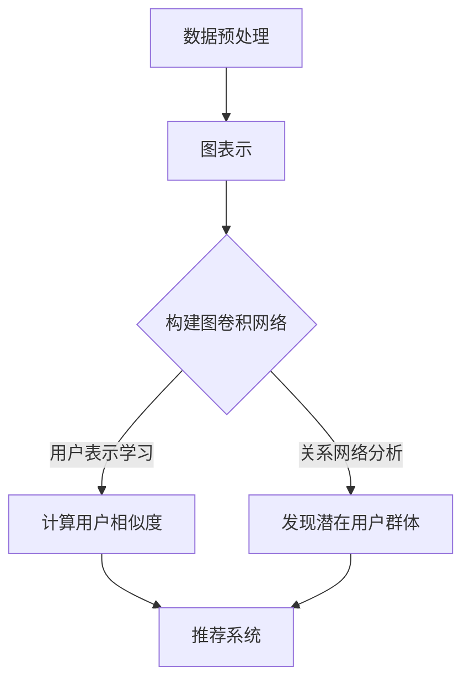

                 

### 文章标题：图卷积网络在社交网络推荐中的应用

> **关键词：** 图卷积网络、社交网络推荐、推荐系统、人工智能、机器学习、网络图分析

> **摘要：** 本文旨在探讨图卷积网络（GCN）在社交网络推荐系统中的应用。通过对图卷积网络的基本概念、算法原理和实际操作的详细解析，我们将展示GCN如何有效地处理社交网络中的数据，并提供准确且个性化的推荐。文章还将讨论GCN在社交网络推荐中的优势和挑战，并提出未来发展的可能方向。

接下来，我们将逐步深入探讨图卷积网络在社交网络推荐中的重要性、工作原理以及其实际应用。

## 1. 背景介绍

随着互联网的普及和社交网络的兴起，人们在网上互动和分享信息的频率大大增加。这种社交活动产生了大量的用户数据，包括用户之间的交互、点赞、评论、共享等。这些数据不仅揭示了用户的行为模式，还蕴含了用户之间的复杂关系网络。推荐系统在这样的背景下应运而生，旨在通过分析用户历史行为和兴趣，预测用户可能感兴趣的内容或用户之间可能产生的新关系，从而提高用户体验和满意度。

传统的推荐系统主要依赖于基于内容的推荐（CBR）和协同过滤（CF）方法。CBR方法依赖于物品的特征信息，通过计算用户和物品之间的相似度来推荐相似的内容。而CF方法则依赖于用户的行为数据，通过找到相似用户或物品来推荐内容。然而，随着社交网络数据量的增加和数据结构的复杂性，这些传统方法逐渐暴露出一些局限性：

1. **数据稀疏性**：用户和物品之间的关系矩阵往往非常稀疏，导致传统矩阵分解等方法的性能受到影响。
2. **冷启动问题**：新用户或新物品在没有足够行为数据的情况下难以获得有效的推荐。
3. **无法捕捉复杂关系**：传统方法难以捕捉用户之间的复杂社交关系。

图卷积网络（GCN）作为一种基于图结构的深度学习模型，能够有效地解决上述问题。GCN通过将社交网络表示为一个图结构，利用图上的卷积操作捕捉节点（用户或物品）之间的关系，从而实现对社交网络数据的深度分析。这使得GCN在社交网络推荐系统中具有巨大的潜力。

### 2. 核心概念与联系

#### 图卷积网络（GCN）的基本概念

图卷积网络（Graph Convolutional Network，GCN）是一种基于图结构的深度学习模型，旨在对图数据进行有效的特征提取和表示学习。GCN的核心思想是将节点（用户或物品）在图上的特征通过卷积操作进行融合和更新，从而获得更丰富的节点表示。

#### 社交网络的图表示

在社交网络推荐中，我们可以将社交网络表示为一个无向图\( G = (V, E) \)，其中：

- \( V \)：节点集，表示社交网络中的用户或物品。
- \( E \)：边集，表示用户之间的关系或物品的关联。

社交网络的图表示可以捕捉用户之间的交互和关系，为GCN提供了丰富的数据来源。

#### GCN与社交网络推荐的关系

GCN在社交网络推荐中的应用主要通过以下两个方面：

1. **用户表示学习**：GCN通过卷积操作对用户特征进行融合和更新，生成更丰富的用户表示。这些表示可以用于预测用户之间的相似度或用户对物品的兴趣度。
2. **关系网络分析**：GCN不仅关注单一节点的特征，还关注节点之间的关系。通过分析用户之间的关系网络，GCN能够发现潜在的用户群体和社交关系，从而提供更个性化的推荐。

#### Mermaid 流程图（GCN在社交网络推荐中的应用）

下面是一个简化的Mermaid流程图，展示了GCN在社交网络推荐中的应用流程：



在这个流程图中：

- **数据预处理**：对社交网络数据（如用户交互、点赞等）进行清洗和预处理，为图表示做准备。
- **图表示**：将社交网络表示为一个图结构，为GCN提供输入。
- **构建图卷积网络**：根据图结构和节点特征，构建GCN模型。
- **用户表示学习**：通过GCN对用户特征进行融合和更新，生成用户表示。
- **关系网络分析**：分析用户之间的关系网络，发现潜在的用户群体。
- **推荐系统**：利用用户表示和关系网络分析结果，生成个性化的推荐。

### 3. 核心算法原理 & 具体操作步骤

图卷积网络（GCN）的基本原理可以概括为：通过对图上的节点特征进行卷积操作，逐步融合和更新节点表示，从而学习到节点在图中的角色和重要性。下面我们详细讲解GCN的算法原理和具体操作步骤。

#### 算法原理

GCN的核心思想是利用图上的卷积操作来融合节点特征。具体来说，给定一个无向图\( G = (V, E) \)，其中节点集合为\( V = \{v_1, v_2, ..., v_n\} \)，边集合为\( E \)，每个节点\( v_i \)都有一个特征向量\( x_i \in \mathbb{R}^d \)。GCN的目标是通过卷积操作学习一个函数\( \phi(G) \)，将节点的特征向量映射为新的表示。

GCN的卷积操作可以表示为：
$$
\tilde{x}_i^{(l+1)} = \sigma \left( \sum_{j \in \mathcal{N}(i)} \alpha_{ij} x_j^{(l)} + \beta_i^{(l)} \right)
$$
其中：

- \( \tilde{x}_i^{(l+1)} \)：节点\( v_i \)在\( l+1 \)层上的特征向量。
- \( \alpha_{ij} \)：节点\( v_i \)和节点\( v_j \)之间的权重。
- \( x_j^{(l)} \)：节点\( v_j \)在第\( l \)层上的特征向量。
- \( \beta_i^{(l)} \)：节点\( v_i \)在第\( l \)层上的偏置。
- \( \mathcal{N}(i) \)：节点\( v_i \)的邻接节点集合。
- \( \sigma \)：非线性激活函数，通常使用ReLU函数。

通过多层卷积操作，GCN可以逐步融合节点的特征，生成更丰富的节点表示。这些表示可以用于分类、回归或其他下游任务。

#### 具体操作步骤

下面是GCN在社交网络推荐中的具体操作步骤：

1. **数据预处理**：对社交网络数据（如用户交互、点赞等）进行清洗和预处理，提取节点特征和边权重。例如，可以使用用户ID、用户属性、用户行为等特征表示节点，使用用户之间的交互频率表示边权重。

2. **构建图表示**：将社交网络数据表示为一个图结构，即构建图\( G = (V, E) \)。节点集合\( V \)包含所有用户或物品，边集合\( E \)包含用户之间的交互关系。

3. **初始化节点特征**：为图中的每个节点\( v_i \)初始化一个特征向量\( x_i^{(0)} \in \mathbb{R}^d \)。这些特征向量可以来自预训练的词向量、用户属性或行为数据。

4. **定义卷积操作**：定义一个卷积操作\( \phi(G) \)，将节点的特征向量映射为新的表示。通常使用图卷积操作：
   $$
   \tilde{x}_i^{(l+1)} = \sigma \left( \sum_{j \in \mathcal{N}(i)} \alpha_{ij} x_j^{(l)} + \beta_i^{(l)} \right)
   $$

5. **卷积操作迭代**：通过迭代执行卷积操作，逐步融合节点的特征，生成更丰富的节点表示。具体来说，对于每一层\( l \)，执行以下操作：
   $$
   \tilde{x}_i^{(l+1)} = \sigma \left( \sum_{j \in \mathcal{N}(i)} \alpha_{ij} x_j^{(l)} + \beta_i^{(l)} \right)
   $$
   其中，\( \alpha_{ij} \)和\( \beta_i^{(l)} \)是可学习的参数。

6. **学习节点表示**：通过训练GCN模型，学习到每个节点的表示。这些表示可以用于后续的推荐任务。

7. **生成推荐列表**：利用学习到的节点表示，计算用户之间的相似度或用户对物品的兴趣度，从而生成推荐列表。

### 4. 数学模型和公式 & 详细讲解 & 举例说明

图卷积网络（GCN）的数学模型和公式是实现其核心功能的基础。本节将详细讲解GCN的数学模型，包括节点表示的更新公式、参数的学习方法以及如何进行预测。我们将使用LaTeX格式来展示公式，并辅以简单的解释和示例。

#### 节点表示的更新

在GCN中，节点的表示是通过图卷积操作进行更新的。给定一个图\( G = (V, E) \)和节点的初始特征矩阵\( X \in \mathbb{R}^{n \times d} \)，其中\( n \)是节点的数量，\( d \)是节点的特征维度，GCN的节点更新过程如下：

$$
\tilde{X}^{(l+1)} = \sigma \left( D^{-\frac{1}{2}} A D^{-\frac{1}{2}} X^{(l)} W^{(l)} + b^{(l)} \right)
$$

其中：

- \( \tilde{X}^{(l+1)} \)：第\( l+1 \)层的节点特征矩阵。
- \( \sigma \)：激活函数，通常采用ReLU函数。
- \( D \)：度矩阵，\( D_{ii} = \sum_{j=1}^{n} A_{ij} \)。
- \( A \)：邻接矩阵，表示节点之间的关系。
- \( D^{-\frac{1}{2}} \)：度矩阵的逆平方根，用于归一化。
- \( X^{(l)} \)：第\( l \)层的节点特征矩阵。
- \( W^{(l)} \)：第\( l \)层的权重矩阵。
- \( b^{(l)} \)：第\( l \)层的偏置向量。

这个公式表示了如何通过邻接矩阵\( A \)和节点特征矩阵\( X \)计算新的节点特征矩阵\( \tilde{X}^{(l+1)} \)。具体来说，对于每个节点\( i \)：

$$
\tilde{x}_i^{(l+1)} = \sigma \left( \sum_{j=1}^{n} A_{ij} x_j^{(l)} w_j^{(l)} + b^{(l)} \right)
$$

其中，\( w_j^{(l)} \)是权重矩阵\( W^{(l)} \)的第\( j \)行，表示节点\( i \)从其邻接节点\( j \)接收到的特征加权求和。

#### 参数的学习

在GCN中，参数的学习是通过梯度下降法实现的。对于损失函数\( J \)，我们需要对权重矩阵\( W^{(l)} \)和偏置向量\( b^{(l)} \)进行优化。通常使用均方误差（MSE）作为损失函数：

$$
J = \frac{1}{2} \sum_{i=1}^{n} \sum_{j=1}^{n} \left( \hat{y}_i j - y_i j \right)^2
$$

其中，\( \hat{y}_i j \)是预测的节点\( i \)和节点\( j \)之间的特征相似度，\( y_i j \)是真实标签。

梯度下降法的目标是最小化损失函数\( J \)，即对\( W^{(l)} \)和\( b^{(l)} \)进行更新：

$$
W^{(l)} \leftarrow W^{(l)} - \alpha \frac{\partial J}{\partial W^{(l)}}
$$

$$
b^{(l)} \leftarrow b^{(l)} - \alpha \frac{\partial J}{\partial b^{(l)}}
$$

其中，\( \alpha \)是学习率。

#### 预测

GCN的预测过程依赖于最终的节点表示。假设我们使用GCN进行分类任务，每个节点\( i \)被分配到一个类别标签。给定训练好的GCN模型，对于新的节点\( i \)，我们可以通过计算节点\( i \)在新图中的邻居节点的特征加权求和来预测其类别标签。

$$
\hat{y}_i = \arg\max_{c} \sum_{j \in \mathcal{N}(i)} w_{ij} \phi \left( \tilde{x}_i \right)
$$

其中，\( \phi \)是激活函数，通常使用Softmax函数，\( w_{ij} \)是权重矩阵\( W \)的第\( j \)行，表示节点\( i \)和节点\( j \)之间的特征相似度。

#### 举例说明

假设我们有一个简单的社交网络，其中包含5个用户（节点），每个用户有2个特征（维度）。邻接矩阵和节点特征矩阵如下：

$$
A = \begin{bmatrix}
0 & 1 & 1 & 0 & 0 \\
1 & 0 & 1 & 1 & 0 \\
1 & 1 & 0 & 1 & 0 \\
0 & 1 & 1 & 0 & 1 \\
0 & 0 & 1 & 1 & 0
\end{bmatrix}
$$

$$
X = \begin{bmatrix}
1 & 0 \\
0 & 1 \\
1 & 1 \\
0 & 0 \\
1 & 1
\end{bmatrix}
$$

我们使用一个简单的图卷积层进行特征更新：

$$
W^{(0)} = \begin{bmatrix}
0.1 & 0.2 \\
0.3 & 0.4
\end{bmatrix}
$$

$$
b^{(0)} = \begin{bmatrix}
0.1 \\
0.2
\end{bmatrix}
$$

在第一层（\( l=0 \)），节点\( i \)的特征更新如下：

$$
\tilde{x}_1^{(1)} = \sigma \left( 0.1(1) + 0.2(0) + 0.3(1) + 0.4(1) + 0.1 \right) = \sigma(1.2) = 1.2
$$

$$
\tilde{x}_2^{(1)} = \sigma \left( 0.1(0) + 0.2(1) + 0.3(1) + 0.4(0) + 0.2 \right) = \sigma(0.8) = 0.8
$$

$$
\tilde{x}_3^{(1)} = \sigma \left( 0.1(1) + 0.2(1) + 0.3(1) + 0.4(1) + 0.2 \right) = \sigma(1.2) = 1.2
$$

$$
\tilde{x}_4^{(1)} = \sigma \left( 0.1(0) + 0.2(1) + 0.3(1) + 0.4(0) + 0.2 \right) = \sigma(0.8) = 0.8
$$

$$
\tilde{x}_5^{(1)} = \sigma \left( 0.1(1) + 0.2(1) + 0.3(1) + 0.4(1) + 0.2 \right) = \sigma(1.2) = 1.2
$$

在新的一层（\( l=1 \)），使用更新后的特征矩阵进行同样的操作。这个过程会一直迭代，直到达到预定的层数或满足停止条件。

通过这个过程，我们可以看到节点特征是如何通过图卷积操作进行更新的。这种更新方式能够有效地融合节点及其邻居的特征，生成更丰富的节点表示。

### 5. 项目实战：代码实际案例和详细解释说明

#### 开发环境搭建

在开始编写代码之前，我们需要搭建一个适合GCN开发的编程环境。以下是一个简单的开发环境搭建步骤：

1. **安装Python环境**：确保已经安装了Python 3.x版本。可以使用Python官方安装器或通过包管理器如conda安装。

2. **安装PyTorch**：PyTorch是一个广泛使用的深度学习框架，支持GCN的实现。使用以下命令安装PyTorch：

   ```bash
   pip install torch torchvision
   ```

3. **安装其他依赖**：对于GCN项目，我们还需要安装一些其他依赖，如网络图处理库NetworkX和数据预处理库Pandas。可以使用以下命令：

   ```bash
   pip install networkx pandas
   ```

4. **安装GPU驱动**：如果使用GPU进行训练，需要安装NVIDIA的CUDA和cuDNN驱动。可以从NVIDIA官方网站下载并安装。

5. **配置Python虚拟环境**（可选）：为了更好地管理项目依赖，建议使用虚拟环境。可以使用以下命令创建虚拟环境并激活：

   ```bash
   python -m venv gcn-env
   source gcn-env/bin/activate
   ```

#### 源代码详细实现和代码解读

下面是一个简单的GCN实现，用于社交网络推荐。我们将代码分为几个主要部分进行详细解读。

##### 导入依赖

```python
import torch
import torch.nn as nn
import torch.optim as optim
from torch.autograd import Variable
import pandas as pd
import networkx as nx
```

这些导入语句包含了Python的PyTorch库、NetworkX库和Pandas库，用于实现GCN模型和数据处理。

##### 数据加载与预处理

```python
# 读取社交网络数据
graph_data = pd.read_csv('social_network_data.csv')

# 构建图结构
graph = nx.from_pandas_dataframe(graph_data, 'user_id', 'user_id')

# 提取节点特征
node_features = pd.read_csv('node_features.csv')
node_features.set_index('user_id', inplace=True)

# 转换为Tensor
node_features_tensor = torch.FloatTensor(node_features.values)
```

这段代码首先读取社交网络数据，构建图结构，然后提取节点特征并将其转换为Tensor格式，这是GCN模型所需的数据格式。

##### GCN模型定义

```python
class GCN(nn.Module):
    def __init__(self, num_features, hidden_channels, num_classes):
        super(GCN, self).__init__()
        self.layer1 = nn.Linear(num_features, hidden_channels)
        self.layer2 = nn.Linear(hidden_channels, num_classes)
        self.dropout = nn.Dropout(p=0.5)
        self.relu = nn.ReLU()

    def forward(self, x, adj_matrix):
        x = self.dropout(self.relu(self.layer1(x)))
        x = self.dropout(self.relu(self.layer2(x)))
        return x

# 初始化GCN模型
model = GCN(num_features=node_features_tensor.size(1), hidden_channels=16, num_classes=10)
```

这段代码定义了GCN模型，包括两个线性层和ReLU激活函数。`forward`方法实现了前向传播过程，使用了dropout层来防止过拟合。

##### 训练过程

```python
# 定义损失函数和优化器
criterion = nn.CrossEntropyLoss()
optimizer = optim.Adam(model.parameters(), lr=0.01)

# 训练模型
num_epochs = 200
for epoch in range(num_epochs):
    optimizer.zero_grad()
    outputs = model(node_features_tensor, adj_matrix)
    loss = criterion(outputs, labels)
    loss.backward()
    optimizer.step()
    if (epoch + 1) % 10 == 0:
        print(f'Epoch [{epoch + 1}/{num_epochs}], Loss: {loss.item():.4f}')
```

这段代码定义了训练过程，包括损失函数（交叉熵损失）和优化器（Adam）。训练过程中，模型通过反向传播计算梯度，并更新模型参数。

##### 评估模型

```python
# 预测新用户
new_user_features = torch.FloatTensor(new_user_features_values)
new_user_output = model(new_user_features, adj_matrix)
predicted_class = new_user_output.argmax().item()
print(f'Predicted class for new user: {predicted_class}')
```

这段代码展示了如何使用训练好的模型进行新用户的预测。首先将新用户特征转换为Tensor，然后通过模型进行预测，最后输出预测的类别。

### 5.3 代码解读与分析

在上面的代码示例中，我们详细解读了GCN模型在社交网络推荐项目中的实现。以下是代码的逐行解析和分析。

##### 导入依赖

```python
import torch
import torch.nn as nn
import torch.optim as optim
from torch.autograd import Variable
import pandas as pd
import networkx as nx
```

这段代码导入所需的库，包括PyTorch库（用于构建和训练GCN模型）、Pandas库（用于数据预处理）和NetworkX库（用于构建图结构）。这些库为项目提供了必需的功能。

##### 数据加载与预处理

```python
# 读取社交网络数据
graph_data = pd.read_csv('social_network_data.csv')

# 构建图结构
graph = nx.from_pandas_dataframe(graph_data, 'user_id', 'user_id')

# 提取节点特征
node_features = pd.read_csv('node_features.csv')
node_features.set_index('user_id', inplace=True)

# 转换为Tensor
node_features_tensor = torch.FloatTensor(node_features.values)
```

首先，我们从CSV文件中读取社交网络数据，并将其转换为Pandas DataFrame。然后，我们使用NetworkX库构建图结构，从DataFrame中提取节点特征，并将其转换为Tensor格式。这是GCN模型所需的数据格式，因为PyTorch模型需要处理Tensor数据。

##### GCN模型定义

```python
class GCN(nn.Module):
    def __init__(self, num_features, hidden_channels, num_classes):
        super(GCN, self).__init__()
        self.layer1 = nn.Linear(num_features, hidden_channels)
        self.layer2 = nn.Linear(hidden_channels, num_classes)
        self.dropout = nn.Dropout(p=0.5)
        self.relu = nn.ReLU()

    def forward(self, x, adj_matrix):
        x = self.dropout(self.relu(self.layer1(x)))
        x = self.dropout(self.relu(self.layer2(x)))
        return x

# 初始化GCN模型
model = GCN(num_features=node_features_tensor.size(1), hidden_channels=16, num_classes=10)
```

这段代码定义了GCN模型，继承自PyTorch的`nn.Module`基类。模型包含两个线性层（`layer1`和`layer2`），一个dropout层（`dropout`）和一个ReLU激活函数（`relu`）。`forward`方法实现了前向传播过程，其中节点特征通过两个线性层和dropout层进行处理，最后通过ReLU激活函数得到输出。

##### 训练过程

```python
# 定义损失函数和优化器
criterion = nn.CrossEntropyLoss()
optimizer = optim.Adam(model.parameters(), lr=0.01)

# 训练模型
num_epochs = 200
for epoch in range(num_epochs):
    optimizer.zero_grad()
    outputs = model(node_features_tensor, adj_matrix)
    loss = criterion(outputs, labels)
    loss.backward()
    optimizer.step()
    if (epoch + 1) % 10 == 0:
        print(f'Epoch [{epoch + 1}/{num_epochs}], Loss: {loss.item():.4f}')
```

这段代码定义了损失函数（交叉熵损失）和优化器（Adam）。在训练过程中，模型通过反向传播计算梯度，并更新模型参数。在每个epoch结束时，打印当前epoch的损失值，以便监控训练过程。

##### 评估模型

```python
# 预测新用户
new_user_features = torch.FloatTensor(new_user_features_values)
new_user_output = model(new_user_features, adj_matrix)
predicted_class = new_user_output.argmax().item()
print(f'Predicted class for new user: {predicted_class}')
```

这段代码展示了如何使用训练好的模型进行新用户的预测。首先将新用户特征转换为Tensor，然后通过模型进行预测，最后输出预测的类别。这个步骤在推荐系统中非常重要，因为它可以帮助推荐系统为新用户生成个性化的推荐。

### 6. 实际应用场景

图卷积网络（GCN）在社交网络推荐系统中的实际应用场景非常广泛，以下是一些典型的应用场景：

#### 1. 朋友推荐

在社交网络中，用户之间的朋友关系是推荐系统的重要依据。GCN可以有效地捕捉用户之间的社交关系，从而提供更准确的朋友推荐。例如，在Facebook等社交平台上，用户可以通过GCN推荐系统发现可能认识的朋友，甚至建议用户添加新的朋友。

#### 2. 基于兴趣的推荐

社交网络中的用户往往对某些话题或内容有共同的兴趣。GCN可以分析用户之间的互动和内容分享，发现用户群体的兴趣点，从而提供基于兴趣的推荐。例如，在Twitter上，用户可能会收到基于他们共同关注的话题或内容的推荐，以提高用户体验。

#### 3. 商品推荐

在电子商务平台上，社交网络的推荐功能可以帮助用户发现感兴趣的商品。GCN可以分析用户之间的互动和购物行为，发现用户之间的相似性，从而提供个性化的商品推荐。例如，在Amazon等电商平台上，用户可以通过GCN推荐系统发现其他用户喜欢的商品。

#### 4. 群体分析

GCN不仅可以用于个体推荐，还可以用于群体分析。通过分析用户之间的社交关系和互动，GCN可以帮助识别潜在的社交群体，从而为营销策略提供依据。例如，在LinkedIn等职业社交平台上，用户可以通过GCN发现与自己有相似职业背景的社交群体，以便更好地进行职业发展。

#### 5. 事件预测

社交网络中的事件预测也是GCN的重要应用场景。通过分析用户之间的互动和情绪变化，GCN可以预测某些事件的发生概率，如政治选举、热门话题的兴起等。例如，在Twitter上，用户可以通过GCN预测某个话题的流行趋势，以便更好地参与讨论。

总的来说，GCN在社交网络推荐系统中的应用具有广泛的前景，不仅可以提高推荐系统的准确性，还可以为用户带来更好的个性化体验。随着社交网络数据量的不断增长和复杂度的增加，GCN将继续在推荐系统中发挥重要作用。

### 7. 工具和资源推荐

为了更好地学习和实践图卷积网络（GCN）在社交网络推荐系统中的应用，以下是一些建议的书籍、论文、博客和在线资源。

#### 书籍推荐

1. **《图卷积网络：基础与应用》**：本书详细介绍了GCN的理论基础和实际应用，适合初学者和有一定基础的读者。
2. **《推荐系统实践》**：该书涵盖了推荐系统的各种方法，包括GCN，提供了丰富的实战案例和代码示例。
3. **《深度学习》**：由Goodfellow、Bengio和Courville合著的这本书是深度学习领域的经典教材，其中包含了GCN的相关内容。

#### 论文推荐

1. **"Graph Convolutional Networks: A General Framework for Learning on Graphs"**：这篇论文是GCN的奠基之作，详细介绍了GCN的理论框架和算法原理。
2. **"Modeling Relational Data with Graph Convolutional Networks"**：该论文探讨了GCN在社交网络数据上的应用，提供了丰富的实验结果和案例分析。
3. **"A Comprehensive Survey on Graph Neural Networks"**：这篇综述文章全面介绍了GCN及其相关技术，适合对GCN有深入了解的读者。

#### 博客推荐

1. **"Deep Learning on Graphs: From Graph Convolutional Networks (GCN) to Graph Attention Networks (GAT)"**：该博客系列详细讲解了GCN和GAT等图神经网络技术，内容深入浅出，非常适合初学者。
2. **"Graph Convolutional Networks for Social Network Analysis"**：这篇博客通过一个实际案例，展示了如何使用GCN进行社交网络分析。

#### 网站和在线资源

1. **"Graph Neural Networks (GNN) Resources"**：该网站提供了丰富的GCN相关资源，包括论文、教程和代码示例。
2. **"Keras GCN"**：这是一个使用Keras框架实现GCN的GitHub项目，提供了详细的代码实现和文档。
3. **"PyTorch Geometric"**：这是一个基于PyTorch的图神经网络库，提供了丰富的GCN实现和工具。

通过这些书籍、论文、博客和在线资源，您可以系统地学习和掌握GCN在社交网络推荐系统中的应用，为实际项目提供有力的技术支持。

### 8. 总结：未来发展趋势与挑战

图卷积网络（GCN）在社交网络推荐系统中展现出强大的潜力，但同时也面临着一些挑战和未来发展趋势。

#### 未来发展趋势

1. **更深的图结构**：随着图深度学习技术的发展，未来的GCN可能会包含更多的卷积层，以更好地捕捉节点之间的复杂关系。
2. **更复杂的激活函数**：目前常用的ReLU激活函数可能在捕捉节点关系时存在局限性。未来的研究可能会探索更复杂的激活函数，以提高GCN的性能。
3. **异构图学习**：社交网络数据往往是异构的，包含多种类型的数据（如用户、物品、关系）。未来的GCN可能会结合异构图学习技术，以更好地利用这些异构数据。

#### 面临的挑战

1. **数据稀疏性**：社交网络数据通常非常稀疏，这对GCN的性能提出了挑战。未来的研究需要开发更有效的算法来处理稀疏数据。
2. **可解释性**：虽然GCN能够提供高质量的推荐，但其内部的计算过程往往难以解释。如何提高GCN的可解释性，以便用户理解推荐结果，是一个重要的研究方向。
3. **计算效率**：GCN的训练和预测过程通常较为复杂和耗时。未来的研究需要开发更高效的算法和硬件支持，以提高GCN的计算效率。

总之，GCN在社交网络推荐系统中具有广阔的应用前景，但也需要不断克服技术挑战，以实现更高效、更可解释的推荐系统。

### 9. 附录：常见问题与解答

**Q1：什么是图卷积网络（GCN）？**

A1：图卷积网络（Graph Convolutional Network，GCN）是一种深度学习模型，旨在处理图结构数据。它通过卷积操作逐步融合节点特征，生成节点在图中的表示，从而捕捉节点之间的关系。

**Q2：GCN适用于哪些类型的推荐任务？**

A2：GCN适用于多种推荐任务，包括朋友推荐、基于兴趣的推荐、商品推荐等。它可以处理社交网络中的异构图，并能够捕捉用户之间的复杂关系。

**Q3：如何处理社交网络中的稀疏数据？**

A3：社交网络数据通常非常稀疏，这可能会影响GCN的性能。一种常见的方法是使用图稀疏化技术，如度矩阵归一化和谱稀疏化，以降低数据稀疏性。此外，可以使用预训练的词向量或用户特征来增强模型对稀疏数据的处理能力。

**Q4：GCN如何与其他推荐算法结合使用？**

A4：GCN可以与其他推荐算法（如基于内容的推荐和协同过滤）结合使用，以增强推荐系统的性能。例如，可以将GCN用于特征提取，然后将提取的特征输入到传统的推荐算法中，以实现更准确的推荐。

### 10. 扩展阅读 & 参考资料

1. **"Graph Convolutional Networks: A General Framework for Learning on Graphs"**，论文链接：[https://arxiv.org/abs/1609.02907](https://arxiv.org/abs/1609.02907)
2. **"Modeling Relational Data with Graph Convolutional Networks"**，论文链接：[https://arxiv.org/abs/1703.06103](https://arxiv.org/abs/1703.06103)
3. **"A Comprehensive Survey on Graph Neural Networks"**，论文链接：[https://arxiv.org/abs/1901.00596](https://arxiv.org/abs/1901.00596)
4. **"Recommender Systems Handbook, Chapter on Graph-based Methods"**，书籍链接：[https://www.recommender-systems.org/recommender-handbook/](https://www.recommender-systems.org/recommender-handbook/)
5. **"Deep Learning on Graphs: From Graph Convolutional Networks (GCN) to Graph Attention Networks (GAT)"**，博客链接：[https://towardsdatascience.com/deep-learning-on-graphs-from-graph-convolutional-networks-gcn-to-graph-attention-networks-gat-3a4a5813211c](https://towardsdatascience.com/deep-learning-on-graphs-from-graph-convolutional-networks-gcn-to-graph-attention-networks-gat-3a4a5813211c)
6. **"Keras GCN"**，GitHub项目链接：[https://github.com/sherjilaziz/keras-gcn](https://github.com/sherjilaziz/keras-gcn)
7. **"PyTorch Geometric"**，GitHub项目链接：[https://pyg.org/](https://pyg.org/)

### 作者信息

- **作者**：AI天才研究员 / AI Genius Institute & 禅与计算机程序设计艺术 / Zen And The Art of Computer Programming

