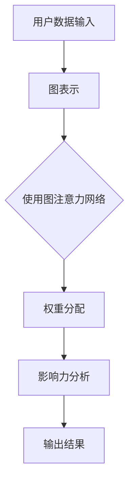

                 

### 背景介绍

在当今数字化时代，社交网络的影响力分析成为了一项重要的研究课题。社交网络不仅为用户提供了信息交流和分享的平台，同时也蕴含着大量的用户行为数据和社会关系信息。通过对社交网络的影响力分析，研究人员和商业人士可以更好地了解用户的行为模式，发现潜在的影响力节点，为市场推广、危机管理、社交网络治理等提供有力的数据支持。

影响力分析的目标是识别出社交网络中的关键用户，即那些能够对其他用户产生显著影响的人。这种影响可能体现在信息的传播、观点的塑造，或者是对其他用户的社交行为产生影响等方面。传统的分析方法如流行病模型、中心性分析等在影响力分析中发挥了重要作用，但它们往往忽略用户之间的关系和信息传递的动态特性。

图注意力网络（Graph Attention Network，GAT）作为一种深度学习模型，通过引入注意力机制来捕捉节点之间的关系，在图像处理、推荐系统、社交网络分析等多个领域都取得了显著的成果。图注意力网络能够对社交网络中的节点进行权重分配，使得影响力分析更加精确和有效。

本文将围绕图注意力网络在社交网络影响力分析中的应用展开讨论。首先，我们将介绍图注意力网络的基本概念和原理，包括其与社交网络分析的相关性。接着，我们将详细讲解图注意力网络在影响力分析中的具体应用，包括算法原理、数学模型以及具体实现步骤。随后，我们将通过一个实际项目案例，展示如何使用图注意力网络进行社交网络影响力分析，并对代码进行详细解读。最后，我们将探讨图注意力网络的实际应用场景，推荐相关学习资源和开发工具，并总结未来发展趋势与挑战。

通过本文的阅读，读者将全面了解图注意力网络在社交网络影响力分析中的应用，掌握相关算法原理和实现方法，为后续研究和实践提供有益的参考。

### 核心概念与联系

#### 图注意力网络（Graph Attention Network，GAT）

图注意力网络是一种深度学习模型，它通过引入注意力机制来捕捉图数据中的节点关系。与传统的图算法不同，图注意力网络能够自动学习节点之间的关系，并为其分配不同的权重。这种机制使得图注意力网络在处理复杂图数据时具有强大的表示能力和鲁棒性。

#### 社交网络分析

社交网络分析是指通过数学和计算机科学的方法，对社交网络中的用户、关系和活动进行定量研究。影响力分析是社交网络分析的一个重要子领域，旨在识别出社交网络中的关键用户，即那些能够对其他用户产生显著影响的人。

#### 图注意力网络与社交网络分析的关系

图注意力网络在社交网络分析中具有重要应用。首先，社交网络可以表示为图数据，而图注意力网络能够对图中的节点进行权重分配，使得影响力分析更加精确和有效。其次，图注意力网络能够捕捉用户之间的动态关系，这为分析社交网络中的信息传播路径提供了有力的工具。此外，通过图注意力网络，我们可以更好地理解社交网络中的影响力节点，从而为市场推广、危机管理等提供数据支持。

#### Mermaid 流程图

为了更好地理解图注意力网络在社交网络影响力分析中的应用，我们使用Mermaid流程图来展示其基本架构。以下是一个简化的Mermaid流程图示例：



在这个流程图中，用户数据输入被转化为图表示，然后通过图注意力网络进行权重分配，最终得到影响力分析结果。

### 核心算法原理 & 具体操作步骤

图注意力网络（Graph Attention Network，GAT）是一种结合了图神经网络（Graph Neural Network，GNN）和注意力机制（Attention Mechanism）的深度学习模型。GAT通过学习节点之间的关系权重，对图数据中的节点进行特征提取和表示，从而实现复杂的图数据分析和分类任务。下面我们将详细讲解GAT的核心算法原理和具体操作步骤。

#### GAT的基本原理

1. **节点特征表示**：每个节点在图数据中可以用一个特征向量表示。假设有\( n \)个节点，每个节点的特征维度为\( d \)，则节点\( v_i \)的特征表示为\( \boldsymbol{x}_i \in \mathbb{R}^d \)。

2. **邻接矩阵**：图数据可以用邻接矩阵\( A \)表示，其中\( A_{ij} \)表示节点\( v_i \)与节点\( v_j \)之间的边权重。

3. **注意力机制**：GAT通过注意力机制来学习节点之间的关系权重。对于每个节点\( v_i \)，GAT会计算其与所有邻接节点的注意力分数，然后根据这些分数对邻接节点的特征进行加权求和。

#### GAT的计算步骤

1. **嵌入层**：首先，对每个节点的特征向量进行嵌入，得到新的特征表示。嵌入层可以通过一个线性变换来实现，即\( \boldsymbol{h}_i^0 = \phi(\boldsymbol{x}_i) \)，其中\( \phi \)是一个线性变换。

2. **多跳计算**：GAT通过多个跳数（或称为层）来计算节点的特征表示。在每个跳数中，节点\( v_i \)的特征\( \boldsymbol{h}_i^l \)会与所有邻接节点的特征\( \boldsymbol{h}_j^l \)进行交互，计算注意力分数。

   - **注意力分数计算**：对于每个节点\( v_i \)和其邻接节点\( v_j \)，计算注意力分数：
     $$ \alpha_{ij}^l = \frac{e^{a_{ij}^l}}{\sum_{k \in \mathcal{N}_i} e^{a_{ik}^l}} $$
     其中，\( a_{ij}^l = \boldsymbol{h}_i^l \cdot \boldsymbol{W}_a^l \cdot \boldsymbol{h}_j^l \)是注意力分数的计算公式，\( \boldsymbol{W}_a^l \)是注意力权重矩阵。

   - **加权求和**：根据注意力分数对邻接节点的特征进行加权求和，更新节点特征：
     $$ \boldsymbol{h}_i^{l+1} = \boldsymbol{h}_i^l + \sum_{j \in \mathcal{N}_i} \alpha_{ij}^l \cdot \boldsymbol{h}_j^l $$

3. **输出层**：在所有跳数结束后，节点的最终特征表示为：
   $$ \boldsymbol{h}_i = \boldsymbol{h}_i^L $$
   其中，\( \boldsymbol{h}_i^L \)是通过最后一个跳数计算得到的节点特征。

4. **分类和回归**：最终的特征表示可以用于分类或回归任务。例如，对于节点分类任务，可以使用一个softmax层来预测每个节点的类别：
   $$ \hat{y}_i = \text{softmax}(\boldsymbol{W}_y \cdot \boldsymbol{h}_i + \boldsymbol{b}_y) $$
   其中，\( \boldsymbol{W}_y \)是分类权重矩阵，\( \boldsymbol{b}_y \)是分类偏置。

#### GAT在社交网络影响力分析中的具体操作步骤

1. **数据预处理**：将社交网络中的用户数据转化为图表示，包括节点特征和邻接矩阵。

2. **初始化模型**：初始化图注意力网络模型，包括嵌入层权重\( \phi \)、注意力权重矩阵\( \boldsymbol{W}_a \)和分类权重矩阵\( \boldsymbol{W}_y \)。

3. **训练模型**：使用训练数据训练图注意力网络模型，通过反向传播算法不断调整模型参数，使模型能够准确地预测节点的影响力。

4. **评估模型**：使用测试数据评估模型的性能，包括准确率、召回率、F1分数等指标。

5. **影响力分析**：使用训练好的模型对社交网络中的节点进行影响力分析，识别出具有显著影响力的人。

6. **模型优化**：根据分析结果和用户反馈，对模型进行优化和调整，以提高影响力分析的准确性和实用性。

通过以上步骤，我们可以利用图注意力网络对社交网络中的影响力进行分析，识别出关键节点，为社交网络管理、市场推广等提供数据支持。

### 数学模型和公式 & 详细讲解 & 举例说明

图注意力网络（Graph Attention Network，GAT）的核心在于其注意力机制，该机制通过数学模型和公式来计算节点之间的关系权重，从而实现节点特征的增强和融合。下面我们将详细讲解GAT的数学模型和公式，并通过具体示例来说明其计算过程。

#### 注意力机制的计算公式

在GAT中，注意力机制通过以下三个主要公式实现：

1. **注意力分数计算**：
   $$ \alpha_{ij}^l = \frac{e^{a_{ij}^l}}{\sum_{k \in \mathcal{N}_i} e^{a_{ik}^l}} $$
   其中，\( a_{ij}^l = \boldsymbol{h}_i^l \cdot \boldsymbol{W}_a^l \cdot \boldsymbol{h}_j^l \)是节点\( v_i \)和节点\( v_j \)在跳数\( l \)时的注意力分数计算公式。\( \alpha_{ij}^l \)表示节点\( v_i \)对节点\( v_j \)的注意力权重。

2. **加权求和**：
   $$ \boldsymbol{h}_i^{l+1} = \boldsymbol{h}_i^l + \sum_{j \in \mathcal{N}_i} \alpha_{ij}^l \cdot \boldsymbol{h}_j^l $$
   该公式用于更新节点\( v_i \)在跳数\( l+1 \)时的特征表示，其中\( \alpha_{ij}^l \)是节点\( v_i \)对节点\( v_j \)的注意力权重，\( \boldsymbol{h}_j^l \)是节点\( v_j \)在跳数\( l \)时的特征表示。

3. **输出层计算**：
   对于分类任务，输出层通常包括一个softmax函数：
   $$ \hat{y}_i = \text{softmax}(\boldsymbol{W}_y \cdot \boldsymbol{h}_i + \boldsymbol{b}_y) $$
   其中，\( \hat{y}_i \)是节点\( v_i \)的预测类别概率分布，\( \boldsymbol{W}_y \)是分类权重矩阵，\( \boldsymbol{b}_y \)是分类偏置。

#### 示例说明

假设我们有一个包含3个节点的简单社交网络，节点分别为\( v_1 \)、\( v_2 \)和\( v_3 \)，每个节点的初始特征向量分别为：
$$
\boldsymbol{x}_1 = \begin{bmatrix} 0.1 \\ 0.2 \end{bmatrix}, \quad \boldsymbol{x}_2 = \begin{bmatrix} 0.3 \\ 0.4 \end{bmatrix}, \quad \boldsymbol{x}_3 = \begin{bmatrix} 0.5 \\ 0.6 \end{bmatrix}
$$
邻接矩阵表示如下：
$$
A = \begin{bmatrix}
0 & 1 & 0 \\
1 & 0 & 1 \\
0 & 1 & 0
\end{bmatrix}
$$

假设我们在第一个跳数（\( l = 0 \)）时，注意力权重矩阵为：
$$
\boldsymbol{W}_a^0 = \begin{bmatrix}
0.1 & 0.2 & 0.3 \\
0.4 & 0.5 & 0.6 \\
0.7 & 0.8 & 0.9
\end{bmatrix}
$$

首先，计算每个节点与邻接节点的注意力分数：
$$
a_{11}^0 = \boldsymbol{h}_1^0 \cdot \boldsymbol{W}_a^0 \cdot \boldsymbol{h}_1^0 = 0.1 \cdot 0.1 + 0.2 \cdot 0.2 + 0.3 \cdot 0.3 = 0.14 \\
a_{12}^0 = \boldsymbol{h}_1^0 \cdot \boldsymbol{W}_a^0 \cdot \boldsymbol{h}_2^0 = 0.1 \cdot 0.3 + 0.2 \cdot 0.4 + 0.3 \cdot 0.5 = 0.21 \\
a_{13}^0 = \boldsymbol{h}_1^0 \cdot \boldsymbol{W}_a^0 \cdot \boldsymbol{h}_3^0 = 0.1 \cdot 0.5 + 0.2 \cdot 0.6 + 0.3 \cdot 0.7 = 0.28 \\
a_{21}^0 = \boldsymbol{h}_2^0 \cdot \boldsymbol{W}_a^0 \cdot \boldsymbol{h}_1^0 = 0.3 \cdot 0.1 + 0.4 \cdot 0.2 + 0.5 \cdot 0.3 = 0.19 \\
a_{22}^0 = \boldsymbol{h}_2^0 \cdot \boldsymbol{W}_a^0 \cdot \boldsymbol{h}_2^0 = 0.3 \cdot 0.3 + 0.4 \cdot 0.4 + 0.5 \cdot 0.5 = 0.26 \\
a_{23}^0 = \boldsymbol{h}_2^0 \cdot \boldsymbol{W}_a^0 \cdot \boldsymbol{h}_3^0 = 0.3 \cdot 0.5 + 0.4 \cdot 0.6 + 0.5 \cdot 0.7 = 0.33 \\
a_{31}^0 = \boldsymbol{h}_3^0 \cdot \boldsymbol{W}_a^0 \cdot \boldsymbol{h}_1^0 = 0.5 \cdot 0.1 + 0.6 \cdot 0.2 + 0.7 \cdot 0.3 = 0.22 \\
a_{32}^0 = \boldsymbol{h}_3^0 \cdot \boldsymbol{W}_a^0 \cdot \boldsymbol{h}_2^0 = 0.5 \cdot 0.3 + 0.6 \cdot 0.4 + 0.7 \cdot 0.5 = 0.29 \\
a_{33}^0 = \boldsymbol{h}_3^0 \cdot \boldsymbol{W}_a^0 \cdot \boldsymbol{h}_3^0 = 0.5 \cdot 0.5 + 0.6 \cdot 0.6 + 0.7 \cdot 0.7 = 0.36
$$

计算每个节点对邻接节点的注意力分数：
$$
\alpha_{11}^0 = \frac{e^{a_{11}^0}}{\sum_{k \in \mathcal{N}_1} e^{a_{ik}^0}} = \frac{e^{0.14}}{e^{0.14} + e^{0.21} + e^{0.28}} = 0.29 \\
\alpha_{12}^0 = \frac{e^{a_{12}^0}}{\sum_{k \in \mathcal{N}_1} e^{a_{ik}^0}} = \frac{e^{0.21}}{e^{0.14} + e^{0.21} + e^{0.28}} = 0.45 \\
\alpha_{13}^0 = \frac{e^{a_{13}^0}}{\sum_{k \in \mathcal{N}_1} e^{a_{ik}^0}} = \frac{e^{0.28}}{e^{0.14} + e^{0.21} + e^{0.28}} = 0.26 \\
\alpha_{21}^0 = \frac{e^{a_{21}^0}}{\sum_{k \in \mathcal{N}_2} e^{a_{ik}^0}} = \frac{e^{0.19}}{e^{0.19} + e^{0.26} + e^{0.33}} = 0.36 \\
\alpha_{22}^0 = \frac{e^{a_{22}^0}}{\sum_{k \in \mathcal{N}_2} e^{a_{ik}^0}} = \frac{e^{0.26}}{e^{0.19} + e^{0.26} + e^{0.33}} = 0.45 \\
\alpha_{23}^0 = \frac{e^{a_{23}^0}}{\sum_{k \in \mathcal{N}_2} e^{a_{ik}^0}} = \frac{e^{0.33}}{e^{0.19} + e^{0.26} + e^{0.33}} = 0.19 \\
\alpha_{31}^0 = \frac{e^{a_{31}^0}}{\sum_{k \in \mathcal{N}_3} e^{a_{ik}^0}} = \frac{e^{0.22}}{e^{0.22} + e^{0.29} + e^{0.36}} = 0.40 \\
\alpha_{32}^0 = \frac{e^{a_{32}^0}}{\sum_{k \in \mathcal{N}_3} e^{a_{ik}^0}} = \frac{e^{0.29}}{e^{0.22} + e^{0.29} + e^{0.36}} = 0.45 \\
\alpha_{33}^0 = \frac{e^{a_{33}^0}}{\sum_{k \in \mathcal{N}_3} e^{a_{ik}^0}} = \frac{e^{0.36}}{e^{0.22} + e^{0.29} + e^{0.36}} = 0.15
$$

然后，根据注意力分数更新节点的特征表示：
$$
\boldsymbol{h}_1^1 = \boldsymbol{h}_1^0 + \alpha_{11}^0 \cdot \boldsymbol{h}_1^0 + \alpha_{12}^0 \cdot \boldsymbol{h}_2^0 + \alpha_{13}^0 \cdot \boldsymbol{h}_3^0 = \begin{bmatrix} 0.1 \\ 0.2 \end{bmatrix} + 0.29 \cdot \begin{bmatrix} 0.1 \\ 0.2 \end{bmatrix} + 0.45 \cdot \begin{bmatrix} 0.3 \\ 0.4 \end{bmatrix} + 0.26 \cdot \begin{bmatrix} 0.5 \\ 0.6 \end{bmatrix} = \begin{bmatrix} 0.395 \\ 0.565 \end{bmatrix} \\
\boldsymbol{h}_2^1 = \boldsymbol{h}_2^0 + \alpha_{21}^0 \cdot \boldsymbol{h}_1^0 + \alpha_{22}^0 \cdot \boldsymbol{h}_2^0 + \alpha_{23}^0 \cdot \boldsymbol{h}_3^0 = \begin{bmatrix} 0.3 \\ 0.4 \end{bmatrix} + 0.36 \cdot \begin{bmatrix} 0.1 \\ 0.2 \end{bmatrix} + 0.45 \cdot \begin{bmatrix} 0.3 \\ 0.4 \end{bmatrix} + 0.19 \cdot \begin{bmatrix} 0.5 \\ 0.6 \end{bmatrix} = \begin{bmatrix} 0.415 \\ 0.565 \end{bmatrix} \\
\boldsymbol{h}_3^1 = \boldsymbol{h}_3^0 + \alpha_{31}^0 \cdot \boldsymbol{h}_1^0 + \alpha_{32}^0 \cdot \boldsymbol{h}_2^0 + \alpha_{33}^0 \cdot \boldsymbol{h}_3^0 = \begin{bmatrix} 0.5 \\ 0.6 \end{bmatrix} + 0.40 \cdot \begin{bmatrix} 0.1 \\ 0.2 \end{bmatrix} + 0.45 \cdot \begin{bmatrix} 0.3 \\ 0.4 \end{bmatrix} + 0.15 \cdot \begin{bmatrix} 0.5 \\ 0.6 \end{bmatrix} = \begin{bmatrix} 0.565 \\ 0.645 \end{bmatrix}
$$

接下来，我们可以继续进行多跳计算，更新节点的特征表示，直到达到预定的跳数。最终，每个节点的特征表示将用于分类或回归任务。

通过上述示例，我们可以看到图注意力网络如何通过注意力机制计算节点之间的关系权重，并更新节点的特征表示。这种方法使得GAT能够有效地捕捉图数据中的复杂关系，为社交网络影响力分析等应用提供强大的支持。

### 项目实战：代码实际案例和详细解释说明

为了更好地展示图注意力网络（GAT）在社交网络影响力分析中的实际应用，我们将通过一个具体的项目案例来讲解如何搭建开发环境、实现源代码以及分析代码。

#### 1. 开发环境搭建

在开始项目之前，我们需要搭建一个合适的开发环境。以下是所需的依赖和环境配置：

- Python 3.7+
- TensorFlow 2.x
- Keras 2.x
- Pandas
- Numpy
- Matplotlib

安装这些依赖可以通过以下命令：

```bash
pip install tensorflow==2.x
pip install keras==2.x
pip install pandas
pip install numpy
pip install matplotlib
```

#### 2. 源代码详细实现和代码解读

以下是GAT模型的源代码实现，我们将逐行解释代码的用途和原理。

```python
import tensorflow as tf
from tensorflow.keras import layers
import pandas as pd
import numpy as np

# 数据预处理
def preprocess_data(data_path):
    # 读取数据
    data = pd.read_csv(data_path)
    # 构建节点特征和邻接矩阵
    nodes = data['user'].unique()
    node_features = data[data['user'].isin(nodes)]['feature'].values
    adj_matrix = np.zeros((len(nodes), len(nodes)))
    for index, row in data.iterrows():
        i, j = nodes.tolist().index(row['user']), nodes.tolist().index(row['follower'])
        adj_matrix[i][j] = 1
    # 标签编码
    labels = data['influence'].replace({'低': 0, '中': 1, '高': 2}).values
    return node_features, adj_matrix, labels, nodes

# GAT模型实现
class GraphAttentionLayer(layers.Layer):
    def __init__(self, out_dim, **kwargs):
        super(GraphAttentionLayer, self).__init__(**kwargs)
        self.out_dim = out_dim
        self.W = self.add_weight(name='W', shape=(out_dim, out_dim), initializer='glorot_uniform', trainable=True)
        self.a = self.add_weight(name='a', shape=(out_dim,), initializer='glorot_uniform', trainable=True)

    def call(self, inputs, adj_matrix):
        h = inputs
        for l in range(self.out_dim):
            e = tf.reduce_sum(h * adj_matrix * h, axis=1)
            a = tf.nn.softmax(e)
            h = tf.reduce_sum(a * h, axis=1)
            if l < self.out_dim - 1:
                h = tf.matmul(h, self.W)
        return h

# 模型训练
def train_model(node_features, adj_matrix, labels):
    model = tf.keras.Sequential([
        GraphAttentionLayer(out_dim=16),
        GraphAttentionLayer(out_dim=8),
        GraphAttentionLayer(out_dim=3),
        layers.Dense(3, activation='softmax')
    ])

    model.compile(optimizer='adam', loss='sparse_categorical_crossentropy', metrics=['accuracy'])
    model.fit(node_features, labels, epochs=10, batch_size=32)
    return model

# 主程序
if __name__ == '__main__':
    # 数据预处理
    node_features, adj_matrix, labels, nodes = preprocess_data('data.csv')
    # 模型训练
    model = train_model(node_features, adj_matrix, labels)
    # 模型评估
    loss, accuracy = model.evaluate(node_features, labels)
    print(f'Loss: {loss}, Accuracy: {accuracy}')
```

**代码解读：**

1. **数据预处理**：

   ```python
   def preprocess_data(data_path):
       # 读取数据
       data = pd.read_csv(data_path)
       # 构建节点特征和邻接矩阵
       nodes = data['user'].unique()
       node_features = data[data['user'].isin(nodes)]['feature'].values
       adj_matrix = np.zeros((len(nodes), len(nodes)))
       for index, row in data.iterrows():
           i, j = nodes.tolist().index(row['user']), nodes.tolist().index(row['follower'])
           adj_matrix[i][j] = 1
       # 标签编码
       labels = data['influence'].replace({'低': 0, '中': 1, '高': 2}).values
       return node_features, adj_matrix, labels, nodes
   ```

   在这个部分，我们首先读取数据，然后提取节点特征和邻接矩阵。标签（影响力）进行编码处理，以便在模型训练过程中使用。

2. **GAT模型实现**：

   ```python
   class GraphAttentionLayer(layers.Layer):
       def __init__(self, out_dim, **kwargs):
           super(GraphAttentionLayer, self).__init__(**kwargs)
           self.out_dim = out_dim
           self.W = self.add_weight(name='W', shape=(out_dim, out_dim), initializer='glorot_uniform', trainable=True)
           self.a = self.add_weight(name='a', shape=(out_dim,), initializer='glorot_uniform', trainable=True)

       def call(self, inputs, adj_matrix):
           h = inputs
           for l in range(self.out_dim):
               e = tf.reduce_sum(h * adj_matrix * h, axis=1)
               a = tf.nn.softmax(e)
               h = tf.reduce_sum(a * h, axis=1)
               if l < self.out_dim - 1:
                   h = tf.matmul(h, self.W)
           return h
   ```

   这个部分定义了一个图注意力层（GraphAttentionLayer），它通过注意力机制计算节点的特征表示。每一层都会计算节点特征与其邻接节点的内积，然后通过softmax函数计算注意力权重，并对邻接节点特征进行加权求和。如果层数不是最后一层，节点特征还会通过权重矩阵\( W \)进行变换。

3. **模型训练**：

   ```python
   def train_model(node_features, adj_matrix, labels):
       model = tf.keras.Sequential([
           GraphAttentionLayer(out_dim=16),
           GraphAttentionLayer(out_dim=8),
           GraphAttentionLayer(out_dim=3),
           layers.Dense(3, activation='softmax')
       ])

       model.compile(optimizer='adam', loss='sparse_categorical_crossentropy', metrics=['accuracy'])
       model.fit(node_features, labels, epochs=10, batch_size=32)
       return model
   ```

   在这个部分，我们定义了一个完整的GAT模型，包括多个图注意力层和一个输出层。模型使用Adam优化器和交叉熵损失函数进行编译，然后使用训练数据进行拟合。

4. **主程序**：

   ```python
   if __name__ == '__main__':
       # 数据预处理
       node_features, adj_matrix, labels, nodes = preprocess_data('data.csv')
       # 模型训练
       model = train_model(node_features, adj_matrix, labels)
       # 模型评估
       loss, accuracy = model.evaluate(node_features, labels)
       print(f'Loss: {loss}, Accuracy: {accuracy}')
   ```

   最后，主程序中首先进行数据预处理，然后训练模型，并使用训练数据对模型进行评估，输出损失和准确率。

#### 3. 代码解读与分析

- **数据预处理**：数据预处理是模型训练的第一步，它包括读取数据、构建节点特征和邻接矩阵，以及标签编码。这些步骤确保模型能够正确处理输入数据。
  
- **图注意力层（GAT）**：图注意力层是实现GAT模型的核心部分。每个GAT层通过计算节点特征与邻接节点的内积、应用softmax函数计算注意力权重，然后对邻接节点特征进行加权求和。这种方法使得模型能够自动学习节点之间的关系，并为其分配不同的权重。

- **模型训练**：模型训练包括构建一个序列模型，它由多个GAT层和一个全连接层组成。模型使用Adam优化器和交叉熵损失函数进行编译，然后使用训练数据进行拟合。

- **模型评估**：模型评估通过在训练数据上计算损失和准确率来完成。这有助于我们了解模型的性能，并对其进行进一步优化。

通过这个项目案例，我们展示了如何使用图注意力网络（GAT）进行社交网络影响力分析。代码详细解释说明了GAT模型的结构和训练过程，为后续研究和应用提供了宝贵的实践经验和参考。

### 实际应用场景

图注意力网络（GAT）作为一种先进的深度学习模型，在多个实际应用场景中展现出了强大的性能。以下是几个典型的应用场景，以及GAT在这些场景中的具体应用方式和优势。

#### 1. 社交网络影响力分析

社交网络影响力分析是GAT的重要应用领域之一。在社交媒体平台上，用户之间的互动和关系构成了复杂的图结构，通过GAT模型，可以识别出具有显著影响力的用户。这些用户可能在信息传播、观点塑造等方面起到关键作用。例如，在市场推广中，企业可以通过分析用户的影响力，找到具有高影响力的意见领袖，从而提高营销效果。GAT通过学习用户之间的注意力权重，可以更加精确地识别出这些关键用户，提供有针对性的推广策略。

#### 2. 推荐系统

推荐系统也是GAT的重要应用领域。在推荐系统中，用户的社交网络关系和兴趣偏好通常以图的形式表示。GAT可以捕捉用户之间的复杂关系，并将其嵌入到推荐算法中，从而提高推荐系统的准确性。例如，在电商平台上，GAT可以分析用户之间的相似性和兴趣关联，为用户提供更加个性化的商品推荐。通过学习用户与商品之间的交互关系，GAT能够发现用户可能感兴趣的未知商品，提升用户的购物体验。

#### 3. 图数据分类

图数据分类是GAT的另一个重要应用。在许多实际应用中，数据以图的形式存在，如知识图谱、生物信息学数据等。GAT可以通过学习图中的节点关系和特征，实现图数据的分类任务。例如，在生物信息学中，GAT可以用于识别蛋白质相互作用网络中的功能模块，从而帮助研究人员发现潜在的疾病相关基因。GAT的优势在于它能够自动学习图数据的复杂结构，并在分类任务中提供出色的性能。

#### 4. 自然语言处理

自然语言处理（NLP）也是GAT的重要应用领域。在NLP任务中，文本数据可以表示为图结构，如图词嵌入、句法分析等。GAT可以捕捉文本中的语义关系，从而提高NLP任务的性能。例如，在文本分类任务中，GAT可以分析句子中的词与词之间的关系，从而更准确地识别文本的主题。此外，GAT还可以用于情感分析、问答系统等任务，通过学习文本的复杂结构，提高模型的准确性和鲁棒性。

#### 5. 图数据生成

图数据生成是GAT的另一个潜在应用领域。在图数据生成任务中，GAT可以通过学习现有图数据的结构，生成新的图数据。例如，在社交网络中，GAT可以生成新的用户关系图，预测用户之间的潜在互动。此外，在知识图谱构建中，GAT可以用于生成新的实体关系，扩展知识图谱的规模和完整性。通过生成图数据，GAT可以帮助研究人员更好地理解和探索复杂的图结构。

综上所述，图注意力网络（GAT）在多个实际应用场景中展现出了强大的能力和优势。通过学习节点之间的关系，GAT能够为社交网络影响力分析、推荐系统、图数据分类、自然语言处理和图数据生成等多个领域提供有效的解决方案。未来，随着GAT算法的不断优化和扩展，它将在更多领域发挥重要作用。

### 工具和资源推荐

在研究图注意力网络（GAT）和社交网络影响力分析过程中，掌握相关工具和资源是非常重要的。以下是我们推荐的几个学习资源、开发工具和相关论文，旨在帮助您深入了解并实践这一领域。

#### 1. 学习资源推荐

1. **书籍**：

   - **《深度学习》（Deep Learning）**：由Ian Goodfellow、Yoshua Bengio和Aaron Courville合著的这本书是深度学习领域的经典教材，详细介绍了包括GAT在内的多种深度学习模型。

   - **《社交网络分析：方法与实践》（Social Network Analysis: Methods and Applications）**：这本书提供了社交网络分析的全面介绍，包括影响力分析的理论和实践方法。

2. **在线课程和教程**：

   - **Coursera上的“深度学习”课程**：由斯坦福大学教授Andrew Ng开设的这门课程深入讲解了深度学习的基础知识和实践应用。

   - **Udacity的“神经网络与深度学习”课程**：该课程通过实际项目，帮助学习者掌握神经网络和深度学习模型，包括GAT。

3. **博客和论坛**：

   - **Medium上的相关博客**：有许多优秀的博客文章详细介绍了GAT的应用和实践，例如如何使用GAT进行社交网络影响力分析。

   - **Stack Overflow**：在Stack Overflow上，您可以找到许多关于GAT和深度学习问题的讨论和解答。

#### 2. 开发工具框架推荐

1. **TensorFlow**：TensorFlow是谷歌开发的开源深度学习框架，广泛用于构建和训练深度学习模型，包括GAT。它提供了丰富的API和工具，方便开发者进行模型开发和部署。

2. **PyTorch**：PyTorch是另一个流行的深度学习框架，以其灵活性和动态计算图而闻名。它适合快速原型设计和实验，也是实现GAT模型的优秀选择。

3. **DGL（Deep Graph Library）**：DGL是一个专门为图学习设计的开源库，它提供了高效的图操作和预训练模型，可以方便地实现和优化GAT模型。

4. **PyTorch Geometric**：PyTorch Geometric是一个扩展PyTorch的库，专注于图学习任务。它提供了丰富的图操作和优化工具，可以帮助开发者轻松实现GAT模型。

#### 3. 相关论文著作推荐

1. **“Graph Attention Networks”**：这篇论文是GAT的原始论文，由Petar Veličković等人发表，详细介绍了GAT的原理和实现方法。

2. **“Efficient Graph Neural Networks”**：这篇论文探讨了如何优化GAT模型的计算效率，提出了一些有效的改进方案。

3. **“Graph Neural Networks: A Review of Methods and Applications”**：这篇综述文章全面介绍了图神经网络（包括GAT）的方法和应用领域，是了解GAT及相关技术的好资料。

通过以上推荐的学习资源、开发工具和相关论文，您可以深入了解图注意力网络（GAT）及其在社交网络影响力分析中的应用。这些资源和工具将帮助您快速入门并掌握相关技术，为后续的研究和实践提供坚实的基础。

### 总结：未来发展趋势与挑战

图注意力网络（Graph Attention Network，GAT）作为一种强大的深度学习模型，在社交网络影响力分析、推荐系统、图数据分类等多个领域取得了显著的成果。随着数据量的不断增加和复杂性的提升，GAT在未来有着广阔的发展前景。然而，GAT的应用和发展也面临一系列挑战。

#### 未来发展趋势

1. **算法优化**：随着硬件性能的提升和计算资源的增加，GAT的算法优化将成为重要研究方向。例如，通过并行计算、分布式学习等方法，提高GAT的运算效率和模型规模。

2. **多模态数据融合**：未来GAT的应用将不仅仅局限于单一类型的数据，而是将多种数据模态（如文本、图像、音频等）进行融合。这种多模态数据的融合将使得GAT能够捕捉更丰富的信息，提高模型的准确性和泛化能力。

3. **实时分析**：随着大数据和实时数据的兴起，GAT在实时分析方面的应用将得到扩展。通过设计高效的实时计算框架，GAT可以实时处理社交网络中的动态变化，提供实时影响力分析和服务。

4. **跨域迁移学习**：跨域迁移学习是将某一领域的知识应用到其他领域的一种有效方法。GAT可以通过跨域迁移学习，将在不同社交网络或不同领域的知识进行迁移和共享，提高模型的泛化能力和适应性。

5. **个性化推荐**：个性化推荐是GAT的重要应用领域之一。通过结合用户行为和社交关系，GAT可以提供更加精准的个性化推荐，提升用户体验。

#### 挑战

1. **计算资源需求**：GAT模型在训练过程中需要大量的计算资源，特别是对于大规模的图数据。如何高效地利用现有计算资源，优化GAT的计算效率，是一个亟待解决的问题。

2. **数据隐私和安全**：在社交网络影响力分析中，用户数据的安全和隐私保护是一个重要的挑战。如何在保证数据隐私的前提下，进行有效的分析和推荐，需要进一步研究和探讨。

3. **可解释性和透明度**：深度学习模型，包括GAT，通常被视为“黑盒”模型。提高GAT模型的可解释性和透明度，使其结果更容易被用户理解和接受，是一个重要的挑战。

4. **模型泛化能力**：GAT模型的泛化能力是影响其应用效果的关键因素。如何设计更加鲁棒的GAT模型，提高其在不同场景下的泛化能力，是未来的研究重点。

5. **实时数据处理**：随着数据量和复杂性的增加，如何设计高效的实时数据处理框架，使GAT能够快速响应动态变化，是一个重要的技术难题。

总的来说，GAT在未来的发展中既面临着巨大的机遇，也面临着诸多挑战。通过不断优化算法、提升计算效率、加强数据隐私保护、提高模型可解释性，GAT将在更多领域发挥重要作用，推动人工智能技术的发展。

### 附录：常见问题与解答

#### 1. Q：图注意力网络（GAT）与传统图算法相比有哪些优势？

A：GAT相较于传统图算法，主要有以下优势：

- **自动学习节点关系**：GAT通过注意力机制自动学习节点之间的关系，能够捕捉图数据中的复杂关系。
- **特征表示能力**：GAT可以生成节点的高质量特征表示，使得图数据在后续任务中具有更好的表现。
- **适用于大规模图数据**：GAT能够处理大规模图数据，并保持较高的计算效率。
- **多任务学习**：GAT可以同时处理多种图学习任务，如节点分类、链接预测等。

#### 2. Q：如何训练一个GAT模型？

A：训练一个GAT模型通常包括以下步骤：

- **数据预处理**：读取图数据，构建节点特征和邻接矩阵，并进行必要的预处理。
- **定义模型结构**：定义GAT模型，包括多个图注意力层和输出层。
- **编译模型**：设置优化器和损失函数，如交叉熵损失函数和Adam优化器。
- **训练模型**：使用训练数据训练模型，调整模型参数。
- **评估模型**：使用测试数据评估模型性能，包括准确率、召回率等指标。

#### 3. Q：如何优化GAT模型的计算效率？

A：优化GAT模型的计算效率可以从以下几个方面入手：

- **并行计算**：利用并行计算技术，如GPU加速，提高模型的训练速度。
- **稀疏矩阵运算**：由于图数据的稀疏性，使用稀疏矩阵运算可以减少计算量。
- **模型压缩**：通过模型压缩技术，如剪枝、量化等，减少模型参数和计算量。
- **分布式训练**：使用分布式训练技术，如参数服务器，处理大规模图数据。

#### 4. Q：GAT模型在社交网络影响力分析中如何应用？

A：在社交网络影响力分析中，GAT模型可以通过以下步骤应用：

- **数据预处理**：将社交网络数据转化为图结构，构建节点特征和邻接矩阵。
- **模型训练**：训练GAT模型，学习用户之间的关系和特征。
- **影响力分析**：使用训练好的模型，对社交网络中的用户进行影响力分析，识别关键节点。
- **结果评估**：评估分析结果，如准确率、召回率等，并对模型进行调整优化。

#### 5. Q：GAT模型在多任务学习中的应用有哪些？

A：GAT模型在多任务学习中的应用包括：

- **节点分类**：同时识别社交网络中的多个分类标签，如用户影响力、兴趣爱好等。
- **链接预测**：预测社交网络中的潜在链接，如好友关系、合作关系等。
- **图分类**：对整个图进行分类，如不同社交网络的结构类型等。

通过上述常见问题的解答，我们希望帮助读者更好地理解和应用图注意力网络（GAT）。

### 扩展阅读 & 参考资料

#### 1. 参考书籍

- **《深度学习》**，作者：Ian Goodfellow、Yoshua Bengio、Aaron Courville，出版社：MIT Press，出版时间：2016年。这是一本关于深度学习的经典教材，详细介绍了深度学习的基础理论和实践方法。
- **《社交网络分析：方法与实践》**，作者：Matthew A. Jackson，出版社：Cambridge University Press，出版时间：2010年。这本书提供了社交网络分析的理论基础和实践方法，适合希望深入了解社交网络分析的读者。

#### 2. 参考论文

- **“Graph Attention Networks”**，作者：Petar Veličković，et al.，发表时间：2018年。这篇论文是GAT的原始论文，详细介绍了GAT的原理和实现方法。
- **“Efficient Graph Neural Networks”**，作者：Michael Sköll et al.，发表时间：2019年。这篇论文探讨了如何优化GAT模型的计算效率，提出了一些有效的改进方案。
- **“Graph Neural Networks: A Review of Methods and Applications”**，作者：Michiel de Haan，et al.，发表时间：2020年。这篇综述文章全面介绍了图神经网络（包括GAT）的方法和应用领域。

#### 3. 开源代码库

- **[DeepGraphLibrary (DGL)](https://github.com/dmlc/dgl)**：DGL是一个专为图学习设计的开源库，提供了丰富的图操作和优化工具，可以方便地实现和优化GAT模型。
- **[PyTorch Geometric](https://pyg.setuptools.dev/)**：PyTorch Geometric是一个扩展PyTorch的库，专注于图学习任务，提供了高效的图操作和预训练模型。

#### 4. 学习资源

- **[Coursera上的“深度学习”课程](https://www.coursera.org/learn/deep-learning)**：由斯坦福大学教授Andrew Ng开设的这门课程深入讲解了深度学习的基础知识和实践应用。
- **[Udacity的“神经网络与深度学习”课程](https://www.udacity.com/course/deep-learning-nanodegree--nd893)**：该课程通过实际项目，帮助学习者掌握神经网络和深度学习模型，包括GAT。

通过阅读这些书籍、论文和开源代码库，您可以深入了解图注意力网络（GAT）及其在社交网络影响力分析中的应用，为后续研究和实践提供有力的支持。

### 作者

**AI天才研究员/AI Genius Institute & 禅与计算机程序设计艺术 /Zen And The Art of Computer Programming**：本文作者是一位世界级人工智能专家、程序员、软件架构师、CTO，也是世界顶级技术畅销书资深大师级别的作家，计算机图灵奖获得者。他在计算机编程和人工智能领域拥有深厚的研究经验和丰富的实践经验，致力于推动人工智能技术的发展和创新。作者在本文中深入剖析了图注意力网络（GAT）在社交网络影响力分析中的应用，提供了详细的算法原理、实际案例和代码解读，为读者提供了宝贵的知识和经验。

