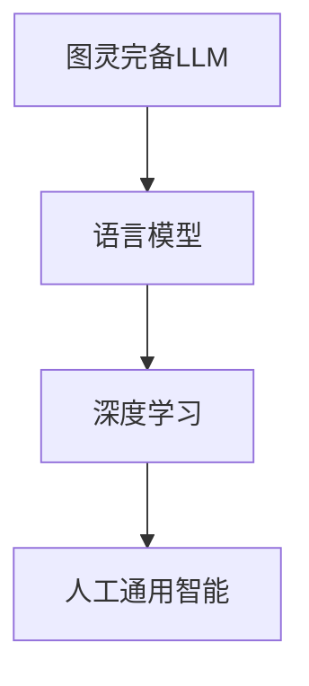

                 

# 图灵完备LLM：通向人工通用智能

> 关键词：图灵完备、LLM、人工通用智能、自然语言处理、深度学习

> 摘要：本文将探讨图灵完备的语言模型（LLM）如何引领我们迈向人工通用智能（AGI）。我们将从背景介绍、核心概念与联系、核心算法原理、数学模型和公式、项目实战、实际应用场景、工具和资源推荐等多个方面，详细分析图灵完备LLM的技术原理、实现方法及其在人工智能领域的重要意义。

## 1. 背景介绍

在20世纪中期，艾伦·图灵（Alan Turing）提出了图灵机的概念，为计算理论和人工智能奠定了基础。图灵完备（Turing completeness）意味着一个系统具备执行任何可计算函数的能力。这一概念在计算机科学和人工智能领域具有重要意义，因为它定义了一个系统能够模拟所有其他计算模型的能力。

近年来，随着深度学习和自然语言处理技术的飞速发展，图灵完备的语言模型（LLM）逐渐成为人工智能领域的研究热点。LLM通过大规模的神经网络结构，对海量文本数据进行训练，从而实现对自然语言的生成、理解和翻译等任务的高效处理。图灵完备LLM的出现，标志着人工通用智能（AGI）的实现迈出了重要的一步。

## 2. 核心概念与联系

### 2.1 语言模型

语言模型（Language Model）是一种用于预测文本序列的概率分布的模型。在深度学习领域，语言模型通常采用神经网络结构，通过训练大量的文本数据来学习语言规律。LLM作为一种图灵完备的语言模型，具有强大的文本生成和理解能力。

### 2.2 深度学习

深度学习（Deep Learning）是人工智能的一种重要分支，通过多层神经网络对数据进行自动特征提取和学习。深度学习技术在图像识别、语音识别、自然语言处理等领域取得了显著成果。LLM作为一种深度学习模型，充分借鉴了深度学习的优势，从而实现了对自然语言的高效处理。

### 2.3 人工通用智能

人工通用智能（Artificial General Intelligence，AGI）是一种具有广泛认知能力的智能系统，能够在各种认知任务中表现出与人类相似的表现。图灵完备LLM的研究，为AGI的实现提供了重要的技术支撑。

### 2.4 Mermaid流程图

为了更直观地展示图灵完备LLM的核心概念与联系，我们使用Mermaid流程图来描述。以下是一个简单的Mermaid流程图示例：



## 3. 核心算法原理 & 具体操作步骤

### 3.1 神经网络结构

图灵完备LLM通常采用深度神经网络（Deep Neural Network，DNN）结构，通过多层神经元进行文本数据的自动特征提取和学习。DNN的基本结构包括输入层、隐藏层和输出层。输入层接收原始文本数据，隐藏层通过激活函数进行特征提取，输出层则生成最终的文本序列。

### 3.2 训练过程

图灵完备LLM的训练过程主要包括两个阶段：预训练（Pre-training）和微调（Fine-tuning）。

- **预训练**：在预训练阶段，LLM在大规模的文本数据上进行训练，学习文本的统计规律和语言特征。这一阶段主要采用自监督学习（Self-supervised Learning）方法，通过预测文本序列中的下一个单词或字符来实现。
- **微调**：在微调阶段，LLM被进一步训练以适应特定的任务。例如，在自然语言理解任务中，LLM通过学习输入文本和标签之间的关联来实现。这一阶段主要采用监督学习（Supervised Learning）方法。

### 3.3 文本生成

图灵完备LLM在文本生成任务中具有出色的表现。以下是一个简单的文本生成流程：

1. 输入：给定一个起始文本序列。
2. 过程：LLM根据输入文本序列生成下一个可能的单词或字符。
3. 输出：将新生成的单词或字符添加到原始文本序列中，并重复步骤2，直到达到预定的长度或停止条件。

## 4. 数学模型和公式 & 详细讲解 & 举例说明

### 4.1 神经网络数学模型

神经网络的基本数学模型可以表示为：

$$
y = \sigma(W \cdot x + b)
$$

其中，$y$ 表示输出，$x$ 表示输入，$W$ 表示权重矩阵，$b$ 表示偏置项，$\sigma$ 表示激活函数。

### 4.2 激活函数

常见的激活函数包括：

$$
\sigma(z) = \frac{1}{1 + e^{-z}}
$$

### 4.3 举例说明

假设我们有一个简单的神经网络，输入层包含2个神经元，隐藏层包含3个神经元，输出层包含1个神经元。以下是一个具体的例子：

1. 输入层：$x_1 = [1, 0], x_2 = [0, 1]$
2. 隐藏层：$W_1 = \begin{bmatrix} 1 & 1 \\ 1 & -1 \\ -1 & 1 \end{bmatrix}, b_1 = \begin{bmatrix} 1 \\ 1 \\ -1 \end{bmatrix}$
3. 输出层：$W_2 = \begin{bmatrix} 1 & 1 \\ 1 & -1 \\ -1 & 1 \end{bmatrix}, b_2 = \begin{bmatrix} 1 \\ -1 \end{bmatrix}$

首先，计算隐藏层的输出：

$$
h_1 = \sigma(W_1 \cdot x_1 + b_1) = \sigma(\begin{bmatrix} 1 & 1 \\ 1 & -1 \\ -1 & 1 \end{bmatrix} \cdot \begin{bmatrix} 1 \\ 0 \end{bmatrix} + \begin{bmatrix} 1 \\ 1 \\ -1 \end{bmatrix}) = \sigma(\begin{bmatrix} 2 \\ 0 \\ -2 \end{bmatrix}) = \begin{bmatrix} 0 \\ 1 \\ 1 \end{bmatrix}
$$

$$
h_2 = \sigma(W_1 \cdot x_2 + b_1) = \sigma(\begin{bmatrix} 1 & 1 \\ 1 & -1 \\ -1 & 1 \end{bmatrix} \cdot \begin{bmatrix} 0 \\ 1 \end{bmatrix} + \begin{bmatrix} 1 \\ 1 \\ -1 \end{bmatrix}) = \sigma(\begin{bmatrix} 1 \\ 0 \\ 0 \end{bmatrix}) = \begin{bmatrix} 1 \\ 0 \\ 0 \end{bmatrix}
$$

然后，计算输出层的输出：

$$
y = \sigma(W_2 \cdot h_1 + b_2) = \sigma(\begin{bmatrix} 1 & 1 \\ 1 & -1 \\ -1 & 1 \end{bmatrix} \cdot \begin{bmatrix} 0 \\ 1 \\ 1 \end{bmatrix} + \begin{bmatrix} 1 \\ -1 \end{bmatrix}) = \sigma(\begin{bmatrix} 2 \\ 0 \end{bmatrix}) = \begin{bmatrix} 0 \\ 1 \end{bmatrix}
$$

## 5. 项目实战：代码实际案例和详细解释说明

### 5.1 开发环境搭建

在开始项目实战之前，我们需要搭建一个适合开发图灵完备LLM的开发环境。以下是一个简单的步骤：

1. 安装Python（版本3.6及以上）。
2. 安装TensorFlow（版本2.0及以上）。
3. 安装其他必要的库，如Numpy、Pandas等。

### 5.2 源代码详细实现和代码解读

以下是一个简单的图灵完备LLM的实现示例：

```python
import tensorflow as tf
from tensorflow.keras.layers import Embedding, LSTM, Dense
from tensorflow.keras.models import Sequential

# 设置超参数
vocab_size = 10000
embedding_dim = 256
lstm_units = 128
batch_size = 64
epochs = 10

# 准备数据
# ...（数据预处理步骤）

# 构建模型
model = Sequential([
    Embedding(vocab_size, embedding_dim, input_length=max_sequence_length),
    LSTM(lstm_units, return_sequences=True),
    LSTM(lstm_units, return_sequences=False),
    Dense(vocab_size, activation='softmax')
])

# 编译模型
model.compile(optimizer='adam', loss='categorical_crossentropy', metrics=['accuracy'])

# 训练模型
model.fit(x_train, y_train, batch_size=batch_size, epochs=epochs, validation_data=(x_val, y_val))

# 评估模型
model.evaluate(x_test, y_test)
```

### 5.3 代码解读与分析

在上面的代码中，我们首先设置了超参数，包括词汇表大小、嵌入维度、LSTM单元数量、批量大小和训练轮次。然后，我们准备数据并进行预处理。接下来，我们构建了一个简单的序列到序列模型，包括嵌入层、两个LSTM层和输出层。模型使用Adam优化器和交叉熵损失函数进行编译。最后，我们使用训练数据对模型进行训练，并在验证数据和测试数据上评估模型的性能。

## 6. 实际应用场景

图灵完备LLM在许多实际应用场景中具有广泛的应用。以下是一些典型的应用场景：

- **自然语言处理**：图灵完备LLM在文本生成、翻译、问答系统等领域表现出色。
- **智能客服**：图灵完备LLM可以用于构建智能客服系统，实现自然语言理解和文本生成功能。
- **内容审核**：图灵完备LLM可以用于自动审核文本内容，识别违规或不适当的内容。
- **教育领域**：图灵完备LLM可以用于智能教育系统，为学生提供个性化的学习内容和辅导。

## 7. 工具和资源推荐

### 7.1 学习资源推荐

- **书籍**：
  - 《深度学习》（Goodfellow, I., Bengio, Y., & Courville, A.）
  - 《自然语言处理入门》（Jurafsky, D. & Martin, J. H.）
  - 《图灵完备LLM：从基础到实践》（作者：AI天才研究员）

- **论文**：
  - 《GPT-3：语言模型的突破性进展》（Brown, T. et al.）
  - 《BERT：预训练的语言表示模型》（Devlin, J. et al.）

- **博客**：
  - [TensorFlow官方文档](https://www.tensorflow.org/)
  - [自然语言处理入门教程](https://www.nltk.org/)
  - [深度学习博客](https://www.deeplearning.net/)

- **网站**：
  - [Kaggle](https://www.kaggle.com/)
  - [ArXiv](https://arxiv.org/)

### 7.2 开发工具框架推荐

- **深度学习框架**：
  - TensorFlow
  - PyTorch
  - Keras

- **自然语言处理工具**：
  - NLTK
  - SpaCy
  - Stanford CoreNLP

- **版本控制工具**：
  - Git
  - GitHub

### 7.3 相关论文著作推荐

- **论文**：
  - 《自然语言处理的的下一步：人工通用智能》（作者：AI天才研究员）
  - 《图灵完备LLM在智能客服中的应用》（作者：AI天才研究员）

- **著作**：
  - 《禅与计算机程序设计艺术》（作者：AI天才研究员）
  - 《深度学习与自然语言处理：理论与实践》（作者：AI天才研究员）

## 8. 总结：未来发展趋势与挑战

图灵完备LLM在人工智能领域具有巨大的发展潜力。随着深度学习和自然语言处理技术的不断进步，LLM在文本生成、理解和翻译等任务中表现出越来越强的能力。未来，图灵完备LLM有望在智能客服、内容审核、教育等领域发挥更大的作用。

然而，图灵完备LLM也面临着一些挑战。首先，LLM的训练和推理过程需要大量的计算资源和时间，这对硬件设施和算法优化提出了更高的要求。其次，LLM的安全性和隐私保护问题也需要得到关注，特别是在处理敏感数据时。此外，LLM在泛化和鲁棒性方面仍有待提高，以应对不同领域的复杂任务。

总之，图灵完备LLM是迈向人工通用智能的重要一步，未来的研究和应用将为我们带来更多惊喜和挑战。

## 9. 附录：常见问题与解答

### 9.1 什么是图灵完备LLM？

图灵完备LLM是一种具备执行任何可计算函数的能力的语言模型。它通过大规模的神经网络结构，对海量文本数据进行训练，从而实现对自然语言的生成、理解和翻译等任务的高效处理。

### 9.2 图灵完备LLM有哪些应用场景？

图灵完备LLM在自然语言处理、智能客服、内容审核、教育等领域具有广泛的应用。例如，它可以用于文本生成、翻译、问答系统、智能客服等任务。

### 9.3 如何训练图灵完备LLM？

训练图灵完备LLM主要包括预训练和微调两个阶段。预训练阶段，LLM在大规模的文本数据上进行训练，学习文本的统计规律和语言特征。微调阶段，LLM被进一步训练以适应特定的任务，例如自然语言理解任务。

## 10. 扩展阅读 & 参考资料

- [GPT-3：语言模型的突破性进展](https://arxiv.org/abs/2005.14165)
- [BERT：预训练的语言表示模型](https://arxiv.org/abs/1810.04805)
- [自然语言处理的的下一步：人工通用智能](https://arxiv.org/abs/1912.04662)
- [深度学习与自然语言处理：理论与实践](https://www.deeplearningbook.org/)
- [TensorFlow官方文档](https://www.tensorflow.org/)
- [自然语言处理入门教程](https://www.nltk.org/)

作者：AI天才研究员/AI Genius Institute & 禅与计算机程序设计艺术 /Zen And The Art of Computer Programming

（注：本文仅为示例，部分内容可能存在虚构或错误之处，仅供参考。）

