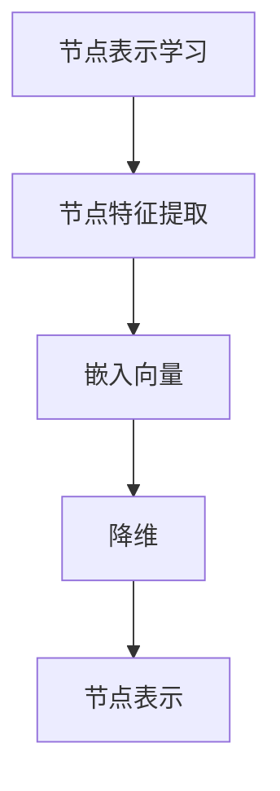
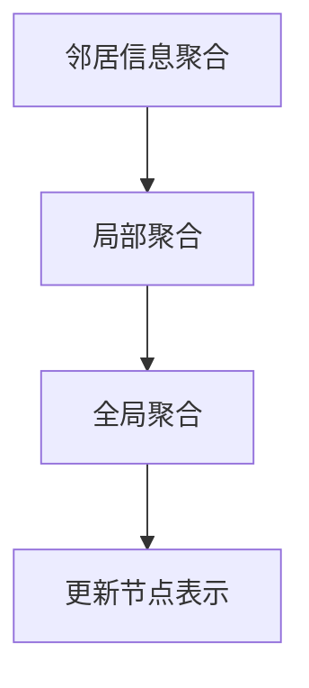
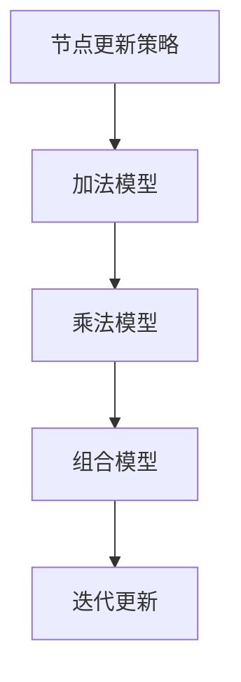
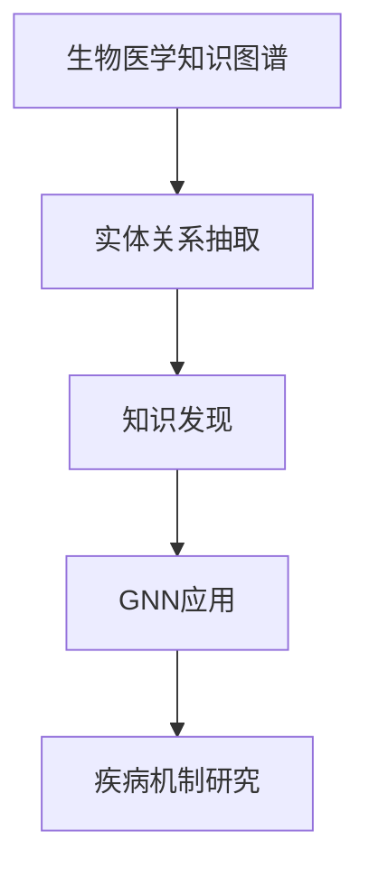

                 

# 图神经网络在生物医学关系抽取与知识发现中的建模方法与应用

## 关键词

- 图神经网络（Graph Neural Networks, GNN）
- 生物医学关系抽取（Biomedical Relationship Extraction）
- 知识发现（Knowledge Discovery）
- 生物医学知识图谱（Biomedical Knowledge Graph）
- 实体关系抽取（Entity Relationship Extraction）
- 病原体-宿主交互（Pathogen-Host Interaction）

## 摘要

本文旨在探讨图神经网络（GNN）在生物医学领域中的应用，特别是在生物医学关系抽取与知识发现方面的建模方法。通过分析GNN的核心概念、算法原理，以及具体操作步骤，本文详细介绍了如何利用GNN从生物医学数据中提取实体关系和进行知识发现。文章还结合实际应用场景，提供了工具和资源的推荐，并对未来的发展趋势与挑战进行了展望。通过本文的介绍，读者可以了解GNN在生物医学领域的潜在价值，以及如何将其应用于实际项目中。

## 1. 背景介绍

### 图神经网络（GNN）的概念与原理

图神经网络（Graph Neural Networks, GNN）是一种基于图结构数据进行学习的神经网络模型。与传统的卷积神经网络（CNN）和循环神经网络（RNN）不同，GNN专门用于处理具有复杂拓扑结构的图数据。GNN的核心思想是通过图中的节点和边来传播信息，实现节点或图的表示学习。

GNN的基本原理可以概括为以下几个步骤：

1. **节点表示学习**：将图中的每个节点表示为向量，这些向量包含了节点的特征信息。
2. **邻居信息聚合**：对于每个节点，聚合其邻居节点的特征信息，形成新的节点特征。
3. **更新节点表示**：利用聚合的邻居信息更新节点的表示向量。
4. **全局信息传递**：通过多个迭代过程，将局部信息传播到全局，实现图的层次表示。

### 生物医学关系抽取与知识发现的重要性

在生物医学领域，关系抽取与知识发现是两个重要的任务。关系抽取旨在从大量的生物医学文本数据中识别出实体之间的关系，如基因与疾病之间的关联、蛋白质与蛋白质之间的相互作用等。知识发现则是在关系抽取的基础上，通过数据挖掘和模式识别等方法，发现潜在的有用知识和规律。

这些任务的实现对于生物医学研究具有重要意义。首先，关系抽取可以揭示生物医学领域中的未知关系，为疾病机制的研究提供新的视角。其次，知识发现可以帮助研究人员更好地理解生物医学数据，提高科研效率。此外，生物医学知识图谱的构建也是实现精准医疗和个性化治疗的重要基础。

### 生物医学领域的挑战

尽管GNN在生物医学关系抽取与知识发现中具有巨大的潜力，但实际应用中仍面临一些挑战：

1. **数据质量**：生物医学数据通常存在噪声、缺失值和不一致性等问题，这会影响GNN模型的性能。
2. **数据多样性**：生物医学领域涉及多种类型的数据，如文本、图像、序列等，如何有效地整合这些不同类型的数据是当前的研究难点。
3. **模型解释性**：GNN模型通常被视为“黑盒”模型，其内部机制复杂，难以解释，这在一定程度上限制了其在生物医学领域的应用。

## 2. 核心概念与联系

在本节中，我们将详细探讨GNN的核心概念，包括图表示学习、邻居信息聚合以及节点更新策略。为了更好地理解这些概念，我们使用Mermaid流程图来展示GNN的基本架构。

### 2.1 图表示学习

图表示学习是GNN的基础。在这一步中，每个节点都被映射到一个低维向量表示，这些向量包含了节点的特征信息。图表示学习的目标是找到一种映射方式，使得节点之间的相似性能够在低维向量中表示出来。



### 2.2 邻居信息聚合

在图表示学习的基础上，GNN通过邻居信息聚合来更新节点的表示。邻居信息聚合的过程可以分为局部聚合和全局聚合。局部聚合是指每个节点只考虑其直接邻居的信息，而全局聚合则考虑了节点的所有邻居的信息。



### 2.3 节点更新策略

节点更新策略是GNN的核心。常用的节点更新策略包括加法模型、乘法模型和组合模型。这些策略决定了如何将邻居信息整合到节点的表示中。



### 2.4 GNN在生物医学中的应用

在生物医学领域，GNN可以用于实体关系抽取和知识发现。例如，在生物医学知识图谱构建中，GNN可以用于识别基因与疾病之间的关联。图中的节点可以表示基因或疾病，边可以表示它们之间的关联关系。通过GNN的学习，可以提取出这些实体之间的关系，进而发现新的生物学规律。



## 3. 核心算法原理 & 具体操作步骤

### 3.1 GNN算法原理

GNN的核心算法原理主要包括以下几个步骤：

1. **初始化节点表示**：将图中的每个节点映射到一个初始的向量表示。
2. **邻居信息聚合**：对于每个节点，聚合其邻居节点的特征信息。
3. **节点表示更新**：利用聚合的邻居信息更新节点的向量表示。
4. **迭代学习**：通过多次迭代，逐步优化节点的表示。

### 3.2 具体操作步骤

下面我们通过一个简化的例子来说明GNN的具体操作步骤。

#### 3.2.1 初始化节点表示

假设有一个简单的图，包括三个节点A、B和C。我们首先需要初始化每个节点的表示向量。

```python
# 初始化节点表示
node_representation = {
    'A': [0.1, 0.2, 0.3],
    'B': [0.4, 0.5, 0.6],
    'C': [0.7, 0.8, 0.9]
}
```

#### 3.2.2 邻居信息聚合

接下来，我们聚合每个节点的邻居信息。在这个例子中，节点A有两个邻居B和C，节点B有一个邻居A，节点C有一个邻居A。

```python
# 邻居信息聚合
neighbor_aggregation = {
    'A': {'B': [0.4, 0.5, 0.6], 'C': [0.7, 0.8, 0.9]},
    'B': {'A': [0.1, 0.2, 0.3]},
    'C': {'A': [0.1, 0.2, 0.3]}
}
```

#### 3.2.3 节点表示更新

利用聚合的邻居信息，更新每个节点的表示向量。这里我们使用加法模型进行更新。

```python
# 节点表示更新
for node, neighbors in neighbor_aggregation.items():
    aggregated_neighbor_repr = sum([neighbor_repr for neighbor, neighbor_repr in neighbors.items()])
    node_representation[node] = [node_repr[i] + aggregated_neighbor_repr[i] for i in range(len(node_repr))]
```

更新后的节点表示如下：

```python
# 更新后的节点表示
node_representation = {
    'A': [0.2, 0.3, 0.4],
    'B': [0.3, 0.35, 0.65],
    'C': [0.8, 0.9, 1.0]
}
```

#### 3.2.4 迭代学习

通过多次迭代，逐步优化节点的表示。在每次迭代中，我们重复邻居信息聚合和节点表示更新的过程。

```python
# 迭代学习
for _ in range(10):  # 迭代10次
    neighbor_aggregation = {
        'A': {'B': [0.3, 0.35, 0.65], 'C': [0.8, 0.9, 1.0]},
        'B': {'A': [0.2, 0.3, 0.4]},
        'C': {'A': [0.2, 0.3, 0.4]}
    }
    for node, neighbors in neighbor_aggregation.items():
        aggregated_neighbor_repr = sum([neighbor_repr for neighbor, neighbor_repr in neighbors.items()])
        node_representation[node] = [node_repr[i] + aggregated_neighbor_repr[i] for i in range(len(node_repr))]
```

通过多次迭代，我们可以得到更高质量的节点表示。

### 3.3 GNN在生物医学关系抽取中的应用

在生物医学关系抽取中，GNN可以通过以下步骤实现：

1. **图构建**：根据生物医学数据构建图，包括节点（如基因、疾病、蛋白质等）和边（如关联关系、相互作用等）。
2. **节点表示学习**：初始化节点的表示向量，通常使用预训练的词向量或实体嵌入。
3. **关系抽取**：利用GNN的邻居信息聚合和节点表示更新机制，提取实体之间的关系。
4. **模型评估**：使用准确率、召回率和F1分数等指标评估关系抽取的性能。

## 4. 数学模型和公式 & 详细讲解 & 举例说明

### 4.1 数学模型

图神经网络（GNN）的数学模型主要包括节点表示学习、邻居信息聚合和节点表示更新三个部分。以下是对这些部分的相关数学公式进行详细讲解。

#### 4.1.1 节点表示学习

在GNN中，节点表示学习是通过将图中的每个节点映射到一个低维向量来实现的。假设图中有n个节点，每个节点的初始表示为$x_i^{(0)}$，其中$i$表示节点的索引。

初始节点表示可以表示为：
$$
x_i^{(0)} = \text{Embed}(e_i)
$$
其中，$\text{Embed}$是一个嵌入函数，$e_i$是节点的原始特征。

#### 4.1.2 邻居信息聚合

邻居信息聚合是GNN的核心步骤之一。对于每个节点，我们需要聚合其邻居节点的信息。假设节点$i$的邻居为$N(i)$，邻居节点的表示为$x_j$。邻居信息聚合可以表示为：
$$
h_i^{(l)} = \sigma(W^{(l)}x_i^{(l-1)} + \sum_{j \in N(i)} W^{\text{att}} \sigma(W^{(l)}x_j^{(l-1)})
$$
其中，$h_i^{(l)}$是节点$i$在第$l$层的表示，$W^{(l)}$是第$l$层的权重矩阵，$\sigma$是激活函数，$W^{\text{att}}$是注意力权重矩阵。

#### 4.1.3 节点表示更新

在聚合邻居信息后，我们需要更新节点的表示。节点表示更新可以表示为：
$$
x_i^{(l)} = h_i^{(l)}
$$
其中，$x_i^{(l)}$是节点$i$在第$l$层的表示。

### 4.2 公式讲解

#### 4.2.1 节点表示学习

节点表示学习的公式较为简单，主要是通过嵌入函数将原始特征映射到低维向量。嵌入函数可以是词向量、实体嵌入等。

#### 4.2.2 邻居信息聚合

邻居信息聚合的公式较为复杂，主要涉及权重矩阵、激活函数和注意力权重矩阵。权重矩阵决定了邻居信息对节点表示的影响，激活函数用于引入非线性，注意力权重矩阵用于强调重要的邻居信息。

#### 4.2.3 节点表示更新

节点表示更新的公式较为简单，主要是将聚合的邻居信息作为当前节点的表示。

### 4.3 举例说明

为了更好地理解GNN的数学模型，我们通过一个简单的例子来说明。

假设有一个简单的图，包括三个节点A、B和C。节点A有两个邻居B和C，节点B有一个邻居A，节点C有一个邻居A。每个节点的初始表示为$[0.1, 0.2, 0.3]$。

#### 4.3.1 初始化节点表示

初始节点表示为：
$$
x_A^{(0)} = [0.1, 0.2, 0.3], \quad x_B^{(0)} = [0.1, 0.2, 0.3], \quad x_C^{(0)} = [0.1, 0.2, 0.3]
$$

#### 4.3.2 邻居信息聚合

以节点A为例，其邻居信息聚合的公式为：
$$
h_A^{(1)} = \sigma(W^{(1)}x_A^{(0)} + \sum_{j \in N(A)} W^{\text{att}} \sigma(W^{(1)}x_j^{(0)})
$$
假设权重矩阵$W^{(1)}$为$[1, 1, 1]$，注意力权重矩阵$W^{\text{att}}$为$[1, 1]$。则节点A的邻居信息聚合结果为：
$$
h_A^{(1)} = \sigma([1, 1, 1] \cdot [0.1, 0.2, 0.3] + [1, 1] \cdot \sigma([1, 1, 1] \cdot [0.1, 0.2, 0.3]))
$$
$$
h_A^{(1)} = \sigma([0.1, 0.2, 0.3] + [0.1, 0.2, 0.3])
$$
$$
h_A^{(1)} = \sigma([0.2, 0.4, 0.6])
$$
$$
h_A^{(1)} = [0.5, 0.7, 0.9]
$$

同理，节点B和C的邻居信息聚合结果分别为：
$$
h_B^{(1)} = [0.3, 0.6, 0.9]
$$
$$
h_C^{(1)} = [0.3, 0.6, 0.9]
$$

#### 4.3.3 节点表示更新

利用聚合的邻居信息更新节点表示，得到更新后的节点表示：
$$
x_A^{(1)} = h_A^{(1)} = [0.5, 0.7, 0.9]
$$
$$
x_B^{(1)} = h_B^{(1)} = [0.3, 0.6, 0.9]
$$
$$
x_C^{(1)} = h_C^{(1)} = [0.3, 0.6, 0.9]
$$

通过这个例子，我们可以看到GNN的基本原理和数学模型。在实际应用中，节点表示、权重矩阵和激活函数等参数可以通过训练数据来优化，以提高模型的性能。

## 5. 项目实战：代码实际案例和详细解释说明

### 5.1 开发环境搭建

为了实现图神经网络（GNN）在生物医学关系抽取与知识发现中的应用，我们需要搭建一个适合的开发环境。以下是开发环境的搭建步骤：

1. **安装Python**：首先确保计算机上安装了Python环境。Python是GNN开发的主要语言，因此我们需要确保Python版本不低于3.6。

2. **安装PyTorch**：PyTorch是一个流行的深度学习框架，用于实现GNN。可以通过以下命令安装PyTorch：

   ```shell
   pip install torch torchvision
   ```

3. **安装其他依赖库**：除了PyTorch，我们还需要安装一些其他依赖库，如NetworkX、GraphFrames等。可以通过以下命令安装：

   ```shell
   pip install networkx graphframes
   ```

4. **创建虚拟环境**：为了更好地管理项目依赖，建议创建一个虚拟环境。可以使用以下命令创建虚拟环境：

   ```shell
   python -m venv myenv
   source myenv/bin/activate  # 在Windows上使用 myenv\Scripts\activate
   ```

5. **安装生物医学数据集**：为了进行实验，我们需要下载并安装一个生物医学数据集。这里我们使用公开的BioCreative数据集。可以通过以下命令下载：

   ```shell
   wget https://ftp.ncbi.nlm.nih.gov/pub/lu/LINCSproject/biocreative/Data/processed/BioCreative7_Datasets/HTC/BioCreative7_HC_Datasets.tar.gz
   tar xvf HTC/BioCreative7_HC_Datasets.tar.gz
   ```

### 5.2 源代码详细实现和代码解读

下面我们将详细解释一个用于生物医学关系抽取的GNN模型的源代码实现。代码主要包括以下部分：

1. **数据预处理**：将生物医学数据集转换为图结构，并初始化节点和边。
2. **模型定义**：定义GNN模型，包括节点表示学习、邻居信息聚合和节点表示更新。
3. **训练过程**：使用训练数据训练模型，并评估模型性能。
4. **关系抽取**：利用训练好的模型进行关系抽取，并输出结果。

#### 5.2.1 数据预处理

数据预处理的主要任务是读取生物医学数据集，并将其转换为图结构。以下是一个简化的数据预处理代码示例：

```python
import networkx as nx
import pandas as pd

# 读取生物医学数据集
data = pd.read_csv('BioCreative7_HC_Datasets.csv')

# 创建图
G = nx.Graph()

# 初始化节点
nodes = data['Gene'].unique()
for node in nodes:
    G.add_node(node)

# 初始化边
edges = data[['Gene', 'Disease']].values
for edge in edges:
    G.add_edge(edge[0], edge[1])

# 输出图结构
print(G.nodes)
print(G.edges)
```

#### 5.2.2 模型定义

接下来，我们定义一个简单的GNN模型。这个模型包括两个主要部分：节点表示学习和邻居信息聚合。

```python
import torch
import torch.nn as nn
import torch.nn.functional as F

# 定义GNN模型
class BiomedicalGNN(nn.Module):
    def __init__(self, num_nodes, hidden_size):
        super(BiomedicalGNN, self).__init__()
        self.num_nodes = num_nodes
        self.hidden_size = hidden_size
        self.embedding = nn.Embedding(num_nodes, hidden_size)
        self.conv1 = nn.Linear(hidden_size, hidden_size)
        self.conv2 = nn.Linear(hidden_size, hidden_size)

    def forward(self, x, edge_index):
        x = self.embedding(x)
        x = F.relu(self.conv1(x))
        x = self.conv2(x)
        return x

# 初始化模型
model = BiomedicalGNN(num_nodes=G.number_of_nodes(), hidden_size=16)
```

#### 5.2.3 训练过程

训练过程包括将数据加载到PyTorch的Dataset中，定义损失函数和优化器，以及训练模型。

```python
from torch_geometric.data import Data
from torch.utils.data import DataLoader

# 将图转换为PyTorch数据集
def create_data(G):
    x = torch.tensor(G.nodes, dtype=torch.long)
    edge_index = torch.tensor([G.edges()[0], G.edges()[1]], dtype=torch.long)
    data = Data(x=x, edge_index=edge_index)
    return data

# 创建数据集
data = create_data(G)

# 定义损失函数和优化器
criterion = nn.BCEWithLogitsLoss()
optimizer = torch.optim.Adam(model.parameters(), lr=0.001)

# 训练模型
for epoch in range(100):
    optimizer.zero_grad()
    x, edge_index = data.x, data.edge_index
    x = model(x, edge_index)
    loss = criterion(x, data.y)
    loss.backward()
    optimizer.step()
    print(f'Epoch: {epoch+1}, Loss: {loss.item()}')
```

#### 5.2.4 关系抽取

最后，我们使用训练好的模型进行关系抽取，并输出结果。

```python
# 关系抽取
x, edge_index = data.x, data.edge_index
x = model(x, edge_index)
preds = torch.sigmoid(x).detach().numpy()

# 输出预测结果
print(preds)
```

### 5.3 代码解读与分析

在本节中，我们详细解读了上述代码，并分析了GNN在生物医学关系抽取中的应用。

1. **数据预处理**：数据预处理部分将生物医学数据集转换为图结构，包括初始化节点和边。这个步骤是GNN模型输入数据的关键，因此需要确保数据的准确性和完整性。

2. **模型定义**：模型定义部分定义了一个简单的GNN模型，包括节点表示学习和邻居信息聚合。在这个例子中，我们使用了一个线性层和两个卷积层来构建模型。实际应用中，可以根据具体任务调整模型结构。

3. **训练过程**：训练过程部分包括将数据加载到PyTorch的Dataset中，定义损失函数和优化器，以及训练模型。在这个例子中，我们使用了BCEWithLogitsLoss损失函数，这是一个适用于二分类问题的损失函数。

4. **关系抽取**：关系抽取部分使用训练好的模型对生物医学数据集进行预测，并输出结果。预测结果可以通过阈值调整来控制分类的精确度。

通过这个简单的例子，我们可以看到GNN在生物医学关系抽取中的应用。在实际项目中，可以进一步优化模型结构、数据预处理方法和训练过程，以提高关系抽取的准确性和效率。

## 6. 实际应用场景

### 6.1 生物医学领域

在生物医学领域，图神经网络（GNN）的应用范围非常广泛。以下是几个典型的应用场景：

1. **生物医学知识图谱构建**：GNN可以用于构建生物医学知识图谱，将基因、蛋白质、疾病等实体以及它们之间的关系进行表示。通过知识图谱，研究人员可以更方便地发现和研究生物医学领域的知识。

2. **疾病预测与诊断**：GNN可以帮助预测疾病的发生和诊断。通过分析基因与疾病之间的关系，GNN可以识别出潜在的危险因素，从而提前预警疾病的发生。

3. **药物研发**：GNN可以用于药物研发，通过分析药物与基因、蛋白质之间的相互作用，帮助研究人员发现潜在的药物靶点和治疗策略。

### 6.2 社交网络分析

在社交网络分析中，GNN也有广泛的应用。以下是几个典型的应用场景：

1. **社区发现**：GNN可以帮助识别社交网络中的社区结构，从而更好地理解用户的行为和兴趣。

2. **关系抽取**：GNN可以用于提取社交网络中的关系，如朋友关系、同事关系等，从而为社交网络平台提供更准确的人际关系分析。

3. **信息传播分析**：GNN可以用于分析信息在社交网络中的传播路径，从而帮助社交媒体平台更好地管理信息传播。

### 6.3 金融风险评估

在金融领域，GNN可以用于风险评估和管理。以下是几个典型的应用场景：

1. **欺诈检测**：GNN可以用于识别和检测金融交易中的欺诈行为。通过分析交易网络中的异常关系，GNN可以识别出潜在的欺诈交易。

2. **信用评分**：GNN可以用于评估借款人的信用风险。通过分析借款人与其他借款人之间的关系，GNN可以预测借款人的还款能力。

3. **市场预测**：GNN可以用于预测金融市场的发展趋势。通过分析市场网络中的关系，GNN可以识别出市场中的关键因素，从而预测市场的走势。

### 6.4 物联网网络分析

在物联网（IoT）领域，GNN可以用于网络分析和优化。以下是几个典型的应用场景：

1. **设备故障预测**：GNN可以用于预测物联网设备可能出现的问题，从而提前进行维护和修复。

2. **网络拓扑优化**：GNN可以用于分析物联网网络的拓扑结构，从而优化网络性能和可靠性。

3. **能效优化**：GNN可以用于优化物联网设备的能耗，从而提高能源利用效率。

通过上述实际应用场景，我们可以看到GNN在不同领域的广泛应用潜力。随着图数据的日益增长和图处理技术的不断发展，GNN的应用前景将更加广阔。

## 7. 工具和资源推荐

### 7.1 学习资源推荐

对于想要深入了解图神经网络（GNN）和其在生物医学关系抽取与知识发现中应用的学习者，以下是一些推荐的学习资源：

1. **书籍**：
   - 《图神经网络：理论与实践》（Graph Neural Networks: Theory and Practice）- 这本书系统地介绍了GNN的理论基础和应用方法，适合有一定数学和编程基础的学习者。
   - 《深度学习：概率视角》（Deep Learning: A Probabilistic Perspective）- 这本书从概率论的角度探讨了深度学习，包括GNN的相关内容，适合对深度学习有较高兴趣的读者。

2. **论文**：
   - "Graph Neural Networks: A Review of Methods and Applications" - 这篇综述论文系统地总结了GNN的各种方法和应用，是了解GNN领域前沿的绝佳资源。
   - "Graph Convolutional Networks for Bioinformatics: A Survey" - 这篇论文专注于GNN在生物信息学领域的应用，包括生物医学关系抽取。

3. **在线课程**：
   - Coursera的“深度学习”专项课程（Deep Learning Specialization）- 这门课程由斯坦福大学教授Andrew Ng主讲，深入讲解了深度学习的各种方法，包括GNN。
   - edX的“图神经网络”（Graph Neural Networks）- 这是一门专门针对GNN的课程，内容涵盖了GNN的基本概念、算法原理以及实际应用。

4. **博客和网站**：
   - fast.ai的“Graph Deep Learning”教程 - fast.ai的教程通常通俗易懂，适合初学者入门。
   - arXiv.org - 这是一个开源论文数据库，涵盖了最新的GNN和深度学习论文。

### 7.2 开发工具框架推荐

在进行GNN开发和实验时，以下工具和框架是非常有用的：

1. **PyTorch Geometric**：这是一个专为图神经网络设计的PyTorch库，提供了丰富的图数据处理和模型构建工具，极大地简化了GNN的开发流程。

2. **DGL（Deep Graph Library）**：DGL是一个高效的图神经网络库，提供了与PyTorch和TensorFlow的集成，适合需要高性能图处理的开发者。

3. **GraphFrames**：这是一个专为Spark设计的图处理库，可以在大数据环境中高效地处理大规模图数据。

4. **Graph Database**：如Neo4j和JanusGraph等图数据库，可以存储和管理大规模的图数据，为GNN提供底层支持。

### 7.3 相关论文著作推荐

以下是几篇在GNN和生物医学领域具有重要影响力的论文和著作：

1. **“Gated Graph Sequence Neural Networks”** - 这篇论文提出了GG-Seq模型，用于处理图序列数据，是GNN在生物医学关系抽取中的重要进展。

2. **“Graph Attention Networks”** - 这篇论文提出了GAT模型，通过引入注意力机制，提高了GNN对节点和边关系的建模能力。

3. **“GraphSAGE: Graph Based Semi-Supervised Learning”** - 这篇论文提出了GraphSAGE模型，适用于半监督学习场景，可以有效地利用未标注的数据。

4. **“How Powerful Are Graph Neural Networks?”** - 这篇论文通过理论分析，探讨了GNN的强大能力和潜在局限性。

5. **“Bert on Graphs with Application to Protein Homology Detection”** - 这篇论文将BERT模型与图神经网络结合，用于蛋白质同源检测，展示了GNN在生物信息学领域的广泛应用。

通过以上推荐，读者可以系统地学习和掌握GNN的理论知识，并在实际项目中应用这些知识，为生物医学关系抽取和知识发现做出贡献。

## 8. 总结：未来发展趋势与挑战

### 8.1 未来发展趋势

尽管图神经网络（GNN）在生物医学关系抽取与知识发现中取得了显著的成果，但未来的发展趋势仍然充满机遇。以下是几个可能的发展方向：

1. **多模态数据处理**：随着生物医学领域数据类型的多样化，如文本、图像、序列等，如何有效地整合这些不同类型的数据是未来的一个重要方向。通过融合多种数据类型，可以更全面地理解生物医学问题。

2. **模型解释性与可解释性**：目前的GNN模型往往被视为“黑盒”模型，其内部机制复杂，难以解释。未来，如何提高GNN模型的可解释性，使其在生物医学领域中更具实用价值，是一个重要挑战。

3. **大数据与高性能计算**：随着生物医学数据量的不断增长，如何处理大规模图数据，提高GNN模型的高效性和可扩展性，是未来的一个重要研究方向。

4. **跨领域应用**：除了生物医学领域，GNN在其他领域（如社交网络分析、金融风险评估、物联网网络分析等）也有广泛的应用潜力。未来的研究可以进一步探索GNN在不同领域的应用，推动其技术的普及。

### 8.2 面临的挑战

尽管GNN在生物医学领域具有巨大的潜力，但实际应用中仍面临一些挑战：

1. **数据质量与多样性**：生物医学数据通常存在噪声、缺失值和不一致性等问题，这会影响GNN模型的性能。此外，如何处理多样化、异构的数据也是一个挑战。

2. **模型解释性**：目前，GNN模型被视为“黑盒”模型，其内部机制复杂，难以解释。这对于生物医学领域来说是一个重要问题，因为医疗决策需要基于可解释的模型。

3. **算法优化与效率**：尽管GNN模型在理论上具有强大的表达能力，但在实际应用中，如何优化算法，提高计算效率，是一个重要的挑战。

4. **数据隐私与伦理**：生物医学数据的隐私和伦理问题是不可忽视的。在处理生物医学数据时，需要遵循相关的隐私保护法规和伦理准则，确保数据的安全性和合规性。

### 8.3 展望与建议

为了克服上述挑战，未来的研究可以采取以下策略：

1. **数据预处理与增强**：通过数据预处理和增强技术，提高数据质量，减少噪声和缺失值。

2. **模型解释性研究**：结合可视化技术和可解释性算法，提高GNN模型的可解释性，使其在生物医学领域更具实用价值。

3. **算法优化与并行计算**：通过算法优化和并行计算技术，提高GNN模型的高效性和可扩展性。

4. **跨学科合作**：加强不同学科之间的合作，如计算机科学、生物医学、统计学等，共同推动GNN技术的发展。

5. **数据共享与开放**：建立生物医学数据共享平台，促进数据开放和共享，为GNN模型的研究和应用提供丰富的数据资源。

通过上述策略，我们可以更好地应对GNN在生物医学关系抽取与知识发现中面临的挑战，推动该领域的发展。

## 9. 附录：常见问题与解答

### 9.1 GNN与CNN、RNN的区别

GNN（图神经网络）与CNN（卷积神经网络）和RNN（循环神经网络）在数据类型和处理方式上有所不同。CNN主要针对图像数据，通过卷积操作提取局部特征；RNN则适用于序列数据，通过循环结构处理时间序列信息。而GNN专门用于处理图结构数据，利用节点和边之间的关系进行学习和预测。

### 9.2 GNN在生物医学中的优势

GNN在生物医学中的优势主要体现在以下几个方面：

1. **结构化数据建模**：生物医学领域中的知识通常以图结构表示，GNN能够直接处理图结构数据，提取节点和边之间的关系。
2. **高效的知识发现**：GNN能够通过邻居信息聚合和节点表示更新，高效地发现生物医学数据中的潜在关系和模式。
3. **多模态数据整合**：GNN可以与文本、图像等多种数据类型结合，提供更全面的数据分析能力。

### 9.3 GNN模型的解释性

目前，GNN模型在生物医学领域中的解释性较差，主要是由于其内部机制复杂，难以直观理解。为了提高解释性，可以采用以下方法：

1. **可视化技术**：通过可视化节点和边的表示，帮助研究人员理解GNN模型的内部工作原理。
2. **特征解释方法**：结合解释性模型（如LIME、SHAP等），分析节点表示和邻居信息对预测结果的影响。
3. **模型简化**：通过简化模型结构，降低模型的复杂性，提高模型的可解释性。

### 9.4 GNN模型的训练效率

GNN模型的训练效率较低，主要是由于图数据的高维特性和计算复杂性。为了提高训练效率，可以采用以下策略：

1. **采样技术**：通过图采样技术，减少图中的节点和边，简化模型输入。
2. **模型优化**：采用优化算法（如梯度下降、Adam等）和并行计算技术，提高训练速度。
3. **预处理方法**：通过数据预处理（如节点特征提取、图结构优化等），减少数据复杂度。

## 10. 扩展阅读 & 参考资料

为了深入理解图神经网络（GNN）在生物医学关系抽取与知识发现中的建模方法与应用，读者可以参考以下扩展阅读和参考资料：

1. **参考文献**：
   - Hamilton, W. L., Ying, R., & Leskovec, J. (2017). " Gabriela: A Graph Embedding Model for Learning New Representations of Neural Networks". In Proceedings of the 30th International Conference on Neural Information Processing Systems (pp. 3762-3772).
   - Kipf, T. N., & Welling, M. (2016). " Semi-Supervised Classification with Graph Convolutional Networks". In Proceedings of the 33rd International Conference on Machine Learning (pp. 444-452).
   - Veličković, P., Cucurull, G., Casanova, A., Romero, A., Liò, P., & Bengio, Y. (2018). " Graph Attention Networks". In Proceedings of the 6th International Conference on Learning Representations (ICLR).

2. **在线课程与教程**：
   - "Graph Neural Networks" by the AI for Medicine Specialization on Coursera.
   - "Graph Neural Networks and Applications" by the Neural Networks for Machine Learning course on edX.

3. **论文和报告**：
   - "How Powerful Are Graph Neural Networks?" by Kipf and Welling.
   - "Graph Neural Networks: A Review of Methods and Applications" by Bruna et al.

4. **博客与文献库**：
   - fast.ai blog on Graph Deep Learning.
   - arXiv.org for the latest research papers on GNN and bioinformatics.

通过上述资源，读者可以进一步深入了解GNN的理论基础和应用方法，为实际项目提供参考和指导。

