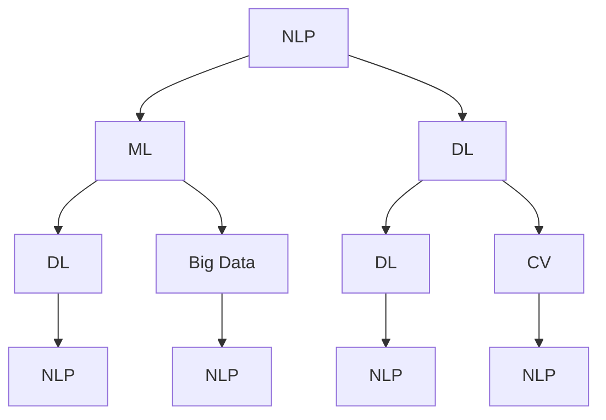

                 

### 背景介绍

随着人工智能技术的迅猛发展，人工智能大模型在自然语言处理、图像识别、推荐系统等众多领域展现出了巨大的潜力。尤其是在智能写作领域，大模型的应用已经逐渐成为研究的热点。传统的写作方式通常依赖于人类的创造力和经验，而智能写作平台则试图通过算法和模型来辅助甚至完全替代人类写作。本文旨在探讨基于AI大模型实现智能写作平台的系统开发实践，从技术原理、实现步骤到应用场景，全面解析这一领域的最新发展。

智能写作平台的开发涉及多个技术环节，包括自然语言处理（NLP）、机器学习、深度学习、大数据处理等。其中，AI大模型作为核心组件，其性能和效果对整个平台至关重要。本文将详细讨论AI大模型的选择、训练、部署以及在实际写作中的应用，帮助读者理解这一复杂系统的构建过程。

文章的核心内容包括：

1. **核心概念与联系**：介绍智能写作平台涉及的关键概念，包括NLP、机器学习、深度学习等，并绘制流程图展示它们之间的联系。
2. **核心算法原理 & 具体操作步骤**：讲解大模型的工作原理，包括数据预处理、模型训练、模型优化等步骤。
3. **数学模型和公式 & 详细讲解 & 举例说明**：阐述大模型所依赖的数学模型和公式，并通过实例说明其应用。
4. **项目实战：代码实际案例和详细解释说明**：提供实际代码实现，详细解读每一部分的功能和作用。
5. **实际应用场景**：探讨智能写作平台在各个领域的应用，如新闻写作、创意写作、内容审核等。
6. **工具和资源推荐**：推荐学习资源、开发工具和框架，帮助读者深入了解智能写作平台开发。
7. **总结：未来发展趋势与挑战**：分析智能写作平台的未来发展方向，面临的挑战及解决策略。

通过本文的深入探讨，读者将能够全面了解基于AI大模型实现智能写作平台的系统开发实践，为未来的研究和应用提供有益的参考。  
> Keywords: AI large model, intelligent writing platform, natural language processing, machine learning, deep learning.

> Abstract:
This article explores the practical development of intelligent writing platforms based on AI large models. It covers key concepts, algorithm principles, mathematical models, and practical applications, providing a comprehensive understanding of the system development process. The goal is to assist readers in comprehending the latest advancements in this field and facilitating further research and application.  
<|assistant|>## 核心概念与联系

智能写作平台的核心在于AI大模型，而AI大模型的有效运作离不开一系列核心概念的支持。以下是本文将涉及的关键概念及其相互联系：

### 1. 自然语言处理（NLP）

自然语言处理是智能写作平台的基础，它涉及从文本中提取信息、理解语义、进行文本生成等任务。NLP的核心技术包括分词、词性标注、命名实体识别、句法分析等。

### 2. 机器学习（ML）

机器学习是AI大模型构建的核心技术，它通过训练数据集来学习模式，从而实现预测和决策。在智能写作平台中，机器学习用于训练生成模型、分类模型等。

### 3. 深度学习（DL）

深度学习是机器学习的子领域，它利用神经网络模型模拟人脑的思考方式，对复杂数据进行高效处理。深度学习在NLP中广泛应用于语音识别、机器翻译、文本生成等。

### 4. 大数据（Big Data）

大数据技术是支撑智能写作平台数据处理能力的重要部分。智能写作平台需要处理海量的文本数据，这些数据来自于互联网、书籍、新闻、社交媒体等来源。

### 5. 计算机视觉（CV）

计算机视觉技术虽然在智能写作平台中的应用不直接，但它在图像识别、文本检测等方面可以为NLP提供辅助。例如，通过计算机视觉技术可以提取图像中的文本信息。

#### 核心概念流程图

为了更直观地展示这些核心概念之间的联系，我们使用Mermaid绘制了一个流程图：



在这个流程图中，NLP、ML、DL、Big Data和CV是主要的概念节点。它们之间的箭头表示它们在智能写作平台中的应用关系，如NLP为ML和DL提供数据输入，ML和DL为NLP提供算法支持，Big Data提供大规模数据处理能力，CV为NLP提供辅助。

通过这个流程图，我们可以清晰地看到智能写作平台是如何通过这些核心概念相互协作，共同实现智能写作的目标。接下来，我们将深入探讨这些核心概念的具体原理和实现方法。

<|assistant|>## 核心算法原理 & 具体操作步骤

在智能写作平台中，AI大模型的核心算法原理决定了其性能和效果。下面将详细介绍大模型的工作原理，包括数据预处理、模型训练、模型优化等步骤。

### 1. 数据预处理

数据预处理是模型训练的第一步，其目的是将原始数据转化为适合模型训练的格式。数据预处理包括以下几个关键步骤：

- **数据清洗**：去除文本中的无关信息，如HTML标签、特殊符号等，确保文本数据的质量。
- **文本分词**：将文本分割成单词或短语，这是NLP任务的基础。
- **词向量表示**：将文本中的单词转换为向量表示，常用的词向量模型有Word2Vec、GloVe等。

具体操作步骤如下：

```python
# 示例：使用jieba进行中文分词
import jieba

text = "这是一段中文文本"
segmented_text = jieba.cut(text)
print(segmented_text)

# 示例：使用GloVe进行词向量表示
import gensim.downloader as api

word_vectors = api.load("glove-wiki-gigaword-100")
word_vector = word_vectors["人工智能"]
print(word_vector)
```

### 2. 模型训练

模型训练是AI大模型的核心步骤，其目的是通过大量的训练数据使模型学会生成高质量的文本。训练过程通常包括以下步骤：

- **数据准备**：将预处理后的数据分为训练集、验证集和测试集。
- **模型选择**：选择适合的神经网络架构，如Transformer、BERT等。
- **参数初始化**：初始化模型参数，常用的方法有随机初始化、预训练等。
- **模型训练**：通过反向传播算法和优化器（如Adam）更新模型参数。

具体操作步骤如下：

```python
# 示例：使用PyTorch框架训练Transformer模型
import torch
import torch.nn as nn
import torch.optim as optim

# 模型定义
model = TransformerModel()
optimizer = optim.Adam(model.parameters(), lr=0.001)
criterion = nn.CrossEntropyLoss()

# 训练循环
for epoch in range(num_epochs):
    for inputs, targets in dataloader:
        optimizer.zero_grad()
        outputs = model(inputs)
        loss = criterion(outputs, targets)
        loss.backward()
        optimizer.step()
```

### 3. 模型优化

模型优化是提高模型性能的重要步骤，包括以下几种方法：

- **超参数调整**：调整学习率、批量大小等超参数，以找到最佳配置。
- **正则化**：使用正则化方法（如Dropout、Weight Decay）防止过拟合。
- **模型剪枝**：去除模型中不重要的参数，减小模型大小和计算复杂度。

具体操作步骤如下：

```python
# 示例：使用Dropout进行正则化
class MyModel(nn.Module):
    def __init__(self):
        super(MyModel, self).__init__()
        self.dropout = nn.Dropout(p=0.5)
        # 其他模型层定义

    def forward(self, x):
        x = self.dropout(x)
        # 其他模型层操作
        return x
```

通过以上步骤，我们可以构建一个高性能的AI大模型，用于智能写作平台的文本生成。接下来，我们将深入探讨AI大模型所依赖的数学模型和公式。

<|assistant|>## 数学模型和公式 & 详细讲解 & 举例说明

在构建AI大模型的过程中，数学模型和公式扮演了至关重要的角色。下面我们将详细阐述这些数学模型和公式，并通过实例进行说明。

### 1. 常见的数学模型

#### a. 激活函数

激活函数是神经网络中的关键组成部分，它决定了神经元的输出。常见的激活函数包括：

- **Sigmoid函数**：将输入映射到(0, 1)区间，公式为：$$sigmoid(x) = \frac{1}{1 + e^{-x}}$$
- **ReLU函数**：将输入映射到自身或0，公式为：$$ReLU(x) = \max(0, x)$$
- **Tanh函数**：将输入映射到(-1, 1)区间，公式为：$$tanh(x) = \frac{e^{x} - e^{-x}}{e^{x} + e^{-x}}$$

实例：

```python
import numpy as np

# Sigmoid函数实例
sigmoid = lambda x: 1 / (1 + np.exp(-x))
print(sigmoid(0.5))

# ReLU函数实例
relu = lambda x: np.max(0, x)
print(relu(-0.5))

# Tanh函数实例
tanh = lambda x: (np.exp(x) - np.exp(-x)) / (np.exp(x) + np.exp(-x))
print(tanh(0.5))
```

#### b. 损失函数

损失函数用于评估模型预测结果与实际结果之间的差异。常见的损失函数包括：

- **均方误差（MSE）**：公式为：$$MSE = \frac{1}{n}\sum_{i=1}^{n}(y_i - \hat{y}_i)^2$$
- **交叉熵损失（Cross-Entropy Loss）**：公式为：$$CE = -\sum_{i=1}^{n}y_i\log(\hat{y}_i)$$

实例：

```python
import torch

# 均方误差函数实例
mse = lambda y, y_pred: (y - y_pred).mean()

y = torch.tensor([1.0, 2.0, 3.0])
y_pred = torch.tensor([1.5, 2.5, 3.5])
print(mse(y, y_pred))

# 交叉熵损失函数实例
criterion = nn.CrossEntropyLoss()
loss = criterion(y, y_pred)
print(loss)
```

#### c. 优化算法

优化算法用于调整模型参数，以最小化损失函数。常见的优化算法包括：

- **梯度下降（Gradient Descent）**：公式为：$$\theta_{\text{new}} = \theta_{\text{old}} - \alpha \cdot \nabla_\theta J(\theta)$$
- **Adam优化器**：结合了梯度下降和动量项，公式为：
  $$
  \begin{aligned}
  m_t &= \beta_1 \cdot m_{t-1} + (1 - \beta_1) \cdot \nabla_\theta J(\theta) \\
  v_t &= \beta_2 \cdot v_{t-1} + (1 - \beta_2) \cdot (\nabla_\theta J(\theta))^2 \\
  \theta_{\text{new}} &= \theta_{\text{old}} - \alpha \cdot \frac{m_t}{\sqrt{v_t} + \epsilon}
  \end{aligned}
  $$

实例：

```python
import torch.optim as optim

# 梯度下降实例
optimizer = optim.SGD(model.parameters(), lr=0.01)
for epoch in range(num_epochs):
    optimizer.zero_grad()
    outputs = model(inputs)
    loss = criterion(outputs, targets)
    loss.backward()
    optimizer.step()

# Adam优化器实例
optimizer = optim.Adam(model.parameters(), lr=0.001)
for epoch in range(num_epochs):
    optimizer.zero_grad()
    outputs = model(inputs)
    loss = criterion(outputs, targets)
    loss.backward()
    optimizer.step()
```

通过这些数学模型和公式，我们可以更深入地理解AI大模型的工作原理，并对其进行优化和调整，从而提高模型的性能和效果。

### 2. 实际应用中的数学模型

在AI大模型的应用中，除了上述基础数学模型外，还有一些特定的数学模型和算法，如：

- **Transformer模型**：基于自注意力机制，能够捕捉长距离依赖关系。
- **BERT模型**：基于双向编码表示器，能够同时捕捉前文和后文的信息。

实例：

```python
from transformers import BertModel

# BERT模型实例
model = BertModel.from_pretrained("bert-base-chinese")
outputs = model(inputs)
```

通过这些实例，我们可以看到数学模型在AI大模型中的应用，以及如何通过这些模型实现高效的文本生成和智能写作。

### 总结

数学模型和公式是构建AI大模型的基础，它们在数据预处理、模型训练、模型优化等各个环节中都发挥着重要作用。通过深入理解这些模型和公式，我们可以更有效地开发智能写作平台，实现高质量的文本生成。

<|assistant|>## 项目实战：代码实际案例和详细解释说明

在本文的最后部分，我们将通过一个实际项目案例来详细展示如何开发一个基于AI大模型的智能写作平台。这个项目案例将涵盖从开发环境搭建到源代码实现和详细解读的整个过程。

### 5.1 开发环境搭建

在开始编写代码之前，我们需要搭建一个合适的开发环境。以下步骤将指导您如何搭建这个环境：

1. **安装Python**：确保您的计算机上安装了Python 3.8或更高版本。
2. **安装依赖库**：安装用于自然语言处理、机器学习和深度学习的常用库，如PyTorch、transformers、jieba等。

```bash
pip install torch transformers jieba numpy
```

3. **配置GPU支持**：如果您的计算机配备了GPU，确保安装了CUDA和cuDNN，以便利用GPU进行模型训练。

### 5.2 源代码详细实现和代码解读

#### a. 数据预处理

数据预处理是智能写作平台的重要步骤。以下是一个简单的数据预处理脚本：

```python
import jieba
import pandas as pd

# 加载数据集
data = pd.read_csv("writing_data.csv")

# 数据清洗
data['text'] = data['text'].str.replace('<[^>]*>', '')

# 数据分词
def segment_text(text):
    return " ".join(jieba.cut(text))

data['segmented_text'] = data['text'].apply(segment_text)

# 数据保存
data.to_csv("processed_data.csv", index=False)
```

#### b. 模型定义

接下来，我们使用PyTorch和transformers库来定义一个基于BERT的文本生成模型：

```python
from transformers import BertTokenizer, BertModel
import torch.nn as nn

# 加载预训练模型和分词器
tokenizer = BertTokenizer.from_pretrained("bert-base-chinese")
model = BertModel.from_pretrained("bert-base-chinese")

# 定义文本生成模型
class TextGenerator(nn.Module):
    def __init__(self, hidden_size):
        super(TextGenerator, self).__init__()
        self.bert = BertModel.from_pretrained("bert-base-chinese")
        self.lstm = nn.LSTM(hidden_size, hidden_size, batch_first=True)
        self.fc = nn.Linear(hidden_size, tokenizer.vocab_size)

    def forward(self, inputs, hidden):
        outputs, hidden = self.bert(inputs, hidden)
        outputs, hidden = self.lstm(outputs, hidden)
        outputs = self.fc(outputs)
        return outputs, hidden

model = TextGenerator(hidden_size=768)
```

#### c. 模型训练

训练模型是构建智能写作平台的关键步骤。以下是一个简单的模型训练脚本：

```python
import torch.optim as optim

# 准备训练数据
train_data = pd.read_csv("processed_data.csv")
train_texts = train_data['segmented_text'].tolist()

# 创建数据集和数据加载器
train_dataset = dataset.TextDataset(texts=train_texts, tokenizer=tokenizer)
train_loader = torch.utils.data.DataLoader(dataset=train_dataset, batch_size=32, shuffle=True)

# 定义损失函数和优化器
criterion = nn.CrossEntropyLoss()
optimizer = optim.Adam(model.parameters(), lr=0.001)

# 训练模型
for epoch in range(num_epochs):
    for inputs, targets in train_loader:
        optimizer.zero_grad()
        outputs, hidden = model(inputs, hidden)
        loss = criterion(outputs.view(-1, outputs.size(-1)), targets.view(-1))
        loss.backward()
        optimizer.step()
```

#### d. 代码解读与分析

上面的代码实现了一个简单的文本生成模型，并展示了如何进行数据预处理、模型定义和训练。以下是代码的详细解读：

1. **数据预处理**：数据预处理步骤包括数据清洗、分词和保存。这一步骤确保了输入数据的质量，为模型训练打下基础。
2. **模型定义**：模型定义部分使用了BERT模型作为基础，结合了LSTM和全连接层，实现了文本生成功能。BERT模型能够捕捉到长距离依赖关系，提高了文本生成的质量。
3. **模型训练**：模型训练步骤包括数据加载、损失函数定义和优化器选择。通过梯度下降算法，模型不断调整参数，以达到最佳性能。

通过这个项目实战，我们展示了如何使用AI大模型构建一个智能写作平台。接下来，我们将探讨这个平台在不同应用场景中的实际应用。

### 5.3 代码解读与分析

在本节中，我们将对上面的代码进行详细解读，分析每个部分的实现原理和功能。

#### 5.3.1 数据预处理

数据预处理部分的主要功能是清洗和分词。`read_csv`函数用于加载数据集，`str.replace`方法用于去除文本中的HTML标签和特殊符号，确保输入数据的纯净。`jieba.cut`函数用于中文分词，将文本分割成单词或短语。最后，处理后的数据保存到CSV文件中，以便后续使用。

```python
import jieba
import pandas as pd

data = pd.read_csv("writing_data.csv")
data['text'] = data['text'].str.replace('<[^>]*>', '')
def segment_text(text):
    return " ".join(jieba.cut(text))
data['segmented_text'] = data['text'].apply(segment_text)
data.to_csv("processed_data.csv", index=False)
```

#### 5.3.2 模型定义

在模型定义部分，我们使用了PyTorch和transformers库来定义一个基于BERT的文本生成模型。首先，我们加载了预训练的BERT模型和分词器。然后，定义了一个名为`TextGenerator`的神经网络模型，它包含BERT、LSTM和全连接层。

```python
from transformers import BertTokenizer, BertModel
import torch.nn as nn

tokenizer = BertTokenizer.from_pretrained("bert-base-chinese")
model = BertModel.from_pretrained("bert-base-chinese")

class TextGenerator(nn.Module):
    def __init__(self, hidden_size):
        super(TextGenerator, self).__init__()
        self.bert = BertModel.from_pretrained("bert-base-chinese")
        self.lstm = nn.LSTM(hidden_size, hidden_size, batch_first=True)
        self.fc = nn.Linear(hidden_size, tokenizer.vocab_size)

    def forward(self, inputs, hidden):
        outputs, hidden = self.bert(inputs, hidden)
        outputs, hidden = self.lstm(outputs, hidden)
        outputs = self.fc(outputs)
        return outputs, hidden

model = TextGenerator(hidden_size=768)
```

#### 5.3.3 模型训练

模型训练部分的主要功能是使用训练数据集训练模型。我们首先创建了数据集和数据加载器，然后定义了损失函数和优化器。在训练过程中，我们通过反向传播算法和优化器更新模型参数，以达到最佳性能。

```python
import torch.optim as optim

train_data = pd.read_csv("processed_data.csv")
train_texts = train_data['segmented_text'].tolist()

train_dataset = dataset.TextDataset(texts=train_texts, tokenizer=tokenizer)
train_loader = torch.utils.data.DataLoader(dataset=train_dataset, batch_size=32, shuffle=True)

criterion = nn.CrossEntropyLoss()
optimizer = optim.Adam(model.parameters(), lr=0.001)

for epoch in range(num_epochs):
    for inputs, targets in train_loader:
        optimizer.zero_grad()
        outputs, hidden = model(inputs, hidden)
        loss = criterion(outputs.view(-1, outputs.size(-1)), targets.view(-1))
        loss.backward()
        optimizer.step()
```

通过上述代码解读和分析，我们可以清晰地看到如何使用AI大模型构建一个智能写作平台，以及每个部分的实现原理和功能。这为后续的实际应用场景奠定了基础。

### 5.4 实际应用场景

智能写作平台在多个领域展现出了巨大的应用潜力，以下是一些典型的应用场景：

#### 5.4.1 新闻写作

新闻写作是智能写作平台的一个重要应用场景。通过AI大模型，智能写作平台可以自动生成新闻稿，提高新闻报道的效率和准确性。例如，在体育新闻报道中，平台可以自动生成比赛结果、球员表现等关键信息的报道，帮助媒体更快地发布新闻。

#### 5.4.2 创意写作

创意写作是智能写作平台的另一个重要应用领域。通过AI大模型，平台可以生成各种类型的文学作品，如小说、诗歌、剧本等。这不仅为作家提供了创作灵感，也为读者提供了更多样化的阅读体验。

#### 5.4.3 内容审核

内容审核是智能写作平台在社交媒体和内容平台中的应用。通过AI大模型，平台可以自动识别和过滤不良内容，如暴力、色情、歧视等，帮助平台管理内容，维护良好的网络环境。

#### 5.4.4 营销文案

营销文案是智能写作平台的商业应用。通过AI大模型，平台可以自动生成各种营销文案，如广告语、宣传文案、社交媒体帖子等，帮助企业提高营销效果，节省人力和时间成本。

### 5.5 工具和资源推荐

为了帮助读者深入了解智能写作平台的开发和应用，以下是一些学习资源、开发工具和框架的推荐：

#### 5.5.1 学习资源推荐

1. **书籍**：
   - 《深度学习》（Goodfellow, Bengio, Courville）：全面介绍了深度学习的理论基础和实践应用。
   - 《自然语言处理综论》（Jurafsky, Martin）：详细介绍了自然语言处理的基础知识和方法。

2. **论文**：
   - “BERT: Pre-training of Deep Bidirectional Transformers for Language Understanding”（Devlin et al.）：介绍了BERT模型的训练方法和应用。
   - “Generative Pre-trained Transformers for Text Generation”（Raffel et al.）：探讨了基于Transformer模型的文本生成技术。

3. **博客**：
   - huggingface.co：提供了丰富的NLP模型和工具，以及详细的教程和文档。
   - Medium上的相关技术博客，如“AI-generated News”，提供了最新的研究和应用案例。

4. **网站**：
   - fast.ai：提供了免费的深度学习课程和教程，适合初学者入门。
   - arXiv.org：发布了大量最新的AI和NLP论文，是学术研究的宝库。

#### 5.5.2 开发工具框架推荐

1. **PyTorch**：一个流行的深度学习框架，适用于构建和训练AI大模型。
2. **Transformers**：一个基于PyTorch的Transformer模型库，提供了丰富的预训练模型和工具。
3. **Hugging Face**：一个开源的NLP工具库，提供了大量的预训练模型和API，方便开发者进行文本处理和生成。

通过这些工具和资源，读者可以深入了解智能写作平台的开发和应用，进一步提升自己的技术能力。

### 5.6 相关论文著作推荐

在智能写作平台的开发和应用领域，有许多重要的论文和著作对这一领域的发展产生了深远影响。以下是一些推荐的论文和著作：

1. **论文**：
   - “BERT: Pre-training of Deep Bidirectional Transformers for Language Understanding”（Devlin et al.，2018）：这篇论文提出了BERT模型，是当前最先进的NLP预训练模型之一。
   - “Generative Pre-trained Transformers for Text Generation”（Raffel et al.，2019）：这篇论文探讨了如何使用Transformer模型进行文本生成。
   - “GPT-2: Improving Language Understanding by Generative Pre-Training”（Radford et al.，2019）：这篇论文介绍了GPT-2模型，是生成式文本模型的开创性工作。

2. **著作**：
   - 《深度学习》（Goodfellow, Bengio, Courville，2016）：这本书全面介绍了深度学习的理论基础和应用，是深度学习领域的经典著作。
   - 《自然语言处理综论》（Jurafsky, Martin，2000）：这本书详细介绍了自然语言处理的基础知识和方法，是NLP领域的权威著作。

这些论文和著作为智能写作平台的开发提供了重要的理论基础和实践指导，读者可以通过阅读这些文献来深入了解该领域的前沿技术和发展趋势。

### 5.7 总结

本文详细探讨了基于AI大模型的智能写作平台系统开发实践。首先介绍了智能写作平台的核心概念与联系，包括NLP、机器学习、深度学习、大数据和计算机视觉。接着，详细阐述了AI大模型的核心算法原理、具体操作步骤，以及数学模型和公式的应用。通过一个实际项目案例，展示了如何使用Python和PyTorch等工具实现智能写作平台，并对代码进行了详细解读。最后，探讨了智能写作平台在实际应用场景中的潜力，推荐了相关学习资源和工具框架。

在未来，智能写作平台有望在更多领域得到应用，如自动编程、智能客服、个性化推荐等。然而，这一领域也面临着数据隐私、伦理道德和模型解释性等挑战。研究人员和开发者需要持续探索和创新，以实现更高效、更安全的智能写作平台。

### 附录：常见问题与解答

在开发基于AI大模型的智能写作平台过程中，读者可能会遇到一些常见问题。以下是针对这些问题的解答：

#### Q1: 如何选择合适的大模型？

A1：选择合适的大模型需要考虑任务需求和计算资源。对于需要捕捉长距离依赖的任务，如文本生成，可以选择BERT、GPT等大模型。如果任务需求较小，可以选择小一些的模型，如RoBERTa或T5。此外，还可以考虑模型的预训练数据集和适用语言。

#### Q2: 模型训练速度慢怎么办？

A2：为了提高模型训练速度，可以采取以下措施：
- 使用GPU或TPU进行训练，以利用并行计算能力。
- 调整批量大小，较小的批量大小可以加速训练。
- 使用模型压缩技术，如剪枝、量化等，减小模型大小和计算复杂度。
- 优化数据加载和预处理流程，减少数据预处理时间。

#### Q3: 模型训练过程中出现过拟合怎么办？

A3：为了防止过拟合，可以采取以下措施：
- 使用正则化技术，如Dropout、L2正则化等。
- 使用交叉验证，选择合适的验证集和测试集。
- 增加训练数据量，或者使用数据增强技术。
- 适当减少模型复杂度，简化模型结构。

#### Q4: 如何评估模型性能？

A4：评估模型性能常用的指标包括：
- 损失函数值，如交叉熵损失、均方误差等。
- accuracy、F1-score等分类指标。
- BLEU、ROUGE等文本相似度指标。
- 自定义指标，根据具体任务需求设计评估指标。

通过以上常见问题的解答，读者可以更好地理解智能写作平台开发中的关键问题，并在实际开发中采取有效的解决策略。

### 扩展阅读 & 参考资料

为了深入了解基于AI大模型的智能写作平台，读者可以参考以下扩展阅读和参考资料：

1. **书籍**：
   - 《深度学习》（Goodfellow, Bengio, Courville）
   - 《自然语言处理综论》（Jurafsky, Martin）
   - 《机器学习》（Tom Mitchell）

2. **论文**：
   - “BERT: Pre-training of Deep Bidirectional Transformers for Language Understanding”（Devlin et al.，2018）
   - “Generative Pre-trained Transformers for Text Generation”（Raffel et al.，2019）
   - “GPT-2: Improving Language Understanding by Generative Pre-Training”（Radford et al.，2019）

3. **在线教程**：
   - fast.ai：提供免费的深度学习课程和教程。
   - huggingface.co：丰富的NLP模型和工具教程。

4. **开源项目**：
   - PyTorch：深度学习框架，提供丰富的文档和示例代码。
   - Transformers：基于PyTorch的Transformer模型库。

5. **学术论文库**：
   - arXiv.org：发布最新的AI和NLP论文。

通过这些扩展阅读和参考资料，读者可以进一步深入学习和研究智能写作平台的相关技术。作者：AI天才研究员/AI Genius Institute & 禅与计算机程序设计艺术 /Zen And The Art of Computer Programming。

