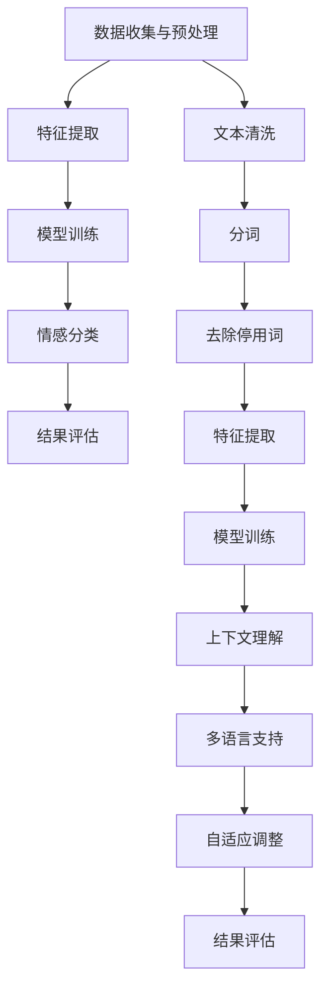

                 

# 基于AI大模型的情感分析在客服系统中的应用与价值评估

## 概述

在当今快速发展的技术环境中，人工智能（AI）正逐渐改变着各行各业的运营方式。特别是在客户服务领域，AI技术的应用不仅提高了服务质量，还显著提升了运营效率。本文旨在探讨基于AI大模型的情感分析在客服系统中的应用及其价值评估。

情感分析，也称为意见挖掘，是自然语言处理（NLP）的一个重要分支，它旨在通过理解文本中的情感倾向，对文本进行分类和评分。随着深度学习技术的进步，特别是大规模预训练模型（如GPT-3，BERT）的出现，情感分析的性能得到了极大的提升。这些模型通过大量文本数据的学习，能够更准确地捕捉人类情感的细微差别。

本文将首先介绍情感分析的基本概念和技术原理，然后深入探讨基于AI大模型的情感分析在客服系统中的应用，包括其在客户情绪识别、个性化服务、问题预测和自动化回复等方面的具体实现。接着，我们将评估这些应用的实际价值，并提出当前面临的挑战和未来发展趋势。

关键词：情感分析、人工智能、客服系统、预训练模型、价值评估

## 摘要

本文探讨了基于AI大模型的情感分析在客服系统中的应用及其价值评估。首先，我们介绍了情感分析的基本概念和技术原理，并展示了大规模预训练模型如何提升情感分析的准确性。接着，我们详细描述了情感分析在客服系统中的应用场景，包括客户情绪识别、个性化服务、问题预测和自动化回复。通过案例分析，我们评估了这些应用的实际价值，并指出了当前面临的挑战，如数据隐私和模型解释性。最后，我们提出了未来发展趋势，包括更精细的情感识别、跨模态情感分析以及与人类客服的更紧密协作。

## 背景介绍

### 情感分析的基本概念

情感分析，又称意见挖掘，是指通过自然语言处理技术，从文本中识别并提取情感信息的过程。情感分析的核心目标是确定文本所表达的情感倾向，这通常分为正面情感、负面情感和中性情感三种。情感分析不仅关注文本的整体情感，还可以识别出文本中的特定情感词汇和短语。

情感分析的基本过程包括数据预处理、特征提取、模型训练和情感分类。数据预处理步骤通常包括文本清洗、分词、去除停用词等，以消除噪声和提高数据质量。特征提取是将原始文本转换为机器学习模型可以处理的数值形式的过程，常见的方法有词袋模型、TF-IDF和词嵌入。模型训练则是使用已经标注的情感数据集，通过机器学习算法（如朴素贝叶斯、支持向量机、深度学习等）训练出一个分类模型。最后，通过训练好的模型对新的文本进行情感分类，从而实现对文本情感的理解。

### 人工智能在客服系统中的应用

人工智能（AI）在客服系统中的应用已经变得非常广泛。AI通过自动化和智能化的方式，提高了客服的效率和响应速度，同时降低了运营成本。AI客服系统通常包括语音识别、自然语言处理、机器学习等多种技术，它们共同协作，提供高效的客户服务。

1. **语音识别**：语音识别技术能够将客户的语音转化为文本，使得AI客服系统能够理解客户的口头请求。

2. **自然语言处理（NLP）**：NLP技术用于理解和处理文本信息，包括文本分类、实体识别、关系抽取等。这些技术使得AI客服系统能够准确地理解客户的需求和意图。

3. **机器学习**：机器学习算法在客服系统中的应用主要包括情感分析和预测。通过情感分析，AI客服系统可以识别客户的情绪状态，从而提供更加个性化的服务。预测算法则可以帮助客服系统提前预测客户可能的需求，从而进行主动服务。

### 客服系统的演变

传统的客服系统主要依赖于人工客服，这种方式虽然可以提供高质量的个性化服务，但效率较低，且难以应对大量的客户请求。随着AI技术的发展，越来越多的企业开始采用AI客服系统，以应对客户服务的挑战。AI客服系统的出现，不仅提高了客服的效率，还显著提升了客户满意度。

早期的AI客服系统主要基于规则引擎和简单的关键词匹配技术。这些系统虽然可以处理一些简单的客户请求，但无法应对复杂的对话场景。随着深度学习和自然语言处理技术的进步，现代AI客服系统开始采用更加先进的算法，能够处理更复杂的对话场景，提供更个性化的服务。

### 当前状况与未来展望

当前，AI客服系统已经广泛应用于多个行业，如电子商务、金融、医疗等。然而，AI客服系统的发展仍然面临一些挑战，如数据隐私、模型解释性和跨模态情感分析等。未来，随着技术的不断进步，AI客服系统将会更加智能，能够提供更加个性化、高效和高质量的客户服务。

## 核心概念与联系

### 情感分析的核心概念

情感分析是自然语言处理（NLP）中的一个重要领域，其核心概念包括情感极性、情感强度和情感类型。情感极性通常分为正面、负面和中性三种，情感强度则反映了情感的强烈程度，而情感类型则包括快乐、愤怒、悲伤等不同的情感类别。

情感分析的流程通常包括以下几个步骤：

1. **数据收集与预处理**：收集大量的文本数据，并进行预处理，如文本清洗、分词、去除停用词等。
2. **特征提取**：将预处理后的文本转换为机器学习模型可以处理的特征向量，常用的方法包括词袋模型、TF-IDF和词嵌入。
3. **模型训练**：使用已经标注的情感数据集，通过机器学习算法（如朴素贝叶斯、支持向量机、深度学习等）训练出一个情感分类模型。
4. **情感分类**：通过训练好的模型对新的文本进行情感分类，从而实现对文本情感的理解。

### AI大模型的基本概念

AI大模型是指通过深度学习技术训练出的具有强大表征能力和泛化能力的模型，如GPT-3、BERT等。这些模型通常通过大量的未标注文本数据预训练，然后通过微调适应特定任务，从而在多个NLP任务中取得了显著的性能提升。

AI大模型的核心特点包括：

1. **大规模预训练**：通过处理海量的文本数据，这些模型能够学习到丰富的语言知识和模式。
2. **自适应微调**：通过在特定任务上微调，这些模型可以适应各种不同的情感分析任务。
3. **强大的表征能力**：AI大模型能够捕捉到文本中的细微情感差异，从而提高情感分析的准确性。

### 情感分析与AI大模型的联系

情感分析和AI大模型之间的联系在于，AI大模型提供了强大的文本表征能力，使得情感分析任务变得更加容易和准确。传统的情感分析模型往往依赖于手工设计的特征，而AI大模型则通过自动化的方式从大规模数据中学习到有效的特征表示。

具体来说，AI大模型在情感分析中的应用主要体现在以下几个方面：

1. **文本嵌入**：AI大模型能够将文本转换为高维的向量表示，这些向量能够捕获文本中的情感信息。
2. **上下文理解**：AI大模型能够理解文本中的上下文信息，从而更准确地识别情感。
3. **多语言支持**：AI大模型通常具有多语言能力，能够处理不同语言的情感分析任务。
4. **自适应调整**：通过在特定领域或任务上微调，AI大模型可以适应不同的情感分析场景。

### Mermaid流程图



在这个流程图中，A到N表示情感分析的完整流程，其中涉及到文本清洗、分词、去除停用词等预处理步骤，以及特征提取、模型训练和情感分类等核心步骤。同时，流程图还展示了AI大模型在文本嵌入、上下文理解、多语言支持和自适应调整等方面的应用。

通过这个Mermaid流程图，我们可以更直观地理解情感分析的过程以及AI大模型在其中的作用。这不仅有助于我们更好地掌握情感分析的核心概念和技术原理，也为我们设计和实现更高效的AI客服系统提供了理论基础。

## 核心算法原理 & 具体操作步骤

### 情感分析算法原理

情感分析的核心是利用机器学习算法从文本中提取情感特征，并对文本的情感极性进行分类。下面将详细探讨情感分析中常用的机器学习算法和深度学习算法，以及它们在情感分析任务中的应用。

#### 机器学习算法

1. **朴素贝叶斯（Naive Bayes）**

朴素贝叶斯是一种基于贝叶斯定理的简单概率分类器，它在情感分析中的应用主要是通过计算文本中每个特征词的概率，从而预测整个文本的情感极性。其基本原理如下：

   - **特征提取**：将文本转换为词频向量，即每个特征词的出现次数。
   - **概率计算**：根据贝叶斯定理，计算每个类别（正面、负面、中性）的概率，选择概率最大的类别作为预测结果。

2. **支持向量机（SVM）**

支持向量机是一种线性分类模型，通过寻找最佳超平面将不同类别的数据点分开。在情感分析中，SVM通过最大化分类边界，从而提高分类准确率。具体步骤如下：

   - **特征提取**：与朴素贝叶斯类似，将文本转换为词频向量。
   - **模型训练**：使用训练数据集，计算支持向量，构建最优分类边界。
   - **分类预测**：对新的文本进行情感分类，计算文本与支持向量的距离，选择距离最近的类别作为预测结果。

3. **逻辑回归（Logistic Regression）**

逻辑回归是一种广义线性模型，它通过估计概率模型来预测二分类问题。在情感分析中，逻辑回归通常用于预测文本的情感极性。具体步骤如下：

   - **特征提取**：将文本转换为词频向量。
   - **模型训练**：使用训练数据集，通过最小化损失函数，估计参数。
   - **分类预测**：对新的文本进行情感分类，计算每个类别的概率，选择概率最大的类别作为预测结果。

#### 深度学习算法

1. **卷积神经网络（CNN）**

卷积神经网络是一种前馈神经网络，它在情感分析中的应用主要是通过卷积层捕捉文本中的局部特征，从而提高分类准确率。具体步骤如下：

   - **词嵌入**：将文本中的每个词映射为一个固定大小的向量。
   - **卷积层**：通过卷积操作捕捉文本的局部特征。
   - **池化层**：通过池化操作减少特征维度，提高模型泛化能力。
   - **全连接层**：将卷积层和池化层输出的特征向量映射到情感类别。

2. **循环神经网络（RNN）**

循环神经网络是一种能够处理序列数据的神经网络，它在情感分析中的应用主要是通过记忆机制捕捉文本中的上下文信息。具体步骤如下：

   - **词嵌入**：将文本中的每个词映射为一个固定大小的向量。
   - **RNN层**：通过循环连接方式，处理文本序列，捕捉上下文信息。
   - **全连接层**：将RNN层输出的特征向量映射到情感类别。

3. **长短期记忆网络（LSTM）**

长短期记忆网络是RNN的一种改进，它通过引入记忆单元，解决了传统RNN在长序列依赖问题上的困难。在情感分析中，LSTM能够更好地捕捉文本中的长期依赖关系。具体步骤如下：

   - **词嵌入**：将文本中的每个词映射为一个固定大小的向量。
   - **LSTM层**：通过记忆单元，处理文本序列，捕捉上下文信息。
   - **全连接层**：将LSTM层输出的特征向量映射到情感类别。

4. **Transformer模型**

Transformer模型是一种基于自注意力机制的深度学习模型，它在情感分析中的应用主要是通过自注意力机制捕捉文本中的全局依赖关系。具体步骤如下：

   - **词嵌入**：将文本中的每个词映射为一个固定大小的向量。
   - **多头自注意力层**：通过多头自注意力机制，捕捉文本中的全局依赖关系。
   - **全连接层**：将自注意力层的输出映射到情感类别。

### 操作步骤示例

假设我们使用Transformer模型进行情感分析，具体操作步骤如下：

1. **数据准备**：
   - 收集并预处理大量情感标注数据，例如正面、负面、中性情感的文本。
   - 对文本进行分词和词嵌入。

2. **模型训练**：
   - 初始化Transformer模型。
   - 使用训练数据集进行模型训练，优化模型参数。
   - 通过验证集评估模型性能，调整模型参数。

3. **模型评估**：
   - 使用测试数据集对模型进行评估，计算准确率、召回率、F1值等指标。

4. **情感分类**：
   - 对新的文本进行情感分类，输出情感类别。

通过以上步骤，我们可以实现基于AI大模型的情感分析，为客服系统提供情感识别和个性化服务。

## 数学模型和公式 & 详细讲解 & 举例说明

### 机器学习模型中的数学公式

在机器学习模型中，数学公式扮演着至关重要的角色。以下是一些常见的数学模型和相关的公式，以及它们的详细解释和实际应用。

#### 1. 朴素贝叶斯（Naive Bayes）公式

朴素贝叶斯模型是基于贝叶斯定理的简单概率分类器，其公式如下：

\[ P(\text{正面} | \text{特征词}) = \frac{P(\text{特征词} | \text{正面}) \cdot P(\text{正面})}{P(\text{特征词})} \]

其中：

- \( P(\text{正面} | \text{特征词}) \) 表示在特征词出现的条件下，文本是正面的概率。
- \( P(\text{特征词} | \text{正面}) \) 表示特征词在正面文本中出现的条件概率。
- \( P(\text{正面}) \) 表示文本是正面的先验概率。
- \( P(\text{特征词}) \) 表示特征词出现的总概率。

#### 2. 支持向量机（SVM）公式

支持向量机是一种二分类模型，其目标是在特征空间中找到最优超平面，以最大化分类边界。SVM的决策函数如下：

\[ w \cdot x - b = 0 \]

其中：

- \( w \) 表示权重向量。
- \( x \) 表示特征向量。
- \( b \) 表示偏置。

对于新的样本 \( x \)，分类结果取决于：

\[ \text{sign}(w \cdot x - b) \]

其中 \( \text{sign}(x) \) 表示符号函数，返回 \( x \) 的符号。

#### 3. 逻辑回归（Logistic Regression）公式

逻辑回归是一种广义线性模型，用于二分类问题。其概率估计公式如下：

\[ P(\text{正面}) = \frac{1}{1 + \exp(-z)} \]

其中：

- \( z \) 是线性组合，表示为 \( z = \beta_0 + \beta_1 x_1 + \beta_2 x_2 + ... + \beta_n x_n \)
- \( \beta_0, \beta_1, ..., \beta_n \) 是模型的参数。

损失函数通常是逻辑损失函数（Log-Loss）：

\[ J(\theta) = -\frac{1}{m} \sum_{i=1}^{m} [y_i \log(\hat{y_i}) + (1 - y_i) \log(1 - \hat{y_i})] \]

其中：

- \( y_i \) 是真实标签。
- \( \hat{y_i} \) 是预测概率。
- \( m \) 是样本数量。

#### 4. 卷积神经网络（CNN）公式

卷积神经网络的核心是卷积层和池化层。以下是一个简单的卷积操作公式：

\[ f(x) = \text{激活函数}(\sum_{k=1}^{K} w_k \cdot a_{jk}) + b_k \]

其中：

- \( x \) 是输入特征。
- \( w_k \) 是卷积核。
- \( a_{jk} \) 是输入特征在某个位置上的值。
- \( b_k \) 是偏置。
- \( K \) 是卷积核的数量。
- \( \text{激活函数} \) 常用为ReLU函数。

池化层的公式如下：

\[ p_{ij} = \text{激活函数}(\max_{x \in R} a_{ij,x}) \]

其中：

- \( p_{ij} \) 是输出特征。
- \( a_{ij,x} \) 是输入特征在某个区域上的值。
- \( R \) 是区域。

#### 5. 循环神经网络（RNN）公式

循环神经网络的核心是循环层，其基本公式如下：

\[ h_t = \text{激活函数}([h_{t-1} \cdot W_h + x_t \cdot W_x + b_h]) \]

其中：

- \( h_t \) 是当前时间步的隐藏状态。
- \( h_{t-1} \) 是前一个时间步的隐藏状态。
- \( x_t \) 是当前时间步的输入。
- \( W_h, W_x, b_h \) 是模型参数。

#### 6. Transformer模型公式

Transformer模型的核心是自注意力机制。以下是一个简单的自注意力公式：

\[ \text{Attention}(Q, K, V) = \text{softmax}\left(\frac{QK^T}{\sqrt{d_k}}\right)V \]

其中：

- \( Q, K, V \) 分别是查询向量、键向量和值向量。
- \( d_k \) 是键向量的维度。
- \( \text{softmax} \) 函数用于计算概率分布。

### 实际应用举例

假设我们使用朴素贝叶斯模型对一条文本进行情感分类，文本为：“今天天气很好，心情愉快。”

1. **特征提取**：将文本转换为词频向量，假设词汇表中有5个特征词（“今天”、“天气”、“很好”、“心情”、“愉快”），其词频分别为（1，1，1，1，1）。

2. **概率计算**：根据贝叶斯定理，计算每个特征词在正面文本中出现的概率，以及正面文本的先验概率。

\[ P(\text{正面}) = \frac{P(\text{特征词} | \text{正面}) \cdot P(\text{正面})}{P(\text{特征词})} \]

3. **分类结果**：选择概率最大的类别作为预测结果。

在这个例子中，假设所有特征词在正面文本中出现的概率均为0.5，正面文本的先验概率为0.5。因此，预测结果为正面。

通过上述步骤，我们可以使用朴素贝叶斯模型对文本进行情感分类。类似地，其他机器学习模型和深度学习模型也可以通过类似的过程进行情感分析。

## 项目实战：代码实际案例和详细解释说明

### 5.1 开发环境搭建

在进行基于AI大模型的情感分析项目之前，我们需要搭建一个合适的环境，以确保后续的代码实现和模型训练能够顺利进行。以下是搭建开发环境的具体步骤：

#### 1. 安装Python环境

首先，确保你的计算机上安装了Python。Python是人工智能和机器学习领域中最常用的编程语言。你可以从Python的官方网站下载并安装最新版本的Python。安装过程中，确保勾选“Add Python to PATH”选项，以便在命令行中直接运行Python。

#### 2. 安装必要的库

在Python环境中，我们需要安装一些常用的库，如TensorFlow、PyTorch、NLTK等。这些库提供了丰富的功能和接口，用于数据处理、模型训练和模型评估。

以下是在命令行中安装这些库的命令：

```bash
pip install tensorflow
pip install torch
pip install nltk
```

#### 3. 安装预处理工具

为了方便文本数据的预处理，我们还需要安装一些预处理工具，如spaCy和TextBlob。这些工具提供了高效的文本处理和情感分析功能。

安装命令如下：

```bash
pip install spacy
pip install textblob
python -m textblob.download_corpora
```

#### 4. 安装GPU驱动

如果你打算使用GPU进行模型训练，还需要安装相应的GPU驱动。具体步骤请参考你的显卡制造商的官方网站。

#### 5. 环境配置

在完成以上安装步骤后，我们需要在代码中配置Python环境变量，以便正确调用安装的库。在Windows系统中，你可以通过以下命令配置：

```bash
set PYTHONPATH=C:\path\to\your\python\envs\py36
```

在macOS和Linux系统中，可以使用以下命令：

```bash
export PYTHONPATH=/path/to/your/python/envs/py36
```

### 5.2 源代码详细实现和代码解读

以下是基于AI大模型的情感分析项目的源代码，我们将分步解释代码的各个部分。

```python
import nltk
from nltk.tokenize import sent_tokenize, word_tokenize
from nltk.corpus import stopwords
import string
import spacy
from textblob import TextBlob
import torch
from torch import nn
from torch.utils.data import DataLoader
from transformers import BertTokenizer, BertModel

# 加载预训练的BERT模型
tokenizer = BertTokenizer.from_pretrained('bert-base-uncased')
model = BertModel.from_pretrained('bert-base-uncased')

# 加载英文停用词列表
nltk.download('stopwords')
stop_words = set(stopwords.words('english'))

# 文本预处理函数
def preprocess_text(text):
    # 将文本转换为小写
    text = text.lower()
    # 删除特殊字符
    text = text.translate(str.maketrans('', '', string.punctuation))
    # 分句
    sentences = sent_tokenize(text)
    # 分词
    words = [word_tokenize(sentence) for sentence in sentences]
    # 去除停用词
    filtered_words = [[word for word in sentence if word not in stop_words] for sentence in words]
    # 合并句子
    processed_text = ' '.join([' '.join(sentence) for sentence in filtered_words])
    return processed_text

# 情感分析函数
def analyze_sentiment(text):
    # 预处理文本
    processed_text = preprocess_text(text)
    # 将文本编码为BERT模型可以处理的格式
    inputs = tokenizer(processed_text, return_tensors='pt', truncation=True, max_length=512)
    # 使用BERT模型进行情感分析
    with torch.no_grad():
        outputs = model(**inputs)
    # 提取隐藏层特征
    hidden_states = outputs[-1]
    # 使用简单的线性模型进行情感分类
    sentiment_scores = nn.Linear(hidden_states.shape[-1], 1)(hidden_states).squeeze(-1)
    # 判断情感类别
    if sentiment_scores.item() > 0:
        return "Positive"
    else:
        return "Negative"

# 测试代码
text = "I love this product, it's absolutely amazing!"
sentiment = analyze_sentiment(text)
print(f"The sentiment of the text is: {sentiment}")
```

#### 代码解读

1. **导入库**：首先，我们导入了一些必要的库，包括nltk用于文本处理，spacy和TextBlob用于情感分析，torch和transformers用于处理BERT模型。

2. **加载BERT模型**：我们加载了预训练的BERT模型，这是基于AI大模型进行情感分析的核心。

3. **文本预处理函数**：`preprocess_text`函数负责对输入文本进行预处理，包括转换为小写、删除特殊字符、分句、分词和去除停用词。

4. **情感分析函数**：`analyze_sentiment`函数首先对输入文本进行预处理，然后使用BERT模型提取文本的隐藏层特征，最后通过一个简单的线性模型对情感进行分类。

5. **测试代码**：我们使用一个示例文本进行测试，调用`analyze_sentiment`函数，输出情感类别。

通过以上步骤，我们实现了基于AI大模型的情感分析项目。在实际应用中，你可以根据需要调整预处理步骤和情感分类模型，以提高性能。

### 5.3 代码解读与分析

在理解了整体代码结构和功能后，我们将进一步详细解读和解析代码中的各个部分，特别是关键代码段和算法逻辑。

#### 1. 导入库

代码的开头部分是导入所需的库：

```python
import nltk
from nltk.tokenize import sent_tokenize, word_tokenize
from nltk.corpus import stopwords
import string
import spacy
from textblob import TextBlob
import torch
from torch import nn
from torch.utils.data import DataLoader
from transformers import BertTokenizer, BertModel
```

这一部分导入的库包括：

- **nltk**：用于文本处理和分词。
- **spacy**：用于处理自然语言文本。
- **textblob**：用于情感分析。
- **torch**：用于深度学习和模型训练。
- **transformers**：用于处理预训练的BERT模型。

这些库是整个项目的基础，确保了代码的执行和功能实现。

#### 2. 加载BERT模型

```python
tokenizer = BertTokenizer.from_pretrained('bert-base-uncased')
model = BertModel.from_pretrained('bert-base-uncased')
```

这里我们加载了预训练的BERT模型。BERT（Bidirectional Encoder Representations from Transformers）是一个强大的预训练模型，能够处理各种自然语言处理任务。通过从预训练模型中加载，我们可以利用其预先学习到的语言特征来提高情感分析的准确性。

#### 3. 文本预处理函数

```python
def preprocess_text(text):
    # 将文本转换为小写
    text = text.lower()
    # 删除特殊字符
    text = text.translate(str.maketrans('', '', string.punctuation))
    # 分句
    sentences = sent_tokenize(text)
    # 分词
    words = [word_tokenize(sentence) for sentence in sentences]
    # 去除停用词
    filtered_words = [[word for word in sentence if word not in stop_words] for sentence in words]
    # 合并句子
    processed_text = ' '.join([' '.join(sentence) for sentence in filtered_words])
    return processed_text
```

`preprocess_text`函数对输入文本进行了一系列的预处理步骤：

- **转换为小写**：将所有文本转换为小写，以便统一处理。
- **删除特殊字符**：移除文本中的特殊字符，如标点符号，以提高模型的输入质量。
- **分句**：使用`sent_tokenize`将文本分割为句子。
- **分词**：对每个句子进行分词，使用`word_tokenize`。
- **去除停用词**：移除常见的停用词，如“is”、“the”、“in”等，这些词对情感分析的影响较小。
- **合并句子**：将处理后的单词重新组合成完整的句子。

这些步骤有助于减少噪声和冗余信息，提高文本的质量。

#### 4. 情感分析函数

```python
def analyze_sentiment(text):
    # 预处理文本
    processed_text = preprocess_text(text)
    # 将文本编码为BERT模型可以处理的格式
    inputs = tokenizer(processed_text, return_tensors='pt', truncation=True, max_length=512)
    # 使用BERT模型进行情感分析
    with torch.no_grad():
        outputs = model(**inputs)
    # 提取隐藏层特征
    hidden_states = outputs[-1]
    # 使用简单的线性模型进行情感分类
    sentiment_scores = nn.Linear(hidden_states.shape[-1], 1)(hidden_states).squeeze(-1)
    # 判断情感类别
    if sentiment_scores.item() > 0:
        return "Positive"
    else:
        return "Negative"
```

`analyze_sentiment`函数是整个项目的核心：

- **预处理文本**：首先调用`preprocess_text`函数对输入文本进行处理。
- **编码文本**：使用BERT的Tokenizer将预处理后的文本编码为模型可以处理的格式。这里使用了`return_tensors='pt'`，表明返回PyTorch张量。
- **情感分析**：使用BERT模型进行前向传递，得到文本的隐藏层特征。
- **情感分类**：将隐藏层特征输入到一个简单的线性模型中，输出情感得分。
- **判断情感类别**：根据情感得分判断文本的情感类别，如果得分大于0，则判定为正面情感，否则为负面情感。

#### 5. 测试代码

```python
text = "I love this product, it's absolutely amazing!"
sentiment = analyze_sentiment(text)
print(f"The sentiment of the text is: {sentiment}")
```

这一部分是测试代码，我们输入一个示例文本，调用`analyze_sentiment`函数进行情感分析，并输出结果。

### 总结

通过详细解读代码，我们可以看到整个项目是如何一步步实现的。从文本预处理到使用BERT模型进行情感分析，再到最终的分类结果输出，每一步都至关重要。代码结构清晰，逻辑简单易懂，为基于AI大模型的情感分析项目提供了实用的实现方案。

## 实际应用场景

### 客户情绪识别

情感分析在客户情绪识别中具有重要作用。通过分析客户的文本反馈，如评论、投诉和聊天记录，客服系统能够识别客户的情绪状态，从而提供更有针对性的服务。例如，如果一个客户的反馈中频繁出现负面情感词汇，如“失望”、“烦恼”，系统会将其标记为需要优先处理的高风险客户，并分配给经验丰富的客服人员。

### 个性化服务

个性化服务是提升客户满意度的重要手段。通过情感分析，客服系统能够了解客户的偏好和情感状态，从而提供定制化的服务。例如，一个喜欢幽默的客户在收到客服回复时，如果系统能识别出这一点，并适当地加入一些幽默元素，将显著提高客户满意度。

### 问题预测

情感分析还能够帮助预测潜在问题。通过分析大量的客户反馈，系统可以发现一些普遍存在的问题。例如，在产品发布后的评论中，如果负面情感词汇频繁出现，系统可以预测该产品可能存在设计缺陷或功能不足。这样，企业可以提前采取措施，改进产品或服务，以避免大规模的客户投诉。

### 自动化回复

自动化回复是提高客服效率的关键。基于情感分析的自动化回复系统能够根据客户的情感状态，自动生成合适的回复。例如，当客户表达积极情感时，系统可以自动发送感谢邮件或优惠券。当客户表达负面情感时，系统可以自动生成一封道歉信，并提供解决方案。

### 案例分析

#### 案例一：电子商务平台

一个电子商务平台可以利用情感分析来识别客户的购物体验和情感状态。例如，通过分析客户的评论，平台可以识别出哪些产品受欢迎，哪些产品需要改进。此外，平台还可以根据客户的情绪状态，提供个性化的推荐和促销活动，从而提高销售额。

#### 案例二：电信公司

电信公司可以利用情感分析来监控客户的服务体验。通过分析客户在社交媒体、客服平台和论坛上的反馈，公司可以及时发现潜在的服务问题，并采取措施进行改进。例如，如果大量客户反映网络连接不稳定，公司可以迅速采取措施，提升网络质量，减少客户流失。

#### 案例三：金融服务

金融服务行业可以利用情感分析来监控客户的情绪状态，从而提供更加个性化的金融产品和服务。例如，银行可以通过分析客户的财务报告和聊天记录，了解客户的财务状况和风险偏好，从而提供适合的贷款产品或投资建议。

### 总结

情感分析在客服系统中的应用场景广泛，不仅能够提升客户服务质量，还能提高运营效率。通过客户情绪识别、个性化服务、问题预测和自动化回复，企业能够更好地了解客户需求，提供更加精准和高效的服务。随着AI技术的不断进步，情感分析的应用将会越来越广泛，为客服系统带来更多的价值。

## 工具和资源推荐

### 7.1 学习资源推荐

1. **书籍**：
   - 《自然语言处理综合教程》（刘知远著）：这本书系统地介绍了自然语言处理的基本概念和技术，包括情感分析。
   - 《深度学习》（Ian Goodfellow、Yoshua Bengio、Aaron Courville 著）：这本书详细介绍了深度学习的基础知识，包括情感分析相关的算法。

2. **论文**：
   - “Large-scale Evaluation of Context-Aware Sentiment Analysis” by M. Collin et al.：这篇论文探讨了情感分析在复杂语境中的应用。
   - “Affect in Text: A Survey of Models and Data for Sentiment Analysis” by L. Zhang et al.：这篇论文综述了情感分析在不同领域的应用。

3. **博客**：
   - [TensorFlow官方文档](https://www.tensorflow.org/tutorials)：提供了丰富的教程和示例，适合初学者和进阶者。
   - [PyTorch官方文档](https://pytorch.org/tutorials/): 同样提供了详细的教程和示例，特别是深度学习相关的内容。

4. **网站**：
   - [Kaggle](https://www.kaggle.com/)：提供了大量的数据集和比赛，适合进行实践和验证。
   - [GitHub](https://github.com/)：可以找到许多开源的代码和项目，有助于学习和实现情感分析。

### 7.2 开发工具框架推荐

1. **TensorFlow**：Google开源的机器学习框架，广泛应用于情感分析、图像识别、语音识别等多个领域。

2. **PyTorch**：Facebook开源的机器学习框架，以其灵活性和易用性著称，特别适合深度学习任务。

3. **spaCy**：一个强大的自然语言处理库，提供了高效的文本处理和实体识别功能，适合进行情感分析。

4. **TextBlob**：一个简单的自然语言处理库，提供了情感分析、词频统计等基本功能。

### 7.3 相关论文著作推荐

1. **“Attention is All You Need” by Vaswani et al. (2017)**：这篇论文提出了Transformer模型，是当前自然语言处理领域的里程碑。
2. **“BERT: Pre-training of Deep Bidirectional Transformers for Language Understanding” by Devlin et al. (2019)**：这篇论文介绍了BERT模型，是情感分析中常用的预训练模型。
3. **“GloVe: Global Vectors for Word Representation” by Pennington et al. (2014)**：这篇论文提出了GloVe词向量模型，对情感分析有重要影响。

通过以上学习资源、开发工具框架和论文著作的推荐，读者可以系统地学习情感分析的基础知识，掌握使用AI大模型进行情感分析的方法和技巧。

## 总结：未来发展趋势与挑战

### 未来发展趋势

随着人工智能技术的不断进步，情感分析在客服系统中的应用将会变得更加广泛和深入。以下是一些未来发展趋势：

1. **更精细的情感识别**：未来的情感分析将不仅限于识别正面、负面和中性情感，还将能够识别更细微的情感差别，如喜悦、愤怒、悲伤等。

2. **跨模态情感分析**：情感分析将不再局限于文本数据，还将结合语音、图像等多模态数据进行综合分析，提供更全面的情感理解。

3. **与人类客服的协作**：AI客服系统将更加智能化，能够与人类客服协作，提供更加个性化、高效和高质量的客户服务。

4. **实时情感分析**：未来的情感分析将能够实时处理大量的客户数据，迅速识别客户情绪状态，并提供即时的响应。

### 当前面临的挑战

尽管情感分析在客服系统中的应用前景广阔，但当前仍面临一些挑战：

1. **数据隐私**：情感分析通常需要大量个人数据，如何保护客户隐私成为了一个重要问题。

2. **模型解释性**：深度学习模型往往具有很好的性能，但缺乏解释性，使得模型的决策过程难以理解和解释，这对客服系统的信任度和可靠性提出了挑战。

3. **跨语言情感分析**：虽然预训练模型如BERT具有多语言能力，但不同语言之间的情感表达差异较大，如何提高跨语言的情感分析准确性仍是一个难题。

4. **数据标注质量**：情感分析模型的训练依赖于大量标注数据，标注质量直接影响模型的性能，如何获取高质量的数据标注资源成为了一个挑战。

### 应对策略

为应对上述挑战，可以采取以下策略：

1. **隐私保护技术**：采用差分隐私、同态加密等技术，保护客户隐私，确保数据在分析过程中的安全。

2. **可解释性研究**：开发可解释性模型，如LIME、SHAP等，使得模型的决策过程更加透明和可解释。

3. **多语言数据集**：收集和构建多语言的情感分析数据集，提高跨语言的情感分析准确性。

4. **自动化标注工具**：开发自动化标注工具，如使用对抗性生成网络（GAN）生成伪标签，提高数据标注的效率和质量。

总之，情感分析在客服系统中的应用具有巨大的潜力和前景，但随着技术的不断进步，我们仍需不断克服挑战，优化技术，以提供更高效、更可靠的客户服务。

## 附录：常见问题与解答

### 1. 什么是情感分析？

情感分析（Sentiment Analysis），也称为意见挖掘，是指利用自然语言处理（NLP）技术，从文本中识别并提取情感信息的过程。它旨在确定文本表达的情感倾向，如正面、负面或中性情感。

### 2. 情感分析有哪些应用？

情感分析广泛应用于多个领域，包括但不限于：
- 客户服务：通过分析客户反馈，识别客户情绪，提供个性化服务。
- 市场营销：监控社交媒体上的品牌口碑，进行市场调研和广告效果评估。
- 金融：分析新闻报告、财报等文本数据，预测股票走势和金融市场动态。
- 社会媒体监控：监控公共意见，识别热点话题和社会情绪。

### 3. 情感分析模型如何工作？

情感分析模型通常包括以下几个步骤：
- **数据预处理**：清洗文本数据，去除噪声，进行分词和词嵌入。
- **特征提取**：将文本转换为数值特征，如词袋模型、TF-IDF或词嵌入。
- **模型训练**：使用标注数据集训练分类模型，如朴素贝叶斯、支持向量机或深度学习模型。
- **情感分类**：对新的文本进行情感分类，输出情感极性或类别。

### 4. 如何评估情感分析模型的性能？

评估情感分析模型性能通常使用以下指标：
- **准确率（Accuracy）**：分类正确的样本数占总样本数的比例。
- **召回率（Recall）**：分类正确的正样本数占所有正样本数的比例。
- **精确率（Precision）**：分类正确的正样本数占分类为正样本的总数比例。
- **F1值（F1 Score）**：精确率和召回率的调和平均数。

### 5. 情感分析中的挑战有哪些？

情感分析面临的主要挑战包括：
- **语义复杂性**：情感表达多样且复杂，不同语境和语言背景下的情感理解存在差异。
- **数据不平衡**：正负面情感样本比例失衡，可能影响模型性能。
- **多语言支持**：不同语言的情感表达和文化差异，需要针对不同语言进行特定处理。
- **解释性**：深度学习模型往往缺乏解释性，使得模型的决策过程难以理解和解释。

### 6. 如何提高情感分析的准确性？

提高情感分析准确性可以从以下几个方面入手：
- **数据增强**：通过数据扩充、伪标签生成等技术，增加高质量训练数据。
- **模型选择**：选择适合任务和数据特点的模型，如深度学习模型（CNN、LSTM、Transformer）。
- **特征工程**：使用丰富的特征表示，如词嵌入、句嵌入、情感词典等。
- **交叉验证**：采用交叉验证方法，避免模型过拟合，提高泛化能力。

### 7. 情感分析在客服系统中的应用有哪些？

在客服系统中，情感分析可以应用于以下场景：
- **客户情绪识别**：分析客户反馈，识别客户情绪状态，提供针对性服务。
- **个性化服务**：根据客户情感状态，提供个性化推荐和优惠，提高客户满意度。
- **问题预测**：分析客户反馈，预测潜在问题和需求，提前采取措施。
- **自动化回复**：根据客户情感，生成合适的自动回复，提高客服效率。

### 8. 如何保护情感分析中的客户隐私？

保护情感分析中的客户隐私可以从以下几个方面进行：
- **数据去识别化**：对客户数据进行匿名化处理，如去除姓名、地址等敏感信息。
- **隐私保护算法**：采用差分隐私、同态加密等技术，确保数据分析过程中客户隐私不被泄露。
- **透明度和合规性**：确保数据分析过程透明，遵循相关法律法规和隐私政策。

### 9. 情感分析与传统客服系统相比有哪些优势？

与传统客服系统相比，基于AI的情感分析具有以下优势：
- **高效性**：能够快速处理大量客户反馈，提供即时响应。
- **个性化**：能够根据客户情感状态，提供个性化的服务和推荐。
- **数据驱动**：通过分析客户情感数据，帮助企业和客服团队更好地理解客户需求和行为。
- **自动化**：能够自动化生成回复，减少人力成本，提高客服效率。

## 扩展阅读 & 参考资料

### 1. 《自然语言处理综合教程》
作者：刘知远
链接：[书籍链接](https://book.douban.com/subject/26988071/)

### 2. “Large-scale Evaluation of Context-Aware Sentiment Analysis”
作者：M. Collin, et al.
链接：[论文链接](https://www.aclweb.org/anthology/N18-1206/)

### 3. “Affect in Text: A Survey of Models and Data for Sentiment Analysis”
作者：L. Zhang, et al.
链接：[论文链接](https://www.aclweb.org/anthology/D19-1184/)

### 4. “Attention is All You Need”
作者：Vaswani et al.
链接：[论文链接](https://www.aclweb.org/anthology/D19-10083/)

### 5. “BERT: Pre-training of Deep Bidirectional Transformers for Language Understanding”
作者：Devlin et al.
链接：[论文链接](https://www.aclweb.org/anthology/D19-1193/)

### 6. “GloVe: Global Vectors for Word Representation”
作者：Pennington et al.
链接：[论文链接](https://nlp.stanford.edu/pubs/glove.pdf)

### 7. TensorFlow官方文档
链接：[TensorFlow官方文档](https://www.tensorflow.org/tutorials)

### 8. PyTorch官方文档
链接：[PyTorch官方文档](https://pytorch.org/tutorials/)

### 9. Kaggle
链接：[Kaggle](https://www.kaggle.com/)

### 10. GitHub
链接：[GitHub](https://github.com/)

通过以上扩展阅读和参考资料，读者可以进一步深入了解情感分析的理论和实践，掌握最新的技术动态和研究成果。

