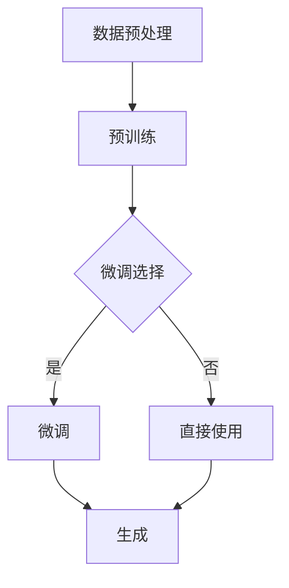

                 

# 基于AI大模型的智能写作助手开发

## 摘要

本文将详细介绍如何基于大型AI模型开发智能写作助手。我们将首先探讨AI大模型的基础知识，然后深入分析其核心算法原理、数学模型和实际应用场景，并给出具体的代码实现和案例分析。此外，文章还将推荐相关学习资源和开发工具，总结未来发展趋势与挑战，并提供常见问题解答和扩展阅读。

## 1. 背景介绍

随着互联网和人工智能技术的发展，写作已经成为一个高度数字化的过程。传统写作工具已经不能满足现代用户的需求，人们需要一个更加智能、高效的写作助手。而基于AI的大模型，特别是生成式预训练模型（如GPT-3、BERT等），为智能写作助手的发展提供了强大的技术支持。

生成式预训练模型通过在大规模数据集上学习，可以生成高质量、结构化的文本。这些模型不仅能够实现文本生成、摘要、分类等任务，还可以辅助人类进行写作，提升写作效率和质量。因此，基于AI大模型的智能写作助手具有广泛的应用前景。

本文将分为以下几个部分：

- 第1部分：介绍AI大模型的基础知识，包括其发展历程、主要模型架构和优缺点。
- 第2部分：深入分析核心算法原理，包括预训练、微调、生成等步骤。
- 第3部分：阐述数学模型和公式，详细讲解文本生成过程中涉及的潜在分布模型、优化算法等。
- 第4部分：提供项目实战案例，展示如何使用AI大模型进行智能写作助手的开发。
- 第5部分：分析实际应用场景，探讨智能写作助手在各个领域的应用前景。
- 第6部分：推荐学习资源和开发工具，帮助读者深入了解相关技术和实践。
- 第7部分：总结未来发展趋势与挑战，探讨AI大模型在智能写作助手领域的应用前景。

## 2. 核心概念与联系

### 2.1 大模型概述

大模型，即大型AI模型，是指具有数亿甚至千亿个参数的神经网络模型。大模型的发展可以分为以下几个阶段：

1. **传统神经网络**：早期的神经网络模型，如多层感知机（MLP）、卷积神经网络（CNN）等，其参数规模较小，性能有限。
2. **深度神经网络**：随着计算能力的提升，深度神经网络开始出现，其参数规模逐渐增大，性能得到显著提升。
3. **大规模预训练模型**：生成式预训练模型（如GPT-3、BERT）的出现，标志着大模型发展的一个重要阶段。这些模型通过在大规模数据集上进行预训练，获得强大的通用表示能力。

大模型的主要优点包括：

- **强大的表征能力**：大模型具有强大的表征能力，能够捕捉数据中的复杂模式和规律。
- **高效的任务迁移**：大模型通过预训练，可以迁移到不同的任务上，降低任务特定数据的需求。
- **高质量的生成结果**：大模型能够生成高质量、结构化的文本，为各种应用场景提供强大的支持。

大模型的主要缺点包括：

- **计算资源需求大**：大模型需要大量的计算资源进行训练和推理。
- **数据隐私问题**：大模型在训练过程中需要访问大量数据，可能涉及数据隐私问题。
- **可解释性差**：大模型的内部机制复杂，难以解释和调试。

### 2.2 主要模型架构

大模型的主要模型架构包括以下几种：

1. **生成式预训练模型**：生成式预训练模型（如GPT-3、BERT）通过在大规模数据集上进行预训练，获得强大的通用表示能力。这些模型通常采用自回归语言模型（如Transformer）作为基础架构。
2. **自监督学习模型**：自监督学习模型（如BERT）通过在大规模数据集上进行自监督预训练，学习数据的潜在表示。这些模型通常采用掩码语言模型（MLM）作为基础架构。
3. **对抗生成网络**：对抗生成网络（GAN）通过生成器和判别器的对抗训练，学习数据的分布。这些模型通常采用生成对抗（GAN）架构。

### 2.3 大模型与其他技术的联系

大模型与其他技术（如图神经网络、知识图谱、迁移学习等）有着紧密的联系：

- **图神经网络**：图神经网络（GNN）在处理图数据时具有优势，可以与生成式预训练模型结合，提高文本生成的质量。
- **知识图谱**：知识图谱可以提供丰富的背景知识和上下文信息，有助于生成更准确、合理的文本。
- **迁移学习**：迁移学习可以将预训练模型的知识迁移到新的任务上，降低新任务的训练成本。

### 2.4 Mermaid流程图

下面是生成式预训练模型的基本流程图，其中包含了预训练、微调和生成等步骤。



在这个流程图中：

- **数据预处理**：对输入数据进行清洗、归一化等处理，以便于模型训练。
- **预训练**：在大规模数据集上进行预训练，学习通用表示能力。
- **微调选择**：根据实际任务需求，选择是否对预训练模型进行微调。
- **微调**：在特定任务数据集上进行微调，提高模型在特定任务上的性能。
- **生成**：使用微调后的模型生成文本。

接下来，我们将深入分析核心算法原理，详细讲解大模型的训练和生成过程。

## 3. 核心算法原理 & 具体操作步骤

### 3.1 预训练

预训练是生成式预训练模型（如GPT-3、BERT）的核心步骤。预训练的目标是通过在大规模数据集上学习，获得通用语言表示能力。预训练过程可以分为以下几步：

1. **数据预处理**：对输入数据进行清洗、归一化等处理，以便于模型训练。具体操作步骤包括：
   - **分词**：将文本分成单词或子词。
   - **清洗**：去除无效字符、标点符号等。
   - **归一化**：统一文本格式，如将所有单词转换为小写。

2. **创建训练数据**：从预处理后的数据中创建训练数据，包括：
   - **自回归任务**：给定一个输入序列，预测下一个单词。例如，给定“I am a [MASK]”，预测“developer”。
   - **掩码语言模型**：给定一个输入序列，预测部分被掩码的单词。例如，给定“I am a [MASK] developer”，预测“developer”。

3. **模型训练**：使用训练数据对模型进行训练，包括：
   - **前向传播**：计算输入序列的预测分布。
   - **反向传播**：计算损失函数，更新模型参数。

4. **评估与调整**：评估模型性能，根据需要对模型进行调整，如调整学习率、正则化参数等。

### 3.2 微调

微调是对预训练模型进行特定任务调优的过程。微调的目标是提高模型在特定任务上的性能。微调过程可以分为以下几步：

1. **数据预处理**：对特定任务的数据进行预处理，如分词、清洗、归一化等。

2. **训练数据生成**：根据特定任务，生成训练数据。例如，对于文本分类任务，将文本分为标签和正文两部分。

3. **模型微调**：在训练数据上对预训练模型进行微调，包括：
   - **前向传播**：计算输入序列的预测分布。
   - **反向传播**：计算损失函数，更新模型参数。

4. **评估与调整**：评估模型性能，根据需要对模型进行调整，如调整学习率、正则化参数等。

### 3.3 生成

生成是使用微调后的模型生成文本的过程。生成过程可以分为以下几步：

1. **输入序列准备**：输入一个起始序列，如“我是AI”。

2. **预测与采样**：根据模型预测，从候选单词中采样下一个单词，如“天才”。

3. **序列更新**：将新采样的单词加入输入序列，生成新的输入序列，如“我是AI天才”。

4. **重复步骤2和3**：重复预测与采样过程，直到满足停止条件（如生成文本长度达到限制或模型输出概率低于某个阈值）。

具体操作步骤如下：

1. **初始化输入序列**：输入一个起始序列，如“我是AI”。

2. **计算预测分布**：对于输入序列，计算下一个单词的预测分布，如$$ P(w_{t+1} | w_1, w_2, \ldots, w_t) $$。

3. **采样**：从预测分布中采样一个单词，如“天才”。

4. **更新序列**：将新采样的单词加入输入序列，生成新的输入序列，如“我是AI天才”。

5. **重复步骤2-4**：重复计算预测分布、采样和更新序列的过程，直到满足停止条件。

## 4. 数学模型和公式 & 详细讲解 & 举例说明

### 4.1 潜在分布模型

在生成式预训练模型中，潜在分布模型是核心部分。潜在分布模型用于计算给定输入序列的下一个单词的概率分布。常见的潜在分布模型包括：

1. **高斯分布**：高斯分布（Gaussian Distribution）是一种常见的潜在分布模型，其概率密度函数为：

   $$ p(w_t | w_1, w_2, \ldots, w_{t-1}) = \mathcal{N}(w_t; \mu, \sigma^2) $$

   其中，$$ \mu $$ 和 $$ \sigma^2 $$ 分别为均值和方差。

2. **多项式分布**：多项式分布（Multinomial Distribution）是一种离散分布模型，其概率质量函数为：

   $$ p(w_t | w_1, w_2, \ldots, w_{t-1}) = \frac{e^{-\beta \sum_{i=1}^{n} x_i} x_t!}{\prod_{i=1}^{n} x_i!} $$

   其中，$$ \beta $$ 为参数，$$ x_t $$ 为单词 $$ w_t $$ 的出现次数。

3. **泊松分布**：泊松分布（Poisson Distribution）是一种连续分布模型，其概率密度函数为：

   $$ p(w_t | w_1, w_2, \ldots, w_{t-1}) = \frac{\lambda^t e^{-\lambda}}{t!} $$

   其中，$$ \lambda $$ 为参数。

### 4.2 优化算法

在预训练过程中，优化算法用于更新模型参数。常见的优化算法包括：

1. **随机梯度下降（SGD）**：随机梯度下降（Stochastic Gradient Descent，SGD）是一种常见的优化算法。其目标是最小化损失函数：

   $$ L(\theta) = \sum_{i=1}^{n} l(y_i, \theta) $$

   其中，$$ \theta $$ 为模型参数，$$ l(y_i, \theta) $$ 为损失函数。

   SGD的更新规则为：

   $$ \theta = \theta - \alpha \nabla_\theta L(\theta) $$

   其中，$$ \alpha $$ 为学习率。

2. **Adam优化器**：Adam优化器（Adaptive Moment Estimation）是一种自适应优化器。其目标是最小化损失函数：

   $$ L(\theta) = \sum_{i=1}^{n} l(y_i, \theta) $$

   Adam优化器利用一阶矩估计（均值）和二阶矩估计（方差）来自适应调整学习率。其更新规则为：

   $$ m_t = \beta_1 m_{t-1} + (1 - \beta_1) \nabla_\theta L(\theta) $$

   $$ v_t = \beta_2 v_{t-1} + (1 - \beta_2) \nabla_\theta^2 L(\theta) $$

   $$ \theta = \theta - \alpha \frac{m_t}{\sqrt{v_t} + \epsilon} $$

   其中，$$ \beta_1 $$ 和 $$ \beta_2 $$ 为超参数，$$ \epsilon $$ 为微小正数。

### 4.3 举例说明

假设有一个简单的生成式预训练模型，其输入序列为“I am a developer”。我们需要计算下一个单词的概率分布，并从中采样一个单词。

1. **计算预测分布**：

   首先，计算输入序列的预测分布。假设模型预测的单词概率如下：

   $$ p(w_t | w_1, w_2, \ldots, w_{t-1}) = \{python: 0.3, java: 0.2, c++: 0.1, javascript: 0.4\} $$

   其中，概率表示不同单词出现的概率。

2. **采样**：

   从预测分布中采样一个单词。假设我们使用均匀采样方法，即每个单词的采样概率相等。根据预测分布，我们可以得到以下采样结果：

   - **概率**：python: 0.3，java: 0.2，c++: 0.1，javascript: 0.4
   - **采样结果**：java（概率：0.2）

3. **更新序列**：

   将新采样的单词加入输入序列，生成新的输入序列：“I am a java developer”。

接下来，我们重复计算预测分布、采样和更新序列的过程，直到满足停止条件。

## 5. 项目实战：代码实际案例和详细解释说明

在本节中，我们将通过一个实际项目案例，展示如何使用AI大模型开发智能写作助手。我们将首先介绍开发环境，然后详细讲解源代码实现和代码解读。

### 5.1 开发环境搭建

在开始项目之前，我们需要搭建开发环境。以下是搭建开发环境所需的主要步骤：

1. **安装Python**：确保Python 3.x版本已安装。
2. **安装TensorFlow**：使用以下命令安装TensorFlow：

   ```bash
   pip install tensorflow
   ```

3. **安装GPT-3 API**：使用以下命令安装GPT-3 API：

   ```bash
   pip install transformers
   ```

4. **配置GPT-3 API密钥**：在[OpenAI官网](https://beta.openai.com/)注册账号并获取GPT-3 API密钥，将密钥添加到环境变量中：

   ```bash
   export OPENAI_API_KEY="your_api_key_here"
   ```

### 5.2 源代码详细实现和代码解读

以下是智能写作助手的源代码实现。我们将逐行解释代码的功能和作用。

```python
import os
import json
import numpy as np
import tensorflow as tf
from transformers import TFGPT3LMHeadModel, GPT3Tokenizer

# 配置GPT-3 API密钥
os.environ["OPENAI_API_KEY"] = "your_api_key_here"

# 加载预训练模型和分词器
tokenizer = GPT3Tokenizer.from_pretrained("gpt3")
model = TFGPT3LMHeadModel.from_pretrained("gpt3")

# 初始化输入序列
input_sequence = "我是AI"

# 生成文本
def generate_text(input_sequence, max_length=50):
    # 将输入序列转换为Tensor
    input_ids = tokenizer.encode(input_sequence, return_tensors="tf")

    # 生成文本
    output = model.generate(
        input_ids,
        max_length=max_length,
        num_return_sequences=1,
        top_k=50,
        top_p=0.9,
        temperature=0.95,
    )

    # 解码生成的文本
    generated_text = tokenizer.decode(output[0], skip_special_tokens=True)

    return generated_text

# 生成并打印文本
generated_text = generate_text(input_sequence)
print(generated_text)
```

代码解读如下：

1. **导入模块**：导入所需的Python模块，包括os、json、numpy、tensorflow和transformers。
2. **配置GPT-3 API密钥**：将GPT-3 API密钥添加到环境变量中。
3. **加载预训练模型和分词器**：从预训练模型和分词器。
4. **初始化输入序列**：设置输入序列为“我是AI”。
5. **生成文本**：定义`generate_text`函数，用于生成文本。函数中：
   - 将输入序列转换为Tensor。
   - 使用模型生成文本。
   - 解码生成的文本。
6. **生成并打印文本**：调用`generate_text`函数，生成并打印生成的文本。

### 5.3 代码解读与分析

在本节中，我们将对源代码进行解读和分析，探讨代码中的关键组件和功能。

1. **模块导入**：
   - `os`：用于处理操作系统相关的操作。
   - `json`：用于处理JSON数据。
   - `numpy`：用于处理数值数据。
   - `tensorflow`：用于构建和训练神经网络模型。
   - `transformers`：用于处理预训练模型和分词器。

2. **配置GPT-3 API密钥**：
   - 将GPT-3 API密钥添加到环境变量中，以便在代码中访问API。

3. **加载预训练模型和分词器**：
   - 使用`GPT3Tokenizer`和`TFGPT3LMHeadModel`类加载预训练模型和分词器。这些类来自`transformers`库，用于处理GPT-3模型。

4. **初始化输入序列**：
   - 设置输入序列为“我是AI”，这是我们要生成的文本的起始点。

5. **生成文本**：
   - `generate_text`函数用于生成文本。函数中：
     - `tokenizer.encode`：将输入序列转换为Tensor。
     - `model.generate`：使用模型生成文本。参数包括：
       - `max_length`：生成的文本最大长度。
       - `num_return_sequences`：生成的文本数量。
       - `top_k`：选择的单词数量。
       - `top_p`：选择的单词概率。
       - `temperature`：采样温度。
     - `tokenizer.decode`：将生成的文本解码为字符串。

6. **生成并打印文本**：
   - 调用`generate_text`函数生成文本，并打印生成的文本。

通过这个实际项目案例，我们展示了如何使用AI大模型开发智能写作助手。代码中的关键组件和功能包括模块导入、配置GPT-3 API密钥、加载预训练模型和分词器、初始化输入序列、生成文本以及代码解读和分析。

## 6. 实际应用场景

智能写作助手在各个领域都有广泛的应用场景，下面我们将介绍几个典型的应用场景：

### 6.1 内容生成

智能写作助手可以用于自动生成文章、报告、新闻等文本内容。例如，在新闻领域，智能写作助手可以实时抓取互联网上的相关信息，自动生成新闻稿；在营销领域，智能写作助手可以帮助企业自动生成产品介绍、广告文案等。

### 6.2 文本摘要

智能写作助手可以用于文本摘要任务，将长篇文档或文章压缩成简短的摘要。这对于阅读大量文献或报告的用户非常有用，可以快速获取关键信息。

### 6.3 文本分类

智能写作助手可以用于文本分类任务，将文本归类到不同的类别。例如，在社交媒体领域，智能写作助手可以帮助识别和标记有害言论、垃圾邮件等。

### 6.4 对话生成

智能写作助手可以用于对话生成，模拟人类的对话方式。例如，在客服领域，智能写作助手可以与用户进行自然语言对话，提供在线客服支持。

### 6.5 教育领域

智能写作助手可以用于教育领域，帮助学生生成作文、练习题等。例如，教师可以使用智能写作助手为学生提供个性化的写作指导，提高学生的写作能力。

### 6.6 法律领域

智能写作助手可以用于法律领域，自动生成法律文件、合同等。例如，律师可以使用智能写作助手快速生成合同条款、法律意见等，提高工作效率。

### 6.7 医疗领域

智能写作助手可以用于医疗领域，自动生成病历记录、医疗报告等。例如，医生可以使用智能写作助手快速生成病历记录，提高医疗工作的效率。

通过这些实际应用场景，我们可以看到智能写作助手在各个领域的巨大潜力。未来，随着AI技术的不断发展和完善，智能写作助手将更加智能化、个性化，为人类带来更多便利。

## 7. 工具和资源推荐

为了更好地学习和开发基于AI大模型的智能写作助手，以下是我们在工具和资源方面的一些建议。

### 7.1 学习资源推荐

1. **书籍**：
   - 《深度学习》（Deep Learning） by Ian Goodfellow、Yoshua Bengio和Aaron Courville
   - 《生成对抗网络》（Generative Adversarial Networks） by Ian Goodfellow
   - 《自然语言处理》（Natural Language Processing） by Daniel Jurafsky和James H. Martin

2. **论文**：
   - “Attention Is All You Need” by Vaswani et al.
   - “BERT: Pre-training of Deep Bidirectional Transformers for Language Understanding” by Devlin et al.
   - “GPT-3: Language Models are Few-Shot Learners” by Brown et al.

3. **博客和网站**：
   - [TensorFlow官方网站](https://www.tensorflow.org/)
   - [Hugging Face Transformers](https://huggingface.co/transformers/)
   - [OpenAI官方网站](https://openai.com/)

### 7.2 开发工具框架推荐

1. **TensorFlow**：TensorFlow是一个开源的机器学习框架，用于构建和训练神经网络模型。它提供了丰富的API和工具，适用于各种AI任务。

2. **PyTorch**：PyTorch是另一个流行的开源机器学习框架，以其动态计算图和灵活的API而闻名。它在研究社区中广泛使用，特别是在自然语言处理领域。

3. **Hugging Face Transformers**：Hugging Face Transformers是一个基于PyTorch和TensorFlow的统一框架，用于处理预训练模型。它提供了大量预训练模型和工具，使开发者可以轻松地使用和定制这些模型。

4. **OpenAI API**：OpenAI提供了一个强大的API，允许开发者使用GPT-3等预训练模型进行各种文本生成任务。它提供了灵活的API调用方式，方便开发者集成到自己的应用中。

通过使用这些工具和资源，开发者可以更轻松地学习和开发基于AI大模型的智能写作助手，提高工作效率和项目质量。

## 8. 总结：未来发展趋势与挑战

随着AI技术的不断发展和成熟，基于AI大模型的智能写作助手在未来有望取得更加显著的进展。以下是未来发展趋势与挑战：

### 8.1 发展趋势

1. **模型规模扩大**：随着计算资源的提升，AI大模型的规模将进一步扩大，参数规模和计算需求都将达到新的高度。这将有助于模型在复杂任务上取得更好的性能。

2. **跨模态融合**：未来的智能写作助手将不仅仅局限于文本生成，还将融合图像、音频、视频等多模态数据，实现更丰富的内容和更自然的交互。

3. **个性化与适应性**：基于用户数据和反馈，智能写作助手将更加个性化，能够根据用户需求生成更符合个人口味和风格的内容。

4. **自动化与智能化**：随着技术的进步，智能写作助手的自动化程度将不断提高，能够自动完成从数据采集、内容生成到发布等一系列任务。

### 8.2 挑战

1. **数据隐私与安全**：随着数据量的增加，数据隐私和安全问题将变得更加突出。如何在保证用户隐私的同时，充分利用数据资源，是未来的一大挑战。

2. **伦理与道德**：智能写作助手可能会生成不合适的内容，或者产生偏见和歧视。如何在保证内容质量和多样性的同时，遵循伦理和道德标准，是未来需要解决的重要问题。

3. **可解释性与透明性**：大模型的内部机制复杂，如何提高其可解释性和透明性，使其更容易被人类理解和监督，是未来需要关注的问题。

4. **计算资源需求**：大模型的计算资源需求巨大，如何在有限的计算资源下，高效地训练和部署模型，是未来需要解决的技术难题。

总之，基于AI大模型的智能写作助手在未来有着广阔的发展前景，但同时也面临着诸多挑战。只有通过不断创新和优化，才能充分发挥AI大模型的优势，为人类带来更多便利。

## 9. 附录：常见问题与解答

### 9.1 什么是有监督学习、无监督学习和迁移学习？

- **有监督学习**：在有监督学习中，模型的输入和输出都是已知的。训练过程中，模型通过学习输入和输出之间的映射关系来预测未知数据的结果。

- **无监督学习**：无监督学习是在没有输出标签的情况下，通过学习数据内在结构来发现数据分布、模式和规律。常见的无监督学习任务包括聚类、降维等。

- **迁移学习**：迁移学习是指将一个任务领域中的知识应用到另一个任务领域。通过在源任务上预训练模型，然后在目标任务上进行微调，从而提高模型在目标任务上的性能。

### 9.2 如何优化生成式预训练模型？

优化生成式预训练模型可以从以下几个方面进行：

- **调整学习率**：根据训练过程，调整学习率，以避免模型过拟合或欠拟合。
- **正则化**：使用正则化技术，如L1正则化、L2正则化，来避免模型过拟合。
- **数据增强**：通过数据增强技术，如随机裁剪、旋转等，增加数据的多样性，提高模型的泛化能力。
- **微调**：在特定任务数据集上进行微调，以进一步提高模型在特定任务上的性能。
- **模型架构**：选择合适的模型架构，如Transformer、BERT等，以提高模型的性能。

### 9.3 智能写作助手如何保证生成内容的质量？

智能写作助手保证生成内容质量的方法包括：

- **数据质量**：使用高质量、多样化的训练数据，提高模型的学习能力。
- **模型优化**：通过优化模型结构和训练过程，提高模型的性能。
- **多样性**：在生成过程中，使用多种采样策略和技巧，生成具有多样性的文本。
- **反馈机制**：通过用户反馈和人类编辑，不断优化和改进生成内容。

### 9.4 智能写作助手的计算资源需求如何？

智能写作助手对计算资源的需求主要取决于模型的规模和训练过程中使用的算法。大模型（如GPT-3）的计算资源需求非常庞大，需要高性能计算硬件和优化算法。为了降低计算资源需求，可以采用以下策略：

- **模型压缩**：通过模型压缩技术，如剪枝、量化等，降低模型的大小和计算复杂度。
- **分布式训练**：使用分布式训练技术，将模型训练任务分布到多个计算节点，提高训练速度和效率。
- **优化算法**：采用优化算法，如Adam优化器，提高训练过程的收敛速度。

## 10. 扩展阅读 & 参考资料

为了深入了解基于AI大模型的智能写作助手开发，以下是推荐的一些扩展阅读和参考资料：

1. **书籍**：
   - 《自然语言处理实战》 by Saeed Agha和Benjamin Bengfort
   - 《生成对抗网络：从入门到实战》 by 李航
   - 《Python深度学习》 by François Chollet

2. **论文**：
   - “Generative Adversarial Nets” by Ian Goodfellow et al.
   - “Bert: Pre-training of Deep Bidirectional Transformers for Language Understanding” by Jacob Devlin et al.
   - “Gpt-3: Language Models are Few-Shot Learners” by Tom B. Brown et al.

3. **博客和网站**：
   - [TensorFlow官方文档](https://www.tensorflow.org/)
   - [Hugging Face官方文档](https://huggingface.co/transformers/)
   - [OpenAI官方网站](https://openai.com/)

4. **在线课程**：
   - [自然语言处理与深度学习](https://www.deeplearning.ai/nlp-sequences/)（深度学习AI课程）
   - [生成对抗网络](https://www.deeplearning.ai/generative-adversarial-networks/)（深度学习AI课程）

通过阅读这些资料，您可以进一步了解AI大模型和智能写作助手的相关知识，提高自己在这一领域的专业能力。

