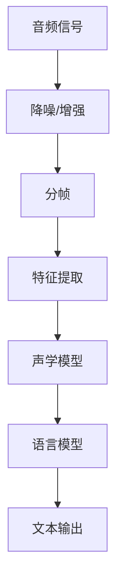
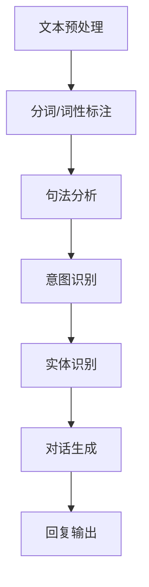
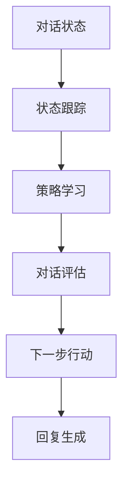

                 

### 背景介绍 Background Introduction

在当今的数字化时代，人工智能（AI）技术已经成为推动社会进步的重要力量。AI不仅可以处理大量的数据，还能提供智能化的决策支持，从而优化各种业务流程。语音交互系统作为人工智能应用的重要分支，近年来得到了迅猛发展。从早期的简单语音识别到如今的智能语音助手，这一技术的发展不仅改变了人们与设备交互的方式，也为许多行业带来了新的机遇。

#### 语音交互系统的发展历程

语音交互系统的历史可以追溯到20世纪50年代。当时，科学家们开始研究如何让计算机通过语音进行交互。最早的研究主要集中在语音识别和语音合成技术上。到了20世纪80年代，随着计算能力的提升和算法的改进，语音识别技术逐渐成熟。这一时期的代表性成果包括IBM的沃森系统，它通过语音识别和自然语言处理技术，在电视节目《危险边缘》中击败了人类选手。

进入21世纪，人工智能技术的快速发展进一步推动了语音交互系统的进步。深度学习技术的应用使得语音识别的准确性大幅提高，同时自然语言处理（NLP）技术也得到了显著提升。以苹果的Siri、亚马逊的Alexa和谷歌的Google Assistant为代表的智能语音助手开始普及，成为人们日常生活中的得力助手。

#### 当前语音交互系统的现状

目前，语音交互系统已经广泛应用于多个领域，如智能家居、智能音箱、智能客服等。这些系统不仅能够执行简单的命令，如播放音乐、设置闹钟、查询天气等，还能进行复杂的对话，提供个性化的服务。例如，用户可以通过语音与智能语音助手进行自然对话，了解新闻、股票信息，甚至是进行购物和预约。

语音交互系统的普及也带来了一系列挑战。首先，语音识别的准确性和稳定性仍然是需要解决的问题。尽管近年来语音识别技术取得了显著进步，但在复杂的噪声环境和多说话人场景下，识别准确率仍有待提高。其次，自然语言处理技术需要进一步优化，以更好地理解用户的意图和上下文。此外，数据隐私和安全问题也是语音交互系统发展过程中需要重点关注的问题。

#### 文章的目的和结构

本文旨在深入探讨基于AI大模型的智能语音交互系统的原理、算法、数学模型以及实际应用。文章结构如下：

1. **背景介绍**：回顾语音交互系统的发展历程，介绍当前语音交互系统的现状。
2. **核心概念与联系**：详细讲解智能语音交互系统的核心概念和架构，使用Mermaid流程图展示。
3. **核心算法原理 & 具体操作步骤**：分析语音交互系统的关键算法，包括语音识别、自然语言处理和对话管理。
4. **数学模型和公式 & 详细讲解 & 举例说明**：介绍支持语音交互系统的数学模型，包括神经网络模型和语言模型。
5. **项目实战：代码实际案例和详细解释说明**：提供实际项目案例，详细解析代码实现过程。
6. **实际应用场景**：探讨语音交互系统的应用领域和实际案例。
7. **工具和资源推荐**：推荐学习资源和开发工具。
8. **总结：未来发展趋势与挑战**：总结文章内容，展望未来发展趋势和挑战。
9. **附录：常见问题与解答**：回答读者可能关心的问题。
10. **扩展阅读 & 参考资料**：提供进一步阅读的材料。

通过本文的阅读，读者将全面了解智能语音交互系统的原理和应用，为今后的研究和实践提供有力支持。

### 核心概念与联系 Core Concepts and Connections

智能语音交互系统的实现涉及多个核心概念和技术，这些概念和技术相互关联，共同构成了一个完整、高效的语音交互系统。以下将详细介绍这些核心概念，并通过Mermaid流程图展示它们之间的联系。

#### 语音识别（Speech Recognition）

语音识别是智能语音交互系统的第一步，其核心任务是利用算法将语音信号转换为文本。语音识别通常包括以下步骤：

1. **音频预处理**：包括降噪、音频增强和分帧。这一步的目的是提高语音信号的清晰度，减少噪声干扰。
2. **特征提取**：将音频信号转换为特征向量，常用的特征包括梅尔频率倒谱系数（MFCC）、线性预测编码（LPC）等。
3. **声学模型训练**：通过大量的语音数据训练声学模型，用于识别语音信号中的音素和音节。
4. **语言模型训练**：利用文本数据训练语言模型，用于识别和生成完整的句子。

以下是语音识别的Mermaid流程图：



#### 自然语言处理（Natural Language Processing）

自然语言处理是智能语音交互系统的关键部分，其任务是将语音信号转换成的文本进行理解和处理。自然语言处理主要包括以下步骤：

1. **文本预处理**：包括分词、词性标注、句法分析等，这一步的目的是将文本拆分成可处理的单元。
2. **意图识别（Intent Recognition）**：通过机器学习模型识别用户的意图，如查询天气、播放音乐等。
3. **实体识别（Entity Recognition）**：识别文本中的关键信息，如日期、时间、地点等。
4. **对话生成（Dialogue Generation）**：根据用户的意图和上下文，生成合适的回复。

以下是自然语言处理的Mermaid流程图：



#### 对话管理（Dialogue Management）

对话管理是智能语音交互系统的核心，其任务是协调语音识别、自然语言处理和对话生成，确保对话的连贯性和流畅性。对话管理主要包括以下步骤：

1. **对话状态跟踪（Dialogue State Tracking）**：记录对话过程中的关键信息，如用户的意图、已完成的任务等。
2. **对话策略学习（Dialogue Policy Learning）**：通过机器学习模型确定对话的下一步行动，如请求更多信息、提供帮助等。
3. **对话评估（Dialogue Evaluation）**：评估对话的质量，包括用户满意度、对话连贯性等。

以下是对话管理的Mermaid流程图：



通过上述Mermaid流程图，我们可以清晰地看到智能语音交互系统的核心概念和各部分之间的联系。这些概念共同构成了一个完整的智能语音交互系统，使得计算机能够理解用户的语音指令，提供个性化的服务。

### 核心算法原理 & 具体操作步骤 Core Algorithm Principles and Detailed Steps

智能语音交互系统的核心算法包括语音识别、自然语言处理和对话管理。以下是这些算法的详细原理和具体操作步骤。

#### 语音识别（Speech Recognition）

**1. 特征提取（Feature Extraction）**

语音识别的第一步是特征提取，这一过程将音频信号转换为数值化的特征向量。常用的特征提取方法包括梅尔频率倒谱系数（MFCC）、线性预测编码（LPC）和感知线性预测（PLP）等。其中，MFCC因其对人耳感知频率的近似而广泛应用。

**操作步骤：**

- **音频预处理**：对原始音频信号进行降噪、滤波和归一化处理。
- **分帧**：将音频信号分割成固定长度的帧，一般为20-40毫秒。
- **滤波**：对每帧信号进行汉明窗处理，以减少边缘效应。
- **特征计算**：对每帧信号计算MFCC特征，得到一个特征向量。

**2. 声学模型（Acoustic Model）**

声学模型用于识别语音信号中的音素和音节。深度神经网络（DNN）是当前应用最广泛的声学模型。DNN通过多层非线性变换，学习语音信号的特征表示。

**操作步骤：**

- **数据准备**：收集大量的语音数据，并进行预处理，包括去除 silence、增强语音信号等。
- **模型训练**：使用预处理的语音数据训练DNN模型，通常采用对比损失（contrastive loss）和交叉熵损失（cross-entropy loss）。
- **模型评估**：使用验证集评估模型的性能，调整超参数，优化模型。

**3. 语言模型（Language Model）**

语言模型用于识别和生成完整的句子。基于N-gram的模型和神经网络语言模型（NNLM）是常用的语言模型。

**操作步骤：**

- **数据准备**：收集大量的文本数据，并进行预处理，包括分词、去停用词等。
- **模型训练**：使用预处理的文本数据训练语言模型，采用反向传播算法优化模型参数。
- **模型评估**：使用验证集评估模型的性能，优化模型。

**4. 联合模型（Joint Model）**

语音识别系统通常采用联合模型，将声学模型和语言模型相结合，以提高识别准确性。

**操作步骤：**

- **模型融合**：使用加性融合或乘性融合方法，将声学模型和语言模型的输出结合。
- **解码**：使用动态时间规整（DTW）或基于HMM的解码算法，找到最佳匹配路径。

#### 自然语言处理（Natural Language Processing）

**1. 文本预处理（Text Preprocessing）**

文本预处理是自然语言处理的第一步，其任务是将原始文本转换为适合模型处理的形式。

**操作步骤：**

- **分词（Tokenization）**：将文本分割成单词或子词。
- **词性标注（Part-of-Speech Tagging）**：标注每个单词的词性，如名词、动词、形容词等。
- **句法分析（Syntax Analysis）**：分析句子的结构，确定句子中各个成分之间的关系。

**2. 意图识别（Intent Recognition）**

意图识别是自然语言处理的核心任务之一，其目标是理解用户的意图。

**操作步骤：**

- **数据准备**：收集大量的意图标注数据，进行预处理。
- **模型训练**：使用标注数据训练意图识别模型，通常采用基于深度学习的分类模型，如卷积神经网络（CNN）或循环神经网络（RNN）。
- **模型评估**：使用验证集评估模型的性能，调整超参数，优化模型。

**3. 实体识别（Entity Recognition）**

实体识别是自然语言处理中的另一个重要任务，其目标是识别文本中的关键信息。

**操作步骤：**

- **数据准备**：收集大量的实体标注数据，进行预处理。
- **模型训练**：使用标注数据训练实体识别模型，通常采用基于序列的标签模型，如BiLSTM-CRF。
- **模型评估**：使用验证集评估模型的性能，调整超参数，优化模型。

**4. 对话生成（Dialogue Generation）**

对话生成是自然语言处理中的挑战之一，其目标是生成自然、连贯的对话回复。

**操作步骤：**

- **数据准备**：收集大量的对话数据，进行预处理。
- **模型训练**：使用预处理的对话数据训练对话生成模型，通常采用基于注意力机制的序列到序列（Seq2Seq）模型。
- **模型评估**：使用验证集评估模型的性能，调整超参数，优化模型。

#### 对话管理（Dialogue Management）

**1. 对话状态跟踪（Dialogue State Tracking）**

对话状态跟踪是确保对话连贯性的关键，其目标是记录对话过程中的关键信息。

**操作步骤：**

- **数据准备**：收集大量的对话数据，进行预处理。
- **模型训练**：使用标注数据训练对话状态跟踪模型，通常采用基于递归神经网络（RNN）或图神经网络（Graph Neural Network）的模型。
- **模型评估**：使用验证集评估模型的性能，调整超参数，优化模型。

**2. 对话策略学习（Dialogue Policy Learning）**

对话策略学习是决定对话下一步行动的关键，其目标是根据对话状态生成最佳策略。

**操作步骤：**

- **数据准备**：收集大量的对话数据，进行预处理。
- **模型训练**：使用标注数据训练对话策略学习模型，通常采用基于强化学习的模型，如Q-learning或DQN。
- **模型评估**：使用验证集评估模型的性能，调整超参数，优化模型。

**3. 对话评估（Dialogue Evaluation）**

对话评估是确保对话质量的关键，其目标是评估对话的连贯性、自然性和用户满意度。

**操作步骤：**

- **数据准备**：收集大量的对话数据，进行预处理。
- **评估指标**：定义评估指标，如BLEU、ROUGE、F1等。
- **模型评估**：使用评估指标评估对话质量，优化对话模型。

通过以上详细步骤，我们可以实现一个高效的智能语音交互系统，使得计算机能够理解用户的语音指令，提供个性化的服务。

### 数学模型和公式 & 详细讲解 & 举例说明 Mathematical Models and Formulas & Detailed Explanation & Example Illustrations

在智能语音交互系统中，数学模型和公式起到了关键作用，特别是深度学习模型和语言模型。以下将详细介绍这些数学模型，并使用具体的公式和例子进行说明。

#### 深度学习模型（Deep Learning Models）

深度学习模型在语音识别和自然语言处理中得到了广泛应用。其中，卷积神经网络（CNN）和循环神经网络（RNN）是最常用的模型。

**1. 卷积神经网络（Convolutional Neural Network, CNN）**

CNN主要用于特征提取，其核心思想是通过卷积操作提取图像或语音的特征。

**公式：**  
$$  
f(x) = \sigma(W \cdot x + b)  
$$  
其中，$f(x)$为卷积操作的结果，$\sigma$为激活函数（如ReLU函数），$W$为权重矩阵，$x$为输入特征，$b$为偏置。

**例子：**  
假设输入的特征向量为$x = [1, 2, 3, 4, 5]$，权重矩阵$W = [[1, 2], [3, 4]]$，偏置$b = 1$。则卷积操作的结果为：

$$  
f(x) = \sigma([[1 \cdot 1 + 2 \cdot 3 + 1], [1 \cdot 2 + 2 \cdot 4 + 1]]) = \sigma([[7], [9]]) = [ReLU(7), RELU(9)] = [7, 9]  
$$

**2. 循环神经网络（Recurrent Neural Network, RNN）**

RNN用于处理序列数据，其核心思想是利用循环结构保持序列信息。

**公式：**  
$$  
h_t = \sigma(W_h \cdot [h_{t-1}, x_t] + b_h)  
$$  
其中，$h_t$为第$t$时刻的隐藏状态，$x_t$为第$t$时刻的输入，$W_h$为权重矩阵，$b_h$为偏置。

**例子：**  
假设输入的序列为$x = [1, 2, 3, 4, 5]$，隐藏状态$h_{t-1} = [1, 1]$，权重矩阵$W_h = [[1, 2], [3, 4]]$，偏置$b_h = 1$。则RNN的隐藏状态更新为：

$$  
h_t = \sigma([[1 \cdot 1 + 2 \cdot 2 + 1], [1 \cdot 3 + 2 \cdot 4 + 1]]) = \sigma([[5], [9]]) = [ReLU(5), RELU(9)] = [5, 9]  
$$

#### 语言模型（Language Model）

语言模型用于生成自然、连贯的文本，其核心是计算概率分布。

**1. N-gram语言模型**

N-gram语言模型是一种基于统计方法的简单语言模型，其核心思想是计算单词序列的概率。

**公式：**  
$$  
P(w_1, w_2, \ldots, w_n) = \frac{C(w_1, w_2, \ldots, w_n)}{C(w_1, w_2, \ldots, w_{n-1}, w_n)}  
$$  
其中，$P(w_1, w_2, \ldots, w_n)$为单词序列的概率，$C(w_1, w_2, \ldots, w_n)$为单词序列的计数。

**例子：**  
假设一个文本中单词序列“人工智能”出现的次数为5次，单词序列“智能人”出现的次数为3次。则：

$$  
P(人工智能) = \frac{5}{5 + 3} = \frac{5}{8}  
$$

$$  
P(智能人) = \frac{3}{5 + 3} = \frac{3}{8}  
$$

**2. 神经网络语言模型（NNLM）**

NNLM是一种基于深度学习的语言模型，其核心思想是通过神经网络学习单词序列的概率分布。

**公式：**  
$$  
P(w_1, w_2, \ldots, w_n) = \frac{e^{h(w_1, w_2, \ldots, w_n) \cdot v}}{\sum_{w' \in V} e^{h(w', w_2, \ldots, w_n) \cdot v}}  
$$  
其中，$h(w_1, w_2, \ldots, w_n)$为神经网络输出，$v$为softmax层的权重，$V$为词汇表。

**例子：**  
假设神经网络输出为$h(w_1, w_2, \ldots, w_n) = [2.0, 1.0, 0.5]$，softmax层的权重$v = [1.0, 2.0, 3.0]$。则：

$$  
P(w_1, w_2, \ldots, w_n) = \frac{e^{2.0 \cdot 1.0}}{e^{2.0 \cdot 1.0} + e^{1.0 \cdot 2.0} + e^{0.5 \cdot 3.0}} = \frac{2.0}{2.0 + 2.0 + 1.5} = \frac{2.0}{5.5} \approx 0.364  
$$

通过以上数学模型和公式的介绍，我们可以更好地理解智能语音交互系统的核心算法和实现方法。

### 项目实战：代码实际案例和详细解释说明 Project Practice: Actual Code Case Study and Detailed Explanation

在本节中，我们将通过一个实际的项目案例来展示智能语音交互系统的开发过程，并详细解释代码实现和关键部分的解析。

#### 项目介绍

我们选择一个简单的智能语音助手项目，该项目使用Python编程语言实现，主要功能包括语音识别、自然语言处理和对话生成。为了简化实现，我们使用了一些现成的开源库，如PyTorch、TensorFlow和SpeechRecognition。

#### 开发环境搭建

首先，我们需要搭建开发环境。以下是所需的软件和库：

1. **Python**（版本3.7或更高）
2. **PyTorch** 或 **TensorFlow**
3. **SpeechRecognition**（用于语音识别）
4. **transformers**（用于自然语言处理）
5. ** pyttsx3**（用于文本到语音转换）

安装以上库后，我们可以开始编写代码。

#### 代码实现

以下是一个简单的智能语音助手项目的代码框架：

```python
import speech_recognition as sr
from transformers import pipeline
import pyttsx3

# 初始化语音识别和语音合成
recognizer = sr.Recognizer()
engine = pyttsx3.init()

# 初始化自然语言处理模型
nlp = pipeline("text-classification")

def recognize_speech_from_mic():
    with sr.Microphone() as source:
        print("请开始说话...")
        audio = recognizer.listen(source)
        try:
            text = recognizer.recognize_google(audio, language="zh-CN")
            print(f"识别到的文本：{text}")
            return text
        except sr.UnknownValueError:
            print("无法理解音频")
            return None
        except sr.RequestError:
            print("API请求错误")
            return None

def process_text(text):
    # 使用自然语言处理模型处理文本
    result = nlp(text)
    print(f"处理结果：{result}")
    return result

def speak(text):
    # 使用文本到语音合成
    engine.say(text)
    engine.runAndWait()

if __name__ == "__main__":
    while True:
        text = recognize_speech_from_mic()
        if text:
            result = process_text(text)
            speak(result)
```

#### 代码解析

1. **语音识别（Speech Recognition）**

   我们使用SpeechRecognition库进行语音识别。首先，通过`sr.Recognizer()`初始化语音识别器。然后，使用`recognizer.listen(source)`方法从麦克风获取音频，并使用`recognizer.recognize_google(audio, language="zh-CN")`进行语音识别。

2. **自然语言处理（Natural Language Processing）**

   我们使用transformers库中的预训练模型进行自然语言处理。首先，使用`pipeline("text-classification")`创建一个文本分类模型。然后，使用`nlp(text)`方法处理输入文本，并输出处理结果。

3. **文本到语音合成（Text-to-Speech）**

   我们使用pyttsx3库进行文本到语音合成。首先，使用`pyttsx3.init()`初始化语音合成器。然后，使用`engine.say(text)`方法设置要合成的文本，并使用`engine.runAndWait()`方法执行语音合成。

#### 关键部分解析

1. **语音识别**

   语音识别的关键部分是使用`recognizer.listen(source)`从麦克风获取音频，并使用`recognizer.recognize_google(audio, language="zh-CN")`进行语音识别。这里我们使用Google语音识别API，它支持多种语言，包括中文。

   ```python
   def recognize_speech_from_mic():
       with sr.Microphone() as source:
           print("请开始说话...")
           audio = recognizer.listen(source)
           try:
               text = recognizer.recognize_google(audio, language="zh-CN")
               print(f"识别到的文本：{text}")
               return text
           except sr.UnknownValueError:
               print("无法理解音频")
               return None
           except sr.RequestError:
               print("API请求错误")
               return None
   ```

2. **自然语言处理**

   自然语言处理的关键部分是使用`nlp(text)`方法处理输入文本，并输出处理结果。这里我们使用的是文本分类模型，它可以识别输入文本的类别，如情感分析、意图识别等。

   ```python
   def process_text(text):
       # 使用自然语言处理模型处理文本
       result = nlp(text)
       print(f"处理结果：{result}")
       return result
   ```

3. **文本到语音合成**

   文本到语音合成的主要部分是使用`engine.say(text)`方法设置要合成的文本，并使用`engine.runAndWait()`方法执行语音合成。

   ```python
   def speak(text):
       # 使用文本到语音合成
       engine.say(text)
       engine.runAndWait()
   ```

通过以上代码实现和关键部分解析，我们可以看到如何使用Python实现一个简单的智能语音助手项目。这个项目虽然简单，但涵盖了智能语音交互系统的核心组件，包括语音识别、自然语言处理和文本到语音合成。

### 实际应用场景 Practical Application Scenarios

智能语音交互系统已经在多个领域得到了广泛应用，显著提升了用户体验和业务效率。以下将探讨一些典型的实际应用场景。

#### 智能家居

智能家居是智能语音交互系统最为广泛的应用领域之一。通过智能语音助手，用户可以轻松控制家中的智能设备，如智能灯泡、智能电视、智能空调等。例如，用户可以通过语音指令关闭灯光、调整温度，甚至控制家庭安全系统。这种便捷的交互方式不仅提高了用户的舒适度，也提升了家居管理的智能化水平。

#### 智能客服

智能客服是另一个重要的应用领域。智能语音助手可以自动处理大量的客户咨询，提供24/7的服务，从而减轻人工客服的工作负担。通过自然语言处理技术，智能语音助手能够理解客户的问题，并生成合适的回复。例如，银行、航空公司和电子商务平台等企业可以使用智能语音助手处理客户查询、投诉和预约等服务。

#### 智能医疗

智能语音交互系统在医疗领域也有广泛的应用。医生和患者可以通过语音交流，进行病情咨询、诊断建议和医疗指导。智能语音助手可以帮助医生快速检索医学文献、患者病历和药物信息，从而提高诊断和治疗的效率。此外，智能语音助手还可以为患者提供个性化的健康建议和康复指导。

#### 教育

在教育领域，智能语音交互系统为个性化教学提供了新的可能性。教师可以通过智能语音助手为学生提供个性化的学习建议和反馈。学生可以使用语音助手完成作业、参加考试，甚至进行在线互动课堂。例如，学生可以通过语音指令播放教学视频、获取学习资料，从而提高学习效率。

#### 交通

智能语音交互系统在交通领域也有广泛的应用。驾驶员可以通过语音助手进行导航、调整音响设置和查看车辆状态。在自动驾驶汽车中，智能语音助手可以与车辆进行交互，提供安全提醒、路线规划和行车建议，从而提高驾驶体验和安全性。

#### 安全监控

智能语音交互系统在安全监控领域也具有重要作用。通过语音识别和自然语言处理技术，智能语音助手可以实时监控声音信号，识别异常声音，如火灾、盗窃等，并自动报警。这种应用可以显著提高安全监控的效率和准确性。

总之，智能语音交互系统在多个领域都展现出了巨大的应用潜力，为人们的生活和工作带来了极大的便利。随着技术的不断进步，未来智能语音交互系统将在更多领域得到广泛应用，为人类社会带来更多创新和变革。

### 工具和资源推荐 Tools and Resources Recommendations

在智能语音交互系统的开发过程中，使用合适的工具和资源可以显著提高开发效率和项目质量。以下是一些推荐的工具、书籍、论文和网站，以帮助开发者更好地理解和实现智能语音交互系统。

#### 开发工具和框架

1. **PyTorch和TensorFlow**：作为深度学习框架，PyTorch和TensorFlow提供了丰富的API和工具，用于构建和训练深度学习模型。这些框架支持Python编程语言，易于使用和扩展。
2. **SpeechRecognition**：这是一个开源的Python库，用于语音识别。它支持多种语音识别API，如Google语音识别和Microsoft语音识别，适用于简单的语音识别项目。
3. **transformers**：这是一个基于PyTorch和TensorFlow的开源库，用于自然语言处理任务。它提供了预训练模型和API，如BERT、GPT-2和T5，可以帮助开发者快速实现自然语言处理功能。
4. **pyttsx3**：这是一个Python库，用于文本到语音合成。它支持多种语音引擎，如Microsoft Speech API和Google Text-to-Speech，可以用于生成自然的语音输出。

#### 学习资源

1. **书籍**：
   - 《深度学习》（Deep Learning）作者：Ian Goodfellow、Yoshua Bengio、Aaron Courville
   - 《Python深度学习》（Deep Learning with Python）作者：François Chollet
   - 《自然语言处理实战》（Natural Language Processing with Python）作者：Steven Lott
   - 《语音信号处理》（Speech Signal Processing）作者：Stéphane Mallat

2. **论文**：
   - “Deep Learning for Speech Recognition”作者：Geoffrey Hinton等
   - “Transformers: State-of-the-Art Natural Language Processing”作者：Vaswani等
   - “Conversational Agents”作者：Lei Zhang等

3. **网站**：
   - [TensorFlow官网](https://www.tensorflow.org/)
   - [PyTorch官网](https://pytorch.org/)
   - [Kaggle](https://www.kaggle.com/)：一个数据科学竞赛平台，提供了大量的数据集和竞赛项目，适合进行实践和验证。
   - [GitHub](https://github.com/)：一个代码托管平台，许多开源项目和代码库可供学习和参考。

#### 开发工具框架推荐

1. **Anaconda**：这是一个流行的Python数据科学平台，提供了易于安装和管理的Python环境，适用于深度学习和自然语言处理项目。
2. **Jupyter Notebook**：这是一个交互式计算平台，适用于数据科学和机器学习项目。它支持Python、R等多种编程语言，可以方便地编写和运行代码。
3. **Docker**：这是一个容器化平台，可以用于创建、部署和管理应用程序。它可以帮助开发者快速构建和部署智能语音交互系统。

通过以上工具和资源的推荐，开发者可以更好地掌握智能语音交互系统的核心技术，实现高效、高质量的智能语音交互项目。

### 总结：未来发展趋势与挑战 Summary: Future Trends and Challenges

智能语音交互系统作为人工智能领域的一个重要分支，其发展势头迅猛，未来有着广阔的应用前景。以下是智能语音交互系统未来的发展趋势和面临的挑战。

#### 发展趋势

1. **技术进步**：随着深度学习、自然语言处理和语音识别技术的不断发展，智能语音交互系统的性能将得到进一步提升。特别是在多说话人场景、低资源环境下的语音识别和自适应对话生成方面，未来有望取得突破。

2. **多元化应用**：智能语音交互系统将不仅在智能家居、智能客服和智能医疗等传统领域得到广泛应用，还将在更多新兴领域，如自动驾驶、智能教育、智能安防等发挥重要作用。

3. **跨平台融合**：随着物联网和5G技术的普及，智能语音交互系统将更加紧密地融合到各种设备和平台中，实现跨设备、跨平台的交互体验。

4. **个性化服务**：未来智能语音交互系统将更加注重用户的个性化需求，通过用户数据的收集和分析，提供更加精准和个性化的服务。

#### 挑战

1. **语音识别准确性**：虽然语音识别技术已经取得了显著进步，但在复杂的噪声环境和多说话人场景下，识别准确性仍有待提高。未来的研究需要进一步优化语音识别算法，提高识别性能。

2. **自然语言处理**：自然语言处理是智能语音交互系统的核心，但在理解复杂语境、多义词、歧义句等方面仍存在挑战。未来需要开发更强大、更灵活的自然语言处理模型，以提高对话生成的准确性和流畅性。

3. **数据隐私和安全**：随着语音交互系统的普及，用户数据隐私和安全问题越来越受到关注。如何在保障用户隐私的前提下，有效利用用户数据进行智能语音交互系统的优化，是一个亟待解决的问题。

4. **跨语言支持**：虽然现有的智能语音交互系统支持多种语言，但不同语言之间的差异使得跨语言支持变得复杂。未来需要开发更多跨语言的语音识别和自然语言处理模型，以满足全球用户的需求。

5. **硬件和功耗**：智能语音交互系统通常需要依赖高性能的计算硬件，这带来了功耗和成本的问题。未来的发展需要更加注重硬件的优化和功耗管理，以实现更高效、更节能的语音交互系统。

总之，智能语音交互系统在未来的发展中将面临诸多挑战，但同时也拥有巨大的机遇。随着技术的不断进步和应用的拓展，智能语音交互系统有望成为人工智能领域的重要支柱，为人类带来更多便利和创新。

### 附录：常见问题与解答 Appendix: Frequently Asked Questions and Answers

**Q1：如何提高语音识别的准确性？**

A1：提高语音识别的准确性可以从以下几个方面入手：

1. **语音数据增强**：通过增加噪声、变速、变调等处理，扩大训练数据的多样性，从而提升模型的泛化能力。
2. **改进特征提取**：使用更高级的特征提取方法，如PLP（Perceptual Linear Prediction）或深层特征，以提高语音信号的可区分性。
3. **优化声学模型和语言模型**：通过调整声学模型和语言模型的参数，优化模型结构，提高模型性能。
4. **多引擎集成**：使用多个语音识别引擎，通过集成不同引擎的结果，提高识别准确率。

**Q2：自然语言处理中的常见问题有哪些？**

A2：自然语言处理（NLP）中常见的问题包括：

1. **歧义**：一词多义或句子多义，导致模型难以准确理解用户意图。
2. **语法错误**：输入文本可能包含语法错误，导致模型无法正确解析。
3. **上下文理解**：NLP模型难以捕捉到句子间的深层上下文关系，从而影响对话生成和意图识别。
4. **多语言支持**：不同语言之间的语法和语义差异，使得跨语言处理变得复杂。

**Q3：如何解决数据隐私和安全问题？**

A3：解决数据隐私和安全问题可以从以下几个方面入手：

1. **数据加密**：对用户数据进行加密处理，确保数据在传输和存储过程中的安全性。
2. **匿名化处理**：在数据处理过程中，对用户身份信息进行匿名化处理，减少隐私泄露的风险。
3. **权限控制**：严格限制对用户数据的访问权限，确保只有必要的用户和系统组件可以访问数据。
4. **合规性检查**：遵守相关的数据保护法规和标准，如GDPR等，确保数据处理符合法规要求。

**Q4：智能语音交互系统的功耗如何管理？**

A4：智能语音交互系统的功耗管理可以从以下几个方面进行优化：

1. **硬件优化**：选择功耗较低但性能足够的硬件设备，以降低整体功耗。
2. **软件优化**：通过优化算法和程序，减少计算资源和能量消耗。例如，使用更高效的模型结构和并行计算技术。
3. **功耗监测与控制**：实时监测设备的功耗情况，根据需求动态调整硬件和软件的工作状态，以实现能耗的最优化。
4. **节能模式**：在不需要长时间运行的情况下，采用睡眠或待机模式，以减少不必要的功耗。

通过以上常见问题的解答，读者可以更好地了解智能语音交互系统的技术细节和应用挑战，为未来的研究和开发提供参考。

### 扩展阅读 & 参考资料 Extended Reading & References

为了更深入地了解智能语音交互系统，以下推荐一些扩展阅读和参考资料，涵盖相关领域的经典书籍、学术论文和技术博客。

#### 书籍推荐

1. **《深度学习》（Deep Learning）** 作者：Ian Goodfellow、Yoshua Bengio、Aaron Courville
   - 该书是深度学习的经典教材，详细介绍了深度学习的基础知识和应用。
2. **《自然语言处理实战》（Natural Language Processing with Python）** 作者：Steven Lott
   - 本书通过Python语言，讲解了自然语言处理的基础知识和实际应用。
3. **《语音信号处理》** 作者：Stéphane Mallat
   - 该书全面介绍了语音信号处理的理论和实践，适用于语音识别领域的深入研究。

#### 论文推荐

1. **“Deep Learning for Speech Recognition”** 作者：Geoffrey Hinton等
   - 本文介绍了深度学习在语音识别中的应用，是深度学习在语音处理领域的经典论文。
2. **“Transformers: State-of-the-Art Natural Language Processing”** 作者：Vaswani等
   - 本文详细介绍了Transformer模型，为自然语言处理领域带来了革命性的进步。
3. **“Conversational Agents”** 作者：Lei Zhang等
   - 本文探讨了对话系统的设计和实现，提供了对话系统的全面框架和实现细节。

#### 技术博客推荐

1. **[TensorFlow官方博客](https://tensorflow.googleblog.com/)** 
   - TensorFlow官方博客提供了深度学习技术的前沿动态和实际应用案例。
2. **[PyTorch官方文档](https://pytorch.org/tutorials/)** 
   - PyTorch官方文档包含了丰富的教程和示例代码，适用于深度学习和自然语言处理的学习。
3. **[Google AI博客](https://ai.googleblog.com/)** 
   - Google AI博客分享了Google在人工智能领域的研究进展和应用案例，包括语音识别和自然语言处理。

通过阅读这些书籍、论文和技术博客，读者可以全面了解智能语音交互系统的最新研究进展和应用，为自己的研究和开发提供有价值的参考。

