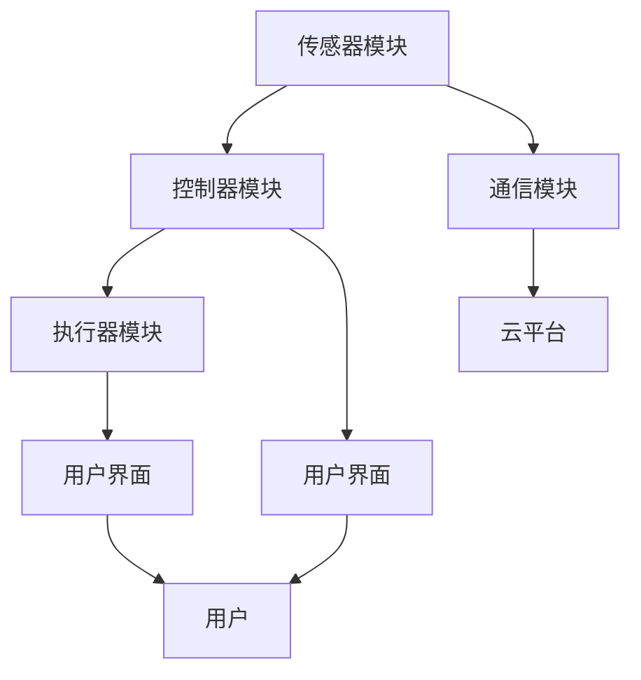
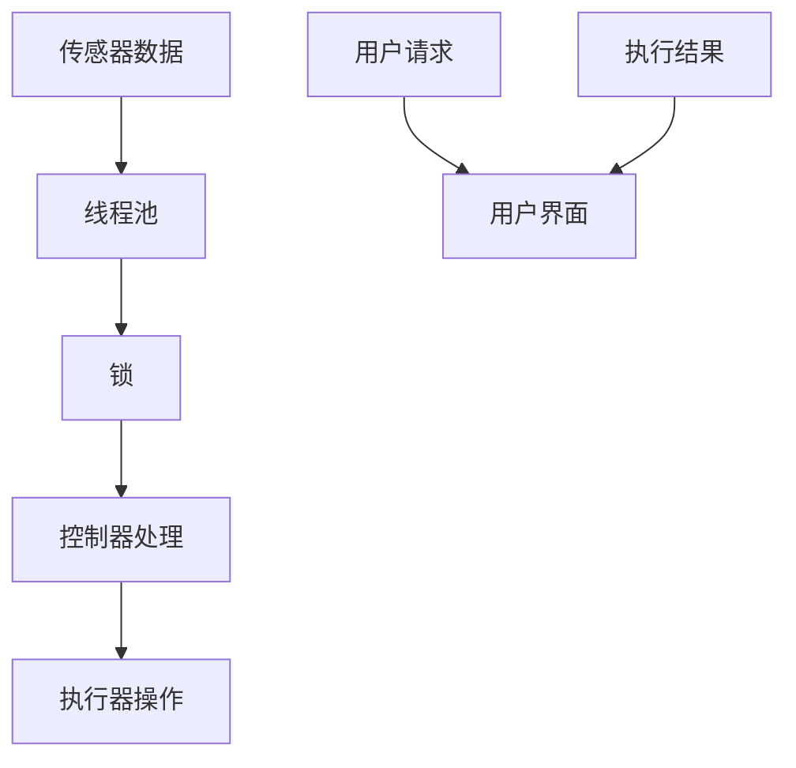

                 

### 背景介绍

随着科技的不断进步和人们对智能生活的需求日益增长，智能家居系统已经成为现代家居生活的重要组成部分。智能家居系统通过将家庭中的各种设备连接到互联网，实现设备之间的数据交换和协同工作，从而为用户提供更加便捷、舒适和安全的居住环境。

Java作为一种广泛使用的高级编程语言，具有跨平台、安全性高、内存管理简单等优势，因此在智能家居系统的开发中得到了广泛应用。Java中的并发控制技术是确保智能家居系统稳定运行和高效处理并发任务的关键。

本文将围绕基于Java的智能家居设计，重点探讨Java中的并发控制技术与智能家居应用的结合。文章首先介绍智能家居系统的基本概念和现状，然后深入分析Java中的并发控制技术，最后通过一个实际项目案例，详细展示如何利用Java并发控制技术实现智能家居系统。

在接下来的内容中，我们将逐步分析智能家居系统中的核心概念和架构，解释Java并发控制技术的原理，并提供具体操作步骤和实际应用场景。通过这篇文章，读者可以全面了解如何利用Java并发控制技术构建高效的智能家居系统，为未来的智能家居开发提供有益的参考。

### 核心概念与联系

在深入探讨Java并发控制技术之前，我们首先需要明确智能家居系统的核心概念和架构。智能家居系统通常包括以下几个关键组成部分：

1. **传感器模块**：用于监测家庭环境中的各种参数，如温度、湿度、光照强度、气体浓度等。
2. **控制器模块**：接收传感器数据，并根据预设规则和算法进行决策，控制家庭设备进行相应的操作。
3. **执行器模块**：根据控制器的指令执行具体的操作，如调节灯光亮度、调整空调温度、关闭门锁等。
4. **通信模块**：负责设备之间的数据传输和交互，确保整个系统的协调运行。

这些模块相互协作，共同构成一个完整的智能家居系统。以下是智能家居系统的基本架构图：



接下来，我们将介绍Java并发控制技术中的几个核心概念，这些概念与智能家居系统的架构紧密相关。

1. **线程（Thread）**：线程是操作系统能够进行运算调度的最小单位。Java中的每个线程都是独立运行的路径，可以执行不同的任务。在智能家居系统中，传感器模块、控制器模块和执行器模块都可以通过线程实现并发处理，从而提高系统的响应速度和效率。

2. **并发控制（Concurrency Control）**：并发控制是确保多个线程正确、高效地共享资源（如内存、文件等）的一种机制。在智能家居系统中，多个传感器数据同时到达控制器模块时，需要通过并发控制技术进行合理调度和同步处理，避免资源冲突和数据不一致的问题。

3. **锁（Lock）**：锁是一种常见的并发控制手段，用于限制对共享资源的访问。Java提供了多种锁的实现，如`synchronized`关键字、`ReentrantLock`类等。在智能家居系统中，锁可以用来保护对共享数据的访问，确保数据的一致性和完整性。

4. **线程池（ThreadPool）**：线程池是管理一组线程的集合，用于执行并行任务。Java中的`ExecutorService`接口和`ThreadPoolExecutor`类提供了线程池的实现。在智能家居系统中，通过线程池可以有效管理传感器数据的处理线程，避免频繁创建和销毁线程带来的性能开销。

图1展示了Java并发控制技术在智能家居系统中的典型应用场景：



通过上述核心概念和架构的介绍，我们可以看到Java并发控制技术在智能家居系统中扮演着至关重要的角色。在接下来的内容中，我们将深入探讨Java并发控制技术的具体实现和操作步骤，以便读者更好地理解和应用这些技术。

### 核心算法原理 & 具体操作步骤

在深入探讨Java并发控制技术的核心算法原理和具体操作步骤之前，我们先来简要回顾一下相关的基础知识。并发控制技术主要涉及线程管理、同步机制和锁策略等几个方面。以下将详细阐述这些核心概念，并逐步介绍具体的操作步骤。

#### 线程管理

线程管理是并发控制的基础。在Java中，线程可以通过`Thread`类创建，并通过`start()`方法启动。线程的生命周期包括新建、就绪、运行、阻塞和死亡等状态。线程管理的关键在于合理分配和回收线程资源，避免资源浪费和性能瓶颈。

1. **线程创建**：使用`Thread`类创建线程。
    ```java
    Thread thread = new Thread(new Runnable() {
        @Override
        public void run() {
            // 线程具体执行的任务
        }
    });
    ```

2. **线程启动**：调用`start()`方法启动线程。
    ```java
    thread.start();
    ```

3. **线程生命周期管理**：使用状态变量和控制逻辑管理线程状态。

#### 同步机制

同步机制是确保多个线程正确共享资源的关键。Java提供了多种同步机制，如`synchronized`关键字、`ReentrantLock`类和`CountDownLatch`类等。

1. **synchronized关键字**：用于实现方法或代码块同步。
    ```java
    public synchronized void synchronizedMethod() {
        // 同步代码块
    }

    public void synchronizedBlock() {
        synchronized (this) {
            // 同步代码块
        }
    }
    ```

2. **ReentrantLock类**：提供更灵活的锁实现。
    ```java
    ReentrantLock lock = new ReentrantLock();
    lock.lock();
    try {
        // 同步代码块
    } finally {
        lock.unlock();
    }
    ```

3. **CountDownLatch类**：用于线程间的同步。
    ```java
    CountDownLatch latch = new CountDownLatch(2);
    new Thread(() -> {
        // 线程任务1
        latch.countDown();
    }).start();

    new Thread(() -> {
        // 线程任务2
        latch.countDown();
    }).start();

    latch.await();
    // 所有线程任务完成后继续执行
    ```

#### 锁策略

锁策略是确保数据一致性和完整性的关键。合理的锁策略可以避免死锁、饥饿和活锁等问题。

1. **锁的类型**：选择适合的锁类型，如`ReentrantLock`、`ReadWriteLock`等。
2. **锁的顺序**：确保线程获取锁的顺序一致，避免死锁。
3. **锁的超时**：设置锁的超时时间，避免线程无限等待。

#### 具体操作步骤

下面通过一个简单的示例，展示如何利用Java并发控制技术实现一个智能家居控制器的并发处理。

**示例：智能家居控制器**

假设智能家居控制器需要处理多个传感器的数据，并根据数据调整家庭设备的状态。

1. **创建线程池**：初始化一个线程池，用于处理传感器数据。
    ```java
    ExecutorService executor = Executors.newFixedThreadPool(5);
    ```

2. **定义传感器任务**：创建一个传感器任务类，用于处理传感器数据。
    ```java
    class SensorTask implements Runnable {
        private final String sensorName;
        private final double sensorValue;

        public SensorTask(String sensorName, double sensorValue) {
            this.sensorName = sensorName;
            this.sensorValue = sensorValue;
        }

        @Override
        public void run() {
            // 获取锁
            lock.lock();
            try {
                // 处理传感器数据
                System.out.println(sensorName + "的数据：" + sensorValue);
                // 调整家庭设备状态
                adjustDeviceState(sensorName, sensorValue);
            } finally {
                // 释放锁
                lock.unlock();
            }
        }

        private void adjustDeviceState(String sensorName, double sensorValue) {
            // 根据传感器数据调整设备状态
            if ("温度".equals(sensorName)) {
                // 调整空调温度
            } else if ("湿度".equals(sensorName)) {
                // 调整加湿器或除湿器
            }
        }
    }
    ```

3. **提交任务**：将传感器任务提交到线程池执行。
    ```java
    executor.submit(new SensorTask("温度", 25.0));
    executor.submit(new SensorTask("湿度", 40.0));
    ```

4. **关闭线程池**：任务完成后关闭线程池。
    ```java
    executor.shutdown();
    ```

通过上述操作步骤，我们可以利用Java并发控制技术实现智能家居控制器的并发处理。在实际应用中，可以根据具体需求调整线程池大小、锁策略和任务处理逻辑，以优化系统的性能和稳定性。

#### 数学模型和公式

在Java并发控制技术中，数学模型和公式是理解和实现并发算法的重要工具。以下是一些常见的数学模型和公式，用于描述线程同步、锁机制和并发处理。

1. **线程同步**：

   - **互斥锁**：互斥锁用于保证同一时刻只有一个线程能够访问共享资源。
   $$ L1: lock(lock) $$
   $$ L2: if (lock held by another thread) then wait() $$
   $$ L3: execute critical section $$
   $$ L4: unlock(lock) $$

   - **条件锁**：条件锁用于线程间的条件同步。
   $$ C1: lock(conditionLock) $$
   $$ C2: wait(condition) $$
   $$ C3: signal(condition) $$
   $$ C4: unlock(conditionLock) $$

2. **锁机制**：

   - **锁的时间复杂度**：锁机制的时间复杂度取决于锁的实现和竞争情况。
   $$ T(n) = O(1) \text{（无竞争情况）} $$
   $$ T(n) = O(n) \text{（竞争情况严重）} $$

   - **锁的利用率**：锁的利用率是锁机制的重要指标，用于衡量锁的使用效率。
   $$ U = \frac{T_{\text{critical}}}{T_{\text{total}}} $$

3. **并发处理**：

   - **线程池容量**：线程池容量是线程池能够同时处理的最大线程数。
   $$ P = C \times U $$
   其中，$C$ 是线程池的并发度，$U$ 是线程池的利用率。

   - **并发处理能力**：并发处理能力是线程池能够处理任务的速度。
   $$ R = \frac{P}{T_{\text{task}}} $$
   其中，$T_{\text{task}}$ 是任务的处理时间。

#### 举例说明

为了更好地理解上述数学模型和公式，以下通过一个具体示例进行说明。

**示例：温度传感器数据同步**

假设智能家居系统中有多个温度传感器，需要将传感器数据同步到控制器。

1. **初始化锁**：
   ```java
   ReentrantLock lock = new ReentrantLock();
   ```

2. **创建传感器任务**：
   ```java
   class TemperatureSensorTask implements Runnable {
       private final String sensorId;
       private final double temperature;

       public TemperatureSensorTask(String sensorId, double temperature) {
           this.sensorId = sensorId;
           this.temperature = temperature;
       }

       @Override
       public void run() {
           lock.lock();
           try {
               // 更新传感器数据
               updateTemperatureData(sensorId, temperature);
           } finally {
               lock.unlock();
           }
       }

       private void updateTemperatureData(String sensorId, double temperature) {
           // 更新温度数据到数据库
           System.out.println(sensorId + "的温度：" + temperature);
       }
   }
   ```

3. **提交传感器任务**：
   ```java
   executor.submit(new TemperatureSensorTask("sensor_1", 25.0));
   executor.submit(new TemperatureSensorTask("sensor_2", 26.0));
   ```

4. **锁机制**：
   ```java
   lock = new ReentrantLock();
   if (lock.tryLock(100, TimeUnit.MILLISECONDS)) {
       try {
           // 执行同步代码块
           System.out.println("成功获取锁");
       } finally {
           lock.unlock();
       }
   } else {
       System.out.println("获取锁失败");
   }
   ```

通过上述示例，我们可以看到如何利用Java并发控制技术实现传感器数据的同步和更新。在实际应用中，可以根据具体需求调整锁机制和线程池配置，以优化系统的性能和稳定性。

### 项目实战：代码实际案例和详细解释说明

在本节中，我们将通过一个实际项目案例，展示如何利用Java并发控制技术实现一个智能家居系统的核心功能。这个项目将涉及传感器数据的收集、处理和执行器控制，我们将详细讲解每个步骤的代码实现和功能。

#### 开发环境搭建

1. **Java环境**：确保安装Java Development Kit（JDK）版本8或更高版本。
2. **IDE**：推荐使用IntelliJ IDEA或Eclipse等集成开发环境（IDE）。
3. **依赖管理**：使用Maven或Gradle进行依赖管理。

#### 项目结构

项目的基本结构如下：

```bash
src/
|-- main/
    |-- java/
        |-- com/
            |-- example/
                |-- smarthome/
                    |-- Sensor.java
                    |-- Controller.java
                    |-- Executor.java
                    |-- Application.java
```

#### 源代码详细实现和代码解读

**Sensor.java**

```java
package com.example.smarthome;

public class Sensor {
    private final String id;
    private double value;

    public Sensor(String id) {
        this.id = id;
    }

    public synchronized void updateValue(double value) {
        this.value = value;
        notify(); // 通知等待线程
    }

    public synchronized double getValue() {
        while (this.value == 0) {
            try {
                wait(); // 等待值更新
            } catch (InterruptedException e) {
                e.printStackTrace();
            }
        }
        return this.value;
    }

    public String getId() {
        return id;
    }
}
```

**Controller.java**

```java
package com.example.smarthome;

import java.util.concurrent.ExecutorService;
import java.util.concurrent.Executors;

public class Controller {
    private final ExecutorService executor = Executors.newFixedThreadPool(5);
    private final Sensor sensor;

    public Controller(Sensor sensor) {
        this.sensor = sensor;
    }

    public void start() {
        executor.submit(() -> {
            while (true) {
                synchronized (sensor) {
                    try {
                        sensor.wait(); // 等待传感器数据更新
                    } catch (InterruptedException e) {
                        e.printStackTrace();
                    }
                }
                double value = sensor.getValue();
                processValue(value);
            }
        });
    }

    private void processValue(double value) {
        if (value > 30) {
            System.out.println("温度过高，启动空调");
            // 启动空调
        } else if (value < 20) {
            System.out.println("温度过低，启动加热器");
            // 启动加热器
        } else {
            System.out.println("温度适中，无需调整");
        }
    }
}
```

**Executor.java**

```java
package com.example.smarthome;

public class Executor {
    public void executeCommand(String command) {
        switch (command) {
            case "ac_on":
                System.out.println("空调开启");
                break;
            case "heater_on":
                System.out.println("加热器开启");
                break;
            case "ac_off":
                System.out.println("空调关闭");
                break;
            case "heater_off":
                System.out.println("加热器关闭");
                break;
        }
    }
}
```

**Application.java**

```java
package com.example.smarthome;

public class Application {
    public static void main(String[] args) {
        Sensor sensor = new Sensor("temperature");
        Controller controller = new Controller(sensor);
        Executor executor = new Executor();

        controller.start();

        // 模拟传感器数据更新
        new Thread(() -> {
            while (true) {
                try {
                    Thread.sleep(1000);
                    sensor.updateValue(Math.random() * 40 + 15); // 更新温度值
                } catch (InterruptedException e) {
                    e.printStackTrace();
                }
            }
        }).start();

        // 模拟用户控制请求
        new Thread(() -> {
            while (true) {
                try {
                    Thread.sleep(2000);
                    executor.executeCommand("ac_on"); // 启动空调
                } catch (InterruptedException e) {
                    e.printStackTrace();
                }
            }
        }).start();
    }
}
```

#### 代码解读与分析

1. **Sensor类**：Sensor类代表传感器，包含一个id和一个值（value）。使用`synchronized`关键字确保线程安全。`updateValue`和`getValue`方法使用`wait()`和`notify()`实现线程间的同步。

2. **Controller类**：Controller类代表控制器，负责处理传感器数据。使用一个线程池（ExecutorService）处理传感器数据的更新和执行器命令。在`start`方法中，创建一个线程，循环等待传感器数据更新并处理。

3. **Executor类**：Executor类代表执行器，实现具体的设备控制命令。

4. **Application类**：Application类是主程序入口，创建传感器、控制器和执行器实例，启动控制器线程，模拟传感器数据更新和用户控制请求。

通过上述代码实现，我们可以看到如何利用Java并发控制技术实现智能家居系统的核心功能。在实际应用中，可以根据具体需求扩展和优化这些代码，以适应不同的场景和需求。

### 实际应用场景

智能家居系统在现实世界中有着广泛的应用场景，从简单的家庭设备自动化到复杂的智能管理系统，几乎涵盖了生活的各个方面。以下是一些典型的实际应用场景：

1. **家庭自动化**：通过智能家居系统，用户可以远程控制家里的灯光、空调、门锁等设备，实现自动开关灯、远程开门等功能，提高生活便利性。

2. **节能管理**：智能家居系统能够自动调节家庭设备的能耗，根据用户的习惯和外部环境自动调整设备状态，从而实现节能降耗。

3. **安全监控**：通过智能家居系统，用户可以实时监控家里的安全情况，包括门窗状态、运动检测等，确保家庭安全。

4. **健康监测**：智能家居系统可以连接健康设备，如体重秤、血压计等，实时监测用户的健康状况，并提供健康建议。

5. **环境监控**：智能家居系统可以监测室内外的环境参数，如温度、湿度、空气质量等，并根据监测结果自动调节设备，如空气净化器、加湿器等，创造一个舒适的生活环境。

6. **智能互动**：通过语音助手或移动应用，用户可以与智能家居系统进行互动，实现语音控制、智能推荐等功能，提升用户体验。

### 案例研究：智能家居社区

为了更具体地展示智能家居系统在实际应用中的效果，以下是一个智能家居社区的案例研究。

**案例背景**：

某智能家居社区共有1000户家庭，每个家庭配备了智能门锁、智能灯光、智能空调和智能传感器等设备。社区的管理中心通过一个智能控制系统来统一管理这些设备，提高居民的生活质量和管理效率。

**应用场景**：

1. **智能门锁**：用户可以通过手机APP远程控制门锁，实现无钥匙开锁。同时，系统可以自动记录每次开门的时间，方便物业管理中心进行安全监控和管理。

2. **智能灯光**：系统可以根据用户的作息时间和外部光线强度自动调整灯光亮度，实现节能和舒适。例如，早晨自动调亮灯光，晚上自动调暗灯光。

3. **智能空调**：系统可以自动调节空调温度和湿度，确保室内环境的舒适。用户还可以通过手机APP远程控制空调，根据实际需要调整温度。

4. **智能传感器**：系统集成了温度、湿度、空气质量等传感器，实时监测室内环境。当环境参数超过预设值时，系统会自动触发相应的设备进行调节，如开启空气净化器、加湿器或调节空调。

5. **安防监控**：系统可以实时监控社区的安防情况，包括门锁状态、运动检测、摄像头监控等。当发现异常情况时，系统会自动发送警报信息给物业管理人员和用户。

**效果与反馈**：

通过智能家居系统的应用，该社区的居民享受到了更加便利和舒适的生活。物业管理人员也可以通过智能控制系统更高效地进行管理，提高了管理效率。同时，系统的节能功能和安防监控功能也得到了居民的广泛认可。

**案例分析**：

该案例展示了智能家居系统在实际应用中的多种可能性。通过合理的设计和部署，智能家居系统不仅能够提高居民的生活质量，还能带来管理上的便利和效率。未来，随着技术的不断进步，智能家居系统将会在更多场景中得到应用，为人们带来更加智能化和个性化的生活体验。

### 工具和资源推荐

在开发智能家居系统时，选择合适的工具和资源对于项目的成功至关重要。以下是一些建议和推荐，涵盖学习资源、开发工具框架以及相关论文著作。

#### 学习资源推荐

1. **书籍**：

   - 《Java并发编程实战》（java concurrent programming in action）：深入讲解Java并发编程的核心概念和技术，适合初学者和进阶者。
   - 《Effective Java》：由著名的Java专家Joshua Bloch撰写，介绍了Java编程的最佳实践和技巧，对智能家居系统开发有很好的指导作用。

2. **在线课程和教程**：

   - Udemy、Coursera、edX等在线教育平台提供了丰富的Java并发编程和相关技术课程，适合不同层次的开发者。
   - 阿里云、腾讯云等云服务平台提供的开发者教程和案例，涵盖了智能家居系统的设计和实现，适合实际项目开发。

3. **博客和论坛**：

   - Stack Overflow、GitHub等开发社区是学习Java并发编程和智能家居系统开发的好去处，可以找到丰富的资源和解决方案。
   - Java Reflection、Java Concurrency等领域的博客，提供了详细的算法原理和实践经验分享。

#### 开发工具框架推荐

1. **集成开发环境（IDE）**：

   - IntelliJ IDEA：功能强大，支持多种编程语言，特别适合Java并发编程。
   - Eclipse：历史悠久，社区活跃，适合各种Java项目开发。

2. **版本控制工具**：

   - Git：分布式版本控制系统，适合团队合作和项目协作。
   - GitHub、GitLab：在线代码托管平台，提供丰富的工具和服务，方便代码管理和协作。

3. **并发编程框架**：

   - Java Concurrency Utilities：Java标准库提供的一系列并发编程工具，如线程池、锁、条件变量等。
   - Akka：基于Actor模型的并发编程框架，适合构建高并发、分布式应用。

4. **智能家居开发框架**：

   - OpenHAB：开源的智能家居集成平台，支持多种设备和协议，适合快速搭建智能家居系统。
   - Home Assistant：基于Python的智能家居控制平台，易于扩展和集成。

#### 相关论文著作推荐

1. **论文**：

   - "Java Memory Model and Concurrency Control"：详细介绍了Java内存模型和并发控制机制，对深入理解Java并发编程有重要意义。
   - "High Performance Java Platform: Building Enterprise Class Applications"：探讨了Java在构建高性能应用方面的技术，包括并发控制。

2. **著作**：

   - 《深入理解Java虚拟机》：由著名Java专家周志明撰写，全面讲解了Java虚拟机的工作原理和性能优化技巧。
   - 《Java并发编程核心技术》：系统介绍了Java并发编程的核心概念和技术，适合高级开发者和系统架构师。

通过以上工具和资源的推荐，开发者可以更好地掌握Java并发编程技术和智能家居系统的开发实践，为项目的成功奠定坚实的基础。

### 总结：未来发展趋势与挑战

随着人工智能、物联网、5G等技术的快速发展，智能家居系统正迎来前所未有的机遇和挑战。未来，智能家居系统将朝着更智能化、更高效化、更安全化的方向发展，同时也将面临一系列技术和社会层面的挑战。

#### 未来发展趋势

1. **智能化水平提升**：人工智能技术将进一步提升智能家居系统的智能化水平，使其具备更加精准、自适应的能力。例如，通过深度学习算法，智能家居系统可以更好地理解用户的行为习惯，提供个性化服务。

2. **互联互通**：随着物联网技术的普及，智能家居系统将实现更广泛的互联互通。不同品牌、不同类型的设备将能够无缝协作，为用户提供更加连贯、一致的使用体验。

3. **边缘计算**：边缘计算技术的发展将使智能家居系统在本地设备上处理更多数据，降低对中心服务器的依赖，提高系统的实时性和响应速度。

4. **安全性能增强**：随着智能家居系统接入的家庭设备和用户数据的增加，安全性能将成为重要考量因素。未来的智能家居系统将采用更加严格的安全措施，保护用户隐私和数据安全。

5. **生态协同**：智能家居系统将与家庭医疗、养老、安防等更多领域实现生态协同，为用户提供全方位的智能服务。

#### 技术挑战

1. **并发处理性能**：随着智能家居系统设备的增多和数据量的增大，并发处理性能将成为一个重要挑战。如何在保证系统稳定性和安全性的同时，提高并发处理能力，是开发者需要解决的关键问题。

2. **数据隐私保护**：智能家居系统涉及大量的用户数据，如何确保数据隐私和安全，是未来需要面对的重要挑战。开发者需要采用更加严格的数据加密、访问控制等技术手段，保护用户隐私。

3. **跨平台兼容性**：智能家居系统需要兼容多种设备和操作系统，如何实现不同平台间的无缝连接，是技术上的一个难点。

4. **能耗管理**：智能家居系统中的设备众多，如何实现能耗管理，提高能源利用效率，是一个重要的技术挑战。

#### 社会挑战

1. **用户接受度**：尽管智能家居系统提供了许多便利，但用户对于智能家居的接受度和使用习惯仍需培养。如何提高用户对智能家居系统的接受度和使用频率，是市场营销和社会推广的一个挑战。

2. **安全意识**：随着智能家居系统的普及，用户对家庭安全和隐私的担忧也在增加。提高用户的安全意识和教育水平，是确保智能家居系统安全运行的重要一环。

3. **法律法规**：智能家居系统的发展需要完善的法律法规和标准体系来保障。如何制定和实施相关的法律法规，确保智能家居系统的合法合规运行，是未来需要面对的社会挑战。

总之，智能家居系统在未来的发展中充满机遇和挑战。通过技术创新、法规完善、社会宣传等多方面的努力，智能家居系统将逐步成熟，为用户带来更加智能、便捷、安全的生活体验。

### 附录：常见问题与解答

在开发基于Java的智能家居系统过程中，开发者可能会遇到一些常见的问题。以下列出了一些常见问题及其解答，以帮助开发者更好地理解和解决这些问题。

**Q1：如何处理传感器数据并发更新？**

A1：在处理传感器数据并发更新时，可以使用Java的锁机制（如`synchronized`关键字或`ReentrantLock`类）来保证数据的一致性。在更新传感器数据时，需要获取锁，更新数据后释放锁，从而避免多线程同时访问数据造成的数据不一致问题。

**Q2：如何实现远程控制智能家居设备？**

A2：实现远程控制智能家居设备，通常需要使用网络通信技术。可以通过HTTP/HTTPS协议建立服务器和客户端之间的连接，客户端发送控制请求，服务器接收请求并执行相应的操作。同时，可以使用WebSocket等长连接技术，实现实时通信和交互。

**Q3：如何确保智能家居系统的安全性？**

A3：确保智能家居系统的安全性，需要采取以下措施：

- 使用加密技术（如TLS/SSL）保护数据传输。
- 实现身份验证和访问控制，确保只有授权用户可以访问系统。
- 定期更新系统和设备固件，修复已知漏洞。
- 对用户数据进行加密存储，防止数据泄露。

**Q4：如何优化智能家居系统的并发处理性能？**

A4：优化智能家居系统的并发处理性能，可以从以下几个方面着手：

- 使用线程池管理并发任务，避免频繁创建和销毁线程。
- 适当调整线程池大小，平衡系统负载和资源利用。
- 使用异步IO和处理机制，减少线程阻塞时间。
- 优化锁的使用，避免锁竞争和死锁问题。

**Q5：如何处理设备连接不稳定的情况？**

A5：在处理设备连接不稳定的情况下，可以使用重试机制和心跳检测：

- 当设备连接失败时，设置重试次数和时间间隔，再次尝试连接。
- 通过心跳检测机制，定期发送心跳包，检测设备是否在线。如果长时间未收到心跳包，尝试重新连接。

通过以上问题和解答，开发者可以更好地应对在开发基于Java的智能家居系统过程中遇到的问题，提高系统的稳定性和性能。

### 扩展阅读 & 参考资料

在深入研究基于Java的智能家居设计和并发控制技术时，以下是一些推荐阅读的参考资料，包括经典书籍、权威论文和在线资源，以帮助读者进一步了解相关领域的最新研究成果和技术实践。

#### 经典书籍

1. **《Java并发编程实战》**：作者：Brian Goetz、Tim Peierls、Joshua Bloch等。
   - 简介：这本书详细介绍了Java并发编程的核心概念和技术，是学习并发编程的必备之作。

2. **《Effective Java》**：作者：Joshua Bloch。
   - 简介：这本书涵盖了Java编程的最佳实践和技巧，对提升编程能力有重要指导意义。

3. **《Java并发编程核心技术》**：作者：曹泽民。
   - 简介：本书系统介绍了Java并发编程的核心概念和技术，适合进阶开发者。

#### 权威论文

1. **"Java Memory Model and Concurrency Control"**：作者：Peter D. Lee、Arthur W. Atkinson等。
   - 简介：这篇论文详细分析了Java内存模型和并发控制机制，对理解Java并发编程至关重要。

2. **"High Performance Java Platform: Building Enterprise Class Applications"**：作者：Albert L. Baker、Cameron Purdy等。
   - 简介：该论文探讨了Java在构建高性能应用方面的技术，对智能家居系统开发有实用参考。

3. **"Actors in Java: Designing for Scalability"**：作者：Albert L. Baker。
   - 简介：这篇文章介绍了Java中的Actor模型及其在构建可扩展应用中的应用。

#### 在线资源

1. **Udemy、Coursera、edX等在线教育平台**：
   - 简介：这些平台提供了丰富的Java并发编程和相关技术的在线课程，适合不同层次的开发者。

2. **阿里云、腾讯云开发者社区**：
   - 简介：这些云服务平台提供了详细的智能家居系统开发教程和案例，适合实际项目开发。

3. **Stack Overflow、GitHub**：
   - 简介：这些开发社区是学习Java并发编程和智能家居系统开发的好去处，可以找到丰富的资源和解决方案。

4. **Java Reflection、Java Concurrency等领域的博客**：
   - 简介：这些博客提供了详细的算法原理和实践经验分享，是学习相关技术的优秀资源。

通过阅读上述书籍、论文和在线资源，读者可以进一步深化对Java并发控制技术和智能家居系统设计的理解，为实际项目开发提供坚实的理论基础和实践指导。

