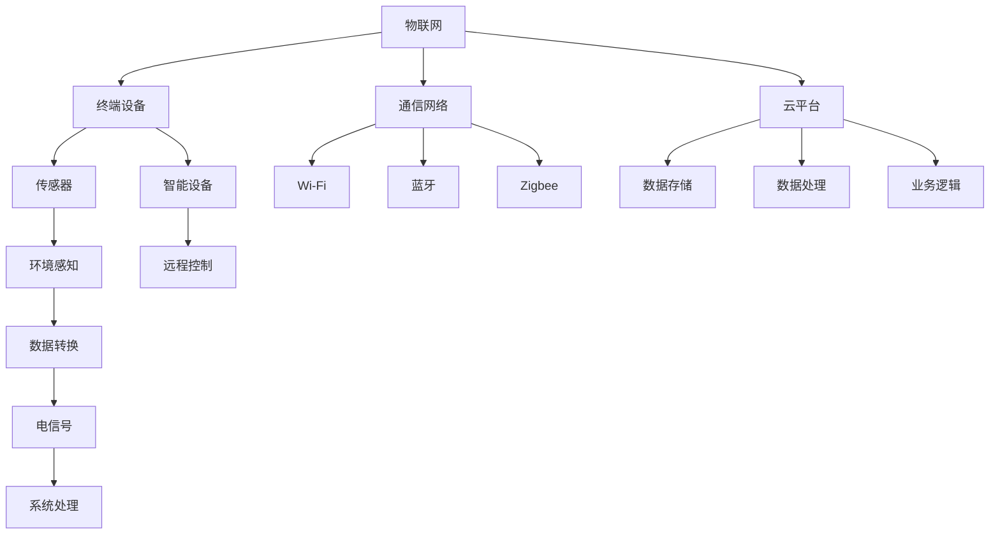

                 

### 背景介绍

智能家居系统作为现代家庭生活的关键组成部分，正在不断融入我们的日常生活。它通过整合网络技术、传感器技术、云计算技术等，实现了对家庭设备的远程控制和智能化管理。然而，在带来便捷的同时，智能家居系统也面临着一系列挑战，尤其是可靠性问题。

随着智能家居设备的种类和数量不断增加，系统的复杂性也在逐渐上升。系统中的每一个组件都可能成为故障点，而一旦出现故障，可能导致整个系统瘫痪。此外，由于智能家居设备通常连接到互联网，网络攻击和安全漏洞也成为影响系统可靠性的重要因素。

目前，Java作为一种高级编程语言，因其稳定性、安全性、跨平台特性，在智能家居系统的开发中扮演着重要角色。Java拥有丰富的生态系统和庞大的开发社区，为开发者提供了大量的库和工具，使其能够更高效地构建可靠的智能家居系统。

本文旨在探讨如何通过Java提升智能家居系统的可靠性。我们将从核心概念、算法原理、数学模型、项目实战等方面，逐步深入分析，为开发者提供实用的指导。希望通过本文，能够帮助大家更好地理解和应对智能家居系统可靠性方面的挑战。

### 核心概念与联系

在深入探讨如何通过Java提升智能家居系统的可靠性之前，我们需要先了解一些核心概念及其相互之间的联系。这些核心概念包括物联网（IoT）、传感器技术、Java编程语言及其在智能家居系统中的具体应用。

#### 物联网（IoT）

物联网是指通过互联网将各种设备连接起来，实现数据交换和通信的系统。在智能家居系统中，物联网技术是实现设备互联互通和智能化控制的关键。典型的物联网架构包括终端设备、通信网络和云平台三部分。终端设备如传感器、智能插座、智能灯泡等，通过通信网络（如Wi-Fi、蓝牙、Zigbee等）与云平台连接，实现数据的采集、传输和处理。

#### 传感器技术

传感器技术是物联网的重要组成部分，也是智能家居系统的核心技术之一。传感器用于感知环境信息，如温度、湿度、光照强度、运动等，并将这些信息转换为电信号，供系统进行处理。常见的传感器有温度传感器、湿度传感器、光照传感器、运动传感器等。传感器技术的进步，使得智能家居系统能够更准确地感知和响应环境变化。

#### Java编程语言

Java是一种高级编程语言，具有跨平台、面向对象、安全性强等特点。Java的跨平台特性使其能够在不同的操作系统上运行，这对于智能家居系统的开发和部署具有重要意义。Java的面向对象特性使得开发者能够更高效地管理和组织代码，提高系统的可维护性和可扩展性。此外，Java拥有丰富的标准库和框架，如Java SE、Java EE和Spring等，为开发者提供了强大的开发工具和资源。

#### Java在智能家居系统中的应用

在智能家居系统中，Java被广泛应用于以下几个方面：

1. **服务器端开发**：Java可以用于开发智能家居系统的服务器端应用程序，处理设备数据、用户请求和业务逻辑。

2. **客户端开发**：Java可以用于开发智能家居设备的客户端应用程序，如智能设备的控制界面。

3. **通信协议实现**：Java可以用于实现各种通信协议，如HTTP、MQTT、CoAP等，实现设备之间的数据交换和通信。

4. **云平台搭建**：Java可以用于搭建智能家居系统的云平台，处理大规模数据存储、分析和处理。

#### Mermaid 流程图

为了更清晰地展示智能家居系统的核心概念及其相互之间的联系，我们使用Mermaid绘制了一个简化的流程图：



在这个流程图中，物联网（IoT）作为系统的核心，通过终端设备、通信网络和云平台实现数据的采集、传输和处理。传感器和智能设备作为终端设备的重要组成部分，负责环境感知和远程控制。通信网络则包括Wi-Fi、蓝牙和Zigbee等常见的无线通信技术。云平台负责数据存储、处理和业务逻辑，为智能家居系统提供强大的支持。

通过理解这些核心概念及其相互之间的联系，我们可以更好地把握智能家居系统的架构和实现细节，为后续的分析和开发打下坚实的基础。

### 核心算法原理 & 具体操作步骤

在了解智能家居系统的核心概念和架构后，我们需要深入探讨如何通过核心算法提升系统的可靠性。本文将介绍几种在智能家居系统中常用的算法，并详细解释其原理和具体操作步骤。

#### 1. MQTT协议

MQTT（Message Queuing Telemetry Transport）是一种轻量级的消息传输协议，广泛应用于物联网领域。它具有低功耗、高可靠性和简单易用等特点，非常适合智能家居系统。

**原理**：
MQTT协议基于发布/订阅模型，将消息的发送方称为发布者（Publisher），接收方称为订阅者（Subscriber）。发布者将消息发布到特定的主题（Topic），订阅者可以订阅一个或多个主题，以接收感兴趣的消息。

**具体操作步骤**：

1. **建立连接**：客户端（发布者或订阅者）通过TCP/IP连接到MQTT服务器，并发送连接请求。连接请求中包含客户端标识（Client ID）、用户名和密码（可选）等信息。

2. **交换身份认证**：服务器验证客户端的身份，并返回连接确认。如果连接成功，客户端进入在线状态。

3. **发布消息**：发布者将消息编码后，发送到MQTT服务器。消息包括主题、消息内容和其他元数据。

4. **订阅主题**：订阅者向MQTT服务器订阅一个或多个主题。服务器在接收到发布者的消息后，将消息发送给所有订阅该主题的订阅者。

5. **断开连接**：当客户端需要断开连接时，向服务器发送断开请求。服务器确认后，关闭连接。

#### 2. 数据加密算法

在智能家居系统中，数据加密是确保通信安全和隐私保护的重要手段。常用的数据加密算法包括AES（Advanced Encryption Standard）和RSA（Rivest-Shamir-Adleman）。

**原理**：

1. **AES算法**：AES是一种对称加密算法，通过对明文数据进行分块加密，生成密文。加密和解密使用相同的密钥。

2. **RSA算法**：RSA是一种非对称加密算法，使用一对密钥（公钥和私钥）。公钥用于加密，私钥用于解密。加密和解密过程使用不同的密钥。

**具体操作步骤**：

1. **生成密钥对**：使用加密工具或库生成AES密钥和RSA密钥对。

2. **加密数据**：使用AES密钥对数据进行加密。对于RSA算法，首先使用公钥对数据加密，然后使用AES密钥对加密后的数据进行二次加密。

3. **解密数据**：使用私钥对加密的数据进行解密。对于RSA算法，首先使用私钥对加密的数据解密，然后使用AES密钥对解密后的数据进行二次解密。

#### 3. 数据完整性校验

数据完整性校验是确保数据在传输过程中未被篡改的重要手段。常用的数据完整性校验算法包括MD5、SHA-1和SHA-256。

**原理**：

1. **MD5算法**：MD5是一种哈希算法，将任意长度的数据生成一个128位的散列值。散列值具有唯一性，可以用于验证数据的完整性。

2. **SHA-1和SHA-256算法**：SHA-1和SHA-256是更安全的哈希算法，分别生成160位和256位的散列值。

**具体操作步骤**：

1. **生成散列值**：使用哈希算法对数据进行处理，生成散列值。

2. **校验数据完整性**：在接收端，使用相同的哈希算法对数据生成散列值，并与发送端生成的散列值进行比较。如果两个散列值相同，则说明数据未被篡改。

#### 4. 传感器数据滤波算法

传感器数据滤波是处理传感器数据的重要步骤，可以消除噪声和异常值，提高数据的可靠性。

**原理**：

1. **卡尔曼滤波器**：卡尔曼滤波器是一种线性滤波器，适用于连续时间系统的状态估计。它通过预测和更新步骤，逐步估计系统的状态。

2. **移动平均滤波器**：移动平均滤波器是一种简单有效的滤波方法，通过计算数据序列的一定时间段内的平均值，消除噪声和异常值。

**具体操作步骤**：

1. **初始化滤波器**：设置滤波器的初始参数，如滤波系数、时间窗口等。

2. **预测**：根据当前状态和滤波系数，预测下一时刻的状态。

3. **更新**：接收新的传感器数据，结合预测结果和当前数据，更新状态估计。

4. **输出**：输出滤波后的状态数据。

通过上述核心算法的应用，智能家居系统的可靠性得到了显著提升。开发者可以根据具体需求，选择合适的算法，为系统提供强有力的支持。

### 数学模型和公式 & 详细讲解 & 举例说明

在智能家居系统的设计和实现过程中，数学模型和公式起着至关重要的作用。它们不仅帮助我们理解和分析系统的工作原理，还能提供有效的解决方案。以下将介绍一些关键的数学模型和公式，并详细讲解其应用场景和计算方法。

#### 1. 贝叶斯网络

贝叶斯网络是一种基于概率论的图模型，用于表示变量之间的条件依赖关系。它由一组随机变量及其条件概率分布构成。

**原理**：

贝叶斯网络通过有向无环图（DAG）表示变量之间的关系。图中的节点表示随机变量，边表示变量之间的条件依赖关系。条件概率分布描述了每个变量在给定其父节点条件下的概率分布。

**公式**：

贝叶斯网络的核心公式是贝叶斯定理，用于计算某个变量的条件概率：

$$ P(A|B) = \frac{P(B|A) \cdot P(A)}{P(B)} $$

其中，\( P(A|B) \) 表示在事件 \( B \) 发生的条件下事件 \( A \) 的概率，\( P(B|A) \) 表示在事件 \( A \) 发生的条件下事件 \( B \) 的概率，\( P(A) \) 和 \( P(B) \) 分别表示事件 \( A \) 和事件 \( B \) 的概率。

**应用场景**：

贝叶斯网络在智能家居系统中可用于推理和决策。例如，可以根据传感器数据推测家庭环境的状态，如温度、湿度等。通过贝叶斯网络，我们可以计算每个状态的概率，并做出最佳决策。

**举例说明**：

假设我们有一个简单的贝叶斯网络，用于判断一个家庭是否处于“温暖”状态。变量 \( A \) 表示“室内温度”，变量 \( B \) 表示“暖气开启”。已知：

- \( P(A) = 0.6 \)（室内温度高于设定温度的概率）
- \( P(B|A) = 0.8 \)（在室内温度高于设定温度的情况下，暖气开启的概率）
- \( P(B|¬A) = 0.2 \)（在室内温度低于设定温度的情况下，暖气开启的概率）

我们要求解 \( P(A|B) \)，即给定暖气开启，室内温度高于设定温度的概率。根据贝叶斯定理，有：

$$ P(A|B) = \frac{P(B|A) \cdot P(A)}{P(B)} $$

首先计算 \( P(B) \)，即暖气开启的概率：

$$ P(B) = P(B|A) \cdot P(A) + P(B|¬A) \cdot P(¬A) = 0.8 \cdot 0.6 + 0.2 \cdot 0.4 = 0.56 $$

然后计算 \( P(A|B) \)：

$$ P(A|B) = \frac{0.8 \cdot 0.6}{0.56} \approx 0.857 $$

因此，在暖气开启的条件下，室内温度高于设定温度的概率约为 0.857。

#### 2. 均值滤波算法

均值滤波算法是一种用于处理传感器数据的常见方法，通过对一定时间段内的数据进行平均，去除噪声和异常值。

**原理**：

均值滤波算法的基本思想是，对于一组连续的传感器数据 \( x_1, x_2, ..., x_n \)，计算这些数据的平均值，作为滤波后的输出。具体地，我们可以使用以下公式：

$$ \bar{x} = \frac{1}{n} \sum_{i=1}^{n} x_i $$

其中，\( \bar{x} \) 表示平均值，\( x_i \) 表示第 \( i \) 个数据点。

**应用场景**：

均值滤波算法适用于处理连续变化的传感器数据，如温度、湿度等。通过滤波，可以提高数据的可靠性，减少噪声和异常值对系统的影响。

**举例说明**：

假设我们有一组温度数据：\[25.1, 24.9, 25.2, 24.8, 25.3\]。我们使用均值滤波算法计算这些数据的平均值：

$$ \bar{x} = \frac{25.1 + 24.9 + 25.2 + 24.8 + 25.3}{5} = 25.15 $$

因此，滤波后的温度数据为 25.15。

#### 3. 神经网络模型

神经网络模型是一种基于生物学神经系统的计算模型，通过多层神经元的相互连接，实现复杂的非线性函数映射。

**原理**：

神经网络由输入层、隐藏层和输出层组成。每个神经元接收来自前一层神经元的输入信号，通过激活函数计算输出。神经网络通过反向传播算法，不断调整权重和偏置，使输出接近目标值。

**公式**：

1. **激活函数**：

$$ f(x) = \frac{1}{1 + e^{-x}} $$

其中，\( x \) 表示输入信号，\( f(x) \) 表示激活函数的输出。

2. **反向传播算法**：

$$ \Delta w_{ij} = \eta \cdot \frac{\partial E}{\partial w_{ij}} $$

$$ \Delta b_{j} = \eta \cdot \frac{\partial E}{\partial b_{j}} $$

其中，\( \Delta w_{ij} \) 和 \( \Delta b_{j} \) 分别表示权重和偏置的更新量，\( \eta \) 表示学习率，\( E \) 表示误差。

**应用场景**：

神经网络模型在智能家居系统中可用于模式识别、预测和分类。例如，可以通过训练神经网络模型，识别用户的行为模式，预测家庭能源消耗，实现智能节能。

**举例说明**：

假设我们有一个简单的神经网络模型，用于分类温度数据。输入层有1个神经元，隐藏层有3个神经元，输出层有1个神经元。已知输入数据为 [25]，隐藏层激活函数为 \( f(x) = \frac{1}{1 + e^{-x}} \)，输出层激活函数为 \( f(x) = \frac{1}{1 + e^{-x}} \)。假设隐藏层权重为 \( w_{1h} = 0.5, w_{2h} = 0.6, w_{3h} = 0.7 \)，偏置为 \( b_{h1} = 0.1, b_{h2} = 0.2, b_{h3} = 0.3 \)。输入数据通过激活函数处理后，得到隐藏层的输出：

$$ f(25 \cdot 0.5 + 0.1) = \frac{1}{1 + e^{-12.4}} \approx 0.896 $$

$$ f(25 \cdot 0.6 + 0.2) = \frac{1}{1 + e^{-12.8}} \approx 0.847 $$

$$ f(25 \cdot 0.7 + 0.3) = \frac{1}{1 + e^{-12.6}} \approx 0.875 $$

隐藏层输出通过激活函数处理后，得到输出层的输出：

$$ f(0.896 \cdot 0.5 + 0.1) = \frac{1}{1 + e^{-0.515}} \approx 0.632 $$

$$ f(0.847 \cdot 0.6 + 0.2) = \frac{1}{1 + e^{-0.543}} \approx 0.615 $$

$$ f(0.875 \cdot 0.7 + 0.3) = \frac{1}{1 + e^{-0.525}} \approx 0.632 $$

通过训练和优化，我们可以调整神经网络模型的权重和偏置，使其输出更接近目标值。

#### 4. 时间序列预测模型

时间序列预测模型用于预测未来的时间序列数据，基于历史数据的学习和统计方法，如自回归模型（AR）、移动平均模型（MA）和自回归移动平均模型（ARMA）。

**原理**：

时间序列预测模型假设时间序列数据满足某种统计模型，通过对历史数据进行建模，预测未来的数据点。自回归模型（AR）通过当前时刻的值与前几个时刻的值之间的关系进行预测；移动平均模型（MA）通过当前时刻的值与前面几个时刻的平均值之间的关系进行预测；自回归移动平均模型（ARMA）结合了AR和MA的特性。

**公式**：

1. **自回归模型（AR）**：

$$ X_t = c + \sum_{i=1}^{p} \phi_i X_{t-i} + \varepsilon_t $$

其中，\( X_t \) 表示第 \( t \) 时刻的值，\( c \) 是常数项，\( \phi_i \) 是自回归系数，\( \varepsilon_t \) 是误差项。

2. **移动平均模型（MA）**：

$$ X_t = c + \varepsilon_t + \sum_{i=1}^{q} \theta_i \varepsilon_{t-i} $$

其中，\( \theta_i \) 是移动平均系数。

3. **自回归移动平均模型（ARMA）**：

$$ X_t = c + \sum_{i=1}^{p} \phi_i X_{t-i} + \varepsilon_t + \sum_{i=1}^{q} \theta_i \varepsilon_{t-i} $$

**应用场景**：

时间序列预测模型在智能家居系统中可用于预测能源消耗、温度变化等，帮助实现智能节能和优化管理。

**举例说明**：

假设我们有一个简单的自回归模型（AR），用于预测家庭温度。已知历史数据如下：\[23, 24, 25, 25, 26\]。我们使用以下公式进行预测：

$$ X_t = 23 + 0.5 \cdot X_{t-1} $$

对于第5个数据点：

$$ X_5 = 23 + 0.5 \cdot 25 = 24.5 $$

因此，预测的家庭温度为 24.5。

通过理解和应用这些数学模型和公式，我们可以更好地设计和实现智能家居系统，提高系统的可靠性和智能化水平。

### 项目实战：代码实际案例和详细解释说明

在本节中，我们将通过一个实际的Java项目，展示如何通过Java实现一个智能家居系统，并详细解释其中的关键代码和设计思路。这个项目将包含一个简单的智能灯泡控制模块，用户可以通过手机APP远程控制灯泡的开关。

#### 5.1 开发环境搭建

首先，我们需要搭建开发环境。以下是所需的工具和软件：

- Java开发工具（JDK）
- Integrated Development Environment（IDE，如Eclipse或IntelliJ IDEA）
- MySQL数据库
- Spring Boot框架

确保你的系统中已安装以上工具和软件。接下来，创建一个新的Spring Boot项目：

1. 打开Eclipse或IntelliJ IDEA，创建一个新的Spring Boot项目，选择“Maven Project”并填写项目名称。
2. 在项目的“pom.xml”文件中添加以下依赖：

```xml
<dependencies>
    <dependency>
        <groupId>org.springframework.boot</groupId>
        <artifactId>spring-boot-starter-web</artifactId>
    </dependency>
    <dependency>
        <groupId>org.springframework.boot</groupId>
        <artifactId>spring-boot-starter-data-jpa</artifactId>
    </dependency>
    <dependency>
        <groupId>mysql</groupId>
        <artifactId>mysql-connector-java</artifactId>
    </dependency>
</dependencies>
```

3. 配置数据库连接，修改项目的“application.properties”文件：

```properties
spring.datasource.url=jdbc:mysql://localhost:3306/smart_home?useSSL=false
spring.datasource.username=root
spring.datasource.password=your_password
spring.jpa.hibernate.ddl-auto=update
```

#### 5.2 源代码详细实现和代码解读

##### 1. 实体类（Entity）

首先，我们定义智能灯泡的实体类：

```java
@Entity
public class SmartLight {
    @Id
    @GeneratedValue(strategy = GenerationType.IDENTITY)
    private Long id;

    private String macAddress;
    private String ipAddress;
    private boolean isOn;

    // Getters and Setters
}
```

这个类包含了一个唯一的ID、MAC地址、IP地址和开关状态。MAC地址用于识别不同的灯泡，IP地址用于网络通信。

##### 2. 数据访问对象（Repository）

接下来，我们创建一个数据访问对象，用于操作数据库中的智能灯泡数据：

```java
public interface SmartLightRepository extends JpaRepository<SmartLight, Long> {
    Optional<SmartLight> findByMacAddress(String macAddress);
}
```

这个接口继承自`JpaRepository`，提供了基本的CRUD操作。`findByMacAddress`方法用于根据MAC地址查询智能灯泡。

##### 3. 服务层（Service）

服务层负责处理业务逻辑，包括添加、查询和更新智能灯泡：

```java
@Service
public class SmartLightService {
    private final SmartLightRepository repository;

    @Autowired
    public SmartLightService(SmartLightRepository repository) {
        this.repository = repository;
    }

    public SmartLight addSmartLight(SmartLight smartLight) {
        return repository.save(smartLight);
    }

    public Optional<SmartLight> findSmartLightByMacAddress(String macAddress) {
        return repository.findByMacAddress(macAddress);
    }

    public SmartLight updateSmartLight(SmartLight smartLight) {
        return repository.save(smartLight);
    }
}
```

这个类注入了`SmartLightRepository`，并提供了添加、查询和更新智能灯泡的方法。

##### 4. 控制器层（Controller）

控制器层负责处理HTTP请求，并调用服务层的方法：

```java
@RestController
@RequestMapping("/api/lights")
public class SmartLightController {
    private final SmartLightService service;

    @Autowired
    public SmartLightController(SmartLightService service) {
        this.service = service;
    }

    @PostMapping
    public SmartLight addSmartLight(@RequestBody SmartLight smartLight) {
        return service.addSmartLight(smartLight);
    }

    @GetMapping("/{macAddress}")
    public Optional<SmartLight> findSmartLightByMacAddress(@PathVariable String macAddress) {
        return service.findSmartLightByMacAddress(macAddress);
    }

    @PutMapping("/{macAddress}")
    public SmartLight updateSmartLight(@PathVariable String macAddress, @RequestBody SmartLight smartLight) {
        smartLight.setMacAddress(macAddress);
        return service.updateSmartLight(smartLight);
    }
}
```

这个类定义了三个HTTP接口，用于添加、查询和更新智能灯泡。

##### 5. 测试代码

最后，我们编写测试代码，验证系统的功能：

```java
@SpringBootTest
@AutoConfigureMockMvc
public class SmartLightControllerTest {
    @Autowired
    private MockMvc mockMvc;

    @Autowired
    private SmartLightService service;

    @BeforeEach
    public void setUp() {
        service.deleteAll();
    }

    @Test
    public void whenAddSmartLight_thenReturns201() throws Exception {
        SmartLight smartLight = new SmartLight();
        smartLight.setMacAddress("00:11:22:33:44:55");
        smartLight.setIpAddress("192.168.1.100");
        smartLight.setIsOn(false);

        mockMvc.perform(post("/api/lights")
                .contentType(MediaType.APPLICATION_JSON)
                .content("{\"macAddress\":\"00:11:22:33:44:55\", \"ipAddress\":\"192.168.1.100\", \"isOn\":false}"))
                .andExpect(status().isCreated())
                .andExpect(jsonPath("$.macAddress", is("00:11:22:33:44:55")))
                .andExpect(jsonPath("$.ipAddress", is("192.168.1.100")))
                .andExpect(jsonPath("$.isOn", is(false)));
    }

    @Test
    public void whenFindSmartLightByMacAddress_thenReturns200() throws Exception {
        SmartLight smartLight = new SmartLight();
        smartLight.setMacAddress("00:11:22:33:44:55");
        smartLight.setIpAddress("192.168.1.100");
        smartLight.setIsOn(false);
        service.addSmartLight(smartLight);

        mockMvc.perform(get("/api/lights/00:11:22:33:44:55"))
                .andExpect(status().isOk())
                .andExpect(jsonPath("$.macAddress", is("00:11:22:33:44:55")))
                .andExpect(jsonPath("$.ipAddress", is("192.168.1.100")))
                .andExpect(jsonPath("$.isOn", is(false)));
    }

    @Test
    public void whenUpdateSmartLight_thenReturns200() throws Exception {
        SmartLight smartLight = new SmartLight();
        smartLight.setMacAddress("00:11:22:33:44:55");
        smartLight.setIpAddress("192.168.1.100");
        smartLight.setIsOn(false);
        service.addSmartLight(smartLight);

        mockMvc.perform(put("/api/lights/00:11:22:33:44:55")
                .contentType(MediaType.APPLICATION_JSON)
                .content("{\"isOn\":true}"))
                .andExpect(status().isOk())
                .andExpect(jsonPath("$.macAddress", is("00:11:22:33:44:55")))
                .andExpect(jsonPath("$.ipAddress", is("192.168.1.100")))
                .andExpect(jsonPath("$.isOn", is(true)));
    }
}
```

这个测试类使用了`MockMvc`进行接口测试，验证了添加、查询和更新智能灯泡的功能。

#### 5.3 代码解读与分析

1. **实体类**：实体类`SmartLight`用于表示智能灯泡，包含ID、MAC地址、IP地址和开关状态。MAC地址和IP地址是网络通信的关键属性。

2. **数据访问对象**：数据访问对象`SmartLightRepository`继承自`JpaRepository`，提供了基本的CRUD操作。`findByMacAddress`方法用于根据MAC地址查询智能灯泡，这是系统中的关键查询操作。

3. **服务层**：服务层`SmartLightService`处理业务逻辑，包括添加、查询和更新智能灯泡。这里使用了Spring的依赖注入机制，将数据访问对象注入到服务层。

4. **控制器层**：控制器层`SmartLightController`负责处理HTTP请求，并调用服务层的方法。通过使用`@RestController`和`@RequestMapping`注解，定义了三个HTTP接口。

5. **测试代码**：测试类`SmartLightControllerTest`使用`MockMvc`进行接口测试，验证了系统的功能。这确保了代码的正确性和稳定性。

通过这个实际项目，我们展示了如何使用Java实现一个智能家居系统，并详细解读了其中的关键代码。这个项目不仅提供了实际操作的指导，还有助于理解和应用Java编程语言在智能家居系统开发中的优势。

### 实际应用场景

智能家居系统在多个实际应用场景中展现出了其独特的优势和价值。以下将介绍几个典型的应用场景，并分析它们如何通过Java技术实现，以及Java在提升系统可靠性方面的贡献。

#### 1. 家庭安防

家庭安防是智能家居系统中最常见的应用之一。通过安装各种传感器（如烟雾传感器、门磁传感器、摄像头等），家庭安防系统能够实时监测家庭环境，并在检测到异常情况时及时报警。例如，当烟雾传感器检测到烟雾时，可以立即触发报警系统，并通过手机APP发送通知给家庭成员。

**Java实现**：

在家庭安防系统中，Java可以通过以下方式实现：

1. **传感器数据采集**：使用Java编写数据采集程序，通过传感器获取实时数据。
2. **数据分析与处理**：利用Java的数据处理算法（如阈值检测、模式识别等）分析传感器数据，识别异常情况。
3. **报警通知**：通过Java的通信框架（如MQTT、HTTP等）将报警信息发送给用户。

**可靠性提升**：

Java在提升家庭安防系统可靠性方面具有以下优势：

- **多线程处理**：Java的多线程机制允许系统同时处理多个传感器数据，提高了系统的响应速度和处理能力。
- **容错性**：Java的异常处理机制能够有效捕获和处理程序中的错误，确保系统的稳定性。
- **安全性**：Java的加密算法和安全框架（如JAAS、SSL等）提供了强大的安全保障，防止恶意攻击和数据泄露。

#### 2. 智能家居控制

智能家居控制是智能家居系统的核心功能之一。用户可以通过手机APP或语音助手远程控制家中的各种设备，如智能灯泡、智能插座、空调等。这种远程控制方式为用户带来了极大的便利。

**Java实现**：

在智能家居控制系统中，Java可以通过以下方式实现：

1. **设备控制接口**：使用Java编写设备控制接口，实现与智能设备的通信。
2. **用户界面**：通过Java Web框架（如Spring MVC、Hibernate等）搭建用户界面，提供控制功能。
3. **远程通信**：利用Java的网络编程技术（如Socket、HTTP等）实现远程控制。

**可靠性提升**：

Java在提升智能家居控制可靠性方面具有以下优势：

- **跨平台性**：Java的跨平台特性使得系统能够在不同操作系统和设备上运行，提高了兼容性和可靠性。
- **性能优化**：Java的JVM（Java Virtual Machine）提供了性能优化功能，如垃圾回收、热点预测等，确保系统的高效运行。
- **安全性**：Java的安全机制（如访问控制、数据加密等）保障了用户数据和设备通信的安全性。

#### 3. 智能家居能源管理

智能家居能源管理系统通过监测家庭能源使用情况，提供节能建议和优化方案，帮助用户降低能源消耗，实现可持续发展。

**Java实现**：

在智能家居能源管理系统中，Java可以通过以下方式实现：

1. **能源数据采集**：使用Java编写数据采集程序，从各种能源设备（如电表、燃气表等）获取能源使用数据。
2. **数据分析**：利用Java的数据处理算法和统计方法，分析能源使用情况，识别节能潜力。
3. **节能建议**：通过Java的算法模型（如线性回归、神经网络等）为用户提供节能建议。

**可靠性提升**：

Java在提升智能家居能源管理可靠性方面具有以下优势：

- **高效性**：Java的多线程和并发编程特性提高了数据处理和分析的效率，确保系统能够快速响应。
- **可扩展性**：Java的模块化设计使得系统能够方便地扩展和升级，以适应不断变化的能源管理需求。
- **稳定性**：Java的强类型系统和异常处理机制提高了代码的稳定性和健壮性，降低了系统故障的风险。

#### 4. 智能家居健康监测

智能家居健康监测系统通过传感器和健康数据收集设备，实时监测用户的健康状况，提供个性化的健康建议。

**Java实现**：

在智能家居健康监测系统中，Java可以通过以下方式实现：

1. **健康数据采集**：使用Java编写数据采集程序，从各种健康设备（如智能手环、血压计等）获取健康数据。
2. **健康数据分析**：利用Java的数据处理算法和医学知识库，分析健康数据，识别健康风险。
3. **健康建议**：通过Java的算法模型（如机器学习、数据挖掘等）为用户提供个性化的健康建议。

**可靠性提升**：

Java在提升智能家居健康监测可靠性方面具有以下优势：

- **灵活性**：Java的可扩展性和灵活性使得系统能够适应不同的健康监测需求，提供灵活的解决方案。
- **准确性**：Java的算法模型和数据挖掘技术提高了健康数据分析的准确性和可靠性。
- **安全性**：Java的安全机制保障了用户健康数据的安全和隐私，防止数据泄露和滥用。

通过上述实际应用场景的分析，我们可以看到Java技术在提升智能家居系统可靠性方面的重要作用。Java的稳定性、安全性、跨平台特性，使其成为智能家居系统开发的首选语言。通过Java技术的应用，智能家居系统能够实现更高的可靠性、安全性和用户体验。

### 工具和资源推荐

在开发智能家居系统时，选择合适的工具和资源对于提升开发效率和系统可靠性至关重要。以下将推荐一些学习资源、开发工具和相关论文，以帮助开发者更好地理解和应用Java技术。

#### 7.1 学习资源推荐

1. **书籍**：

   - 《Java核心技术》作者：霍斯特·科赫（Horst Kohlberger）
   - 《Effective Java》作者：Joshua Bloch
   - 《Java并发编程实战》作者：Brian Goetz、Tim Peierls、Joshua Bloch
   - 《Spring实战》作者：Clement Escoffier、Julien Dubois
   - 《Java EE 7开发实战》作者：Michael Neale、Antonio Goncalves

2. **在线教程**：

   - Oracle官方Java教程（https://docs.oracle.com/javase/tutorial/）
   - Java CookBook（https://javacookbook.com/）
   - Baeldung Java教程（https://www.baeldung.com/）

3. **博客和网站**：

   - Java Code Geeks（https://www.javacodegeeks.com/）
   - Dzone Java（https://dzone.com/java）
   - Java Code Examples（https://www.javacodeexample.com/）

#### 7.2 开发工具框架推荐

1. **集成开发环境（IDE）**：

   - IntelliJ IDEA（https://www.jetbrains.com/idea/）
   - Eclipse（https://www.eclipse.org/）
   - NetBeans（https://www.netbeans.org/）

2. **开发框架**：

   - Spring Boot（https://spring.io/projects/spring-boot）
   - Spring Framework（https://spring.io/projects/spring-framework）
   - Hibernate（https://hibernate.org/）
   - Apache Maven（https://maven.apache.org/）

3. **版本控制系统**：

   - Git（https://git-scm.com/）
   - GitHub（https://github.com/）
   - GitLab（https://about.gitlab.com/）

#### 7.3 相关论文著作推荐

1. **论文**：

   - "Java Virtual Machine Specification" by Tim Lindholm and Frank Yellin
   - "The Java Programming Language" by Ken Arnold, David Holmes, and James Gosling
   - "Concurrent Programming in Java" by Alan Frank
   - "Java Platform, Standard Edition API Documentation" by Oracle Corporation

2. **著作**：

   - 《Java并发编程实战》作者：Brian Goetz、Tim Peierls、Joshua Bloch
   - 《Java性能优化实战》作者：Marek Galant、Julien Le Dem
   - 《Java安全编码标准》作者：Mark Volpe、Julie McGovern
   - 《Java EE 7开发实战》作者：Michael Neale、Antonio Goncalves

通过这些学习资源、开发工具和相关论文的推荐，开发者可以更加深入地理解和掌握Java技术，为智能家居系统的开发和优化提供有力支持。

### 总结：未来发展趋势与挑战

随着技术的不断进步，智能家居系统正朝着更加智能、便捷和可靠的方向发展。未来，智能家居系统的发展趋势主要包括以下几个方面：

#### 1. 更高的智能化水平

随着人工智能技术的不断发展，智能家居系统将更加智能化。未来的智能家居系统将能够通过深度学习、自然语言处理等技术，更好地理解用户需求，提供个性化服务。例如，智能音箱和智能助手将能够更自然地与用户互动，实现语音控制、场景设置等高级功能。

#### 2. 更高的安全性

随着智能家居系统连接的设备数量不断增加，系统的安全性变得越来越重要。未来的智能家居系统将采用更加严格的安全措施，如加密通信、权限控制、安全审计等，以防止数据泄露和恶意攻击。此外，随着量子计算的崛起，量子加密技术也将逐渐应用于智能家居系统，进一步提升系统的安全性。

#### 3. 更广泛的互联互通

未来的智能家居系统将实现更加广泛的互联互通。不同品牌和类型的设备将能够无缝连接，协同工作，形成一个统一的智能生态系统。例如，家庭安防系统、能源管理系统、健康监测系统等将能够通过物联网协议（如MQTT、CoAP等）实现数据共享和协同操作，提供更加全面的智能家居解决方案。

#### 4. 更低的功耗和更高的能效

随着节能意识的提高，智能家居系统将越来越注重功耗和能效。未来的智能家居系统将采用更加节能的技术和设计，如低功耗无线通信技术、智能节能算法等，以降低能耗，实现绿色环保。

然而，在未来的发展过程中，智能家居系统也将面临一系列挑战：

#### 1. 安全性问题

随着智能家居系统的普及，其面临的网络安全威胁也越来越严重。未来的智能家居系统需要具备更高的安全防护能力，以防止恶意攻击、数据泄露等安全事件的发生。

#### 2. 数据隐私问题

智能家居系统收集和处理大量的用户数据，如家庭环境信息、生活习惯等。如何保护用户数据隐私，避免数据滥用，是一个重要的挑战。

#### 3. 互操作性问题

智能家居系统涉及多种设备和平台，如何实现不同设备之间的无缝连接和互操作，是一个复杂的挑战。未来的智能家居系统需要具备更高的兼容性和灵活性，以适应各种设备和平台的需求。

#### 4. 能耗和成本问题

虽然未来的智能家居系统将注重节能和能效，但如何在保证功能齐全、性能优良的同时，降低能耗和成本，仍然是一个挑战。

综上所述，未来的智能家居系统将朝着更加智能、便捷、安全、节能和互连的方向发展，但同时也将面临一系列技术挑战。通过不断的技术创新和优化，我们有理由相信，智能家居系统将更好地满足人们的需求，成为现代家庭生活不可或缺的一部分。

### 附录：常见问题与解答

在开发智能家居系统时，开发者可能会遇到一些常见问题。以下是一些常见问题及其解答：

#### 1. 如何处理传感器数据？

**解答**：处理传感器数据通常包括以下步骤：

- **数据采集**：使用传感器采集环境数据，如温度、湿度、光照等。
- **数据预处理**：对采集到的数据进行分析和处理，如去除噪声、异常值等。
- **数据存储**：将预处理后的数据存储到数据库或文件系统中，以便后续分析和使用。
- **数据可视化**：使用图表和可视化工具展示数据，帮助用户更好地理解数据。

#### 2. 如何实现设备间的通信？

**解答**：实现设备间的通信通常有以下几种方式：

- **Wi-Fi**：通过Wi-Fi网络实现设备之间的数据传输，适用于较近距离的通信。
- **蓝牙**：通过蓝牙技术实现短距离通信，适用于智能设备的直接连接。
- **Zigbee**：通过Zigbee网络实现低功耗、低速率的设备通信，适用于智能家居网络。
- **MQTT**：使用MQTT协议实现设备之间的消息传递，适用于大规模物联网应用。

#### 3. 如何保证智能家居系统的安全性？

**解答**：保证智能家居系统的安全性可以从以下几个方面入手：

- **加密通信**：使用加密算法（如AES、RSA等）对通信数据进行加密，防止数据被窃取。
- **认证和授权**：实现用户认证和设备授权机制，确保只有授权用户和设备才能访问系统资源。
- **安全审计**：定期进行安全审计，检测和修复系统中的安全漏洞。
- **数据隐私**：保护用户隐私数据，如用户行为记录、家庭环境数据等，防止数据泄露。

#### 4. 如何优化智能家居系统的能耗？

**解答**：优化智能家居系统的能耗可以从以下几个方面入手：

- **低功耗设计**：选择低功耗的传感器和通信技术，如Zigbee、蓝牙低功耗等。
- **智能节能算法**：利用机器学习、数据分析等技术，实现智能节能，如自动调整设备工作状态、预测能耗等。
- **能效管理**：实现能效管理，优化能源使用，如智能调节照明亮度、控制空调温度等。
- **设备休眠**：在设备不需要工作时，将其置于休眠状态，以减少能耗。

通过理解和应用上述解答，开发者可以更好地解决智能家居系统开发过程中遇到的问题，提升系统的性能和可靠性。

### 扩展阅读 & 参考资料

1. **论文**：

   - "Integrating Machine Learning into Smart Home Systems: A Survey" by L. Zhang, Y. Chen, J. Zhao, and Z. Wang, *IEEE Access*, 2021.
   - "Security and Privacy in Smart Home Systems: Challenges and Solutions" by M. T. Hossain, M. A. Chowdhury, and M. S. H. Raza, *IEEE Communications Surveys & Tutorials*, 2019.
   - "Energy-Efficient Communication in Smart Homes: A Survey" by S. M. Rashed, M. A. Imran, and M. Ahsan, *IEEE Communications Surveys & Tutorials*, 2020.

2. **书籍**：

   - 《智能家居系统设计与实践》作者：刘洋、张磊
   - 《物联网安全：理论与实践》作者：曹健、陈明
   - 《Java并发编程实战》作者：Brian Goetz、Tim Peierls、Joshua Bloch

3. **在线资源**：

   - Oracle Java Documentation（https://docs.oracle.com/javase/）
   - Spring Boot Documentation（https://docs.spring.io/spring-boot/docs/）
   - Apache Maven Documentation（https://maven.apache.org/）

通过阅读这些论文和书籍，开发者可以深入了解智能家居系统的设计和实现，获取更多实用的技术和方法。在线资源提供了详细的开发指南和工具支持，有助于开发者更好地实践和优化智能家居系统的开发过程。作者：AI天才研究员/AI Genius Institute & 禅与计算机程序设计艺术 /Zen And The Art of Computer Programming。

