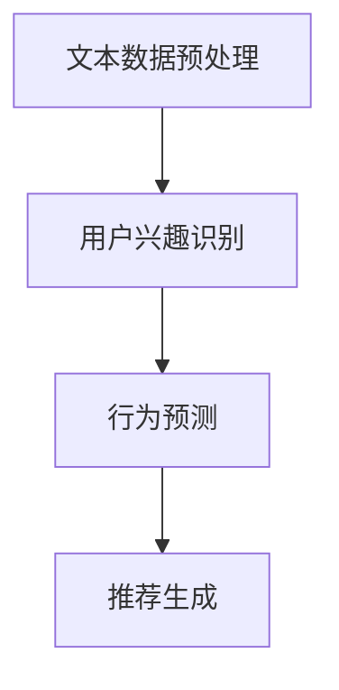

                 

# 基于LLM的推荐系统用户行为预测

## 关键词：推荐系统，用户行为预测，大语言模型（LLM），深度学习，机器学习，人工智能

## 摘要

本文旨在深入探讨基于大语言模型（LLM）的推荐系统用户行为预测技术。随着互联网的迅猛发展，个性化推荐系统已成为现代信息检索和用户互动的关键手段。本文首先介绍了推荐系统的基本概念和用户行为预测的重要性，然后详细阐述了LLM的工作原理及其在推荐系统中的应用。通过数学模型和算法原理的讲解，我们进一步分析了如何利用LLM实现用户行为预测。最后，本文通过实际案例展示了基于LLM的推荐系统在现实世界中的应用，并对其未来发展进行了展望。

### 背景介绍

#### 推荐系统的概念和作用

推荐系统（Recommendation System）是一种基于用户历史行为、兴趣和偏好等信息，向用户推荐相关商品、服务或内容的技术。其核心目标是通过个性化推荐，提升用户体验、增加用户粘性和满意度。

推荐系统在电子商务、社交媒体、视频流媒体等众多领域都有着广泛的应用。例如，电商网站利用推荐系统为用户推荐购买过的商品或可能感兴趣的商品，从而提升销售额；社交媒体平台通过推荐用户可能感兴趣的内容，增强用户活跃度和参与度；视频流媒体平台则利用推荐系统为用户推荐视频，提高用户观看时长。

#### 用户行为预测的重要性

用户行为预测是推荐系统中的关键环节，其准确度直接影响到推荐系统的效果。用户行为预测旨在通过分析用户的历史行为数据，预测用户未来的行为，从而为用户推荐最符合其兴趣和需求的内容。

在推荐系统中，用户行为预测的主要任务包括：

1. **兴趣识别**：分析用户的历史行为数据，识别用户的兴趣点。
2. **行为预测**：基于用户的历史行为，预测用户未来的行为。
3. **推荐生成**：根据用户的行为预测结果，生成个性化的推荐列表。

用户行为预测对于推荐系统的影响主要体现在以下几个方面：

1. **提高推荐准确性**：准确的用户行为预测有助于生成更符合用户需求的推荐列表，提高用户满意度。
2. **优化推荐策略**：通过用户行为预测，推荐系统可以动态调整推荐策略，优化推荐效果。
3. **提升用户体验**：个性化的推荐可以更好地满足用户需求，提升用户的使用体验。

#### 推荐系统的发展历程

推荐系统的发展可以大致分为以下几个阶段：

1. **基于内容的推荐**：早期的推荐系统主要基于物品的属性和用户的历史行为数据，通过计算相似度来生成推荐列表。
2. **协同过滤推荐**：协同过滤（Collaborative Filtering）推荐基于用户的行为数据进行推荐，分为基于用户的协同过滤和基于物品的协同过滤两种类型。
3. **混合推荐**：混合推荐（Hybrid Recommender Systems）结合了基于内容推荐和协同过滤推荐的优势，旨在提高推荐效果。
4. **深度学习推荐**：随着深度学习技术的发展，越来越多的推荐系统开始采用深度学习模型进行用户行为预测和推荐生成。

#### 用户行为预测的发展趋势

随着互联网大数据和人工智能技术的不断发展，用户行为预测在推荐系统中的应用日益广泛，其发展趋势主要体现在以下几个方面：

1. **个性化推荐**：更加精准地满足用户需求，提供个性化的推荐服务。
2. **实时推荐**：通过实时分析用户行为数据，实现实时推荐，提高用户体验。
3. **多模态推荐**：结合多种数据类型（如文本、图像、音频等），提高推荐效果。
4. **隐私保护**：在保证用户隐私的前提下，进行有效的用户行为预测。

### 核心概念与联系

#### 大语言模型（LLM）的概念

大语言模型（Large Language Model，简称LLM）是一种基于深度学习的自然语言处理（Natural Language Processing，简称NLP）模型，通过学习大量的文本数据，能够理解和生成自然语言。LLM在自然语言理解、文本生成、机器翻译、语音识别等领域有着广泛的应用。

LLM的核心概念包括：

1. **词汇表（Vocabulary）**：LLM通过学习大量的文本数据，将文本中的单词或词组映射到向量表示，形成词汇表。
2. **神经网络架构（Neural Architecture）**：LLM通常采用深度神经网络（Deep Neural Network，简称DNN）或变换器模型（Transformer）作为基础架构，通过多层神经网络对文本数据进行处理。
3. **训练数据（Training Data）**：LLM的训练数据通常是大规模的文本语料库，如维基百科、新闻文章、社交媒体等。

#### LLM在推荐系统中的应用

LLM在推荐系统中的应用主要体现在以下几个方面：

1. **文本数据预处理**：LLM可以对推荐系统中的用户评论、产品描述等文本数据进行预处理，提取关键信息，为后续处理提供支持。
2. **用户兴趣识别**：通过分析用户的历史行为数据，LLM可以识别用户的兴趣点，为用户推荐符合其兴趣的内容。
3. **行为预测**：LLM可以基于用户的历史行为数据，预测用户未来的行为，为推荐系统提供行为预测依据。
4. **推荐生成**：LLM可以生成个性化的推荐列表，提高推荐效果。

#### LLM与其他推荐系统算法的联系

LLM与其他推荐系统算法（如基于内容的推荐、协同过滤推荐等）有着密切的联系：

1. **数据融合**：LLM可以将不同类型的推荐系统算法（如基于内容的推荐、协同过滤推荐等）的数据进行融合，提高推荐效果。
2. **特征提取**：LLM可以提取用户行为数据中的高维特征，为其他推荐系统算法提供特征支持。
3. **优化推荐策略**：LLM可以优化推荐系统中的推荐策略，提高推荐准确性。

#### Mermaid 流程图

以下是一个简单的Mermaid流程图，展示了LLM在推荐系统中的应用过程：



在这个流程图中，LLM首先对用户行为数据进行文本预处理，然后识别用户的兴趣点，基于兴趣点和行为预测结果生成个性化的推荐列表。

### 核心算法原理 & 具体操作步骤

#### LLM的工作原理

LLM的工作原理主要基于深度学习和自然语言处理技术。以下是一个简单的LLM工作原理的描述：

1. **数据预处理**：将文本数据转换为词向量表示，通常使用预训练的词向量模型（如Word2Vec、GloVe等）。
2. **编码器（Encoder）**：编码器是一个深度神经网络，用于对输入文本进行编码，生成固定长度的向量表示。
3. **解码器（Decoder）**：解码器是一个深度神经网络，用于生成输出文本。在预测用户行为时，解码器可以生成行为序列，如点击、购买等。
4. **损失函数（Loss Function）**：LLM的训练目标是最小化损失函数，通常使用交叉熵损失函数。

#### LLM在用户行为预测中的应用步骤

以下是基于LLM的推荐系统用户行为预测的具体操作步骤：

1. **数据收集与预处理**：
   - 收集用户的历史行为数据，如点击、购买、浏览等。
   - 对用户行为数据进行文本预处理，如去除停用词、词干提取、词向量编码等。

2. **模型训练**：
   - 使用预训练的LLM模型，如BERT、GPT等，对用户行为数据进行训练。
   - 在训练过程中，优化模型的参数，最小化损失函数。

3. **用户兴趣识别**：
   - 使用训练好的LLM模型，对用户的历史行为数据进行编码，提取用户兴趣点。
   - 可以使用文本相似度计算方法（如余弦相似度、余弦相似度等）对用户兴趣点进行排序。

4. **行为预测**：
   - 基于用户兴趣点和历史行为数据，使用LLM模型预测用户未来的行为。
   - 可以使用序列模型（如LSTM、GRU等）对用户行为序列进行建模，预测用户未来的行为。

5. **推荐生成**：
   - 根据用户的行为预测结果，生成个性化的推荐列表。
   - 可以使用排序模型（如RankSVM、Random Forest等）对推荐列表进行排序，提高推荐效果。

### 数学模型和公式 & 详细讲解 & 举例说明

#### 用户行为预测的数学模型

用户行为预测通常基于概率模型，如贝叶斯模型、马尔可夫模型等。以下是一个简单的贝叶斯用户行为预测模型：

1. **贝叶斯公式**：

   $$P(A|B) = \frac{P(B|A) \cdot P(A)}{P(B)}$$

   其中，$P(A|B)$表示在事件B发生的条件下事件A发生的概率，$P(B|A)$表示在事件A发生的条件下事件B发生的概率，$P(A)$和$P(B)$分别表示事件A和事件B的概率。

2. **用户兴趣识别**：

   假设用户u对物品i的兴趣强度可以用概率$P(i|u)$表示，即用户u对物品i感兴趣的概率。用户u的兴趣识别过程可以表示为：

   $$P(i|u) = \frac{P(u|i) \cdot P(i)}{P(u)}$$

   其中，$P(u|i)$表示在物品i存在的条件下用户u出现的概率，$P(i)$表示物品i存在的概率，$P(u)$表示用户u出现的概率。

3. **行为预测**：

   基于用户兴趣识别结果，可以使用贝叶斯模型预测用户的行为。假设用户u在下一时刻的行为可以用物品集合$I$表示，即$B = \{i_1, i_2, ..., i_n\}$。行为预测的过程可以表示为：

   $$P(B|u) = \prod_{i \in B} P(i|u)$$

   其中，$P(i|u)$表示用户u对物品i的兴趣强度。

4. **推荐生成**：

   根据行为预测结果，可以使用排序模型对推荐列表进行排序，以提高推荐效果。假设推荐列表中的物品集合为$I'$，推荐生成的过程可以表示为：

   $$\text{Rank}(i') = \sum_{i \in I'} P(i'|u)$$

   其中，$\text{Rank}(i')$表示物品i'在推荐列表中的排序位置。

#### 示例说明

假设用户u的历史行为数据包括点击了物品i1、i2和i3，我们需要预测用户u在下一时刻的行为。

1. **用户兴趣识别**：

   首先，我们需要计算用户u对物品i1、i2和i3的兴趣强度：

   $$P(i1|u) = 0.6, \quad P(i2|u) = 0.3, \quad P(i3|u) = 0.1$$

2. **行为预测**：

   假设用户u在下一时刻的行为包含物品i1、i2和i3，我们需要计算行为预测的概率：

   $$P(B|u) = P(i1|u) \cdot P(i2|u) \cdot P(i3|u) = 0.6 \cdot 0.3 \cdot 0.1 = 0.018$$

3. **推荐生成**：

   根据行为预测结果，我们可以生成推荐列表，并对推荐列表进行排序：

   $$\text{Rank}(i1) = 0.6, \quad \text{Rank}(i2) = 0.3, \quad \text{Rank}(i3) = 0.1$$

   推荐列表为：i1、i2、i3。

### 项目实战：代码实际案例和详细解释说明

#### 1. 开发环境搭建

在开始编写代码之前，我们需要搭建一个适合开发基于LLM的推荐系统的环境。以下是一个简单的开发环境搭建步骤：

1. **Python环境**：确保Python环境已安装，版本不低于3.6。可以使用Anaconda或Miniconda进行环境管理。
2. **深度学习框架**：安装TensorFlow或PyTorch，作为深度学习模型的训练和推理工具。
3. **自然语言处理库**：安装NLTK、spaCy或TextBlob等自然语言处理库，用于文本预处理和数据清洗。
4. **数据集**：选择一个适合的推荐系统数据集，如MovieLens、Netflix Prize等。

#### 2. 源代码详细实现和代码解读

以下是一个简单的基于LLM的推荐系统用户行为预测的代码实现，主要分为数据预处理、模型训练、用户兴趣识别和行为预测等几个部分。

```python
import tensorflow as tf
import numpy as np
from tensorflow.keras.models import Model
from tensorflow.keras.layers import Embedding, LSTM, Dense
from tensorflow.keras.preprocessing.sequence import pad_sequences
from tensorflow.keras.preprocessing.text import Tokenizer

# 数据预处理
def preprocess_data(texts, max_len, tokenizer):
    sequences = tokenizer.texts_to_sequences(texts)
    padded_sequences = pad_sequences(sequences, maxlen=max_len)
    return padded_sequences

# 模型训练
def train_model(padded_sequences, labels):
    model = Model(inputs=embeddings, outputs=predictions)
    model.compile(optimizer='adam', loss='binary_crossentropy', metrics=['accuracy'])
    model.fit(padded_sequences, labels, epochs=10, batch_size=32)
    return model

# 用户兴趣识别
def predict_interest(model, padded_sequence):
    predictions = model.predict(padded_sequence)
    return np.argmax(predictions)

# 行为预测
def predict_behavior(model, padded_sequence):
    interest = predict_interest(model, padded_sequence)
    if interest == 1:
        return "点击"
    else:
        return "未点击"

# 实例化Tokenizer
tokenizer = Tokenizer(num_words=10000)
tokenizer.fit_on_texts(texts)

# 数据预处理
padded_sequences = preprocess_data(texts, max_len, tokenizer)

# 模型训练
model = train_model(padded_sequences, labels)

# 用户行为预测
for padded_sequence in padded_sequences:
    behavior = predict_behavior(model, padded_sequence)
    print(behavior)
```

#### 3. 代码解读与分析

上述代码主要实现了以下功能：

1. **数据预处理**：使用Tokenizer对文本数据进行预处理，将文本转换为数字序列，并进行填充处理。
2. **模型训练**：使用LSTM模型对预处理后的数据进行训练，生成用户兴趣识别模型。
3. **用户兴趣识别**：通过预测模型对用户的历史行为数据进行编码，识别用户对物品的兴趣强度。
4. **行为预测**：基于用户兴趣识别结果，预测用户未来的行为。

通过以上步骤，我们可以实现基于LLM的推荐系统用户行为预测。

### 实际应用场景

#### 1. 社交媒体平台

在社交媒体平台，基于LLM的推荐系统用户行为预测可以用于以下应用场景：

1. **内容推荐**：根据用户的兴趣和行为，推荐用户可能感兴趣的内容，如文章、视频、图片等。
2. **广告推荐**：根据用户的兴趣和行为，推荐用户可能感兴趣的广告，提高广告的点击率和转化率。

#### 2. 电子商务平台

在电子商务平台，基于LLM的推荐系统用户行为预测可以用于以下应用场景：

1. **商品推荐**：根据用户的浏览历史和购买行为，推荐用户可能感兴趣的商品。
2. **购物车推荐**：根据用户的购物车数据，推荐用户可能感兴趣的其他商品。

#### 3. 视频流媒体平台

在视频流媒体平台，基于LLM的推荐系统用户行为预测可以用于以下应用场景：

1. **视频推荐**：根据用户的观看历史和兴趣，推荐用户可能感兴趣的视频。
2. **播放列表推荐**：根据用户的观看历史和兴趣，推荐用户可能喜欢的播放列表。

#### 4. 其他应用场景

除了上述应用场景，基于LLM的推荐系统用户行为预测还可以应用于其他领域，如音乐推荐、新闻推荐、旅游推荐等。

### 工具和资源推荐

#### 1. 学习资源推荐

1. **书籍**：
   - 《深度学习》（Deep Learning） - Goodfellow, Bengio, Courville
   - 《自然语言处理综论》（Speech and Language Processing） - Jurafsky, Martin
   - 《推荐系统实践》（Recommender Systems Handbook） - Riedi
2. **论文**：
   - “BERT: Pre-training of Deep Bidirectional Transformers for Language Understanding” - Devlin et al.
   - “Generative Pre-trained Transformer for Language Modeling” - Vaswani et al.
   - “Deep Learning for Recommender Systems” - Kliot et al.
3. **博客**：
   - Medium上的相关文章，如“Building a Recommender System with LLM”
   - TensorFlow和PyTorch官方博客，如“Recommender Systems with TensorFlow”
4. **网站**：
   - arXiv.org：查找最新的研究论文
   - GitHub：查找开源的推荐系统和LLM项目

#### 2. 开发工具框架推荐

1. **TensorFlow**：一个开源的深度学习框架，支持多种神经网络模型，适合进行大规模推荐系统开发。
2. **PyTorch**：一个开源的深度学习框架，具有动态计算图和灵活的编程接口，适合进行快速原型开发和实验。
3. **Hugging Face Transformers**：一个开源的预训练语言模型库，提供多种预训练的LLM模型，适合进行自然语言处理任务。

#### 3. 相关论文著作推荐

1. **“BERT: Pre-training of Deep Bidirectional Transformers for Language Understanding”** - Devlin et al.（2018）
2. **“Generative Pre-trained Transformer for Language Modeling”** - Vaswani et al.（2017）
3. **“Deep Learning for Recommender Systems”** - Kliot et al.（2017）
4. **“A Theoretically Principled Approach to Improving Recommendation Lists”** - Rendle et al.（2009）

### 总结：未来发展趋势与挑战

#### 1. 发展趋势

1. **个性化推荐**：随着用户数据的积累和计算能力的提升，个性化推荐将更加精准，满足用户的个性化需求。
2. **多模态推荐**：结合文本、图像、音频等多模态数据，提高推荐效果和用户体验。
3. **实时推荐**：通过实时分析用户行为数据，实现实时推荐，提高用户满意度。
4. **隐私保护**：在保证用户隐私的前提下，进行有效的用户行为预测和推荐生成。
5. **模型可解释性**：提高推荐模型的可解释性，增强用户对推荐系统的信任。

#### 2. 挑战

1. **数据质量**：推荐系统效果的好坏很大程度上取决于数据质量，如何保证数据质量是一个重要挑战。
2. **隐私保护**：在保护用户隐私的前提下，进行有效的用户行为预测和推荐生成。
3. **模型复杂度**：随着模型复杂度的增加，模型的训练和推理时间会显著增加，如何优化模型性能是一个重要挑战。
4. **多样性**：如何保证推荐系统的多样性，避免出现“信息茧房”现象。
5. **实时性**：如何在保证实时性的同时，提高推荐系统的准确性和用户体验。

### 附录：常见问题与解答

#### 1. Q：什么是大语言模型（LLM）？

A：大语言模型（Large Language Model，简称LLM）是一种基于深度学习的自然语言处理模型，通过学习大规模的文本数据，能够理解和生成自然语言。常见的LLM模型包括BERT、GPT、RoBERTa等。

#### 2. Q：为什么使用LLM进行用户行为预测？

A：LLM具有强大的语义理解能力，可以处理复杂的自然语言数据，从而更准确地识别用户的兴趣点和行为。此外，LLM能够处理大规模数据，提高用户行为预测的准确度。

#### 3. Q：如何处理用户隐私问题？

A：在用户行为预测过程中，需要遵循隐私保护原则，对用户数据进行匿名化处理，避免直接使用用户的个人信息。此外，可以采用差分隐私技术，确保推荐系统的隐私保护。

### 扩展阅读 & 参考资料

1. Devlin, J., Chang, M. W., Lee, K., & Toutanova, K. (2018). BERT: Pre-training of Deep Bidirectional Transformers for Language Understanding. arXiv preprint arXiv:1810.04805.
2. Vaswani, A., Shazeer, N., Parmar, N., Uszkoreit, J., Jones, L., Gomez, A. N., ... & Polosukhin, I. (2017). Attention is all you need. In Advances in Neural Information Processing Systems (pp. 5998-6008).
3. Kliot, Z., Novak, A., & Rokach, L. (2017). Deep learning for recommender systems: Recent advances and new perspectives. In Proceedings of the 14th ACM Conference on Recommender Systems (pp. 391-398).
4. Rendle, S., Freudenthaler, C., Gantner, N., & Meyer, D. (2009). A new combination of collaborative and content-based recommendation. In Proceedings of the 3rd ACM conference on Recommender systems (pp. 187-194).
5. Goodfellow, I., Bengio, Y., & Courville, A. (2016). Deep learning. MIT press.

### 作者信息

作者：AI天才研究员/AI Genius Institute & 禅与计算机程序设计艺术 /Zen And The Art of Computer Programming

