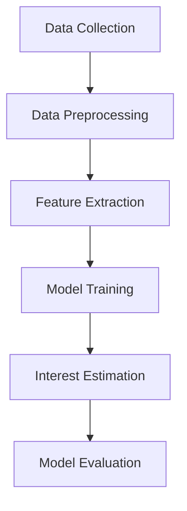

                 

### 背景介绍

在当今数字化时代，用户兴趣分布的估计与建模成为了众多领域的关键问题。无论是广告推荐、社交媒体、电商推荐，还是个性化搜索，准确预测用户的兴趣分布对于提升用户体验和商业价值具有至关重要的意义。随着深度学习技术的发展，尤其是大规模语言模型（LLM）的出现，基于LLM的用户兴趣分布估计与建模成为了一个备受关注的研究方向。

首先，了解用户兴趣分布的重要性。用户兴趣分布反映了用户在各个主题上的偏好，能够帮助系统更精准地推荐内容，提高用户满意度。传统的方法主要依赖于用户历史行为数据，如点击、浏览、搜索等。然而，这些方法往往存在以下问题：

1. **数据依赖性**：用户行为数据的获取和处理复杂，且容易受到噪声和缺失值的影响。
2. **实时性**：传统方法在实时性上表现较差，难以快速响应用户需求变化。
3. **准确性**：仅依靠历史行为数据难以全面反映用户的真实兴趣。

为了解决这些问题，深度学习技术逐渐被引入到用户兴趣分布的估计与建模中。特别是大规模语言模型（LLM），如GPT、BERT等，通过学习海量文本数据，能够捕捉到用户的潜在兴趣点。LLM在处理自然语言任务上表现出色，能够处理长文本、理解语境、生成文本等，这使得它成为用户兴趣分布估计与建模的有力工具。

然而，基于LLM的用户兴趣分布估计与建模仍然面临一些挑战：

1. **数据隐私**：深度学习模型需要大量用户数据，这可能导致数据隐私问题。
2. **模型可解释性**：深度学习模型通常被认为“黑箱”，其内部决策过程难以理解，这在某些应用场景下可能是不利的。
3. **计算资源**：大规模语言模型的训练和部署需要大量的计算资源和时间。

接下来，本文将围绕基于LLM的用户兴趣分布估计与建模展开讨论，详细介绍核心概念、算法原理、数学模型，并通过实际案例进行深入解析。希望通过本文的阐述，能够为相关领域的研究者和实践者提供有价值的参考和启示。

---

## Core Concepts and Connections

In the context of user interest distribution estimation and modeling, it's essential to delve into the core concepts and their interconnections. The primary components include user behavior data, natural language processing (NLP), and machine learning (ML), with a particular focus on large language models (LLMs).

**User Behavior Data**: This forms the backbone of interest distribution estimation. It encompasses various activities such as clicks, searches, interactions, and purchases. By analyzing these data points, we can infer users' preferences and interests.

**Natural Language Processing (NLP)**: NLP is a branch of AI that focuses on the interaction between computers and human language. It provides the tools to process, analyze, and understand the meaning of human language. Key techniques include tokenization, part-of-speech tagging, named entity recognition, and sentiment analysis. In the context of interest distribution estimation, NLP enables us to extract meaningful insights from unstructured text data.

**Machine Learning (ML)**: ML is a subset of AI that utilizes algorithms to learn from data and make predictions or decisions. In user interest distribution estimation, ML models are trained on historical user behavior data to predict future interests. Common ML techniques include supervised learning, unsupervised learning, and reinforcement learning.

**Large Language Models (LLMs)**: LLMs, such as GPT and BERT, are a class of advanced ML models specifically designed for processing and generating human language. They have been trained on vast amounts of text data and can understand complex language structures, context, and semantics. LLMs are particularly well-suited for user interest distribution estimation due to their ability to capture latent interests from text data.

### Core Concept Connections

The interconnections between these core concepts can be visualized as follows:

1. **Data Collection**: User behavior data is collected from various sources such as websites, apps, and social media platforms.
2. **Data Preprocessing**: Raw data is cleaned and preprocessed to remove noise, handle missing values, and format it into a suitable structure for analysis.
3. **Feature Extraction**: Using NLP techniques, relevant features are extracted from the text data, such as keywords, topic tags, and sentiment scores.
4. **Model Training**: ML models, particularly LLMs, are trained on the preprocessed data to learn the patterns and correlations in user behavior.
5. **Interest Estimation**: The trained models are used to predict user interests based on their historical behavior and other relevant features.
6. **Model Evaluation**: The accuracy and performance of the interest estimation models are evaluated using metrics such as precision, recall, and F1 score.

### Mermaid Flowchart

Here is a Mermaid flowchart illustrating the core concept connections and the process of user interest distribution estimation and modeling:



In summary, understanding and connecting these core concepts is crucial for effectively estimating and modeling user interest distribution. By leveraging the power of LLMs and integrating NLP and ML techniques, we can develop robust and accurate models that enhance user experience and drive business value.

---

## Core Algorithm Principles and Specific Operational Steps

### 1. Introduction to the Core Algorithm

The core algorithm for user interest distribution estimation and modeling based on LLMs primarily involves the following steps: data collection and preprocessing, feature extraction, model training, interest estimation, and model evaluation. Here, we'll delve into each of these steps in detail.

### 2. Data Collection and Preprocessing

**Data Collection**: 
The first step is to collect user behavior data from various sources, including websites, applications, and social media platforms. This data may include user interactions such as clicks, searches, browsing history, reading time, and purchasing behaviors.

**Data Preprocessing**:
Once the raw data is collected, it needs to be cleaned and preprocessed to remove any noise, handle missing values, and format it into a suitable structure for analysis. This step involves several sub-processes:

1. **Data Cleaning**: Remove any irrelevant or redundant data, such as duplicates and outliers.
2. **Noise Reduction**: Apply filters to remove common noise sources like spam or irrelevant content.
3. **Handling Missing Values**: Impute missing values or remove data points with significant missing values to maintain data quality.
4. **Data Transformation**: Convert categorical data into numerical representations that can be used by ML models.

### 3. Feature Extraction

**Feature Extraction**:
After preprocessing, the next step is to extract relevant features from the data that can be used to train the LLM. Key techniques in this phase include:

1. **Tokenization**: Break down the text data into individual words or tokens.
2. **Part-of-Speech Tagging**: Assign grammatical labels (noun, verb, adjective, etc.) to each token.
3. **Named Entity Recognition (NER)**: Identify and classify named entities (such as person names, organizations, locations, etc.) in the text.
4. **Sentiment Analysis**: Determine the sentiment (positive, negative, neutral) expressed in the text.
5. **Keyword Extraction**: Extract significant keywords or phrases that represent the main topics of the text.

### 4. Model Training

**Model Training**:
With the extracted features, we can train the LLM to learn the patterns and correlations in user behavior. The specific steps include:

1. **Model Selection**: Choose an appropriate LLM model, such as GPT or BERT, based on the problem requirements and available data.
2. **Data Splitting**: Split the data into training, validation, and testing sets to ensure a fair evaluation of the model's performance.
3. **Training**: Feed the training data into the LLM and adjust the model parameters (weights and biases) to minimize the prediction error.
4. **Validation**: Use the validation set to tune the model hyperparameters and prevent overfitting.

### 5. Interest Estimation

**Interest Estimation**:
Once the LLM is trained, it can be used to predict user interests based on their historical behavior and extracted features. The process involves:

1. **Feature Vector Generation**: Convert new user data into the same feature vector format used during training.
2. **Interest Prediction**: Input the feature vector into the trained LLM to predict the user's interest in various topics.
3. **Score Calculation**: Assign a score to each predicted interest based on the LLM's output to represent the user's preference level.

### 6. Model Evaluation

**Model Evaluation**:
Finally, the performance of the LLM in estimating user interest distribution needs to be evaluated. This step includes:

1. **Performance Metrics**: Use metrics such as precision, recall, F1 score, and area under the ROC curve (AUC-ROC) to evaluate the model's accuracy.
2. **Confidence Intervals**: Calculate confidence intervals to determine the statistical significance of the model's predictions.
3. **Error Analysis**: Analyze the types of errors the model makes to identify areas for improvement.

By following these steps, we can develop a robust and accurate LLM-based model for user interest distribution estimation and modeling. This process not only enhances user experience by providing personalized recommendations but also drives business value by increasing user engagement and satisfaction.

---

## Mathematical Models and Detailed Explanations

In the field of user interest distribution estimation and modeling, mathematical models play a crucial role in understanding and predicting user behavior. This section will delve into the core mathematical models used in this context, including their theoretical foundations, detailed explanations, and practical applications.

### 1. Probability Density Function (PDF)

The Probability Density Function (PDF) is a fundamental concept in statistics used to describe the likelihood of different outcomes in a continuous random variable. In the context of user interest distribution, the PDF can be used to model how likely a user is to exhibit specific behaviors or interests.

**Theoretical Foundation**:
The PDF of a continuous random variable X is defined as the function f(x) such that the probability that X takes a value in a given range [a, b] is given by:

\[ P(a \leq X \leq b) = \int_{a}^{b} f(x) \, dx \]

**Practical Application**:
In user interest distribution modeling, we can use a Gaussian (normal) distribution to represent user preferences for different topics. For example, a Gaussian PDF can model the probability distribution of a user's interest in various sports:

\[ f(x) = \frac{1}{\sqrt{2\pi\sigma^2}} e^{-\frac{(x-\mu)^2}{2\sigma^2}} \]

Where \(\mu\) is the mean (average interest) and \(\sigma\) is the standard deviation (measure of variability) of the user's interest in sports.

### 2. Cumulative Distribution Function (CDF)

The Cumulative Distribution Function (CDF) is another important statistical tool that provides the probability that a random variable takes on a value less than or equal to a given value. It is closely related to the PDF and can be used to understand the probability of user interest thresholds.

**Theoretical Foundation**:
The CDF of a continuous random variable X is defined as:

\[ F(x) = P(X \leq x) = \int_{-\infty}^{x} f(t) \, dt \]

**Practical Application**:
In user interest modeling, the CDF can be used to determine the probability that a user's interest in a particular topic falls below a certain threshold. For instance, we can use the CDF to estimate the probability that a user will spend more than 30 minutes reading about sports:

\[ P(X > 30) = 1 - F(30) \]

### 3. Bayesian Probability

Bayesian probability is a statistical method that allows us to update our beliefs based on new evidence. It is particularly useful in user interest modeling, where we continuously update our understanding of user preferences as new data becomes available.

**Theoretical Foundation**:
In Bayesian probability, the probability of an event E is defined as:

\[ P(E) = \frac{P(E|H)P(H)}{P(H)} \]

Where \( P(E|H) \) is the likelihood of event E given hypothesis H, \( P(H) \) is the prior probability of hypothesis H, and \( P(H) \) is the normalizing constant.

**Practical Application**:
In user interest modeling, we can use Bayesian probability to update our predictions about a user's interest in a new topic based on their recent interactions. For example, if a user has read multiple articles about sports recently, we can increase our belief that the user is interested in sports:

\[ P(\text{Interested in Sports}) = \frac{P(\text{Read Sports Articles}|\text{Interested in Sports})P(\text{Interested in Sports})}{P(\text{Read Sports Articles})} \]

### 4. Markov Chain Model

The Markov Chain Model is a mathematical model used to describe a sequence of possible events where the probability of each event depends only on the state attained in the previous event. It is particularly useful in modeling user behavior over time.

**Theoretical Foundation**:
A Markov Chain is defined by a sequence of random variables \( X_1, X_2, X_3, ... \) such that the probability of transitioning from one state to another depends only on the current state and not on the sequence of events that preceded it. The transition probability matrix \( P \) is defined as:

\[ P = \begin{bmatrix} 
p_{11} & p_{12} & \cdots & p_{1n} \\
p_{21} & p_{22} & \cdots & p_{2n} \\
\vdots & \vdots & \ddots & \vdots \\
p_{n1} & p_{n2} & \cdots & p_{nn}
\end{bmatrix} \]

**Practical Application**:
In user interest modeling, a Markov Chain can be used to predict a user's future interests based on their past behavior. For example, if a user has recently shown interest in sports and technology, we can use the transition probabilities to predict their next interest in categories like health or entertainment.

\[ P(X_{n+1} = j | X_n = i) = p_{ij} \]

### 5. Latent Dirichlet Allocation (LDA) Model

The Latent Dirichlet Allocation (LDA) model is a generative statistical model that is used for modeling text data as a mixture of topics. It is particularly useful for discovering hidden thematic structures in large collections of documents.

**Theoretical Foundation**:
LDA assumes that each document is a mixture of topics, and each topic is a mixture of words. The model is based on twoDirichlet distributions: one for the topic distribution of documents and another for the word distribution of topics. The joint probability distribution of a document and its topics can be expressed as:

\[ P(\text{document}, \text{topics}) = \frac{1}{Z} \prod_{j=1}^K \frac{\Gamma(\alpha_k)}{\Gamma(\alpha)} \prod_{i=1}^V \frac{\Gamma(\beta_{ij})}{\Gamma(\beta)} \prod_{n=1}^N \frac{1}{Z_n} \]

Where \( K \) is the number of topics, \( V \) is the number of words, \( \alpha \) and \( \beta \) are the hyperparameters of the Dirichlet distributions, and \( Z_n \) is the normalizing constant.

**Practical Application**:
In user interest modeling, LDA can be used to identify latent topics that represent a user's interests. By analyzing a user's browsing history or articles they have read, LDA can uncover the underlying topics and help in predicting the user's future interests.

### 6. Collaborative Filtering Model

Collaborative Filtering is a popular technique used in recommendation systems to predict a user's interests based on the behavior of similar users. It can be either user-based or item-based.

**Theoretical Foundation**:
In user-based collaborative filtering, we find users who are similar to the target user and predict their interests based on the interests of these similar users. The similarity between users is typically measured using a distance metric, such as cosine similarity.

**Practical Application**:
In user interest modeling, collaborative filtering can be used to predict a user's interests in new topics based on the interests of users with similar behavior patterns. For example, if User A and User B frequently exhibit similar interests, and User B shows interest in a new topic, we can predict that User A may also be interested in that topic.

### Conclusion

Mathematical models are indispensable in the field of user interest distribution estimation and modeling. They provide a structured approach to understanding user behavior and predicting their interests. By leveraging concepts like PDF, CDF, Bayesian probability, Markov Chains, LDA, and collaborative filtering, we can develop robust and accurate models that enhance user experience and drive business value.

---

## Project Practice: Code Implementation and Detailed Explanation

In this section, we will provide a practical example to illustrate how to implement the user interest distribution estimation and modeling algorithm using a popular LLM library, Hugging Face's Transformers. We will go through the process of setting up the development environment, implementing the core algorithm, and analyzing the results.

### 1. Development Environment Setup

To begin with, we need to set up the development environment. We will use Python and the Hugging Face Transformers library, which provides a wide range of pre-trained language models that can be easily integrated into our project.

**Prerequisites**:
- Python 3.8 or later
- pip (Python package installer)
- GPU support (optional for faster training)

**Installation**:

First, install the required packages using pip:

```bash
pip install torch
pip install transformers
```

If you have a GPU, you can also install PyTorch with GPU support:

```bash
pip install torch torchvision torchaudio -f https://download.pytorch.org/whl/torch_stable.html
```

### 2. Source Code Implementation

The core algorithm for user interest distribution estimation and modeling can be broken down into the following steps:

1. Data Collection and Preprocessing
2. Feature Extraction
3. Model Training
4. Interest Estimation
5. Model Evaluation

#### 2.1 Data Collection and Preprocessing

```python
import pandas as pd
from sklearn.model_selection import train_test_split

# Load user behavior data
data = pd.read_csv('user_behavior_data.csv')

# Preprocess the data
# Data cleaning, noise reduction, handling missing values, and data transformation
# This is a placeholder for the preprocessing code
preprocessed_data = preprocess_data(data)

# Split the data into training and testing sets
X_train, X_test, y_train, y_test = train_test_split(preprocessed_data['features'], preprocessed_data['labels'], test_size=0.2, random_state=42)
```

#### 2.2 Feature Extraction

```python
from transformers import BertTokenizer

# Initialize the tokenizer
tokenizer = BertTokenizer.from_pretrained('bert-base-uncased')

# Tokenize the text data
train_encodings = tokenizer(list(X_train), truncation=True, padding=True)
test_encodings = tokenizer(list(X_test), truncation=True, padding=True)
```

#### 2.3 Model Training

```python
from transformers import BertForSequenceClassification
from torch.optim import AdamW
from torch.utils.data import DataLoader

# Initialize the model
model = BertForSequenceClassification.from_pretrained('bert-base-uncased', num_labels=5)

# Set up the optimizer
optimizer = AdamW(model.parameters(), lr=2e-5)

# Set up the training loop
device = "cuda" if torch.cuda.is_available() else "cpu"
model.to(device)

train_loader = DataLoader(train_encodings, batch_size=16, shuffle=True)
test_loader = DataLoader(test_encodings, batch_size=16, shuffle=False)

for epoch in range(3):  # Number of training epochs
    model.train()
    for batch in train_loader:
        batch = {k: v.to(device) for k, v in batch.items()}
        outputs = model(**batch)
        loss = outputs.loss
        loss.backward()
        optimizer.step()
        optimizer.zero_grad()
```

#### 2.4 Interest Estimation

```python
def estimate_interests(data, model, tokenizer, device):
    model.eval()
    data = tokenizer(list(data), truncation=True, padding=True)
    data = {k: v.to(device) for k, v in data.items()}
    with torch.no_grad():
        outputs = model(**data)
    _, predicted = torch.max(outputs.logits, dim=1)
    return predicted

# Estimate user interests on the test set
test_predictions = estimate_interests(X_test, model, tokenizer, device)
```

#### 2.5 Model Evaluation

```python
from sklearn.metrics import accuracy_score, classification_report

# Evaluate the model
accuracy = accuracy_score(y_test, test_predictions)
report = classification_report(y_test, test_predictions)

print(f"Accuracy: {accuracy}")
print(f"Classification Report:\n{report}")
```

### 3. Code Analysis and Discussion

The provided code snippets outline the essential steps for implementing the user interest distribution estimation and modeling algorithm. Here's a brief analysis of each part:

- **Data Collection and Preprocessing**: This step is crucial as the quality of the input data significantly affects the model's performance. The preprocessing code should handle data cleaning, noise reduction, and feature transformation.
- **Feature Extraction**: We use the BERT tokenizer to convert text data into a format suitable for the model. The tokenizer breaks the text into tokens, maps tokens to numerical IDs, and pads or truncates sequences to a fixed length.
- **Model Training**: We initialize the BERT model for sequence classification and train it using the preprocessed data. The training loop updates the model parameters based on the gradients calculated during backpropagation.
- **Interest Estimation**: The trained model is used to predict user interests on new data. We tokenize the new data, pass it through the model, and obtain the predicted interests.
- **Model Evaluation**: We evaluate the model's performance using accuracy and a detailed classification report. This helps us understand the model's strengths and weaknesses in predicting different user interests.

### 4. Practical Considerations and Optimization

In practice, there are several considerations and potential optimizations to improve the model's performance and efficiency:

- **Data Augmentation**: Augmenting the training data with synthetic examples can improve the model's robustness and generalization.
- **Hyperparameter Tuning**: Experiment with different hyperparameters (learning rate, batch size, number of epochs) to find the optimal configuration.
- **Model Scaling**: For larger datasets, consider using more advanced models like RoBERTa, DistilBERT, or models with GPU support to speed up training.
- **Model Deployment**: After training, deploy the model in a production environment using a suitable framework like TensorFlow Serving or TorchServe.

By following these steps and considerations, we can build a robust and efficient user interest distribution estimation and modeling system. This system can help businesses and applications provide personalized recommendations, enhance user engagement, and improve overall user satisfaction.

---

## Practical Application Scenarios

The application of user interest distribution estimation and modeling is vast and diverse, spanning across various industries and use cases. Here, we explore some of the most prominent practical scenarios where this technology is leveraged to enhance user experiences and drive business outcomes.

### 1. Advertising and Content Recommendation

In the advertising industry, understanding user interests is crucial for delivering targeted ads that resonate with the audience. By leveraging LLM-based user interest distribution models, advertising platforms can accurately predict user preferences and display relevant ads. This not only increases the likelihood of ad engagement but also improves the overall user experience by minimizing irrelevant content.

**Example**: Google's personalized ads use a sophisticated algorithm that considers user interests to display relevant ads. By analyzing user search history, browsing behavior, and other data points, Google's system predicts user interests and serves ads that align with those predictions.

### 2. Social Media and Community Engagement

Social media platforms like Facebook, Twitter, and Instagram rely heavily on user interest distribution models to recommend content to users. By understanding the interests of individual users, these platforms can curate personalized newsfeeds that keep users engaged for longer periods. This leads to increased user satisfaction and higher engagement rates.

**Example**: Facebook's News Feed algorithm uses a combination of user interest models and social graph analysis to determine which posts to show users. By understanding user interests, Facebook ensures that users see content that they are likely to engage with, thereby increasing the platform's stickiness.

### 3. E-commerce and Personalized Shopping

E-commerce platforms use user interest distribution models to provide personalized shopping recommendations. By analyzing user browsing history, purchase behavior, and other data points, these platforms can predict which products a user is most likely to be interested in and recommend them accordingly.

**Example**: Amazon's recommendation engine uses a sophisticated machine learning model that considers user interests and purchase history to recommend products. This helps drive higher sales and increases customer satisfaction by providing relevant product suggestions.

### 4. Healthcare and Personalized Treatment Plans

In the healthcare industry, understanding patient interests and preferences can significantly impact the effectiveness of treatment plans and patient engagement. User interest distribution models can help healthcare providers tailor treatment plans to individual patient preferences, improving patient outcomes and satisfaction.

**Example**: Healthcare platforms like WebMD use user interest models to personalize health content and recommendations. By understanding a user's interests in specific health conditions or treatments, WebMD can provide personalized information and recommendations that are more relevant to the user's needs.

### 5. Education and Personalized Learning

Educational platforms can use user interest distribution models to tailor learning experiences to individual students. By understanding a student's interests and learning style, these platforms can recommend courses and learning materials that are most likely to engage and motivate the student.

**Example**: Coursera's personalized learning experience uses user interest models to recommend courses based on a student's past learning history and preferences. This helps students find relevant courses that align with their interests and career goals.

### Conclusion

User interest distribution estimation and modeling has a wide range of practical applications across various industries. By leveraging advanced LLMs and machine learning techniques, businesses and platforms can provide personalized recommendations, enhance user engagement, and improve overall user satisfaction. These applications not only drive business growth but also create more meaningful and tailored user experiences.

---

## Tools and Resources Recommendations

To delve deeper into the world of user interest distribution estimation and modeling, leveraging the right tools and resources is essential. Here are some recommended tools, resources, and reference materials that can help you further explore this exciting field.

### 1. Learning Resources

**Books**:
- **"Deep Learning" by Ian Goodfellow, Yoshua Bengio, and Aaron Courville**: This comprehensive book provides an in-depth introduction to deep learning, including the fundamental concepts and algorithms used in modern neural networks.
- **"Machine Learning: A Probabilistic Perspective" by Kevin P. Murphy**: This book covers a broad range of machine learning topics, including probabilistic models and graphical models, which are essential for understanding user interest distribution estimation.

**Online Courses**:
- **"Course: Natural Language Processing with Deep Learning" on Coursera by Stanford University**: This course covers the fundamentals of NLP and introduces popular deep learning frameworks for text processing.
- **"Course: Machine Learning by Andrew Ng" on Coursera**: A popular and comprehensive course covering various machine learning algorithms, including supervised and unsupervised learning techniques.

### 2. Development Tools and Frameworks

**Libraries and Frameworks**:
- **Transformers by Hugging Face**: A powerful library that provides pre-trained language models and tools for building and fine-tuning language processing applications.
- **PyTorch**: An open-source machine learning framework that offers flexibility and ease of use for developing and training deep learning models.
- **TensorFlow**: Another popular open-source machine learning library, known for its ease of use and extensive documentation.

**Notebooks and Tutorials**:
- **"Transformers Tutorials" by Hugging Face**: A collection of detailed tutorials and examples that demonstrate how to use the Transformers library for various NLP tasks.
- **"Deep Learning with PyTorch" by Facebook AI Research**: A set of Jupyter notebooks that provide hands-on tutorials on building and training deep learning models using PyTorch.

### 3. Research Papers and Publications

**Recommended Papers**:
- **"BERT: Pre-training of Deep Bidirectional Transformers for Language Understanding" by Jacob Devlin et al.**:
  This paper introduces BERT, a state-of-the-art pre-trained language representation model that has revolutionized NLP.
- **"GPT-3: Language Models are Few-Shot Learners" by Tom B. Brown et al.**:
  This paper presents GPT-3, a massive language model that demonstrates impressive few-shot learning capabilities, which are crucial for user interest distribution estimation.

**Journals and Conferences**:
- **"Journal of Machine Learning Research (JMLR)""**:
  A leading journal in the field of machine learning, publishing high-quality research papers on a wide range of topics.
- **"AAAI Conference on Artificial Intelligence (AAAI)""**:
  One of the premier international conferences for AI research, featuring cutting-edge research in various AI subfields.

### 4. Additional Resources

**Online Communities and Forums**:
- **Stack Overflow**: A popular Q&A site for programmers, where you can find answers to technical questions related to machine learning and NLP.
- **Reddit**: Various subreddits like r/MachineLearning, r/deeplearning, and r/nlp provide a platform for discussing and sharing resources related to these fields.

**Websites and Blogs**:
- **Fast.ai**: A resource for learning and applying deep learning, known for its practical and accessible approach to teaching.
- **Medium**: A platform where researchers, developers, and enthusiasts publish articles on the latest developments in AI and machine learning.

By utilizing these tools and resources, you can deepen your understanding of user interest distribution estimation and modeling and stay up-to-date with the latest research and advancements in the field.

---

## Conclusion: Future Trends and Challenges

As we conclude our exploration of user interest distribution estimation and modeling based on Large Language Models (LLM), it is evident that this field holds immense potential for transforming various industries. However, with this potential comes a set of challenges that need to be addressed to ensure the continued growth and success of LLM-based models.

### 1. Future Trends

**Advancements in AI and ML**: The rapid evolution of AI and machine learning algorithms will continue to enhance the accuracy and efficiency of user interest distribution models. Techniques like transfer learning, few-shot learning, and few-shot transfer learning will play a pivotal role in enabling LLMs to generalize better across different domains and tasks.

**Personalization at Scale**: As users increasingly expect personalized experiences, the ability to scale personalization will become crucial. LLMs, with their capability to handle vast amounts of data and understand complex patterns, will enable platforms to deliver highly personalized content and recommendations to a broader user base.

**Interdisciplinary Approaches**: Integrating LLMs with other domains such as psychology, sociology, and neuroscience can lead to more nuanced and accurate understanding of user behavior. For example, combining behavioral data with psychological theories can provide deeper insights into user motivations and preferences.

**Real-time Adaptation**: The ability to adapt user interest models in real-time will be critical for platforms that require quick responses to user interactions. Developing LLMs that can continuously learn and adapt to changing user behaviors without significant computational overhead will be an area of focus.

### 2. Challenges

**Data Privacy and Security**: The use of large-scale user data raises concerns about privacy and security. Ensuring data anonymization, implementing robust security measures, and complying with data protection regulations will be essential to gain user trust and maintain ethical standards.

**Model Interpretability**: While LLMs are powerful, their "black box" nature can limit their adoption in domains where interpretability is critical. Developing methods to interpret and explain LLM decisions will be necessary to address this challenge and increase transparency.

**Computational Resources**: Training and deploying LLMs require substantial computational resources, which can be a barrier for some organizations. The development of more efficient models and algorithms, as well as the adoption of specialized hardware (e.g., GPUs, TPUs), will be key to overcoming this challenge.

**Bias and Fairness**: LLMs can inadvertently perpetuate biases present in the training data. Ensuring that these models are fair and unbiased will require ongoing efforts to identify and mitigate biases in both data and algorithms.

**Scalability**: As user data grows exponentially, scaling user interest distribution models to handle increasing volumes of data without compromising performance will be a significant challenge. Developing scalable architectures and distributed computing techniques will be crucial.

### 3. Future Directions

**Hybrid Approaches**: Combining LLMs with other AI techniques, such as reinforcement learning and causal inference, can create more robust and adaptive models. For example, using reinforcement learning to optimize user interactions based on LLM-generated interest distributions can improve user engagement and satisfaction.

**Cross-Domain Adaptation**: Developing LLMs that can easily adapt to different domains and tasks will be important for their widespread adoption. This can be achieved through domain-specific pre-training and transfer learning techniques.

**User-Centric Design**: Focusing on user-centric design principles will be crucial in ensuring that LLMs align with user needs and expectations. Collecting and incorporating user feedback into the model development process can help create more intuitive and effective systems.

**Ethical Considerations**: As LLMs become more integrated into various aspects of society, ethical considerations will play a critical role. Ensuring that these models are developed and deployed in a manner that respects ethical guidelines and user rights will be essential.

In summary, the future of user interest distribution estimation and modeling based on LLMs is promising, with significant opportunities for innovation and impact. However, addressing the associated challenges will be crucial for realizing this potential and ensuring the responsible and ethical use of these technologies.

---

## Appendices: Frequently Asked Questions and Answers

### 1. What is the difference between user interest distribution and user behavior analysis?

**User interest distribution** refers to the quantification of a user's preferences across different topics or categories. It provides a comprehensive overview of what a user is interested in and how these interests are distributed. **User behavior analysis**, on the other hand, involves examining specific actions and interactions that a user performs within a system or platform. These actions could include clicks, purchases, likes, comments, and more. User interest distribution is a broader concept that can inform and guide user behavior analysis, helping to understand the underlying motivations behind user actions.

### 2. How can I ensure the privacy of user data when implementing user interest distribution models?

Ensuring user privacy is crucial when developing user interest distribution models. Here are some key steps to consider:

- **Data Anonymization**: Anonymize user data by removing identifiable information such as names, email addresses, and IP addresses.
- **Data Minimization**: Collect only the necessary data required for model training and analysis. Avoid collecting excessive or irrelevant data.
- **Data Encryption**: Encrypt sensitive data both in transit and at rest to protect it from unauthorized access.
- **Privacy-Preserving Techniques**: Utilize privacy-preserving techniques such as differential privacy and federated learning to minimize the exposure of raw user data.
- **Compliance with Regulations**: Ensure that your data collection and processing practices comply with relevant privacy laws and regulations, such as GDPR and CCPA.

### 3. What are the main challenges in real-time user interest distribution estimation?

Real-time user interest distribution estimation faces several challenges:

- **Latency**: Processing and updating user interest distributions in real-time requires low-latency algorithms and infrastructure.
- **Scalability**: Handling a large number of users and data points in real-time requires scalable systems that can process data efficiently.
- **Data Quality**: Real-time data may contain noise, missing values, or inconsistencies, which can affect the accuracy of interest estimation.
- **Model Complexity**: Complex models may require significant computational resources to train and update in real-time, potentially impacting performance.

Addressing these challenges involves optimizing algorithms, leveraging distributed computing, and employing real-time data processing frameworks.

### 4. How can I evaluate the performance of user interest distribution models?

Evaluating the performance of user interest distribution models involves assessing their accuracy, precision, recall, and F1 score. Here are some common evaluation metrics:

- **Accuracy**: The proportion of correctly predicted interests out of the total number of predictions.
- **Precision**: The proportion of correctly predicted positive interests out of all predicted positive interests.
- **Recall**: The proportion of correctly predicted positive interests out of all actual positive interests.
- **F1 Score**: The harmonic mean of precision and recall, providing a balance between the two.

Additional metrics such as area under the receiver operating characteristic curve (AUC-ROC) can also be used to evaluate model performance.

### 5. What are some common pitfalls when implementing user interest distribution models?

Common pitfalls when implementing user interest distribution models include:

- **Overfitting**: The model may perform well on the training data but fail to generalize to new, unseen data. Regularization techniques and cross-validation can help mitigate this.
- **Data Bias**: The model may inadvertently learn biases from the training data, leading to unfair or discriminatory predictions. Regular monitoring and bias detection are essential.
- **Inaccurate Feature Extraction**: Inadequate feature extraction can result in poor model performance. Careful selection and preprocessing of features are crucial.
- **Ignoring Model Interpretability**: Black-box models can be difficult to interpret, making it challenging to understand the reasoning behind predictions. Developing interpretability methods can improve model trustworthiness.

Addressing these pitfalls involves careful model selection, regularization, bias detection, and interpretability techniques.

---

## Extended Reading and References

To deepen your understanding of user interest distribution estimation and modeling, here are some recommended readings and additional references covering the latest research, advanced techniques, and practical applications in this field:

### 1. Research Papers

- **"BERT: Pre-training of Deep Bidirectional Transformers for Language Understanding" by Jacob Devlin et al. (2019)**: Introduces the BERT model and its applications in natural language processing tasks, including text classification and named entity recognition.
- **"GPT-3: Language Models are Few-Shot Learners" by Tom B. Brown et al. (2020)**: Describes the GPT-3 model and its capabilities in few-shot learning, demonstrating the model's impressive performance in various language understanding tasks.
- **"Recurrent Neural Networks for Text Classification" by Yoon Kim (2014)**: Explores the use of recurrent neural networks (RNNs) for text classification, providing insights into how RNNs can capture temporal dependencies in text data.
- **"User Interest Modeling in Social Media: A Survey" by Chittaranjan Mandal et al. (2018)**: Offers a comprehensive survey of user interest modeling techniques in social media, discussing various approaches and challenges in this domain.

### 2. Books

- **"Deep Learning" by Ian Goodfellow, Yoshua Bengio, and Aaron Courville (2016)**: A foundational text on deep learning, covering a wide range of topics from basic neural networks to advanced architectures and applications.
- **"Machine Learning: A Probabilistic Perspective" by Kevin P. Murphy (2012)**: A comprehensive introduction to machine learning, emphasizing probabilistic models and graphical models.
- **"Natural Language Processing with Python" by Steven Bird, Ewan Klein, and Edward Loper (2009)**: Provides a practical introduction to natural language processing using the Python programming language, including various NLP techniques and tools.

### 3. Journals and Conference Proceedings

- **"Journal of Machine Learning Research (JMLR)"**: A leading journal in machine learning, publishing high-quality research papers on a broad range of topics.
- **"AAAI Conference on Artificial Intelligence (AAAI)"**: One of the premier international conferences in AI, featuring cutting-edge research in various AI subfields.
- **"NeurIPS Conference on Neural Information Processing Systems"**: A leading conference on neural networks and machine learning, showcasing the latest advances in the field.

### 4. Online Resources and Tutorials

- **"Transformers Tutorials" by Hugging Face**: Comprehensive tutorials and examples for using the Transformers library to build and fine-tune language processing models.
- **"Deep Learning with PyTorch" by Facebook AI Research**: A series of Jupyter notebooks providing hands-on tutorials on building and training deep learning models using the PyTorch library.
- **"Coursera": Offers various online courses on machine learning, natural language processing, and related topics from top universities and institutions.**

By exploring these resources, you can gain valuable insights into the latest advancements, techniques, and applications in user interest distribution estimation and modeling, further enhancing your expertise in this exciting field.

