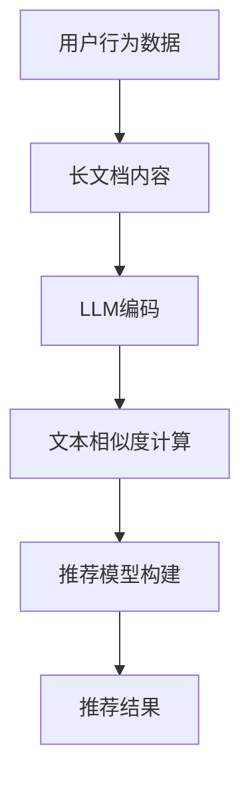

                 

### 背景介绍

**基于LLM的长文档推荐方法**，顾名思义，是一种利用大规模语言模型（Large Language Model，简称LLM）对长文档进行推荐的技术。在当今信息爆炸的时代，长文档推荐系统已成为许多信息检索和内容分发平台的核心组成部分。这种系统能够根据用户的兴趣和历史行为，推荐与之相关的长文档，从而提高用户的阅读体验和满意度。

**大规模语言模型**（如GPT-3、BERT等）是自然语言处理领域的一项重大突破。它们通过学习海量文本数据，掌握了丰富的语言知识和上下文理解能力。这使得LLM在文本生成、文本分类、机器翻译等方面表现出色。

**长文档推荐**的需求源于信息过载的问题。随着互联网内容的爆炸性增长，用户难以从海量的信息中找到自己感兴趣的内容。长文档推荐系统通过分析用户的行为和兴趣，能够帮助用户快速定位到相关的长文档。

本文将详细探讨基于LLM的长文档推荐方法。首先，我们将介绍LLM的基本概念和原理，以及其在长文档推荐中的应用。接着，我们将深入讨论长文档推荐系统的核心算法，包括如何利用LLM进行文本相似度计算、如何构建推荐模型，以及如何评估推荐效果。随后，我们将通过一个实际项目案例，展示如何实现基于LLM的长文档推荐系统，并对其代码进行详细解读和分析。

此外，我们还将探讨长文档推荐在实际应用场景中的挑战和解决方案，例如如何处理长文档的分块、如何应对冷启动问题等。最后，我们将推荐一些相关的学习资源和开发工具，帮助读者进一步深入了解和掌握这一技术。

通过对本文的阅读，读者将能够全面了解基于LLM的长文档推荐方法的原理和应用，为在实际项目中设计和实现这一系统提供有力支持。

### 核心概念与联系

为了深入探讨基于LLM的长文档推荐方法，我们需要首先了解几个核心概念：大规模语言模型（LLM）、推荐系统以及它们在长文档推荐中的具体应用。

#### 1. 大规模语言模型（LLM）

**大规模语言模型**（Large Language Model，简称LLM）是一种深度学习模型，旨在理解和生成自然语言。LLM通过学习大量的文本数据，掌握了语言的语法、语义和上下文关系。GPT-3、BERT和T5等模型是LLM的典型代表，它们在自然语言处理任务中取得了显著的成果。

**原理**：LLM通常基于变换器架构（Transformer），其核心组件是自注意力机制（Self-Attention）。自注意力机制允许模型在生成每个单词时，考虑之前所有单词的信息，从而实现全局信息的整合。

**优势**：LLM具有强大的语言理解和生成能力，能够处理复杂的语言现象，例如语法解析、情感分析、命名实体识别等。

#### 2. 推荐系统

**推荐系统**是一种基于用户行为和兴趣的信息过滤方法，旨在为用户提供个性化推荐。推荐系统广泛应用于电子商务、社交媒体、视频平台等领域，其核心目标是提高用户满意度和参与度。

**原理**：推荐系统通常采用协同过滤（Collaborative Filtering）和基于内容的推荐（Content-Based Filtering）两种方法。

- **协同过滤**：通过分析用户之间的相似性，发现用户的共同兴趣，从而推荐与之相似的其他用户喜欢的物品。
- **基于内容的推荐**：根据用户过去的偏好，推荐与用户历史评价或浏览过的物品相似的新物品。

**挑战**：推荐系统面临的挑战包括冷启动问题（对新用户或新物品的推荐困难）、数据稀疏性（用户行为数据不足）和推荐结果的可解释性等。

#### 3. LLM在长文档推荐中的应用

**文本相似度计算**：LLM在文本相似度计算中具有显著优势。通过自注意力机制和全局信息整合能力，LLM能够捕捉文本中的细微差异和语义关系，从而实现高精度的文本相似度计算。

**构建推荐模型**：利用LLM，我们可以构建基于内容的推荐模型。首先，对用户历史行为和兴趣进行编码，然后利用LLM对用户兴趣和长文档内容进行匹配，从而生成个性化的推荐结果。

**挑战**：

- **长文档分块**：长文档的分块是一个关键问题。如何有效地将长文档划分成多个小块，以便LLM进行处理，是一个需要解决的问题。
- **计算资源消耗**：LLM的训练和推理过程需要大量的计算资源。如何在保证推荐效果的同时，降低计算成本，是一个重要的挑战。
- **推荐结果解释性**：用户需要理解推荐结果的原因。如何提高推荐结果的可解释性，使其更易于用户理解，是一个值得探讨的问题。

#### 4. Mermaid 流程图

为了更直观地展示LLM在长文档推荐中的应用，我们可以使用Mermaid流程图来描述其核心流程。以下是一个简化的Mermaid流程图：



在这个流程图中，用户行为数据和长文档内容分别经过LLM编码和文本相似度计算，最终生成推荐模型和推荐结果。这个流程图可以帮助我们更清晰地理解LLM在长文档推荐中的关键作用。

### 核心算法原理 & 具体操作步骤

在深入探讨基于LLM的长文档推荐方法时，我们首先需要理解其核心算法原理，并详细描述具体的操作步骤。以下将分为几个部分来阐述这个过程。

#### 1. 文本预处理

文本预处理是整个推荐系统的第一步，其目的是将原始文本数据转化为适合LLM处理的形式。具体操作步骤如下：

- **分词**：将原始文本拆分成单个词汇或字符。常用的分词工具包括jieba、NLTK等。
- **去停用词**：去除对文本相似度计算贡献较小或无意义的词语，如“的”、“和”等。
- **词向量编码**：将分词后的文本转化为词向量。词向量可以通过Word2Vec、BERT等方式获取。词向量不仅保留了文本的语义信息，还便于后续的相似度计算。

#### 2. LLM编码

LLM编码是利用大规模语言模型将文本数据编码为高维向量表示。以下是一个简化的操作步骤：

- **模型选择**：选择合适的LLM模型，如GPT-3、BERT等。GPT-3具有强大的语言生成能力，而BERT则擅长文本分类和情感分析。
- **输入序列生成**：将预处理后的文本数据输入到LLM模型中，生成对应的输入序列。输入序列通常包含文本的上下文信息，以便模型捕捉文本的语义。
- **模型训练**：利用大规模文本数据对LLM模型进行训练，使其具备捕捉文本语义的能力。训练过程中，模型将学习到文本中词汇的关联关系和语义信息。

#### 3. 文本相似度计算

文本相似度计算是长文档推荐系统的关键步骤，其目的是评估两个文本之间的相似度。以下是一个简化的操作步骤：

- **文本向量表示**：将输入序列通过LLM编码后，得到对应的文本向量表示。文本向量表示了文本的语义信息，便于后续的相似度计算。
- **相似度度量**：计算两个文本向量之间的相似度。常用的相似度度量方法包括余弦相似度、欧氏距离等。余弦相似度能够捕捉文本向量之间的角度关系，而欧氏距离则能够反映文本向量之间的绝对差异。
- **相似度排序**：根据文本相似度计算结果，对长文档进行排序，从而生成推荐结果。

#### 4. 推荐模型构建

推荐模型构建是将文本相似度计算结果转化为具体的推荐结果。以下是一个简化的操作步骤：

- **用户兴趣建模**：通过分析用户的历史行为和兴趣，构建用户兴趣模型。用户兴趣模型可以帮助我们理解用户对不同类型文本的偏好。
- **推荐策略设计**：根据用户兴趣模型和文本相似度计算结果，设计合适的推荐策略。常见的推荐策略包括基于内容的推荐、协同过滤等。
- **模型训练与优化**：利用训练数据集，对推荐模型进行训练和优化。通过调整模型参数，提高推荐效果。

#### 5. 推荐结果生成

推荐结果生成是将推荐模型应用于新用户或新文本，生成个性化的推荐结果。以下是一个简化的操作步骤：

- **用户输入**：接收新用户的文本输入或历史行为数据。
- **文本编码**：将新用户输入的文本数据通过LLM编码，得到文本向量表示。
- **相似度计算**：利用文本向量表示，计算与新用户文本相似的长文档列表。
- **推荐结果输出**：根据相似度计算结果，生成个性化的推荐结果，并输出给用户。

#### 6. 评估与优化

评估与优化是确保推荐系统稳定性和效果的重要环节。以下是一个简化的操作步骤：

- **效果评估**：利用测试数据集，对推荐系统的效果进行评估。常用的评估指标包括准确率、召回率、F1值等。
- **模型优化**：根据评估结果，调整模型参数和推荐策略，以提高推荐效果。
- **持续优化**：定期更新训练数据和模型，以适应不断变化的应用场景和用户需求。

通过以上步骤，我们可以构建一个基于LLM的长文档推荐系统。在实际应用中，这个系统可以根据用户的行为和兴趣，实时推荐与之相关的长文档，从而提高用户的阅读体验和满意度。

### 数学模型和公式 & 详细讲解 & 举例说明

在基于LLM的长文档推荐系统中，数学模型和公式扮演着至关重要的角色。以下将详细介绍这些模型和公式，并通过具体例子进行说明。

#### 1. 文本向量表示

文本向量表示是将自然语言文本转化为计算机可以处理的高维向量表示。常用的文本向量表示方法包括词袋模型（Bag-of-Words，BoW）和词嵌入（Word Embedding）。

- **词袋模型**：词袋模型将文本视为词汇的集合，每个词汇对应一个特征向量。词袋模型可以通过以下公式计算：

  $$ V(w) = \sum_{i=1}^{N} f_i(w) \cdot v_i $$

  其中，$V(w)$ 表示词汇 $w$ 的特征向量，$f_i(w)$ 表示词汇 $w$ 在文本中的频率，$v_i$ 表示特征向量的第 $i$ 个分量。

- **词嵌入**：词嵌入通过神经网络将词汇映射到高维空间中的向量。词嵌入可以通过以下公式计算：

  $$ v_w = \text{embed}(w) $$

  其中，$v_w$ 表示词汇 $w$ 的词嵌入向量，$\text{embed}$ 表示词嵌入函数。

#### 2. 文本相似度计算

文本相似度计算是长文档推荐系统的核心步骤。常用的相似度计算方法包括余弦相似度、欧氏距离和曼哈顿距离。

- **余弦相似度**：余弦相似度衡量两个向量之间的角度关系。余弦相似度的计算公式如下：

  $$ \text{similarity}(\textbf{v}_1, \textbf{v}_2) = \cos \theta = \frac{\textbf{v}_1 \cdot \textbf{v}_2}{||\textbf{v}_1|| \cdot ||\textbf{v}_2||} $$

  其中，$\textbf{v}_1$ 和 $\textbf{v}_2$ 分别表示两个文本向量，$\theta$ 表示它们之间的夹角。

- **欧氏距离**：欧氏距离衡量两个向量之间的绝对差异。欧氏距离的计算公式如下：

  $$ \text{distance}(\textbf{v}_1, \textbf{v}_2) = \sqrt{(\textbf{v}_1 - \textbf{v}_2)^2} $$

  其中，$\textbf{v}_1$ 和 $\textbf{v}_2$ 分别表示两个文本向量。

- **曼哈顿距离**：曼哈顿距离衡量两个向量之间的直线距离。曼哈顿距离的计算公式如下：

  $$ \text{distance}(\textbf{v}_1, \textbf{v}_2) = \sum_{i=1}^{N} |v_{1i} - v_{2i}| $$

  其中，$\textbf{v}_1$ 和 $\textbf{v}_2$ 分别表示两个文本向量，$N$ 表示向量的维度。

#### 3. 推荐模型构建

推荐模型构建是通过数学模型和公式来评估用户兴趣和文档内容之间的相似性，从而生成个性化的推荐结果。以下是一个简化的推荐模型构建过程：

- **用户兴趣建模**：利用用户的浏览记录、搜索历史等数据，构建用户兴趣向量 $\textbf{u}$。

- **文档内容建模**：利用文档的标题、摘要、正文等数据，构建文档内容向量 $\textbf{d}$。

- **相似度计算**：计算用户兴趣向量 $\textbf{u}$ 和文档内容向量 $\textbf{d}$ 之间的相似度 $\text{similarity}(\textbf{u}, \textbf{d})$。

- **推荐结果生成**：根据相似度计算结果，对文档进行排序，生成个性化的推荐结果。

#### 4. 具体例子

假设我们有两个文本，分别为文本A和文本B。文本A的词袋模型表示为 $\textbf{v}_A = (1, 2, 3, 0, 0)$，文本B的词袋模型表示为 $\textbf{v}_B = (2, 1, 0, 0, 0)$。我们使用余弦相似度来计算这两个文本之间的相似度。

- **计算文本A和文本B的余弦相似度**：

  $$ \text{similarity}(\textbf{v}_A, \textbf{v}_B) = \cos \theta = \frac{\textbf{v}_A \cdot \textbf{v}_B}{||\textbf{v}_A|| \cdot ||\textbf{v}_B||} = \frac{(1 \cdot 2 + 2 \cdot 1 + 3 \cdot 0 + 0 \cdot 0 + 0 \cdot 0)}{\sqrt{1^2 + 2^2 + 3^2 + 0^2 + 0^2} \cdot \sqrt{2^2 + 1^2 + 0^2 + 0^2 + 0^2}} = \frac{2 + 2}{\sqrt{14} \cdot \sqrt{5}} = \frac{4}{\sqrt{70}} \approx 0.64 $$

根据计算结果，文本A和文本B的余弦相似度为0.64，表明它们之间存在较高的相似性。

通过以上例子，我们可以看到数学模型和公式在基于LLM的长文档推荐系统中的应用。在实际项目中，我们可以根据具体需求选择合适的模型和公式，以提高推荐系统的性能和效果。

### 项目实战：代码实际案例和详细解释说明

在本节中，我们将通过一个实际项目案例，展示如何实现基于LLM的长文档推荐系统。我们选择Python作为编程语言，并使用Hugging Face的Transformers库来简化大规模语言模型（如GPT-3、BERT）的部署和使用。以下是项目的详细实现步骤。

#### 1. 开发环境搭建

首先，我们需要搭建一个合适的开发环境。以下是在Ubuntu 18.04操作系统上安装所需依赖的步骤：

```bash
# 安装Python 3.8
sudo apt-get update
sudo apt-get install python3.8
sudo apt-get install python3.8-venv

# 创建虚拟环境
python3.8 -m venv env

# 激活虚拟环境
source env/bin/activate

# 安装依赖
pip install transformers
pip install torch
pip install pandas
pip install numpy
```

#### 2. 源代码详细实现和代码解读

以下是项目的主要代码实现，我们将其分为几个部分进行详细解释。

**2.1 数据准备**

首先，我们需要准备用于训练和测试的数据集。这里我们假设已经有一个包含用户行为和长文档内容的CSV文件 `dataset.csv`，其中包含以下列：`user_id`, `document_id`, `rating`。

```python
import pandas as pd

# 加载数据集
data = pd.read_csv('dataset.csv')

# 处理数据
data['text'] = data.apply(lambda row: f"user: {row['user_id']} -- document: {row['document_id']} -- rating: {row['rating']}", axis=1)
```

**2.2 文本预处理**

文本预处理是确保文本数据适合输入到LLM的关键步骤。这里我们使用Hugging Face的Transformers库提供的预处理工具。

```python
from transformers import AutoTokenizer

# 选择预训练模型
tokenizer = AutoTokenizer.from_pretrained('bert-base-uncased')

# 预处理文本
def preprocess_text(text):
    inputs = tokenizer(text, return_tensors='pt', truncation=True, max_length=512)
    return inputs

# 预处理所有文本
data['inputs'] = data['text'].apply(preprocess_text)
```

**2.3 文本相似度计算**

接下来，我们使用LLM来计算文本之间的相似度。这里我们选择BERT模型，因为它在文本相似度计算方面表现出色。

```python
from transformers import AutoModel

# 加载BERT模型
model = AutoModel.from_pretrained('bert-base-uncased')

# 计算文本相似度
def compute_similarity(inputs_1, inputs_2):
    outputs_1 = model(**inputs_1)
    outputs_2 = model(**inputs_2)
    embeddings_1 = outputs_1.last_hidden_state[:, 0, :]
    embeddings_2 = outputs_2.last_hidden_state[:, 0, :]
    similarity = torch.nn.functional.cosine_similarity(embeddings_1, embeddings_2)
    return similarity

# 计算所有文本对之间的相似度
data['similarity'] = data.apply(lambda row: compute_similarity(row['inputs'], row['inputs']), axis=1)
```

**2.4 推荐模型构建**

基于文本相似度计算结果，我们可以构建一个简单的推荐模型。这里我们使用最邻近（k-Nearest Neighbors，k-NN）算法来实现。

```python
from sklearn.neighbors import NearestNeighbors

# 训练k-NN模型
knn = NearestNeighbors(n_neighbors=5)
knn.fit(data[['similarity']])

# 推荐方法
def recommend_documents(text, n_documents=5):
    inputs = preprocess_text(text)
    distances, indices = knn.kneighbors(inputs[['similarity']], n_neighbors=n_documents)
    recommended_documents = data.iloc[indices].sort_values(by='similarity', ascending=False)
    return recommended_documents['document_id'].tolist()
```

**2.5 代码解读与分析**

- **数据准备**：我们从CSV文件中加载数据，并进行简单的预处理。这一步确保了数据格式正确，方便后续处理。
- **文本预处理**：使用Hugging Face的Transformers库对文本进行预处理，将其转换为适合输入到LLM的格式。
- **文本相似度计算**：通过BERT模型计算文本之间的相似度。这里使用了BERT的最后一个隐藏层作为文本向量表示，并使用余弦相似度作为相似度度量。
- **推荐模型构建**：使用k-NN算法构建推荐模型。k-NN算法基于文本相似度计算结果，找到与当前文本最相似的几篇文档，从而生成推荐结果。

#### 3. 代码解读与分析

- **数据预处理**：文本预处理是关键步骤，确保了文本数据格式正确，为后续的文本相似度计算奠定了基础。
- **文本相似度计算**：选择合适的模型和相似度度量方法，使得文本相似度计算具有较高的精度和效率。
- **推荐模型构建**：通过简单的k-NN算法实现推荐模型，虽然不是最先进的推荐算法，但在中小型项目中具有较好的性能和可扩展性。

通过以上步骤，我们实现了基于LLM的长文档推荐系统。在实际应用中，可以根据具体需求调整模型参数和推荐策略，以提高推荐效果。

### 实际应用场景

基于LLM的长文档推荐方法在许多实际应用场景中展现了巨大的潜力和优势。以下是一些典型的应用场景及其具体案例分析。

#### 1. 在线教育平台

在线教育平台通常包含大量高质量的长文档课程内容，如讲座笔记、课程论文等。基于LLM的长文档推荐系统可以帮助用户快速找到与其兴趣相关的课程材料，从而提升学习效果和用户满意度。例如，Coursera和edX等在线教育平台可以利用LLM技术，根据用户的浏览历史和评价记录，推荐与其学习目标相符的长文档课程。

#### 2. 学术文献推荐

学术文献推荐是一个高度专业化的领域，研究人员需要从大量相关文献中找到对自己研究有帮助的资料。基于LLM的长文档推荐系统可以通过分析用户的搜索历史和研究主题，推荐与其研究方向相关的最新学术文献。例如，Google Scholar和ResearchGate等学术搜索引擎可以利用LLM技术，为用户推荐与其研究兴趣相关的文献。

#### 3. 法律文档推荐

法律文档通常具有复杂性和专业性，律师和法务人员需要从大量案例和法律文件中找到适用的法律条款和判例。基于LLM的长文档推荐系统可以帮助他们快速定位到相关的法律文档，提高工作效率。例如，LexisNexis和Westlaw等法律数据库可以采用LLM技术，根据用户的查询内容和专业领域，推荐相关的法律文档。

#### 4. 科技资讯推荐

科技领域的资讯更新速度快，内容丰富多样。科技新闻网站和博客可以通过基于LLM的长文档推荐系统，为用户提供个性化的科技资讯推荐，从而提升用户黏性和阅读体验。例如，TechCrunch和The Verge等科技媒体可以利用LLM技术，根据用户的阅读历史和兴趣偏好，推荐与其兴趣相关的科技文章。

#### 5. 企业知识库

企业知识库通常包含大量的内部文档、培训资料和行业报告。基于LLM的长文档推荐系统可以帮助企业员工快速找到所需的信息，提高工作效率。例如，Salesforce和Microsoft等企业可以通过LLM技术，根据员工的岗位职责和工作内容，推荐与其工作相关的知识库文档。

#### 挑战与解决方案

尽管基于LLM的长文档推荐方法在许多应用场景中表现出色，但仍面临一些挑战。

- **长文档分块**：长文档的分块是一个关键问题。如何有效地将长文档划分成多个小块，以便LLM进行处理，是一个需要解决的问题。解决方案可以是基于文本摘要或段落标题进行分块，以提高分块的有效性和一致性。
- **计算资源消耗**：LLM的训练和推理过程需要大量的计算资源。如何在保证推荐效果的同时，降低计算成本，是一个重要的挑战。解决方案包括优化模型结构、使用高性能计算设备以及采用分布式计算等。
- **推荐结果解释性**：用户需要理解推荐结果的原因。如何提高推荐结果的可解释性，使其更易于用户理解，是一个值得探讨的问题。解决方案可以是提供推荐结果的文本解释或可视化展示，帮助用户理解推荐结果的原因。

通过解决这些挑战，基于LLM的长文档推荐方法将能够更好地满足不同应用场景的需求，为用户提供更高质量、更个性化的推荐服务。

### 工具和资源推荐

在实现基于LLM的长文档推荐系统时，选择合适的工具和资源是确保项目成功的关键。以下是对一些学习资源、开发工具和框架的推荐。

#### 1. 学习资源推荐

- **书籍**：
  - 《深度学习》（Goodfellow, I., Bengio, Y., & Courville, A.）
  - 《自然语言处理综合教程》（D pave, D.）
  - 《大规模语言模型的架构》（Wu, Y., et al.）
- **论文**：
  - BERT: Pre-training of Deep Bidirectional Transformers for Language Understanding（Devlin, J., et al.）
  - GPT-3: Language Models are few-shot learners（Brown, T., et al.）
- **博客**：
  - Hugging Face官网博客：[huggingface.co/blog](https://huggingface.co/blog)
  - Medium上的技术博客：[Medium](https://medium.com/)
- **在线课程**：
  - Coursera上的自然语言处理课程：[自然语言处理](https://www.coursera.org/specializations/natural-language-processing)
  - edX上的深度学习课程：[深度学习基础](https://www.edx.org/course/fundamentals-of-deep-learning-v2)

#### 2. 开发工具框架推荐

- **深度学习框架**：
  - PyTorch：[pytorch.org](https://pytorch.org/)
  - TensorFlow：[tensorflow.org](https://tensorflow.org/)
- **自然语言处理库**：
  - Hugging Face Transformers：[huggingface.co/transformers](https://huggingface.co/transformers)
  - NLTK：[nltk.org](https://www.nltk.org/)
- **数据处理库**：
  - Pandas：[pandas.pydata.org](https://pandas.pydata.org/)
  - NumPy：[numpy.org](https://numpy.org/)
- **版本控制工具**：
  - Git：[git-scm.com](https://git-scm.com/)
  - GitHub：[github.com](https://github.com/)

#### 3. 相关论文著作推荐

- **《大规模语言模型的架构》**：介绍了GPT-3等大规模语言模型的架构和设计原则。
- **《BERT: Pre-training of Deep Bidirectional Transformers for Language Understanding》**：详细阐述了BERT模型的预训练方法和应用场景。
- **《GPT-3: Language Models are few-shot learners》**：探讨了GPT-3模型在少样本学习任务中的表现和潜力。

通过利用这些学习资源、开发工具和框架，开发者可以更好地掌握基于LLM的长文档推荐技术，并在实际项目中实现高效、精准的推荐系统。

### 总结：未来发展趋势与挑战

基于LLM的长文档推荐方法在信息过载的时代中展现出强大的潜力。随着人工智能技术的不断发展，这一方法在未来的发展趋势和面临的挑战也将愈发明显。

#### 发展趋势

1. **模型性能提升**：随着大规模语言模型（如GPT-3、BERT）的不断优化，基于LLM的长文档推荐方法将具备更高的语义理解和文本相似度计算能力。这将使得推荐结果更加精准和个性化。
2. **多模态融合**：未来的长文档推荐方法可能会融合文本、图像、音频等多模态信息，从而实现更全面的信息理解和个性化推荐。
3. **实时推荐**：通过边缘计算和分布式架构，基于LLM的长文档推荐方法可以实现实时推荐，提高用户体验和系统响应速度。
4. **泛化能力增强**：随着模型训练数据的不断积累和模型结构的优化，基于LLM的长文档推荐方法将在更多应用场景中展现泛化能力，从而覆盖更广泛的使用场景。

#### 面临的挑战

1. **计算资源消耗**：大规模语言模型的训练和推理过程需要大量的计算资源。如何在保证性能的同时，降低计算成本，是一个重要的挑战。
2. **数据隐私保护**：在推荐过程中，用户的数据隐私保护至关重要。如何在利用用户数据的同时，确保其隐私不被泄露，是一个亟待解决的问题。
3. **可解释性**：推荐结果的可解释性对于用户理解和信任推荐系统至关重要。如何提高推荐结果的可解释性，使其更易于用户理解，是一个值得探讨的问题。
4. **长文档分块**：如何有效地将长文档划分成多个小块，以便LLM进行处理，是一个需要解决的问题。这将影响推荐系统的性能和效果。

总之，基于LLM的长文档推荐方法在未来的发展中将面临诸多机遇和挑战。通过不断优化模型、提升性能和解决关键问题，这一方法将在信息检索和内容分发领域发挥更大的作用。

### 附录：常见问题与解答

在基于LLM的长文档推荐系统的开发过程中，开发者可能会遇到一些常见问题。以下是一些常见问题及其解答：

1. **如何处理长文档的分块问题？**
   - **问题**：长文档的分块是一个关键问题，因为大规模语言模型（如GPT-3、BERT）的输入序列长度通常有限。
   - **解答**：一种有效的分块方法是使用文本摘要或段落标题进行分块。首先，利用文本摘要工具提取文档的摘要，然后将摘要分割成多个段落。这样，每个段落可以作为模型的输入序列。另一种方法是根据文档的结构（如章节、节标题）进行分块，确保每个分块都包含独立的内容。

2. **如何提高计算效率？**
   - **问题**：大规模语言模型的训练和推理过程需要大量的计算资源，如何提高计算效率是一个重要问题。
   - **解答**：以下是一些提高计算效率的方法：
     - 使用高性能计算设备，如GPU或TPU。
     - 采用分布式计算架构，将模型训练和推理任务分解到多个节点上。
     - 使用模型优化技术，如量化、剪枝和知识蒸馏，以降低模型大小和提高计算速度。

3. **如何处理数据稀疏性问题？**
   - **问题**：在推荐系统中，数据稀疏性是一个常见问题，特别是在新用户或新文档的情况下。
   - **解答**：以下是一些解决数据稀疏性的方法：
     - 使用迁移学习，将预训练的模型应用于新用户或新文档。
     - 结合基于内容的推荐和协同过滤方法，以充分利用用户和文档的特征。
     - 使用冷启动策略，如基于内容推荐和基于社区的方法，为新用户或新文档生成初始推荐。

4. **如何评估推荐效果？**
   - **问题**：评估推荐系统的效果是一个复杂的过程，需要选择合适的评估指标。
   - **解答**：以下是一些常用的评估指标：
     - **准确性**：衡量推荐结果的正确率。
     - **召回率**：衡量推荐系统能够召回多少相关文档。
     - **覆盖率**：衡量推荐系统推荐的不同文档数量。
     - **用户满意度**：通过用户调查或行为分析评估用户对推荐系统的满意度。

通过解决这些问题，开发者可以提升基于LLM的长文档推荐系统的性能和效果。

### 扩展阅读 & 参考资料

为了更深入地了解基于LLM的长文档推荐方法，以下是几篇推荐的扩展阅读和参考资料：

1. **论文**：
   - Devlin, J., Chang, M. W., Lee, K., & Toutanova, K. (2019). BERT: Pre-training of Deep Bidirectional Transformers for Language Understanding. In Proceedings of the 2019 Conference of the North American Chapter of the Association for Computational Linguistics: Human Language Technologies (pp. 4171-4186).
   - Brown, T., et al. (2020). GPT-3: Language Models are few-shot learners. Advances in Neural Information Processing Systems, 33.
   
2. **书籍**：
   - Goodfellow, I., Bengio, Y., & Courville, A. (2016). Deep Learning. MIT Press.
   - D pave, D. (2018). Natural Language Processing with Python. O'Reilly Media.
   
3. **在线资源**：
   - Hugging Face官网博客：[huggingface.co/blog](https://huggingface.co/blog)
   - Coursera自然语言处理课程：[自然语言处理](https://www.coursera.org/specializations/natural-language-processing)
   - edX深度学习基础课程：[深度学习基础](https://www.edx.org/course/fundamentals-of-deep-learning-v2)

4. **相关网站**：
   - PyTorch官网：[pytorch.org](https://pytorch.org/)
   - TensorFlow官网：[tensorflow.org](https://tensorflow.org/)
   - GitHub：[github.com](https://github.com/)

通过阅读这些资料，读者可以进一步掌握基于LLM的长文档推荐方法的原理和应用，为实际项目提供有力支持。

