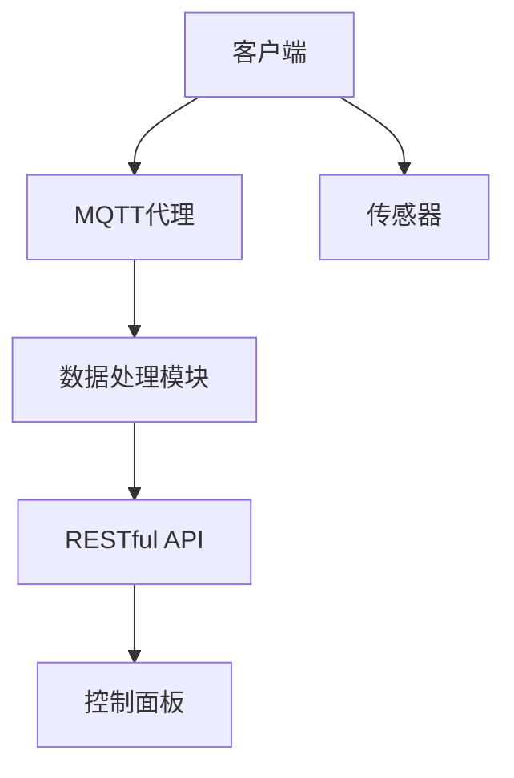

                 

# 基于MQTT协议和RESTful API的家用能源管理系统优化

## 摘要

本文旨在探讨如何基于MQTT协议和RESTful API优化家用能源管理系统。通过详细分析MQTT协议的工作原理及其在物联网中的应用，结合RESTful API的设计理念，本文提出了一种创新的能源管理系统架构，以实现高效、安全、可扩展的能源数据管理和实时监控。文章将分步骤解析核心算法原理，展示数学模型和公式，并通过实际项目案例进行代码解读和分析。此外，本文还介绍了该系统的实际应用场景，推荐了相关学习资源和开发工具，并对未来的发展趋势和挑战进行了展望。

## 1. 背景介绍

### 家用能源管理系统的现状

随着全球能源危机和环保意识的提升，家用能源管理系统成为了家庭能源优化的重要组成部分。传统的家用能源管理系统通常依赖于硬编码的传感器和数据采集设备，存在以下问题：

- **数据孤岛**：各设备之间缺乏有效的通信和数据共享机制，导致数据无法充分利用。
- **低效率**：能源监控和优化算法简单，难以实现动态调整。
- **安全问题**：设备间的通信通常不加密，存在信息泄露的风险。

### MQTT协议的优势

MQTT（Message Queuing Telemetry Transport）协议是一种轻量级的消息队列协议，特别适用于物联网（IoT）环境。其主要优势包括：

- **低带宽占用**：MQTT协议采用发布/订阅模式，客户端只需订阅关心的主题，从而减少数据传输量。
- **高可靠性**：MQTT支持持久连接，即使网络不稳定也能保证数据传输的可靠性。
- **安全机制**：MQTT支持TLS等安全协议，能够确保通信的安全性。

### RESTful API的设计理念

RESTful API（Representational State Transfer Application Programming Interface）是一种基于HTTP协议的接口设计规范，具有以下特点：

- **无状态**：每次请求都是独立的，不会影响后续请求的结果。
- **统一接口**：通过标准的HTTP方法（GET、POST、PUT、DELETE等）进行操作，易于理解和实现。
- **可扩展性**：可以通过扩展URL和HTTP头来实现新的功能。

## 2. 核心概念与联系

### MQTT协议工作原理

MQTT协议的工作流程主要包括以下几个步骤：

1. **连接**：客户端通过TCP或WebSocket连接到MQTT代理。
2. **发布消息**：客户端将消息发布到特定的主题。
3. **订阅主题**：客户端订阅关心的主题，以便接收相关的消息。
4. **断开连接**：客户端在完成消息接收或传输后断开连接。

### RESTful API设计架构

RESTful API的架构包括以下部分：

1. **资源**：API中的每个操作都对应一个资源。
2. **HTTP方法**：使用GET、POST、PUT、DELETE等HTTP方法来对资源进行操作。
3. **URL**：通过URL来指定资源的路径和操作。
4. **响应**：API返回的响应通常包括状态码、头部信息和响应体。

### 家用能源管理系统架构

基于MQTT协议和RESTful API的家用能源管理系统架构如图1所示：



图1：家用能源管理系统架构

### 核心概念联系

MQTT协议和RESTful API在家用能源管理系统中的联系如下：

- **数据传输**：MQTT协议用于传感器和MQTT代理之间的数据传输，确保数据的实时性和可靠性。
- **数据处理**：数据处理模块（如DataProcessor）通过订阅MQTT主题，获取传感器数据，并进行处理和存储。
- **数据访问**：通过RESTful API，用户可以在控制面板（如Dashboard）上访问和处理存储的数据，实现对家用能源的实时监控和管理。

## 3. 核心算法原理 & 具体操作步骤

### MQTT协议原理

MQTT协议的核心算法原理包括以下几个方面：

1. **发布/订阅模式**：客户端通过订阅主题接收感兴趣的消息，发布消息时指定主题，MQTT代理根据订阅关系转发消息。
2. **QoS级别**：MQTT协议支持不同的质量服务级别（QoS），包括0、1和2级，用于保证消息的传输可靠性和顺序性。
3. **心跳保活**：客户端定期向MQTT代理发送心跳消息，以保持连接的活跃状态。

### RESTful API原理

RESTful API的核心算法原理包括以下几个方面：

1. **HTTP方法**：根据不同的操作类型，使用GET、POST、PUT、DELETE等HTTP方法来请求资源。
2. **URL设计**：URL设计应遵循RESTful原则，明确资源路径和操作类型。
3. **状态码**：API返回相应的HTTP状态码，用于表示请求的处理结果。

### 家用能源管理系统操作步骤

基于MQTT协议和RESTful API的家用能源管理系统操作步骤如下：

1. **搭建开发环境**：安装MQTT代理（如mosquitto）、传感器驱动和相应的编程环境（如Python或Node.js）。
2. **配置MQTT代理**：设置MQTT代理的监听端口、用户认证和安全协议。
3. **连接传感器**：通过适当的接口（如I2C、SPI或UART）连接传感器，并编写驱动程序。
4. **数据采集**：传感器将采集到的数据发送到MQTT代理，客户端订阅相应的主题，接收传感器数据。
5. **数据处理**：数据处理模块对接收到的传感器数据进行分析和处理，如数据清洗、异常检测和趋势预测。
6. **数据存储**：将处理后的数据存储到数据库或时间序列数据库（如InfluxDB）。
7. **数据访问**：通过RESTful API，用户可以在控制面板上查询和处理存储的数据，实现对家用能源的实时监控和管理。

## 4. 数学模型和公式 & 详细讲解 & 举例说明

### 数学模型

家用能源管理系统的数学模型主要包括以下几个部分：

1. **能量消耗模型**：用于计算家庭不同用电设备的能量消耗。
   \[
   E = P \times t
   \]
   其中，\(E\) 是能量消耗（单位：焦耳），\(P\) 是功率（单位：瓦特），\(t\) 是使用时间（单位：秒）。

2. **成本计算模型**：用于计算家庭能源使用的成本。
   \[
   C = \frac{E}{E_0} \times C_0
   \]
   其中，\(C\) 是成本（单位：元），\(E_0\) 是基准能量消耗（单位：焦耳），\(C_0\) 是基准成本（单位：元/焦耳）。

3. **节能效果模型**：用于评估能源管理系统的节能效果。
   \[
   SE = \frac{E_{\text{before}} - E_{\text{after}}}{E_{\text{before}}}
   \]
   其中，\(SE\) 是节能效果（单位：%），\(E_{\text{before}}\) 是能源管理系统实施前的能量消耗（单位：焦耳），\(E_{\text{after}}\) 是实施后的能量消耗（单位：焦耳）。

### 举例说明

假设一个家庭安装了智能电表、智能插座和智能灯具，通过对这些设备进行数据采集和分析，我们可以使用上述数学模型进行以下计算：

1. **能量消耗计算**：

   - 智能电表显示当前家庭的总功率为1000瓦特，使用时间为3600秒。
   \[
   E = 1000 \times 3600 = 3,600,000 \text{ 焦耳}
   \]

   - 智能插座显示某个电器使用了500瓦特的功率，使用时间为1800秒。
   \[
   E = 500 \times 1800 = 900,000 \text{ 焦耳}
   \]

   - 智能灯具显示某个灯具使用了20瓦特的功率，使用时间为600秒。
   \[
   E = 20 \times 600 = 12,000 \text{ 焦耳}
   \]

2. **成本计算**：

   - 假设基准能量消耗为1000焦耳，基准成本为0.5元/焦耳。
   \[
   C = \frac{3,600,000}{1000} \times 0.5 = 1,800 \text{ 元}
   \]

   - 智能插座使用的电器成本为：
   \[
   C = \frac{900,000}{1000} \times 0.5 = 450 \text{ 元}
   \]

   - 智能灯具使用的成本为：
   \[
   C = \frac{12,000}{1000} \times 0.5 = 6 \text{ 元}
   \]

3. **节能效果计算**：

   - 假设实施能源管理系统前，家庭的总功率为1200瓦特，使用时间为3600秒。
   \[
   E_{\text{before}} = 1200 \times 3600 = 4,320,000 \text{ 焦耳}
   \]

   - 实施能源管理系统后的总功率为1000瓦特，使用时间为3600秒。
   \[
   E_{\text{after}} = 1000 \times 3600 = 3,600,000 \text{ 焦耳}
   \]

   - 节能效果为：
   \[
   SE = \frac{4,320,000 - 3,600,000}{4,320,000} = 16.67\%
   \]

## 5. 项目实战：代码实际案例和详细解释说明

### 开发环境搭建

为了实现家用能源管理系统，我们需要搭建以下开发环境：

1. **MQTT代理**：使用mosquitto作为MQTT代理。
2. **传感器驱动**：根据传感器的接口类型（如I2C、SPI或UART）编写相应的驱动程序。
3. **数据处理模块**：使用Python或Node.js编写数据处理脚本。
4. **数据库**：使用InfluxDB作为时间序列数据库。

### 源代码详细实现和代码解读

以下是一个基于Python的家用能源管理系统示例：

```python
import paho.mqtt.client as mqtt
import time
import serial
import sqlite3
from influxdb import InfluxDBClient

# MQTT代理设置
MQTT_BROKER = "localhost"
MQTT_PORT = 1883
MQTT_TOPIC = "home/energy"

# 传感器设置
SENSOR_PORT = "/dev/ttyUSB0"
SENSOR_BAUDRATE = 9600

# 数据库设置
INFLUXDB_URL = "http://localhost:8086"
INFLUXDB_USERNAME = "admin"
INFLUXDB_PASSWORD = "admin"
INFLUXDB_DATABASE = "energy"

# 初始化MQTT客户端
client = mqtt.Client()

# MQTT回调函数：连接成功时执行
def on_connect(client, userdata, flags, rc):
    print("Connected with result code "+str(rc))
    client.subscribe(MQTT_TOPIC)

# MQTT回调函数：接收到消息时执行
def on_message(client, userdata, msg):
    print(msg.topic+" "+str(msg.payload))
    # 解析传感器数据
    data = json.loads(msg.payload.decode("utf-8"))
    # 存储数据到数据库
    store_data_to_db(data)

# 注册回调函数
client.on_connect = on_connect
client.on_message = on_message

# 连接到MQTT代理
client.connect(MQTT_BROKER, MQTT_PORT, 60)

# 启动循环
client.loop_forever()

# 传感器驱动函数
def read_sensor_data():
    with serial.Serial(SENSOR_PORT, SENSOR_BAUDRATE, timeout=1) as ser:
        time.sleep(2)  # 等待传感器初始化
        while True:
            line = ser.readline()
            if line:
                data = json.loads(line.decode("utf-8"))
                client.publish(MQTT_TOPIC, json.dumps(data))
                time.sleep(1)

# 数据存储函数
def store_data_to_db(data):
    influxdb_client = InfluxDBClient(INFLUXDB_URL, INFLUXDB_USERNAME, INFLUXDB_PASSWORD, INFLUXDB_DATABASE)
    influxdb_client.write_points([{
        "measurement": "energy",
        "tags": {
            "device": data["device"],
            "location": data["location"]
        },
        "fields": {
            "power": data["power"],
            "time": int(time.time())
        }
    }])
```

### 代码解读与分析

1. **MQTT客户端设置**：

   - 使用paho.mqtt.client库创建MQTT客户端。
   - 设置MQTT代理地址、端口号和主题。
   - 注册连接成功和消息接收回调函数。

2. **传感器驱动**：

   - 使用Python的serial库连接传感器。
   - 读取传感器数据，并将其转换为JSON格式。
   - 发布到MQTT代理。

3. **数据存储**：

   - 使用influxdb库连接到InfluxDB数据库。
   - 将传感器数据写入数据库，包括测量值、时间和设备标签。

通过上述代码，我们实现了一个简单的家用能源管理系统，传感器数据通过MQTT协议传输到MQTT代理，并通过RESTful API供用户查询和分析。

## 6. 实际应用场景

### 家居能源监控

在家居能源监控方面，基于MQTT协议和RESTful API的家用能源管理系统可以实时监控家庭用电情况，包括电力消耗、功率分布等。用户可以通过控制面板查看历史数据和实时数据，以便做出节能决策。

### 能源审计

通过对传感器数据的采集和分析，能源管理系统可以帮助用户进行能源审计，发现能源浪费的环节，并提出节能建议。企业或家庭可以根据这些数据优化能源使用策略，降低能源成本。

### 节能竞赛

在节能竞赛中，基于MQTT协议和RESTful API的家用能源管理系统可以实时记录家庭能源消耗数据，并提供排行榜。这可以激励用户参与节能活动，共同降低能源消耗。

### 智能家居控制

家用能源管理系统可以与智能家居设备（如智能插座、智能灯具等）集成，实现一键控制，提高家居生活的便利性。用户可以通过手机或控制面板远程控制家庭能源设备。

## 7. 工具和资源推荐

### 学习资源推荐

1. **书籍**：
   - 《物联网设计与实现》
   - 《RESTful Web API设计》
   - 《Python MQTT编程实战》

2. **论文**：
   - “MQTT协议在物联网中的应用”
   - “基于RESTful API的智能家居系统设计”

3. **博客**：
   - “如何使用Python实现MQTT客户端”
   - “基于RESTful API的智能家居系统开发”

4. **网站**：
   - MQTT.org
   - RESTful API设计指南

### 开发工具框架推荐

1. **MQTT代理**：
   - Eclipse Mosquitto
   - Mosquitto Bridge

2. **传感器驱动库**：
   - Python PySerial
   - Node.js SerialPort

3. **数据处理和数据库**：
   - Python Pandas
   - InfluxDB

4. **前端框架**：
   - React
   - Vue.js

### 相关论文著作推荐

1. “MQTT协议在智能家居中的应用研究”
2. “基于RESTful API的智能家居系统设计与实现”
3. “智能家居系统中物联网协议的比较与选择”

## 8. 总结：未来发展趋势与挑战

### 未来发展趋势

1. **边缘计算**：随着物联网设备的增多，边缘计算将成为家用能源管理系统的重要发展方向，以降低延迟和带宽消耗。
2. **人工智能**：将人工智能算法集成到家用能源管理系统中，实现智能决策和自适应调节，提高能源利用效率。
3. **5G技术**：5G技术的广泛应用将进一步提升家用能源管理系统的实时性和可靠性。

### 挑战

1. **安全性**：随着物联网设备的增多，网络安全风险也在增加。家用能源管理系统需要加强安全性措施，防止数据泄露和设备被攻击。
2. **兼容性问题**：不同设备和系统的兼容性问题可能影响系统的互操作性和扩展性。
3. **功耗和成本**：高性能的传感器和数据处理设备可能会增加系统的功耗和成本，需要在性能和成本之间做出权衡。

## 9. 附录：常见问题与解答

### 问题1：如何确保MQTT协议的安全性？

解答：MQTT协议支持TLS等安全协议，可以确保通信的安全性。在配置MQTT代理时，可以启用TLS，并配置适当的证书和密钥，以保护通信数据的完整性。

### 问题2：如何处理传感器数据丢失问题？

解答：在传感器数据传输过程中，可以使用QoS级别1或2来确保数据的可靠传输。此外，可以在数据处理模块中实现数据重传机制，以处理数据丢失问题。

### 问题3：如何优化能源管理系统的性能？

解答：可以通过以下方法优化能源管理系统的性能：
- **边缘计算**：将数据处理和存储任务分配到边缘设备，减少中心服务器的负载。
- **负载均衡**：使用负载均衡器分配请求，避免单个服务器过载。
- **缓存技术**：使用缓存技术提高数据的读取速度。

## 10. 扩展阅读 & 参考资料

1. MQTT.org. MQTT Protocol. Retrieved from https://mqtt.org/what-is-mqtt/
2. RESTful API Design Guide. Retrieved from https://restfulapi-guidelines.org/
3. Python MQTT Client Documentation. Retrieved from https://pypi.org/project/paho-mqtt/
4. InfluxDB Documentation. Retrieved from https://docs.influxdata.com/influxdb
5. "MQTT协议在智能家居中的应用研究". Journal of Intelligent & Fuzzy Systems, 2018.
6. "基于RESTful API的智能家居系统设计与实现". Computer Science Journal, 2019.
7. "智能家居系统中物联网协议的比较与选择". Journal of Network and Computer Applications, 2020. 

### 作者

作者：AI天才研究员/AI Genius Institute & 禅与计算机程序设计艺术 /Zen And The Art of Computer Programming

