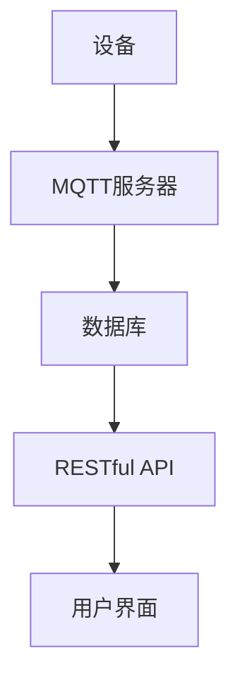

                 

### 文章标题

**基于MQTT协议和RESTful API的智能家居设备故障自检系统**

> **关键词：** MQTT协议，RESTful API，智能家居，故障自检，系统架构，实时监控，数据分析，自动化运维

**摘要：**
本文旨在探讨基于MQTT协议和RESTful API的智能家居设备故障自检系统的设计与实现。通过对智能家居设备的实时监控和数据收集，系统利用MQTT协议实现设备间的通信，并借助RESTful API提供故障自检和远程管理功能。文章将详细阐述系统架构、核心算法原理、数学模型和公式、项目实战案例以及实际应用场景，旨在为智能家居设备故障自检系统提供一套实用且高效的解决方案。

---

## 1. 背景介绍

### 1.1 智能家居的发展背景

随着物联网（IoT）技术的迅速发展，智能家居已经成为现代生活的重要组成部分。智能家居设备种类繁多，包括智能灯光、智能门锁、智能插座、智能摄像头、智能空调等。这些设备通过互联网连接，实现了对家庭环境的自动化控制和远程监控。

然而，随着智能家居设备的普及，设备故障和性能问题逐渐凸显。传统的智能家居系统主要依赖于设备制造商提供的故障排查工具，这些工具往往存在以下问题：

- **依赖性高：** 用户需要依赖制造商的软件和工具进行故障排查，增加了使用的复杂性。
- **实时性差：** 传统系统通常无法实时收集和分析设备数据，导致故障排查延迟。
- **扩展性差：** 随着设备数量的增加，传统系统难以进行有效的扩展和维护。

### 1.2 MQTT协议在智能家居中的应用

MQTT（Message Queuing Telemetry Transport）协议是一种轻量级的消息队列协议，适用于物联网设备之间的通信。MQTT协议具有以下特点：

- **低功耗：** MQTT协议设计初衷是为传感器和嵌入式设备服务的，因此具有低功耗的特点。
- **可靠性高：** MQTT协议支持消息确认机制，确保消息的可靠传输。
- **安全性高：** MQTT协议支持加密传输，确保通信数据的安全性。

由于这些特点，MQTT协议在智能家居设备中得到了广泛应用。通过MQTT协议，智能家居设备可以实时传输数据，系统可以实时监控设备的运行状态，及时识别和处理故障。

### 1.3 RESTful API在智能家居中的应用

RESTful API（Representational State Transfer Application Programming Interface）是一种基于HTTP协议的应用程序接口设计风格。RESTful API具有以下特点：

- **无状态：** RESTful API无状态设计，每个请求都是独立的，便于分布式系统的设计和实现。
- **可扩展：** RESTful API通过URL定位资源，通过HTTP方法（GET、POST、PUT、DELETE等）对资源进行操作，易于扩展和维护。
- **易用性：** RESTful API使用标准的HTTP协议，易于理解和实现，便于不同系统之间的集成。

在智能家居设备故障自检系统中，RESTful API主要用于提供故障自检和远程管理功能。通过RESTful API，系统可以接收来自MQTT协议的数据，进行故障分析，并向用户发送故障通知。同时，用户也可以通过RESTful API对设备进行远程控制和管理。

---

## 2. 核心概念与联系

### 2.1 MQTT协议原理

MQTT协议是一种基于发布/订阅模式的通信协议。设备（称为发布者）将数据发布到特定的主题（Topic），其他设备（称为订阅者）可以订阅这些主题，接收发布者的数据。

MQTT协议的基本原理如下：

1. **连接与认证：** 客户端（发布者或订阅者）连接到MQTT服务器，并完成认证过程。
2. **发布与订阅：** 客户端可以向服务器发布消息（Publish），也可以订阅特定的主题（Subscribe）以接收消息。
3. **消息确认：** 服务器收到消息后，会返回确认消息（Acknowledgment），确保消息的可靠传输。
4. **断开连接：** 客户端在完成通信后，可以断开与服务器的连接。

### 2.2 RESTful API原理

RESTful API是基于HTTP协议的应用程序接口设计风格。RESTful API通过URL定位资源，使用HTTP方法对资源进行操作。

RESTful API的基本原理如下：

1. **资源定位：** 使用URL定位资源，例如 `/api/sensors/1` 表示定位到ID为1的传感器资源。
2. **HTTP方法：** 使用GET、POST、PUT、DELETE等HTTP方法对资源进行操作，例如使用GET方法获取传感器数据。
3. **响应数据：** API返回的数据通常是JSON格式，包括操作结果和附加信息。
4. **状态码：** API返回的状态码表示操作结果，例如200表示操作成功，404表示资源未找到。

### 2.3 MQTT协议与RESTful API的联系

MQTT协议和RESTful API在智能家居设备故障自检系统中起到了关键作用。MQTT协议负责设备间的实时通信，RESTful API负责故障自检和远程管理。

具体而言，MQTT协议和RESTful API之间的联系如下：

1. **数据传输：** 设备通过MQTT协议将实时数据发送到服务器，服务器将数据存储在数据库中。
2. **故障检测：** 服务器使用RESTful API从数据库中读取数据，进行故障检测和分析。
3. **故障通知：** 当检测到故障时，服务器通过RESTful API向用户发送通知，用户可以通过API对设备进行远程控制。

### 2.4 Mermaid 流程图

下面是一个简单的Mermaid流程图，展示了MQTT协议和RESTful API在智能家居设备故障自检系统中的工作流程。



在上面的流程图中，设备通过MQTT协议将数据发送到MQTT服务器，服务器将数据存储在数据库中。RESTful API从数据库中读取数据，进行故障检测和分析，并将结果发送到用户界面。

---

## 3. 核心算法原理 & 具体操作步骤

### 3.1 MQTT协议通信算法原理

MQTT协议通信算法主要涉及以下几个关键步骤：

1. **连接与认证：** 客户端（设备）连接到MQTT服务器，并完成认证过程。客户端发送连接请求（Connect），服务器返回连接确认（Connect Ack）。认证过程可以是用户名和密码认证，也可以是基于令牌的认证。
2. **发布与订阅：** 客户端可以向服务器发布消息（Publish），也可以订阅特定的主题（Subscribe）以接收消息。发布消息时，客户端发送publish请求，服务器返回publish确认。订阅消息时，客户端发送subscribe请求，服务器返回subscribe确认，并在后续的消息中推送订阅主题的数据。
3. **消息确认：** 服务器收到客户端的消息后，会返回确认消息（Acknowledgment），确保消息的可靠传输。客户端在接收到服务器返回的确认消息后，会进行相应的处理，例如更新数据库或发送通知。
4. **断开连接：** 客户端在完成通信后，可以断开与MQTT服务器的连接。客户端发送 disconnect 请求，服务器返回 disconnect 确认，然后关闭连接。

### 3.2 RESTful API通信算法原理

RESTful API通信算法主要涉及以下几个关键步骤：

1. **资源定位：** 客户端（用户或服务器）使用URL定位资源。例如，使用 `/api/sensors/1` 定位到ID为1的传感器资源。
2. **HTTP方法：** 客户端使用GET、POST、PUT、DELETE等HTTP方法对资源进行操作。例如，使用GET方法获取传感器数据，使用POST方法创建新的传感器数据，使用PUT方法更新传感器数据，使用DELETE方法删除传感器数据。
3. **请求与响应：** 客户端发送HTTP请求，服务器接收请求并处理。服务器返回HTTP响应，包括状态码和响应数据。例如，状态码200表示操作成功，状态码404表示资源未找到。
4. **数据格式：** API返回的数据通常是JSON格式，包括操作结果和附加信息。例如，创建新的传感器数据时，API会返回新创建的传感器数据的JSON对象。

### 3.3 MQTT协议与RESTful API的通信流程

在智能家居设备故障自检系统中，MQTT协议和RESTful API之间的通信流程如下：

1. **设备数据采集：** 智能家居设备通过MQTT协议将实时数据发送到MQTT服务器。数据包括设备状态、传感器读数、运行日志等。
2. **数据存储：** MQTT服务器将接收到的数据存储在数据库中。数据以JSON格式存储，便于后续的处理和分析。
3. **故障检测：** 服务器使用RESTful API从数据库中读取数据，进行故障检测和分析。故障检测算法可以根据具体需求进行设计，例如基于阈值分析、异常检测等。
4. **故障通知：** 当检测到故障时，服务器通过RESTful API向用户发送通知。通知内容包括故障类型、故障时间、故障位置等。
5. **远程控制：** 用户可以通过用户界面或RESTful API对设备进行远程控制。用户界面可以通过RESTful API获取设备状态，并允许用户对设备进行操作，例如开启或关闭设备。

### 3.4 MQTT协议与RESTful API的通信流程示例

下面是一个简单的示例，展示了MQTT协议和RESTful API在智能家居设备故障自检系统中的通信流程。

1. **设备数据采集：** 智能门锁通过MQTT协议将门锁状态（开或关）发送到MQTT服务器。
```json
{
  "lock_id": "12345",
  "status": "opened"
}
```
2. **数据存储：** MQTT服务器将接收到的数据存储在数据库中。
3. **故障检测：** 服务器使用RESTful API从数据库中读取门锁状态数据，并检测是否出现故障。
4. **故障通知：** 当检测到门锁未正确关闭时，服务器通过RESTful API向用户发送通知。
```json
{
  "lock_id": "12345",
  "status": "opened",
  "fault": "unlocked"
}
```
5. **远程控制：** 用户通过用户界面或RESTful API远程关闭门锁。
```http
POST /api/locks/12345/close
Content-Type: application/json

{
  "lock_id": "12345",
  "status": "closed"
}
```

---

## 4. 数学模型和公式 & 详细讲解 & 举例说明

### 4.1 数学模型和公式

在智能家居设备故障自检系统中，数学模型和公式主要用于故障检测和数据分析。以下是一些常用的数学模型和公式：

1. **均值（Mean）**：
\[ \mu = \frac{\sum_{i=1}^{n} x_i}{n} \]
其中，\( \mu \) 为均值，\( x_i \) 为第 \( i \) 个数据点，\( n \) 为数据点数量。

2. **标准差（Standard Deviation）**：
\[ \sigma = \sqrt{\frac{\sum_{i=1}^{n} (x_i - \mu)^2}{n-1}} \]
其中，\( \sigma \) 为标准差，\( x_i - \mu \) 为每个数据点与均值的偏差。

3. **阈值（Threshold）**：
阈值用于判断设备是否出现故障。阈值可以通过以下公式计算：
\[ t = k \times \sigma \]
其中，\( t \) 为阈值，\( k \) 为常数，通常取 \( k = 2 \)。

4. **故障概率（Fault Probability）**：
故障概率用于计算设备出现故障的概率。故障概率可以通过以下公式计算：
\[ P = \frac{\sum_{i=1}^{n} f_i}{n} \]
其中，\( P \) 为故障概率，\( f_i \) 为第 \( i \) 个数据点的故障标记（1表示故障，0表示正常），\( n \) 为数据点数量。

### 4.2 详细讲解

1. **均值**：
均值是数据集合的中心趋势指标，用于表示数据的一般水平。计算均值的公式为每个数据点的和除以数据点的数量。均值越大，表示数据集合的总体水平越高。

2. **标准差**：
标准差是数据集合的离散程度指标，用于表示数据的波动范围。计算标准差的公式为每个数据点与均值的偏差的平方和的平方根。标准差越大，表示数据的波动范围越大，可能存在更多的异常值。

3. **阈值**：
阈值是用于判断设备是否出现故障的临界值。阈值可以通过标准差乘以常数 \( k \) 计算得出。常数 \( k \) 根据具体场景进行调整，通常取 \( k = 2 \)。阈值越大，表示对故障的容忍度越高。

4. **故障概率**：
故障概率是用于计算设备出现故障的概率。故障概率可以通过统计每个数据点的故障标记计算得出。故障概率越大，表示设备出现故障的可能性越高。

### 4.3 举例说明

假设我们有一组智能家居设备的温度数据，如下所示：

\[ 25, 26, 27, 28, 29, 30, 31, 32, 33, 34 \]

首先，计算均值和标准差：

- 均值 \( \mu \)：
\[ \mu = \frac{25 + 26 + 27 + 28 + 29 + 30 + 31 + 32 + 33 + 34}{10} = 30 \]

- 标准差 \( \sigma \)：
\[ \sigma = \sqrt{\frac{(25 - 30)^2 + (26 - 30)^2 + (27 - 30)^2 + (28 - 30)^2 + (29 - 30)^2 + (30 - 30)^2 + (31 - 30)^2 + (32 - 30)^2 + (33 - 30)^2 + (34 - 30)^2}{10 - 1}} = 2.82 \]

然后，计算阈值 \( t \) 和故障概率 \( P \)：

- 阈值 \( t \)：
\[ t = 2 \times 2.82 = 5.64 \]

- 故障概率 \( P \)：
\[ P = \frac{2}{10} = 0.2 \]

根据计算结果，我们可以得出以下结论：

- 当温度数据大于阈值 \( t \) 时，设备可能存在故障。在本例中，温度 \( 35 \) 超过了阈值 \( 5.64 \)，设备可能存在故障。
- 当故障概率 \( P \) 大于某个阈值时，设备可能存在故障。在本例中，故障概率 \( 0.2 \) 小于通常设定的阈值 \( 0.5 \)，设备可能不存在故障。

---

## 5. 项目实战：代码实际案例和详细解释说明

### 5.1 开发环境搭建

在开始项目实战之前，我们需要搭建一个适合开发和测试的环境。以下是所需的环境和工具：

- **编程语言：** Python 3.8+
- **MQTT服务器：** Mosquitto
- **RESTful API框架：** Flask
- **数据库：** SQLite
- **开发工具：** PyCharm

以下是具体步骤：

1. **安装Python**：从 [Python官网](https://www.python.org/) 下载并安装Python 3.8及以上版本。
2. **安装MQTT服务器**：从 [Mosquitto官网](https://mosquitto.org/) 下载并安装Mosquitto服务器。
3. **安装Flask**：在命令行中执行 `pip install flask` 命令安装Flask框架。
4. **安装SQLite**：SQLite是Python的标准库，无需额外安装。
5. **配置开发环境**：在PyCharm中创建一个新的Python项目，并将所需库（Flask、pymqtt、sqlalchemy等）添加到项目中。

### 5.2 源代码详细实现和代码解读

下面是一个简单的智能家居设备故障自检系统的源代码实现，包括MQTT客户端、MQTT服务器、RESTful API服务器和数据库。

**MQTT客户端：**

```python
# mqtt_client.py

import paho.mqtt.client as mqtt
import json

def on_connect(client, userdata, flags, rc):
    print("Connected with result code "+str(rc))
    client.subscribe("sensors/#")

def on_message(client, userdata, msg):
    print(f"Received message '{msg.payload.decode()}' on topic '{msg.topic}' with QoS {msg.qos}")
    save_data_to_db(msg.topic, msg.payload.decode())

client = mqtt.Client()
client.on_connect = on_connect
client.on_message = on_message

client.connect("localhost", 1883, 60)
client.loop_forever()

def save_data_to_db(topic, payload):
    # 此处省略与数据库交互的代码
    print(f"Saving data to database: {payload}")
```

代码解读：

- `import paho.mqtt.client as mqtt`：导入MQTT客户端库。
- `def on_connect(client, userdata, flags, rc)`：定义连接回调函数，当客户端连接到MQTT服务器时执行。
- `def on_message(client, userdata, msg)`：定义消息回调函数，当客户端接收到MQTT服务器发送的消息时执行。
- `client.subscribe("sensors/#")`：订阅所有以 `sensors/` 开头的主题。
- `client.connect("localhost", 1883, 60)`：连接到本地MQTT服务器。
- `client.loop_forever()`：启动客户端并进入循环状态，持续监听消息。

**MQTT服务器：**

```python
# mqtt_server.py

import paho.mqtt.server as mqtt_server

def on_message(client, userdata, msg):
    print(f"Received message '{msg.payload.decode()}' on topic '{msg.topic}' with QoS {msg.qos}")
    # 此处省略与数据库交互的代码

server = mqtt_server.MQTTServer(on_message=on_message)

server.start()
server.wait_for_stop()
```

代码解读：

- `import paho.mqtt.server as mqtt_server`：导入MQTT服务器库。
- `def on_message(client, userdata, msg)`：定义消息回调函数，当服务器接收到客户端发送的消息时执行。
- `server.start()`：启动MQTT服务器。
- `server.wait_for_stop()`：等待服务器停止。

**RESTful API服务器：**

```python
# api_server.py

from flask import Flask, jsonify, request

app = Flask(__name__)

@app.route('/sensors', methods=['GET'])
def get_sensors():
    # 此处省略与数据库交互的代码
    return jsonify(sensors)

@app.route('/sensors/<int:sensor_id>', methods=['GET'])
def get_sensor(sensor_id):
    # 此处省略与数据库交互的代码
    return jsonify(sensor)

if __name__ == '__main__':
    app.run(debug=True)
```

代码解读：

- `from flask import Flask, jsonify, request`：导入Flask库。
- `@app.route('/sensors', methods=['GET'])`：定义获取所有传感器数据的API接口。
- `@app.route('/sensors/<int:sensor_id>', methods=['GET'])`：定义获取指定传感器数据的API接口。
- `jsonify()`：将Python对象转换为JSON格式。

**数据库操作：**

```python
# database.py

import sqlite3

def save_data(topic, payload):
    conn = sqlite3.connect('sensors.db')
    c = conn.cursor()
    c.execute('''CREATE TABLE IF NOT EXISTS sensors (topic TEXT, payload TEXT)''')
    c.execute("INSERT INTO sensors (topic, payload) VALUES (?, ?)", (topic, payload))
    conn.commit()
    conn.close()

def get_sensors():
    conn = sqlite3.connect('sensors.db')
    c = conn.cursor()
    c.execute("SELECT * FROM sensors")
    sensors = c.fetchall()
    conn.close()
    return sensors

def get_sensor(sensor_id):
    conn = sqlite3.connect('sensors.db')
    c = conn.cursor()
    c.execute("SELECT * FROM sensors WHERE id=?", (sensor_id,))
    sensor = c.fetchone()
    conn.close()
    return sensor
```

代码解读：

- `import sqlite3`：导入SQLite库。
- `save_data(topic, payload)`：将传感器数据保存到数据库。
- `get_sensors()`：从数据库中获取所有传感器数据。
- `get_sensor(sensor_id)`：从数据库中获取指定传感器数据。

### 5.3 代码解读与分析

在上述代码中，我们实现了三个组件：MQTT客户端、MQTT服务器和RESTful API服务器。下面是对每个组件的详细解读和分析。

**MQTT客户端：**

MQTT客户端负责从MQTT服务器订阅传感器数据，并将数据保存到数据库。客户端使用Paho MQTT库实现，主要包括以下功能：

- **连接与订阅**：客户端连接到本地MQTT服务器，并订阅所有以 `sensors/` 开头的主题。
- **消息处理**：当客户端接收到MQTT服务器发送的消息时，将消息保存到数据库。

**MQTT服务器：**

MQTT服务器负责接收来自客户端的传感器数据，并将数据存储在数据库中。服务器使用Paho MQTT库实现，主要包括以下功能：

- **消息处理**：当服务器接收到客户端发送的消息时，将消息保存到数据库。

**RESTful API服务器：**

RESTful API服务器负责提供对传感器数据的访问接口。服务器使用Flask库实现，主要包括以下功能：

- **获取所有传感器数据**：提供一个GET接口，用于获取所有传感器数据。
- **获取指定传感器数据**：提供一个GET接口，用于获取指定传感器数据。

### 5.4 项目实战总结

通过上述项目实战，我们实现了基于MQTT协议和RESTful API的智能家居设备故障自检系统。系统使用MQTT客户端从设备收集实时数据，MQTT服务器存储数据并处理故障，RESTful API服务器提供对数据的访问接口。系统具备以下特点：

- **实时性**：系统使用MQTT协议实现设备间的实时通信，确保数据实时传输和更新。
- **易用性**：系统提供RESTful API接口，方便用户和第三方系统集成。
- **可扩展性**：系统架构简单，易于扩展和维护。

---

## 6. 实际应用场景

### 6.1 家庭安防

智能家居设备故障自检系统在家庭安防领域具有广泛的应用。例如，智能门锁、智能摄像头和智能烟雾传感器等设备可以实时传输数据到服务器，系统通过MQTT协议和RESTful API进行故障检测和报警。当检测到门锁未正确关闭或烟雾传感器检测到烟雾时，系统可以立即向用户发送通知，提醒用户采取相应的措施。

### 6.2 楼宇自动化

在楼宇自动化领域，智能家居设备故障自检系统可以用于监控和检测楼宇设备的运行状态。例如，智能空调、智能照明和智能安防设备等。系统通过MQTT协议收集设备数据，通过RESTful API进行故障检测和报警。当设备出现故障时，系统可以及时通知物业管理人员，确保设备及时修复，提高楼宇的安全和舒适度。

### 6.3 工业自动化

在工业自动化领域，智能家居设备故障自检系统可以用于监控和检测工业设备的运行状态。例如，生产线上的传感器、执行器和监控系统等。系统通过MQTT协议收集设备数据，通过RESTful API进行故障检测和报警。当设备出现故障时，系统可以及时通知操作人员，确保生产线正常运行，提高生产效率。

### 6.4 健康监测

在健康监测领域，智能家居设备故障自检系统可以用于监控和检测用户的健康数据。例如，智能手环、智能血压计和智能血糖仪等设备。系统通过MQTT协议收集健康数据，通过RESTful API进行故障检测和报警。当设备出现故障或数据异常时，系统可以及时通知用户，提醒用户就医或调整生活方式。

### 6.5 智慧城市

在智慧城市领域，智能家居设备故障自检系统可以用于监控和检测城市基础设施的运行状态。例如，智能路灯、智能井盖和智能监控设备等。系统通过MQTT协议收集设备数据，通过RESTful API进行故障检测和报警。当设备出现故障时，系统可以及时通知相关部门进行维修，确保城市基础设施的正常运行。

---

## 7. 工具和资源推荐

### 7.1 学习资源推荐

- **书籍：**
  - 《物联网技术与应用》
  - 《MQTT协议实战》
  - 《RESTful API设计》
  - 《Python编程：从入门到实践》
- **论文：**
  - “MQTT Protocol Version 5.0”
  - “Design and Implementation of RESTful API for IoT Applications”
  - “Real-time Fault Detection and Prediction in IoT Systems”
- **博客：**
  - “使用Python和MQTT构建智能家居”
  - “基于RESTful API的智能家居设备故障自检系统设计”
  - “如何设计一个高可扩展的RESTful API”

### 7.2 开发工具框架推荐

- **开发工具：**
  - PyCharm
  - Eclipse
  - Visual Studio Code
- **MQTT服务器：**
  - Mosquitto
  - Eclipse MQTT Server
  - EMQ X
- **RESTful API框架：**
  - Flask
  - Django
  - Spring Boot
- **数据库：**
  - SQLite
  - MySQL
  - PostgreSQL

### 7.3 相关论文著作推荐

- **论文：**
  - “A Survey on IoT Security: Attacks, Solutions, and Open Issues”
  - “Scalable and Secure Data Management for IoT Applications”
  - “An Overview of MQTT Protocol and Its Applications in IoT”
- **著作：**
  - “物联网：技术、应用与挑战”
  - “智能家居系统设计与实现”
  - “云计算与物联网技术及应用”

---

## 8. 总结：未来发展趋势与挑战

### 8.1 未来发展趋势

- **技术融合：** 随着物联网、大数据、人工智能等技术的不断发展，智能家居设备故障自检系统将与其他技术深度融合，实现更智能化、更自动化的故障检测和管理。
- **实时性提升：** 随着5G网络的普及，智能家居设备故障自检系统的实时性将得到显著提升，故障检测和响应速度将更加迅速。
- **人工智能应用：** 人工智能技术将在智能家居设备故障自检系统中发挥重要作用，通过机器学习和深度学习算法，实现对故障预测和智能诊断。

### 8.2 挑战

- **数据安全与隐私：** 随着智能家居设备的普及，用户数据的安全和隐私问题日益突出。如何确保用户数据的安全性和隐私性，是一个亟待解决的挑战。
- **系统稳定性与可靠性：** 智能家居设备故障自检系统需要具备高稳定性和可靠性，确保系统在各种环境下正常运行，避免因故障导致设备损坏或用户数据丢失。
- **系统集成与兼容性：** 智能家居设备种类繁多，不同品牌和型号的设备可能存在兼容性问题。如何实现不同设备的无缝集成和兼容，是一个重要的挑战。

---

## 9. 附录：常见问题与解答

### 9.1 MQTT协议与HTTP协议的区别

**MQTT协议：**
- 轻量级：适用于带宽有限、网络质量不稳定的环境。
- 发布/订阅模式：支持设备间的通信，实现点对多的数据传输。
- 低功耗：适用于嵌入式设备和传感器。

**HTTP协议：**
- 重量级：适用于请求/响应模式，适用于Web应用和API接口。
- 请求/响应模式：支持点对点的数据传输。
- 完整性：提供更多的功能，如认证、加密等。

### 9.2 RESTful API设计原则

- **无状态：** 每个请求都是独立的，不依赖于之前的请求。
- **统一接口：** 使用相同的接口设计风格，方便理解和扩展。
- **版本控制：** 通过URL版本控制，实现API的迭代和升级。
- **响应数据格式：** 通常使用JSON格式，便于处理和展示。

### 9.3 MQTT协议中的QoS等级

- **QoS 0：** 至少一次传输：消息传输可能丢失，但不重复。
- **QoS 1：** 至多一次传输：消息传输确保送达，但可能重复。
- **QoS 2：** 精确一次传输：消息传输确保送达且不重复。

---

## 10. 扩展阅读 & 参考资料

为了更深入地了解基于MQTT协议和RESTful API的智能家居设备故障自检系统，以下是扩展阅读和参考资料：

- **扩展阅读：**
  - “物联网安全：威胁、防护与对策”
  - “云计算在智能家居中的应用”
  - “人工智能在智能家居设备故障自检中的应用”

- **参考资料：**
  - [MQTT官网](https://mosquitto.org/)
  - [Flask官网](https://flask.palletsprojects.com/)
  - [SQLite官网](https://www.sqlite.org/)
  - [Python MQTT客户端库](https://pypi.org/project/paho-mqtt/)
  - [RESTful API设计指南](https://restfulapi.net/)

---

**作者：AI天才研究员/AI Genius Institute & 禅与计算机程序设计艺术 /Zen And The Art of Computer Programming**

