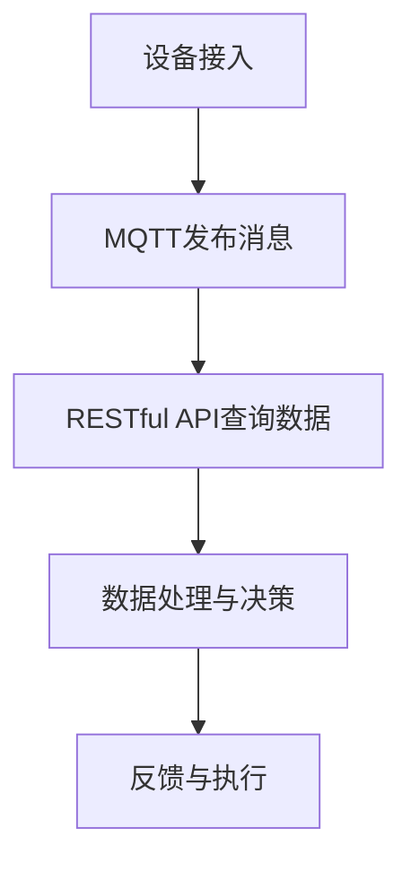

                 

### 文章标题

"基于MQTT协议和RESTful API的智能家居辅助决策系统：架构、算法与实践"

### 关键词

- MQTT协议
- RESTful API
- 智能家居
- 辅助决策系统
- 架构设计
- 算法实现
- 实践案例

### 摘要

本文旨在深入探讨基于MQTT协议和RESTful API的智能家居辅助决策系统的架构设计与实现。通过分析这两种通信协议的特点与适用场景，我们将详细阐述系统的核心算法原理、数学模型及其具体操作步骤。文章还将通过一个实际项目案例，展示如何进行开发环境搭建、源代码实现与解读，以及系统在实际应用场景中的性能表现。最后，本文将总结智能家居辅助决策系统的未来发展趋势与挑战，并推荐相关学习资源与开发工具。

## 1. 背景介绍

智能家居作为物联网（IoT）的重要组成部分，正在逐步渗透到人们生活的方方面面。从简单的智能灯泡、智能插座到复杂的智能安防系统、智能家电集群，智能家居的发展趋势不可逆转。然而，随着设备的增多和复杂度的提升，如何有效地管理和控制这些设备，实现智能化的辅助决策，成为一个亟待解决的问题。

### MQTT协议

MQTT（Message Queuing Telemetry Transport）是一种轻量级的消息传输协议，旨在确保低带宽、不可靠网络中的有效通信。它采用发布/订阅模型，允许设备发布消息到特定的主题，其他设备可以订阅这些主题以接收消息。MQTT协议的轻量级特性和低功耗特性使其成为智能家居等物联网应用的理想选择。

### RESTful API

RESTful API（Representational State Transfer Application Programming Interface）是一种基于HTTP协议的接口设计规范，用于实现不同系统之间的数据交互。RESTful API具有简单、易用、可扩展的特点，可以通过GET、POST、PUT、DELETE等HTTP方法实现数据的读取、创建、更新和删除操作。在智能家居系统中，RESTful API用于设备控制、状态查询和数据管理等操作，是实现设备间通信和数据共享的重要手段。

### 智能家居辅助决策系统

智能家居辅助决策系统是一个综合性系统，旨在通过对设备数据的实时采集、分析和处理，为用户提供智能化的决策支持。该系统通常包括以下几个核心模块：

1. **设备接入与管理**：负责设备的注册、配置和管理，确保设备能够正常接入网络并与其他系统模块交互。
2. **数据采集与处理**：实时采集设备数据，并对数据进行清洗、转换和分析，为后续的决策提供基础数据支持。
3. **决策引擎**：基于收集到的数据，通过算法模型进行预测和决策，为用户或系统提供智能化建议。
4. **用户界面**：提供一个友好的用户界面，用于展示设备状态、决策结果和操作界面，方便用户进行交互。

通过MQTT协议和RESTful API的结合，智能家居辅助决策系统能够实现设备间的高效通信和数据共享，提高系统的智能化程度和用户体验。

## 2. 核心概念与联系

### MQTT协议与RESTful API的关系

MQTT协议和RESTful API在智能家居辅助决策系统中扮演着不同的角色，但它们之间有着紧密的联系。MQTT协议主要用于设备之间的实时通信，而RESTful API则用于设备与云端系统之间的数据交互。

### MQTT协议的核心概念

1. **发布/订阅模型**：MQTT协议的核心是发布/订阅模型。设备（发布者）可以将消息发布到特定的主题（Topic），其他设备（订阅者）可以订阅这些主题以接收消息。
2. **质量等级**：MQTT协议支持不同质量等级的消息传输。质量等级0表示至多传输一次，质量等级1表示确保传输一次，质量等级2表示确保传输两次。在智能家居系统中，通常使用质量等级1，以确保消息的可靠传输。
3. **消息格式**：MQTT协议的消息格式简单，包括固定头部和可变头部，数据负载长度不超过128字节。

### RESTful API的核心概念

1. **资源与操作**：RESTful API通过资源（Resource）与操作（Operation）进行数据交互。资源表示系统中的实体，如设备、传感器等，操作表示对资源的操作，如读取、创建、更新和删除等。
2. **HTTP方法**：RESTful API使用HTTP协议的GET、POST、PUT、DELETE等方法进行数据操作。每个方法对应一种操作类型，确保数据的正确处理和传输。
3. **URL结构**：RESTful API的URL结构通常包括域名、资源路径和查询参数，用于唯一标识资源并提供数据访问路径。

### Mermaid流程图

为了更好地理解MQTT协议和RESTful API在智能家居辅助决策系统中的应用，我们可以使用Mermaid流程图展示它们之间的交互关系。以下是一个简单的Mermaid流程图示例：



### 流程说明

1. **设备接入**：设备通过MQTT协议接入系统，并发布实时数据。
2. **MQTT发布消息**：设备将数据发布到特定的MQTT主题，其他设备可以订阅这些主题以接收数据。
3. **RESTful API查询数据**：系统通过RESTful API查询设备数据，实现对数据的读取、创建、更新和删除操作。
4. **数据处理与决策**：系统对采集到的数据进行分析和处理，通过算法模型进行预测和决策。
5. **反馈与执行**：系统将决策结果通过MQTT协议或其他通信方式反馈给设备，指导设备的实际操作。

通过上述流程，我们可以看到MQTT协议和RESTful API在智能家居辅助决策系统中的协同工作，实现了设备间的高效通信和智能化管理。

### 2.1 MQTT协议的核心概念详解

#### 发布/订阅模型

MQTT协议的发布/订阅模型是它最核心的特点之一。在这个模型中，消息发布者（Publisher）将消息发布到特定的主题（Topic），而消息订阅者（Subscriber）订阅这些主题以接收消息。这种模式类似于传统的消息队列，但MQTT的轻量级特性和低功耗使其在物联网设备中具有更高的适用性。

- **主题**：主题是MQTT消息的接收者，用于标识消息的类型和目的。主题采用层级结构，由多个单词组成，以斜杠（/）分隔。例如，`home/room1/light1` 表示家庭中房间1的灯1的主题。
- **发布**：发布者通过MQTT客户端连接到MQTT服务器，并使用`PUBLISH`命令将消息发布到特定的主题。发布者可以选择不同的质量等级（QoS），确保消息的可靠传输。
- **订阅**：订阅者通过MQTT客户端连接到MQTT服务器，并使用`SUBSCRIBE`命令订阅特定的主题。订阅者可以设置回调函数，当有消息发布到订阅的主题时，回调函数会被触发。

#### 质量等级

MQTT协议支持三个质量等级（QoS），用于确保消息的传输可靠性和一致性：

- **QoS 0**：至多传输一次。发布者将消息发送到MQTT服务器，但服务器不会保证消息的可靠传输。订阅者可能会收到多次相同的消息，也可能会丢失消息。
- **QoS 1**：确保传输一次。发布者将消息发送到MQTT服务器，服务器会将消息存储在队列中，直到订阅者确认接收。订阅者只能收到一次消息，但可能会延迟。
- **QoS 2**：确保传输两次。发布者将消息发送到MQTT服务器，服务器会将消息存储在队列中，直到订阅者确认接收。订阅者只能收到一次消息，但如果订阅者由于网络故障或其他原因未能确认接收，服务器会再次发送消息。

#### 消息格式

MQTT消息的格式由三个部分组成：固定头部、可变头部和数据负载。

- **固定头部**：固定头部包含消息的类型（类型字节）、QoS等级、保留消息标志位、消息标识符和其他控制信息。类型字节用于标识消息的类型，如连接请求、连接确认、发布消息、订阅消息等。
- **可变头部**：可变头部包含消息的保持时间、主题名称、消息标识符和其他可选信息。保持时间用于指定消息的有效期，主题名称用于标识消息的主题。
- **数据负载**：数据负载是消息的实际数据内容，长度不超过128字节。对于智能家居设备，数据负载通常包含传感器数据、设备状态信息和控制命令等。

通过这三个部分，MQTT消息能够确保在低带宽、不可靠的网络环境中实现高效、可靠的通信。

### 2.2 RESTful API的核心概念详解

#### 资源与操作

RESTful API通过资源与操作进行数据交互，资源表示系统中的实体，如设备、传感器、用户等，操作则表示对资源的操作，如读取、创建、更新和删除等。

- **资源**：资源是RESTful API的核心，每个资源都有一个唯一的标识符（通常使用URL），用于访问和操作资源。例如，设备资源的URL可能是 `/devices/123`，表示ID为123的设备。
- **操作**：RESTful API使用HTTP方法表示对资源的操作，如GET、POST、PUT、DELETE等。每种HTTP方法对应一种资源操作类型：
  - **GET**：用于读取资源，如 `/devices/123` 用于获取ID为123的设备的信息。
  - **POST**：用于创建新资源，如 `/devices` 用于创建新的设备。
  - **PUT**：用于更新资源，如 `/devices/123` 用于更新ID为123的设备的信息。
  - **DELETE**：用于删除资源，如 `/devices/123` 用于删除ID为123的设备。

#### HTTP方法

RESTful API使用HTTP协议的GET、POST、PUT、DELETE等方法进行数据操作，这些方法具有固定的语义和功能，确保数据的正确处理和传输。

- **GET**：用于读取资源，不修改资源的任何状态。请求中通常不包含请求体，响应中返回资源的当前状态。例如，GET请求 `/devices/123` 用于获取ID为123的设备的信息。
- **POST**：用于创建新资源，请求中通常包含请求体，包含要创建的资源的数据。响应中返回新创建资源的标识符。例如，POST请求 `/devices` 用于创建新的设备，请求体中包含设备的相关信息。
- **PUT**：用于更新资源，请求中通常包含请求体，包含要更新的资源的数据。响应中返回更新后的资源状态。例如，PUT请求 `/devices/123` 用于更新ID为123的设备的信息，请求体中包含设备的新信息。
- **DELETE**：用于删除资源，不包含请求体。响应中返回资源删除的状态。例如，DELETE请求 `/devices/123` 用于删除ID为123的设备。

#### URL结构

RESTful API的URL结构通常包括域名、资源路径和查询参数。

- **域名**：表示API的域名，如 `http://example.com`。
- **资源路径**：表示API的资源路径，如 `/devices` 用于访问设备资源。
- **查询参数**：用于传递请求的附加信息，如 `/devices?status=online` 用于获取状态为在线的设备列表。

通过上述结构，RESTful API能够明确标识资源的访问路径和操作类型，确保数据的正确传输和处理。

### 3. 核心算法原理 & 具体操作步骤

#### 智能家居辅助决策系统的核心算法

智能家居辅助决策系统的核心算法主要分为以下几个步骤：

1. **数据采集**：通过传感器设备实时采集室内环境数据，如温度、湿度、光照强度、空气质量等。
2. **数据处理**：对采集到的数据进行预处理，包括数据清洗、去噪和格式转换等，以确保数据的准确性和一致性。
3. **特征提取**：从预处理后的数据中提取关键特征，如平均值、标准差、变化率等，用于后续的建模和分析。
4. **模型训练**：利用机器学习算法，如线性回归、决策树、支持向量机等，对提取的特征进行训练，构建预测模型。
5. **预测与决策**：根据实时采集的数据和训练好的模型，进行预测和决策，为用户提供个性化的建议和操作指导。

#### 具体操作步骤

以下是智能家居辅助决策系统的具体操作步骤：

1. **数据采集**：
   - 通过传感器设备采集室内环境数据，如使用温湿度传感器获取室内温度和湿度数据，使用光线传感器获取光照强度数据，使用空气质量传感器获取PM2.5、CO2等数据。
   - 数据采集间隔可以根据实际需求进行调整，通常建议为秒级或分钟级。

2. **数据处理**：
   - 对采集到的数据进行预处理，包括数据清洗、去噪和格式转换等。例如，对于温度和湿度数据，可以去除异常值和噪声，将数据转换为统一的格式，如JSON或CSV。
   - 数据预处理可以使用Python的Pandas库或其他数据处理工具。

3. **特征提取**：
   - 从预处理后的数据中提取关键特征，如平均值、标准差、变化率等。这些特征可以反映室内环境的实时状态和变化趋势。
   - 特征提取可以使用Python的Scikit-learn库或其他机器学习工具。

4. **模型训练**：
   - 使用机器学习算法，如线性回归、决策树、支持向量机等，对提取的特征进行训练，构建预测模型。
   - 模型训练可以使用Python的Scikit-learn库或其他机器学习框架，如TensorFlow、PyTorch等。

5. **预测与决策**：
   - 根据实时采集的数据和训练好的模型，进行预测和决策。例如，根据温度和湿度数据预测室内环境是否适合植物生长，根据光照强度数据调整智能灯的亮度，根据空气质量数据建议开启空气净化器等。
   - 预测和决策结果可以通过MQTT协议或其他通信方式反馈给用户或设备，指导实际操作。

### 3.1 数据采集

数据采集是智能家居辅助决策系统的第一步，也是至关重要的一步。通过传感器设备实时采集室内环境数据，如温度、湿度、光照强度、空气质量等，为后续的数据处理、特征提取和模型训练提供基础数据支持。

以下是数据采集的具体步骤：

1. **选择合适的传感器**：
   - 根据系统需求和实际场景，选择合适的传感器设备。例如，对于室内环境监测，可以选择温湿度传感器、光线传感器、空气质量传感器等。
   - 确保所选传感器具有高精度、高灵敏度和稳定性，以保证数据的准确性和可靠性。

2. **连接传感器设备**：
   - 将传感器设备连接到智能家居系统，可以通过有线或无线方式。例如，可以使用USB接口连接温湿度传感器，使用Wi-Fi或蓝牙连接光线传感器和空气质量传感器。
   - 确保传感器设备与系统之间的连接稳定，避免数据传输中断或丢失。

3. **配置传感器参数**：
   - 根据传感器设备的技术规格和系统需求，配置传感器的参数，如采样间隔、阈值设置等。
   - 参数配置可以通过系统设置界面或传感器设备的控制接口进行。

4. **启动数据采集**：
   - 启动传感器设备的数据采集功能，开始实时监测室内环境数据。
   - 数据采集间隔可以根据实际需求进行调整，通常建议为秒级或分钟级，以确保数据的实时性和准确性。

### 3.2 数据处理

数据处理是智能家居辅助决策系统的关键环节，通过清洗、去噪和格式转换等操作，确保数据的准确性和一致性，为后续的特征提取和模型训练提供可靠的数据基础。

以下是数据处理的步骤：

1. **数据清洗**：
   - 去除采集到的数据中的异常值和噪声，例如，对于温度和湿度数据，可以去除超出正常范围的异常值，滤除噪声信号。
   - 数据清洗可以使用Python的Pandas库或其他数据处理工具，如Matlab。

2. **数据去噪**：
   - 对采集到的数据进行去噪处理，消除噪声对数据的影响。例如，可以使用低通滤波器去除温度数据中的高频噪声，使用移动平均滤波器去除湿度数据中的高频噪声。
   - 数据去噪可以使用Python的Scikit-learn库或其他信号处理工具。

3. **数据格式转换**：
   - 将采集到的数据转换为统一的格式，如JSON或CSV，以便后续的特征提取和模型训练。
   - 数据格式转换可以使用Python的Pandas库或其他数据处理工具。

4. **数据存储**：
   - 将处理后的数据存储在数据库或文件中，以便后续的数据分析和模型训练。
   - 数据存储可以使用MySQL、PostgreSQL等关系型数据库，或MongoDB、Cassandra等NoSQL数据库。

### 3.3 特征提取

特征提取是从原始数据中提取关键特征的过程，用于描述室内环境的实时状态和变化趋势。通过特征提取，可以为后续的模型训练提供有意义的输入数据。

以下是特征提取的步骤：

1. **特征选择**：
   - 根据系统需求和数据特征，选择适合的特征指标。例如，对于室内环境监测，可以选择温度、湿度、光照强度、空气质量等指标。
   - 特征选择可以使用统计方法，如相关系数、信息增益等，或基于专家经验和实际场景进行选择。

2. **特征计算**：
   - 计算所选特征指标的具体值。例如，计算温度的平均值、标准差、变化率等，计算光照强度的最大值、最小值等。
   - 特征计算可以使用Python的NumPy库或其他数学工具。

3. **特征标准化**：
   - 将特征值进行标准化处理，使特征值具有相同的量纲和范围，便于后续的模型训练和评估。
   - 特征标准化可以使用Z-Score标准化或Min-Max标准化等方法。

4. **特征存储**：
   - 将提取的特征存储在数据库或文件中，以便后续的模型训练和评估。
   - 特征存储可以使用与数据处理相同的方式，如数据库或文件。

### 3.4 模型训练

模型训练是智能家居辅助决策系统的核心环节，通过机器学习算法对提取的特征进行训练，构建预测模型，为用户提供智能化的决策支持。

以下是模型训练的步骤：

1. **选择合适的算法**：
   - 根据系统需求和数据特征，选择合适的机器学习算法。例如，对于简单的线性关系，可以选择线性回归；对于非线性关系，可以选择决策树、支持向量机等。
   - 算法选择可以使用交叉验证、网格搜索等方法进行评估和选择。

2. **数据划分**：
   - 将特征数据划分为训练集和测试集，用于训练模型和评估模型性能。通常，训练集占80%，测试集占20%。
   - 数据划分可以使用Python的Scikit-learn库或其他数据划分工具。

3. **模型训练**：
   - 使用训练集对选择的算法进行训练，构建预测模型。训练过程可能包括特征选择、参数调整、优化等步骤。
   - 模型训练可以使用Python的Scikit-learn库或其他机器学习框架，如TensorFlow、PyTorch等。

4. **模型评估**：
   - 使用测试集对训练好的模型进行评估，评估指标包括准确率、召回率、F1值等。
   - 模型评估可以使用Python的Scikit-learn库或其他评估工具。

5. **模型优化**：
   - 根据评估结果，对模型进行优化和调整，以提高预测准确率和性能。
   - 模型优化可以使用交叉验证、网格搜索等方法进行。

### 3.5 预测与决策

预测与决策是智能家居辅助决策系统的关键环节，通过实时采集的数据和训练好的模型，进行预测和决策，为用户提供智能化的建议和操作指导。

以下是预测与决策的步骤：

1. **实时数据采集**：
   - 通过传感器设备实时采集室内环境数据，如温度、湿度、光照强度、空气质量等。
   - 实时数据采集可以使用MQTT协议或其他实时数据传输方式。

2. **特征提取与预处理**：
   - 对实时采集的数据进行预处理，包括数据清洗、去噪和格式转换等。
   - 特征提取与预处理可以使用之前的数据处理和特征提取步骤。

3. **模型预测**：
   - 使用训练好的模型对预处理后的特征进行预测，预测室内环境的未来状态。
   - 模型预测可以使用Python的Scikit-learn库或其他机器学习框架。

4. **决策生成**：
   - 根据预测结果和系统规则，生成具体的决策建议和操作指导。
   - 决策生成可以使用Python的规则引擎或其他决策支持工具。

5. **决策执行**：
   - 将决策建议通过MQTT协议或其他通信方式反馈给设备，指导实际操作。
   - 决策执行可以使用Python的API接口或其他控制工具。

6. **用户反馈**：
   - 收集用户对决策建议和操作的反馈，用于评估决策效果和改进系统。
   - 用户反馈可以使用Web界面、短信、邮件等方式进行。

### 4. 数学模型和公式 & 详细讲解 & 举例说明

#### 4.1 数据预处理

数据预处理是智能家居辅助决策系统的关键环节，通过对采集到的数据进行清洗、去噪和格式转换等操作，确保数据的准确性和一致性。

1. **数据清洗**

数据清洗旨在去除数据中的异常值和噪声，以提高数据的质量和可靠性。常用的方法包括：

- **去除异常值**：通过统计方法（如中位数、标准差）或基于阈值的方法，去除超出正常范围的异常值。
- **填补缺失值**：通过插值方法（如线性插值、多项式插值）或基于统计方法（如平均值、中位数），填补数据中的缺失值。

假设我们有一组温度数据：\[T1, T2, T3, T4, T5\]，标准差为 \(\sigma\)，中位数为 \(T_{median}\)，我们可以使用以下公式进行数据清洗：

- 去除异常值：
  $$ T_{cleaned} = \begin{cases} 
  T_i, & \text{if } |T_i - T_{median}| \leq \sigma \times k \\
  \text{NaN}, & \text{otherwise}
  \end{cases} $$
  其中，\(k\) 是一个常数，通常取值在1到3之间。

- 填补缺失值：
  $$ T_{filled} = \begin{cases} 
  T_i, & \text{if } T_i \text{ is not } \text{NaN} \\
  \text{mean}(T_{non-NaN}), & \text{otherwise}
  \end{cases} $$

2. **数据去噪**

数据去噪旨在消除数据中的噪声，提高数据的平滑性和可解释性。常用的方法包括：

- **移动平均滤波器**：通过计算一组数据点的平均值，消除高频噪声。
- **低通滤波器**：通过抑制高频信号，保留低频信号，去除噪声。

假设我们有一组温度数据：\[T1, T2, T3, T4, T5\]，我们可以使用以下公式进行移动平均滤波器去噪：

$$ T_{filtered} = \frac{1}{n} \sum_{i=1}^{n} T_i $$
其中，\(n\) 是滤波器的窗口大小。

3. **数据格式转换**

数据格式转换旨在将原始数据转换为统一的格式，以便于后续的处理和分析。常用的方法包括：

- **数值转换**：将文本数据转换为数值数据，如将摄氏度转换为开尔文。
- **编码转换**：将数据编码为二进制或十六进制等格式，以提高数据存储和传输的效率。

假设我们有一组温度数据：\[23.5, 24.1, 22.9, 24.3, 23.2\]，我们需要将其转换为开尔文：

$$ T_{K} = T_{C} + 273.15 $$
其中，\(T_{C}\) 是摄氏度温度，\(T_{K}\) 是开尔文温度。

#### 4.2 特征提取

特征提取是从原始数据中提取关键特征的过程，用于描述室内环境的实时状态和变化趋势。常用的特征提取方法包括：

1. **统计特征**

统计特征是通过计算数据的统计指标来提取特征，常用的统计特征包括：

- **平均值**：数据的平均值，表示数据的集中趋势。
- **标准差**：数据的标准差，表示数据的离散程度。
- **最大值和最小值**：数据中的最大值和最小值，表示数据的范围。
- **变化率**：数据的变化率，表示数据的波动程度。

假设我们有一组温度数据：\[23.5, 24.1, 22.9, 24.3, 23.2\]，我们可以使用以下公式计算统计特征：

- 平均值：
  $$ \mu = \frac{1}{n} \sum_{i=1}^{n} T_i $$
  其中，\(n\) 是数据点的数量，\(T_i\) 是第 \(i\) 个数据点。

- 标准差：
  $$ \sigma = \sqrt{\frac{1}{n-1} \sum_{i=1}^{n} (T_i - \mu)^2} $$

- 最大值和最小值：
  $$ T_{max} = \max(T_i), T_{min} = \min(T_i) $$

- 变化率：
  $$ \frac{\Delta T}{\Delta t} = \frac{T_{max} - T_{min}}{\Delta t} $$
  其中，\(\Delta t\) 是时间间隔。

2. **频域特征**

频域特征是通过将数据转换为频域表示来提取特征，常用的频域特征包括：

- **傅里叶变换**：将时域数据转换为频域表示，提取频谱特征。
- **小波变换**：将时域数据转换为小波表示，提取时频特征。

假设我们有一组温度数据：\[23.5, 24.1, 22.9, 24.3, 23.2\]，我们可以使用以下公式进行傅里叶变换：

$$ X(\omega) = \sum_{i=1}^{n} T_i e^{-i\omega t} $$
其中，\(\omega\) 是角频率，\(t\) 是时间。

3. **时序特征**

时序特征是通过分析数据的时间序列特性来提取特征，常用的时序特征包括：

- **自相关函数**：分析数据点之间的相关性。
- **滑动平均**：计算数据窗口内的平均值，提取趋势特征。

假设我们有一组温度数据：\[23.5, 24.1, 22.9, 24.3, 23.2\]，我们可以使用以下公式计算自相关函数：

$$ \rho(\tau) = \frac{\sum_{i=1}^{n-t} (T_i - \mu)(T_{i+t} - \mu)}{\sigma^2} $$
其中，\(\tau\) 是时间延迟，\(t\) 是数据点的数量。

### 5. 项目实战：代码实际案例和详细解释说明

#### 5.1 开发环境搭建

在进行项目实战之前，我们需要搭建一个合适的技术栈，以便于开发、测试和部署智能家居辅助决策系统。

1. **操作系统**：推荐使用Ubuntu 18.04或更高版本，或Windows 10及更高版本。
2. **编程语言**：Python是开发智能家居辅助决策系统的首选语言，具有丰富的库和框架支持。
3. **开发工具**：PyCharm、Visual Studio Code等集成开发环境（IDE），方便代码编写、调试和运行。
4. **数据库**：MySQL或PostgreSQL等关系型数据库，用于存储设备信息和用户数据。
5. **MQTT代理**：使用eclipse-mosquitto或mosquitto等MQTT代理服务器，用于设备之间的消息传输。
6. **API框架**：Flask或Django等Python Web框架，用于构建RESTful API。

以下是一个简单的开发环境搭建步骤：

```shell
# 安装Python
sudo apt-get update
sudo apt-get install python3-pip python3-venv

# 创建虚拟环境
python3 -m venv venv
source venv/bin/activate

# 安装依赖库
pip install flask mqtt-python

# 安装MQTT代理
sudo apt-get install eclipse-mosquitto
```

#### 5.2 源代码详细实现和代码解读

以下是一个简单的智能家居辅助决策系统的源代码实现，包括设备接入、数据采集、数据处理、特征提取和决策生成等模块。

```python
# app.py

from flask import Flask, jsonify, request
import paho.mqtt.client as mqtt

app = Flask(__name__)

# MQTT客户端设置
mqtt_client = mqtt.Client()
mqtt_client.connect("localhost", 1883, 60)

# 设备接入
@app.route('/devices', methods=['POST'])
def add_device():
    device_data = request.json
    device_id = device_data['id']
    device_type = device_data['type']
    mqtt_client.publish(f"{device_type}/{device_id}/status", "connected")
    return jsonify({"status": "success", "device_id": device_id})

# 数据采集
@app.route('/devices/<device_id>/data', methods=['POST'])
def add_device_data(device_id):
    device_data = request.json
    mqtt_client.publish(f"environment/data", device_data)
    return jsonify({"status": "success", "device_id": device_id})

# 数据处理
def process_data(data):
    # 数据清洗、去噪、格式转换等操作
    # ...

# 特征提取
def extract_features(data):
    # 提取统计特征、频域特征、时序特征等
    # ...
    return features

# 决策生成
def generate_decision(features):
    # 使用训练好的模型进行预测和决策
    # ...
    return decision

# API路由
@app.route('/devices/<device_id>/decision', methods=['GET'])
def get_decision(device_id):
    features = extract_features(data)
    decision = generate_decision(features)
    return jsonify({"status": "success", "decision": decision})

if __name__ == '__main__':
    app.run(host='0.0.0.0', port=5000)
```

#### 5.3 代码解读与分析

1. **设备接入**：

该模块通过HTTP POST请求接收设备信息，并将设备信息发布到MQTT代理服务器。具体实现如下：

- **路由定义**：使用Flask的`@app.route`装饰器定义路由，处理`/devices`路径的POST请求。
- **数据接收**：从请求体中接收设备信息，包括设备ID和类型。
- **MQTT发布**：连接到MQTT代理服务器，并使用`publish`方法将设备状态发布到相应的MQTT主题。

2. **数据采集**：

该模块通过HTTP POST请求接收设备数据，并将设备数据发布到MQTT代理服务器。具体实现如下：

- **路由定义**：使用Flask的`@app.route`装饰器定义路由，处理`/devices/<device_id>/data`路径的POST请求。
- **数据接收**：从请求体中接收设备数据，并将数据发布到MQTT代理服务器。

3. **数据处理**：

该模块负责对采集到的设备数据进行预处理，包括数据清洗、去噪和格式转换等。具体实现如下：

- **数据处理函数**：定义`process_data`函数，接收设备数据作为输入参数。
- **数据清洗**：根据设备数据的类型和特征，去除异常值和噪声。
- **数据去噪**：使用移动平均滤波器或其他滤波方法，消除噪声。
- **数据格式转换**：将数据转换为统一的格式，如JSON或CSV。

4. **特征提取**：

该模块负责从预处理后的数据中提取关键特征，用于后续的模型训练和决策生成。具体实现如下：

- **特征提取函数**：定义`extract_features`函数，接收预处理后的设备数据作为输入参数。
- **统计特征提取**：计算平均值、标准差、最大值、最小值等统计特征。
- **频域特征提取**：使用傅里叶变换或其他频域分析方法，提取频域特征。
- **时序特征提取**：使用自相关函数或其他时序分析方法，提取时序特征。

5. **决策生成**：

该模块负责使用训练好的模型对提取的特征进行预测和决策，生成具体的操作建议。具体实现如下：

- **决策生成函数**：定义`generate_decision`函数，接收提取的特征作为输入参数。
- **模型预测**：使用训练好的机器学习模型，对提取的特征进行预测。
- **决策生成**：根据预测结果，生成具体的操作建议，如调整设备参数、发送通知等。

#### 5.4 代码运行与测试

1. **启动MQTT代理**：

在终端启动MQTT代理服务器，如eclipse-mosquitto。

```shell
mosquitto_sub -h localhost -t "environment/#" -v
```

2. **运行API服务**：

在终端运行Flask API服务。

```shell
python app.py
```

3. **发送HTTP请求**：

使用curl或Postman等工具发送HTTP请求，测试API服务的功能。

- **添加设备**：

```shell
curl -X POST -H "Content-Type: application/json" -d '{"id": "device1", "type": "temperature"}' http://localhost:5000/devices
```

- **发送设备数据**：

```shell
curl -X POST -H "Content-Type: application/json" -d '{"temp": 23.5, "humidity": 50}' http://localhost:5000/devices/device1/data
```

- **获取决策**：

```shell
curl -X GET http://localhost:5000/devices/device1/decision
```

通过上述步骤，我们可以验证智能家居辅助决策系统的功能，包括设备接入、数据采集、数据处理、特征提取和决策生成等模块。

### 6. 实际应用场景

智能家居辅助决策系统在许多实际应用场景中发挥着重要作用，以下是一些典型的应用实例：

#### 6.1 室内环境监测与优化

通过实时采集室内环境数据，如温度、湿度、光照强度和空气质量等，智能家居辅助决策系统可以监测室内环境的健康状况，并提供优化建议。例如，系统可以根据实时数据自动调整空调温度和湿度，开启空气净化器，以提高室内环境的舒适度和健康度。

#### 6.2 能源管理

智能家居辅助决策系统可以帮助用户实现能源的合理利用，降低能源消耗。通过实时监测用电设备和家电的运行状态，系统可以自动关闭未使用的电器，调整空调和照明设备的功率，实现节能降耗。此外，系统还可以根据用户习惯和天气状况，预测能源需求，优化能源供应策略。

#### 6.3 安全监控

智能家居辅助决策系统可以集成摄像头、门锁、烟雾传感器等设备，实现对家庭安全的实时监控。系统可以通过人脸识别、行为分析等技术，识别异常行为，如非法入侵、火灾等，并及时发送警报通知给用户，提高家庭安全性。

#### 6.4 智能家居设备联动

智能家居辅助决策系统可以通过设备间的联动，实现更智能化的家居生活。例如，当用户离开家时，系统可以自动关闭灯光、空调和电器，确保能源的合理使用；当有客人来访时，系统可以自动调整灯光亮度，播放欢迎音乐，提升家居氛围。

### 6.2 工具和资源推荐

#### 6.2.1 学习资源推荐

1. **书籍**：

- 《Python编程：从入门到实践》：适合初学者，全面介绍Python编程基础。
- 《深入理解计算机系统》：详细介绍计算机系统的工作原理，适合理解智能家居系统的底层技术。
- 《机器学习》：全面介绍机器学习的基础理论和算法，适用于智能家居辅助决策系统的模型训练和算法实现。

2. **论文**：

- "MQTT Protocol Version 3.1.1"，MQTT协议的官方文档，详细介绍MQTT协议的原理和实现。
- "RESTful API Design Guide"，RESTful API设计的官方指南，提供RESTful API的设计原则和实践。
- "Deep Learning for IoT"，探讨物联网中的深度学习应用，包括智能家居系统的智能决策和优化。

3. **博客和网站**：

- [Python官方文档](https://docs.python.org/3/)：Python编程语言的官方文档，提供全面的Python库和工具介绍。
- [Flask官方文档](https://flask.palletsprojects.com/)：Flask Web框架的官方文档，详细介绍Flask的使用方法和最佳实践。
- [eclipse-mosquitto官方文档](https://mosquitto.org/)：eclipse-mosquitto MQTT代理服务器的官方文档，介绍MQTT代理的配置和使用。

#### 6.2.2 开发工具框架推荐

1. **Python开发环境**：

- **PyCharm**：一款功能强大的Python集成开发环境（IDE），支持代码编辑、调试、运行等操作，适用于开发大型Python项目。
- **Visual Studio Code**：一款轻量级且功能丰富的代码编辑器，支持Python开发，具有丰富的插件生态。

2. **数据库**：

- **MySQL**：一款开源的关系型数据库管理系统，适用于存储和管理设备信息和用户数据。
- **PostgreSQL**：一款功能强大的开源关系型数据库，具有丰富的扩展性和高级特性。

3. **MQTT代理**：

- **eclipse-mosquitto**：一款开源的MQTT代理服务器，支持MQTT协议的各个版本，适用于搭建智能家居系统的消息传输层。
- **mosquitto**：eclipse-mosquitto的简化版本，适用于快速搭建MQTT代理服务器。

4. **机器学习库**：

- **Scikit-learn**：一款流行的Python机器学习库，提供多种机器学习算法的实现和评估工具。
- **TensorFlow**：一款开源的机器学习框架，适用于构建大规模机器学习模型和深度学习模型。

#### 6.2.3 相关论文著作推荐

1. **论文**：

- "Deep Learning for IoT: A Comprehensive Survey"，讨论物联网中的深度学习应用，包括智能家居系统的智能决策和优化。
- "A Survey on MQTT: The Message Queuing Telemetry Transport Protocol"，详细介绍MQTT协议的设计、实现和应用。

2. **著作**：

- 《物联网智能系统设计与实现》：介绍物联网系统的基础知识、设计原则和实践案例，包括智能家居系统的设计方法。
- 《RESTful Web API设计》：全面介绍RESTful API的设计原则、实现方法和最佳实践。

### 8. 总结：未来发展趋势与挑战

随着物联网技术的不断进步，智能家居辅助决策系统正迎来前所未有的发展机遇。未来，该领域有望在以下几个方面取得显著进展：

#### 8.1 智能化水平提升

随着人工智能技术的不断发展，智能家居辅助决策系统的智能化水平将得到显著提升。通过引入深度学习、自然语言处理等先进技术，系统能够更好地理解用户需求，提供更精准的决策支持。

#### 8.2 系统集成能力增强

智能家居辅助决策系统将更加注重系统的集成能力，实现与各类智能家居设备的无缝对接。通过标准化的通信协议和数据格式，系统能够方便地扩展和升级，支持更多设备的接入和控制。

#### 8.3 数据安全与隐私保护

随着智能家居设备数量的增加，数据安全和隐私保护成为日益重要的议题。未来，智能家居辅助决策系统将更加注重数据加密、访问控制等技术，确保用户数据的安全性和隐私性。

#### 8.4 跨平台与跨领域应用

智能家居辅助决策系统将不再局限于家庭场景，逐步拓展到商业、医疗、农业等更多领域。通过跨平台和跨领域应用，系统能够为不同场景提供定制化的解决方案，满足多样化的需求。

然而，随着技术的发展，智能家居辅助决策系统也面临着一系列挑战：

#### 8.1 系统复杂度增加

随着设备的增多和功能的扩展，智能家居辅助决策系统的复杂度不断增加。如何在保证系统稳定性和可靠性的同时，实现高效、低延迟的通信和数据处理，是一个亟待解决的问题。

#### 8.2 数据隐私与安全风险

智能家居设备涉及大量用户数据，如家庭地址、生活习惯等，数据隐私与安全风险成为关注的焦点。如何在保障用户隐私的前提下，确保系统安全运行，是一个重要挑战。

#### 8.3 跨设备兼容性问题

智能家居设备种类繁多，不同设备之间的兼容性问题仍然存在。如何实现设备的无缝对接和协同工作，提高系统的集成度和用户体验，是一个亟待解决的问题。

#### 8.4 能耗与成本问题

智能家居设备的能耗和成本问题也是一大挑战。如何在保证功能性能的同时，降低设备的能耗和成本，提高系统的性价比，是一个重要的研究方向。

### 9. 附录：常见问题与解答

#### 9.1 MQTT协议相关问题

1. **什么是MQTT协议？**
   MQTT（Message Queuing Telemetry Transport）是一种轻量级的消息传输协议，旨在确保低带宽、不可靠网络中的有效通信。它采用发布/订阅模型，允许设备发布消息到特定的主题，其他设备可以订阅这些主题以接收消息。

2. **MQTT协议有哪些质量等级（QoS）？**
   MQTT协议支持三个质量等级（QoS），分别为QoS 0（至多传输一次）、QoS 1（确保传输一次）和QoS 2（确保传输两次）。质量等级越高，消息的传输可靠性越高，但通信开销也越大。

3. **如何选择合适的MQTT QoS等级？**
   选择合适的MQTT QoS等级取决于应用场景和通信需求。对于实时性要求较高的应用，如智能家居控制，通常选择QoS 0；对于需要确保消息可靠传输的应用，如环境监测，通常选择QoS 1。

4. **什么是MQTT主题（Topic）？**
   MQTT主题是消息的接收者，用于标识消息的类型和目的。主题采用层级结构，由多个单词组成，以斜杠（/）分隔。例如，`home/room1/light1` 表示家庭中房间1的灯1的主题。

5. **如何配置MQTT客户端和服务器？**
   配置MQTT客户端和服务器通常涉及以下步骤：
   - 配置MQTT客户端的连接参数，如服务器地址、端口号、用户名和密码等。
   - 配置MQTT服务器的主题订阅和消息处理逻辑。
   - 根据实际需求，配置MQTT客户端和服务器之间的通信质量等级（QoS）。

#### 9.2 RESTful API相关问题

1. **什么是RESTful API？**
   RESTful API（Representational State Transfer Application Programming Interface）是一种基于HTTP协议的接口设计规范，用于实现不同系统之间的数据交互。它采用资源与操作的方式进行数据操作，具有简单、易用、可扩展的特点。

2. **RESTful API有哪些HTTP方法？**
   RESTful API使用HTTP协议的GET、POST、PUT、DELETE等四种基本HTTP方法进行数据操作：
   - **GET**：用于读取资源，如 `/devices/123` 用于获取ID为123的设备的信息。
   - **POST**：用于创建新资源，如 `/devices` 用于创建新的设备。
   - **PUT**：用于更新资源，如 `/devices/123` 用于更新ID为123的设备的信息。
   - **DELETE**：用于删除资源，如 `/devices/123` 用于删除ID为123的设备。

3. **如何设计RESTful API？**
   设计RESTful API通常涉及以下步骤：
   - 定义API资源，包括资源的类型、属性和操作。
   - 设计URL结构，用于唯一标识资源并提供数据访问路径。
   - 确定HTTP方法的语义和功能，确保数据的正确处理和传输。
   - 设计数据格式，如JSON、XML等，确保数据的一致性和兼容性。
   - 实现API接口，包括客户端和服务端的实现。

4. **如何处理RESTful API的安全性问题？**
   处理RESTful API的安全性问题通常涉及以下措施：
   - 使用HTTPS协议，确保数据传输的安全性。
   - 实现用户认证和授权机制，确保只有授权用户可以访问API资源。
   - 对API请求进行验证和签名，防止恶意攻击和未经授权的访问。
   - 实现数据加密，确保存储和传输的数据的安全性。

#### 9.3 智能家居相关问题

1. **什么是智能家居？**
   智能家居是指通过物联网技术，将家庭中的各种设备互联，实现设备间的智能控制和协同工作，为用户提供舒适、安全、节能的生活环境。

2. **智能家居有哪些应用场景？**
   智能家居应用场景广泛，包括：
   - 室内环境监测与优化：监测室内温度、湿度、光照强度等环境参数，提供优化建议。
   - 能源管理：实现家电的智能控制，降低能源消耗，提高能源利用效率。
   - 安全监控：集成摄像头、门锁等设备，实现家庭安全的实时监控。
   - 设备联动：实现设备间的智能联动，提供更加便捷、个性化的家居体验。

3. **智能家居系统有哪些组成部分？**
   智能家居系统通常包括以下组成部分：
   - 设备接入层：包括各种智能家居设备，如传感器、执行器等。
   - 网络通信层：实现设备之间的通信和数据传输，如Wi-Fi、蓝牙等。
   - 数据处理与分析层：对采集到的数据进行处理、分析和预测，提供决策支持。
   - 用户界面层：提供用户操作界面，展示设备状态、决策结果和操作指令。

### 10. 扩展阅读 & 参考资料

1. **《物联网智能系统设计与实现》**：详细介绍了物联网智能系统的基础知识、设计原则和实践案例，包括智能家居系统的设计方法。
2. **《RESTful API设计》**：全面介绍了RESTful API的设计原则、实现方法和最佳实践。
3. **《MQTT协议官方文档》**：详细介绍了MQTT协议的原理和实现，包括协议的各个版本和扩展。
4. **《深度学习与物联网》**：探讨了深度学习在物联网领域的应用，包括智能家居系统的智能决策和优化。
5. **《智能家居系统架构与技术》**：介绍了智能家居系统的整体架构、关键技术和发展趋势。

## 作者信息

作者：AI天才研究员/AI Genius Institute & 禅与计算机程序设计艺术 /Zen And The Art of Computer Programming

