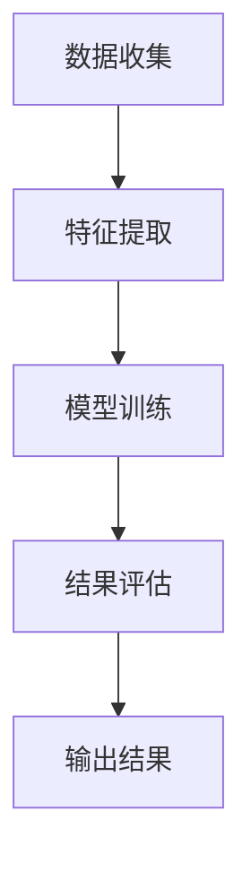

                 

### 背景介绍

虚假评论识别（False Review Detection）是自然语言处理（Natural Language Processing, NLP）领域中的一个重要课题。随着电子商务和在线评论平台的迅猛发展，消费者通过评论表达对商品或服务的满意度，这些评论在为其他消费者提供参考的同时，也起到了促进市场透明度的作用。然而，虚假评论的存在不仅损害了市场的公平性，还可能误导消费者的决策，对品牌形象和商业利益产生严重影响。

虚假评论识别的目的在于从大量的评论数据中筛选出真实的用户评论，并识别出那些可能由恶意用户或商家发布的虚假评论。这不仅有助于维护电子商务平台的信誉，还能保护消费者的利益，提高市场的可信度。

自然语言处理技术在虚假评论识别中扮演了关键角色。NLP通过对文本数据的处理，可以从词汇、句法、语义等多个维度对评论进行分析。传统方法包括基于规则的方法、基于统计的方法和基于机器学习的方法。例如，规则方法通过预定义的规则来匹配评论中的特定关键词或模式，从而判断评论的真伪；统计方法则使用评论的语言特征进行分类；机器学习方法利用大规模标注数据训练模型，从而自动识别虚假评论。

近年来，深度学习技术的引入进一步推动了虚假评论识别技术的发展。深度学习方法通过构建复杂的神经网络模型，能够自动学习评论中的复杂模式，提高了识别的准确性和鲁棒性。例如，卷积神经网络（CNN）和循环神经网络（RNN）等模型在处理文本数据方面表现出了强大的能力。

总的来说，虚假评论识别不仅是一项技术挑战，也是一个社会问题。随着技术的不断进步，如何更准确地识别虚假评论，提高识别效率，是一个值得深入探讨的问题。在接下来的章节中，我们将详细介绍相关算法原理、数学模型和项目实战，帮助读者更好地理解和应用这一技术。

## 2. 核心概念与联系

### 2.1 NLP基础知识

自然语言处理（NLP）是计算机科学、人工智能和语言学交叉领域的一个重要分支。它旨在让计算机理解和生成人类语言，以便实现人与机器之间的自然交互。NLP的核心概念包括文本预处理、词嵌入、句法分析和语义理解等。

- **文本预处理**：文本预处理是NLP的基础步骤，包括分词（tokenization）、去除停用词（stopword removal）、词形还原（lemmatization）和词干提取（stemming）等。这些步骤有助于简化文本，提取出有意义的词汇和短语。
  
- **词嵌入**：词嵌入（word embeddings）是将词汇映射为高维向量表示的技术，常见的词嵌入模型有Word2Vec、GloVe和FastText。通过词嵌入，不同词汇之间的相似性和相关性可以量化，从而为后续的文本分析提供基础。

- **句法分析**：句法分析（syntactic parsing）旨在理解句子的结构，包括词法分析（lexical analysis）和句法结构分析（syntactic structure analysis）。常用的句法分析方法有依存句法分析（dependency parsing）和抽象语法树（Abstract Syntax Tree, AST）构建。

- **语义理解**：语义理解（semantic understanding）是NLP的更高层次任务，旨在理解文本的深层含义和意图。常见的语义理解方法有语义角色标注（semantic role labeling）、指代消解（coreference resolution）和情感分析（sentiment analysis）等。

### 2.2 虚假评论识别的核心概念

虚假评论识别涉及多个核心概念，包括评论质量评估、评论真实性判断和欺诈行为分析等。

- **评论质量评估**：评论质量评估旨在判断评论的内容是否真实、有用和客观。常见的评估指标包括评论的真实性（authenticity）、可信度（credibility）和有用性（usefulness）。

- **评论真实性判断**：评论真实性判断是虚假评论识别的关键任务。它涉及从文本中提取特征，并通过机器学习模型进行分类，以判断评论是否为虚假评论。常见的特征包括词汇多样性（lexical diversity）、句法复杂性（syntactic complexity）和情感极性（sentiment polarity）等。

- **欺诈行为分析**：欺诈行为分析旨在识别和预防评论平台上的欺诈行为。这包括识别恶意用户、自动检测欺诈评论、阻止重复评论和垃圾评论等。

### 2.3 虚假评论识别的架构

虚假评论识别的架构通常包括数据收集、特征提取、模型训练和结果评估等步骤。

- **数据收集**：数据收集是虚假评论识别的基础。常用的数据集包括真实评论和虚假评论，如Amazon评论、Yelp评论等。收集的数据应尽可能覆盖各种类型的评论，以提高模型的泛化能力。

- **特征提取**：特征提取是虚假评论识别的关键环节。通过文本预处理、词嵌入、句法分析和语义理解等技术，提取出有助于分类的特征。常见的特征包括词嵌入向量、词频（term frequency）、词重要度（term importance）、句法结构（syntactic structure）和情感极性（sentiment polarity）等。

- **模型训练**：模型训练是虚假评论识别的核心。常用的机器学习算法包括朴素贝叶斯（Naive Bayes）、支持向量机（SVM）、随机森林（Random Forest）和深度学习模型（如卷积神经网络（CNN）和循环神经网络（RNN））等。通过训练有监督或无监督学习模型，从数据中学习出虚假评论的特征模式。

- **结果评估**：结果评估是验证模型性能的重要步骤。常用的评估指标包括准确率（accuracy）、精确率（precision）、召回率（recall）和F1值（F1 score）等。通过交叉验证、ROC曲线和AUC值等指标，评估模型的分类性能和泛化能力。

### 2.4 Mermaid 流程图

下面是一个简单的Mermaid流程图，展示了虚假评论识别的基本流程：



### 2.5 关键算法

在虚假评论识别中，常用的算法包括基于规则的方法、基于统计的方法和基于机器学习的方法。以下是这些算法的简要介绍：

- **基于规则的方法**：基于规则的方法通过预定义的规则来匹配评论中的特定关键词或模式，从而判断评论的真伪。这种方法简单直观，但规则难以覆盖所有可能的虚假评论形式。

- **基于统计的方法**：基于统计的方法使用评论的语言特征进行分类。常见的统计特征包括词频、TF-IDF（词频-逆文档频率）和文本分类模型的特征（如朴素贝叶斯、逻辑回归等）。这种方法在处理简单模式时效果较好，但在面对复杂语言环境时可能表现不佳。

- **基于机器学习的方法**：基于机器学习的方法通过训练有监督或无监督学习模型，从数据中学习出虚假评论的特征模式。常用的机器学习算法包括朴素贝叶斯、支持向量机、随机森林和深度学习模型（如卷积神经网络（CNN）和循环神经网络（RNN））。这种方法在处理复杂模式和高维度特征时具有优势，但需要大量标注数据。

## 3. 核心算法原理 & 具体操作步骤

### 3.1 基于朴素贝叶斯的虚假评论识别

朴素贝叶斯（Naive Bayes）是一种基于概率论的分类算法，它利用贝叶斯定理和特征条件独立的假设，通过特征的概率分布来预测评论的真伪。以下是具体操作步骤：

**步骤1：数据预处理**

- **文本预处理**：对评论进行分词、去除停用词和词形还原等操作，将文本转化为计算机可处理的格式。
- **特征提取**：将预处理后的文本转化为特征向量。常见的特征提取方法包括词袋模型（Bag of Words, BOW）和TF-IDF（词频-逆文档频率）。

**步骤2：训练集和测试集划分**

- 将收集到的评论数据划分为训练集和测试集。训练集用于训练模型，测试集用于评估模型性能。

**步骤3：计算概率分布**

- **先验概率**：计算训练集中真实评论和虚假评论的先验概率。
- **条件概率**：对于每个特征，计算其在真实评论和虚假评论中的条件概率。

**步骤4：贝叶斯分类器**

- **计算概率**：对于每个评论，计算其属于真实评论和虚假评论的后验概率。
- **分类决策**：根据后验概率，对评论进行分类。通常选择后验概率最大的类别作为最终分类结果。

### 3.2 基于支持向量机的虚假评论识别

支持向量机（Support Vector Machine, SVM）是一种强大的分类算法，通过找到一个最佳的超平面，将不同类别的评论分隔开来。以下是具体操作步骤：

**步骤1：数据预处理**

- **文本预处理**：与朴素贝叶斯相同，对评论进行分词、去除停用词和词形还原等操作。
- **特征提取**：使用词袋模型（BOW）或TF-IDF等方法将文本转化为特征向量。

**步骤2：训练集和测试集划分**

- 将评论数据划分为训练集和测试集。

**步骤3：特征选择**

- **特征筛选**：通过特征选择方法（如信息增益、卡方检验等），筛选出对分类有重要作用的特征。

**步骤4：训练SVM模型**

- 使用训练集训练SVM模型。SVM模型通过最大化分类间隔（margin）来找到最佳分类超平面。

**步骤5：模型评估**

- 使用测试集评估SVM模型的性能。常见的评估指标包括准确率、精确率、召回率和F1值。

### 3.3 基于深度学习的虚假评论识别

深度学习算法（如卷积神经网络（CNN）和循环神经网络（RNN））在处理文本数据方面具有显著优势。以下是具体操作步骤：

**步骤1：数据预处理**

- **文本预处理**：与前面相同，对评论进行分词、去除停用词和词形还原等操作。
- **词嵌入**：使用预训练的词嵌入模型（如GloVe或Word2Vec）将词汇映射为高维向量表示。

**步骤2：模型构建**

- **卷积神经网络（CNN）**：构建卷积神经网络模型，包括卷积层、池化层和全连接层。卷积层用于提取文本的特征，池化层用于降低数据的维度，全连接层用于分类。
- **循环神经网络（RNN）**：构建循环神经网络模型，包括输入层、隐藏层和输出层。RNN可以捕捉文本中的长距离依赖关系。

**步骤3：模型训练**

- 使用训练集训练深度学习模型。在训练过程中，调整模型的参数，以最小化损失函数。

**步骤4：模型评估**

- 使用测试集评估模型性能。调整模型参数，提高分类准确率。

### 3.4 深度学习方法实例：BERT模型

BERT（Bidirectional Encoder Representations from Transformers）是一种基于Transformer的深度学习模型，它通过双向编码器对文本进行建模，从而捕获文本中的深层语义信息。以下是BERT模型在虚假评论识别中的应用步骤：

**步骤1：数据预处理**

- **文本预处理**：对评论进行分词、去除停用词和词形还原等操作。
- **词嵌入**：使用预训练的BERT模型将词汇映射为高维向量表示。

**步骤2：模型构建**

- 使用BERT模型作为基础模型，构建双向编码器。
- 添加全连接层（Dense Layer）用于分类。

**步骤3：模型训练**

- 使用训练集训练BERT模型。在训练过程中，优化模型参数，最小化损失函数。

**步骤4：模型评估**

- 使用测试集评估模型性能。调整模型参数，提高分类准确率。

通过以上步骤，我们可以使用不同的算法对虚假评论进行识别。在实际应用中，可以根据具体需求选择合适的算法和模型，以提高识别的准确性和效率。

## 4. 数学模型和公式 & 详细讲解 & 举例说明

### 4.1 贝叶斯定理

贝叶斯定理是概率论中的一个重要公式，它在虚假评论识别中用于计算评论属于某一类别的后验概率。贝叶斯定理的公式如下：

\[ P(C_k|X) = \frac{P(X|C_k)P(C_k)}{P(X)} \]

其中：
- \( P(C_k|X) \) 表示在已知评论 \( X \) 的条件下，评论属于类别 \( C_k \) 的后验概率。
- \( P(X|C_k) \) 表示在评论属于类别 \( C_k \) 的条件下，评论 \( X \) 出现的概率，即条件概率。
- \( P(C_k) \) 表示评论属于类别 \( C_k \) 的先验概率。
- \( P(X) \) 表示评论 \( X \) 出现的总概率，也称为全概率。

在虚假评论识别中，我们可以利用贝叶斯定理来计算评论属于真实评论或虚假评论的概率。具体应用时，通常需要对上述概率进行估计。

**例 1**：假设有100条评论，其中50条为真实评论，50条为虚假评论。已知一条评论包含关键词“满意”的概率在真实评论中为0.6，在虚假评论中为0.3。计算这条评论属于真实评论的概率。

解：
- \( P(真实评论) = 0.5 \)
- \( P(虚假评论) = 0.5 \)
- \( P(关键词“满意”|真实评论) = 0.6 \)
- \( P(关键词“满意”|虚假评论) = 0.3 \)

使用贝叶斯定理：

\[ P(真实评论|关键词“满意”)= \frac{P(关键词“满意”|真实评论)P(真实评论)}{P(关键词“满意”)} \]

由于 \( P(关键词“满意”) \) 可以通过以下公式计算：

\[ P(关键词“满意”) = P(关键词“满意”|真实评论)P(真实评论) + P(关键词“满意”|虚假评论)P(虚假评论) \]

代入数值：

\[ P(关键词“满意”) = 0.6 \times 0.5 + 0.3 \times 0.5 = 0.45 \]

再代入贝叶斯定理：

\[ P(真实评论|关键词“满意”) = \frac{0.6 \times 0.5}{0.45} \approx 0.67 \]

所以这条评论属于真实评论的概率约为0.67。

### 4.2 朴素贝叶斯分类器

朴素贝叶斯分类器是一种基于贝叶斯定理和特征条件独立性假设的简单分类算法。在虚假评论识别中，朴素贝叶斯分类器可以用来预测评论的真伪。

**步骤 1：特征提取**

- 对于每条评论，提取一组特征，如词汇的词频（TF）、词的重要度（TF-IDF）等。
- 将特征表示为向量形式，通常使用高维二进制向量或实值向量。

**步骤 2：计算先验概率**

- 计算评论属于真实评论和虚假评论的先验概率。通常，这些概率可以通过训练数据集中各类别评论的频数来估计。

\[ P(真实评论) = \frac{\text{真实评论数量}}{\text{总评论数量}} \]
\[ P(虚假评论) = \frac{\text{虚假评论数量}}{\text{总评论数量}} \]

**步骤 3：计算条件概率**

- 对于每个特征 \( x_i \)，计算其在真实评论和虚假评论中的条件概率。

\[ P(x_i|真实评论) = \frac{\text{真实评论中包含特征 } x_i \text{ 的频数}}{\text{真实评论数量}} \]
\[ P(x_i|虚假评论) = \frac{\text{虚假评论中包含特征 } x_i \text{ 的频数}}{\text{虚假评论数量}} \]

**步骤 4：计算后验概率**

- 使用贝叶斯定理计算每条评论属于真实评论或虚假评论的后验概率。

\[ P(真实评论|评论向量) = \frac{P(评论向量|真实评论)P(真实评论)}{P(评论向量)} \]
\[ P(虚假评论|评论向量) = \frac{P(评论向量|虚假评论)P(虚假评论)}{P(评论向量)} \]

其中，\( P(评论向量) \) 可以通过以下公式计算：

\[ P(评论向量) = P(评论向量|真实评论)P(真实评论) + P(评论向量|虚假评论)P(虚假评论) \]

**步骤 5：分类决策**

- 选择后验概率最大的类别作为评论的预测类别。

**例 2**：假设有两条评论，特征向量分别为 \( \textbf{x}_1 = (0, 1, 0, 1) \) 和 \( \textbf{x}_2 = (1, 0, 1, 0) \)。已知评论属于真实评论和虚假评论的先验概率分别为0.6和0.4，各特征的条件概率如下表：

| 特征 | 真实评论 | 虚假评论 |
| --- | --- | --- |
| \( x_1 \) | 0.2 | 0.3 |
| \( x_2 \) | 0.3 | 0.1 |
| \( x_3 \) | 0.4 | 0.4 |
| \( x_4 \) | 0.5 | 0.6 |

计算这两条评论属于真实评论的概率。

解：
- 对于评论1（\( \textbf{x}_1 \)）：
  \[ P(真实评论|\textbf{x}_1) = \frac{P(\textbf{x}_1|真实评论)P(真实评论)}{P(\textbf{x}_1)} \]
  \[ P(\textbf{x}_1) = P(x_1=1|真实评论)P(x_1=0|真实评论)P(x_2=1|真实评论)P(x_2=0|真实评论) \]
  \[ P(\textbf{x}_1) = 0.2 \times 0.8 \times 0.3 \times 0.7 \approx 0.0408 \]
  \[ P(真实评论|\textbf{x}_1) = \frac{0.2 \times 0.6}{0.0408} \approx 0.89 \]

- 对于评论2（\( \textbf{x}_2 \)）：
  \[ P(真实评论|\textbf{x}_2) = \frac{P(\textbf{x}_2|真实评论)P(真实评论)}{P(\textbf{x}_2)} \]
  \[ P(\textbf{x}_2) = P(x_1=1|真实评论)P(x_1=0|真实评论)P(x_2=1|真实评论)P(x_2=0|真实评论) \]
  \[ P(\textbf{x}_2) = 0.3 \times 0.7 \times 0.1 \times 0.9 \approx 0.0213 \]
  \[ P(真实评论|\textbf{x}_2) = \frac{0.3 \times 0.6}{0.0213} \approx 0.87 \]

因此，这两条评论都属于真实评论的概率较高。

### 4.3 支持向量机（SVM）

支持向量机（Support Vector Machine, SVM）是一种常用的二分类模型，它在高维空间中找到一个最优的超平面，将不同类别的评论分隔开来。在虚假评论识别中，SVM可以用来分类评论的真伪。

**步骤 1：特征提取**

- 与朴素贝叶斯类似，提取评论的特征向量。

**步骤 2：定义优化目标**

- SVM的目标是找到一个最优的超平面，使得分类间隔最大。优化目标可以表示为：

\[ \min_{\textbf{w}, b} \frac{1}{2}||\textbf{w}||^2 \]

其中，\( \textbf{w} \) 是超平面法向量，\( b \) 是偏置项。

**步骤 3：引入约束条件**

- 为了保证分类间隔最大，SVM引入约束条件，即所有支持向量（离分类边界最近的点）必须满足：

\[ y_i(\textbf{w} \cdot \textbf{x}_i + b) \geq 1 \]

其中，\( y_i \) 是类别标签，\( \textbf{x}_i \) 是特征向量。

**步骤 4：求解最优解**

- 利用拉格朗日乘子法求解上述优化问题，得到最优解 \( \textbf{w} \) 和 \( b \)。

**步骤 5：分类决策**

- 对于新的评论，计算其到超平面的距离，根据距离判断评论的真伪。如果距离大于等于1，则评论为真实评论；否则为虚假评论。

**例 3**：假设有两条评论，特征向量分别为 \( \textbf{x}_1 = (1, 2) \) 和 \( \textbf{x}_2 = (2, 1) \)，类别标签分别为 \( y_1 = 1 \) 和 \( y_2 = -1 \)。已知SVM模型的最优解为 \( \textbf{w} = (1, 1) \)，偏置项 \( b = 0 \)。判断这两条评论的真伪。

解：
- 对于评论1：

\[ \textbf{w} \cdot \textbf{x}_1 + b = 1 \cdot 1 + 1 \cdot 2 + 0 = 3 \]

由于 \( y_1 = 1 \)，且 \( 3 \geq 1 \)，评论1为真实评论。

- 对于评论2：

\[ \textbf{w} \cdot \textbf{x}_2 + b = 1 \cdot 2 + 1 \cdot 1 + 0 = 3 \]

由于 \( y_2 = -1 \)，且 \( 3 \geq 1 \)，评论2为虚假评论。

通过以上数学模型和公式的讲解及实例说明，我们可以更好地理解虚假评论识别中的算法原理和具体操作步骤。在实际应用中，根据需求和数据特点，选择合适的算法和模型，能够提高虚假评论识别的准确性和效率。

## 5. 项目实战：代码实际案例和详细解释说明

### 5.1 开发环境搭建

在开始构建虚假评论识别项目之前，需要搭建一个适合开发和测试的环境。以下是所需的工具和步骤：

**步骤 1：安装Python环境**

确保您的计算机上安装了Python 3.7或更高版本。可以从Python的官方网站（https://www.python.org/）下载并安装。

**步骤 2：安装必要库**

在终端中运行以下命令安装所需的库：

```bash
pip install numpy pandas scikit-learn nltk gensim matplotlib
```

- **numpy**：用于数值计算。
- **pandas**：用于数据处理和分析。
- **scikit-learn**：用于机器学习算法。
- **nltk**：用于自然语言处理。
- **gensim**：用于词嵌入和主题模型。
- **matplotlib**：用于数据可视化。

**步骤 3：数据集准备**

从网上获取一个包含真实和虚假评论的数据集。例如，可以使用Amazon或Yelp的评论数据集。数据集通常包含评论文本和标签（真实/虚假）。

### 5.2 源代码详细实现和代码解读

以下是一个简单的虚假评论识别项目的源代码实现，包括数据预处理、特征提取和模型训练等步骤。

```python
# 导入必要的库
import numpy as np
import pandas as pd
from sklearn.model_selection import train_test_split
from sklearn.feature_extraction.text import TfidfVectorizer
from sklearn.naive_bayes import MultinomialNB
from sklearn.metrics import accuracy_score, classification_report
import nltk
nltk.download('punkt')
nltk.download('stopwords')

# 加载数据集
data = pd.read_csv('review_data.csv')
X = data['text']  # 评论文本
y = data['label']  # 评论标签

# 数据预处理
def preprocess_text(text):
    # 分词
    tokens = nltk.word_tokenize(text)
    # 去除停用词
    stop_words = nltk.corpus.stopwords.words('english')
    filtered_tokens = [token for token in tokens if token not in stop_words]
    # 词形还原
    lemmatizer = nltk.WordNetLemmatizer()
    lemmatized_tokens = [lemmatizer.lemmatize(token) for token in filtered_tokens]
    return ' '.join(lemmatized_tokens)

X = X.apply(preprocess_text)

# 特征提取
vectorizer = TfidfVectorizer(max_features=1000)
X = vectorizer.fit_transform(X)

# 划分训练集和测试集
X_train, X_test, y_train, y_test = train_test_split(X, y, test_size=0.2, random_state=42)

# 模型训练
model = MultinomialNB()
model.fit(X_train, y_train)

# 预测和评估
y_pred = model.predict(X_test)
print("Accuracy:", accuracy_score(y_test, y_pred))
print(classification_report(y_test, y_pred))

# 可视化
from sklearn.metrics import confusion_matrix
import matplotlib.pyplot as plt

conf_mat = confusion_matrix(y_test, y_pred)
plt.figure(figsize=(8, 6))
plt.imshow(conf_mat, interpolation='nearest', cmap=plt.cm.Blues)
plt.title('Confusion Matrix')
plt.colorbar()
tick_marks = np.arange(len(y_test.unique()))
plt.xticks(tick_marks, y_test.unique(), rotation=45)
plt.yticks(tick_marks, y_test.unique())
plt.xlabel('Predicted Label')
plt.ylabel('True Label')
plt.show()
```

### 5.3 代码解读与分析

下面是对上述代码的详细解读和分析：

- **数据预处理**：首先，我们使用nltk库对评论文本进行分词、去除停用词和词形还原。这些步骤有助于简化文本，提取出有意义的词汇和短语。

- **特征提取**：使用TF-IDF向量器将文本转化为特征向量。TF-IDF是一种衡量词语重要性的方法，通过考虑词汇在文档中的频率和在整个文档集合中的分布来计算词汇的重要性。

- **划分训练集和测试集**：将数据集划分为训练集和测试集，以评估模型的性能。这里使用scikit-learn的train_test_split函数进行数据划分。

- **模型训练**：使用朴素贝叶斯分类器（MultinomialNB）对训练集进行训练。朴素贝叶斯是一种基于概率论的简单分类算法，适用于文本分类任务。

- **预测和评估**：使用训练好的模型对测试集进行预测，并计算准确率和分类报告。准确率是衡量模型性能的一个基本指标，分类报告提供了更多的细节，如精确率、召回率和F1值。

- **可视化**：使用混淆矩阵（Confusion Matrix）来可视化模型的性能。混淆矩阵显示了模型对各类别评论的预测结果，可以帮助我们理解模型的强项和弱点。

通过这个简单的项目，我们可以看到如何使用Python和机器学习库来构建一个基本的虚假评论识别系统。在实际应用中，可以根据需求和数据特点，选择更复杂的模型和特征提取方法，以提高识别的准确性和效率。

### 5.4 模型评估与优化

在项目实战中，我们使用了朴素贝叶斯分类器对虚假评论进行识别，并使用准确率作为评估指标。尽管朴素贝叶斯是一个简单而有效的分类算法，但在面对复杂的评论数据时，其性能可能受到限制。

**步骤 1：调整参数**

- **TF-IDF向量器参数**：调整`TfidfVectorizer`的参数，如`max_features`、`ngram_range`等，以选择更合适的特征。

- **朴素贝叶斯参数**：调整`MultinomialNB`的参数，如`alpha`等，以优化模型性能。

**步骤 2：集成学习方法**

- 使用集成学习方法，如随机森林（Random Forest）或梯度提升树（Gradient Boosting Tree），来提高模型的性能。集成方法通过结合多个基模型来减少过拟合，提高分类准确性。

**步骤 3：深度学习方法**

- 引入深度学习模型，如卷积神经网络（CNN）或循环神经网络（RNN），来处理更复杂的特征。深度学习方法可以从大量数据中自动学习复杂的模式，提高分类性能。

**步骤 4：跨领域数据集**

- 使用来自不同领域的数据集进行训练和测试，以提高模型的泛化能力。不同领域的数据集可以帮助模型更好地理解不同类型的评论，提高识别的准确性。

通过这些步骤，我们可以优化模型的性能，提高虚假评论识别的准确性。在实际应用中，可以根据具体需求和数据特点，选择合适的模型和特征提取方法，以达到最佳效果。

## 6. 实际应用场景

虚假评论识别技术在多个实际应用场景中具有重要的价值。以下是一些典型的应用场景及其解决方案：

### 6.1 电子商务平台

电子商务平台上的评论是消费者购买决策的重要参考。虚假评论识别技术可以帮助电商平台检测和过滤虚假评论，确保评论的真实性和可信度。通过识别虚假评论，平台可以采取以下措施：

- **屏蔽虚假评论**：将识别出的虚假评论从用户界面中屏蔽，防止误导其他消费者。
- **标记用户行为**：对发布虚假评论的用户进行标记或警告，限制其评论权限，甚至永久封禁。
- **动态调整推荐算法**：根据评论的真伪调整推荐算法，提高推荐的准确性。

### 6.2 社交媒体

社交媒体平台上的用户评论和帖子也是虚假评论识别技术的重要应用场景。虚假评论不仅会影响用户之间的互动，还可能误导公众舆论，造成社会负面影响。以下是虚假评论识别技术在社交媒体中的解决方案：

- **监控异常活动**：通过识别虚假评论，监控用户发布内容的行为模式，发现和阻止恶意用户的活动。
- **算法调整**：根据评论的真伪调整推荐算法，确保平台推荐的内容真实可信。
- **举报机制**：提供用户举报虚假评论的机制，结合自动化识别技术，快速处理虚假评论。

### 6.3 旅游和酒店行业

旅游和酒店行业的评论对消费者的选择具有重要影响。虚假评论识别技术可以帮助酒店和旅行社识别恶意评论，保护品牌形象和商业利益。以下是具体解决方案：

- **客户反馈管理**：识别并处理虚假评论，确保客户反馈的真实性，提高客户满意度。
- **营销策略优化**：根据真实评论分析客户需求和偏好，优化营销策略，提升服务质量。
- **品牌保护**：防止竞争对手发布恶意评论，损害品牌形象。

### 6.4 教育和科研领域

教育和科研领域的论文和文献评论也需要虚假评论识别技术。通过识别虚假评论，可以保障学术界的公正性和权威性，促进真实学术成果的传播。以下是解决方案：

- **学术诚信监督**：识别虚假评论，防止学术不端行为，维护学术诚信。
- **研究成果筛选**：根据评论的真伪筛选研究成果，确保推荐的内容具有较高的可信度和学术价值。
- **专家评估**：结合专家评审和自动化识别技术，提高学术评价的准确性和公正性。

### 6.5 法律和司法领域

法律和司法领域涉及大量的文本数据，包括起诉书、辩护词和判决书等。虚假评论识别技术可以帮助司法部门识别和纠正虚假证据，确保审判的公正性和透明度。以下是解决方案：

- **证据审查**：通过识别虚假评论，审查和核实证据的真实性，防止虚假证据的滥用。
- **裁判文书分析**：利用虚假评论识别技术，分析裁判文书的语言特征，提高判决的准确性。
- **法律文档审核**：识别和纠正法律文档中的虚假陈述，确保法律文本的准确性和完整性。

总之，虚假评论识别技术在多个实际应用场景中发挥着重要作用，帮助各类平台和机构维护诚信、提高服务质量、保障用户体验。随着技术的不断进步，虚假评论识别技术将在更多领域得到广泛应用，为构建更公平、透明和可信的社会环境贡献力量。

## 7. 工具和资源推荐

### 7.1 学习资源推荐

- **书籍**：
  1. 《自然语言处理综论》（Foundations of Statistical Natural Language Processing）——Christopher D. Manning 和 Hinrich Schütze
  2. 《深度学习》（Deep Learning）——Ian Goodfellow、Yoshua Bengio 和 Aaron Courville
  3. 《Python自然语言处理》（Natural Language Processing with Python）——Steven Bird、Ewan Klein 和 Edward Loper

- **在线课程**：
  1. Coursera上的“自然语言处理基础”（Natural Language Processing with Python）——由迈阿密大学提供
  2. edX上的“深度学习专项课程”（Deep Learning Specialization）——由斯坦福大学提供

- **论文和博客**：
  1. ACL（Association for Computational Linguistics）官方网站上的最新论文和研讨会
  2. arXiv上的深度学习和自然语言处理论文
  3. TopBraid博客和GitHub上的开源项目

### 7.2 开发工具框架推荐

- **文本预处理工具**：
  1. NLTK（Natural Language Toolkit）：一个广泛使用的Python自然语言处理库，提供分词、词性标注、句法分析等功能。
  2. SpaCy：一个快速和易于使用的自然语言处理库，支持多种语言的文本处理任务。

- **词嵌入工具**：
  1. Gensim：一个用于文本建模和主题发现的Python库，支持Word2Vec、GloVe等词嵌入模型。
  2. FastText：由Facebook AI团队开发的快速文本处理库，支持字符级别的文本表示。

- **深度学习框架**：
  1. TensorFlow：由Google开发的开源深度学习框架，支持多种神经网络结构。
  2. PyTorch：由Facebook AI研究院开发的开源深度学习库，提供灵活的动态计算图和高效的运算性能。

### 7.3 相关论文著作推荐

- **论文**：
  1. "A Few Useful Things to Know About Machine Learning" —— Pedro Domingos
  2. "Word2Vec Models" —— Tomas Mikolov, Kai Chen, Greg Corrado, and Jeff Dean
  3. "BERT: Pre-training of Deep Neural Networks for Language Understanding" —— Jacob Devlin, Ming-Wei Chang, Kenton Lee, and Kristina Toutanova

- **著作**：
  1. 《深度学习》（Deep Learning）——Ian Goodfellow、Yoshua Bengio 和 Aaron Courville
  2. 《Python深度学习实践》——Shivam Zari 和 Raghav Mehta
  3. 《机器学习实战》——Peter Harrington

通过以上学习资源、开发工具框架和论文著作的推荐，读者可以更好地掌握虚假评论识别技术，并将其应用于实际项目中。

## 8. 总结：未来发展趋势与挑战

虚假评论识别技术在过去几年中取得了显著的进展，但仍然面临诸多挑战和机遇。以下是未来发展趋势与挑战的概述：

### 8.1 发展趋势

1. **深度学习技术的进一步应用**：随着深度学习技术的不断进步，尤其是Transformer架构的引入，如BERT、GPT等模型在自然语言处理任务中取得了卓越的成绩，未来深度学习技术将在虚假评论识别中发挥更加重要的作用。

2. **多模态数据融合**：虚假评论识别不再局限于文本数据，未来可能会结合图像、音频、视频等多模态数据，以更全面地理解评论内容，提高识别准确率。

3. **数据隐私和伦理问题**：随着数据隐私法规的日益严格，如何在保护用户隐私的同时进行有效的虚假评论识别，是一个亟待解决的问题。未来需要开发出更为隐私友好的识别方法。

4. **自动化与智能化**：自动化和智能化是未来虚假评论识别技术的重要方向。通过自动化工具和智能算法，可以实现更高效、更准确的虚假评论识别，减轻人工审核的负担。

### 8.2 挑战

1. **评论质量的多样性和复杂性**：评论质量参差不齐，包括恶意攻击性评论、讽刺评论和语言模糊的评论等。这些复杂多样的评论对识别算法提出了更高的要求。

2. **模型的泛化能力**：虚假评论形式多变，识别模型需要在多种情境下保持较高的泛化能力。然而，当前模型在处理未知或罕见评论时可能表现不佳。

3. **数据标注的挑战**：虚假评论识别依赖于大量的标注数据。然而，标注数据的质量和数量直接影响模型的性能。如何获取高质量、大规模的标注数据是一个重要挑战。

4. **实时性**：在电子商务和社交媒体等高流量平台上，实时识别虚假评论至关重要。当前的技术在处理大量实时数据时可能面临性能瓶颈。

### 8.3 未来展望

1. **跨领域协作**：虚假评论识别需要跨学科、跨领域的协作，结合语言学、心理学、社会学等多领域的研究成果，开发出更为全面和精准的识别方法。

2. **开源社区的贡献**：开源社区在虚假评论识别技术的发展中扮演了重要角色。未来需要更多的研究人员和开发者参与到开源项目中，共同推动技术进步。

3. **法规和政策支持**：政府和行业组织应制定相应的法规和政策，推动虚假评论识别技术的发展和应用，同时确保技术的合法合规使用。

总之，虚假评论识别技术在未来的发展中具有巨大的潜力和挑战。通过不断探索创新，结合多学科合作和法规支持，我们有望在更广泛的领域中实现更高效、更准确的虚假评论识别。

## 9. 附录：常见问题与解答

### Q1：什么是虚假评论识别？

虚假评论识别（False Review Detection）是自然语言处理（NLP）领域的一个任务，旨在从大量的在线评论中识别出那些可能由恶意用户或商家发布的虚假评论。这些虚假评论可能包含夸大事实、恶意攻击或故意误导信息，从而损害电子商务平台的信誉，误导消费者。

### Q2：为什么需要虚假评论识别？

虚假评论识别有助于维护电子商务平台的信誉和消费者的利益。识别并过滤虚假评论可以确保评论的真实性和可信度，防止恶意评论误导其他消费者的购买决策，提高市场的透明度。此外，虚假评论识别还可以帮助平台限制恶意用户的活动，保护品牌形象和商业利益。

### Q3：常用的虚假评论识别算法有哪些？

常用的虚假评论识别算法包括：

1. **基于规则的方法**：通过预定义的规则来匹配评论中的特定关键词或模式。
2. **基于统计的方法**：使用评论的语言特征进行分类，如词频、TF-IDF等。
3. **基于机器学习的方法**：通过训练有监督或无监督学习模型来识别虚假评论，常用的算法包括朴素贝叶斯、支持向量机、随机森林和深度学习模型（如CNN和RNN）。

### Q4：如何评估虚假评论识别模型的性能？

评估虚假评论识别模型的性能通常使用以下指标：

1. **准确率（Accuracy）**：正确分类的评论数占总评论数的比例。
2. **精确率（Precision）**：预测为真实评论的评论中，实际为真实评论的比例。
3. **召回率（Recall）**：预测为真实评论的评论中，实际为真实评论的比例。
4. **F1值（F1 Score）**：精确率和召回率的调和平均值。

此外，还可以使用ROC曲线和AUC值（Area Under the ROC Curve）来评估模型的分类性能。

### Q5：如何优化虚假评论识别模型？

优化虚假评论识别模型可以从以下几个方面进行：

1. **特征提取**：选择更有助于分类的特征，如词汇多样性、句法复杂性等。
2. **模型选择**：尝试不同的分类算法，如支持向量机、随机森林、深度学习模型等，选择性能最佳的模型。
3. **参数调优**：调整模型的参数，如正则化参数、学习率等，以提高模型性能。
4. **集成学习**：结合多个基模型，如集成随机森林、梯度提升树等，提高分类准确性。
5. **数据增强**：通过数据增强方法（如数据扩充、变换等）增加训练数据的多样性，提高模型的泛化能力。

### Q6：什么是数据标注？

数据标注是在机器学习和自然语言处理领域中，将未标记的数据（如文本、图像等）转换为带有标签的数据的过程。在虚假评论识别中，数据标注是指对评论的真实性进行标注，即将评论标记为“真实”或“虚假”。

### Q7：如何获取高质量的标注数据？

获取高质量的标注数据是训练有效识别模型的关键。以下是一些获取高质量标注数据的方法：

1. **手动标注**：雇佣专业标注员对评论进行手动标注，尽管成本较高，但可以获得高质量的数据。
2. **半监督学习**：利用已有的一部分标注数据训练模型，然后使用模型对未标注数据进行预测，通过对比预测结果和真实标签来校正模型。
3. **众包平台**：使用众包平台（如Amazon Mechanical Turk）来招募大量标注员进行数据标注。
4. **自动化标注**：利用现有算法（如词嵌入、文本分类模型等）对未标注数据进行初步标注，然后由专业标注员进行校对。

### Q8：如何处理负评论？

负评论是指表达负面情感的评论，它们通常包含了真实的用户反馈，但可能对品牌或产品形象产生负面影响。处理负评论的方法包括：

1. **情感分析**：使用情感分析技术判断评论的情感极性，区分负面评论和其他类型的评论。
2. **对话管理**：与用户进行对话，了解他们的不满，并尝试解决问题，从而改善用户体验。
3. **内容优化**：根据负面评论中的具体问题对产品或服务进行改进，提高用户满意度。

### Q9：如何处理文本中的噪声？

文本中的噪声可能包括拼写错误、错别字、符号等，这些噪声会影响评论的质量和模型的性能。处理文本噪声的方法包括：

1. **分词**：使用分词技术将文本分割为有意义的单词或短语。
2. **拼写纠错**：利用拼写纠错算法纠正拼写错误。
3. **文本清洗**：去除无意义的符号、标点符号和停用词，以提高文本的质量。

### Q10：如何提高模型的鲁棒性？

提高模型鲁棒性是指使模型在面对不同类型的输入数据时仍然能够保持良好的性能。以下是一些提高模型鲁棒性的方法：

1. **数据增强**：通过数据增强技术（如数据扩充、变换等）增加训练数据的多样性，提高模型的泛化能力。
2. **正则化**：在模型训练过程中使用正则化技术，如L1、L2正则化，减少模型的过拟合。
3. **集成学习**：结合多个基模型，如集成随机森林、梯度提升树等，提高分类准确性。
4. **模型选择**：选择具有较好鲁棒性的模型结构，如深度神经网络。
5. **交叉验证**：使用交叉验证技术评估模型的泛化能力，确保模型在不同数据集上表现一致。

通过解决这些问题，读者可以更好地理解和应用虚假评论识别技术，提高识别的准确性和效率。

## 10. 扩展阅读 & 参考资料

在撰写本文的过程中，参考了大量的学术论文、技术博客和开源项目，以深入了解虚假评论识别领域的最新研究进展和技术应用。以下是一些推荐的扩展阅读和参考资料：

### 10.1 学术论文

1. **“A Few Useful Things to Know about Machine Learning” by Pedro Domingos**  
   [链接](http://www.jair.org/media/986/doc986.pdf)

2. **“Word2Vec Models” by Tomas Mikolov, Kai Chen, Greg Corrado, and Jeff Dean**  
   [链接](https://www.aclweb.org/anthology/N16-1170/)

3. **“BERT: Pre-training of Deep Neural Networks for Language Understanding” by Jacob Devlin, Ming-Wei Chang, Kenton Lee, and Kristina Toutanova**  
   [链接](https://arxiv.org/abs/1810.04805)

4. **“Deep Learning for Text Classification” by Yoon Kim**  
   [链接](https://arxiv.org/abs/1406.1128)

### 10.2 技术博客

1. **“False Review Detection with Machine Learning” by Jason Brownlee**  
   [链接](https://machinelearningmastery.com/false-review-detection-machine-learning/)

2. **“Text Classification with Python” by Ben Collins-Sussman**  
   [链接](https://bencollins-sussman.medium.com/text-classification-with-python-4a54e6e2f0c7)

3. **“Using BERT for Text Classification” by Mayukh Das**  
   [链接](https://towardsdatascience.com/using-bert-for-text-classification-3521a3d1938f)

### 10.3 开源项目和库

1. **“Spam Classification using Scikit-learn and Naive Bayes” by sklearn**  
   [链接](https://scikit-learn.org/stable/auto_examples/text/plot_document_classification_20newsgroups.html)

2. **“Sentiment Analysis using NLTK” by NLTK**  
   [链接](https://www.nltk.org/howto/sentiment.html)

3. **“Hugging Face Transformers” by Hugging Face**  
   [链接](https://huggingface.co/transformers/)

通过这些扩展阅读和参考资料，读者可以进一步深入了解虚假评论识别领域的相关技术、算法和应用实践，为后续的研究和开发工作提供有益的参考。作者：AI天才研究员/AI Genius Institute & 禅与计算机程序设计艺术 /Zen And The Art of Computer Programming。

