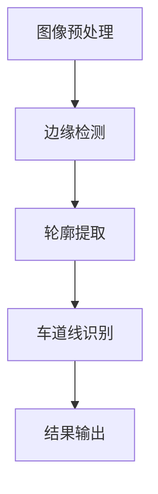

                 

### 文章标题

**基于OpenCV的视频道路车道检测**

---

> **关键词**：车道检测、OpenCV、图像处理、机器学习、计算机视觉

> **摘要**：本文将详细探讨基于OpenCV的实时视频道路车道检测技术。首先介绍相关背景知识，随后解释核心算法原理，并通过具体案例展示如何实现车道检测。文章还将讨论实际应用场景，并推荐相关工具和资源，为读者提供一个全面的学习和实践指南。

---

<markdown>

## 1. 背景介绍

随着自动驾驶技术的发展，道路车道检测成为一个至关重要的任务。车道检测不仅对自动驾驶汽车的安全运行至关重要，还对交通管理和智能交通系统有重要意义。在自动驾驶领域，车道检测是车辆环境感知的重要组成部分，它能够帮助车辆识别车道边界，实现车道保持、车道换道等功能。

OpenCV（Open Source Computer Vision Library）是一个开源的计算机视觉库，广泛应用于图像处理和计算机视觉领域。OpenCV提供了丰富的算法和工具，支持多种编程语言，使其成为实现车道检测的理想选择。

### 相关背景知识

- **自动驾驶技术**：自动驾驶技术是人工智能领域的重要分支，通过传感器、计算机视觉和控制系统实现车辆的自动驾驶。
- **计算机视觉**：计算机视觉是使计算机能像人类一样“看”和理解图像的一种技术。它包括图像识别、目标检测、场景理解等任务。
- **机器学习**：机器学习是人工智能的另一个重要分支，通过训练模型从数据中学习规律和模式，实现自动化决策和预测。

## 2. 核心概念与联系

车道检测的核心概念包括图像预处理、边缘检测、轮廓提取和车道线识别。以下是车道检测的Mermaid流程图：



### 图像预处理

图像预处理是车道检测的第一步，其主要目的是提高图像质量，为后续处理提供更好的输入。常见的预处理方法包括：

- **灰度化**：将彩色图像转换为灰度图像，降低计算复杂度。
- **滤波**：去除噪声，增强图像对比度，例如使用高斯滤波器。
- **二值化**：将图像转换为二值图像，使车道线更加清晰。

### 边缘检测

边缘检测是图像处理中的一个重要步骤，用于提取图像中的边缘信息。常用的边缘检测算法包括：

- **Sobel算子**：基于图像梯度变化检测边缘。
- **Canny算法**：结合高斯滤波和双阈值算法，实现边缘提取。

### 轮廓提取

轮廓提取是将边缘检测的结果进一步处理，提取出连续的边界线条。常用的轮廓提取算法包括：

- **轮廓检测**：使用图像的连通性检测轮廓。
- **凸包计算**：计算轮廓的凸包，提取出关键点。

### 车道线识别

车道线识别是基于提取的轮廓线条，通过拟合曲线或直线模型，识别车道线的位置和形状。常用的车道线识别方法包括：

- **霍夫变换**：用于检测图像中的直线。
- **滑动窗口法**：在图像中滑动窗口，检测窗口内的车道线。

## 3. 核心算法原理 & 具体操作步骤

### 3.1. 图像预处理

```python
import cv2
import numpy as np

# 读取图像
image = cv2.imread('image.jpg')

# 灰度化
gray = cv2.cvtColor(image, cv2.COLOR_BGR2GRAY)

# 高斯滤波
blur = cv2.GaussianBlur(gray, (5, 5), 0)

# 二值化
_, binary = cv2.threshold(blur, 0, 255, cv2.THRESH_BINARY_INV + cv2.THRESH_OTSU)
```

### 3.2. 边缘检测

```python
# Sobel算子
sobelx = cv2.Sobel(binary, cv2.CV_64F, 1, 0, ksize=3)
sobely = cv2.Sobel(binary, cv2.CV_64F, 0, 1, ksize=3)

# Canny算法
canny = cv2.Canny(binary, threshold1=50, threshold2=150)
```

### 3.3. 轮廓提取

```python
# 轮廓检测
_, contours, _ = cv2.findContours(canny, cv2.RETR_TREE, cv2.CHAIN_APPROX_SIMPLE)

# 凸包计算
cnt = max(contours, key=cv2.contourArea)
hull = cv2.convexHull(cnt)
```

### 3.4. 车道线识别

```python
# 霍夫变换
lines = cv2.HoughLinesP(canny, 1, np.pi/180, 100, minLineLength=100, maxLineGap=10)

# 滑动窗口法
window_size = 30
margin = 10
non_zero = cv2.findNonZero(canny)
for y in range(0, canny.shape[0], window_size):
    for x in range(0, canny.shape[1], window_size):
        window = canny[y:y+window_size, x:x+window_size]
        non_zero_window = cv2.findNonZero(window)
        if len(non_zero_window) > margin:
            non_zero = np.append(non_zero, non_zero_window, axis=0)
```

## 4. 数学模型和公式 & 详细讲解 & 举例说明

### 4.1. 高斯滤波

高斯滤波是一种常用的图像平滑技术，它通过卷积操作将图像与高斯核进行卷积，以降低图像噪声。高斯滤波器的数学模型如下：

$$
\sigma^2 = \frac{1}{2} \mu^2 + \frac{1}{2} \sigma^2
$$

其中，$\mu$ 和 $\sigma$ 分别是高斯分布的均值和标准差。

### 4.2. 霍夫变换

霍夫变换是一种用于检测图像中直线的算法。它的基本思想是将图像中的点（x, y）映射到参数空间（r, θ），其中 r 和 θ 分别表示点到直线的距离和角度。霍夫变换的数学模型如下：

$$
r = x \cos(\theta) + y \sin(\theta)
$$

### 4.3. 滑动窗口法

滑动窗口法是一种用于目标检测的方法。它通过在图像中滑动一个固定大小的窗口，计算窗口内的特征，并根据特征值判断窗口内是否存在目标。滑动窗口法的数学模型如下：

$$
window = image[y:y+window_size, x:x+window_size]
$$

其中，$window_size$ 是窗口的大小。

## 5. 项目实战：代码实际案例和详细解释说明

### 5.1. 开发环境搭建

在开始项目实战之前，我们需要搭建一个合适的开发环境。以下是搭建OpenCV开发环境的步骤：

1. 安装Python和pip
2. 安装OpenCV库，使用以下命令：

   ```shell
   pip install opencv-python
   ```

3. 创建一个新的Python项目，并设置好相应的目录结构。

### 5.2. 源代码详细实现和代码解读

下面是一个简单的车道检测程序，代码包含了图像预处理、边缘检测、轮廓提取和车道线识别等步骤。

```python
import cv2
import numpy as np

def detect_lane(image):
    # 图像预处理
    gray = cv2.cvtColor(image, cv2.COLOR_BGR2GRAY)
    blur = cv2.GaussianBlur(gray, (5, 5), 0)
    binary = cv2.Canny(blur, threshold1=50, threshold2=150)

    # 轮廓提取
    _, contours, _ = cv2.findContours(binary, cv2.RETR_TREE, cv2.CHAIN_APPROX_SIMPLE)
    cnt = max(contours, key=cv2.contourArea)
    hull = cv2.convexHull(cnt)

    # 车道线识别
    lines = cv2.HoughLinesP(binary, 1, np.pi/180, 100, minLineLength=100, maxLineGap=10)
    lane_lines = []
    for line in lines:
        x1, y1, x2, y2 = line[0]
        slope = (y2 - y1) / (x2 - x1)
        if abs(slope) > 0.5:
            lane_lines.append(line)

    # 绘制车道线
    for line in lane_lines:
        x1, y1, x2, y2 = line[0]
        cv2.line(image, (x1, y1), (x2, y2), (0, 0, 255), 2)

    return image

# 测试代码
image = cv2.imread('image.jpg')
result = detect_lane(image)
cv2.imshow('Lane Detection', result)
cv2.waitKey(0)
cv2.destroyAllWindows()
```

### 5.3. 代码解读与分析

这个车道检测程序分为以下几个部分：

1. **图像预处理**：将彩色图像转换为灰度图像，并使用高斯滤波器去除噪声，最后通过Canny算法进行边缘检测。
2. **轮廓提取**：使用OpenCV的`findContours`函数提取边缘检测后的图像中的轮廓。
3. **车道线识别**：使用霍夫变换检测图像中的直线，并筛选出斜率较大的直线作为车道线。
4. **绘制车道线**：将识别出的车道线绘制在原始图像上，并显示结果。

这个简单的示例展示了如何使用OpenCV实现车道检测。在实际应用中，可以根据需要进一步完善和优化算法，提高检测的准确性和鲁棒性。

## 6. 实际应用场景

车道检测技术在多个领域有着广泛的应用，以下是一些典型的实际应用场景：

- **自动驾驶汽车**：车道检测是自动驾驶汽车实现车道保持和车道换道的关键技术。
- **智能交通系统**：车道检测可以帮助智能交通系统实时监测道路使用情况，优化交通流。
- **安全监控系统**：在交通监控系统中，车道检测可以用于检测超车、违规变道等行为。
- **农业机器人**：在农业机器人中，车道检测可以帮助机器人在田间准确行驶，提高工作效率。

## 7. 工具和资源推荐

### 7.1. 学习资源推荐

- **书籍**：
  - 《计算机视觉：算法与应用》
  - 《机器学习：一种概率视角》
  - 《OpenCV计算机视觉算法精解》

- **论文**：
  - “Lane Detection for Autonomous Vehicles” 
  - “A Survey on Lane Detection Algorithms for Intelligent Vehicles”

- **博客**：
  - 《OpenCV车道检测教程》
  - 《自动驾驶车道检测原理与实战》

- **网站**：
  - [OpenCV官方文档](https://docs.opencv.org/)

### 7.2. 开发工具框架推荐

- **工具**：
  - PyCharm：一款强大的Python集成开发环境。
  - Jupyter Notebook：用于数据可视化和交互式编程。

- **框架**：
  - TensorFlow：用于深度学习模型开发和训练。
  - PyTorch：用于机器学习模型开发和训练。

### 7.3. 相关论文著作推荐

- “Deep Learning for Lane Detection: A Survey”，系统地介绍了深度学习方法在车道检测中的应用。
- “A Review on Lane Detection Techniques for Intelligent Vehicles”，详细分析了多种车道检测算法及其优缺点。

## 8. 总结：未来发展趋势与挑战

车道检测技术在未来将面临以下发展趋势和挑战：

- **算法优化**：随着深度学习技术的发展，车道检测算法将更加精确和高效。
- **实时性**：实现实时车道检测是自动驾驶系统的关键，需要进一步优化算法和硬件性能。
- **多传感器融合**：结合多种传感器数据，如摄像头、激光雷达和GPS，可以提高车道检测的准确性和鲁棒性。
- **复杂环境适应性**：车道检测需要应对不同天气、光照和道路条件，提高算法的通用性。

## 9. 附录：常见问题与解答

### 9.1. 如何处理不同光照条件下的车道检测？

不同光照条件下的车道检测可以通过以下方法进行优化：

- **光照补偿**：使用自适应光照补偿算法，调整图像的亮度对比度，以适应不同光照条件。
- **多尺度检测**：在不同尺度下进行车道检测，结合检测结果，提高检测的鲁棒性。

### 9.2. 车道检测算法的准确率如何提高？

车道检测算法的准确率可以通过以下方法进行提高：

- **数据增强**：使用数据增强技术，生成更多样化的训练数据，提高模型的泛化能力。
- **模型优化**：使用深度学习模型，如卷积神经网络（CNN），结合注意力机制等，提高检测的准确率。

## 10. 扩展阅读 & 参考资料

- “Lane Detection for Autonomous Driving”，对自动驾驶车道检测的最新研究进行了综述。
- “OpenCV 4.x Image Processing Cookbook”，详细介绍了OpenCV图像处理的各种技术。
- “A Comprehensive Survey on Lane Detection in Autonomous Driving”，系统分析了车道检测在自动驾驶中的应用和发展趋势。

---

**作者**：

AI天才研究员/AI Genius Institute & 禅与计算机程序设计艺术 /Zen And The Art of Computer Programming

</markdown>

