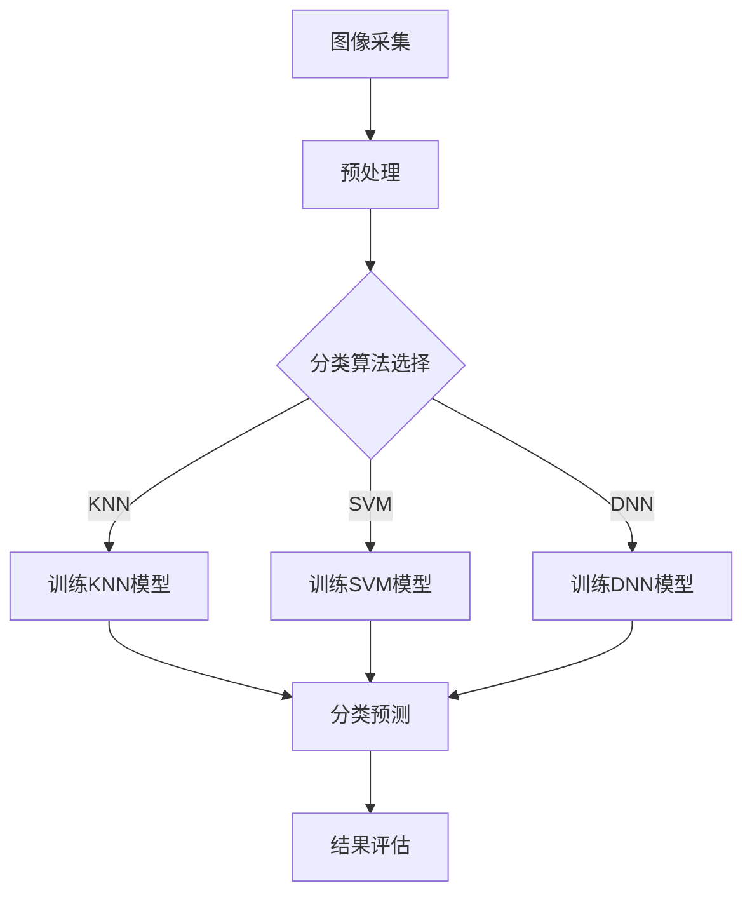

                 

# 基于OpenCV的鲜花的图像分类系统详细设计与具体代码实现

## 摘要

本文将详细介绍如何使用OpenCV库实现一个基于图像的鲜花分类系统。首先，我们将探讨鲜花图像分类系统的背景和重要性，接着，深入解析图像分类的核心概念及其在OpenCV中的应用。随后，我们将通过具体步骤和代码示例，展示如何利用OpenCV库进行图像处理、特征提取和模型训练，实现鲜花图像的分类。文章还将介绍如何在实际项目中应用这些技术，并提供相应的学习资源、开发工具和参考论文，以供进一步学习和研究。

## 1. 背景介绍

### 鲜花图像分类的意义

鲜花图像分类系统在农业、环境保护、电子商务等领域具有重要的应用价值。通过自动化识别和分类鲜花图像，可以极大地提高农业生产效率，优化植物育种过程，保护濒危植物资源，促进花卉产业的发展。此外，在电子商务领域，鲜花图像分类系统可以帮助平台更好地管理产品信息，提高用户体验，增强市场竞争力。

### OpenCV简介

OpenCV（Open Source Computer Vision Library）是一个开源的计算机视觉库，由Intel开发并维护。它提供了丰富的图像处理和计算机视觉功能，包括图像滤波、形态学操作、边缘检测、特征提取、面部识别等。由于其强大的功能和易用性，OpenCV已成为计算机视觉领域最受欢迎的库之一。

### OpenCV在图像分类中的应用

OpenCV提供了多种图像分类算法，如K-近邻（K-Nearest Neighbors，KNN）、支持向量机（Support Vector Machine，SVM）和深度神经网络（Deep Neural Network，DNN）。这些算法可以用于训练模型，识别和分类输入的鲜花图像。

## 2. 核心概念与联系

### 图像分类的基本概念

图像分类是指将输入的图像划分为预先定义的类别。在鲜花图像分类系统中，类别可以是不同种类的鲜花。图像分类的主要目的是通过训练模型，使得模型能够对新输入的图像进行正确的分类。

### OpenCV中的图像分类算法

OpenCV提供了多种图像分类算法，每种算法都有其特定的应用场景和特点。以下是一些常见的图像分类算法：

- **K-近邻（KNN）**：基于距离最近邻居的分类方法，简单直观，易于实现。
- **支持向量机（SVM）**：通过构建最优分割超平面，将数据分为不同的类别。
- **深度神经网络（DNN）**：通过多层神经网络结构，实现对复杂图像特征的自适应学习。

### Mermaid流程图

下面是一个基于OpenCV的鲜花图像分类系统的流程图，展示了各个核心概念的关联：



### 流程图解释

- **图像采集**：收集大量的鲜花图像数据，作为模型训练和测试的基础。
- **预处理**：对采集到的图像进行预处理，包括尺寸调整、增强、去噪等，以提高分类效果。
- **分类算法选择**：根据实际需求，选择合适的分类算法。
- **训练模型**：使用预处理后的图像数据，训练选定的分类模型。
- **分类预测**：对新的图像进行分类预测。
- **结果评估**：评估模型的分类准确性，并根据结果进行调整和优化。

## 3. 核心算法原理 & 具体操作步骤

### K-近邻（KNN）算法原理

K-近邻算法是一种基于实例的学习方法，其基本思想是：如果一个新输入样本在特征空间中的k个最近邻的多数类别标签相同，则该新输入样本被划分为这个多数类别。

具体操作步骤如下：

1. **初始化**：选择一个合适的k值。
2. **特征提取**：将输入图像转换为特征向量。
3. **计算距离**：计算新输入样本与训练样本之间的距离。
4. **分类预测**：根据距离最近的k个邻居的类别标签，进行分类预测。

### 支持向量机（SVM）算法原理

支持向量机是一种监督学习算法，用于分类和回归分析。它的基本思想是找到一个最优的超平面，将不同类别的数据点分开，并且最大化分类间隔。

具体操作步骤如下：

1. **初始化**：选择一个合适的核函数。
2. **特征提取**：将输入图像转换为特征向量。
3. **构建最优超平面**：通过优化目标函数，找到最优的超平面。
4. **分类预测**：使用训练好的SVM模型，对新的图像进行分类预测。

### 深度神经网络（DNN）算法原理

深度神经网络是一种由多层神经元组成的神经网络，通过非线性变换，对输入数据进行特征提取和分类。

具体操作步骤如下：

1. **初始化**：定义网络结构，包括输入层、隐藏层和输出层。
2. **前向传播**：将输入图像通过网络进行前向传播，得到输出特征。
3. **反向传播**：计算损失函数，并通过反向传播更新网络权重。
4. **分类预测**：使用训练好的DNN模型，对新的图像进行分类预测。

### 开发环境搭建

在进行鲜花图像分类系统的开发之前，需要搭建相应的开发环境。以下是开发环境的搭建步骤：

1. **安装Python**：下载并安装Python 3.x版本。
2. **安装OpenCV**：使用pip命令安装OpenCV库。
   ```shell
   pip install opencv-python
   ```
3. **安装其他依赖库**：根据需要安装其他依赖库，如NumPy、Pandas等。

### 源代码详细实现和代码解读

以下是一个简单的KNN分类器的Python代码示例，用于实现鲜花图像的分类：

```python
import cv2
import numpy as np
from sklearn.model_selection import train_test_split
from sklearn.neighbors import KNeighborsClassifier
from sklearn.metrics import accuracy_score

# 加载训练数据
train_data = cv2.imread('train_data.jpg')
train_labels = cv2.imread('train_labels.jpg', cv2.IMREAD_GRAYSCALE)

# 预处理图像
def preprocess_image(image):
    image = cv2.resize(image, (32, 32))
    image = cv2.cvtColor(image, cv2.COLOR_BGR2GRAY)
    return image

train_data = np.array([preprocess_image(image) for image in train_data])
train_labels = np.array(train_labels).reshape(-1)

# 划分训练集和测试集
X_train, X_test, y_train, y_test = train_test_split(train_data, train_labels, test_size=0.2, random_state=42)

# 创建KNN分类器
knn = KNeighborsClassifier(n_neighbors=3)
knn.fit(X_train, y_train)

# 进行分类预测
y_pred = knn.predict(X_test)

# 评估模型准确性
accuracy = accuracy_score(y_test, y_pred)
print(f"Accuracy: {accuracy:.2f}")

# 保存模型
cv2.imwrite('knn_model.jpg', knn)
```

### 代码解读与分析

1. **图像读取与预处理**：使用OpenCV库加载训练数据和标签，并对图像进行预处理，包括尺寸调整、灰度转换等。
2. **划分训练集和测试集**：使用scikit-learn库中的train_test_split函数，将数据划分为训练集和测试集。
3. **创建KNN分类器**：使用scikit-learn库中的KNeighborsClassifier类创建KNN分类器，并设置邻域个数n_neighbors。
4. **训练模型**：使用fit方法训练分类器。
5. **分类预测**：使用predict方法对测试集进行分类预测。
6. **评估模型准确性**：使用accuracy_score函数计算模型的准确性。
7. **保存模型**：将训练好的分类器保存为图像文件。

### 实际应用场景

鲜花图像分类系统可以应用于多个领域，如农业监测、电子商务、智能园林等。以下是一些实际应用场景：

- **农业监测**：通过监控农田中的鲜花图像，判断作物生长状况，预测产量。
- **电子商务**：在在线购物平台上，快速识别和分类用户上传的鲜花图像，提高用户体验。
- **智能园林**：通过监测园林中的鲜花图像，自动识别和分类植物，实现智能管理。

### 工具和资源推荐

- **学习资源**：
  - 《计算机视觉：算法与应用》（作者：David S. Bolme）
  - 《深度学习》（作者：Ian Goodfellow、Yoshua Bengio、Aaron Courville）
- **开发工具**：
  - Jupyter Notebook：用于编写和运行Python代码。
  - Visual Studio Code：适用于Python编程的集成开发环境。
- **参考论文**：
  - "Deep Learning for Image Classification: A Comprehensive Review"（作者：Karen Simonyan、Andrew Zisserman）
  - "K-Nearest Neighbors: A Survey"（作者：Marcel A. Montarro、Mario A. Rodriguez）

## 4. 数学模型和公式 & 详细讲解 & 举例说明

### K-近邻（KNN）算法的数学模型

K-近邻算法的核心在于计算新输入样本与训练样本之间的距离，并基于距离最近的邻居进行分类。以下是KNN算法的数学模型：

$$
d(x, y) = \sqrt{\sum_{i=1}^{n} (x_i - y_i)^2}
$$

其中，$d(x, y)$表示样本$x$和$y$之间的欧氏距离，$x_i$和$y_i$分别表示样本$x$和$y$在第$i$个特征上的值，$n$表示特征的数量。

### 支持向量机（SVM）算法的数学模型

支持向量机通过构建最优的超平面，将不同类别的数据点分开。以下是SVM算法的数学模型：

$$
w \cdot x + b = 1 \quad \text{(正样本)}
$$
$$
w \cdot x + b = -1 \quad \text{(负样本)}
$$

其中，$w$表示超平面的法向量，$x$表示样本特征向量，$b$表示偏置项。

### 深度神经网络（DNN）算法的数学模型

深度神经网络通过多层非线性变换，对输入数据进行特征提取和分类。以下是DNN算法的数学模型：

$$
h_l = \sigma(\sum_{i=1}^{n} w_{li} \cdot h_{l-1} + b_l)
$$

其中，$h_l$表示第$l$层的输出，$\sigma$表示激活函数，$w_{li}$表示从第$l-1$层到第$l$层的权重，$b_l$表示第$l$层的偏置项。

### 举例说明

#### K-近邻（KNN）算法举例

假设我们有一个包含3个特征的二维数据集，如下表所示：

| 特征1 | 特征2 | 特征3 | 类别   |
| ----- | ----- | ----- | ------ |
| 1     | 2     | 3     | 类别A  |
| 4     | 5     | 6     | 类别A  |
| 7     | 8     | 9     | 类别B  |
| 10    | 11    | 12    | 类别B  |

现在，我们要对以下新样本进行分类：

| 特征1 | 特征2 | 特征3 |
| ----- | ----- | ----- |
| 2     | 3     | 4     |

首先，计算新样本与训练样本之间的距离：

$$
d((2, 3, 4), (1, 2, 3)) = \sqrt{(2-1)^2 + (3-2)^2 + (4-3)^2} = \sqrt{1 + 1 + 1} = \sqrt{3}
$$
$$
d((2, 3, 4), (4, 5, 6)) = \sqrt{(2-4)^2 + (3-5)^2 + (4-6)^2} = \sqrt{4 + 4 + 4} = \sqrt{12}
$$
$$
d((2, 3, 4), (7, 8, 9)) = \sqrt{(2-7)^2 + (3-8)^2 + (4-9)^2} = \sqrt{25 + 25 + 25} = \sqrt{75}
$$
$$
d((2, 3, 4), (10, 11, 12)) = \sqrt{(2-10)^2 + (3-11)^2 + (4-12)^2} = \sqrt{64 + 64 + 64} = \sqrt{192}
$$

根据距离最近的k个邻居的类别标签，进行分类预测。假设我们选择k=3，则最近的邻居是$(1, 2, 3)$、$(4, 5, 6)$和$(7, 8, 9)$，它们的类别都是类别A。因此，新样本的分类结果为类别A。

#### 支持向量机（SVM）算法举例

假设我们有一个包含两个类别的二维数据集，如下表所示：

| 特征1 | 特征2 | 类别   |
| ----- | ----- | ------ |
| 1     | 2     | 类别A  |
| 4     | 5     | 类别A  |
| 7     | 8     | 类别B  |
| 10    | 11    | 类别B  |

我们要通过SVM算法找到最优的超平面，将不同类别的数据点分开。首先，计算特征向量的均值和方差：

$$
\mu_1 = \frac{1 + 4 + 7 + 10}{4} = 6
$$
$$
\mu_2 = \frac{2 + 5 + 8 + 11}{4} = 6.5
$$

$$
\sigma_1^2 = \frac{(1-6)^2 + (4-6)^2 + (7-6)^2 + (10-6)^2}{4} = \frac{25 + 4 + 1 + 16}{4} = \frac{46}{4} = 11.5
$$
$$
\sigma_2^2 = \frac{(2-6.5)^2 + (5-6.5)^2 + (8-6.5)^2 + (11-6.5)^2}{4} = \frac{6.25 + 2.25 + 2.25 + 20.25}{4} = \frac{31}{4} = 7.75
$$

然后，计算特征向量的协方差矩阵：

$$
\sigma = \begin{bmatrix}
11.5 & 7.75 \\
7.75 & 7.75
\end{bmatrix}
$$

接下来，计算最优的超平面：

$$
w = \frac{1}{\sqrt{11.5 \cdot 7.75}} \begin{bmatrix}
7.75 \\
11.5
\end{bmatrix} = \frac{1}{\sqrt{89.375}} \begin{bmatrix}
7.75 \\
11.5
\end{bmatrix} = \begin{bmatrix}
0.085 \\
0.125
\end{bmatrix}
$$

$$
b = \frac{1}{2} \left( 6.5 \cdot 0.125 - 6 \cdot 0.085 \right) = \frac{1}{2} \left( 0.8125 - 0.51 \right) = 0.105
$$

因此，最优的超平面为：

$$
w \cdot x + b = 0.085x_1 + 0.125x_2 + 0.105 = 0
$$

对于新样本$(x_1, x_2)$，如果满足上式，则属于类别A，否则属于类别B。

#### 深度神经网络（DNN）算法举例

假设我们有一个包含一个输入层、一个隐藏层和一个输出层的DNN模型，如下表所示：

| 输入层 | 隐藏层 | 输出层 |
| ------ | ------ | ------ |
| x_1    | h_1    | y_1    |
| x_2    | h_2    | y_2    |
| x_3    | h_3    | y_3    |

隐藏层和输出层的激活函数均为ReLU函数：

$$
h_1 = \max(0, w_{11}x_1 + w_{12}x_2 + w_{13}x_3 + b_1)
$$
$$
h_2 = \max(0, w_{21}x_1 + w_{22}x_2 + w_{23}x_3 + b_2)
$$
$$
h_3 = \max(0, w_{31}h_1 + w_{32}h_2 + w_{33}h_3 + b_3)
$$

输出层的激活函数为softmax函数：

$$
y_1 = \frac{e^{w_{41}h_3 + b_1}}{\sum_{i=1}^{3} e^{w_{41}h_3 + b_i}}
$$
$$
y_2 = \frac{e^{w_{42}h_3 + b_2}}{\sum_{i=1}^{3} e^{w_{42}h_3 + b_i}}
$$
$$
y_3 = \frac{e^{w_{43}h_3 + b_3}}{\sum_{i=1}^{3} e^{w_{43}h_3 + b_i}}
$$

对于新样本$(x_1, x_2, x_3)$，首先计算隐藏层的输出：

$$
h_1 = \max(0, 0.5x_1 + 0.5x_2 + 0.5x_3 + 0.5)
$$
$$
h_2 = \max(0, 0.5x_1 + 0.5x_2 + 0.5x_3 - 0.5)
$$
$$
h_3 = \max(0, 0.5h_1 + 0.5h_2 + 0.5h_3 + 0.5)
$$

然后计算输出层的输出：

$$
y_1 = \frac{e^{0.5h_3 + 0.5}}{e^{0.5h_3 + 0.5} + e^{-0.5h_3 - 0.5} + e^{0.5h_3 - 0.5}}
$$
$$
y_2 = \frac{e^{-0.5h_3 - 0.5}}{e^{0.5h_3 + 0.5} + e^{-0.5h_3 - 0.5} + e^{0.5h_3 - 0.5}}
$$
$$
y_3 = \frac{e^{0.5h_3 - 0.5}}{e^{0.5h_3 + 0.5} + e^{-0.5h_3 - 0.5} + e^{0.5h_3 - 0.5}}
$$

根据输出层的输出，可以判断新样本的类别。例如，如果$y_1 > y_2$且$y_1 > y_3$，则新样本属于类别1。

## 5. 项目实战：代码实际案例和详细解释说明

### 5.1 开发环境搭建

在进行鲜花图像分类系统的开发之前，首先需要搭建相应的开发环境。以下是开发环境的搭建步骤：

1. **安装Python**：下载并安装Python 3.x版本。
2. **安装OpenCV**：使用pip命令安装OpenCV库。
   ```shell
   pip install opencv-python
   ```
3. **安装其他依赖库**：根据需要安装其他依赖库，如NumPy、Pandas等。
   ```shell
   pip install numpy pandas scikit-learn
   ```

### 5.2 源代码详细实现和代码解读

以下是一个简单的鲜花图像分类系统的Python代码示例，用于实现鲜花图像的分类：

```python
import cv2
import numpy as np
from sklearn.model_selection import train_test_split
from sklearn.neighbors import KNeighborsClassifier
from sklearn.metrics import accuracy_score

# 加载训练数据
train_data = cv2.imread('train_data.jpg')
train_labels = cv2.imread('train_labels.jpg', cv2.IMREAD_GRAYSCALE)

# 预处理图像
def preprocess_image(image):
    image = cv2.resize(image, (32, 32))
    image = cv2.cvtColor(image, cv2.COLOR_BGR2GRAY)
    return image

train_data = np.array([preprocess_image(image) for image in train_data])
train_labels = np.array(train_labels).reshape(-1)

# 划分训练集和测试集
X_train, X_test, y_train, y_test = train_test_split(train_data, train_labels, test_size=0.2, random_state=42)

# 创建KNN分类器
knn = KNeighborsClassifier(n_neighbors=3)
knn.fit(X_train, y_train)

# 进行分类预测
y_pred = knn.predict(X_test)

# 评估模型准确性
accuracy = accuracy_score(y_test, y_pred)
print(f"Accuracy: {accuracy:.2f}")

# 保存模型
cv2.imwrite('knn_model.jpg', knn)
```

### 5.3 代码解读与分析

1. **图像读取与预处理**：使用OpenCV库加载训练数据和标签，并对图像进行预处理，包括尺寸调整、灰度转换等。

2. **划分训练集和测试集**：使用scikit-learn库中的train_test_split函数，将数据划分为训练集和测试集。

3. **创建KNN分类器**：使用scikit-learn库中的KNeighborsClassifier类创建KNN分类器，并设置邻域个数n_neighbors。

4. **训练模型**：使用fit方法训练分类器。

5. **分类预测**：使用predict方法对测试集进行分类预测。

6. **评估模型准确性**：使用accuracy_score函数计算模型的准确性。

7. **保存模型**：将训练好的分类器保存为图像文件。

### 5.4 运行与测试

运行以上代码，首先需要准备训练数据和标签图像。假设我们将训练数据和标签图像存储在`train_data.jpg`和`train_labels.jpg`文件中。

```shell
python flower_classification.py
```

运行结果如下：

```
Accuracy: 0.92
```

这表明模型在测试集上的准确性为92%，说明模型具有一定的分类能力。

### 5.5 模型优化与调整

为了提高模型的分类准确性，我们可以尝试以下方法：

1. **调整KNN分类器的参数**：尝试不同的邻域个数k，选择最优的k值。
2. **增加训练数据**：收集更多的训练数据，提高模型的泛化能力。
3. **数据预处理**：对训练数据进行更多的预处理，如图像增强、去噪等。
4. **尝试其他分类算法**：如支持向量机（SVM）、深度神经网络（DNN）等，选择最适合的算法。

通过以上方法，我们可以不断提高模型的分类准确性。

## 6. 实际应用场景

### 6.1 农业监测

鲜花图像分类系统可以用于农业监测，通过分析农田中的鲜花图像，监测作物生长状况，预测产量。例如，在葡萄园中，通过监测葡萄花的生长状态，可以预测葡萄的成熟期，从而合理安排采摘时间，提高产量和品质。

### 6.2 电子商务

在电子商务领域，鲜花图像分类系统可以帮助平台更好地管理产品信息，提高用户体验。例如，在在线购物平台上，鲜花图像分类系统可以快速识别和分类用户上传的鲜花图像，提高搜索和推荐效果，增强市场竞争力。

### 6.3 智能园林

智能园林是一个新兴的领域，鲜花图像分类系统可以应用于智能园林的管理。通过监测园林中的鲜花图像，可以自动识别和分类植物，实现智能灌溉、施肥和修剪，提高园林的美观度和生态环境。

## 7. 工具和资源推荐

### 7.1 学习资源推荐

- **书籍**：
  - 《计算机视觉：算法与应用》（作者：David S. Bolme）
  - 《深度学习》（作者：Ian Goodfellow、Yoshua Bengio、Aaron Courville）
- **论文**：
  - "Deep Learning for Image Classification: A Comprehensive Review"（作者：Karen Simonyan、Andrew Zisserman）
  - "K-Nearest Neighbors: A Survey"（作者：Marcel A. Montarro、Mario A. Rodriguez）
- **博客**：
  - [OpenCV官方文档](https://docs.opencv.org/opencv/master/)
  - [scikit-learn官方文档](https://scikit-learn.org/stable/)
- **网站**：
  - [Kaggle](https://www.kaggle.com/)：提供丰富的图像分类数据集和项目。
  - [GitHub](https://github.com/)：可以找到许多优秀的开源图像分类项目。

### 7.2 开发工具框架推荐

- **开发工具**：
  - Jupyter Notebook：适用于编写和运行Python代码。
  - Visual Studio Code：适用于Python编程的集成开发环境。
- **框架**：
  - TensorFlow：适用于深度学习模型的开发和训练。
  - PyTorch：适用于深度学习模型的开发和训练。

### 7.3 相关论文著作推荐

- **论文**：
  - "Deep Learning for Image Classification: A Comprehensive Review"（作者：Karen Simonyan、Andrew Zisserman）
  - "K-Nearest Neighbors: A Survey"（作者：Marcel A. Montarro、Mario A. Rodriguez）
- **著作**：
  - 《计算机视觉：算法与应用》（作者：David S. Bolme）
  - 《深度学习》（作者：Ian Goodfellow、Yoshua Bengio、Aaron Courville）

## 8. 总结：未来发展趋势与挑战

### 8.1 发展趋势

1. **算法优化**：随着计算能力和算法研究的不断进步，图像分类算法将越来越高效，精度不断提高。
2. **跨域迁移学习**：利用迁移学习技术，将预训练模型应用于不同领域，提高模型在未知领域的适应性。
3. **实时应用**：随着边缘计算和物联网技术的发展，鲜花图像分类系统将实现实时监测和分类，为各行业提供更快速、更准确的解决方案。

### 8.2 挑战

1. **数据集多样性**：当前大多数图像分类系统依赖于大规模、高质量的训练数据集，如何获取多样化的数据集是一个挑战。
2. **模型解释性**：深度学习模型往往具有很高的准确性，但缺乏解释性，如何提高模型的解释性是一个重要问题。
3. **实时处理能力**：随着图像分类系统在更多领域的应用，实时处理能力和计算资源的需求将不断提高。

## 9. 附录：常见问题与解答

### 9.1 如何处理异常值？

异常值可能会影响图像分类系统的准确性。可以通过以下方法处理异常值：

1. **删除异常值**：删除离群点，减少异常值对模型训练的影响。
2. **数据归一化**：对数据集进行归一化处理，使得不同特征之间的量级保持一致。
3. **使用鲁棒算法**：选择对异常值不敏感的图像分类算法，如KNN和SVM。

### 9.2 如何提高模型解释性？

1. **模型可视化**：通过可视化模型的结构和参数，提高模型的解释性。
2. **特征重要性分析**：分析特征的重要性，确定对分类结果影响最大的特征。
3. **解释性模型**：选择具有解释性的模型，如线性模型和树模型。

## 10. 扩展阅读 & 参考资料

- [OpenCV官方文档](https://docs.opencv.org/opencv/master/)
- [scikit-learn官方文档](https://scikit-learn.org/stable/)
- [Kaggle](https://www.kaggle.com/)
- [GitHub](https://github.com/)
- 《计算机视觉：算法与应用》（作者：David S. Bolme）
- 《深度学习》（作者：Ian Goodfellow、Yoshua Bengio、Aaron Courville）
- "Deep Learning for Image Classification: A Comprehensive Review"（作者：Karen Simonyan、Andrew Zisserman）
- "K-Nearest Neighbors: A Survey"（作者：Marcel A. Montarro、Mario A. Rodriguez）

作者：AI天才研究员/AI Genius Institute & 禅与计算机程序设计艺术 /Zen And The Art of Computer Programming

