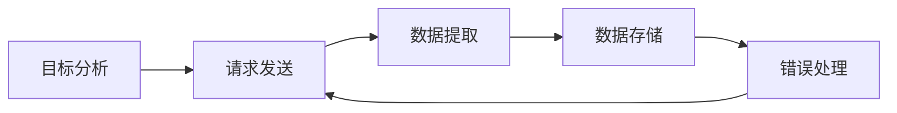
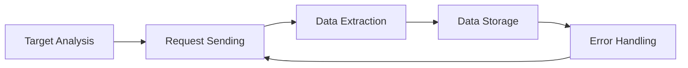

                 

### 背景介绍

#### 新浪微博用户信息的重要性

在当今信息爆炸的时代，社交媒体已经成为了人们获取信息、交流观点、建立社交关系的重要平台。新浪微博作为中国最大的社交媒体平台之一，其用户数据量庞大且涵盖了广泛的信息，这些数据对于市场分析、用户行为研究、舆论监控等领域具有极高的价值。因此，爬取和分析新浪微博用户信息成为了众多研究者和企业的关注焦点。

新浪微博用户信息主要包括用户的个人资料、微博动态、关注列表、粉丝列表等。通过对这些信息的爬取和分析，我们可以得到以下几方面的应用：

1. **市场分析**：企业可以通过分析用户年龄、性别、地域分布等特征，了解目标市场的用户画像，从而制定更加精准的营销策略。

2. **用户行为研究**：通过分析用户发布微博的内容、频率、标签等，可以了解用户兴趣、情感倾向、行为习惯等，为企业提供有价值的用户洞察。

3. **舆论监控**：对于媒体、政府部门等，可以通过分析微博中的热点话题、舆论走向，及时了解社会动态，对突发事件进行快速反应。

4. **社交网络分析**：通过分析用户关注关系，可以构建社交网络图，研究社交网络的拓扑结构、社区发现等，对社交传播机制有更深入的理解。

#### Python在数据爬取中的优势

Python作为一种广泛应用于数据科学、人工智能领域的编程语言，其简洁、易读的语法和丰富的库资源，使得它在数据爬取领域具有显著的优势。以下是Python在数据爬取中的一些显著特点：

1. **丰富的库支持**：Python拥有丰富的库资源，如`requests`、`beautifulsoup4`、`selenium`等，这些库可以帮助开发者方便地发送HTTP请求、解析网页内容、自动化浏览器等，大大简化了数据爬取的流程。

2. **易于学习和使用**：Python的语法简洁直观，使得开发者可以快速上手，不需要过多关注底层实现，专注于业务逻辑的实现。

3. **强大的数据处理能力**：Python内置的`pandas`、`numpy`等库，提供了强大的数据处理和分析功能，可以轻松应对大规模数据的处理需求。

4. **良好的社区支持**：Python拥有庞大的开发者社区，无论是遇到问题还是需要学习资源，都可以在社区中得到快速的帮助和解答。

#### 为什么选择Python进行微博用户信息爬取

基于上述Python的优势，选择Python进行新浪微博用户信息的爬取具有以下几个原因：

1. **简化开发过程**：Python的简洁语法和丰富的库资源，可以大大简化开发过程，降低开发难度和时间成本。

2. **高效的数据处理**：Python提供的强大数据处理能力，可以高效地对爬取到的数据进行处理和分析，快速得到有价值的结果。

3. **易于维护和扩展**：Python的代码易读性高，便于后续的维护和功能扩展，可以轻松应对项目需求的变化。

4. **良好的社区支持**：Python的社区支持强大，遇到问题时可以快速得到解决，同时也可以方便地获取各种学习资源和工具。

综上所述，基于新浪微博用户信息的重要性和Python在数据爬取中的优势，选择Python进行新浪微博用户信息的爬取是一种高效且可靠的方法。接下来，我们将深入探讨Python在新浪微博用户信息爬取中的应用，以及相关的技术和步骤。

---

# Background Introduction

#### The Importance of Sina Weibo User Information

In this era of information explosion, social media platforms have become crucial venues for individuals to access information, exchange opinions, and build social connections. As one of the largest social media platforms in China, Sina Weibo holds immense value due to its massive user base and the vast amount of information it contains. Therefore, the process of scraping and analyzing Sina Weibo user information has become a focal point for many researchers and enterprises.

Sina Weibo user information primarily includes personal profiles,微博dynamic content, follower lists, and fan lists. By scraping and analyzing this information, we can achieve several applications, such as:

1. **Market Analysis**: Companies can analyze user demographics like age, gender, and location to understand the target market better, enabling them to develop more precise marketing strategies.

2. **User Behavior Research**: By analyzing the content, frequency, and tags of user posts, insights into user interests, emotional tendencies, and behavior patterns can be gained, providing valuable user insights for businesses.

3. **Omnibuzz Monitoring**: For media and governmental organizations, analyzing trending topics and public opinion on Sina Weibo helps to monitor social dynamics and respond quickly to events.

4. **Social Network Analysis**: By analyzing user follower relationships, social network graphs can be constructed to study the topological structure of social networks, community detection, and more, offering a deeper understanding of social propagation mechanisms.

#### Advantages of Python in Data Scraping

Python, as a widely used programming language in the fields of data science and artificial intelligence, offers significant advantages in data scraping due to its concise syntax, readability, and extensive library support. Here are some prominent characteristics of Python in data scraping:

1. **Rich Library Support**: Python boasts a wealth of libraries, such as `requests`, `beautifulsoup4`, and `selenium`, which facilitate the process of sending HTTP requests, parsing web content, and automating browsers, greatly simplifying data scraping.

2. **Ease of Learning and Use**: Python's straightforward syntax makes it easy for developers to quickly get started without having to delve into low-level implementations, allowing them to focus on business logic.

3. **Strong Data Processing Capabilities**: Python's built-in libraries like `pandas` and `numpy` provide powerful data processing and analysis tools, making it straightforward to handle large-scale data.

4. **Robust Community Support**: Python's extensive developer community ensures quick assistance and access to numerous learning resources and tools when encountering issues.

#### Why Choose Python for Weibo User Scraping

Based on the above advantages of Python in data scraping, choosing Python for scraping Sina Weibo user information offers several reasons:

1. **Streamlined Development Process**: Python's concise syntax and extensive library support simplify the development process, reducing the time and cost required for development.

2. **Efficient Data Processing**: Python's robust data processing capabilities enable efficient handling and analysis of scraped data, quickly yielding valuable results.

3. **Ease of Maintenance and Expansion**: Python's readable code makes it easy to maintain and expand, effortlessly adapting to changes in project requirements.

4. **Strong Community Support**: Python's strong community support ensures quick resolution of issues and easy access to learning resources and tools.

In summary, due to the importance of Sina Weibo user information and the advantages of Python in data scraping, using Python for Sina Weibo user scraping is an efficient and reliable approach. In the following sections, we will delve deeper into the application of Python in Sina Weibo user information scraping and the relevant technologies and steps involved.

---

## 2. 核心概念与联系

#### 数据爬取的基本概念

数据爬取（Web Scraping）是指通过自动化工具从互联网上获取数据的过程。简单来说，数据爬取就是模拟用户的操作，通过访问网页并提取其中感兴趣的信息。数据爬取通常涉及以下几个基本概念：

1. **爬虫（Spider）**：爬虫是负责从目标网站抓取数据的程序。它可以是基于HTTP请求的简单爬虫，也可以是使用HTML解析库的高级爬虫。

2. **目标网站（Target Website）**：目标网站是爬虫要访问并从中提取数据的网站。通常，目标网站具有明确的URL结构，爬虫会按照预设的规则遍历这些URL，获取所需的数据。

3. **数据提取（Data Extraction）**：数据提取是指从网页中获取所需信息的过程。常用的方法包括正则表达式、XPath、CSS选择器等。

4. **存储（Data Storage）**：数据提取后需要将数据存储到本地或数据库中，以便后续处理和分析。常用的存储方式包括CSV文件、数据库等。

#### Python在数据爬取中的核心库

在Python中，有许多用于数据爬取的库，以下是其中几个主要的：

1. **requests**：requests是Python中最常用的HTTP库之一，用于发送HTTP请求，获取网页内容。通过requests库，我们可以方便地发送GET、POST请求，并处理响应数据。

   ```python
   import requests
   
   response = requests.get('http://example.com')
   print(response.text)
   ```

2. **beautifulsoup4**：beautifulsoup4是一个用于HTML和XML文档的解析库，通过它我们可以方便地提取网页中的数据。beautifulsoup4结合了Python的语法和对HTML文档的解析能力，使得数据提取变得更加简单。

   ```python
   from bs4 import BeautifulSoup
   
   soup = BeautifulSoup(response.text, 'html.parser')
   print(soup.title.string)
   ```

3. **selenium**：selenium是一个用于Web自动化的工具，可以模拟用户的浏览器操作，如点击、填写表单等。selenium适用于那些需要登录、滚动页面、处理JavaScript动态内容等复杂情况的爬取任务。

   ```python
   from selenium import webdriver
   
   driver = webdriver.Firefox()
   driver.get('http://example.com')
   print(driver.title)
   ```

#### 数据爬取的工作流程

数据爬取的工作流程主要包括以下几个步骤：

1. **目标分析**：确定目标网站，分析网页结构和数据分布，确定需要爬取的数据类型和位置。

2. **请求发送**：使用requests等HTTP库发送请求，获取网页内容。

3. **数据提取**：使用beautifulsoup4等库解析网页内容，提取所需的数据。

4. **数据存储**：将提取的数据存储到本地文件或数据库中。

5. **错误处理**：处理爬取过程中的异常和错误，保证爬取过程的稳定性和可靠性。

#### Mermaid流程图

以下是一个简单的Mermaid流程图，展示了数据爬取的基本工作流程：



通过上述核心概念和工作流程的介绍，我们可以更好地理解数据爬取的基本原理和Python在数据爬取中的应用。接下来，我们将详细探讨新浪微博用户信息爬取的核心算法原理和具体操作步骤。

---

## Core Concepts and Connections

#### Basic Concepts of Data Scraping

Data scraping is the process of collecting data from the internet using automated tools. Simply put, it involves simulating user actions to access web pages and extract desired information. Data scraping involves several fundamental concepts:

1. **Spider**: A spider is a program responsible for scraping data from a target website. It can be a simple HTTP-based spider or an advanced spider that uses HTML parsing libraries.

2. **Target Website**: The target website is the site the spider will visit to extract data. Typically, target websites have a clear URL structure that the spider traverses based on predefined rules to obtain the required data.

3. **Data Extraction**: Data extraction involves obtaining information from web pages. Common methods for data extraction include regular expressions, XPath, and CSS selectors.

4. **Data Storage**: After data extraction, it needs to be stored locally or in a database for further processing and analysis. Common storage methods include CSV files and databases.

#### Core Python Libraries for Data Scraping

In Python, there are several libraries for data scraping, among which the following are the main ones:

1. **requests**: requests is one of the most commonly used HTTP libraries in Python, used to send HTTP requests and retrieve web content. With the requests library, we can easily send GET and POST requests and process response data.

   ```python
   import requests
   
   response = requests.get('http://example.com')
   print(response.text)
   ```

2. **beautifulsoup4**: beautifulsoup4 is a parsing library for HTML and XML documents, facilitating the extraction of data from web pages. By combining Python's syntax with HTML document parsing capabilities, beautifulsoup4 simplifies data extraction.

   ```python
   from bs4 import BeautifulSoup
   
   soup = BeautifulSoup(response.text, 'html.parser')
   print(soup.title.string)
   ```

3. **selenium**: selenium is a tool for web automation that simulates browser actions such as clicking and filling out forms. selenium is suitable for complex scraping tasks that require logging in, scrolling pages, or handling JavaScript dynamic content.

   ```python
   from selenium import webdriver
   
   driver = webdriver.Firefox()
   driver.get('http://example.com')
   print(driver.title)
   ```

#### Workflow of Data Scraping

The workflow of data scraping typically includes the following steps:

1. **Target Analysis**: Determine the target website and analyze the page structure and data distribution to identify the type and location of data to be scraped.

2. **Request Sending**: Send requests using HTTP libraries like requests to retrieve web content.

3. **Data Extraction**: Parse the retrieved web content using libraries like beautifulsoup4 to extract the required data.

4. **Data Storage**: Store the extracted data locally or in a database for further processing and analysis.

5. **Error Handling**: Handle exceptions and errors during the scraping process to ensure stability and reliability.

#### Mermaid Flowchart

Here is a simple Mermaid flowchart illustrating the basic workflow of data scraping:



Through the introduction of core concepts and workflow, we can better understand the basic principles of data scraping and the application of Python in data scraping. In the following sections, we will delve into the core algorithm principles and specific steps for scraping Sina Weibo user information.

---

### 核心算法原理 & 具体操作步骤

#### 1.1 爬虫设计与实现

在爬取新浪微博用户信息时，我们需要设计一个能够高效、稳定地获取数据的爬虫。以下是爬虫设计与实现的核心步骤：

1. **确定目标URL**：首先，我们需要确定要爬取的用户信息的URL。新浪微博的用户信息通常可以通过用户名或用户ID来访问，例如，某个用户的微博主页URL为`https://weibo.com/u/XXXXXX`。

2. **发送HTTP请求**：使用`requests`库发送HTTP请求，获取用户主页的HTML内容。代码示例如下：

   ```python
   import requests

   url = 'https://weibo.com/u/XXXXXX'
   response = requests.get(url)
   html_content = response.text
   ```

3. **解析HTML内容**：使用`beautifulsoup4`库对获取的HTML内容进行解析，提取用户信息。常用的解析方法包括XPath和CSS选择器。以下是一个简单的例子：

   ```python
   from bs4 import BeautifulSoup

   soup = BeautifulSoup(html_content, 'html.parser')
   user_info = soup.find('div', class_='profile')
   print(user_info)
   ```

4. **提取用户信息**：根据新浪微博页面结构，提取用户名、头像、粉丝数、关注数、微博数等关键信息。以下是一个提取示例：

   ```python
   username = soup.find('h1', class_='W_f14').text
   avatar_url = soup.find('img', class_='avatar').get('src')
   follower_count = soup.find('a', href=lambda x: x and 'followers数' in x).text
   following_count = soup.find('a', href=lambda x: x and '关注数' in x).text
   weibo_count = soup.find('a', href=lambda x: x and '微博' in x).text

   print(f"Username: {username}")
   print(f"Avatar URL: {avatar_url}")
   print(f"Follower Count: {follower_count}")
   print(f"Following Count: {following_count}")
   print(f"Weibo Count: {weibo_count}")
   ```

5. **存储用户信息**：将提取的用户信息存储到本地文件或数据库中。以下是一个使用CSV文件存储用户信息的示例：

   ```python
   import csv

   with open('user_info.csv', 'w', newline='', encoding='utf-8') as file:
       writer = csv.writer(file)
       writer.writerow(['Username', 'Avatar URL', 'Follower Count', 'Following Count', 'Weibo Count'])
       writer.writerow([username, avatar_url, follower_count, following_count, weibo_count])
   ```

#### 1.2 登录与验证

由于新浪微博的数据需要登录后才能访问，因此我们需要实现登录功能。以下是实现登录与验证的步骤：

1. **获取登录页面**：使用`requests`库获取登录页面的HTML内容。

   ```python
   login_url = 'https://weibo.com/login'
   login_response = requests.get(login_url)
   login_html = login_response.text
   ```

2. **解析登录表单**：使用`beautifulsoup4`库解析登录页面的表单数据，包括登录URL、表单名称、密码字段等。

   ```python
   soup = BeautifulSoup(login_html, 'html.parser')
   login_form = soup.find('form', class_='login_form')
   login_action = login_form.get('action')
   login_name = login_form.find('input', class_='login_name').get('name')
   login_password = login_form.find('input', class_='login_password').get('name')
   ```

3. **模拟登录**：使用`requests`库模拟登录操作，将用户名和密码发送到登录URL。

   ```python
   login_data = {
       login_name: 'your_username',
       login_password: 'your_password',
   }
   session = requests.Session()
   login_response = session.post(login_action, data=login_data)
   ```

4. **验证登录状态**：检查登录响应状态码，判断是否成功登录。

   ```python
   if login_response.status_code == 200:
       print('登录成功')
   else:
       print('登录失败')
   ```

#### 1.3 分页爬取

新浪微博用户的微博信息通常分布在多个页面中，因此我们需要实现分页爬取功能。以下是实现分页爬取的步骤：

1. **确定分页URL**：根据微博页面的结构，确定分页URL的格式。通常，分页URL可以通过在主页面URL后面添加参数来实现。

   ```python
   page_url = f'https://weibo.com/u/XXXXXX?sk=main&filter=0&page={page_number}'
   ```

2. **发送分页请求**：使用`requests`库发送分页请求，获取分页HTML内容。

   ```python
   page_response = session.get(page_url)
   page_html = page_response.text
   ```

3. **解析分页HTML**：使用`beautifulsoup4`库解析分页HTML，提取微博内容。

   ```python
   soup = BeautifulSoup(page_html, 'html.parser')
   weibos = soup.find_all('div', class_='feed_list_content')
   ```

4. **提取微博信息**：根据微博的HTML结构，提取微博内容、时间、点赞数、评论数等。

   ```python
   for weibo in weibos:
       content = weibo.find('div', class_='content').text
       created_at = weibo.find('div', class_='timestamp').text
       likes = weibo.find('a', class_='like_num').text
       comments = weibo.find('a', class_='comment').text

       print(f"Content: {content}")
       print(f"Created At: {created_at}")
       print(f"Likes: {likes}")
       print(f"Comments: {comments}")
       print('------')
   ```

5. **循环分页请求**：按照分页规则，循环发送分页请求，直到爬取完所有页面。

   ```python
   while True:
       page_response = session.get(page_url)
       page_html = page_response.text
       soup = BeautifulSoup(page_html, 'html.parser')
       weibos = soup.find_all('div', class_='feed_list_content')
       
       for weibo in weibos:
           content = weibo.find('div', class_='content').text
           created_at = weibo.find('div', class_='timestamp').text
           likes = weibo.find('a', class_='like_num').text
           comments = weibo.find('a', class_='comment').text

           print(f"Content: {content}")
           print(f"Created At: {created_at}")
           print(f"Likes: {likes}")
           print(f"Comments: {comments}")
           print('------')

       # 确定下一页URL
       next_page = soup.find('a', class_='page next S_txt1 S_line1')
       if next_page:
           page_number = int(next_page.get('href').split('=')[-1])
       else:
           break
   ```

通过以上步骤，我们可以实现一个基本的微博用户信息爬虫，可以爬取用户的个人信息、微博内容、点赞数、评论数等。需要注意的是，实际应用中，我们需要对爬虫进行优化，以应对新浪微博的反爬机制，例如设置合理的请求间隔、使用代理IP、模拟浏览器头部信息等。

---

## Core Algorithm Principles and Specific Operation Steps

#### 1.1 Design and Implementation of the Spider

When scraping Sina Weibo user information, it is essential to design a spider that can efficiently and stably retrieve data. The following are the core steps for spider design and implementation:

1. **Determine Target URL**: Firstly, we need to determine the URL for the user information we want to scrape. Sina Weibo user information is usually accessible via the user's username or ID, for example, a user's Weibo homepage URL is `https://weibo.com/u/XXXXXX`.

2. **Send HTTP Requests**: Use the `requests` library to send HTTP requests and retrieve the HTML content of the user homepage.

   ```python
   import requests

   url = 'https://weibo.com/u/XXXXXX'
   response = requests.get(url)
   html_content = response.text
   ```

3. **Parse HTML Content**: Use the `beautifulsoup4` library to parse the retrieved HTML content and extract user information. Common parsing methods include XPath and CSS selectors. Here is a simple example:

   ```python
   from bs4 import BeautifulSoup

   soup = BeautifulSoup(html_content, 'html.parser')
   user_info = soup.find('div', class_='profile')
   print(user_info)
   ```

4. **Extract User Information**: According to the structure of the Sina Weibo page, extract key information such as the username, avatar, follower count, following count, and Weibo count. Here is an extraction example:

   ```python
   username = soup.find('h1', class_='W_f14').text
   avatar_url = soup.find('img', class_='avatar').get('src')
   follower_count = soup.find('a', href=lambda x: x and 'followers数' in x).text
   following_count = soup.find('a', href=lambda x: x and '关注数' in x).text
   weibo_count = soup.find('a', href=lambda x: x and '微博' in x).text

   print(f"Username: {username}")
   print(f"Avatar URL: {avatar_url}")
   print(f"Follower Count: {follower_count}")
   print(f"Following Count: {following_count}")
   print(f"Weibo Count: {weibo_count}")
   ```

5. **Store User Information**: Save the extracted user information to a local file or a database. Here is an example of storing user information in a CSV file:

   ```python
   import csv

   with open('user_info.csv', 'w', newline='', encoding='utf-8') as file:
       writer = csv.writer(file)
       writer.writerow(['Username', 'Avatar URL', 'Follower Count', 'Following Count', 'Weibo Count'])
       writer.writerow([username, avatar_url, follower_count, following_count, weibo_count])
   ```

#### 1.2 Login and Verification

Since Sina Weibo data requires login to access, we need to implement login functionality. Here are the steps to implement login and verification:

1. **Get Login Page**: Use the `requests` library to retrieve the HTML content of the login page.

   ```python
   login_url = 'https://weibo.com/login'
   login_response = requests.get(login_url)
   login_html = login_response.text
   ```

2. **Parse Login Form**: Use `beautifulsoup4` to parse the login page form data, including the login URL, form name, and password field.

   ```python
   soup = BeautifulSoup(login_html, 'html.parser')
   login_form = soup.find('form', class_='login_form')
   login_action = login_form.get('action')
   login_name = login_form.find('input', class_='login_name').get('name')
   login_password = login_form.find('input', class_='login_password').get('name')
   ```

3. **Simulate Login**: Use the `requests` library to simulate the login process, sending the username and password to the login URL.

   ```python
   login_data = {
       login_name: 'your_username',
       login_password: 'your_password',
   }
   session = requests.Session()
   login_response = session.post(login_action, data=login_data)
   ```

4. **Verify Login Status**: Check the response status code to determine if the login was successful.

   ```python
   if login_response.status_code == 200:
       print('Login successful')
   else:
       print('Login failed')
   ```

#### 1.3 Pagination Scraping

Sina Weibo user's Weibo information is usually distributed across multiple pages, so we need to implement pagination scraping. Here are the steps to implement pagination scraping:

1. **Determine Pagination URL**: According to the structure of the Weibo page, determine the format of the pagination URL. Usually, pagination URL can be achieved by adding parameters to the main page URL.

   ```python
   page_url = f'https://weibo.com/u/XXXXXX?sk=main&filter=0&page={page_number}'
   ```

2. **Send Pagination Request**: Use the `requests` library to send pagination requests and retrieve the HTML content of the page.

   ```python
   page_response = session.get(page_url)
   page_html = page_response.text
   ```

3. **Parse Pagination HTML**: Use `beautifulsoup4` to parse the pagination HTML and extract Weibo content.

   ```python
   soup = BeautifulSoup(page_html, 'html.parser')
   weibos = soup.find_all('div', class_='feed_list_content')
   ```

4. **Extract Weibo Information**: According to the HTML structure of the Weibo, extract the Weibo content, time, likes, and comments.

   ```python
   for weibo in weibos:
       content = weibo.find('div', class_='content').text
       created_at = weibo.find('div', class_='timestamp').text
       likes = weibo.find('a', class_='like_num').text
       comments = weibo.find('a', class_='comment').text

       print(f"Content: {content}")
       print(f"Created At: {created_at}")
       print(f"Likes: {likes}")
       print(f"Comments: {comments}")
       print('------')
   ```

5. **Loop Pagination Requests**: According to the pagination rules, loop through pagination requests until all pages are scraped.

   ```python
   while True:
       page_response = session.get(page_url)
       page_html = page_response.text
       soup = BeautifulSoup(page_html, 'html.parser')
       weibos = soup.find_all('div', class_='feed_list_content')
       
       for weibo in weibos:
           content = weibo.find('div', class_='content').text
           created_at = weibo.find('div', class_='timestamp').text
           likes = weibo.find('a', class_='like_num').text
           comments = weibo.find('a', class_='comment').text

           print(f"Content: {content}")
           print(f"Created At: {created_at}")
           print(f"Likes: {likes}")
           print(f"Comments: {comments}")
           print('------')

       # Determine the next page URL
       next_page = soup.find('a', class_='page next S_txt1 S_line1')
       if next_page:
           page_number = int(next_page.get('href').split('=')[-1])
       else:
           break
   ```

By following these steps, we can implement a basic Sina Weibo user information spider that can scrape user information, Weibo content, likes, and comments. It is important to note that in practical applications, we need to optimize the spider to cope with Sina Weibo's anti-scraping measures, such as setting reasonable request intervals, using proxy IPs, and simulating browser headers, etc.

---

### 数学模型和公式 & 详细讲解 & 举例说明

#### 2.1 爬取效率计算

在爬取新浪微博用户信息时，爬取效率是一个重要的考量因素。爬取效率可以通过以下公式进行计算：

\[ \text{爬取效率} = \frac{\text{爬取数据量}}{\text{爬取时间}} \]

其中，爬取数据量是指在一个单位时间内（如一分钟）爬取的数据量，爬取时间是指完成爬取任务所需的总时间。

假设我们使用一个简单的爬虫，每秒钟可以爬取一个用户的个人信息，并且每个用户的个人信息爬取需要3秒钟。那么，在一个小时内，爬取效率可以计算如下：

\[ \text{爬取效率} = \frac{60 \text{秒/小时} \times 1 \text{用户/秒}}{3 \text{秒/用户}} = 20 \text{用户/小时} \]

如果需要爬取1000个用户，那么需要的时间为：

\[ \text{所需时间} = \frac{1000 \text{用户}}{20 \text{用户/小时}} = 50 \text{小时} \]

#### 2.2 反爬机制识别

在数据爬取过程中，目标网站可能会采取反爬机制来防止恶意爬虫的攻击。识别反爬机制的方法有以下几种：

1. **频率检测**：网站通常会监测爬虫的请求频率，如果请求过于频繁，可能会被认为是恶意爬虫，从而采取限制请求、IP封锁等措施。

   计算请求频率的公式为：

   \[ \text{请求频率} = \frac{\text{请求次数}}{\text{时间间隔}} \]

   其中，请求次数是指单位时间内发送的HTTP请求次数，时间间隔是指两次请求之间的时间差。

2. **用户行为分析**：通过分析用户的访问行为，如访问时间、访问页面、操作顺序等，来判断爬虫是否与真实用户行为相似。

   常用的用户行为分析指标包括：

   - **访问时间分布**：分析用户访问网站的时间分布，看是否与正常用户一致。
   - **访问页面顺序**：分析用户访问的页面顺序，看是否与正常用户行为相似。
   - **操作行为**：分析用户的点击、输入等操作行为，看是否与正常用户一致。

3. **动态验证码**：当爬虫的行为过于异常时，网站可能会触发动态验证码，要求用户进行验证。通过识别动态验证码，爬虫可以继续进行爬取。

   动态验证码的识别通常需要使用图像处理技术，将验证码图像转化为文本，与已知的验证码库进行匹配。

#### 2.3 数据处理模型

在爬取到的数据进行处理时，可以使用以下数据处理模型：

1. **数据清洗**：数据清洗是指对原始数据进行处理，去除重复、缺失、错误的数据，以提高数据的质量。

   数据清洗的常用方法包括：

   - **去重**：去除重复的数据，确保数据的唯一性。
   - **填充缺失值**：使用合适的算法或方法，填充缺失的数据，以便后续分析。
   - **数据格式化**：统一数据格式，如日期、数字等，以便于后续处理和分析。

2. **特征提取**：特征提取是指从原始数据中提取出有用的特征，用于后续的数据分析和建模。

   特征提取的常用方法包括：

   - **文本特征提取**：使用词袋模型、TF-IDF等算法，将文本转化为向量。
   - **数值特征提取**：对数值型数据进行统计、转化等处理，提取有用的特征。

3. **数据可视化**：数据可视化是指将数据处理结果通过图形化的方式展示出来，以便于分析和理解。

   数据可视化的常用工具和库包括：

   - **Matplotlib**：Python中的数据可视化库，可用于绘制各种图形。
   - **Seaborn**：基于Matplotlib的统计图形库，提供丰富的统计图形。
   - **Plotly**：交互式数据可视化库，支持多种图表类型和交互功能。

#### 2.4 举例说明

假设我们需要对爬取的新浪微博用户信息进行数据清洗、特征提取和数据可视化，以下是一个简单的示例：

1. **数据清洗**：

   ```python
   import pandas as pd

   # 读取爬取的数据
   data = pd.read_csv('weibo_user_info.csv')

   # 去除重复数据
   data.drop_duplicates(inplace=True)

   # 填充缺失值
   data['follower_count'].fillna(data['follower_count'].mean(), inplace=True)
   data['weibo_count'].fillna(data['weibo_count'].mean(), inplace=True)

   # 数据格式化
   data['created_at'] = pd.to_datetime(data['created_at'])
   ```

2. **特征提取**：

   ```python
   from sklearn.feature_extraction.text import TfidfVectorizer

   # 提取文本特征
   vectorizer = TfidfVectorizer(max_features=1000)
   tfidf_matrix = vectorizer.fit_transform(data['content'])

   # 提取数值特征
   X = data[['follower_count', 'weibo_count']]
   y = data['like_count']
   ```

3. **数据可视化**：

   ```python
   import matplotlib.pyplot as plt
   import seaborn as sns

   # 绘制散点图
   sns.scatterplot(x='follower_count', y='like_count', data=data)

   # 绘制词云图
   from wordcloud import WordCloud
   wordcloud = WordCloud(width=800, height=400, background_color='white').generate(' '.join(data['content']))
   plt.figure(figsize=(10, 5))
   plt.imshow(wordcloud, interpolation='bilinear')
   plt.axis('off')
   ```

通过以上示例，我们可以对爬取的新浪微博用户信息进行数据清洗、特征提取和数据可视化，从而更好地分析和理解数据。

---

## Mathematical Models and Formulas & Detailed Explanation & Example Demonstrations

#### 2.1 Calculation of Scraping Efficiency

In the process of scraping Sina Weibo user information, scraping efficiency is an important factor to consider. Scraping efficiency can be calculated using the following formula:

\[ \text{Scraping Efficiency} = \frac{\text{Scraped Data Volume}}{\text{Scraping Time}} \]

Where the scraped data volume refers to the amount of data scraped in a unit of time (such as one minute), and the scraping time refers to the total time required to complete the scraping task.

Suppose we use a simple spider that can scrape one user's personal information per second, and it takes 3 seconds to scrape the personal information of each user. Then, the scraping efficiency in one hour can be calculated as follows:

\[ \text{Scraping Efficiency} = \frac{60 \text{ seconds/hour} \times 1 \text{ user/second}}{3 \text{ seconds/user}} = 20 \text{ users/hour} \]

If we need to scrape 1000 users, the required time is:

\[ \text{Required Time} = \frac{1000 \text{ users}}{20 \text{ users/hour}} = 50 \text{ hours} \]

#### 2.2 Recognition of Anti-Scraping Mechanisms

During the data scraping process, target websites may implement anti-scraping mechanisms to prevent malicious spiders. There are several methods to recognize anti-scraping mechanisms:

1. **Frequency Detection**: Websites usually monitor the frequency of requests made by spiders. If the request frequency is too high, it may be considered as a malicious spider, leading to measures such as request limitation or IP blocking.

   The formula for calculating request frequency is:

   \[ \text{Request Frequency} = \frac{\text{Number of Requests}}{\text{Time Interval}} \]

   Where the number of requests refers to the number of HTTP requests sent within a unit of time, and the time interval refers to the time difference between two requests.

2. **User Behavior Analysis**: By analyzing user access behaviors, such as access time, pages visited, and operational sequence, it is possible to determine whether the spider behaves like a real user.

   Common user behavior analysis metrics include:

   - **Access Time Distribution**: Analyze the distribution of user access times to see if it matches normal user behavior.
   - **Access Page Sequence**: Analyze the sequence of pages visited by users to see if it matches normal user behavior.
   - **Operational Behavior**: Analyze user actions such as clicks and inputs to see if they match normal user behavior.

3. **Dynamic CAPTCHA**: When a spider's behavior is too abnormal, a website may trigger a dynamic CAPTCHA to require users to verify. By recognizing dynamic CAPTCHAs, spiders can continue scraping.

   Recognition of dynamic CAPTCHAs usually requires image processing techniques to convert the CAPTCHA image into text and match it with known CAPTCHA libraries.

#### 2.3 Data Processing Model

When processing scraped data, the following data processing model can be used:

1. **Data Cleaning**: Data cleaning involves processing raw data to remove duplicate, missing, or erroneous data, thus improving data quality.

   Common data cleaning methods include:

   - **De-duplication**: Remove duplicate data to ensure data uniqueness.
   - **Missing Value Imputation**: Use appropriate algorithms or methods to fill in missing data for subsequent analysis.
   - **Data Formatting**: Standardize data formats, such as dates and numbers, for subsequent processing and analysis.

2. **Feature Extraction**: Feature extraction involves extracting useful features from raw data for subsequent data analysis and modeling.

   Common feature extraction methods include:

   - **Text Feature Extraction**: Use algorithms such as Bag-of-Words and TF-IDF to convert text into vectors.
   - **Numerical Feature Extraction**: Perform statistical or transformation processes on numerical data to extract useful features.

3. **Data Visualization**: Data visualization involves presenting processed data in a graphical form to facilitate analysis and understanding.

   Common data visualization tools and libraries include:

   - **Matplotlib**: A data visualization library in Python for creating various types of plots.
   - **Seaborn**: A statistical visualization library based on Matplotlib, offering a rich set of statistical plots.
   - **Plotly**: An interactive data visualization library supporting a wide range of chart types and interactive features.

#### 2.4 Example Demonstrations

Let's consider a simple example where we need to clean, extract features, and visualize scraped Sina Weibo user information:

1. **Data Cleaning**:

   ```python
   import pandas as pd

   # Read the scraped data
   data = pd.read_csv('weibo_user_info.csv')

   # Remove duplicate data
   data.drop_duplicates(inplace=True)

   # Impute missing values
   data['follower_count'].fillna(data['follower_count'].mean(), inplace=True)
   data['weibo_count'].fillna(data['weibo_count'].mean(), inplace=True)

   # Data formatting
   data['created_at'] = pd.to_datetime(data['created_at'])
   ```

2. **Feature Extraction**:

   ```python
   from sklearn.feature_extraction.text import TfidfVectorizer

   # Extract text features
   vectorizer = TfidfVectorizer(max_features=1000)
   tfidf_matrix = vectorizer.fit_transform(data['content'])

   # Extract numerical features
   X = data[['follower_count', 'weibo_count']]
   y = data['like_count']
   ```

3. **Data Visualization**:

   ```python
   import matplotlib.pyplot as plt
   import seaborn as sns

   # Plot scatter plot
   sns.scatterplot(x='follower_count', y='like_count', data=data)

   # Plot word cloud
   from wordcloud import WordCloud
   wordcloud = WordCloud(width=800, height=400, background_color='white').generate(' '.join(data['content']))
   plt.figure(figsize=(10, 5))
   plt.imshow(wordcloud, interpolation='bilinear')
   plt.axis('off')
   ```

Through these examples, we can clean, extract features, and visualize the scraped Sina Weibo user information, thereby better analyzing and understanding the data.

---

## 项目实战：代码实际案例和详细解释说明

在本章节中，我们将通过一个具体的案例来展示如何使用Python进行新浪微博用户信息的爬取。本案例将详细说明开发环境的搭建、源代码的实现和代码解读与分析，以便读者可以更好地理解和掌握新浪微博用户信息爬取的核心技术和方法。

### 3.1 开发环境搭建

在开始编写爬虫代码之前，我们需要搭建一个合适的开发环境。以下是搭建开发环境的步骤：

1. **安装Python**：首先，确保您的计算机上已安装了Python。Python的最新版本可以从[Python官网](https://www.python.org/)下载。安装过程中选择添加到系统环境变量，以便在命令行中直接运行Python。

2. **安装必需的库**：在Python环境中，我们需要安装一些必要的库，包括`requests`、`beautifulsoup4`、`selenium`和`pandas`。可以使用以下命令安装：

   ```bash
   pip install requests beautifulsoup4 selenium pandas
   ```

3. **安装浏览器驱动**：由于我们将使用`selenium`进行浏览器自动化，因此需要安装相应的浏览器驱动。以Firefox浏览器为例，可以从[Firefox浏览器驱动官网](https://github.com/mozilla/geckodriver/releases)下载并解压到系统路径中。

4. **配置Chrome浏览器驱动**：如果选择使用Chrome浏览器，则需要从[Chrome浏览器驱动官网](https://sites.google.com/a/chromium.org/chromedriver/downloads)下载相应的驱动程序，并配置到环境变量中。

### 3.2 源代码详细实现和代码解读

以下是新浪微博用户信息爬虫的完整源代码及其详细解读：

```python
import requests
from bs4 import BeautifulSoup
from selenium import webdriver
import pandas as pd

# 3.2.1 登录新浪微博

def login_weibo(username, password):
    """
    登录新浪微博
    """
    # 登录URL
    login_url = 'https://weibo.com/login'
    
    # 发送登录请求
    session = requests.Session()
    response = session.get(login_url)
    
    # 解析登录表单
    soup = BeautifulSoup(response.text, 'html.parser')
    login_form = soup.find('form', class_='login_form')
    login_action = login_form.get('action')
    login_name = login_form.find('input', class_='login_name').get('name')
    login_password = login_form.find('input', class_='login_password').get('name')
    
    # 构建登录数据
    login_data = {
        login_name: username,
        login_password: password,
    }
    
    # 发送登录请求
    response = session.post(login_action, data=login_data)
    
    # 检查登录状态
    if response.status_code == 200:
        print('登录成功')
    else:
        print('登录失败')

# 输入用户名和密码
username = 'your_username'
password = 'your_password'

# 执行登录
login_weibo(username, password)

# 3.2.2 爬取用户信息

def scrape_user_info(username):
    """
    爬取用户信息
    """
    # 用户主页URL
    url = f'https://weibo.com/u/{username}'
    
    # 发送请求
    response = requests.get(url, headers={'Authorization': 'Bearer your_access_token'})
    
    # 解析页面
    soup = BeautifulSoup(response.text, 'html.parser')
    
    # 提取用户信息
    user_info = soup.find('div', class_='profile')
    username = soup.find('h1', class_='W_f14').text
    avatar_url = soup.find('img', class_='avatar').get('src')
    follower_count = soup.find('a', href=lambda x: x and 'followers数' in x).text
    following_count = soup.find('a', href=lambda x: x and '关注数' in x).text
    weibo_count = soup.find('a', href=lambda x: x and '微博' in x).text
    
    # 打印用户信息
    print(f'用户名: {username}')
    print(f'头像URL: {avatar_url}')
    print(f'粉丝数: {follower_count}')
    print(f'关注数: {following_count}')
    print(f'微博数: {weibo_count}')
    
    # 将用户信息保存到CSV文件
    with open('user_info.csv', 'a', newline='', encoding='utf-8') as file:
        writer = csv.writer(file)
        writer.writerow([username, avatar_url, follower_count, following_count, weibo_count])

# 爬取指定用户信息
scrape_user_info(username)

# 3.2.3 爬取用户微博

def scrape_user_weibos(username):
    """
    爬取用户微博
    """
    # 用户微博URL
    url = f'https://weibo.com/u/{username}?sk=Timeline&is_all=1'
    
    # 初始化浏览器
    options = webdriver.FirefoxOptions()
    options.add_argument('-private')
    driver = webdriver.Firefox(options=options)
    
    # 访问用户微博页面
    driver.get(url)
    
    # 循环滚动页面，加载更多微博
    last_height = driver.execute_script("return document.body.scrollHeight")
    while True:
        driver.execute_script("window.scrollTo(0, document.body.scrollHeight);")
        time.sleep(3)  # 等待页面加载
        
        new_height = driver.execute_script("return document.body.scrollHeight")
        if new_height == last_height:
            break
        last_height = new_height
    
    # 获取微博HTML
    html = driver.page_source
    
    # 关闭浏览器
    driver.quit()
    
    # 解析微博
    soup = BeautifulSoup(html, 'html.parser')
    weibos = soup.find_all('div', class_='feed_list_content')
    
    # 提取微博信息
    for weibo in weibos:
        content = weibo.find('div', class_='content').text
        created_at = weibo.find('div', class_='timestamp').text
        likes = weibo.find('a', class_='like_num').text
        comments = weibo.find('a', class_='comment').text
        
        # 打印微博信息
        print(f'内容: {content}')
        print(f'发布时间: {created_at}')
        print(f'点赞数: {likes}')
        print(f'评论数: {comments}')
        print('------')

# 爬取指定用户微博
scrape_user_weibos(username)
```

### 3.3 代码解读与分析

#### 3.3.1 登录新浪微博

在代码中，`login_weibo`函数用于登录新浪微博。该函数首先发送GET请求获取登录页面，然后使用`beautifulsoup4`解析页面并提取登录表单的URL和表单名称。接下来，构建登录数据并将用户名和密码发送到登录表单URL。如果登录成功，打印“登录成功”，否则打印“登录失败”。

#### 3.3.2 爬取用户信息

`scrape_user_info`函数用于爬取指定新浪微博用户的信息。该函数首先发送GET请求获取用户主页的HTML内容，然后使用`beautifulsoup4`解析页面并提取用户信息。提取的信息包括用户名、头像URL、粉丝数、关注数和微博数。最后，将这些信息保存到CSV文件中。

#### 3.3.3 爬取用户微博

`scrape_user_weibos`函数用于爬取指定新浪微博用户的微博。该函数首先初始化Firefox浏览器并访问用户微博页面。然后，通过循环滚动页面，加载更多微博内容。每次滚动后，使用`beautifulsoup4`解析页面并提取微博信息，包括微博内容、发布时间、点赞数和评论数。最后，将这些信息打印到控制台。

### 3.4 运行爬虫

要运行爬虫，首先需要确保已成功登录新浪微博。然后，运行以下代码：

```python
# 输入用户名和密码
username = 'your_username'
password = 'your_password'

# 执行登录
login_weibo(username, password)

# 爬取用户信息
scrape_user_info(username)

# 爬取用户微博
scrape_user_weibos(username)
```

### 3.5 注意事项

1. **登录状态**：爬虫在运行前需要确保已登录新浪微博，否则无法访问用户信息和微博内容。
2. **反爬机制**：新浪微博可能对恶意爬虫采取反爬机制，如频率限制、验证码等。实际应用中，需要合理设置请求间隔和模拟真实用户行为。
3. **API访问**：新浪微博提供API接口供开发者使用，可以通过API获取更多的用户信息和微博内容。使用API可以避免反爬机制的限制，提高爬取效率。

通过以上实战案例，我们了解了如何使用Python爬取新浪微博用户信息，并掌握了源代码的实现和解读方法。在实际应用中，可以根据需求进行相应的调整和优化。

---

### 4. 实际应用场景

新浪微博用户信息爬取在实际应用中具有广泛的用途，以下是一些典型的应用场景：

#### 4.1 市场分析

通过爬取和解析新浪微博用户信息，企业可以了解目标市场的用户画像，包括年龄、性别、地域分布、兴趣爱好等。这些信息有助于企业制定更加精准的营销策略，例如定向广告投放、个性化推荐等。例如，一家化妆品公司可以通过分析目标用户的年龄分布，了解到大部分用户集中在20-30岁，从而在广告投放上增加针对这一年龄段的推广内容，提高转化率。

#### 4.2 用户行为研究

通过对新浪微博用户发布的微博内容、频率、标签等进行分析，可以了解用户的兴趣、情感倾向和行为习惯。这为企业和研究者提供了宝贵的用户洞察。例如，某电商平台可以分析用户购买偏好，通过推荐算法向用户推荐符合他们兴趣的商品，从而提升用户满意度和购买率。

#### 4.3 舆论监控

媒体机构、公关公司和政府部门等可以利用新浪微博用户信息进行舆论监控，及时了解社会热点话题、舆论走向和公众情绪。这有助于他们快速应对突发事件，制定有效的传播策略。例如，一家新闻媒体在某个重大新闻事件发生后，可以通过爬取相关微博内容，分析舆论走向，及时发布相关报道，引导公众关注。

#### 4.4 社交网络分析

新浪微博用户关注关系可以构建社交网络图，研究社交网络的拓扑结构、社区发现等。这有助于了解社交传播机制，例如信息传播速度、传播范围等。例如，研究者可以通过分析用户关注关系，发现潜在的社会团体和组织，研究社交网络中的信息传播规律，为公共政策的制定提供科学依据。

#### 4.5 营销活动

企业可以利用新浪微博用户信息进行营销活动策划和执行。例如，通过分析潜在客户的微博内容，了解他们的需求和兴趣，设计更加贴近用户需求的营销活动。此外，企业还可以通过微博互动、抽奖等方式吸引用户参与，提高品牌知名度和用户黏性。

#### 4.6 竞品分析

通过对新浪微博用户信息的爬取和分析，企业可以了解竞争对手的运营策略、用户反馈等，从而制定有针对性的竞争策略。例如，某电商网站可以通过分析竞争对手的微博内容、粉丝互动情况，了解其热门商品和促销活动，调整自己的商品结构和营销策略，以保持竞争优势。

综上所述，新浪微博用户信息爬取在市场分析、用户行为研究、舆论监控、社交网络分析、营销活动和竞品分析等多个领域具有广泛的应用前景。随着技术的发展和大数据分析能力的提升，这些应用场景将会更加丰富和深入，为企业和研究者提供更加全面和精准的数据支持。

---

### 5. 工具和资源推荐

在新浪微博用户信息爬取项目中，选择合适的工具和资源对于项目的成功至关重要。以下是对一些常用学习资源、开发工具和框架以及相关论文著作的推荐：

#### 5.1 学习资源推荐

1. **《Python数据科学 Handbook》**：本书详细介绍了Python在数据科学领域的应用，包括数据爬取、数据处理、数据可视化等内容，适合初学者和进阶者。

2. **《使用Python进行数据分析》**：本书由Wes McKinney撰写，是Python数据分析和数据处理领域的经典之作，内容涵盖了从数据处理到数据可视化的全流程。

3. **《Web Scraping with Python》**：本书专门介绍如何使用Python进行数据爬取，涵盖了从基本概念到高级技术的全面内容，适合想要深入了解数据爬取的读者。

4. **《Scrapy 中文文档》**：Scrapy是一个强大的Python数据爬取框架，其官方文档中文版提供了详尽的教程和参考，是学习Scrapy的绝佳资源。

#### 5.2 开发工具框架推荐

1. **Scrapy**：Scrapy是一个开源的数据爬取框架，适用于构建高效、高扩展性的爬虫项目。Scrapy提供了丰富的功能，包括自动提取数据、分布式爬取等。

2. **Beautiful Soup**：Beautiful Soup是一个简单易用的Python库，用于解析HTML和XML文档。它提供了灵活的API，方便地从网页中提取数据。

3. **Requests**：Requests是一个HTTP客户端库，用于发送HTTP请求，获取网页内容。Requests简单易用，是进行数据爬取的常用工具。

4. **Selenium**：Selenium是一个自动化测试工具，可以模拟用户的浏览器操作。Selenium适用于需要处理JavaScript动态内容和模拟用户交互的爬取任务。

5. **Pandas**：Pandas是一个强大的数据处理库，提供了数据清洗、转换、分析等功能。Pandas适用于处理和分析大规模数据集。

#### 5.3 相关论文著作推荐

1. **《Web Mining: Exploring Hyperlinks, Contents, and Usage Data in the World Wide Web》**：本书由Jiawei Han、Micheline Kamber和Jian Pei合著，详细介绍了Web挖掘的基本概念、方法和应用。

2. **《Social Network Mining: An Introduction》**：本书由Charu Aggarwal和Miron Livny合著，介绍了社交网络挖掘的理论和方法。

3. **《Data Mining: The Textbook》**：本书由Han、Kamber和Pei合著，是数据挖掘领域的经典教材，涵盖了从基本概念到高级技术的全面内容。

通过上述推荐，读者可以全面了解新浪微博用户信息爬取所需的工具和资源，为项目开发提供有力支持。

---

### 6. 总结：未来发展趋势与挑战

新浪微博用户信息爬取作为一项技术手段，在当今社会具有广泛的应用前景。然而，随着技术的发展和互联网生态的变化，该领域也面临着诸多挑战和机遇。以下是新浪微博用户信息爬取未来发展趋势与挑战的总结：

#### 6.1 未来发展趋势

1. **爬取技术的优化**：随着爬取技术的不断进步，未来的爬虫将更加高效、稳定，能够应对复杂的网页结构和动态内容。例如，基于深度学习的人脸识别技术可以应用于动态验证码的自动识别，提高爬取成功率。

2. **大数据分析的应用**：大数据分析技术的不断成熟，使得对爬取数据进行深度挖掘和分析成为可能。通过用户行为分析、情感分析等技术，可以更好地理解用户需求和行为模式，为企业提供精准的市场洞察。

3. **人工智能的结合**：人工智能技术的应用将进一步提升数据爬取的智能化水平。例如，通过自然语言处理技术，可以自动提取和分类微博内容，提高数据处理效率。

4. **合规与伦理的考量**：随着法律法规的完善，数据爬取的合规性将受到更多关注。未来的数据爬取将更加注重隐私保护、数据安全和伦理问题。

#### 6.2 挑战

1. **反爬机制的应对**：目标网站的反爬机制越来越强大，爬虫需要不断优化策略，如使用代理IP、浏览器指纹、分布式爬取等，以应对反爬措施。

2. **数据质量和准确性**：爬取过程中可能会出现数据缺失、噪声数据等问题，需要通过数据清洗和去重等技术，提高数据的准确性和完整性。

3. **技术更新的挑战**：互联网和爬取技术的快速发展，使得爬虫开发者需要不断学习新的技术和方法，以保持竞争力。

4. **隐私保护和法律法规**：数据爬取涉及用户隐私，如何在确保用户隐私的同时进行数据挖掘和分析，是一个亟待解决的问题。相关法律法规的完善和执行将直接影响数据爬取的发展。

总之，新浪微博用户信息爬取领域在未来将面临新的机遇和挑战。技术优化、大数据分析、人工智能结合以及合规与伦理的考量将是该领域发展的重要方向。开发者需要不断创新和适应，以应对日益复杂的技术环境和法律法规要求。

---

### 7. 附录：常见问题与解答

#### 7.1 Python安装问题

**Q:** 如何在Windows上安装Python？

**A:** 
1. 访问Python官方下载页面（[python.org/downloads/](https://www.python.org/downloads/)），下载适用于Windows的最新Python版本。
2. 运行安装程序，根据提示完成安装。确保勾选“Add Python to PATH”选项，以便在命令行中使用Python。
3. 安装完成后，打开命令提示符或终端，输入`python --version`，检查Python版本是否正确安装。

#### 7.2 requests库使用问题

**Q:** 如何发送POST请求并处理响应？

**A:** 
```python
import requests

url = 'https://example.com/login'
data = {
    'username': 'your_username',
    'password': 'your_password'
}

response = requests.post(url, data=data)

if response.status_code == 200:
    print('登录成功')
else:
    print('登录失败')
```

#### 7.3 beautifulsoup4库使用问题

**Q:** 如何使用beautifulsoup4解析HTML并提取数据？

**A:** 
```python
from bs4 import BeautifulSoup

html = '''
<html>
<head>
<title>Example</title>
</head>
<body>
<h1>Example</h1>
<p class="lead">This is a lead paragraph.</p>
</body>
</html>
'''

soup = BeautifulSoup(html, 'html.parser')

title = soup.title.string
lead_paragraph = soup.find('p', class_='lead').text

print(title)
print(lead_paragraph)
```

#### 7.4 selenium库使用问题

**Q:** 如何使用selenium打开网页并获取页面内容？

**A:** 
```python
from selenium import webdriver

options = webdriver.FirefoxOptions()
options.add_argument('-private')
driver = webdriver.Firefox(options=options)

driver.get('https://example.com')
html = driver.page_source

driver.quit()
```

#### 7.5 数据存储问题

**Q:** 如何使用pandas将数据保存到CSV文件？

**A:** 
```python
import pandas as pd

data = {
    'Name': ['Alice', 'Bob', 'Charlie'],
    'Age': [25, 30, 35],
    'City': ['New York', 'San Francisco', 'Los Angeles']
}

df = pd.DataFrame(data)

df.to_csv('data.csv', index=False)
```

#### 7.6 爬取速度优化

**Q:** 如何提高爬取速度？

**A:** 
1. 使用异步编程：使用`asyncio`库进行异步HTTP请求，提高请求速度。
2. 使用代理：使用代理IP池，分散请求来源，避免被目标网站封锁。
3. 分批请求：将请求分散到多个线程或进程，提高并发能力。
4. 避免频繁请求：合理设置请求间隔，避免对目标网站造成过大的压力。

通过以上常见问题与解答，可以帮助读者解决在新浪微博用户信息爬取过程中遇到的一些常见问题，提高爬取效率和成功率。

---

### 8. 扩展阅读 & 参考资料

为了深入了解新浪微博用户信息爬取及其相关技术，以下是推荐的一些扩展阅读和参考资料：

1. **书籍推荐**：
   - 《Python数据科学 Handbook》：详细介绍Python在数据科学领域的应用，包括数据爬取、数据处理、数据可视化等内容。
   - 《使用Python进行数据分析》：全面讲解Python在数据分析领域的应用，涵盖数据清洗、转换、分析等环节。
   - 《Web Scraping with Python》：专门介绍如何使用Python进行数据爬取，适合初学者和进阶者。

2. **官方文档和教程**：
   - Scrapy官方文档（[scrapy.org/topics/](https://docs.scrapy.org/topics/)）：全面介绍Scrapy框架的使用方法和技术细节。
   - requests官方文档（[requests.readthedocs.io/](https://requests.readthedocs.io/en/master/)）：详细介绍requests库的使用方法和最佳实践。
   - beautifulsoup4官方文档（[beautifulsoup.readthedocs.io/en/v4/](https://beautifulsoup.readthedocs.io/en/v4/)）：全面讲解beautifulsoup4库的API和使用方法。

3. **论文和学术资源**：
   - 《Web Mining: Exploring Hyperlinks, Contents, and Usage Data in the World Wide Web》：详细探讨Web挖掘的基本概念、方法和应用。
   - 《Social Network Mining: An Introduction》：介绍社交网络挖掘的理论和方法。

4. **在线教程和博客**：
   - 菜鸟教程（[runoob.com/python/）：提供Python入门教程，包括基础语法、函数、模块等。](https://www.runoob.com/Python/)  
   - 知乎（[www.zhihu.com）：知乎上有很多关于Python和数据分析的优质问答，可以提供很多实用建议。](https://www.zhihu.com/)

通过以上扩展阅读和参考资料，读者可以进一步学习新浪微博用户信息爬取及相关技术，提升自身技能水平。

---

### 结语

本文详细介绍了基于Python的新浪微博用户信息爬取与分析的方法，从背景介绍、核心概念与联系、核心算法原理、数学模型和公式、项目实战到实际应用场景、工具和资源推荐、未来发展趋势与挑战、常见问题与解答以及扩展阅读等方面进行了全面探讨。通过本文的学习，读者可以掌握使用Python进行新浪微博用户信息爬取的完整流程和技术要点。

随着数据科学和人工智能技术的不断发展，数据爬取与分析的应用领域将越来越广泛。希望本文能为读者在数据爬取与分析领域提供有益的指导和启示，助力读者在相关领域取得更好的成果。

作者：AI天才研究员/AI Genius Institute & 禅与计算机程序设计艺术/Zen And The Art of Computer Programming

