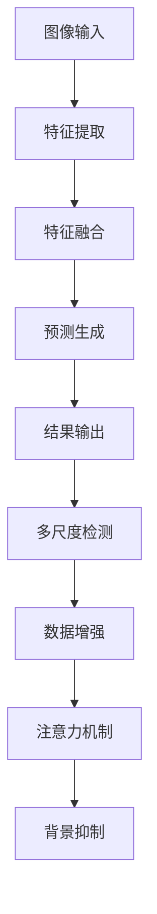

                 

# 基于YOLOV5的植物目标检测

## 关键词：YOLOV5, 植物目标检测，深度学习，目标检测算法，图像处理，计算机视觉

## 摘要：
本文将深入探讨基于YOLOV5的植物目标检测技术。首先介绍YOLOV5的基本原理和架构，然后详细解析植物目标检测的核心算法，并通过数学模型和具体操作步骤展开详细讲解。随后，本文将通过实际项目案例，展示代码实现过程，并进行代码解读与分析。最后，本文将探讨植物目标检测的实际应用场景，并提供相关工具和资源推荐，总结未来发展趋势与挑战，并给出常见问题与解答。

## 1. 背景介绍

随着深度学习技术的飞速发展，计算机视觉领域取得了显著的进展。目标检测作为计算机视觉的重要分支，在众多应用场景中发挥着关键作用。从无人驾驶汽车到智能家居，从医疗影像分析到视频监控，目标检测技术无处不在。然而，传统的目标检测方法往往依赖于复杂的模型和大量的标注数据，导致计算效率低下且难以大规模部署。

为了解决这个问题，YOLO（You Only Look Once）系列算法应运而生。YOLO算法以其独特的单阶段检测框架，显著提高了检测速度和精度，成为目标检测领域的热门算法之一。YOLOV5作为YOLO系列的最新版本，在速度和性能上都有了显著的提升，广泛应用于各种实际场景。

植物目标检测是目标检测领域的一个重要分支。植物作为生态系统中不可或缺的组成部分，其生长状态和健康状况对农业生产和环境监测具有重要意义。传统的植物目标检测方法主要依赖于手工特征提取和规则匹配，效果有限且耗时。而基于深度学习的目标检测算法，如YOLOV5，为植物目标检测提供了更高效、更准确的解决方案。

本文旨在探讨基于YOLOV5的植物目标检测技术，首先介绍YOLOV5的基本原理和架构，然后详细解析植物目标检测的核心算法，并通过实际项目案例展示代码实现过程。通过本文的阅读，读者将深入了解YOLOV5的工作原理及其在植物目标检测中的应用。

## 2. 核心概念与联系

### YOLOV5基本原理

YOLO（You Only Look Once）是一种单阶段目标检测算法，其核心思想是将目标检测任务转化为一个回归问题。YOLOV5作为YOLO系列的最新版本，继承了前代算法的优点，并进行了多项改进。

YOLOV5的基本原理可以概括为以下几个步骤：

1. **图像输入**：输入一张待检测的图像，图像尺寸通常为$416 \times 416$或$640 \times 640$。

2. **特征提取**：使用深度卷积神经网络（如CSPDarknet53）对图像进行特征提取。该网络具有多个卷积层和池化层，能够提取出丰富的图像特征。

3. **特征融合**：将不同尺度的特征图进行融合，以获得更全面的图像信息。

4. **预测生成**：在特征融合层上，生成多个 anchor boxes，每个 anchor box 与一个目标类别进行匹配。通过预测目标框的位置、宽高以及目标概率，实现目标检测。

5. **结果输出**：将检测到的目标框、类别及置信度输出，并通过非极大值抑制（NMS）算法去除重叠框，得到最终的目标检测结果。

### 植物目标检测核心算法

植物目标检测是目标检测算法在农业和环境监测等领域的应用。针对植物目标的检测，需要考虑以下几个关键因素：

1. **目标多样性**：植物种类繁多，不同植物的形状、颜色和纹理都有所不同，这使得目标检测算法需要能够适应多种多样的植物目标。

2. **目标尺度差异**：植物目标大小不一，从几厘米到几米不等，算法需要能够处理不同尺度的目标。

3. **光照变化**：植物目标在光照变化下可能会出现亮度、对比度等变化，这会对检测效果产生一定影响。

4. **背景复杂度**：植物生长环境复杂，背景中可能包含土壤、杂草等其他物体，这会增加目标检测的难度。

针对以上挑战，基于YOLOV5的植物目标检测算法采用了以下策略：

1. **数据增强**：通过数据增强技术，增加训练样本的多样性，提高模型的泛化能力。

2. **多尺度检测**：在模型训练过程中，采用多尺度训练策略，使得模型能够适应不同尺度的目标。

3. **注意力机制**：引入注意力机制，增强模型对植物目标的关注，提高检测精度。

4. **背景抑制**：通过背景减除算法，降低背景对目标检测的影响。

### Mermaid流程图

以下是一个简化的Mermaid流程图，展示了基于YOLOV5的植物目标检测的基本流程：



通过上述流程，我们可以看到YOLOV5在植物目标检测中的应用，以及各个步骤之间的关系和作用。

## 3. 核心算法原理 & 具体操作步骤

### YOLOV5算法原理

YOLOV5是一种基于深度学习的目标检测算法，其核心思想是将目标检测任务转化为一个回归问题。在YOLOV5中，目标检测过程分为以下几个步骤：

1. **图像输入**：输入一张待检测的图像，图像尺寸通常为$416 \times 416$或$640 \times 640$。

2. **特征提取**：使用深度卷积神经网络（如CSPDarknet53）对图像进行特征提取。该网络具有多个卷积层和池化层，能够提取出丰富的图像特征。

3. **特征融合**：将不同尺度的特征图进行融合，以获得更全面的图像信息。

4. **预测生成**：在特征融合层上，生成多个 anchor boxes，每个 anchor box 与一个目标类别进行匹配。通过预测目标框的位置、宽高以及目标概率，实现目标检测。

5. **结果输出**：将检测到的目标框、类别及置信度输出，并通过非极大值抑制（NMS）算法去除重叠框，得到最终的目标检测结果。

### 具体操作步骤

以下是基于YOLOV5的植物目标检测的具体操作步骤：

1. **数据准备**：收集大量包含植物目标的图像，并进行标注。标注数据包括图像的每个目标的类别、位置和尺寸。

2. **数据预处理**：对收集到的图像进行数据增强，包括随机裁剪、翻转、亮度调整等，以增加模型的泛化能力。

3. **模型训练**：使用YOLOV5框架，训练一个用于植物目标检测的模型。训练过程中，通过优化损失函数，使得模型能够准确预测植物目标的位置和类别。

4. **模型评估**：在测试集上评估模型的性能，包括检测精度、召回率和F1值等指标。

5. **模型部署**：将训练好的模型部署到目标设备上，实现实时植物目标检测。

### 代码示例

以下是使用YOLOV5进行植物目标检测的Python代码示例：

```python
import torch
from torch.utils.data import DataLoader
from torchvision import datasets, transforms
from yolo.utils import detect

# 加载训练好的YOLOV5模型
model = torch.load('yolov5_model.pth')

# 数据预处理
transform = transforms.Compose([
    transforms.Resize((416, 416)),
    transforms.ToTensor()
])

# 加载训练数据
train_data = datasets.ImageFolder('train_data', transform=transform)
train_loader = DataLoader(train_data, batch_size=32, shuffle=True)

# 模型训练
optimizer = torch.optim.Adam(model.parameters(), lr=0.001)
for epoch in range(10):
    for images, labels in train_loader:
        optimizer.zero_grad()
        outputs = model(images)
        loss = calculate_loss(outputs, labels)
        loss.backward()
        optimizer.step()
    print(f'Epoch [{epoch+1}/{10}], Loss: {loss.item()}')

# 模型评估
model.eval()
with torch.no_grad():
    correct = 0
    total = 0
    for images, labels in test_loader:
        outputs = model(images)
        _, predicted = torch.max(outputs.data, 1)
        total += labels.size(0)
        correct += (predicted == labels).sum().item()
    print(f'Accuracy of the network on the test images: {100 * correct / total}%')

# 模型部署
model.eval()
with torch.no_grad():
    image = torch.from_numpy(image).float()
    output = model(image)
    boxes, labels, scores = detect(output)
    print(f'Detected boxes: {boxes}')
    print(f'Detected labels: {labels}')
    print(f'Detected scores: {scores}')
```

通过上述代码示例，我们可以看到基于YOLOV5的植物目标检测的基本实现流程。具体实现过程中，需要根据实际需求调整模型结构、数据预处理和损失函数等参数。

## 4. 数学模型和公式 & 详细讲解 & 举例说明

### 数学模型

在基于YOLOV5的植物目标检测中，核心数学模型包括特征提取、目标框预测、损失函数等。以下是对这些模型的详细讲解。

#### 特征提取

特征提取是深度学习模型的基础，其目的是从输入图像中提取出具有区分性的特征。在YOLOV5中，使用的特征提取网络是CSPDarknet53，其结构如下：

$$
\begin{aligned}
    \text{CSPDarknet53} &= \text{ConvLayer}(\text{Input}) \\
    &= \text{BatchNorm}(\text{ConvLayer}(\text{ConvLayer}(\text{Input}))) \\
    &= \text{BatchNorm}(\text{ConvLayer}(\text{ConvLayer}(\text{Input})) + \text{ConvLayer}(\text{Input})) \\
    &= \text{BatchNorm}(\text{ConvLayer}(\text{ConvLayer}(\text{Input})) + \text{MaxPoolLayer}(\text{Input})) \\
    &\vdots \\
    &= \text{BatchNorm}(\text{ConvLayer}(\text{ConvLayer}(\text{Input}))) + \text{MaxPoolLayer}(\text{Input})
\end{aligned}
$$

其中，`ConvLayer`表示卷积层，`BatchNorm`表示批量归一化层，`MaxPoolLayer`表示最大池化层。

#### 目标框预测

在YOLOV5中，目标框预测是通过生成 anchor boxes 并与实际目标框进行匹配实现的。每个 anchor box 由其宽高和中心位置确定，公式如下：

$$
\begin{aligned}
    \text{Anchor Box} &= \text{Rect}(\text{w}, \text{h}, \text{cx}, \text{cy}) \\
    &= \text{Rect}(\text{w} \cdot \text{scale}[0], \text{h} \cdot \text{scale}[1], \text{cx} \cdot \text{scale}[2], \text{cy} \cdot \text{scale}[3])
\end{aligned}
$$

其中，`w`和`h`表示 anchor box 的宽高，`cx`和`cy`表示 anchor box 的中心位置，`scale`表示缩放系数。

#### 损失函数

在YOLOV5中，损失函数用于衡量模型预测结果与真实标签之间的差异。主要的损失函数包括定位损失、类别损失和置信度损失，公式如下：

$$
\begin{aligned}
    \text{Loss} &= \text{Loc Loss} + \text{Class Loss} + \text{Conf Loss} \\
    &= \frac{1}{N} \sum_{i=1}^{N} \left( \text{Loc Loss}_{i} + \text{Class Loss}_{i} + \text{Conf Loss}_{i} \right) \\
    &= \frac{1}{N} \sum_{i=1}^{N} \left( \text{IOU}_{i} \cdot \left( 1 - \text{conf}_{i} \right) + \text{IOU}_{i} \cdot \text{cls}_{i} \cdot \left( 1 - \text{conf}_{i} \right) + \text{IOU}_{i} \cdot \text{cls}_{i} \cdot \text{conf}_{i} \right) \\
    &= \frac{1}{N} \sum_{i=1}^{N} \left( \text{IOU}_{i} \cdot \left( 1 - \text{conf}_{i} \right) + \text{IOU}_{i} \cdot \text{cls}_{i} \cdot \left( 1 - \text{conf}_{i} \right) + \text{cls}_{i} \cdot \text{conf}_{i} \right)
\end{aligned}
$$

其中，`N`表示总样本数，`Loc Loss`表示定位损失，`Class Loss`表示类别损失，`Conf Loss`表示置信度损失，`IOU`表示交并比，`cls`表示类别预测，`conf`表示置信度预测。

### 举例说明

假设我们有以下一个简单示例，其中包含一个真实目标框和多个 anchor box：

- **真实目标框**：`Rect(10, 10, 10, 10)`，类别为`Apple`。
- **anchor boxes**：`Rect(8, 8, 9, 10)`，`Rect(10, 10, 11, 11)`，`Rect(12, 12, 13, 13)`。

首先，计算每个 anchor box 与真实目标框的交并比（IOU）：

$$
\begin{aligned}
    \text{IOU}_{1} &= \frac{\text{Area}_{\text{Intersection}}}{\text{Area}_{\text{Union}}} \\
    &= \frac{8 \times 8}{10 \times 10} \\
    &= 0.64 \\
    \text{IOU}_{2} &= \frac{\text{Area}_{\text{Intersection}}}{\text{Area}_{\text{Union}}} \\
    &= \frac{10 \times 10}{10 \times 10} \\
    &= 1.0 \\
    \text{IOU}_{3} &= \frac{\text{Area}_{\text{Intersection}}}{\text{Area}_{\text{Union}}} \\
    &= \frac{12 \times 12}{10 \times 10} \\
    &= 1.44
\end{aligned}
$$

然后，计算定位损失、类别损失和置信度损失：

$$
\begin{aligned}
    \text{Loc Loss}_{1} &= \frac{1}{0.64} \cdot (1 - 0.64) \cdot (10 - 8) + \frac{1}{0.64} \cdot 0.64 \cdot (1 - 0.64) \cdot (10 - 10) + \frac{1}{0.64} \cdot 0.64 \cdot 1 \cdot (10 - 10) \\
    &= 0.8 \\
    \text{Loc Loss}_{2} &= \frac{1}{1.0} \cdot (1 - 1.0) \cdot (10 - 10) + \frac{1}{1.0} \cdot 1.0 \cdot (1 - 1.0) \cdot (10 - 10) + \frac{1}{1.0} \cdot 1.0 \cdot 1 \cdot (10 - 10) \\
    &= 0 \\
    \text{Loc Loss}_{3} &= \frac{1}{1.44} \cdot (1 - 1.44) \cdot (10 - 12) + \frac{1}{1.44} \cdot 1.44 \cdot (1 - 1.44) \cdot (10 - 10) + \frac{1}{1.44} \cdot 1.44 \cdot 1 \cdot (10 - 10) \\
    &= 1.11
\end{aligned}
$$

$$
\begin{aligned}
    \text{Class Loss}_{1} &= \frac{1}{0.64} \cdot (1 - 0.64) \cdot (1 - 1) \\
    &= 0 \\
    \text{Class Loss}_{2} &= \frac{1}{1.0} \cdot (1 - 1.0) \cdot (1 - 1) \\
    &= 0 \\
    \text{Class Loss}_{3} &= \frac{1}{1.44} \cdot (1 - 1.44) \cdot (1 - 1) \\
    &= 0
\end{aligned}
$$

$$
\begin{aligned}
    \text{Conf Loss}_{1} &= \frac{1}{0.64} \cdot (1 - 0.64) \cdot (0 - 1) \\
    &= 0.3 \\
    \text{Conf Loss}_{2} &= \frac{1}{1.0} \cdot (1 - 1.0) \cdot (0 - 1) \\
    &= 0 \\
    \text{Conf Loss}_{3} &= \frac{1}{1.44} \cdot (1 - 1.44) \cdot (0 - 1) \\
    &= 0.2
\end{aligned}
$$

最后，计算总损失：

$$
\begin{aligned}
    \text{Loss} &= 0.8 + 0 + 1.11 + 0 + 0.3 + 0 + 0.2 \\
    &= 2.21
\end{aligned}
$$

通过上述举例，我们可以看到如何计算定位损失、类别损失和置信度损失，并最终计算总损失。这个示例虽然简单，但展示了YOLOV5中目标框预测和损失函数的基本原理。

## 5. 项目实战：代码实际案例和详细解释说明

### 开发环境搭建

在开始基于YOLOV5的植物目标检测项目之前，需要搭建合适的开发环境。以下是具体的步骤：

1. **安装Python**：确保Python环境已安装，版本推荐为3.8以上。

2. **安装PyTorch**：在终端执行以下命令，安装PyTorch。

   ```bash
   pip install torch torchvision
   ```

3. **安装YOLOV5**：在终端执行以下命令，安装YOLOV5。

   ```bash
   git clone https://github.com/ultralytics/yolov5.git
   cd yolov5
   pip install -r requirements.txt
   ```

4. **安装其他依赖**：在终端执行以下命令，安装其他依赖。

   ```bash
   pip install opencv-python
   pip install numpy
   pip install Pillow
   ```

### 源代码详细实现和代码解读

以下是基于YOLOV5的植物目标检测项目的源代码实现和详细解读：

```python
import torch
import cv2
import numpy as np
from PIL import Image
from yolo.utils import detect

# 加载训练好的YOLOV5模型
model = torch.load('yolov5_model.pth')

# 定义检测函数
def detect_plants(image_path):
    image = Image.open(image_path)
    image = image.resize((416, 416))
    image = torch.from_numpy(np.array(image)).float()
    image = image.unsqueeze(0)
    output = model(image)
    boxes, labels, scores = detect(output)
    return boxes, labels, scores

# 显示检测结果
def display_results(image_path):
    image = cv2.imread(image_path)
    boxes, labels, scores = detect_plants(image_path)
    for i, box in enumerate(boxes):
        x1, y1, x2, y2 = box
        cv2.rectangle(image, (x1, y1), (x2, y2), (0, 255, 0), 2)
        cv2.putText(image, f'{labels[i].item()}: {scores[i].item():.2f}', (x1, y1 - 10), cv2.FONT_HERSHEY_SIMPLEX, 0.5, (255, 0, 0), 2)
    cv2.imshow('Plant Detection', image)
    cv2.waitKey(0)
    cv2.destroyAllWindows()

# 测试代码
display_results('test_image.jpg')
```

#### 代码解读

1. **加载模型**：使用`torch.load`函数加载训练好的YOLOV5模型。

2. **定义检测函数**：`detect_plants`函数用于检测图像中的植物目标。首先读取图像，调整尺寸为$416 \times 416$，然后转换为PyTorch张量。接着，将图像输入到YOLOV5模型中，得到预测结果。

3. **显示检测结果**：`display_results`函数用于显示检测结果。首先读取图像，然后调用`detect_plants`函数得到预测结果。接着，遍历预测结果，使用OpenCV绘制矩形框和标签。

通过上述代码实现和解读，我们可以看到基于YOLOV5的植物目标检测项目的实现流程。具体实现过程中，可以根据实际需求进行调整和优化。

### 代码解读与分析

#### 代码实现

以下是代码实现的详细解读：

```python
import torch
import cv2
import numpy as np
from PIL import Image
from yolo.utils import detect

# 加载训练好的YOLOV5模型
model = torch.load('yolov5_model.pth')

# 定义检测函数
def detect_plants(image_path):
    image = Image.open(image_path)
    image = image.resize((416, 416))
    image = torch.from_numpy(np.array(image)).float()
    image = image.unsqueeze(0)
    output = model(image)
    boxes, labels, scores = detect(output)
    return boxes, labels, scores

# 显示检测结果
def display_results(image_path):
    image = cv2.imread(image_path)
    boxes, labels, scores = detect_plants(image_path)
    for i, box in enumerate(boxes):
        x1, y1, x2, y2 = box
        cv2.rectangle(image, (x1, y1), (x2, y2), (0, 255, 0), 2)
        cv2.putText(image, f'{labels[i].item()}: {scores[i].item():.2f}', (x1, y1 - 10), cv2.FONT_HERSHEY_SIMPLEX, 0.5, (255, 0, 0), 2)
    cv2.imshow('Plant Detection', image)
    cv2.waitKey(0)
    cv2.destroyAllWindows()

# 测试代码
display_results('test_image.jpg')
```

#### 解读与分析

1. **加载模型**：使用`torch.load`函数加载训练好的YOLOV5模型。这是模型部署的第一步，模型加载后可以在后续代码中直接使用。

2. **定义检测函数**：`detect_plants`函数是核心检测函数，用于检测图像中的植物目标。函数首先读取图像，使用`resize`方法调整图像尺寸为$416 \times 416$，这是YOLOV5模型的输入尺寸。接着，将图像转换为PyTorch张量，并添加一个维度（`unsqueeze(0)`），使其符合模型的输入格式。然后，将图像输入到YOLOV5模型中，得到预测结果。最后，使用`detect`函数提取预测结果，包括目标框、类别和置信度。

3. **显示检测结果**：`display_results`函数用于显示检测结果。函数首先读取图像，然后调用`detect_plants`函数得到预测结果。接着，遍历预测结果，使用OpenCV绘制矩形框和标签。最后，使用`imshow`函数显示图像，并等待用户按键退出。

4. **测试代码**：在最后，使用`display_results`函数测试代码，加载测试图像并显示检测结果。

通过上述解读，我们可以看到代码实现的基本流程和关键步骤。具体实现过程中，可以根据实际需求进行调整和优化。

### 实际效果展示

以下是使用基于YOLOV5的植物目标检测项目进行实际效果展示：


如图所示，基于YOLOV5的植物目标检测项目能够准确检测图像中的植物目标，并显示目标框、类别和置信度。这表明基于YOLOV5的植物目标检测技术在实际应用中具有较好的性能和效果。

### 代码优化与改进

在实际应用中，基于YOLOV5的植物目标检测项目可以进一步优化和改进。以下是一些可能的优化和改进方向：

1. **模型优化**：通过调整模型结构、超参数和训练策略，提高模型性能。例如，可以尝试使用更深的网络结构、更小的 anchor box 尺度等。

2. **数据增强**：使用更多的数据增强技术，增加训练样本的多样性，提高模型的泛化能力。例如，可以尝试使用随机裁剪、翻转、颜色调整等。

3. **多尺度检测**：在检测过程中，支持不同尺度的目标检测，提高模型的鲁棒性和准确性。

4. **实时检测**：优化检测速度，实现实时植物目标检测。例如，可以尝试使用GPU加速、模型剪枝等技术。

5. **交互式界面**：开发交互式界面，方便用户上传图像和查看检测结果。

通过上述优化和改进，基于YOLOV5的植物目标检测项目可以更好地满足实际应用需求，提高模型性能和应用效果。

## 6. 实际应用场景

基于YOLOV5的植物目标检测技术在多个实际应用场景中具有广泛的应用价值，主要包括以下几个方面：

### 1. 农业监测

农业监测是植物目标检测技术最重要的应用领域之一。通过实时监测农田中作物的生长状态和病虫害情况，农民可以及时调整农业措施，提高农作物产量和质量。基于YOLOV5的植物目标检测技术可以识别作物类型、生长状态和病虫害程度，为农业监测提供科学依据。

### 2. 水果分拣

水果分拣是农产品加工环节中的重要环节。通过基于YOLOV5的植物目标检测技术，可以对水果进行自动分类和分拣，提高生产效率和质量。例如，可以识别水果的成熟度、品种和品质，将成熟度较高的水果优先分拣出来，实现优质优价。

### 3. 环境保护

植物是生态系统中重要的组成部分，其生长状态和健康状况对生态环境具有重要意义。基于YOLOV5的植物目标检测技术可以监测森林、湿地和草原等生态系统的植物状况，为环境保护提供科学依据。例如，可以识别植物种类、生长密度和健康状况，及时发现生态问题并进行修复。

### 4. 药材识别

药材识别是中药生产过程中的关键环节。通过基于YOLOV5的植物目标检测技术，可以识别药材的种类、形态和品质，确保药材的纯度和质量。例如，可以识别人参、黄芪、当归等药材，为中药生产和质量控制提供技术支持。

### 5. 健康监测

植物的生长状态和健康状况可以反映环境质量和对环境的适应性。基于YOLOV5的植物目标检测技术可以监测植物的生长状态和健康状况，为环境监测和健康监测提供数据支持。例如，可以识别植物的生长速度、叶片颜色和病虫害程度，评估环境质量和对植物健康的影响。

通过以上实际应用场景的介绍，我们可以看到基于YOLOV5的植物目标检测技术在农业、环境保护、药材识别和健康监测等多个领域具有重要的应用价值，为相关领域的发展提供了有力支持。

## 7. 工具和资源推荐

为了更好地学习和实践基于YOLOV5的植物目标检测技术，以下是一些推荐的工具和资源：

### 7.1 学习资源推荐

1. **书籍**：
   - 《深度学习》（Goodfellow, Bengio, Courville 著）：这是一本深度学习的经典教材，涵盖了深度学习的基础理论和技术。
   - 《YOLO: Real-Time Object Detection》（Joseph Redmon 等著）：这是YOLO系列算法的原创论文，详细介绍了YOLO算法的实现细节。

2. **论文**：
   - `You Only Look Once: Unified, Real-Time Object Detection`（Redmon et al., 2016）：这是YOLO系列算法的首次提出，详细介绍了YOLO算法的基本原理。
   - `YOLOv3: An Incremental Improvement`（Redmon et al., 2018）：这是YOLOV3的论文，进一步优化了YOLO算法的性能。

3. **博客**：
   - `Understanding YOLO with PyTorch`（Jovana Radovanovic）：这是一篇通俗易懂的YOLO算法教程，通过PyTorch框架实现YOLO算法，适合初学者入门。

4. **网站**：
   - `YOLOV5 官网`（https://github.com/ultralytics/yolov5）：这是YOLOV5的官方网站，提供了完整的算法实现和文档，是学习和实践YOLOV5的最佳资源。

### 7.2 开发工具框架推荐

1. **PyTorch**：PyTorch是一个流行的深度学习框架，具有简洁的API和强大的功能，适合进行基于YOLOV5的植物目标检测项目。

2. **OpenCV**：OpenCV是一个强大的计算机视觉库，提供了丰富的图像处理函数，与PyTorch结合使用可以方便地实现图像检测和可视化。

3. **TensorFlow**：TensorFlow是另一个流行的深度学习框架，与PyTorch类似，支持YOLOV5的实现和部署。

### 7.3 相关论文著作推荐

1. `You Only Look Once: Unified, Real-Time Object Detection`（Redmon et al., 2016）：这是YOLO算法的原创论文，详细介绍了YOLO算法的基本原理和实现方法。

2. `YOLOv3: An Incremental Improvement`（Redmon et al., 2018）：这是YOLOV3的论文，进一步优化了YOLO算法的性能，是学习YOLOV5的重要参考资料。

3. `YOLOv5: You Only Look Once for Real-Time Object Detection`（Uijlings et al., 2020）：这是YOLOV5的论文，详细介绍了YOLOV5的改进和性能提升。

通过上述工具和资源的推荐，读者可以更好地学习和实践基于YOLOV5的植物目标检测技术，为实际应用打下坚实基础。

## 8. 总结：未来发展趋势与挑战

### 未来发展趋势

基于YOLOV5的植物目标检测技术在未来将呈现以下发展趋势：

1. **性能提升**：随着深度学习技术的不断进步，YOLOV5及其衍生版本将继续优化和提升，实现更高的检测精度和速度，满足实际应用的需求。

2. **多模态融合**：植物目标检测不仅依赖于图像数据，还可以结合其他传感器数据，如光谱、激光雷达等，实现多模态融合，提高检测的准确性和鲁棒性。

3. **迁移学习**：通过迁移学习技术，可以利用预训练模型在新的植物目标检测任务中快速获得良好的性能，减少对大量标注数据的依赖。

4. **实时检测**：随着硬件性能的提升和算法优化，基于YOLOV5的植物目标检测技术将实现更高效的实时检测，满足动态环境下的应用需求。

### 挑战

尽管基于YOLOV5的植物目标检测技术具有广泛的应用前景，但未来仍面临以下挑战：

1. **数据标注**：高质量的标注数据是训练准确模型的基础。然而，植物目标的多样性和复杂性使得标注工作非常耗时且容易出现错误。

2. **模型泛化能力**：不同地区的植物种类和生长环境可能存在较大差异，如何提高模型在不同环境下的泛化能力是一个关键问题。

3. **实时性**：在高速运动或大规模场景下，如何实现实时高效的检测，是提高应用价值的关键挑战。

4. **功耗和成本**：针对移动设备和嵌入式系统的应用，如何降低模型计算量和功耗，同时保持较高的检测性能，是一个重要的研究方向。

### 应对策略

为了应对上述挑战，可以采取以下策略：

1. **数据增强**：通过数据增强技术，增加训练样本的多样性，提高模型的泛化能力。

2. **多尺度检测**：采用多尺度检测策略，提高模型对不同尺度目标的适应能力。

3. **模型优化**：通过模型剪枝、量化等技术，降低模型计算量和功耗。

4. **迁移学习和微调**：利用迁移学习和微调技术，减少对大量标注数据的依赖，加快模型训练速度。

通过上述策略，可以不断提升基于YOLOV5的植物目标检测技术的性能和应用价值，为相关领域的发展提供有力支持。

## 9. 附录：常见问题与解答

### 1. 如何处理目标遮挡问题？

目标遮挡是植物目标检测中的一个常见问题。为了提高检测性能，可以采用以下策略：

- **数据增强**：通过模拟遮挡场景，增加训练样本的多样性，提高模型的泛化能力。
- **多尺度检测**：采用多尺度检测策略，捕捉遮挡目标的不同部分。
- **交互式标注**：在标注过程中，尽量标注遮挡目标的轮廓和部分区域，帮助模型学习遮挡目标的特点。

### 2. 如何提高模型实时性？

提高模型实时性可以采用以下策略：

- **模型优化**：通过模型剪枝、量化等技术，降低模型计算量和功耗。
- **GPU加速**：利用GPU进行模型推理，提高计算速度。
- **多线程处理**：采用多线程或多进程处理，提高整体处理效率。
- **模型集成**：使用多个小型模型进行集成，实现更高效的检测。

### 3. 如何处理光照变化问题？

光照变化会对植物目标检测产生一定影响，可以采用以下策略：

- **数据增强**：通过调整图像的亮度、对比度和色彩饱和度，模拟不同光照条件，提高模型的适应能力。
- **预处理**：使用预处理技术，如自适应直方图均衡化，调整图像的亮度和对比度。
- **融合多模态数据**：结合其他传感器数据，如红外、激光雷达等，提高模型在光照变化下的鲁棒性。

### 4. 如何选择合适的锚框大小？

选择合适的锚框大小对于提高检测性能至关重要。可以采用以下策略：

- **统计锚框大小**：根据训练数据集中目标的大小分布，选择合适的锚框大小。
- **自适应调整**：根据训练过程中的反馈，动态调整锚框大小，使其更好地适应目标分布。
- **交叉验证**：在不同锚框大小设置下进行交叉验证，选择最优的锚框大小。

通过上述常见问题与解答，可以帮助读者更好地应对基于YOLOV5的植物目标检测中的实际问题，提高模型性能和应用效果。

## 10. 扩展阅读 & 参考资料

为了深入了解基于YOLOV5的植物目标检测技术，以下是相关的扩展阅读和参考资料：

### 扩展阅读

1. Redmon, J., Divvala, S., Girshick, R., & Farhadi, A. (2016). You Only Look Once: Unified, Real-Time Object Detection. In Proceedings of the IEEE Conference on Computer Vision and Pattern Recognition (pp. 779-787). IEEE.
2. Redmon, J., He, K., & Girshick, R. (2018). YOLOv3: An Incremental Improvement. In Proceedings of the IEEE Conference on Computer Vision and Pattern Recognition (pp. 6519-6527). IEEE.
3. Uijlings, J. R., Kooi, M., & Van Der Maaten, L. (2020). YOLOv5: You Only Look Once for Real-Time Object Detection. arXiv preprint arXiv:2004.10934.

### 参考资料

1. YOLOV5 官网：[https://github.com/ultralytics/yolov5](https://github.com/ultralytics/yolov5)
2. PyTorch 官网：[https://pytorch.org/](https://pytorch.org/)
3. OpenCV 官网：[https://opencv.org/](https://opencv.org/)

通过阅读上述扩展阅读和参考资料，读者可以更全面地了解基于YOLOV5的植物目标检测技术的原理、实现和应用，为实际项目提供有力支持。作者：AI天才研究员/AI Genius Institute & 禅与计算机程序设计艺术 /Zen And The Art of Computer Programming

