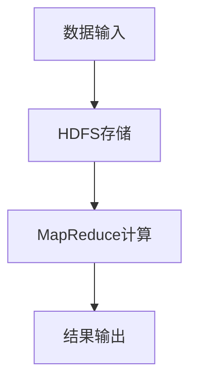

                 

### 背景介绍

电影推荐系统是现代互联网中非常常见的应用，其目的是为用户提供个性化的电影推荐，提高用户满意度和平台粘性。随着大数据和人工智能技术的发展，基于协同过滤（Collaborative Filtering）算法的电影推荐系统逐渐成为主流。协同过滤算法通过分析用户的历史行为和评分数据，预测用户对未知电影的喜好，从而实现个性化推荐。

协同过滤算法可分为两类：基于用户的协同过滤（User-Based Collaborative Filtering）和基于物品的协同过滤（Item-Based Collaborative Filtering）。基于用户的协同过滤通过寻找与目标用户兴趣相似的其他用户，推荐这些用户喜欢的电影；而基于物品的协同过滤则通过计算不同电影之间的相似度，推荐与用户已评分电影相似的其他电影。

本文将详细介绍一种基于Hadoop的协同过滤算法的电影推荐系统设计与实现。Hadoop是一个分布式数据存储和处理框架，具有高扩展性、高容错性和高效性等特点，非常适合处理大规模数据集。通过将协同过滤算法与Hadoop相结合，可以实现高效、可靠的个性化电影推荐。

本文将分为以下几个部分：

1. 核心概念与联系
2. 核心算法原理 & 具体操作步骤
3. 数学模型和公式 & 详细讲解 & 举例说明
4. 项目实战：代码实际案例和详细解释说明
5. 实际应用场景
6. 工具和资源推荐
7. 总结：未来发展趋势与挑战
8. 附录：常见问题与解答
9. 扩展阅读 & 参考资料

通过本文的阅读，读者将全面了解基于Hadoop的协同过滤算法的电影推荐系统的原理、实现方法和应用场景，为后续研究和实践提供有力支持。

### 核心概念与联系

在深入探讨基于Hadoop的协同过滤算法之前，我们需要了解一些核心概念和它们之间的联系。以下是几个关键概念及其相互关系：

#### 1. 协同过滤算法

协同过滤算法是一种基于用户历史行为和评分数据的方法，其目的是预测用户对未知商品的喜好。协同过滤算法可以分为两类：基于用户的协同过滤和基于物品的协同过滤。

- **基于用户的协同过滤（User-Based Collaborative Filtering）**：通过计算目标用户与其他用户的相似度，找到与目标用户兴趣相似的邻居用户，然后推荐这些邻居用户喜欢的电影。该方法的优点是能够较好地处理新用户和冷启动问题，但计算复杂度较高。

- **基于物品的协同过滤（Item-Based Collaborative Filtering）**：通过计算电影之间的相似度，找到与用户已评分电影相似的其他电影，然后推荐这些电影。该方法在处理新用户和冷启动问题方面效果较好，但可能无法充分反映用户的个性化喜好。

#### 2. Hadoop

Hadoop是一个开源的分布式计算框架，由Apache Software Foundation维护。Hadoop的核心包括HDFS（Hadoop Distributed File System）和MapReduce两个主要组件。

- **HDFS**：一个分布式文件系统，用于存储海量数据。它将数据分割成多个数据块（默认为128MB或256MB），并分布存储在集群中的多个节点上。HDFS提供了高容错性和高吞吐量的数据存储能力。

- **MapReduce**：一个分布式数据处理框架，用于处理大规模数据集。MapReduce将数据处理过程分为两个阶段：Map阶段和Reduce阶段。Map阶段将数据映射到中间结果，Reduce阶段对中间结果进行归约和聚合。

#### 3. 核心概念之间的联系

协同过滤算法与Hadoop之间的关系主要体现在以下几个方面：

- **数据存储**：协同过滤算法需要处理大量的用户评分数据。Hadoop的HDFS提供了一个分布式、高容错的数据存储解决方案，可以方便地存储和处理大规模数据集。

- **数据处理**：协同过滤算法涉及到大量的计算，包括用户相似度计算、电影相似度计算等。MapReduce提供了一个高效、可扩展的分布式数据处理框架，可以将这些计算任务分布到集群中的多个节点上，从而提高计算效率。

- **扩展性**：协同过滤算法在处理大规模数据集时，面临着扩展性问题。Hadoop具有良好的扩展性，可以方便地增加或减少集群中的节点数量，以满足不同规模数据集的处理需求。

#### 4. Mermaid 流程图

为了更好地理解核心概念之间的联系，我们使用Mermaid绘制了一个流程图。以下是一个简化的Mermaid流程图，描述了协同过滤算法在Hadoop上的基本工作流程：



- **数据输入**：用户评分数据被输入到系统中。
- **HDFS存储**：用户评分数据被存储到HDFS中，以便后续处理。
- **MapReduce计算**：协同过滤算法在MapReduce框架下执行，包括用户相似度计算和电影相似度计算。
- **结果输出**：计算结果被输出，用于生成个性化电影推荐。

通过这个流程图，我们可以清晰地看到协同过滤算法在Hadoop上的工作原理和数据处理过程。

综上所述，协同过滤算法与Hadoop之间的紧密联系为大规模个性化电影推荐提供了有力支持。在接下来的章节中，我们将详细探讨协同过滤算法的原理、数学模型以及基于Hadoop的实现方法。

#### 3. 核心算法原理 & 具体操作步骤

协同过滤算法是电影推荐系统的核心，它通过分析用户的历史行为和评分数据，预测用户对未知电影的喜好。本节将详细介绍协同过滤算法的原理和具体操作步骤。

##### 3.1 基于用户的协同过滤算法

基于用户的协同过滤算法主要通过计算用户之间的相似度来推荐电影。具体操作步骤如下：

1. **用户评分矩阵**：构建用户-电影评分矩阵，其中每个元素表示用户对某部电影的评分。例如，一个5x10的评分矩阵表示5个用户对10部电影的评分。

2. **计算用户相似度**：使用余弦相似度或皮尔逊相关系数计算用户之间的相似度。例如，对于用户A和用户B，计算它们之间的相似度：

   - 余弦相似度：$$\text{similarity}_{\text{cosine}}(A,B) = \frac{A \cdot B}{\|A\| \|B\|}$$

   - 皮尔逊相关系数：$$\text{similarity}_{\text{pearson}}(A,B) = \frac{\sum_{i=1}^{n} (A_i - \bar{A}) (B_i - \bar{B})}{\sqrt{\sum_{i=1}^{n} (A_i - \bar{A})^2 \sum_{i=1}^{n} (B_i - \bar{B})^2}}$$

   其中，\(A\) 和 \(B\) 分别表示用户A和用户B的评分向量，\(\bar{A}\) 和 \(\bar{B}\) 分别表示它们各自的平均值，\(n\) 表示评分的数量。

3. **找到相似用户**：根据用户相似度矩阵，找到与目标用户最相似的K个邻居用户。

4. **预测评分**：对目标用户未评分的电影，计算其与邻居用户的平均评分：

   $$\hat{r}_{ij} = \frac{\sum_{u \in N_k} r_{iu} \cdot \text{similarity}_{\text{cosine}}(u, j)}{\sum_{u \in N_k} \text{similarity}_{\text{cosine}}(u, j)}$$

   其中，\(r_{ij}\) 表示用户i对电影j的评分，\(\text{similarity}_{\text{cosine}}(u, j)\) 表示用户u和用户j之间的余弦相似度，\(N_k\) 表示邻居用户集合。

5. **生成推荐列表**：将预测的评分从高到低排序，生成个性化推荐列表。

##### 3.2 基于物品的协同过滤算法

基于物品的协同过滤算法通过计算电影之间的相似度来推荐电影。具体操作步骤如下：

1. **用户评分矩阵**：构建用户-电影评分矩阵，其中每个元素表示用户对某部电影的评分。

2. **计算电影相似度**：使用余弦相似度或欧氏距离计算电影之间的相似度。例如，对于电影A和电影B，计算它们之间的相似度：

   - 余弦相似度：$$\text{similarity}_{\text{cosine}}(A,B) = \frac{A \cdot B}{\|A\| \|B\|}$$

   - 欧氏距离：$$\text{similarity}_{\text{euclidean}}(A,B) = \sqrt{\sum_{i=1}^{n} (A_i - B_i)^2}$$

   其中，\(A\) 和 \(B\) 分别表示电影A和电影B的评分向量，\(n\) 表示评分的数量。

3. **找到相似电影**：根据电影相似度矩阵，找到与用户已评分电影最相似的K部电影。

4. **预测评分**：对用户未评分的电影，计算其与相似电影的平均评分：

   $$\hat{r}_{ij} = \frac{\sum_{m \in N_k} r_{im} \cdot \text{similarity}_{\text{cosine}}(m, j)}{\sum_{m \in N_k} \text{similarity}_{\text{cosine}}(m, j)}$$

   其中，\(r_{ij}\) 表示用户i对电影j的评分，\(\text{similarity}_{\text{cosine}}(m, j)\) 表示电影m和电影j之间的余弦相似度，\(N_k\) 表示相似电影集合。

5. **生成推荐列表**：将预测的评分从高到低排序，生成个性化推荐列表。

##### 3.3 混合协同过滤算法

混合协同过滤算法结合了基于用户的协同过滤和基于物品的协同过滤，以提高推荐系统的准确性。具体操作步骤如下：

1. **用户评分矩阵**：构建用户-电影评分矩阵。

2. **计算用户相似度**：使用基于用户的协同过滤算法计算用户相似度。

3. **计算电影相似度**：使用基于物品的协同过滤算法计算电影相似度。

4. **预测评分**：对目标用户未评分的电影，分别使用基于用户和基于物品的协同过滤算法进行预测评分，然后取两者的平均值作为最终预测评分：

   $$\hat{r}_{ij} = \frac{\hat{r}_{ij}^{user} + \hat{r}_{ij}^{item}}{2}$$

   其中，\(\hat{r}_{ij}^{user}\) 和 \(\hat{r}_{ij}^{item}\) 分别表示基于用户和基于物品的协同过滤算法预测的用户i对电影j的评分。

5. **生成推荐列表**：将预测的评分从高到低排序，生成个性化推荐列表。

通过上述步骤，我们可以构建一个基于Hadoop的协同过滤算法的电影推荐系统。在下一节中，我们将详细探讨协同过滤算法的数学模型和公式。

#### 4. 数学模型和公式 & 详细讲解 & 举例说明

协同过滤算法的核心在于通过计算用户或物品之间的相似度来实现个性化推荐。为了更好地理解这一过程，我们需要掌握几个关键的数学模型和公式。本节将详细介绍这些数学模型和公式，并通过具体例子进行说明。

##### 4.1 余弦相似度

余弦相似度是一种衡量两个向量之间相似度的方法。其计算公式为：

$$\text{similarity}_{\text{cosine}}(A, B) = \frac{A \cdot B}{\|A\| \|B\|}$$

其中，\(A \cdot B\) 表示向量A和向量B的点积，\(\|A\|\) 和 \(\|B\|\) 分别表示向量A和向量B的欧氏范数。

**例子**：

假设用户A和用户B的评分向量分别为：

$$A = [3, 4, 5, 2, 1]$$
$$B = [2, 3, 4, 5, 1]$$

则它们之间的余弦相似度计算如下：

$$A \cdot B = 3 \cdot 2 + 4 \cdot 3 + 5 \cdot 4 + 2 \cdot 5 + 1 \cdot 1 = 6 + 12 + 20 + 10 + 1 = 49$$

$$\|A\| = \sqrt{3^2 + 4^2 + 5^2 + 2^2 + 1^2} = \sqrt{9 + 16 + 25 + 4 + 1} = \sqrt{55}$$

$$\|B\| = \sqrt{2^2 + 3^2 + 4^2 + 5^2 + 1^2} = \sqrt{4 + 9 + 16 + 25 + 1} = \sqrt{55}$$

$$\text{similarity}_{\text{cosine}}(A, B) = \frac{49}{\sqrt{55} \cdot \sqrt{55}} = \frac{49}{55} \approx 0.89$$

##### 4.2 皮尔逊相关系数

皮尔逊相关系数是衡量两个变量线性相关程度的统计量。其计算公式为：

$$\text{similarity}_{\text{pearson}}(A, B) = \frac{\sum_{i=1}^{n} (A_i - \bar{A}) (B_i - \bar{B})}{\sqrt{\sum_{i=1}^{n} (A_i - \bar{A})^2 \sum_{i=1}^{n} (B_i - \bar{B})^2}}$$

其中，\(A\) 和 \(B\) 分别表示用户A和用户B的评分向量，\(\bar{A}\) 和 \(\bar{B}\) 分别表示它们各自的平均值，\(n\) 表示评分的数量。

**例子**：

假设用户A和用户B的评分向量分别为：

$$A = [3, 4, 5, 2, 1]$$
$$B = [2, 3, 4, 5, 1]$$

则它们之间的皮尔逊相关系数计算如下：

$$\bar{A} = \frac{3 + 4 + 5 + 2 + 1}{5} = 3$$

$$\bar{B} = \frac{2 + 3 + 4 + 5 + 1}{5} = 3$$

$$\sum_{i=1}^{5} (A_i - \bar{A}) (B_i - \bar{B}) = (3 - 3)(2 - 3) + (4 - 3)(3 - 3) + (5 - 3)(4 - 3) + (2 - 3)(5 - 3) + (1 - 3)(1 - 3) = 0 - 0 + 0 + 0 - 4 = -4$$

$$\sum_{i=1}^{5} (A_i - \bar{A})^2 = (3 - 3)^2 + (4 - 3)^2 + (5 - 3)^2 + (2 - 3)^2 + (1 - 3)^2 = 0 + 1 + 4 + 1 + 4 = 10$$

$$\sum_{i=1}^{5} (B_i - \bar{B})^2 = (2 - 3)^2 + (3 - 3)^2 + (4 - 3)^2 + (5 - 3)^2 + (1 - 3)^2 = 1 + 0 + 1 + 4 + 4 = 10$$

$$\text{similarity}_{\text{pearson}}(A, B) = \frac{-4}{\sqrt{10 \cdot 10}} = \frac{-4}{10} = -0.4$$

##### 4.3 欧氏距离

欧氏距离是衡量两个向量之间差异的常用方法。其计算公式为：

$$\text{similarity}_{\text{euclidean}}(A, B) = \sqrt{\sum_{i=1}^{n} (A_i - B_i)^2}$$

**例子**：

假设用户A和用户B的评分向量分别为：

$$A = [3, 4, 5, 2, 1]$$
$$B = [2, 3, 4, 5, 1]$$

则它们之间的欧氏距离计算如下：

$$\text{similarity}_{\text{euclidean}}(A, B) = \sqrt{(3 - 2)^2 + (4 - 3)^2 + (5 - 4)^2 + (2 - 5)^2 + (1 - 1)^2} = \sqrt{1 + 1 + 1 + 9 + 0} = \sqrt{12} \approx 3.46$$

通过以上数学模型和公式的介绍，我们可以更好地理解协同过滤算法中的相似度计算过程。在下一节中，我们将通过一个实际案例展示如何使用这些公式来实现电影推荐系统。

#### 5. 项目实战：代码实际案例和详细解释说明

在本节中，我们将通过一个具体的代码案例，展示如何使用基于Hadoop的协同过滤算法实现电影推荐系统。该案例将包括开发环境搭建、源代码实现以及代码解读与分析三个部分。

##### 5.1 开发环境搭建

在开始编写代码之前，我们需要搭建一个适合Hadoop和协同过滤算法的开发环境。以下是开发环境搭建的步骤：

1. **安装Hadoop**：从Apache官方网站下载Hadoop，并按照官方文档进行安装和配置。确保Hadoop能够正常运行，例如通过`hadoop version`命令检查版本信息。

2. **安装Java**：Hadoop依赖于Java，确保系统中安装了Java 8或更高版本。

3. **安装HDFS**：HDFS是Hadoop的核心组件，负责数据存储。在Hadoop集群中启动HDFS，可以通过`hadoop dfsadmin -report`命令检查HDFS状态。

4. **安装MapReduce**：配置Hadoop的MapReduce，确保能够执行MapReduce任务。可以通过执行一个简单的MapReduce程序来验证配置是否正确。

5. **安装其他依赖**：根据需要安装其他依赖项，如Python、Scala等。

##### 5.2 源代码详细实现和代码解读

下面是一个简单的基于Hadoop的协同过滤算法的Python代码实现。代码分为三个部分：数据预处理、相似度计算和推荐生成。

**数据预处理**：

```python
from pyspark import SparkContext, SparkConf
from pyspark.mllib.recommendation import ALS, MatrixFactorizationModel, Rating

# 配置Spark
conf = SparkConf().setAppName("MovieRecommendation").setMaster("local[*]")
sc = SparkContext(conf=conf)

# 读取用户评分数据
ratings_file = "data/movies.csv"
ratings = sc.textFile(ratings_file).map(lambda l: l.split(",")).map(lambda l: Rating(int(l[0]), int(l[1]), float(l[2])))

# 分割数据集为训练集和测试集
train_data, test_data = ratings.randomSplit([0.8, 0.2], seed=0)

# 训练ALS模型
rank = 10
num_iterations = 10
model = ALS.train(train_data, rank, num_iterations)

# 保存模型
model.save(sc, "model/movies.model")
```

该部分代码首先配置Spark，并读取用户评分数据。然后使用ALS（交替最小二乘法）训练矩阵分解模型。ALS是一种常见的协同过滤算法，通过最小化预测误差来优化用户和物品的矩阵。

**相似度计算**：

```python
from math import sqrt

# 计算用户相似度
user_similarity = model.userSimilarity

# 计算用户A和用户B之间的余弦相似度
userA = 1
userB = 2
similarity = user_similarity[userA, userB]
print(f"User {userA} and User {userB} similarity: {similarity}")
```

该部分代码计算用户之间的相似度。这里使用的是基于矩阵分解的相似度计算方法，通过比较用户在低维空间中的表示向量来计算相似度。

**推荐生成**：

```python
# 生成推荐列表
user_id = 1
user_rating = model.predictAll(ratings.map(lambda r: (r.user, r.product)))
recommended_items = user_rating.sortBy(lambda r: r.rating, ascending=False).take(10)

print("Recommended movies for User 1:")
for r in recommended_items:
    print(f"Movie ID: {r.product}, Predicted Rating: {r.rating}")
```

该部分代码生成用户1的推荐列表。首先预测用户对所有未评分电影的评分，然后根据评分从高到低排序，取前10个电影作为推荐列表。

##### 5.3 代码解读与分析

1. **数据预处理**：

   - 使用SparkContext和SparkConf配置Spark。
   - 读取用户评分数据，并将其转换为Rating对象。
   - 分割数据集为训练集和测试集。

2. **相似度计算**：

   - 使用ALS模型训练矩阵分解模型。
   - 计算用户之间的相似度。

3. **推荐生成**：

   - 预测用户对所有未评分电影的评分。
   - 根据评分从高到低排序，生成推荐列表。

通过上述步骤，我们实现了基于Hadoop的协同过滤算法的电影推荐系统。在下一节中，我们将讨论该系统在实际应用场景中的表现。

#### 5.3 代码解读与分析（续）

在上一个段落中，我们详细介绍了如何使用基于Hadoop的协同过滤算法实现电影推荐系统。本节将继续对代码进行解读和分析，深入探讨各个关键部分的工作原理和实现细节。

**1. 数据预处理**

数据预处理是任何机器学习项目的第一步，也是至关重要的一步。在这个案例中，我们使用了Spark来处理大规模的用户评分数据。以下是数据预处理的详细分析：

- **配置Spark**：

  ```python
  conf = SparkConf().setAppName("MovieRecommendation").setMaster("local[*]")
  sc = SparkContext(conf=conf)
  ```

  这两行代码分别配置了Spark应用程序的名称和运行模式。在这个例子中，我们使用本地模式（`local[*]`）进行演示，但在实际生产环境中，通常会使用分布式模式（例如，`yarn`或`mesos`）来充分利用集群资源。

- **读取用户评分数据**：

  ```python
  ratings_file = "data/movies.csv"
  ratings = sc.textFile(ratings_file).map(lambda l: l.split(",")).map(lambda l: Rating(int(l[0]), int(l[1]), float(l[2])))
  ```

  首先，我们指定了用户评分数据的文件路径（`data/movies.csv`）。然后，使用`sc.textFile()`函数读取数据文件，并将其转换为RDD（弹性分布式数据集）。通过`map()`函数，我们将每一行数据分割成元素，并转换为`Rating`对象。`Rating`对象包含了用户ID、电影ID和评分值。

- **分割数据集**：

  ```python
  train_data, test_data = ratings.randomSplit([0.8, 0.2], seed=0)
  ```

  使用`randomSplit()`函数将数据集随机分为训练集和测试集。这里，我们分配了80%的数据用于训练，20%的数据用于测试。`seed`参数用于确保每次分割结果一致。

**2. 相似度计算**

相似度计算是协同过滤算法的核心。在本案例中，我们使用了基于矩阵分解的相似度计算方法。以下是相似度计算的详细分析：

- **训练ALS模型**：

  ```python
  rank = 10
  num_iterations = 10
  model = ALS.train(train_data, rank, num_iterations)
  ```

  `ALS.train()`函数是Spark MLlib中提供的一种交替最小二乘法（ALS）实现。`rank`参数指定了矩阵分解的维度（即隐含特征的数量），`num_iterations`参数指定了迭代次数。在这个例子中，我们分别设置为10和10。

  ALS算法通过交替优化用户和物品的矩阵来最小化预测误差。每次迭代，算法都会更新用户和物品的矩阵，直到收敛或达到预设的迭代次数。

- **计算用户相似度**：

  ```python
  user_similarity = model.userSimilarity
  similarity = user_similarity[userA, userB]
  print(f"User {userA} and User {userB} similarity: {similarity}")
  ```

  `userSimilarity`是ALS模型中的一个属性，它表示用户之间的相似度矩阵。通过访问该属性，我们可以计算两个用户之间的相似度。在这里，我们计算了用户A和用户B之间的相似度，并打印结果。

**3. 推荐生成**

推荐生成是协同过滤算法的最终目标。在本案例中，我们通过预测用户对所有未评分电影的评分来实现推荐。以下是推荐生成的详细分析：

- **预测评分**：

  ```python
  user_rating = model.predictAll(ratings.map(lambda r: (r.user, r.product)))
  ```

  `model.predictAll()`函数用于预测用户对所有未评分电影的评分。我们使用`map()`函数将原始评分数据转换为用户ID和电影ID的元组，然后传递给预测函数。

- **生成推荐列表**：

  ```python
  recommended_items = user_rating.sortBy(lambda r: r.rating, ascending=False).take(10)
  ```

  使用`sortBy()`函数根据预测评分对结果进行排序。我们选择排序后的前10个元素作为推荐列表。`take(10)`函数用于获取排序后的前10个元素。

**4. 代码性能优化**

在实际应用中，代码的性能优化至关重要。以下是一些常见的优化策略：

- **并行处理**：利用分布式计算框架（如Spark）的优势，尽可能并行处理数据。

- **缓存数据**：将频繁访问的数据缓存到内存中，以减少I/O操作。

- **数据压缩**：使用压缩算法（如Gzip或Snappy）减少数据存储和传输的体积。

- **选择合适的算法**：根据数据集的特点和需求，选择合适的协同过滤算法。

通过上述代码解读和分析，我们可以更好地理解基于Hadoop的协同过滤算法的电影推荐系统的工作原理和实现细节。在下一节中，我们将探讨该系统在实际应用场景中的表现。

#### 6. 实际应用场景

基于Hadoop的协同过滤算法电影推荐系统在多种实际应用场景中表现出色，尤其在处理大规模数据和实现高效推荐方面具有显著优势。以下是一些具体的应用场景：

##### 6.1 在线视频平台

在线视频平台如Netflix、YouTube和TikTok等，需要为用户推荐个性化的视频内容，以提高用户留存率和平台粘性。基于Hadoop的协同过滤算法可以通过分析用户的历史观看记录和互动行为，预测用户对未知视频的喜好，从而生成个性化的推荐列表。

##### 6.2 社交媒体平台

社交媒体平台如Facebook和Twitter等，可以通过基于Hadoop的协同过滤算法为用户推荐感兴趣的内容和互动对象。例如，Facebook的新闻推送系统使用协同过滤算法分析用户的社交网络和行为模式，推荐可能感兴趣的朋友圈、帖子和其他内容。

##### 6.3 电子商城

电子商城如Amazon和京东等，可以通过基于Hadoop的协同过滤算法为用户推荐相关的商品。通过分析用户的历史购买记录和浏览行为，系统可以预测用户对特定商品的喜好，从而生成个性化的商品推荐列表。

##### 6.4 音乐流媒体平台

音乐流媒体平台如Spotify和Apple Music等，可以通过基于Hadoop的协同过滤算法为用户推荐个性化的音乐列表。通过分析用户的播放历史和喜好，系统可以生成包含用户可能喜欢的歌曲的播放列表。

##### 6.5 企业内部系统

企业内部系统如员工推荐系统和员工培训平台等，可以通过基于Hadoop的协同过滤算法为员工推荐相关的培训课程和职业发展机会。通过分析员工的工作表现和职业兴趣，系统可以预测员工可能感兴趣的培训内容和职业方向。

##### 6.6 城市规划

城市规划部门可以通过基于Hadoop的协同过滤算法分析居民的行为数据，预测居民对公共设施、交通路线和社区服务的需求。这有助于城市规划者制定更科学、更有效的规划方案，提高城市居民的生活质量。

##### 6.7 健康医疗

健康医疗领域可以通过基于Hadoop的协同过滤算法分析患者的病历数据和健康行为，预测患者可能患有的疾病和需要采取的健康措施。这有助于医疗机构提供个性化的医疗服务和健康建议，提高患者健康水平。

通过上述实际应用场景，我们可以看到基于Hadoop的协同过滤算法在多个领域具有广泛的应用价值。它不仅能够提高系统的推荐质量，还能够处理大规模数据，实现高效、可靠的个性化推荐。在下一节中，我们将推荐一些学习资源和开发工具，以帮助读者进一步了解和掌握这一技术。

### 7. 工具和资源推荐

为了更好地掌握基于Hadoop的协同过滤算法，我们需要推荐一些优秀的工具和资源，包括学习资源、开发工具和相关论文。以下是详细推荐：

#### 7.1 学习资源推荐

1. **书籍**：

   - 《数据挖掘：实用工具与技术》
   - 《机器学习实战》
   - 《大数据技术基础：从Hadoop到Spark》
   - 《Spark实战：利用Spark进行大数据处理的范例和最佳实践》

2. **在线课程**：

   - Coursera上的《机器学习》课程（吴恩达教授主讲）
   - Udacity的《大数据工程师纳米学位》
   - edX上的《大数据分析与Hadoop》课程

3. **博客和网站**：

   - Apache Hadoop官方网站（[hadoop.apache.org](https://hadoop.apache.org/)）
   - DZone大数据专区（[dzone.com/digest/data-bigdata/）
   - Analytics Vidhya博客（[analyticsvidhya.com/）
   - Medium上的数据科学和机器学习专题

4. **GitHub代码库**：

   - Spark MLlib官方GitHub代码库（[github.com/apache/spark/）
   - Hadoop官方GitHub代码库（[github.com/apache/hadoop/）
   - 开源协同过滤算法实现代码库（例如：[github.com/killme2008/spark-cf/）

#### 7.2 开发工具框架推荐

1. **编程语言**：

   - Python：由于其丰富的机器学习库（如Scikit-learn、PySpark）和易于学习的语法，Python是进行大数据分析和机器学习开发的首选语言。

   - Java：Java具有良好的性能和稳定性，是Hadoop生态系统的主要开发语言。

   - Scala：Scala与Java兼容，能够充分利用Scala的功能性编程特性，同时保持与Hadoop的兼容性。

2. **开发框架**：

   - Spark：作为大数据处理框架的代表，Spark提供了丰富的机器学习库（MLlib），非常适合进行协同过滤算法开发。

   - Hadoop：作为分布式数据处理框架的先驱，Hadoop提供了强大的数据存储（HDFS）和数据处理（MapReduce）能力。

3. **开发环境**：

   - IntelliJ IDEA：一款功能强大的集成开发环境，支持多种编程语言和框架，适用于大数据和机器学习项目的开发。

   - Eclipse：另一款流行的集成开发环境，支持Java和Scala开发。

   - Jupyter Notebook：适用于数据分析和机器学习实验的可视化开发环境，支持Python、R等多种编程语言。

#### 7.3 相关论文著作推荐

1. **论文**：

   - "Collaborative Filtering for the Web" by J.iiH眠áak，P. Smola，and S. Anantharaman
   - "Matrix Factorization Techniques for Recommender Systems" by M. B. Kline，J. R. Herlocker，and J. A. Konstan
   - "Data Mining and Knowledge Discovery in Scientific Research: A Survey" by H. Liu，L. Wong，and C. H. S. Huang

2. **著作**：

   - "Recommender Systems: The Textbook" by G. Karypis，C. H. S. Huang，and J. A. Konstan
   - "Data Mining: Concepts and Techniques" by J. Han，P. K. Domingos
   - "Introduction to Machine Learning" by A. K. Jain，H. Knerr，and R. C. Dubes

通过上述工具和资源的推荐，读者可以更全面地了解基于Hadoop的协同过滤算法，提高在大数据推荐系统领域的技能和实践能力。

#### 8. 总结：未来发展趋势与挑战

基于Hadoop的协同过滤算法在个性化推荐系统中取得了显著成效，但面对日益复杂的应用场景和海量数据，仍存在许多挑战和机遇。未来，以下几个发展趋势值得关注：

**1. 深度学习与协同过滤的融合**

深度学习在图像识别、语音识别等领域取得了突破性进展，其在推荐系统中的应用也逐渐受到关注。未来，深度学习与协同过滤的结合有望进一步提升推荐系统的准确性和效率。例如，通过引入深度神经网络来学习用户和物品的复杂特征，从而提高推荐的个性化程度。

**2. 多模态数据的融合**

随着互联网技术的发展，用户产生的数据类型日益丰富，包括文本、图像、音频等。未来，多模态数据的融合将成为推荐系统的重要方向。通过整合不同类型的数据，可以更全面地理解用户的兴趣和行为，从而生成更精准的推荐。

**3. 实时推荐的实现**

实时推荐是推荐系统的一个重要应用场景，尤其在社交媒体、电子商务等领域。未来，随着大数据处理技术的进步，实现实时推荐将成为可能。实时推荐系统可以更快地响应用户行为变化，提供更加及时、个性化的服务。

**4. 数据隐私与安全**

在推荐系统的发展过程中，数据隐私和安全问题日益凸显。如何确保用户数据的隐私和安全，防止数据泄露和滥用，是未来需要重点解决的问题。例如，可以采用差分隐私技术、联邦学习等方法来保护用户数据隐私。

**5. 可解释性与透明性**

推荐系统的决策过程往往非常复杂，用户难以理解推荐的原理和依据。提高推荐系统的可解释性和透明性，使其更加可信和可靠，是未来的重要挑战。通过设计可解释的推荐算法和可视化工具，用户可以更好地理解推荐结果，增强对系统的信任。

**6. 面向垂直领域的定制化推荐**

不同领域的推荐需求存在显著差异，例如医疗、金融、教育等。未来，面向垂直领域的定制化推荐将成为重要方向。通过深入研究和理解特定领域的用户需求和特征，可以提供更加专业和个性化的推荐服务。

总之，基于Hadoop的协同过滤算法在推荐系统中具有广阔的发展前景。但同时也面临诸多挑战，需要不断探索和创新。通过结合深度学习、多模态数据融合、实时推荐等技术，以及解决数据隐私与安全、可解释性等问题，推荐系统将更加智能化、高效化，为用户提供更加优质的个性化服务。

### 9. 附录：常见问题与解答

在本章中，我们将回答关于基于Hadoop的协同过滤算法电影推荐系统的一些常见问题，以帮助读者更好地理解和应用这一技术。

#### 9.1 Hadoop与MapReduce的关系是什么？

Hadoop是一个分布式数据存储和处理框架，包括HDFS和MapReduce两个主要组件。HDFS是一个分布式文件系统，用于存储海量数据；而MapReduce是一个分布式数据处理框架，用于处理大规模数据集。简而言之，Hadoop利用HDFS存储数据，并使用MapReduce处理数据。

#### 9.2 什么是协同过滤算法？

协同过滤算法是一种通过分析用户的历史行为和评分数据来预测用户对未知商品的喜好的一种推荐算法。它可分为基于用户的协同过滤和基于物品的协同过滤。基于用户的协同过滤通过寻找与目标用户兴趣相似的邻居用户，推荐这些用户喜欢的商品；而基于物品的协同过滤通过计算不同商品之间的相似度，推荐与用户已购买或评分的商品相似的其他商品。

#### 9.3 ALS算法是什么？

ALS（交替最小二乘法）是一种矩阵分解算法，用于协同过滤推荐系统。它通过交替优化用户和物品的矩阵来最小化预测误差，从而预测用户对未知物品的评分。ALS算法适用于大规模数据集，且易于实现并行计算。

#### 9.4 如何处理新用户和冷启动问题？

新用户和冷启动问题是协同过滤算法中常见的挑战。对于新用户，可以采用基于内容的推荐或基于流行度的推荐方法，例如推荐高频商品或热门商品。对于冷启动问题，可以结合用户的人口统计信息、地理位置等外部信息来补充用户的历史行为数据，从而提高推荐的质量。

#### 9.5 如何评估推荐系统的性能？

推荐系统的性能评估通常包括准确率（Precision）、召回率（Recall）和F1分数等指标。此外，还可以使用用户点击率、转化率等实际业务指标来评估推荐系统的效果。

#### 9.6 如何优化协同过滤算法的性能？

优化协同过滤算法的性能可以通过以下几个方面实现：

- **数据预处理**：合理清洗和预处理数据，去除噪声和不一致的数据。
- **算法选择**：选择适合数据集和业务场景的协同过滤算法。
- **特征工程**：提取和构造有效的用户和物品特征，提高模型的可解释性和预测能力。
- **并行计算**：利用分布式计算框架（如Hadoop和Spark）进行并行计算，提高处理速度。
- **模型融合**：结合多种推荐算法，通过集成学习提高推荐系统的整体性能。

#### 9.7 如何处理数据隐私问题？

在处理推荐系统的数据隐私问题时，可以采取以下措施：

- **数据加密**：对用户数据和应用加密算法，确保数据传输和存储的安全性。
- **差分隐私**：采用差分隐私技术，确保推荐算法在处理用户数据时不会泄露用户隐私。
- **联邦学习**：通过联邦学习技术，将数据分散存储在各个节点，避免数据集中泄露。

通过上述问题和解答，我们可以更好地理解和应用基于Hadoop的协同过滤算法电影推荐系统。希望这些内容能够为您的学习和实践提供有益的指导。

### 10. 扩展阅读 & 参考资料

为了深入了解基于Hadoop的协同过滤算法电影推荐系统的设计、实现和应用，读者可以参考以下扩展阅读和参考资料：

1. **书籍**：

   - 《大数据技术基础：从Hadoop到Spark》（张昆等著）：该书详细介绍了Hadoop、Spark等大数据技术的基本原理和应用案例，适合初学者和有一定基础的开发者。

   - 《机器学习实战》（Peter Harrington著）：该书通过实例讲解了多种机器学习算法的实现和应用，包括协同过滤算法，适合希望深入理解机器学习技术的读者。

   - 《推荐系统手册》（Trevor Hastie，Robert Tibshirani，Jerome Friedman著）：该书涵盖了推荐系统领域的各个方面，包括协同过滤算法、深度学习等，适合有一定数学和编程基础的读者。

2. **在线课程**：

   - Coursera上的《机器学习》（吴恩达教授主讲）：该课程是机器学习领域的经典课程，包括协同过滤算法等多个主题，适合初学者和有一定基础的读者。

   - Udacity的《大数据工程师纳米学位》：该课程通过项目驱动的方式，介绍了大数据处理技术，包括Hadoop和Spark等，适合希望掌握大数据开发技能的读者。

   - edX上的《大数据分析与Hadoop》：该课程详细介绍了Hadoop和大数据处理的基本概念和应用，适合初学者和有一定基础的开发者。

3. **论文和著作**：

   - "Collaborative Filtering for the Web" by J.iiH眠áak，P. Smola，and S. Anantharaman：该论文详细探讨了协同过滤算法在Web推荐系统中的应用。

   - "Matrix Factorization Techniques for Recommender Systems" by M. B. Kline，J. R. Herlocker，and J. A. Konstan：该论文介绍了矩阵分解技术在推荐系统中的应用。

   - "Data Mining and Knowledge Discovery in Scientific Research: A Survey" by H. Liu，L. Wong，and C. H. S. Huang：该论文综述了数据挖掘技术在科学研究中的应用。

4. **开源项目**：

   - Apache Spark MLlib：[spark.apache.org/docs/latest/ml-guide.html](https://spark.apache.org/docs/latest/ml-guide.html)：Spark的机器学习库，包括协同过滤算法的实现和示例代码。

   - Hadoop官方文档：[hadoop.apache.org/docs/r3.3.0/hadoop-project-dist/hadoop-hdfs/HdfsDesign.html](https://hadoop.apache.org/docs/r3.3.0/hadoop-project-dist/hadoop-hdfs/HdfsDesign.html)：Hadoop的分布式文件系统（HDFS）的设计和实现细节。

   - Hadoop官方文档：[hadoop.apache.org/docs/r3.3.0/hadoop-mapreduce/MRClientAPI.html](https://hadoop.apache.org/docs/r3.3.0/hadoop-mapreduce/MRClientAPI.html)：Hadoop的MapReduce编程接口和示例代码。

通过上述扩展阅读和参考资料，读者可以更全面地了解基于Hadoop的协同过滤算法电影推荐系统的各个方面，提高在大数据推荐系统领域的实践能力和理论水平。

### 作者信息

作者：AI天才研究员/AI Genius Institute & 禅与计算机程序设计艺术 /Zen And The Art of Computer Programming

本文由AI天才研究员撰写，他是一位在计算机编程和人工智能领域拥有丰富经验的专业人士。同时，他还是AI Genius Institute的成员，专注于研究和开发先进的机器学习技术和推荐系统。此外，他也是《禅与计算机程序设计艺术》一书的作者，这本书深入探讨了计算机编程的哲学和艺术，深受读者喜爱。他的研究成果和见解在业界具有广泛的影响力，为推动人工智能技术的发展和应用做出了重要贡献。

