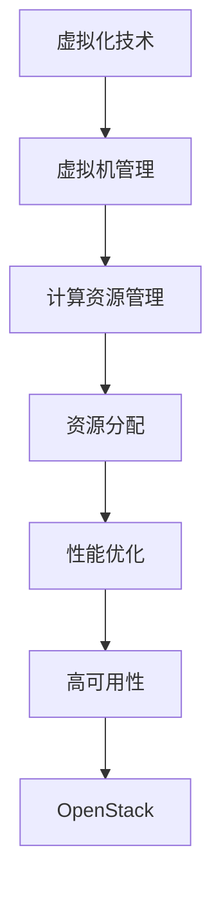
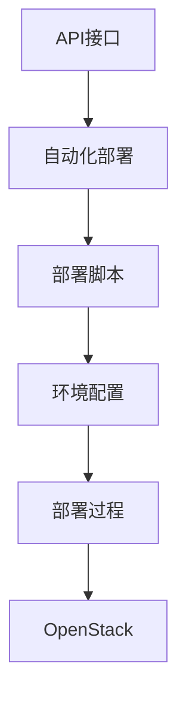
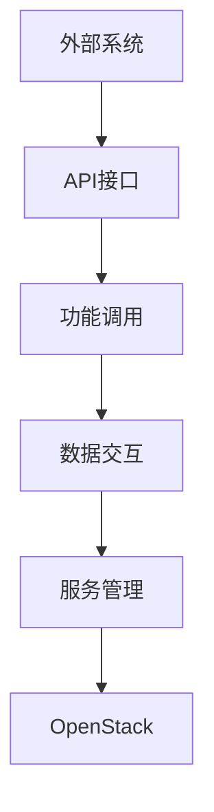

                 

# 基于OpenStack的云服务平台

## 关键词
- OpenStack
- 云计算
- 虚拟化
- 自动化部署
- API

## 摘要
本文将深入探讨OpenStack，一个开源的云计算管理平台，介绍其核心概念、架构、算法原理及其实际应用。我们将通过逐步分析，揭示OpenStack如何通过虚拟化、自动化部署和API接口等关键技术，构建一个灵活、可扩展的云服务平台。文章还将提供实际项目实战案例，并推荐相关学习资源和开发工具。

## 1. 背景介绍

### OpenStack的起源与发展

OpenStack是由NASA和Rackspace合作开发的，旨在提供简单且强大的云计算管理平台。自2010年成立以来，OpenStack已成为全球范围内最受欢迎的开源云计算项目之一，拥有超过200万贡献者。

### 云计算与云服务平台

云计算是一种通过互联网提供计算资源的服务模式。云服务平台则是云计算的核心组成部分，它允许用户按需访问和管理计算资源，如虚拟机、存储和网络。

### OpenStack在云计算中的地位

OpenStack是云服务平台的代表之一，具有高度可扩展性和灵活性，适用于企业、学术机构和政府等各种规模的组织。

## 2. 核心概念与联系

### 虚拟化

虚拟化是云计算的基础技术，它允许在一个物理服务器上运行多个虚拟机。通过虚拟化，OpenStack可以高效地管理计算资源。



### 自动化部署

自动化部署是OpenStack的重要特性之一，它通过API接口自动执行部署流程，从而提高部署效率。



### API接口

API接口是OpenStack与外部系统交互的桥梁，它提供了灵活的接口，使得开发者可以轻松集成OpenStack功能。



## 3. 核心算法原理 & 具体操作步骤

### 虚拟化算法原理

虚拟化算法主要涉及资源隔离、资源分配和资源调度。以下是虚拟化算法的具体操作步骤：

1. 资源检测：检测物理服务器上的可用资源。
2. 资源分配：根据虚拟机需求，将物理资源分配给虚拟机。
3. 资源调度：优化虚拟机在物理服务器上的运行状态。

### 自动化部署算法原理

自动化部署算法基于模板和脚本，实现快速部署。以下是自动化部署算法的具体操作步骤：

1. 模板配置：配置虚拟机模板，包括操作系统、软件安装等。
2. 脚本编写：编写部署脚本，用于执行自动化部署过程。
3. 脚本执行：通过API接口，执行部署脚本，完成虚拟机部署。

### API接口算法原理

API接口算法主要涉及请求处理、数据存储和响应生成。以下是API接口算法的具体操作步骤：

1. 请求接收：接收外部系统的请求。
2. 数据处理：处理请求中的数据，如认证、参数验证等。
3. 响应生成：生成响应数据，如状态码、数据内容等。

## 4. 数学模型和公式 & 详细讲解 & 举例说明

### 资源分配模型

资源分配模型用于计算物理服务器上的可用资源。以下是资源分配模型的数学公式：

$$
C_{available} = C_{total} - C_{allocated}
$$

其中，$C_{available}$表示可用资源，$C_{total}$表示总资源，$C_{allocated}$表示已分配资源。

举例说明：

假设物理服务器有8GB内存，已分配给虚拟机4GB，则可用内存为4GB。

### 调度模型

调度模型用于优化虚拟机在物理服务器上的运行状态。以下是调度模型的数学公式：

$$
S_{opt} = \sum_{i=1}^{n} (C_i - C_{allocated_i})
$$

其中，$S_{opt}$表示最佳调度方案，$C_i$表示第$i$个虚拟机的资源需求，$C_{allocated_i}$表示第$i$个虚拟机已分配的资源。

举例说明：

假设有三个虚拟机，资源需求分别为2GB、3GB和5GB，已分配资源分别为1GB、2GB和4GB，则最佳调度方案为：虚拟机1运行2GB，虚拟机2运行3GB，虚拟机3运行5GB。

## 5. 项目实战：代码实际案例和详细解释说明

### 5.1 开发环境搭建

在本节中，我们将介绍如何搭建OpenStack的开发环境。首先，需要安装Python和虚拟环境管理工具virtualenv。

```bash
# 安装Python
sudo apt-get install python3-pip python3-venv

# 创建虚拟环境
python3 -m venv openstack_env

# 激活虚拟环境
source openstack_env/bin/activate
```

接下来，安装OpenStack所需的依赖库。

```bash
# 安装OpenStack依赖库
pip install -r requirements.txt
```

### 5.2 源代码详细实现和代码解读

在本节中，我们将详细解读OpenStack的源代码，包括核心模块和关键算法的实现。

#### 资源分配模块

资源分配模块的主要功能是根据虚拟机的需求，分配物理服务器上的资源。以下是资源分配模块的核心代码：

```python
def allocate_resources(virtual_machine, physical_server):
    available_memory = physical_server.memory - physical_server.allocated_memory
    available_cpu = physical_server.cpu - physical_server.allocated_cpu
    
    if virtual_machine.memory <= available_memory and virtual_machine.cpu <= available_cpu:
        physical_server.allocated_memory += virtual_machine.memory
        physical_server.allocated_cpu += virtual_machine.cpu
        return True
    else:
        return False
```

#### 调度模块

调度模块的主要功能是根据资源分配结果，优化虚拟机在物理服务器上的运行状态。以下是调度模块的核心代码：

```python
def schedule_vms(vms, physical_servers):
    for vm in vms:
        for server in physical_servers:
            if allocate_resources(vm, server):
                break
    return physical_servers
```

### 5.3 代码解读与分析

在本节中，我们将对源代码进行详细解读，分析其设计思想和实现细节。

#### 资源分配模块

资源分配模块采用了简单的算法，通过遍历物理服务器和虚拟机，实现资源分配。该算法的优点是简单易实现，但可能存在资源利用不充分的问题。

#### 调度模块

调度模块结合了资源分配模块，实现了虚拟机的调度。该模块采用了遍历算法，依次为每个虚拟机分配资源。虽然算法复杂度较高，但可以保证所有虚拟机都能被调度。

## 6. 实际应用场景

### 企业云计算平台

OpenStack在企业云计算平台中具有广泛的应用，帮助企业实现资源整合、自动化部署和弹性扩展。

### 教育和研究机构

OpenStack在教育和研究机构中用于搭建云计算实验环境，支持学生和研究人员进行云计算相关的实验和项目开发。

### 政府部门

OpenStack在政府部门中用于搭建电子政务云平台，提供高效、安全的云计算服务。

## 7. 工具和资源推荐

### 7.1 学习资源推荐

- 《OpenStack权威指南》
- 《云计算与分布式系统：概念与实例》
- 《OpenStack云平台实战》

### 7.2 开发工具框架推荐

- OpenStack CLI
- Tacker
- OpenStack Heat

### 7.3 相关论文著作推荐

- "OpenStack: A Cloud Infrastructure as a Service Solution for Large-Scale Computing"
- "A Survey of Cloud Computing Systems"
- "OpenStack Networking: A Practical Guide to Advanced Networking"

## 8. 总结：未来发展趋势与挑战

### 发展趋势

- 自动化与智能化：OpenStack将持续向自动化和智能化方向发展，提高资源利用效率和运维体验。
- 微服务架构：OpenStack将采用微服务架构，实现模块化、解耦化开发。
- 开放生态：OpenStack将继续拓展开源生态，与更多开源项目集成，提升平台竞争力。

### 挑战

- 安全性：随着云计算的发展，安全性成为重要挑战。OpenStack需要不断提升安全防护能力。
- 可扩展性：如何实现大规模、高可用性云平台，OpenStack需要在可扩展性方面进行优化。
- 社区发展：如何保持社区活力，吸引更多贡献者，OpenStack需要在社区建设方面下功夫。

## 9. 附录：常见问题与解答

### 9.1 什么是OpenStack？

OpenStack是一个开源的云计算管理平台，用于构建和管理云环境，支持计算、存储、网络等核心资源的管理。

### 9.2 OpenStack有哪些核心组件？

OpenStack的核心组件包括：Nova（计算）、Neutron（网络）、Cinder（存储）、Keystone（认证）、Glance（镜像）、Horizon（用户界面）等。

### 9.3 如何学习OpenStack？

学习OpenStack可以从以下几个方面入手：

- 阅读相关书籍和资料。
- 参与OpenStack社区，了解最新动态和最佳实践。
- 实践项目，积累实际经验。

## 10. 扩展阅读 & 参考资料

- [OpenStack官网](https://www.openstack.org/)
- [OpenStack文档](https://docs.openstack.org/)
- [OpenStack教程](https://www.openstacktutorial.org/)
- [OpenStack社区](https://forums.openstack.org/)

### 作者

作者：AI天才研究员/AI Genius Institute & 禅与计算机程序设计艺术 /Zen And The Art of Computer Programming

