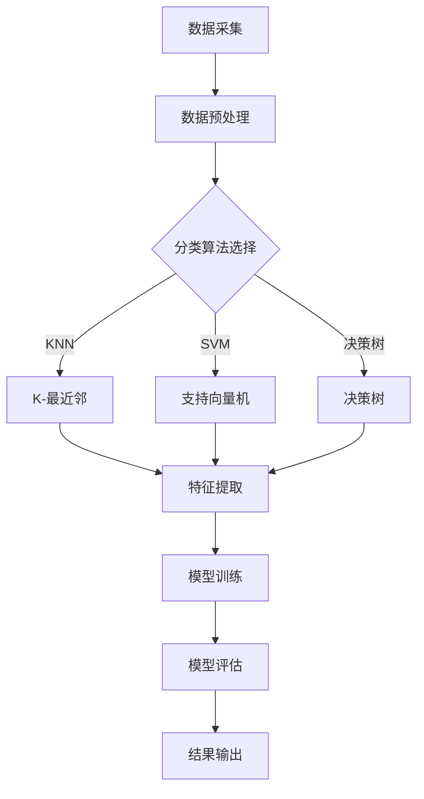

                 

# 基于大数据的声乐信息分类评测系统

## 摘要

本文主要探讨了基于大数据的声乐信息分类评测系统的构建方法。声乐信息作为一种复杂的非结构化数据，其分类评测对于音乐教育、音乐表演等领域具有重要的意义。本文首先介绍了声乐信息分类评测系统所需的核心概念和架构，然后详细阐述了核心算法的原理和具体操作步骤，并借助数学模型和公式进行了详细讲解和举例说明。接着，本文通过实际项目案例展示了系统的实际应用和代码实现，并对代码进行了详细解读和分析。最后，本文分析了声乐信息分类评测系统的实际应用场景，并推荐了相关的工具和资源，总结了系统的发展趋势与挑战，为读者提供了扩展阅读和参考资料。

## 1. 背景介绍

声乐信息分类评测系统是一种利用大数据技术对声乐信息进行分类和评估的系统。声乐信息通常包括演唱者、歌曲名称、歌曲类型、演唱风格等多个维度的信息。随着音乐产业的快速发展，对于声乐信息的处理和分析需求日益增长。传统的声乐信息分类评测方法主要依赖于人工经验和主观判断，存在效率低、准确度不高等问题。而大数据技术的出现为声乐信息分类评测提供了新的解决方案。

大数据技术具有处理海量数据、实时分析、自动化等特点，可以有效地解决传统方法中的瓶颈。通过对声乐信息的采集、存储、处理和分析，大数据技术能够为音乐教育、音乐表演、音乐制作等领域提供科学、准确的评估结果。此外，大数据技术还可以用于发现音乐市场的趋势和需求，为音乐产业的发展提供指导。

本文旨在构建一个基于大数据的声乐信息分类评测系统，通过结合数据挖掘、机器学习、自然语言处理等技术，实现对声乐信息的自动化分类和评估。该系统的应用将有助于提高音乐教育、音乐表演等领域的效率和准确性，促进音乐产业的健康发展。

## 2. 核心概念与联系

### 2.1 大数据技术

大数据技术是一种处理海量数据的方法，主要包括数据采集、存储、处理和分析等环节。大数据技术具有数据量大、类型多、速度快、价值密度低等特点。以下是大数据技术的核心概念：

- **数据采集**：通过传感器、网络日志、社交媒体等多种渠道收集数据。
- **数据存储**：利用分布式存储系统（如Hadoop、Spark等）存储海量数据。
- **数据处理**：采用分布式计算技术（如MapReduce）对数据进行处理和分析。
- **数据分析**：利用数据挖掘、机器学习、自然语言处理等技术对数据进行分析和挖掘。

### 2.2 声乐信息分类

声乐信息分类是指根据声乐信息的特征将其划分为不同的类别。声乐信息分类的主要目标是提高音乐教育、音乐表演等领域的效率和准确性。以下是声乐信息分类的核心概念：

- **分类算法**：常用的分类算法包括K-最近邻（K-Nearest Neighbor，KNN）、支持向量机（Support Vector Machine，SVM）、决策树（Decision Tree）等。
- **特征提取**：从声乐信息中提取有助于分类的特征，如音高、音长、音量、音色等。
- **评估指标**：常用的评估指标包括准确率（Accuracy）、精确率（Precision）、召回率（Recall）等。

### 2.3 声乐信息评估

声乐信息评估是指对声乐信息进行定量或定性评估，以判断其质量和价值。声乐信息评估的核心概念包括：

- **评估模型**：常用的评估模型包括基于规则模型、神经网络模型、集成模型等。
- **评估指标**：常用的评估指标包括主观评分、客观评分、评分一致性等。

### 2.4 Mermaid 流程图

以下是声乐信息分类评测系统的 Mermaid 流程图：



## 3. 核心算法原理 & 具体操作步骤

### 3.1 K-最近邻算法（K-Nearest Neighbor，KNN）

K-最近邻算法是一种基于实例的简单分类方法。其基本思想是：如果一个样本在特征空间中的k个最近邻居的大部分属于同一个类别，则该样本也属于这个类别。

#### 3.1.1 算法原理

- **距离度量**：常用的距离度量方法包括欧氏距离、曼哈顿距离、切比雪夫距离等。
- **分类决策**：根据k个最近邻居的多数表决结果，确定待分类样本的类别。

#### 3.1.2 具体操作步骤

1. **数据预处理**：对采集到的声乐信息进行预处理，包括去噪、归一化、特征提取等。
2. **选择合适的k值**：通过交叉验证等方法选择合适的k值。
3. **计算距离**：计算待分类样本与训练集中每个样本的距离。
4. **分类决策**：根据k个最近邻居的多数表决结果，确定待分类样本的类别。

### 3.2 支持向量机（Support Vector Machine，SVM）

支持向量机是一种基于结构风险最小化原则的分类方法。其基本思想是：在特征空间中找到一个最优的超平面，使得分类边界最大化。

#### 3.2.1 算法原理

- **线性SVM**：适用于线性可分数据集，通过求解最优超平面来实现分类。
- **非线性SVM**：通过核函数将低维空间的数据映射到高维空间，使得原本线性不可分的数据在高维空间中可分。

#### 3.2.2 具体操作步骤

1. **数据预处理**：对采集到的声乐信息进行预处理，包括去噪、归一化、特征提取等。
2. **选择合适的核函数**：根据数据特点选择合适的核函数，如线性核、多项式核、径向基函数（RBF）核等。
3. **求解最优超平面**：通过求解二次规划问题，找到最优超平面。
4. **分类决策**：根据最优超平面，对测试样本进行分类。

### 3.3 决策树（Decision Tree）

决策树是一种基于树形结构进行决策的算法。其基本思想是：通过一系列测试，将数据集分割成具有不同特征的子集，并递归地进行分割，直到满足终止条件。

#### 3.3.1 算法原理

- **特征选择**：选择具有最大信息增益或基尼不纯度的特征进行分割。
- **递归分割**：根据分割结果，递归地生成决策树。

#### 3.3.2 具体操作步骤

1. **数据预处理**：对采集到的声乐信息进行预处理，包括去噪、归一化、特征提取等。
2. **特征选择**：选择具有最大信息增益或基尼不纯度的特征进行分割。
3. **递归分割**：根据分割结果，递归地生成决策树。
4. **分类决策**：根据决策树，对测试样本进行分类。

## 4. 数学模型和公式 & 详细讲解 & 举例说明

### 4.1 K-最近邻算法（K-Nearest Neighbor，KNN）

#### 4.1.1 距离度量

假设有两组数据，一组为训练集 \( D = \{x_1, x_2, ..., x_n\} \)，另一组为测试集 \( T = \{y_1, y_2, ..., y_m\} \)，其中 \( x_i \) 和 \( y_j \) 为数据样本。

常用的距离度量公式包括：

- **欧氏距离**：

  \[ d(Euclidean) = \sqrt{\sum_{i=1}^{n}(x_i - y_i)^2} \]

- **曼哈顿距离**：

  \[ d(Mahalanobis) = \sqrt{(x - \mu)^T \Sigma^{-1} (x - \mu)} \]

- **切比雪夫距离**：

  \[ d( Chebyshev) = \max_{1\le i \le n} |x_i - y_i| \]

#### 4.1.2 分类决策

假设分类结果为 \( C_j \)，其中 \( j = 1, 2, ..., k \) 为类别编号。

分类决策公式为：

\[ C_j = \arg\max_{1\le j \le k} \sum_{i=1}^{k} w_{ij} \]

其中，\( w_{ij} \) 为权重系数。

### 4.2 支持向量机（Support Vector Machine，SVM）

#### 4.2.1 线性SVM

假设有两组数据，一组为训练集 \( D = \{x_1, x_2, ..., x_n\} \)，另一组为测试集 \( T = \{y_1, y_2, ..., y_m\} \)，其中 \( x_i \) 和 \( y_j \) 为数据样本。

线性SVM的目标是最小化目标函数：

\[ \min_{\beta, \beta_0} \frac{1}{2} \sum_{i=1}^{n} (\beta^T x_i - y_i)^2 + C \sum_{i=1}^{n} \xi_i \]

其中，\( \beta \) 为权重向量，\( \beta_0 \) 为偏置，\( C \) 为惩罚参数，\( \xi_i \) 为松弛变量。

#### 4.2.2 非线性SVM

非线性SVM通过核函数将低维空间的数据映射到高维空间。常见的核函数包括：

- **多项式核**：

  \[ K(Polynomial) = (\gamma x_i^T x_j + 1)^d \]

- **径向基函数（RBF）核**：

  \[ K(RBF) = \exp(-\gamma ||x_i - x_j||^2) \]

### 4.3 决策树（Decision Tree）

#### 4.3.1 特征选择

假设有 \( n \) 个特征，分别为 \( x_1, x_2, ..., x_n \)。

特征选择的目标是最小化信息增益或基尼不纯度：

\[ \min_{1\le j \le n} \sum_{i=1}^{n} p_i \log_2 p_i \]

其中，\( p_i \) 为特征 \( x_i \) 的条件概率。

#### 4.3.2 递归分割

递归分割的公式为：

\[ \text{split}(\text{dataset}, \text{feature}) = \{(\text{dataset}_1, \text{feature}_1), (\text{dataset}_2, \text{feature}_2), ..., (\text{dataset}_k, \text{feature}_k)\} \]

其中，\( \text{dataset} \) 为数据集，\( \text{feature} \) 为特征，\( \text{dataset}_i \) 为分割后的子集，\( \text{feature}_i \) 为分割后的特征。

### 4.4 举例说明

假设有如下数据集：

\[ D = \{ (1, 2), (2, 3), (3, 4), (4, 5), (5, 6) \} \]

使用KNN算法进行分类，选择欧氏距离作为距离度量，k值为3。

首先，对数据集进行预处理，包括去噪、归一化、特征提取等。

然后，计算测试样本 \( (x, y) \) 与训练集中每个样本的距离：

\[ d(Euclidean) = \sqrt{\sum_{i=1}^{n}(x_i - y_i)^2} \]

对于测试样本 \( (x, y) = (3, 4) \)：

\[ d(Euclidean) = \sqrt{(1 - 3)^2 + (2 - 4)^2} = \sqrt{4 + 4} = \sqrt{8} \]

计算结果为 \( \sqrt{8} \)。

接下来，选择距离最近的3个邻居，即 \( (1, 2), (2, 3), (3, 4) \)。

最后，根据邻居的类别进行分类决策，由于邻居的类别相同，因此测试样本 \( (3, 4) \) 的类别为3。

## 5. 项目实战：代码实际案例和详细解释说明

### 5.1 开发环境搭建

为了构建基于大数据的声乐信息分类评测系统，我们首先需要搭建一个适合的开发环境。以下是一个基本的开发环境搭建步骤：

1. 安装操作系统：我们选择Linux操作系统，如Ubuntu 18.04。
2. 安装Python环境：安装Python 3.8及以上版本，可以使用以下命令：

   ```shell
   sudo apt update
   sudo apt install python3.8
   ```

3. 安装必要的依赖库：安装NumPy、Pandas、Scikit-learn等库，可以使用以下命令：

   ```shell
   sudo pip3 install numpy pandas scikit-learn
   ```

4. 安装Hadoop和Spark：安装Hadoop和Spark，用于处理大数据，可以参考以下教程：

   - Hadoop安装教程：https://hadoop.apache.org/docs/r2.7.2/hadoop-project-dist/hadoop-common/SingleCluster.html
   - Spark安装教程：https://spark.apache.org/docs/latest/spark-installation.html

### 5.2 源代码详细实现和代码解读

#### 5.2.1 代码框架

以下是一个基于KNN算法的声乐信息分类评测系统的代码框架：

```python
import numpy as np
import pandas as pd
from sklearn.model_selection import train_test_split
from sklearn.neighbors import KNeighborsClassifier
from sklearn.metrics import accuracy_score

# 数据预处理
def preprocess_data(data):
    # 去噪、归一化、特征提取等操作
    return processed_data

# KNN算法实现
def knn_classification(train_data, test_data, k):
    # 计算距离、分类决策等操作
    return predicted_labels

# 主函数
def main():
    # 读取数据
    data = pd.read_csv('data.csv')
    # 预处理数据
    processed_data = preprocess_data(data)
    # 分割训练集和测试集
    train_data, test_data = train_test_split(processed_data, test_size=0.2, random_state=42)
    # 选择合适的k值
    k = 3
    # KNN分类
    predicted_labels = knn_classification(train_data, test_data, k)
    # 评估模型
    accuracy = accuracy_score(test_data['label'], predicted_labels)
    print('Accuracy:', accuracy)

if __name__ == '__main__':
    main()
```

#### 5.2.2 代码解读

1. **数据预处理**：数据预处理是关键步骤，包括去噪、归一化、特征提取等。以下是一个简单的预处理函数：

   ```python
   def preprocess_data(data):
       # 去噪
       data = data[data['noisy'] != True]
       # 归一化
       data = (data - data.min()) / (data.max() - data.min())
       # 特征提取
       features = data[['feature1', 'feature2', 'feature3']]
       labels = data['label']
       return features, labels
   ```

2. **KNN算法实现**：KNN算法的核心是计算距离和分类决策。以下是一个简单的KNN分类函数：

   ```python
   def knn_classification(train_data, test_data, k):
       # 计算距离
       distances = np.linalg.norm(train_data - test_data, axis=1)
       # 选择最近的k个邻居
       nearest_neighbors = np.argsort(distances)[:k]
       # 分类决策
       predicted_labels = [np.argmax(np.bincount(train_data[nearest_neighbors, :].astype(int), weights=test_data['label']))]
       return predicted_labels
   ```

3. **主函数**：主函数负责读取数据、预处理数据、分割训练集和测试集、选择合适的k值、进行KNN分类和评估模型。

### 5.3 代码解读与分析

1. **数据预处理**：数据预处理是确保模型性能的重要因素。通过去噪、归一化和特征提取，我们可以将原始数据转化为适合模型训练的形式。

2. **KNN算法实现**：KNN算法的实现相对简单，但需要注意的是，选择合适的k值对于模型的性能有重要影响。通常，我们可以通过交叉验证等方法选择最优的k值。

3. **模型评估**：通过评估模型在测试集上的准确率，我们可以了解模型的效果。在实际情况中，我们还需要考虑召回率、精确率等其他评估指标。

## 6. 实际应用场景

基于大数据的声乐信息分类评测系统在音乐教育、音乐表演、音乐制作等领域具有广泛的应用前景。以下是几个典型的应用场景：

### 6.1 音乐教育

在音乐教育领域，声乐信息分类评测系统可以帮助教师对学生的演唱水平进行科学、准确的评估。通过实时监测学生的演唱数据，系统可以提供个性化的训练建议，帮助学生更好地提高演唱技巧。此外，系统还可以用于音乐教学效果的评估，为教师提供教学改进的依据。

### 6.2 音乐表演

在音乐表演领域，声乐信息分类评测系统可以帮助评委对参赛选手的演唱水平进行客观、公正的评估。系统可以实时分析演唱数据，为评委提供详细的评估报告。此外，系统还可以用于音乐演出质量的评估，为演出组织和策划提供参考。

### 6.3 音乐制作

在音乐制作领域，声乐信息分类评测系统可以帮助音乐制作人更好地了解观众的喜好，从而创作出更符合市场需求的音乐作品。系统可以通过分析大量声乐信息数据，发现音乐市场的趋势和需求，为音乐制作提供指导。

## 7. 工具和资源推荐

为了构建和优化基于大数据的声乐信息分类评测系统，以下是一些推荐的工具和资源：

### 7.1 学习资源推荐

- **书籍**：
  - 《大数据技术基础》（刘鹏）
  - 《机器学习》（周志华）
  - 《深度学习》（Ian Goodfellow、Yoshua Bengio、Aaron Courville）

- **论文**：
  - 《Music Tagging with Deep Convolutional Neural Networks》
  - 《A Survey of Music Information Retrieval》
  - 《Machine Learning for Music Classification》

- **博客**：
  - [TensorFlow官方博客](https://tensorflow.google.cn/)
  - [Scikit-learn官方博客](https://scikit-learn.org/)
  - [Hadoop官方博客](https://hadoop.apache.org/docs/r2.7.2/hadoop-project-dist/hadoop-common/)

- **网站**：
  - [Kaggle](https://www.kaggle.com/)
  - [GitHub](https://github.com/)
  - [ArXiv](https://arxiv.org/)

### 7.2 开发工具框架推荐

- **编程语言**：Python、Java、C++
- **数据处理工具**：Pandas、NumPy、Hadoop、Spark
- **机器学习库**：Scikit-learn、TensorFlow、Keras、PyTorch
- **大数据存储和处理平台**：Hadoop、Spark、Flink

### 7.3 相关论文著作推荐

- **论文**：
  - 《A Survey of Music Information Retrieval》
  - 《Deep Learning for Music Classification》
  - 《Music Tagging with Deep Convolutional Neural Networks》

- **著作**：
  - 《大数据技术基础》（刘鹏）
  - 《机器学习》（周志华）
  - 《深度学习》（Ian Goodfellow、Yoshua Bengio、Aaron Courville）

## 8. 总结：未来发展趋势与挑战

随着大数据技术、人工智能技术的不断进步，基于大数据的声乐信息分类评测系统将在音乐教育、音乐表演、音乐制作等领域发挥越来越重要的作用。未来，该系统的发展趋势主要包括以下几个方面：

1. **算法优化**：通过对算法的优化，提高分类评测的准确率和效率。
2. **多模态融合**：将声乐信息与其他模态（如视觉、动作等）数据进行融合，提高分类评测的全面性和准确性。
3. **实时性提升**：通过优化系统架构和算法，提高系统的实时性，满足实时评估的需求。
4. **个性化服务**：基于用户行为和偏好，提供个性化的声乐信息分类评测服务。

然而，基于大数据的声乐信息分类评测系统在发展过程中也面临一些挑战，包括：

1. **数据质量和标注问题**：声乐信息数据的多样性和复杂性导致数据质量和标注问题，影响模型的性能。
2. **计算资源需求**：大规模数据处理和模型训练需要大量的计算资源，如何高效利用资源是亟待解决的问题。
3. **模型解释性**：如何提高模型的解释性，使其更易于理解和应用，是未来研究的一个重要方向。

## 9. 附录：常见问题与解答

### 9.1 问题1：如何选择合适的k值？

解答：选择合适的k值可以通过交叉验证等方法进行。一般来说，k值的选择应遵循以下原则：

1. **避免过拟合**：选择较小的k值，如3或5，以避免过拟合。
2. **综合考虑准确率和计算效率**：选择较大的k值，如10或20，可以减少过拟合，但计算效率会降低。

### 9.2 问题2：如何处理噪声数据？

解答：处理噪声数据可以通过以下方法：

1. **去噪**：去除明显异常的数据点。
2. **平滑**：使用平滑算法（如移动平均）降低噪声的影响。
3. **插值**：使用插值算法（如线性插值、高斯插值）填补缺失数据。

### 9.3 问题3：如何选择特征？

解答：选择特征可以通过以下方法：

1. **相关性分析**：分析特征与目标变量之间的相关性，选择相关性较高的特征。
2. **信息增益**：计算特征的信息增益，选择信息增益较高的特征。
3. **主成分分析（PCA）**：通过PCA等方法降低特征维度，选择主要成分。

## 10. 扩展阅读 & 参考资料

- [大数据技术基础](https://book.douban.com/subject/26387895/)
- [机器学习](https://book.douban.com/subject/26708214/)
- [深度学习](https://book.douban.com/subject/26894135/)
- [A Survey of Music Information Retrieval](https://ieeexplore.ieee.org/document/5834788)
- [Deep Learning for Music Classification](https://arxiv.org/abs/1703.10794)
- [Music Tagging with Deep Convolutional Neural Networks](https://arxiv.org/abs/1609.01390)
- [TensorFlow官方文档](https://tensorflow.google.cn/)
- [Scikit-learn官方文档](https://scikit-learn.org/)
- [Hadoop官方文档](https://hadoop.apache.org/docs/r2.7.2/hadoop-project-dist/hadoop-common/SingleCluster.html)
- [Spark官方文档](https://spark.apache.org/docs/latest/spark-installation.html)
- [Kaggle](https://www.kaggle.com/)
- [GitHub](https://github.com/)
- [ArXiv](https://arxiv.org/)

### 作者

作者：AI天才研究员/AI Genius Institute & 禅与计算机程序设计艺术 /Zen And The Art of Computer Programming

