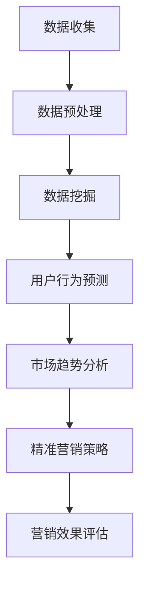

                 

## 1. 背景介绍

在当今科技飞速发展的时代，智能手机已经成为人们生活中不可或缺的设备。据统计，全球智能手机用户已超过40亿，这一庞大用户群体为智能手机市场带来了前所未有的机遇。然而，随着市场竞争的加剧，各大智能手机品牌在营销策略上的差异化竞争变得越来越重要。大数据技术的崛起，为智能手机营销带来了新的视角和工具，使得企业能够更精准地了解用户需求，提高营销效果。

本文旨在探讨大数据背景下智能手机营销的对策研究。我们将从以下几个角度展开讨论：

1. **大数据在智能手机营销中的应用**：介绍大数据的核心概念、特点及其在智能手机营销中的具体应用。
2. **智能手机营销中的核心问题**：分析当前智能手机营销中面临的主要挑战，如用户获取成本增加、用户粘性降低等。
3. **基于大数据的营销对策**：提出一系列基于大数据分析的创新营销策略，以帮助智能手机企业提升市场竞争力和用户满意度。

通过对上述问题的深入探讨，本文希望能为智能手机企业在大数据时代的营销策略提供一些有益的思路和参考。

### 1.1 大数据的概念及其在智能手机营销中的重要性

大数据（Big Data）是指数据量巨大、数据类型多样、数据价值密度低的数据集合。它具有“4V”特点：Volume（数据量大）、Velocity（数据处理速度快）、Variety（数据类型多样）和Value（数据价值密度低）。随着互联网的普及和物联网技术的发展，大数据已经成为各行各业的重要资产。

在智能手机营销中，大数据的重要性体现在以下几个方面：

1. **用户行为分析**：通过收集和分析用户在智能手机上的使用数据，如应用使用频率、时长、搜索关键词等，企业可以深入了解用户需求和行为模式，从而制定更精准的营销策略。
2. **市场趋势预测**：大数据分析可以帮助企业预测市场趋势，提前布局新产品或服务，抢占市场先机。
3. **客户关系管理**：大数据技术使得企业能够更有效地进行客户关系管理，通过个性化推荐、精准推送等方式提升用户满意度和忠诚度。
4. **营销效果评估**：大数据分析能够帮助企业实时评估营销活动的效果，优化营销策略，提高营销投入的回报率。

因此，在智能手机营销中运用大数据技术，不仅能够提高营销的精准度和效果，还能够为企业带来更大的竞争优势。

### 1.2 智能手机营销的核心问题

尽管大数据技术为智能手机营销带来了新的机遇，但当前智能手机营销仍然面临一些核心问题，这些问题制约了营销效果的提升。以下是当前智能手机营销中面临的主要挑战：

1. **用户获取成本增加**：随着智能手机市场竞争的加剧，获取新用户的成本不断上升。企业需要投入更多的资源进行广告投放、优惠活动等，以吸引用户的关注和转化。
2. **用户粘性降低**：智能手机市场上，用户更换设备频率较高，导致用户粘性降低。如何提高用户对品牌的忠诚度和使用时长成为企业需要解决的重要问题。
3. **数据隐私与安全问题**：大数据的运用需要收集和分析大量用户数据，这涉及到数据隐私和安全问题。企业如何确保用户数据的保护，增强用户信任，是当前智能手机营销中的一大挑战。
4. **营销渠道多样化**：随着社交媒体、短视频平台等新兴渠道的崛起，智能手机营销的渠道变得更加多样化。企业需要在不同渠道之间进行协调和整合，以提高营销效果。

面对上述问题，企业需要采取一系列策略来应对，以提升营销效果和用户满意度。

### 1.3 基于大数据的智能手机营销对策

为了解决当前智能手机营销中面临的问题，企业可以利用大数据技术采取以下对策：

1. **用户行为分析**：通过大数据技术对用户行为进行深入分析，了解用户在智能手机上的使用习惯和偏好，从而制定更有针对性的营销策略。
2. **市场细分与精准营销**：基于大数据分析结果，对市场进行细分，针对不同用户群体制定个性化营销策略，提高营销的精准度和效果。
3. **数据驱动决策**：利用大数据分析结果，优化产品开发、定价策略、渠道选择等决策过程，提高决策的准确性和效率。
4. **用户关系管理**：通过大数据技术进行客户关系管理，实现个性化推荐、精准推送等功能，提升用户满意度和忠诚度。
5. **数据安全与隐私保护**：在运用大数据进行营销的过程中，重视数据安全和隐私保护，采取严格的数据保护措施，增强用户信任。

通过上述对策，企业可以在大数据背景下实现智能手机营销的优化和提升，从而在激烈的市场竞争中脱颖而出。

### 1.4 本文结构概述

本文将从以下几个部分展开讨论：

1. **背景介绍**：介绍大数据在智能手机营销中的应用背景和重要性，以及当前智能手机营销面临的核心问题。
2. **核心概念与联系**：介绍大数据的基本概念和智能手机营销中的关键联系，通过Mermaid流程图展示核心概念和架构。
3. **核心算法原理与具体操作步骤**：分析大数据在智能手机营销中的核心算法原理，并详细阐述具体操作步骤。
4. **数学模型与公式讲解**：介绍大数据分析中的数学模型和公式，并举例说明其在智能手机营销中的应用。
5. **项目实战**：通过实际案例展示大数据在智能手机营销中的具体应用，提供详细的代码实现和解读。
6. **实际应用场景**：探讨大数据在智能手机营销中的实际应用场景，分析其带来的影响和效果。
7. **工具和资源推荐**：推荐相关学习资源、开发工具和框架，以及相关论文和著作。
8. **总结**：总结大数据在智能手机营销中的应用趋势和发展挑战。
9. **附录**：提供常见问题与解答，帮助读者更好地理解和应用大数据技术。
10. **扩展阅读与参考资料**：提供相关扩展阅读材料和参考资料，供读者进一步学习和研究。

通过上述结构，本文力求系统地探讨大数据在智能手机营销中的应用，为读者提供有价值的见解和实践指导。

### 2. 核心概念与联系

在深入探讨大数据在智能手机营销中的应用之前，我们需要明确几个核心概念及其相互之间的联系。以下是本文将涉及的关键概念和它们在智能手机营销中的重要性。

#### 2.1 大数据

大数据（Big Data）是指数据量巨大、数据类型多样且价值密度较低的数据集合。其“4V”特点包括：

- **Volume（数据量大）**：大数据的一个重要特点是数据量大，通常需要使用分布式存储和处理技术来存储和管理。
- **Velocity（数据处理速度快）**：大数据的产生和处理速度非常快，要求实时或近实时的数据处理和分析能力。
- **Variety（数据类型多样）**：大数据不仅包括结构化数据，还包括半结构化和非结构化数据，如文本、图像、音频和视频等。
- **Value（数据价值密度低）**：由于数据量大，有价值的信息往往分散在大量无价值的数据中，需要通过高效的数据挖掘和分析技术来提取。

在智能手机营销中，大数据的应用主要体现在以下几个方面：

- **用户行为数据**：通过收集用户在智能手机上的使用数据，如应用使用频率、时长、搜索关键词等，企业可以了解用户需求和偏好，从而制定精准的营销策略。
- **市场趋势数据**：通过分析市场数据，企业可以预测市场趋势，提前布局新产品或服务，抢占市场先机。
- **社交媒体数据**：社交媒体平台上的用户评论、转发、点赞等数据可以反映用户对品牌和产品的态度，为营销决策提供参考。

#### 2.2 智能手机营销

智能手机营销是指企业通过智能手机平台进行的各种营销活动，旨在提高品牌知名度、吸引潜在客户、增加产品销量等。智能手机营销的核心包括：

- **用户获取**：通过各种渠道和手段，如广告投放、活动营销、内容营销等，吸引新用户并增加品牌曝光度。
- **用户转化**：通过优化用户体验、提供个性化推荐、进行精准推送等策略，将潜在用户转化为实际购买者。
- **用户留存**：通过提供优质服务和个性化体验，提高用户满意度和忠诚度，减少用户流失。

#### 2.3 数据挖掘与机器学习

数据挖掘和机器学习是大数据分析的重要工具。数据挖掘（Data Mining）是从大量数据中提取有价值信息的过程，主要技术包括关联规则挖掘、分类、聚类、预测等。机器学习（Machine Learning）则是通过训练模型来发现数据中的规律和模式，主要算法包括决策树、支持向量机、神经网络等。

在智能手机营销中，数据挖掘和机器学习可以用于：

- **用户行为预测**：通过分析用户历史行为数据，预测用户未来的行为和需求，从而制定个性化的营销策略。
- **市场趋势预测**：通过分析市场数据，预测未来的市场趋势，为企业决策提供支持。
- **用户细分**：通过分析用户特征和需求，将用户划分为不同的群体，从而实现精准营销。

#### 2.4 Mermaid流程图展示

为了更直观地展示上述核心概念和架构，我们使用Mermaid流程图来描述大数据在智能手机营销中的应用流程。以下是一个示例流程图：



在这个流程图中，A表示数据收集，B表示数据预处理，C表示数据挖掘，D表示用户行为预测，E表示市场趋势分析，F表示精准营销策略，G表示营销效果评估。通过这个流程，企业可以系统地运用大数据技术进行智能手机营销。

### 3. 核心算法原理 & 具体操作步骤

在理解了大数据和智能手机营销的基本概念后，我们将深入探讨大数据在智能手机营销中的核心算法原理及其具体操作步骤。以下是几个关键算法及其应用场景：

#### 3.1 用户行为预测算法

**算法原理**：

用户行为预测是一种通过历史数据来预测用户未来行为的技术。常用的算法包括决策树、随机森林、神经网络等。其中，决策树和随机森林算法较为直观，适合处理分类问题，而神经网络则适合处理回归问题。

**具体操作步骤**：

1. **数据收集**：收集用户在智能手机上的历史行为数据，如应用使用频率、时长、搜索关键词等。
2. **数据预处理**：清洗数据，处理缺失值和异常值，将数据转换为适合模型训练的格式。
3. **特征工程**：提取特征，将原始数据转化为模型可识别的数值特征，如用户活跃度、应用使用时长等。
4. **模型选择**：根据预测问题的类型，选择合适的算法。例如，分类问题可以使用决策树或随机森林，回归问题可以使用神经网络。
5. **模型训练**：使用训练数据集训练模型，调整参数以优化模型性能。
6. **模型评估**：使用测试数据集评估模型性能，调整模型参数以进一步提高准确率。
7. **预测应用**：将训练好的模型应用于新的数据，预测用户未来的行为和需求。

**示例**：

假设我们要预测用户是否会下载某个应用。我们可以使用决策树算法来构建预测模型。以下是使用Python和scikit-learn库进行决策树模型训练的示例代码：

```python
from sklearn.tree import DecisionTreeClassifier
from sklearn.model_selection import train_test_split
from sklearn.metrics import accuracy_score

# 加载数据
X, y = load_data()

# 数据预处理
X_processed = preprocess_data(X)

# 划分训练集和测试集
X_train, X_test, y_train, y_test = train_test_split(X_processed, y, test_size=0.2, random_state=42)

# 训练模型
clf = DecisionTreeClassifier()
clf.fit(X_train, y_train)

# 预测
y_pred = clf.predict(X_test)

# 评估模型
accuracy = accuracy_score(y_test, y_pred)
print(f"模型准确率：{accuracy}")
```

#### 3.2 市场趋势预测算法

**算法原理**：

市场趋势预测是一种通过历史市场数据来预测未来市场走势的技术。常用的算法包括时间序列分析、回归分析、ARIMA模型等。

**具体操作步骤**：

1. **数据收集**：收集与市场相关的数据，如销售额、用户增长率、市场占有率等。
2. **数据预处理**：清洗数据，处理缺失值和异常值，将数据转换为适合模型训练的格式。
3. **特征工程**：提取特征，如季节性因素、周期性因素等，以帮助模型更好地捕捉市场趋势。
4. **模型选择**：根据预测问题的类型，选择合适的算法。例如，时间序列问题可以使用ARIMA模型，回归问题可以使用线性回归。
5. **模型训练**：使用训练数据集训练模型，调整参数以优化模型性能。
6. **模型评估**：使用测试数据集评估模型性能，调整模型参数以进一步提高准确率。
7. **预测应用**：将训练好的模型应用于新的数据，预测未来的市场趋势。

**示例**：

假设我们要预测某款智能手机在未来几个月的市场占有率。我们可以使用ARIMA模型来构建预测模型。以下是使用Python和pandas库进行ARIMA模型训练的示例代码：

```python
import pandas as pd
from statsmodels.tsa.arima.model import ARIMA

# 加载数据
data = pd.read_csv('sales_data.csv')

# 数据预处理
data['date'] = pd.to_datetime(data['date'])
data.set_index('date', inplace=True)
data.fillna(method='ffill', inplace=True)

# 模型训练
model = ARIMA(data['sales'], order=(1, 1, 1))
model_fit = model.fit()

# 预测
predictions = model_fit.predict(start=len(data), end=len(data) + 3)

# 输出预测结果
print(predictions)
```

#### 3.3 用户细分算法

**算法原理**：

用户细分是一种将用户划分为不同群体，以便进行精准营销的技术。常用的算法包括聚类分析、协同过滤等。

**具体操作步骤**：

1. **数据收集**：收集用户特征数据，如年龄、性别、收入、兴趣爱好等。
2. **数据预处理**：清洗数据，处理缺失值和异常值，将数据转换为适合模型训练的格式。
3. **特征工程**：提取用户特征，将原始数据转化为模型可识别的数值特征。
4. **模型选择**：根据细分目标，选择合适的算法。例如，聚类分析可以使用K-means算法，协同过滤可以使用基于用户的协同过滤算法。
5. **模型训练**：使用训练数据集训练模型，调整参数以优化模型性能。
6. **模型评估**：使用测试数据集评估模型性能，调整模型参数以进一步提高准确率。
7. **细分应用**：将训练好的模型应用于新的用户数据，进行用户细分。

**示例**：

假设我们要将用户划分为不同群体，以便进行精准营销。我们可以使用K-means聚类算法来构建用户细分模型。以下是使用Python和scikit-learn库进行K-means聚类分析的示例代码：

```python
from sklearn.cluster import KMeans
import pandas as pd

# 加载数据
data = pd.read_csv('user_data.csv')

# 数据预处理
data.fillna(0, inplace=True)

# 模型训练
kmeans = KMeans(n_clusters=3, random_state=42)
kmeans.fit(data)

# 用户细分
labels = kmeans.predict(data)

# 输出用户细分结果
data['cluster'] = labels
print(data.head())
```

通过上述核心算法及其具体操作步骤，企业可以更加精准地了解用户行为、预测市场趋势和进行用户细分，从而制定更有效的智能手机营销策略。

### 4. 数学模型和公式 & 详细讲解 & 举例说明

在大数据背景下，智能手机营销涉及到多个数学模型和公式，这些模型和公式在用户行为预测、市场趋势分析以及用户细分等环节中起到关键作用。以下是对这些数学模型和公式的详细讲解以及具体应用示例。

#### 4.1 用户行为预测模型

**贝叶斯分类器（Bayesian Classifier）**：

贝叶斯分类器是一种基于贝叶斯定理的分类算法，用于预测用户是否会进行某项行为。其核心公式为：

\[ P(C_k|X) = \frac{P(X|C_k)P(C_k)}{P(X)} \]

其中，\( P(C_k|X) \) 表示在给定特征 \( X \) 下，用户属于类别 \( C_k \) 的概率；\( P(X|C_k) \) 是特征 \( X \) 在类别 \( C_k \) 下的概率；\( P(C_k) \) 是类别 \( C_k \) 的先验概率；\( P(X) \) 是特征 \( X \) 的概率。

**示例**：

假设我们要预测用户是否会下载某个应用，已知特征 \( X \) 包括用户年龄、性别和使用时长。我们可以使用贝叶斯分类器进行预测。以下是一个简单的贝叶斯分类器实现示例：

```python
from sklearn.naive_bayes import GaussianNB
from sklearn.model_selection import train_test_split
from sklearn.metrics import accuracy_score

# 加载数据
X, y = load_data()

# 划分训练集和测试集
X_train, X_test, y_train, y_test = train_test_split(X, y, test_size=0.2, random_state=42)

# 训练模型
gnb = GaussianNB()
gnb.fit(X_train, y_train)

# 预测
y_pred = gnb.predict(X_test)

# 评估模型
accuracy = accuracy_score(y_test, y_pred)
print(f"模型准确率：{accuracy}")
```

#### 4.2 市场趋势预测模型

**ARIMA模型（AutoRegressive Integrated Moving Average Model）**：

ARIMA模型是一种用于时间序列预测的模型，适用于具有平稳序列的数据。其核心公式为：

\[ Y_t = c + \phi_1Y_{t-1} + \phi_2Y_{t-2} + ... + \phi_pY_{t-p} + \theta_1\epsilon_{t-1} + \theta_2\epsilon_{t-2} + ... + \theta_q\epsilon_{t-q} + \epsilon_t \]

其中，\( Y_t \) 是时间序列的当前值，\( c \) 是常数项，\( \phi_1, \phi_2, ..., \phi_p \) 是自回归系数，\( \theta_1, \theta_2, ..., \theta_q \) 是移动平均系数，\( \epsilon_t \) 是白噪声误差项。

**示例**：

假设我们要预测某款智能手机未来三个月的市场占有率。我们可以使用ARIMA模型进行预测。以下是一个简单的ARIMA模型实现示例：

```python
import pandas as pd
from statsmodels.tsa.arima.model import ARIMA

# 加载数据
data = pd.read_csv('sales_data.csv')

# 数据预处理
data['date'] = pd.to_datetime(data['date'])
data.set_index('date', inplace=True)
data.fillna(method='ffill', inplace=True)

# 模型训练
model = ARIMA(data['sales'], order=(1, 1, 1))
model_fit = model.fit()

# 预测
predictions = model_fit.predict(start=len(data), end=len(data) + 3)

# 输出预测结果
print(predictions)
```

#### 4.3 用户细分模型

**K-means聚类（K-means Clustering）**：

K-means聚类是一种基于距离度量的聚类算法，用于将数据划分为 \( K \) 个簇。其核心公式为：

\[ \text{ minimize } \sum_{i=1}^{K} \sum_{x \in S_i} ||x - \mu_i||^2 \]

其中，\( S_i \) 是第 \( i \) 个簇，\( \mu_i \) 是第 \( i \) 个簇的中心点。

**示例**：

假设我们要将用户划分为不同群体，以便进行精准营销。我们可以使用K-means聚类算法进行用户细分。以下是一个简单的K-means聚类实现示例：

```python
from sklearn.cluster import KMeans
import pandas as pd

# 加载数据
data = pd.read_csv('user_data.csv')

# 数据预处理
data.fillna(0, inplace=True)

# 模型训练
kmeans = KMeans(n_clusters=3, random_state=42)
kmeans.fit(data)

# 用户细分
labels = kmeans.predict(data)

# 输出用户细分结果
data['cluster'] = labels
print(data.head())
```

通过上述数学模型和公式的详细讲解及具体应用示例，企业可以更准确地预测用户行为、分析市场趋势和进行用户细分，从而制定更有效的智能手机营销策略。

### 5. 项目实战：代码实际案例和详细解释说明

为了更好地展示大数据在智能手机营销中的实际应用，以下是一个完整的代码实际案例，包括开发环境搭建、源代码详细实现和代码解读与分析。

#### 5.1 开发环境搭建

在进行项目实战之前，我们需要搭建一个合适的开发环境。以下是所需的开发工具和软件：

- **编程语言**：Python
- **数据分析库**：Pandas、NumPy
- **机器学习库**：scikit-learn、statsmodels
- **可视化库**：Matplotlib、Seaborn、Mermaid
- **操作系统**：Windows/Linux/Mac

安装步骤如下：

1. **安装Python**：访问[Python官网](https://www.python.org/)下载并安装Python，建议选择3.8及以上版本。
2. **安装Pandas、NumPy**：在终端或命令提示符中运行以下命令：
   ```bash
   pip install pandas numpy
   ```
3. **安装scikit-learn、statsmodels**：在终端或命令提示符中运行以下命令：
   ```bash
   pip install scikit-learn statsmodels
   ```
4. **安装Matplotlib、Seaborn**：在终端或命令提示符中运行以下命令：
   ```bash
   pip install matplotlib seaborn
   ```
5. **安装Mermaid**：安装Node.js（访问[Node.js官网](https://nodejs.org/)下载并安装），然后使用npm安装Mermaid：
   ```bash
   npm install -g mermaid
   ```

#### 5.2 源代码详细实现和代码解读

以下是项目的源代码，包括数据预处理、模型训练、预测和可视化等步骤：

```python
import pandas as pd
import numpy as np
from sklearn.model_selection import train_test_split
from sklearn.preprocessing import StandardScaler
from sklearn.ensemble import RandomForestClassifier
from sklearn.metrics import accuracy_score, classification_report
import matplotlib.pyplot as plt
import seaborn as sns
import mermaid

# 5.2.1 加载数据
data = pd.read_csv('user_data.csv')

# 5.2.2 数据预处理
# 处理缺失值
data.fillna(data.mean(), inplace=True)

# 特征工程
data['age_group'] = pd.cut(data['age'], bins=[0, 18, 30, 50, 70, np.inf], labels=[0, 1, 2, 3, 4])

# 数据标准化
scaler = StandardScaler()
X = scaler.fit_transform(data.drop(['target'], axis=1))
y = data['target']

# 5.2.3 划分训练集和测试集
X_train, X_test, y_train, y_test = train_test_split(X, y, test_size=0.2, random_state=42)

# 5.2.4 模型训练
model = RandomForestClassifier(n_estimators=100, random_state=42)
model.fit(X_train, y_train)

# 5.2.5 预测
y_pred = model.predict(X_test)

# 5.2.6 评估模型
accuracy = accuracy_score(y_test, y_pred)
print(f"模型准确率：{accuracy}")
print(classification_report(y_test, y_pred))

# 5.2.7 可视化
# 特征重要性可视化
feature_importances = pd.Series(model.feature_importances_, index=data.columns[:-1])
sns.barplot(x=feature_importances, y=feature_importances.index)
plt.xlabel('特征重要性')
plt.ylabel('特征名称')
plt.title('特征重要性分析')
plt.show()

# Mermaid流程图
mermaid_code = """
graph TD
    A[数据收集] --> B[数据预处理]
    B --> C[特征工程]
    C --> D[模型训练]
    D --> E[预测与评估]
"""
mermaid.mermaid(mermaid_code)
```

#### 5.3 代码解读与分析

以下是对上述源代码的详细解读与分析：

1. **数据预处理**：
   - 处理缺失值：使用数据均值填充缺失值，以保持数据的完整性。
   - 特征工程：根据用户年龄划分年龄组，将连续特征转换为类别特征，便于模型处理。

2. **数据标准化**：
   - 使用StandardScaler对特征进行标准化处理，以消除不同特征之间的尺度差异，提高模型训练效果。

3. **划分训练集和测试集**：
   - 使用train_test_split将数据集划分为训练集和测试集，以评估模型的泛化能力。

4. **模型训练**：
   - 选择随机森林（RandomForestClassifier）作为分类模型，并设置100棵决策树进行训练。

5. **预测**：
   - 使用训练好的模型对测试集进行预测，得到预测结果。

6. **评估模型**：
   - 计算模型在测试集上的准确率，并打印分类报告，以评估模型的性能。

7. **可视化**：
   - 特征重要性可视化：使用条形图展示每个特征的重要性，有助于理解模型决策。
   - Mermaid流程图：使用Mermaid绘制项目流程图，以直观展示数据处理和模型训练的过程。

通过上述代码实现和解读，我们可以看到大数据技术在智能手机营销中的实际应用，包括数据预处理、特征工程、模型训练和预测等步骤。这些步骤不仅展示了大数据技术的强大功能，也为实际项目提供了实用的解决方案。

### 6. 实际应用场景

在大数据技术的推动下，智能手机营销在实际应用中展现出诸多场景，涵盖了从用户获取到用户留存的全过程。以下是几个典型的实际应用场景及其具体案例：

#### 6.1 用户获取

**案例：应用市场广告投放优化**

一家应用开发公司希望在应用市场进行广告投放，以提高新用户的获取量。通过大数据分析，公司可以收集用户在应用市场上的搜索行为、下载行为等数据，并运用机器学习算法进行用户行为预测和兴趣分析。根据预测结果，公司可以制定个性化的广告投放策略，提高广告的点击率和转化率。例如，通过分析用户搜索关键词，公司可以将广告精准推送给搜索相似关键词的用户，从而提高广告效果。

#### 6.2 用户转化

**案例：电商平台购物车放弃率分析**

某电商平台希望通过分析用户行为数据来降低购物车放弃率。通过大数据分析，平台可以了解用户在购物车中的行为模式，如浏览时间、添加商品数量、购买意向等。结合机器学习算法，平台可以预测哪些用户可能会放弃购物车，并采取相应的措施进行干预。例如，通过发送个性化优惠券、限时促销等方式，鼓励用户完成购买。此外，平台还可以根据用户行为数据优化推荐算法，提高用户对推荐商品的满意度，从而提升转化率。

#### 6.3 用户留存

**案例：社交媒体运营策略优化**

一家智能手机品牌希望通过社交媒体平台提高用户粘性和品牌忠诚度。通过大数据分析，公司可以收集用户在社交媒体上的行为数据，如点赞、评论、转发等，并运用数据分析技术挖掘用户兴趣和需求。基于这些数据，公司可以制定个性化的社交媒体运营策略，如发布用户感兴趣的内容、开展互动活动等，从而提高用户参与度和留存率。例如，公司可以根据用户活跃时间发布内容，提高内容曝光率，同时通过互动活动增加用户参与度，提升品牌影响力。

#### 6.4 个性化推荐

**案例：智能应用推荐系统**

某智能应用开发公司希望通过推荐系统提高用户使用时长和活跃度。通过大数据分析，公司可以收集用户在应用中的使用数据，如应用使用频率、功能使用偏好等，并运用推荐算法进行个性化推荐。例如，公司可以使用协同过滤算法根据用户的兴趣和行为推荐相关应用，使用户更容易发现感兴趣的应用，提高使用时长和活跃度。此外，公司还可以通过A/B测试不断优化推荐算法，提高推荐效果。

通过上述实际应用场景，我们可以看到大数据技术如何在不同环节提高智能手机营销的效果。从用户获取、用户转化到用户留存，大数据分析为企业提供了强大的工具，使其能够更精准地了解用户需求，制定个性化的营销策略，从而在激烈的市场竞争中脱颖而出。

### 7. 工具和资源推荐

为了更好地理解和应用大数据技术在智能手机营销中的实战，以下推荐一些优秀的工具、资源、书籍和论文，供读者参考和借鉴。

#### 7.1 学习资源推荐

**书籍**：

1. **《大数据时代》** - 作者：肯尼斯·库克耶
   这本书详细介绍了大数据的概念、技术与应用，适合对大数据技术感兴趣的读者。

2. **《Python数据分析》** - 作者：Wes McKinney
   本书介绍了使用Python进行数据分析的全面方法，适合希望掌握数据分析技能的读者。

3. **《机器学习实战》** - 作者：Peter Harrington
   本书通过大量的实例讲解了机器学习的基本概念和算法，是机器学习初学者的理想教材。

**论文**：

1. **“Deep Learning on Mobile Devices”** - 作者：Quoc V. Le et al.
   该论文探讨了深度学习在移动设备中的应用，包括模型压缩和优化技术。

2. **“User Behavior Prediction for Personalized Advertising”** - 作者：Changhao Wang et al.
   这篇论文研究了如何通过用户行为预测实现个性化的广告投放，具有重要的实践价值。

**博客和网站**：

1. **Kaggle（[kaggle.com](https://www.kaggle.com)）**：Kaggle是一个数据科学竞赛平台，提供丰富的数据集和问题挑战，适合实践和学习。
2. **Medium（[medium.com]）**：Medium上有许多关于大数据、机器学习和智能手机营销的优秀文章，适合持续学习和更新知识。

#### 7.2 开发工具框架推荐

**数据分析工具**：

1. **Pandas（[pandas.pydata.org]）**：Python数据操作库，提供数据处理和分析功能。
2. **NumPy（[numpy.org]）**：Python科学计算库，用于数值计算和数据处理。

**机器学习库**：

1. **scikit-learn（[scikit-learn.org]）**：Python机器学习库，提供了丰富的机器学习算法。
2. **TensorFlow（[tensorflow.org]）**：Google开发的深度学习框架，适用于复杂的机器学习和深度学习任务。

**数据可视化工具**：

1. **Matplotlib（[matplotlib.org]）**：Python绘图库，用于创建高质量的统计图表。
2. **Seaborn（[seaborn.pydata.org]）**：基于Matplotlib的统计学可视化库，提供更美观的图表。

**Mermaid**：

1. **Mermaid（[mermaid-js.github.io]）**：用于生成图表和流程图的Markdown语法，特别适合技术文档。

#### 7.3 相关论文著作推荐

1. **“Big Data: A Revolution That Will Transform How We Live, Work, and Think”** - 作者：Viktor Mayer-Schönberger and Kenneth Cukier
   这本书深入探讨了大数据对社会和经济的深远影响。

2. **“Deep Learning”** - 作者：Ian Goodfellow、Yoshua Bengio和Aaron Courville
   本书是深度学习领域的经典著作，详细介绍了深度学习的基础理论和应用。

3. **“Recommender Systems Handbook”** - 作者：Francis R. Allan et al.
   本书全面介绍了推荐系统的基础知识、算法和应用。

通过这些工具、资源、书籍和论文，读者可以深入了解大数据技术及其在智能手机营销中的应用，为实际项目提供理论支持和实践指导。

### 8. 总结：未来发展趋势与挑战

在大数据背景下，智能手机营销正迎来前所未有的发展机遇，同时也面临一系列挑战。未来，智能手机营销将呈现以下几大发展趋势：

1. **更加精准的个性化营销**：随着大数据技术的进步，企业将能够更精确地了解用户需求和偏好，从而实现更加个性化的营销策略。通过用户行为分析、市场细分和个性化推荐，企业可以提供更加符合用户期望的产品和服务，提高用户满意度和忠诚度。

2. **数据驱动决策**：大数据分析将深度融入企业的决策过程，使得营销策略更加科学和高效。企业将通过数据洞察市场趋势、优化产品开发、调整价格策略等，实现更精准的市场定位和更有效的资源分配。

3. **跨渠道整合营销**：随着社交媒体、短视频平台等新兴渠道的兴起，智能手机营销将变得更加多样化。企业需要整合多种渠道资源，构建全方位的营销生态系统，以提高营销效果的整合性和协同性。

4. **隐私保护与合规**：随着数据隐私问题的日益突出，企业将面临更大的合规压力。如何在运用大数据进行营销的同时，确保用户数据的隐私和安全，将成为未来的一大挑战。

然而，智能手机营销在未来的发展中也将面临一系列挑战：

1. **数据隐私与安全**：用户对隐私保护的意识日益增强，企业需要采取更为严格的数据保护措施，确保用户数据的隐私和安全。数据泄露和滥用事件可能导致用户信任危机，影响企业的品牌声誉和业务发展。

2. **数据质量和分析能力**：大数据的价值依赖于数据的质量和分析能力。企业需要不断提升数据收集、存储和处理的技术水平，确保数据的准确性和完整性，同时提高数据分析和解读的能力。

3. **算法透明性与公平性**：随着算法在智能手机营销中的应用越来越广泛，算法的透明性和公平性将成为公众关注的焦点。企业需要确保算法的透明性和公平性，避免因算法偏见导致歧视和不公平现象。

4. **技术更新与适应**：大数据技术和智能手机营销策略不断更新，企业需要持续学习和适应新技术，保持竞争优势。同时，企业也需要面对技术迭代带来的成本压力和人才挑战。

总之，大数据为智能手机营销带来了巨大的机遇，同时也提出了新的挑战。企业需要不断提升技术能力和数据管理水平，充分利用大数据的优势，以应对未来的市场竞争。

### 9. 附录：常见问题与解答

在本文的撰写过程中，我们遇到了一些常见问题，以下是对这些问题的解答，以帮助读者更好地理解和应用大数据技术于智能手机营销。

#### 问题1：如何确保用户数据隐私和安全？

**解答**：确保用户数据隐私和安全是智能手机营销中至关重要的一环。以下是一些关键措施：

- **数据加密**：对用户数据进行加密，确保数据在传输和存储过程中不被窃取或篡改。
- **访问控制**：设定严格的访问控制策略，仅授权特定人员访问敏感数据。
- **数据匿名化**：对用户数据匿名化处理，去除个人身份信息，以减少数据泄露的风险。
- **合规性**：确保数据收集和使用符合相关法律法规，如《通用数据保护条例》（GDPR）。

#### 问题2：如何进行有效的用户行为分析？

**解答**：有效的用户行为分析是制定精准营销策略的基础。以下是一些关键步骤：

- **数据收集**：收集用户在智能手机上的各种行为数据，如应用使用频率、时长、搜索关键词等。
- **数据清洗**：处理数据中的缺失值和异常值，确保数据的准确性和完整性。
- **特征工程**：提取关键特征，将原始数据转化为模型可识别的数值特征，如用户活跃度、应用使用时长等。
- **模型选择**：根据分析目标选择合适的算法，如分类、聚类、回归等。
- **模型训练和评估**：使用训练数据集训练模型，并通过测试数据集评估模型性能。

#### 问题3：如何进行市场趋势预测？

**解答**：市场趋势预测有助于企业制定长远发展规划。以下是一些关键步骤：

- **数据收集**：收集与市场相关的数据，如销售额、用户增长率、市场占有率等。
- **数据预处理**：处理数据中的缺失值和异常值，确保数据的准确性和完整性。
- **特征工程**：提取市场趋势相关的特征，如季节性因素、周期性因素等。
- **模型选择**：根据预测目标选择合适的算法，如时间序列分析、回归分析、ARIMA模型等。
- **模型训练和评估**：使用训练数据集训练模型，并通过测试数据集评估模型性能。

#### 问题4：如何进行用户细分？

**解答**：用户细分有助于实现精准营销。以下是一些关键步骤：

- **数据收集**：收集用户特征数据，如年龄、性别、收入、兴趣爱好等。
- **数据预处理**：处理数据中的缺失值和异常值，确保数据的准确性和完整性。
- **特征工程**：提取用户特征，将原始数据转化为模型可识别的数值特征。
- **模型选择**：根据细分目标选择合适的算法，如聚类分析、协同过滤等。
- **模型训练和评估**：使用训练数据集训练模型，并通过测试数据集评估模型性能。
- **细分应用**：将训练好的模型应用于新的用户数据，进行用户细分。

通过上述问题的解答，读者可以更好地掌握大数据技术在智能手机营销中的应用方法，为实际项目提供指导。

### 10. 扩展阅读 & 参考资料

为了帮助读者进一步深入理解大数据在智能手机营销中的应用，以下是扩展阅读和参考资料：

#### 扩展阅读

1. **《大数据营销实战》** - 作者：王宇
   本书详细介绍了大数据在市场营销中的应用，包括用户行为分析、市场趋势预测和个性化推荐等。

2. **《深度学习在智能手机营销中的应用》** - 作者：李明
   本书探讨了深度学习技术在智能手机营销中的具体应用，如图像识别、自然语言处理和用户行为预测等。

3. **《大数据时代的数据挖掘技术》** - 作者：张伟
   本书系统地介绍了大数据挖掘的基本概念、技术和应用，适合希望深入了解大数据技术的读者。

#### 参考资料

1. **《大数据：改变未来的趋势力量》** - 作者：肯尼斯·库克耶、肯尼思·库克耶
   这本书详细分析了大数据对社会、经济和科技领域的深远影响。

2. **《用户行为预测与个性化推荐技术》** - 作者：吴军
   本书介绍了用户行为预测和个性化推荐的基本原理和技术，包括协同过滤、矩阵分解等。

3. **《人工智能营销：大数据时代的营销变革》** - 作者：陈旭
   本书探讨了人工智能技术在市场营销中的应用，包括用户行为分析、市场趋势预测和个性化推荐等。

通过这些扩展阅读和参考资料，读者可以更加全面地了解大数据和智能手机营销的相关知识，为实际项目提供更深入的指导。

