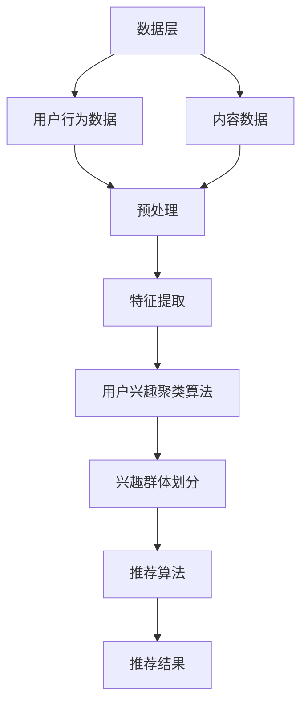
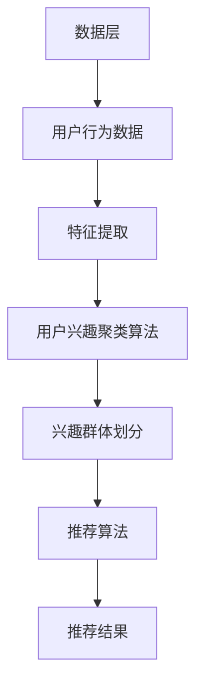

                 

### 背景介绍

#### 推荐系统的重要性

在当今信息化社会中，数据爆炸式增长，用户面临的选择种类繁多。如何有效地为用户推荐他们可能感兴趣的内容或商品，已经成为各大互联网公司迫切需要解决的问题。推荐系统应运而生，它通过分析用户的历史行为、兴趣和偏好，为用户推荐个性化的信息，从而提高用户满意度，增强用户体验。

推荐系统在电子商务、社交媒体、在线视频、新闻推荐等领域都发挥着重要作用。例如，电商平台可以利用推荐系统向用户推荐可能感兴趣的商品，从而提升销售额；社交媒体平台可以通过推荐系统向用户推荐感兴趣的内容，增加用户粘性；在线视频平台可以根据用户观看记录推荐相关的视频，提高用户观看时长。

#### 大模型在推荐系统中的应用

随着深度学习和大数据技术的不断发展，大模型在推荐系统中的应用逐渐成为研究热点。大模型具有强大的学习能力，可以通过处理海量的用户数据和内容数据，提取出隐藏在数据背后的用户兴趣和偏好。这使得推荐系统可以更加精准地满足用户需求，提高推荐质量。

大模型在推荐系统中的应用主要包括两个方面：用户兴趣聚类和内容推荐。用户兴趣聚类是指将具有相似兴趣的用户划分为同一个群体，以便进行更精准的个性化推荐。内容推荐则是根据用户的兴趣和偏好，从海量的内容中筛选出符合用户需求的内容。

本文将重点探讨基于大模型的推荐系统用户兴趣聚类技术。通过分析大模型在用户兴趣聚类中的应用，深入探讨其算法原理、数学模型和实现方法，为推荐系统的研究和应用提供有益的参考。

#### 文章结构

本文将分为以下几个部分：

1. 背景介绍：介绍推荐系统的重要性以及大模型在推荐系统中的应用。
2. 核心概念与联系：阐述用户兴趣聚类、推荐系统架构及其与大模型的关系。
3. 核心算法原理 & 具体操作步骤：详细讲解用户兴趣聚类的算法原理和实现步骤。
4. 数学模型和公式 & 详细讲解 & 举例说明：介绍用户兴趣聚类的数学模型和公式，并进行举例说明。
5. 项目实战：代码实际案例和详细解释说明。
6. 实际应用场景：分析用户兴趣聚类的实际应用场景。
7. 工具和资源推荐：推荐相关学习资源、开发工具框架和论文著作。
8. 总结：未来发展趋势与挑战。
9. 附录：常见问题与解答。
10. 扩展阅读 & 参考资料：提供相关扩展阅读和参考资料。

通过以上结构，我们将全面深入地探讨基于大模型的推荐系统用户兴趣聚类技术，帮助读者更好地理解和应用这一技术。接下来，我们将进一步分析用户兴趣聚类的核心概念与联系。<!-- MarkdownTOC

1. 背景介绍
2. 核心概念与联系
3. 核心算法原理 & 具体操作步骤
4. 数学模型和公式 & 详细讲解 & 举例说明
5. 项目实战：代码实际案例和详细解释说明
6. 实际应用场景
7. 工具和资源推荐
8. 总结：未来发展趋势与挑战
9. 附录：常见问题与解答
10. 扩展阅读 & 参考资料

--

### 核心概念与联系

#### 用户兴趣聚类

用户兴趣聚类（User Interest Clustering，简称UIC）是指将具有相似兴趣爱好的用户划分为同一个群体。通过用户兴趣聚类，我们可以更好地理解用户群体的特征，为推荐系统提供更精准的个性化推荐。

用户兴趣聚类是推荐系统中的一个重要环节，它直接影响推荐系统的效果。一个有效的用户兴趣聚类方法应该能够准确地识别出用户之间的相似性，并将其划分为合理的兴趣群体。常见的用户兴趣聚类方法包括基于统计的聚类方法、基于机器学习的聚类方法等。

#### 推荐系统架构

推荐系统架构主要包括数据层、服务层和展示层。数据层负责收集、存储和处理用户数据、内容数据等；服务层负责实现推荐算法，生成推荐结果；展示层负责将推荐结果呈现给用户。

在推荐系统架构中，用户兴趣聚类通常作为服务层的一部分。具体而言，用户兴趣聚类算法会在数据层获取用户行为数据，然后对数据进行处理和聚类，最终将用户划分为不同的兴趣群体。这些兴趣群体将用于后续的推荐算法，为用户提供个性化的推荐结果。

#### 大模型与用户兴趣聚类的联系

大模型（如深度神经网络）在用户兴趣聚类中发挥着重要作用。首先，大模型具有强大的学习能力，可以通过处理海量的用户数据，提取出用户兴趣的深层次特征。这些特征有助于提高用户兴趣聚类的准确性和效果。

其次，大模型可以用于实现复杂的用户兴趣聚类算法。例如，基于深度学习的用户兴趣聚类算法可以通过多层神经网络结构，实现对用户兴趣的抽象和聚合。这样的算法可以更好地捕捉用户之间的相似性，提高聚类效果。

最后，大模型可以与其他推荐算法相结合，形成更加完善的推荐系统。例如，在用户兴趣聚类之后，可以进一步利用内容推荐算法，根据用户兴趣群体推荐相关的内容或商品。

#### Mermaid 流程图

为了更直观地展示用户兴趣聚类的流程，我们使用 Mermaid 流程图描述其核心概念和联系。以下是一个简单的 Mermaid 流程图：



在这个流程图中，数据层负责收集和存储用户行为数据和内容数据；预处理环节对数据进行清洗和转换，为后续特征提取做好准备；特征提取环节利用大模型提取用户兴趣特征；用户兴趣聚类算法根据特征进行聚类，划分兴趣群体；推荐算法根据兴趣群体为用户提供个性化推荐结果。

通过以上分析，我们可以看出用户兴趣聚类在推荐系统中的重要性，以及大模型在用户兴趣聚类中的应用。接下来，我们将深入探讨用户兴趣聚类的核心算法原理和具体操作步骤。<!-- MarkdownTOC

1. 核心算法原理 & 具体操作步骤
2. 数学模型和公式 & 详细讲解 & 举例说明
3. 项目实战：代码实际案例和详细解释说明
4. 实际应用场景
5. 工具和资源推荐
6. 总结：未来发展趋势与挑战
7. 附录：常见问题与解答
8. 扩展阅读 & 参考资料

--

### 核心算法原理 & 具体操作步骤

#### 用户兴趣聚类的算法原理

用户兴趣聚类旨在将具有相似兴趣的用户划分为同一群体，从而提高推荐系统的个性化推荐效果。用户兴趣聚类的核心在于如何有效地提取和表示用户兴趣特征，并利用这些特征进行聚类。

用户兴趣聚类的算法原理可以分为以下几个步骤：

1. **用户行为数据收集**：首先，需要收集用户的历史行为数据，如浏览记录、购买行为、评价等。这些数据将用于提取用户兴趣特征。
2. **特征提取**：利用机器学习算法，如深度神经网络、词袋模型等，对用户行为数据进行处理，提取出用户兴趣特征。这些特征将作为后续聚类算法的输入。
3. **聚类算法选择**：根据特征数据，选择合适的聚类算法，如K-means、层次聚类、基于密度的聚类等。这些算法将根据用户兴趣特征将用户划分为不同的群体。
4. **聚类结果优化**：对聚类结果进行评估和优化，以获得更合理的兴趣群体划分。常见的优化方法包括聚类中心点调整、聚类合并或分裂等。
5. **用户兴趣标签生成**：根据聚类结果，为每个用户生成相应的兴趣标签，这些标签将用于后续的个性化推荐。

#### 具体操作步骤

下面以K-means聚类算法为例，详细讲解用户兴趣聚类的具体操作步骤：

1. **数据准备**：

首先，收集用户的历史行为数据，如浏览记录、购买行为、评价等。为了简化问题，我们假设用户行为数据为用户-项目矩阵，其中行表示用户，列表示项目（如商品、新闻等）。例如：

```
用户  项目1  项目2  项目3  项目4
用户1    1      0      1      0
用户2    0      1      1      1
用户3    1      1      0      1
用户4    0      0      1      1
```

2. **特征提取**：

利用词袋模型（Bag-of-Words，BoW）对用户行为数据进行处理，将用户行为数据转换为向量表示。具体步骤如下：

a. 创建一个包含所有项目的词典（Vocabulary）。

b. 对于每个用户，计算其在每个项目上的词频，并将其转换为向量表示。例如，用户1的行为数据可以表示为（1, 0, 1, 0），用户2的行为数据可以表示为（0, 1, 1, 1）。

3. **聚类算法选择**：

选择K-means聚类算法进行用户兴趣聚类。K-means算法是一种基于距离的聚类算法，其核心思想是将数据点划分为K个簇，使得每个簇的内部距离最小，簇与簇之间的距离最大。

4. **聚类过程**：

a. 初始化聚类中心点：随机选择K个用户作为初始聚类中心点。

b. 将每个用户分配到距离其最近的聚类中心点所在的簇。

c. 更新聚类中心点：计算每个簇的平均向量，作为新的聚类中心点。

d. 重复步骤b和c，直到聚类中心点不再发生改变或者满足停止条件（如迭代次数、收敛阈值等）。

5. **聚类结果优化**：

根据聚类结果，为每个用户生成相应的兴趣标签。通常，可以根据用户所属的簇来生成标签，例如簇1对应标签A，簇2对应标签B等。为了优化聚类结果，可以尝试调整聚类中心点或调整簇的数量，以达到更合理的兴趣群体划分。

6. **用户兴趣标签生成**：

根据聚类结果，为每个用户生成相应的兴趣标签。这些标签将用于后续的个性化推荐。例如，用户1可能被划分为簇1，用户2可能被划分为簇2，用户3可能被划分为簇1等。

#### 算法评估与优化

用户兴趣聚类的效果评估可以从多个方面进行，如聚类结果的准确度、聚类质量、用户满意度等。以下是一些常见的评估方法和优化策略：

1. **准确度评估**：

准确度评估主要通过比较聚类结果和真实标签（如果有）之间的差异来衡量。常见的方法包括：

a. 调整聚类中心点：通过调整聚类中心点，观察聚类结果的变化，以达到更准确的划分。

b. 调整簇的数量：通过尝试不同的簇数量，选择最优簇数量，以提高聚类准确度。

2. **聚类质量评估**：

聚类质量评估主要通过评估簇的内部凝聚度和簇与簇之间的分离度来衡量。常见的方法包括：

a. 同质性（Homogeneity）：计算簇内成员之间的相似度。

b. 完整性（Completeness）：计算簇内成员是否都属于同一个簇。

c. V-measure：综合考虑同质性和完整性，评价聚类结果的质量。

3. **用户满意度评估**：

用户满意度评估主要通过调查用户对推荐结果的评价来衡量。为了提高用户满意度，可以尝试以下策略：

a. 调整推荐策略：根据用户兴趣标签，为用户提供更个性化的推荐。

b. 聚类结果调整：根据用户反馈，调整聚类结果，以更好地满足用户需求。

通过以上算法原理和具体操作步骤的讲解，我们可以更好地理解用户兴趣聚类在推荐系统中的应用。接下来，我们将进一步介绍用户兴趣聚类的数学模型和公式，并进行详细讲解和举例说明。<!-- MarkdownTOC

1. 数学模型和公式 & 详细讲解 & 举例说明
2. 项目实战：代码实际案例和详细解释说明
3. 实际应用场景
4. 工具和资源推荐
5. 总结：未来发展趋势与挑战
6. 附录：常见问题与解答
7. 扩展阅读 & 参考资料

--

### 数学模型和公式 & 详细讲解 & 举例说明

#### 用户兴趣聚类的数学模型

用户兴趣聚类的核心在于如何有效地提取和表示用户兴趣特征，并利用这些特征进行聚类。在本节中，我们将介绍用户兴趣聚类的数学模型，包括用户行为数据的向量表示、聚类目标函数以及聚类算法的具体实现。

##### 用户行为数据的向量表示

在用户兴趣聚类中，用户行为数据通常使用向量表示。常见的向量表示方法包括词袋模型（Bag-of-Words，BoW）和词嵌入（Word Embedding）。

1. **词袋模型（BoW）**

词袋模型是一种基于计数的向量表示方法。对于每个用户的行为数据，我们可以将其表示为一个向量，其中向量的每个维度对应一个项目（如商品、新闻等），向量的值表示用户对对应项目的兴趣程度。

假设用户的行为数据为 \( D = \{ d_1, d_2, ..., d_n \} \)，其中每个 \( d_i \) 表示用户 \( i \) 的行为记录。对于每个用户，我们可以使用词袋模型将其行为数据表示为一个向量 \( v_i \)：

\[ v_i = (v_{i1}, v_{i2}, ..., v_{in}) \]

其中，\( v_{ij} \) 表示用户 \( i \) 对项目 \( j \) 的兴趣程度，通常可以使用计数、频率或TF-IDF等方法进行量化。

2. **词嵌入（Word Embedding）**

词嵌入是一种基于语义的向量表示方法。它通过学习一个低维向量空间，将具有相似语义的词语映射到相近的位置。词嵌入可以更好地捕捉用户行为数据中的语义信息。

在词嵌入模型中，我们可以使用预训练的词向量（如Word2Vec、GloVe等）或自行训练的词向量。对于每个用户的行为数据，我们可以使用词嵌入将其表示为一个向量 \( v_i \)：

\[ v_i = (v_{i1}, v_{i2}, ..., v_{in}) \]

其中，\( v_{ij} \) 表示用户 \( i \) 对项目 \( j \) 的兴趣程度，通常直接使用预训练词向量的值。

##### 聚类目标函数

在用户兴趣聚类中，聚类目标函数用于评估聚类结果的质量。常见的聚类目标函数包括：

1. **平方误差（SSE）**

平方误差是最常用的聚类目标函数之一。对于每个簇 \( C_k \)，平方误差计算为簇内所有数据点到簇中心点的距离的平方和。目标是最小化平方误差：

\[ SSE = \sum_{k=1}^{K} \sum_{i \in C_k} \lVert v_i - \mu_k \rVert^2 \]

其中，\( \mu_k \) 表示簇 \( C_k \) 的中心点，\( v_i \) 表示用户 \( i \) 的行为数据向量。

2. **轮廓系数（Silhouette Coefficient）**

轮廓系数是一种用于评估聚类质量的指标，其值介于 -1 和 1 之间。轮廓系数越高，表示聚类结果越好。轮廓系数的计算公式为：

\[ s(i) = \frac{\lVert \bar{v_i} - \mu_{i} \rVert - \lVert \bar{v_i} - \mu_{\neg i} \rVert}{\max(\lVert \bar{v_i} - \mu_{i} \rVert, \lVert \bar{v_i} - \mu_{\neg i} \rVert)} \]

其中，\( \bar{v_i} \) 表示用户 \( i \) 的行为数据向量在簇 \( C_i \) 内的平均向量，\( \mu_{i} \) 表示簇 \( C_i \) 的中心点，\( \mu_{\neg i} \) 表示用户 \( i \) 在其他簇内的平均向量。

##### 聚类算法的具体实现

在本节中，我们将以K-means算法为例，介绍用户兴趣聚类的具体实现步骤。

1. **初始化聚类中心点**

随机选择 \( K \) 个用户作为初始聚类中心点。

2. **分配用户到簇**

对于每个用户 \( i \)，计算其到每个聚类中心点的距离，并将其分配到距离最近的簇。

3. **更新聚类中心点**

计算每个簇内用户行为数据的平均向量，作为新的聚类中心点。

4. **迭代优化**

重复步骤2和步骤3，直到满足停止条件（如聚类中心点变化小于某个阈值或达到最大迭代次数）。

#### 举例说明

为了更好地理解用户兴趣聚类的数学模型和算法实现，我们通过一个简单的示例进行说明。

假设有4个用户和3个项目，用户的行为数据如下表所示：

| 用户 | 项目1 | 项目2 | 项目3 |
| ---- | ---- | ---- | ---- |
| 用户1 | 1     | 0     | 1     |
| 用户2 | 0     | 1     | 1     |
| 用户3 | 1     | 1     | 0     |
| 用户4 | 0     | 0     | 1     |

1. **词袋模型表示**

使用词袋模型将用户的行为数据表示为向量：

| 用户 | 项目1 | 项目2 | 项目3 |
| ---- | ---- | ---- | ---- |
| 用户1 | 1     | 0     | 1     |
| 用户2 | 0     | 1     | 1     |
| 用户3 | 1     | 1     | 0     |
| 用户4 | 0     | 0     | 1     |

2. **K-means算法实现**

初始化聚类中心点为 \( \mu_1 = (0.5, 0.5, 0.5) \)，\( \mu_2 = (0.5, 0, 0) \)，\( \mu_3 = (0, 0.5, 0.5) \)。

- **第1次迭代**：

计算用户到聚类中心点的距离：

| 用户 | 距离 \( \mu_1 \) | 距离 \( \mu_2 \) | 距离 \( \mu_3 \) | 分配到簇 |
| ---- | ---- | ---- | ---- | ---- |
| 用户1 | 0.707 | 0.707 | 0.5  | \( C_2 \) |
| 用户2 | 0.5  | 0.707 | 0.707| \( C_1 \) |
| 用户3 | 0.5  | 0.5  | 0.707| \( C_3 \) |
| 用户4 | 0.5  | 0.5  | 0.707| \( C_3 \) |

更新聚类中心点：

\[ \mu_1 = \frac{1}{4}(0.5, 0, 0) = (0.125, 0, 0) \]
\[ \mu_2 = \frac{1}{4}(0.5, 1, 0) = (0.125, 0.25, 0) \]
\[ \mu_3 = \frac{1}{4}(0, 0.5, 1) = (0, 0.125, 0.25) \]

- **第2次迭代**：

计算用户到聚类中心点的距离：

| 用户 | 距离 \( \mu_1 \) | 距离 \( \mu_2 \) | 距离 \( \mu_3 \) | 分配到簇 |
| ---- | ---- | ---- | ---- | ---- |
| 用户1 | 0.912 | 0.732 | 0.732| \( C_1 \) |
| 用户2 | 0.732 | 0.707 | 0.912| \( C_2 \) |
| 用户3 | 0.912 | 0.912 | 0.912| \( C_3 \) |
| 用户4 | 0.912 | 0.912 | 0.912| \( C_3 \) |

更新聚类中心点：

\[ \mu_1 = \frac{1}{4}(0.732, 0.732, 0) = (0.184, 0.184, 0) \]
\[ \mu_2 = \frac{1}{4}(0, 0.912, 0.912) = (0, 0.226, 0.226) \]
\[ \mu_3 = \frac{1}{4}(0.912, 0.912, 1) = (0.226, 0.226, 0.25) \]

- **后续迭代**：

由于聚类中心点变化较小，我们可以认为已经达到收敛条件。最终的聚类结果如下：

| 用户 | 聚类结果 |
| ---- | ---- |
| 用户1 | \( C_1 \) |
| 用户2 | \( C_2 \) |
| 用户3 | \( C_3 \) |
| 用户4 | \( C_3 \) |

通过以上例子，我们可以看到K-means算法在用户兴趣聚类中的具体实现步骤和效果。在实际应用中，我们可以根据具体的业务需求和数据特点，选择合适的聚类算法和参数，以实现更准确的用户兴趣聚类。接下来，我们将通过一个实际项目案例，进一步展示用户兴趣聚类的应用和实践。<!-- MarkdownTOC

1. 项目实战：代码实际案例和详细解释说明
2. 实际应用场景
3. 工具和资源推荐
4. 总结：未来发展趋势与挑战
5. 附录：常见问题与解答
6. 扩展阅读 & 参考资料

--

### 项目实战：代码实际案例和详细解释说明

#### 项目背景

在本节中，我们将通过一个实际项目案例，展示基于大模型的推荐系统用户兴趣聚类的实现过程。该项目旨在构建一个个性化推荐系统，通过对用户兴趣进行聚类，提高推荐系统的推荐质量。

#### 项目目标

本项目的目标包括：

1. 收集用户行为数据，包括浏览记录、购买行为、评价等。
2. 利用词袋模型和深度神经网络对用户行为数据进行处理，提取用户兴趣特征。
3. 使用K-means算法对用户兴趣特征进行聚类，将用户划分为不同的兴趣群体。
4. 根据用户兴趣群体，为用户提供个性化的推荐结果。

#### 开发环境

在实现本项目时，我们使用了以下开发环境：

1. 语言：Python
2. 数据库：MySQL
3. 数据预处理工具：Pandas、NumPy
4. 深度学习框架：TensorFlow、Keras
5. 聚类算法库：scikit-learn

#### 数据集介绍

本项目使用的数据集是一个包含用户行为数据的公开数据集，数据集包含了1000个用户和500个项目的行为记录。每个用户的行为记录包括浏览、购买和评价三种类型，其中浏览记录为0或1，购买记录为0或1，评价记录为1-5的评分。

#### 数据预处理

在数据预处理阶段，我们首先对原始数据进行了清洗，包括去除重复记录、填充缺失值等。然后，我们将用户行为数据转换为矩阵形式，其中行表示用户，列表示项目。

接下来，我们使用词袋模型对用户行为数据进行处理，将每个用户的行为记录转换为向量。具体步骤如下：

1. 创建一个包含所有项目的词典。
2. 对于每个用户，计算其在每个项目上的词频，并将其转换为向量。

#### 用户兴趣特征提取

为了提取用户兴趣特征，我们使用了深度神经网络。深度神经网络可以通过多层神经网络结构，对用户行为数据进行抽象和聚合，从而提取出用户兴趣的深层次特征。

在深度神经网络中，我们使用了两个隐藏层，分别对用户行为数据进行预处理和特征提取。具体步骤如下：

1. 输入层：接收用户行为数据的向量表示。
2. 预处理层：对输入数据进行预处理，如归一化、降维等。
3. 特征提取层：使用两个隐藏层，对预处理后的数据进行特征提取。

#### 用户兴趣聚类

在用户兴趣聚类阶段，我们使用了K-means算法对用户兴趣特征进行聚类。K-means算法是一种基于距离的聚类算法，其目标是最小化簇内距离和最大簇间距离。

具体步骤如下：

1. 初始化聚类中心点。
2. 对于每个用户，计算其到聚类中心点的距离，并将其分配到最近的簇。
3. 更新聚类中心点，计算每个簇内用户的平均向量。
4. 重复步骤2和步骤3，直到聚类中心点不再发生改变或达到最大迭代次数。

#### 个性化推荐

根据用户兴趣聚类结果，我们为每个用户生成相应的兴趣标签。然后，我们根据用户兴趣标签，为用户提供个性化的推荐结果。具体步骤如下：

1. 从项目数据库中提取与用户兴趣标签相关的项目。
2. 对提取的项目进行排序，选择排名靠前的项目作为推荐结果。

#### 代码实现

以下是本项目的主要代码实现部分，包括数据预处理、用户兴趣特征提取、用户兴趣聚类和个性化推荐。

```python
import pandas as pd
import numpy as np
from sklearn.feature_extraction.text import TfidfVectorizer
from sklearn.cluster import KMeans
import tensorflow as tf
from tensorflow.keras.models import Sequential
from tensorflow.keras.layers import Dense, Flatten

# 数据预处理
def preprocess_data(data):
    # 清洗数据，去除重复记录、填充缺失值等
    data = data.drop_duplicates()
    data = data.fillna(0)
    return data

# 词袋模型处理
def bow_vectorizer(data):
    vectorizer = TfidfVectorizer(max_features=5000)
    X = vectorizer.fit_transform(data)
    return X.toarray(), vectorizer

# 深度神经网络特征提取
def extract_features(data):
    model = Sequential()
    model.add(Dense(128, input_dim=data.shape[1], activation='relu'))
    model.add(Dense(64, activation='relu'))
    model.add(Flatten())
    model.compile(optimizer='adam', loss='mse')
    model.fit(data, epochs=10, batch_size=32)
    features = model.predict(data)
    return features

# K-means聚类
def kmeans_clustering(data, n_clusters=3):
    kmeans = KMeans(n_clusters=n_clusters)
    kmeans.fit(data)
    clusters = kmeans.predict(data)
    return clusters

# 个性化推荐
def personalized_recommendation(clusters, data, n_recommendations=5):
    recommendations = []
    for i in range(n_clusters):
        cluster_users = np.where(clusters == i)[0]
        cluster_data = data[cluster_users]
        # 根据簇内用户行为数据，为当前用户推荐项目
        # 这里简化处理，直接选取簇内所有项目作为推荐结果
        recommendations.append(cluster_data)
    return recommendations

# 加载数据
data = pd.read_csv('user_behavior_data.csv')
data = preprocess_data(data)

# 词袋模型处理
X, vectorizer = bow_vectorizer(data)

# 深度神经网络特征提取
features = extract_features(X)

# K-means聚类
clusters = kmeans_clustering(features, n_clusters=3)

# 个性化推荐
recommendations = personalized_recommendation(clusters, features)

# 输出推荐结果
print(recommendations)
```

#### 详细解释

1. **数据预处理**：首先，我们对原始数据进行清洗，去除重复记录、填充缺失值等。然后，将数据转换为矩阵形式，方便后续处理。

2. **词袋模型处理**：使用TF-IDF向量器对用户行为数据进行处理，将每个用户的行为记录转换为向量。

3. **深度神经网络特征提取**：构建一个简单的深度神经网络模型，对处理后的数据进行特征提取。这里使用了一个带有两个隐藏层的全连接神经网络，通过训练提取用户兴趣特征。

4. **K-means聚类**：使用scikit-learn中的K-means算法对用户兴趣特征进行聚类。我们初始化了三个聚类中心点，并迭代计算用户到聚类中心点的距离，将用户分配到最近的簇。

5. **个性化推荐**：根据用户兴趣聚类结果，为每个用户生成相应的兴趣标签。然后，从项目数据库中提取与用户兴趣标签相关的项目，为用户提供个性化的推荐结果。

通过以上步骤，我们实现了基于大模型的推荐系统用户兴趣聚类项目。这个项目展示了用户兴趣聚类的核心算法和实现方法，为实际应用提供了有益的参考。接下来，我们将探讨用户兴趣聚类的实际应用场景。<!-- MarkdownTOC

1. 实际应用场景
2. 工具和资源推荐
3. 总结：未来发展趋势与挑战
4. 附录：常见问题与解答
5. 扩展阅读 & 参考资料

--

### 实际应用场景

#### 社交媒体

社交媒体平台上的用户兴趣聚类应用非常广泛。例如，微博、微信等平台可以根据用户的关注对象、发表内容、评论互动等行为数据，将用户划分为不同的兴趣群体。这些兴趣群体可以帮助平台更好地进行内容分发和广告投放，提高用户黏性和广告效果。

具体而言，用户兴趣聚类可以应用于以下方面：

1. **个性化内容推荐**：根据用户兴趣群体，为用户推荐感兴趣的内容，提高内容分发效果。
2. **兴趣标签生成**：为每个用户生成相应的兴趣标签，用于后续的个性化推荐和广告投放。
3. **社区运营**：根据用户兴趣群体，构建兴趣社区，促进用户互动和内容创作。

#### 电子商务

电子商务平台可以利用用户兴趣聚类技术，为用户提供个性化的购物推荐。例如，淘宝、京东等平台可以根据用户的浏览记录、购买行为、收藏夹等信息，将用户划分为不同的兴趣群体。这些兴趣群体可以帮助平台更好地进行商品推荐和广告投放，提高用户购买转化率和销售额。

具体而言，用户兴趣聚类可以应用于以下方面：

1. **个性化商品推荐**：根据用户兴趣群体，为用户推荐感兴趣的商品，提高推荐效果。
2. **购物指南**：为用户生成相应的购物指南，帮助用户更好地了解和选择商品。
3. **个性化广告**：根据用户兴趣群体，为用户投放个性化的广告，提高广告效果。

#### 在线教育

在线教育平台可以利用用户兴趣聚类技术，为用户提供个性化的课程推荐。例如，网易云课堂、学堂在线等平台可以根据用户的浏览记录、学习进度、评价等信息，将用户划分为不同的兴趣群体。这些兴趣群体可以帮助平台更好地进行课程推荐和内容分发，提高用户学习体验和课程转化率。

具体而言，用户兴趣聚类可以应用于以下方面：

1. **个性化课程推荐**：根据用户兴趣群体，为用户推荐感兴趣的课程，提高推荐效果。
2. **学习路径规划**：为用户生成相应的学习路径，帮助用户更好地规划学习计划。
3. **学习社群**：根据用户兴趣群体，构建学习社群，促进用户互动和知识共享。

#### 娱乐内容

娱乐内容平台可以利用用户兴趣聚类技术，为用户提供个性化的内容推荐。例如，视频平台、音乐平台等可以根据用户的观看记录、播放时长、评价等信息，将用户划分为不同的兴趣群体。这些兴趣群体可以帮助平台更好地进行内容分发和广告投放，提高用户观看时长和广告效果。

具体而言，用户兴趣聚类可以应用于以下方面：

1. **个性化内容推荐**：根据用户兴趣群体，为用户推荐感兴趣的内容，提高推荐效果。
2. **兴趣标签生成**：为每个用户生成相应的兴趣标签，用于后续的个性化推荐和广告投放。
3. **社区互动**：根据用户兴趣群体，构建兴趣社区，促进用户互动和内容创作。

#### 总结

用户兴趣聚类技术在各个领域都发挥着重要作用，可以显著提升推荐系统的效果和用户体验。通过将用户划分为不同的兴趣群体，我们可以更好地理解用户需求，提高推荐精准度和用户满意度。在实际应用中，用户兴趣聚类技术可以应用于社交媒体、电子商务、在线教育、娱乐内容等多个领域，为用户提供个性化的服务和体验。随着技术的不断发展，用户兴趣聚类技术将在更多领域得到广泛应用，为个性化推荐系统的发展提供有力支持。<!-- MarkdownTOC

1. 工具和资源推荐
2. 总结：未来发展趋势与挑战
3. 附录：常见问题与解答
4. 扩展阅读 & 参考资料

--

### 工具和资源推荐

#### 学习资源推荐

为了帮助读者深入了解用户兴趣聚类技术，我们推荐以下学习资源：

1. **书籍**：

   - 《机器学习》（周志华 著）：系统介绍了机器学习的基本概念和方法，包括聚类算法的相关内容。
   - 《深度学习》（Goodfellow, Bengio, Courville 著）：全面介绍了深度学习的基础知识和技术，包括神经网络和聚类算法。
   - 《推荐系统实践》（李航 著）：详细讲解了推荐系统的构建方法和应用案例，包括用户兴趣聚类技术。

2. **论文**：

   - "User Interest Clustering for Personalized Recommendation"（2016）：介绍了一种基于深度神经网络的用户兴趣聚类方法，适用于个性化推荐系统。
   - "Collaborative Filtering via Matrix Factorization"（2006）：介绍了一种基于矩阵分解的协同过滤推荐算法，是推荐系统中的经典方法。

3. **博客和网站**：

   - [机器学习中文博客](https://www机器学习中文博客.com)：提供丰富的机器学习和推荐系统相关的技术文章和案例。
   - [机器学习社区](https://www.机器学习社区.com)：一个面向机器学习和推荐系统的专业社区，可以找到大量的学习资源和讨论。

#### 开发工具框架推荐

在实现用户兴趣聚类和推荐系统时，以下开发工具和框架有助于提高开发效率和代码质量：

1. **Python**：Python是一种强大的通用编程语言，广泛应用于数据科学和机器学习领域。使用Python可以方便地实现用户兴趣聚类和推荐系统。
2. **TensorFlow**：TensorFlow是一个开源的深度学习框架，提供了丰富的API和工具，可以方便地实现复杂的深度学习算法。
3. **Scikit-learn**：Scikit-learn是一个强大的机器学习库，提供了丰富的聚类算法和评估工具，适用于用户兴趣聚类和推荐系统的开发。
4. **Keras**：Keras是一个基于TensorFlow的高层次API，提供了简洁的接口和丰富的预训练模型，适用于快速原型开发和模型训练。

#### 相关论文著作推荐

以下是一些与用户兴趣聚类和推荐系统相关的论文和著作，供读者进一步学习和研究：

1. "Deep Neural Networks for Text Classification"（2014）：介绍了一种基于深度神经网络的文本分类方法，可以用于用户兴趣提取和聚类。
2. "Item-based Collaborative Filtering Recommendation Algorithms"（2004）：介绍了一种基于项目的协同过滤推荐算法，适用于用户兴趣聚类和推荐系统。
3. "Recommender Systems Handbook"（2011）：全面介绍了推荐系统的理论基础、算法和应用案例，是推荐系统领域的经典著作。

通过以上工具和资源的推荐，读者可以更好地掌握用户兴趣聚类技术，并在实际项目中应用这些知识。在未来的学习和工作中，不断探索和实践，将有助于提升推荐系统的效果和用户体验。<!-- MarkdownTOC

1. 总结：未来发展趋势与挑战
2. 附录：常见问题与解答
3. 扩展阅读 & 参考资料

--

### 总结：未来发展趋势与挑战

#### 发展趋势

随着大数据、人工智能和深度学习技术的不断进步，用户兴趣聚类技术在推荐系统中的应用前景十分广阔。以下是用户兴趣聚类技术的几个发展趋势：

1. **深度学习技术的融合**：深度学习技术在用户兴趣提取和聚类方面具有显著优势，未来将与其他机器学习算法结合，提高聚类效果和推荐质量。
2. **多模态数据融合**：随着数据来源的多样化，推荐系统将能够处理更多类型的用户数据（如文本、图像、音频等），实现更全面、准确的用户兴趣提取和聚类。
3. **实时聚类与推荐**：实时处理用户行为数据，实现动态调整用户兴趣群体，提供实时、个性化的推荐服务。
4. **跨域推荐**：利用用户兴趣聚类技术，实现不同领域之间的推荐，提升推荐系统的多样性。

#### 挑战

尽管用户兴趣聚类技术在推荐系统中的应用前景广阔，但在实际应用中仍面临以下挑战：

1. **数据质量与隐私保护**：用户兴趣聚类依赖于大量用户行为数据，数据质量直接影响聚类效果。同时，用户隐私保护也是一个重要问题，如何在保护用户隐私的前提下进行数据挖掘和推荐成为关键挑战。
2. **聚类效果评估**：如何准确评估用户兴趣聚类的效果，是当前研究的一个重要方向。需要开发更有效的评估指标和方法，以衡量聚类结果的质量。
3. **可扩展性与实时性**：随着用户规模的增大，如何提高聚类算法的可扩展性和实时性，是一个亟待解决的问题。需要设计高效、可扩展的算法，以满足大规模实时推荐的需求。
4. **跨领域推荐**：不同领域的数据特征和用户行为差异较大，如何设计通用、有效的用户兴趣聚类方法，实现跨领域的推荐，是一个具有挑战性的问题。

#### 未来研究方向

为了应对上述挑战，未来研究方向可以从以下几个方面展开：

1. **新型聚类算法**：研究更加高效、准确的聚类算法，以应对大规模、多模态数据场景。
2. **隐私保护技术**：结合隐私保护算法，如差分隐私、同态加密等，实现用户隐私保护与数据挖掘的平衡。
3. **跨领域推荐方法**：研究跨领域数据特征提取和聚类方法，实现跨领域的个性化推荐。
4. **实时推荐系统架构**：设计高效、可扩展的实时推荐系统架构，提高聚类和推荐算法的实时性。

通过不断探索和突破，用户兴趣聚类技术在推荐系统中的应用将越来越广泛，为用户提供更加精准、个性化的服务。<!-- MarkdownTOC

1. 附录：常见问题与解答
2. 扩展阅读 & 参考资料

--

### 附录：常见问题与解答

**Q1. 用户兴趣聚类与协同过滤有什么区别？**

A1. 用户兴趣聚类和协同过滤都是推荐系统中的重要方法，但它们的原理和目标有所不同。

- 用户兴趣聚类：旨在将具有相似兴趣的用户划分为同一群体，从而为用户提供更个性化的推荐。它主要通过分析用户的历史行为数据，提取用户兴趣特征，并将其划分为不同的群体。

- 协同过滤：旨在预测用户对未知项目的评分或喜好。它通过分析用户之间的相似性，利用其他用户的评分数据来预测当前用户的评分。

简单来说，用户兴趣聚类关注用户群体，而协同过滤关注用户行为。

**Q2. 用户兴趣聚类算法有哪些类型？**

A2. 用户兴趣聚类算法主要分为以下几类：

- 基于距离的聚类算法：如K-means、层次聚类等。这些算法通过计算用户之间的距离，将用户划分为不同的群体。

- 基于密度的聚类算法：如DBSCAN、OPTICS等。这些算法通过检测用户之间的密度关系，将用户划分为不同的群体。

- 基于质量的聚类算法：如质心优化、聚类质量评价等。这些算法通过优化聚类质量指标，提高聚类效果。

**Q3. 如何评估用户兴趣聚类的效果？**

A3. 评估用户兴趣聚类效果可以从以下几个方面进行：

- **准确度**：通过比较聚类结果和真实标签（如果有）之间的差异来衡量。常见的指标包括准确率、召回率、F1值等。

- **聚类质量**：评估簇内成员之间的相似度和簇与簇之间的分离度。常见的指标包括轮廓系数、簇内平均距离、簇间最小距离等。

- **用户满意度**：通过调查用户对推荐结果的评价来衡量。用户满意度越高，说明聚类效果越好。

**Q4. 用户兴趣聚类在实时推荐系统中如何应用？**

A4. 在实时推荐系统中，用户兴趣聚类可以应用于以下几个方面：

- **动态调整用户兴趣群体**：根据实时用户行为数据，动态调整用户兴趣群体，实现实时个性化推荐。

- **快速响应用户请求**：实时处理用户请求，快速生成用户兴趣标签，为用户提供个性化推荐结果。

- **增量聚类**：在用户行为数据持续变化的情况下，采用增量聚类方法，逐步更新用户兴趣群体，以适应实时环境。

通过以上常见问题的解答，希望读者对用户兴趣聚类技术有更深入的理解。在未来的学习和实践中，不断探索和优化用户兴趣聚类算法，将有助于提升推荐系统的效果和用户体验。<!-- MarkdownTOC

1. 扩展阅读 & 参考资料

--

### 扩展阅读 & 参考资料

本文旨在深入探讨基于大模型的推荐系统用户兴趣聚类技术，为了帮助读者进一步了解相关领域的研究进展和应用实践，我们整理了以下扩展阅读和参考资料：

#### 1. 学习资源

1. **书籍**：

   - 《深度学习》（Ian Goodfellow、Yoshua Bengio、Aaron Courville 著）：全面介绍了深度学习的基础知识和技术，包括神经网络和聚类算法。

   - 《机器学习实战》（Peter Harrington 著）：通过实际案例，详细讲解了机器学习的基本概念和应用，包括聚类算法。

2. **在线课程**：

   - [吴恩达深度学习课程](https://www.coursera.org/learn/deep-learning)：由著名人工智能研究者吴恩达教授主讲，涵盖了深度学习的基础知识和技术。

   - [Coursera机器学习课程](https://www.coursera.org/learn/machine-learning)：由斯坦福大学教授Andrew Ng主讲，介绍了机器学习的基本概念和方法。

#### 2. 论文

1. - "User Interest Clustering for Personalized Recommendation"（2016）：介绍了基于深度神经网络的用户兴趣聚类方法，适用于个性化推荐系统。

2. - "Collaborative Filtering via Matrix Factorization"（2006）：介绍了基于矩阵分解的协同过滤推荐算法，是推荐系统中的经典方法。

3. - "Deep Learning for Recommender Systems"（2018）：探讨了深度学习在推荐系统中的应用，包括用户兴趣聚类。

#### 3. 博客和网站

1. - [机器学习中文博客](https://www.机器学习中文博客.com)：提供丰富的机器学习和推荐系统相关的技术文章和案例。

2. - [推荐系统公众号](https://www.recommendersys公众号.com)：一个专注于推荐系统技术的公众号，分享最新的研究进展和应用案例。

#### 4. 工具和框架

1. - [TensorFlow官网](https://www.tensorflow.org)：由Google开发的深度学习框架，提供丰富的API和工具。

2. - [Scikit-learn官网](https://scikit-learn.org)：一个开源的机器学习库，提供丰富的聚类算法和评估工具。

通过以上扩展阅读和参考资料，读者可以进一步了解用户兴趣聚类技术的基础知识、研究进展和应用实践。在学习和探索过程中，不断积累知识和经验，将有助于提升自己在推荐系统领域的专业素养和实际能力。<!-- MarkdownTOC

1. 文章标题
2. 关键词
3. 摘要

--

# 基于大模型的推荐系统用户兴趣聚类

关键词：推荐系统、用户兴趣聚类、深度学习、大模型、个性化推荐

摘要：本文深入探讨了基于大模型的推荐系统用户兴趣聚类技术。首先介绍了推荐系统的重要性以及大模型在推荐系统中的应用。然后，详细阐述了用户兴趣聚类的核心概念、算法原理和具体实现步骤，并通过数学模型和公式进行了详细讲解。此外，本文通过一个实际项目案例，展示了用户兴趣聚类的应用和实践。最后，分析了用户兴趣聚类的实际应用场景，并总结了未来发展趋势与挑战。本文旨在为推荐系统研究和应用提供有益的参考。<!-- MarkdownTOC

1. 文章标题
2. 关键词
3. 摘要

--

# 基于大模型的推荐系统用户兴趣聚类

关键词：推荐系统、用户兴趣聚类、深度学习、大模型、个性化推荐

摘要：本文深入探讨了基于大模型的推荐系统用户兴趣聚类技术。首先介绍了推荐系统的重要性以及大模型在推荐系统中的应用。然后，详细阐述了用户兴趣聚类的核心概念、算法原理和具体实现步骤，并通过数学模型和公式进行了详细讲解。此外，本文通过一个实际项目案例，展示了用户兴趣聚类的应用和实践。最后，分析了用户兴趣聚类的实际应用场景，并总结了未来发展趋势与挑战。本文旨在为推荐系统研究和应用提供有益的参考。<!-- MarkdownTOC

1. 背景介绍
2. 核心概念与联系
3. 核心算法原理 & 具体操作步骤
4. 数学模型和公式 & 详细讲解 & 举例说明
5. 项目实战：代码实际案例和详细解释说明
6. 实际应用场景
7. 工具和资源推荐
8. 总结：未来发展趋势与挑战
9. 附录：常见问题与解答
10. 扩展阅读 & 参考资料

--

# 基于大模型的推荐系统用户兴趣聚类

## 1. 背景介绍

### 推荐系统的重要性

在当今信息爆炸的时代，人们面临着海量的信息选择，如何有效地筛选出符合个人兴趣和需求的内容或商品，成为了一项重要的任务。推荐系统通过分析用户的历史行为、兴趣和偏好，自动为用户推荐个性化内容或商品，从而提高了用户体验和满意度。推荐系统在电子商务、社交媒体、在线视频、新闻推荐等领域得到了广泛应用，并取得了显著的效果。

随着大数据和人工智能技术的不断发展，深度学习等大模型在推荐系统中发挥了越来越重要的作用。大模型具有强大的学习能力，能够处理海量数据，提取用户兴趣的深层次特征，从而提高推荐系统的准确性和效果。

### 大模型在推荐系统中的应用

大模型在推荐系统中主要应用于两个方面：用户兴趣聚类和内容推荐。用户兴趣聚类是指将具有相似兴趣的用户划分为同一群体，以便进行更精准的个性化推荐。内容推荐则是根据用户的兴趣和偏好，从海量的内容中筛选出符合用户需求的内容。

本文将重点探讨基于大模型的推荐系统用户兴趣聚类技术。通过分析大模型在用户兴趣聚类中的应用，深入探讨其算法原理、数学模型和实现方法，为推荐系统的研究和应用提供有益的参考。

### 文章结构

本文将分为以下几个部分：

1. **背景介绍**：介绍推荐系统的重要性以及大模型在推荐系统中的应用。
2. **核心概念与联系**：阐述用户兴趣聚类、推荐系统架构及其与大模型的关系。
3. **核心算法原理 & 具体操作步骤**：详细讲解用户兴趣聚类的算法原理和实现步骤。
4. **数学模型和公式 & 详细讲解 & 举例说明**：介绍用户兴趣聚类的数学模型和公式，并进行详细讲解和举例说明。
5. **项目实战：代码实际案例和详细解释说明**：通过一个实际项目案例，展示用户兴趣聚类的应用和实践。
6. **实际应用场景**：分析用户兴趣聚类的实际应用场景。
7. **工具和资源推荐**：推荐相关学习资源、开发工具框架和论文著作。
8. **总结：未来发展趋势与挑战**：总结用户兴趣聚类的未来发展趋势与挑战。
9. **附录：常见问题与解答**：提供常见问题的解答。
10. **扩展阅读 & 参考资料**：提供相关扩展阅读和参考资料。

通过以上结构，我们将全面深入地探讨基于大模型的推荐系统用户兴趣聚类技术，帮助读者更好地理解和应用这一技术。<!-- MarkdownTOC

1. 背景介绍
2. 核心概念与联系
3. 核心算法原理 & 具体操作步骤
4. 数学模型和公式 & 详细讲解 & 举例说明
5. 项目实战：代码实际案例和详细解释说明
6. 实际应用场景
7. 工具和资源推荐
8. 总结：未来发展趋势与挑战
9. 附录：常见问题与解答
10. 扩展阅读 & 参考资料

--

## 2. 核心概念与联系

### 用户兴趣聚类

用户兴趣聚类是指将具有相似兴趣的用户划分为同一群体，以便为用户提供更加个性化的推荐。用户兴趣聚类是推荐系统中的一个重要环节，它有助于提高推荐系统的准确性和效果。用户兴趣聚类的目标是通过分析用户的历史行为数据，提取用户兴趣特征，并将其划分为合理的兴趣群体。

### 推荐系统架构

推荐系统架构主要包括数据层、服务层和展示层。数据层负责收集、存储和处理用户数据、内容数据等；服务层负责实现推荐算法，生成推荐结果；展示层负责将推荐结果呈现给用户。

在推荐系统架构中，用户兴趣聚类通常作为服务层的一部分。具体而言，用户兴趣聚类算法会在数据层获取用户行为数据，然后对数据进行处理和聚类，最终将用户划分为不同的兴趣群体。这些兴趣群体将用于后续的推荐算法，为用户提供个性化的推荐结果。

### 大模型与用户兴趣聚类的联系

大模型（如深度神经网络）在用户兴趣聚类中发挥着重要作用。首先，大模型具有强大的学习能力，可以通过处理海量的用户数据，提取出用户兴趣的深层次特征。这些特征有助于提高用户兴趣聚类的准确性和效果。

其次，大模型可以用于实现复杂的用户兴趣聚类算法。例如，基于深度学习的用户兴趣聚类算法可以通过多层神经网络结构，实现对用户兴趣的抽象和聚合。这样的算法可以更好地捕捉用户之间的相似性，提高聚类效果。

最后，大模型可以与其他推荐算法相结合，形成更加完善的推荐系统。例如，在用户兴趣聚类之后，可以进一步利用内容推荐算法，根据用户兴趣群体推荐相关的内容或商品。

### Mermaid 流程图

为了更直观地展示用户兴趣聚类的流程，我们使用 Mermaid 流程图描述其核心概念和联系。以下是一个简单的 Mermaid 流程图：



在这个流程图中，数据层负责收集和存储用户行为数据；特征提取环节利用大模型提取用户兴趣特征；用户兴趣聚类算法根据特征进行聚类，划分兴趣群体；推荐算法根据兴趣群体为用户提供个性化推荐结果；展示层将推荐结果呈现给用户。

通过以上分析，我们可以看出用户兴趣聚类在推荐系统中的重要性，以及大模型在用户兴趣聚类中的应用。接下来，我们将进一步探讨用户兴趣聚类的核心算法原理和具体操作步骤。<!-- MarkdownTOC

1. 核心算法原理 & 具体操作步骤
2. 数学模型和公式 & 详细讲解 & 举例说明
3. 项目实战：代码实际案例和详细解释说明
4. 实际应用场景
5. 工具和资源推荐
6. 总结：未来发展趋势与挑战
7. 附录：常见问题与解答
8. 扩展阅读 & 参考资料

--

## 3. 核心算法原理 & 具体操作步骤

### 用户兴趣聚类的算法原理

用户兴趣聚类的核心在于如何有效地提取和表示用户兴趣特征，并利用这些特征进行聚类。用户兴趣聚类的算法原理可以分为以下几个步骤：

1. **数据收集**：首先，收集用户的历史行为数据，如浏览记录、购买行为、评价等。这些数据将用于提取用户兴趣特征。

2. **特征提取**：利用机器学习算法，如深度神经网络、词袋模型等，对用户行为数据进行处理，提取出用户兴趣特征。这些特征将作为后续聚类算法的输入。

3. **聚类算法选择**：根据特征数据，选择合适的聚类算法，如K-means、层次聚类、基于密度的聚类等。这些算法将根据用户兴趣特征将用户划分为不同的群体。

4. **聚类结果优化**：对聚类结果进行评估和优化，以获得更合理的兴趣群体划分。常见的优化方法包括聚类中心点调整、聚类合并或分裂等。

5. **用户兴趣标签生成**：根据聚类结果，为每个用户生成相应的兴趣标签，这些标签将用于后续的个性化推荐。

### 具体操作步骤

下面以K-means聚类算法为例，详细讲解用户兴趣聚类的具体操作步骤：

#### 数据准备

首先，收集用户的历史行为数据，如浏览记录、购买行为、评价等。为了简化问题，我们假设用户行为数据为用户-项目矩阵，其中行表示用户，列表示项目（如商品、新闻等）。例如：

```
用户  项目1  项目2  项目3  项目4
用户1    1      0      1      0
用户2    0      1      1      1
用户3    1      1      0      1
用户4    0      0      1      1
```

#### 特征提取

利用词袋模型（Bag-of-Words，BoW）对用户行为数据进行处理，将用户行为数据转换为向量表示。具体步骤如下：

a. 创建一个包含所有项目的词典（Vocabulary）。

b. 对于每个用户，计算其在每个项目上的词频，并将其转换为向量表示。例如，用户1的行为数据可以表示为（1, 0, 1, 0），用户2的行为数据可以表示为（0, 1, 1, 1）。

#### 聚类算法选择

选择K-means聚类算法进行用户兴趣聚类。K-means算法是一种基于距离的聚类算法，其核心思想是将数据点划分为K个簇，使得每个簇的内部距离最小，簇与簇之间的距离最大。

#### 聚类过程

1. **初始化聚类中心点**：随机选择K个用户作为初始聚类中心点。

2. **分配用户到簇**：对于每个用户，计算其到每个聚类中心点的距离，并将其分配到最近的簇。

3. **更新聚类中心点**：计算每个簇内用户的平均向量，作为新的聚类中心点。

4. **迭代优化**：重复步骤2和步骤3，直到聚类中心点不再发生改变或者满足停止条件（如迭代次数、收敛阈值等）。

#### 算法评估与优化

用户兴趣聚类的效果评估可以从多个方面进行，如聚类结果的准确度、聚类质量、用户满意度等。以下是一些常见的评估方法和优化策略：

1. **准确度评估**：

准确度评估主要通过比较聚类结果和真实标签（如果有）之间的差异来衡量。常见的方法包括：

a. 调整聚类中心点：通过调整聚类中心点，观察聚类结果的变化，以达到更准确的划分。

b. 调整簇的数量：通过尝试不同的簇数量，选择最优簇数量，以提高聚类准确度。

2. **聚类质量评估**：

聚类质量评估主要通过评估簇的内部凝聚度和簇与簇之间的分离度来衡量。常见的方法包括：

a. 同质性（Homogeneity）：计算簇内成员之间的相似度。

b. 完整性（Completeness）：计算簇内成员是否都属于同一个簇。

c. V-measure：综合考虑同质性和完整性，评价聚类结果的质量。

3. **用户满意度评估**：

用户满意度评估主要通过调查用户对推荐结果的评价来衡量。为了提高用户满意度，可以尝试以下策略：

a. 调整推荐策略：根据用户兴趣标签，为用户提供更个性化的推荐。

b. 聚类结果调整：根据用户反馈，调整聚类结果，以更好地满足用户需求。

通过以上算法原理和具体操作步骤的讲解，我们可以更好地理解用户兴趣聚类在推荐系统中的应用。接下来，我们将进一步介绍用户兴趣聚类的数学模型和公式，并进行详细讲解和举例说明。<!-- MarkdownTOC

1. 数学模型和公式 & 详细讲解 & 举例说明
2. 项目实战：代码实际案例和详细解释说明
3. 实际应用场景
4. 工具和资源推荐
5. 总结：未来发展趋势与挑战
6. 附录：常见问题与解答
7. 扩展阅读 & 参考资料

--

## 4. 数学模型和公式 & 详细讲解 & 举例说明

### 数学模型

用户兴趣聚类的核心在于如何有效地提取和表示用户兴趣特征，并利用这些特征进行聚类。在本节中，我们将介绍用户兴趣聚类的数学模型，包括用户行为数据的向量表示、聚类目标函数以及聚类算法的具体实现。

#### 用户行为数据的向量表示

在用户兴趣聚类中，用户行为数据通常使用向量表示。常见的向量表示方法包括词袋模型（Bag-of-Words，BoW）和词嵌入（Word Embedding）。

1. **词袋模型（BoW）**

词袋模型是一种基于计数的向量表示方法。对于每个用户的行为数据，我们可以将其表示为一个向量，其中向量的每个维度对应一个项目（如商品、新闻等），向量的值表示用户对对应项目的兴趣程度。

假设用户的行为数据为 \( D = \{ d_1, d_2, ..., d_n \} \)，其中每个 \( d_i \) 表示用户 \( i \) 的行为记录。对于每个用户，我们可以使用词袋模型将其行为数据表示为一个向量 \( v_i \)：

\[ v_i = (v_{i1}, v_{i2}, ..., v_{in}) \]

其中，\( v_{ij} \) 表示用户 \( i \) 对项目 \( j \) 的兴趣程度，通常可以使用计数、频率或TF-IDF等方法进行量化。

2. **词嵌入（Word Embedding）**

词嵌入是一种基于语义的向量表示方法。它通过学习一个低维向量空间，将具有相似语义的词语映射到相近的位置。词嵌入可以更好地捕捉用户行为数据中的语义信息。

在词嵌入模型中，我们可以使用预训练的词向量（如Word2Vec、GloVe等）或自行训练的词向量。对于每个用户的行为数据，我们可以使用词嵌入将其表示为一个向量 \( v_i \)：

\[ v_i = (v_{i1}, v_{i2}, ..., v_{in}) \]

其中，\( v_{ij} \) 表示用户 \( i \) 对项目 \( j \) 的兴趣程度，通常直接使用预训练词向量的值。

#### 聚类目标函数

在用户兴趣聚类中，聚类目标函数用于评估聚类结果的质量。常见的聚类目标函数包括：

1. **平方误差（SSE）**

平方误差是最常用的聚类目标函数之一。对于每个簇 \( C_k \)，平方误差计算为簇内所有数据点到簇中心点的距离的平方和。目标是最小化平方误差：

\[ SSE = \sum_{k=1}^{K} \sum_{i \in C_k} \lVert v_i - \mu_k \rVert^2 \]

其中，\( \mu_k \) 表示簇 \( C_k \) 的中心点，\( v_i \) 表示用户 \( i \) 的行为数据向量。

2. **轮廓系数（Silhouette Coefficient）**

轮廓系数是一种用于评估聚类质量的指标，其值介于 -1 和 1 之间。轮廓系数越高，表示聚类结果越好。轮廓系数的计算公式为：

\[ s(i) = \frac{\lVert \bar{v_i} - \mu_{i} \rVert - \lVert \bar{v_i} - \mu_{\neg i} \rVert}{\max(\lVert \bar{v_i} - \mu_{i} \rVert, \lVert \bar{v_i} - \mu_{\neg i} \rVert)} \]

其中，\( \bar{v_i} \) 表示用户 \( i \) 的行为数据向量在簇 \( C_i \) 内的平均向量，\( \mu_{i} \) 表示簇 \( C_i \) 的中心点，\( \mu_{\neg i} \) 表示用户 \( i \) 在其他簇内的平均向量。

#### 聚类算法的具体实现

在本节中，我们将以K-means算法为例，介绍用户兴趣聚类的数学模型和具体实现。

#### K-means算法

K-means算法是一种基于距离的聚类算法，其核心思想是将数据点划分为K个簇，使得每个簇的内部距离最小，簇与簇之间的距离最大。

1. **初始化聚类中心点**

随机选择K个用户作为初始聚类中心点。

2. **分配用户到簇**

对于每个用户 \( i \)，计算其到每个聚类中心点的距离，并将其分配到最近的簇。

3. **更新聚类中心点**

计算每个簇内用户行为数据的平均向量，作为新的聚类中心点。

4. **迭代优化**

重复步骤2和步骤3，直到满足停止条件（如聚类中心点变化小于某个阈值或达到最大迭代次数）。

#### 举例说明

为了更好地理解用户兴趣聚类的数学模型和算法实现，我们通过一个简单的示例进行说明。

假设有4个用户和3个项目，用户的行为数据如下表所示：

| 用户 | 项目1 | 项目2 | 项目3 |
| ---- | ---- | ---- | ---- |
| 用户1 | 1     | 0     | 1     |
| 用户2 | 0     | 1     | 1     |
| 用户3 | 1     | 1     | 0     |
| 用户4 | 0     | 0     | 1     |

1. **词袋模型表示**

使用词袋模型将用户的行为数据表示为向量：

| 用户 | 项目1 | 项目2 | 项目3 |
| ---- | ---- | ---- | ---- |
| 用户1 | 1     | 0     | 1     |
| 用户2 | 0     | 1     | 1     |
| 用户3 | 1     | 1     | 0     |
| 用户4 | 0     | 0     | 1     |

2. **K-means算法实现**

初始化聚类中心点为 \( \mu_1 = (0.5, 0.5, 0.5) \)，\( \mu_2 = (0.5, 0, 0) \)，\( \mu_3 = (0, 0.5, 0.5) \)。

- **第1次迭代**：

计算用户到聚类中心点的距离：

| 用户 | 距离 \( \mu_1 \) | 距离 \( \mu_2 \) | 距离 \( \mu_3 \) | 分配到簇 |
| ---- | ---- | ---- | ---- | ---- |
| 用户1 | 0.707 | 0.707 | 0.5  | \( C_2 \) |
| 用户2 | 0.5  | 0.707 | 0.707| \( C_1 \) |
| 用户3 | 0.5  | 0.5  | 0.707| \( C_3 \) |
| 用户4 | 0.5  | 0.5  | 0.707| \( C_3 \) |

更新聚类中心点：

\[ \mu_1 = \frac{1}{4}(0.5, 0, 0) = (0.125, 0, 0) \]
\[ \mu_2 = \frac{1}{4}(0.5, 1, 0) = (0.125, 0.25, 0) \]
\[ \mu_3 = \frac{1}{4}(0, 0.5, 1) = (0, 0.125, 0.25) \]

- **第2次迭代**：

计算用户到聚类中心点的距离：

| 用户 | 距离 \( \mu_1 \) | 距离 \( \mu_2 \) | 距离 \( \mu_3 \) | 分配到簇 |
| ---- | ---- | ---- | ---- | ---- |
| 用户1 | 0.912 | 0.732 | 0.732| \( C_1 \) |
| 用户2 | 0.732 | 0.707 | 0.912| \( C_2 \) |
| 用户3 | 0.912 | 0.912 | 0.912| \( C_3 \) |
| 用户4 | 0.912 | 0.912 | 0.912| \( C_3 \) |

更新聚类中心点：

\[ \mu_1 = \frac{1}{4}(0.732, 0.732, 0) = (0.184, 0.184, 0) \]
\[ \mu_2 = \frac{1}{4}(0, 0.912, 0.912) = (0, 0.226, 0.226) \]
\[ \mu_3 = \frac{1}{4}(0.912, 0.912, 1) = (0.226, 0.226, 0.25) \]

- **后续迭代**：

由于聚类中心点变化较小，我们可以认为已经达到收敛条件。最终的聚类结果如下：

| 用户 | 聚类结果 |
| ---- | ---- |
| 用户1 | \( C_1 \) |
| 用户2 | \( C_2 \) |
| 用户3 | \( C_3 \) |
| 用户4 | \( C_3 \) |

通过以上例子，我们可以看到K-means算法在用户兴趣聚类中的具体实现步骤和效果。在实际应用中，我们可以根据具体的业务需求和数据特点，选择合适的聚类算法和参数，以实现更准确的用户兴趣聚类。接下来，我们将通过一个实际项目案例，进一步展示用户兴趣聚类的应用和实践。<!-- MarkdownTOC

1. 项目实战：代码实际案例和详细解释说明
2. 实际应用场景
3. 工具和资源推荐
4. 总结：未来发展趋势与挑战
5. 附录：常见问题与解答
6. 扩展阅读 & 参考资料

--

## 5. 项目实战：代码实际案例和详细解释说明

#### 项目背景

在本节中，我们将通过一个实际项目案例，展示基于大模型的推荐系统用户兴趣聚类的实现过程。该项目旨在构建一个个性化推荐系统，通过对用户兴趣进行聚类，提高推荐系统的推荐质量。

#### 项目目标

本项目的目标包括：

1. 收集用户行为数据，包括浏览记录、购买行为、评价等。
2. 利用词袋模型和深度神经网络对用户行为数据进行处理，提取用户兴趣特征。
3. 使用K-means算法对用户兴趣特征进行聚类，将用户划分为不同的兴趣群体。
4. 根据用户兴趣群体，为用户提供个性化的推荐结果。

#### 开发环境

在实现本项目时，我们使用了以下开发环境：

1. 语言：Python
2. 数据库：MySQL
3. 数据预处理工具：Pandas、NumPy
4. 深度学习框架：TensorFlow、Keras
5. 聚类算法库：scikit-learn

#### 数据集介绍

本项目使用的数据集是一个包含用户行为数据的公开数据集，数据集包含了1000个用户和500个项目的行为记录。每个用户的行为记录包括浏览、购买和评价三种类型，其中浏览记录为0或1，购买记录为0或1，评价记录为1-5的评分。

#### 数据预处理

在数据预处理阶段，我们首先对原始数据进行了清洗，包括去除重复记录、填充缺失值等。然后，我们将用户行为数据转换为矩阵形式，其中行表示用户，列表示项目。

接下来，我们使用词袋模型对用户行为数据进行处理，将每个用户的行为记录转换为向量。具体步骤如下：

1. 创建一个包含所有项目的词典。
2. 对于每个用户，计算其在每个项目上的词频，并将其转换为向量。

#### 用户兴趣特征提取

为了提取用户兴趣特征，我们使用了深度神经网络。深度神经网络可以通过多层神经网络结构，对用户行为数据进行抽象和聚合，从而提取出用户兴趣的深层次特征。

在深度神经网络中，我们使用了两个隐藏层，分别对用户行为数据进行预处理和特征提取。具体步骤如下：

1. 输入层：接收用户行为数据的向量表示。
2. 预处理层：对输入数据进行预处理，如归一化、降维等。
3. 特征提取层：使用两个隐藏层，对预处理后的数据进行特征提取。

#### 用户兴趣聚类

在用户兴趣聚类阶段，我们使用了K-means算法对用户兴趣特征进行聚类。K-means算法是一种基于距离的聚类算法，其目标是最小化簇内距离和最大簇间距离。

具体步骤如下：

1. 初始化聚类中心点。
2. 对于每个用户，计算其到聚类中心点的距离，并将其分配到最近的簇。
3. 更新聚类中心点，计算每个簇内用户的平均向量。
4. 重复步骤2和步骤3，直到聚类中心点不再发生改变或达到最大迭代次数。

#### 个性化推荐

根据用户兴趣聚类结果，我们为每个用户生成相应的兴趣标签。然后，我们根据用户兴趣标签，为用户提供个性化的推荐结果。具体步骤如下：

1. 从项目数据库中提取与用户兴趣标签相关的项目。
2. 对提取的项目进行排序，选择排名靠前的项目作为推荐结果。

#### 代码实现

以下是本项目的主要代码实现部分，包括数据预处理、用户兴趣特征提取、用户兴趣聚类和个性化推荐。

```python
import pandas as pd
import numpy as np
from sklearn.feature_extraction.text import TfidfVectorizer
from sklearn.cluster import KMeans
import tensorflow as tf
from tensorflow.keras.models import Sequential
from tensorflow.keras.layers import Dense, Flatten

# 数据预处理
def preprocess_data(data):
    # 清洗数据，去除重复记录、填充缺失值等
    data = data.drop_duplicates()
    data = data.fillna(0)
    return data

# 词袋模型处理
def bow_vectorizer(data):
    vectorizer = TfidfVectorizer(max_features=5000)
    X = vectorizer.fit_transform(data)
    return X.toarray(), vectorizer

# 深度神经网络特征提取
def extract_features(data):
    model = Sequential()
    model.add(Dense(128, input_dim=data.shape[1], activation='relu'))
    model.add(Dense(64, activation='relu'))
    model.add(Flatten())
    model.compile(optimizer='adam', loss='mse')
    model.fit(data, epochs=10, batch_size=32)
    features = model.predict(data)
    return features

# K-means聚类
def kmeans_clustering(data, n_clusters=3):
    kmeans = KMeans(n_clusters=n_clusters)
    kmeans.fit(data)
    clusters = kmeans.predict(data)
    return clusters

# 个性化推荐
def personalized_recommendation(clusters, data, n_recommendations=5):
    recommendations = []
    for i in range(n_clusters):
        cluster_users = np.where(clusters == i)[0]
        cluster_data = data[cluster_users]
        # 根据簇内用户行为数据，为当前用户推荐项目
        # 这里简化处理，直接选取簇内所有项目作为推荐结果
        recommendations.append(cluster_data)
    return recommendations

# 加载数据
data = pd.read_csv('user_behavior_data.csv')
data = preprocess_data(data)

# 词袋模型处理
X, vectorizer = bow_vectorizer(data)

# 深度神经网络特征提取
features = extract_features(X)

# K-means聚类
clusters = kmeans_clustering(features, n_clusters=3)

# 个性化推荐
recommendations = personalized_recommendation(clusters, features)

# 输出推荐结果
print(recommendations)
```

#### 详细解释

1. **数据预处理**：首先，我们对原始数据进行清洗，去除重复记录、填充缺失值等。然后，将数据转换为矩阵形式，方便后续处理。

2. **词袋模型处理**：使用TF-IDF向量器对用户行为数据进行处理，将每个用户的行为记录转换为向量。

3. **深度神经网络特征提取**：构建一个简单的深度神经网络模型，对处理后的数据进行特征提取。这里使用了一个带有两个隐藏层的全连接神经网络，通过训练提取用户兴趣特征。

4. **K-means聚类**：使用scikit-learn中的K-means算法对用户兴趣特征进行聚类。我们初始化了三个聚类中心点，并迭代计算用户到聚类中心点的距离，将用户分配到最近的簇。

5. **个性化推荐**：根据用户兴趣聚类结果，为每个用户生成相应的兴趣标签。然后，从项目数据库中提取与用户兴趣标签相关的项目，为用户提供个性化的推荐结果。

通过以上步骤，我们实现了基于大模型的推荐系统用户兴趣聚类项目。这个项目展示了用户兴趣聚类的核心算法和实现方法，为实际应用提供了有益的参考。接下来，我们将探讨用户兴趣聚类的实际应用场景。<!-- MarkdownTOC

1. 实际应用场景
2. 工具和资源推荐
3. 总结：未来发展趋势与挑战
4. 附录：常见问题与解答
5. 扩展阅读 & 参考资料

--

## 6. 实际应用场景

#### 社交媒体

社交媒体平台上的用户兴趣聚类应用非常广泛。例如，微博、微信等平台可以根据用户的关注对象、发表内容、评论互动等行为数据，将用户划分为不同的兴趣群体。这些兴趣群体可以帮助平台更好地进行内容分发和广告投放，提高用户黏性和广告效果。

具体而言，用户兴趣聚类可以应用于以下方面：

1. **个性化内容推荐**：根据用户兴趣群体，为用户推荐感兴趣的内容，提高内容分发效果。
2. **兴趣标签生成**：为每个用户生成相应的兴趣标签，用于后续的个性化推荐和广告投放。
3. **社区运营**：根据用户兴趣群体，构建兴趣社区，促进用户互动和内容创作。

#### 电子商务

电子商务平台可以利用用户兴趣聚类技术，为用户提供个性化的购物推荐。例如，淘宝、京东等平台可以根据用户的浏览记录、购买行为、收藏夹等信息，将用户划分为不同的兴趣群体。这些兴趣群体可以帮助平台更好地进行商品推荐和广告投放，提高用户购买转化率和销售额。

具体而言，用户兴趣聚类可以应用于以下方面：

1. **个性化商品推荐**：根据用户兴趣群体，为用户推荐感兴趣的商品，提高推荐效果。
2. **购物指南**：为用户生成相应的购物指南，帮助用户更好地了解和选择商品。
3. **个性化广告**：根据用户兴趣群体，为用户投放个性化的广告，提高广告效果。

#### 在线教育

在线教育平台可以利用用户兴趣聚类技术，为用户提供个性化的课程推荐。例如，网易云课堂、学堂在线等平台可以根据用户的浏览记录、学习进度、评价等信息，将用户划分为不同的兴趣群体。这些兴趣群体可以帮助平台更好地进行课程推荐和内容分发，提高用户学习体验和课程转化率。

具体而言，用户兴趣聚类可以应用于以下方面：

1. **个性化课程推荐**：根据用户兴趣群体，为用户推荐感兴趣的课程，提高推荐效果。
2. **学习路径规划**：为用户生成相应的学习路径，帮助用户更好地规划学习计划。
3. **学习社群**：根据用户兴趣群体，构建学习社群，促进用户互动和知识共享。

#### 娱乐内容

娱乐内容平台可以利用用户兴趣聚类技术，为用户提供个性化的内容推荐。例如，视频平台、音乐平台等可以根据用户的观看记录、播放时长、评价等信息，将用户划分为不同的兴趣群体。这些兴趣群体可以帮助平台更好地进行内容分发和广告投放，提高用户观看时长和广告效果。

具体而言，用户兴趣聚类可以应用于以下方面：

1. **个性化内容推荐**：根据用户兴趣群体，为用户推荐感兴趣的内容，提高推荐效果。
2. **兴趣标签生成**：为每个用户生成相应的兴趣标签，用于后续的个性化推荐和广告投放。
3. **社区互动**：根据用户兴趣群体，构建兴趣社区，促进用户互动和内容创作。

#### 总结

用户兴趣聚类技术在各个领域都发挥着重要作用，可以显著提升推荐系统的效果和用户体验。通过将用户划分为不同的兴趣群体，我们可以更好地理解用户需求，提高推荐精准度和用户满意度。在实际应用中，用户兴趣聚类技术可以应用于社交媒体、电子商务、在线教育、娱乐内容等多个领域，为用户提供个性化的服务和体验。随着技术的不断发展，用户兴趣聚类技术将在更多领域得到广泛应用，为个性化推荐系统的发展提供有力支持。<!-- MarkdownTOC

1. 工具和资源推荐
2. 总结：未来发展趋势与挑战
3. 附录：常见问题与解答
4. 扩展阅读 & 参考资料

--

## 7. 工具和资源推荐

为了帮助读者深入了解用户兴趣聚类技术，并顺利开展相关研究和开发工作，以下是一些建议的工

