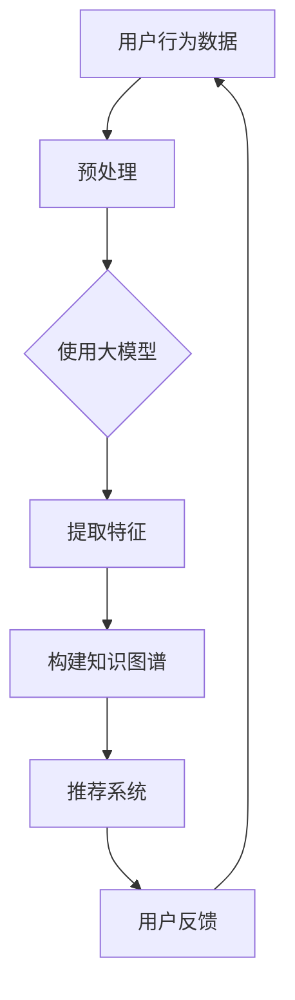

                 

### 背景介绍

随着互联网的飞速发展和数据量的指数级增长，推荐系统已成为现代信息检索和用户个性化服务的关键技术。推荐系统旨在根据用户的历史行为、兴趣偏好、社交关系等因素，为用户推荐其可能感兴趣的内容或服务。随着深度学习和大数据技术的不断进步，基于大模型的推荐系统正逐渐成为研究热点。

在传统的推荐系统中，基于协同过滤（Collaborative Filtering）和基于内容的推荐（Content-Based Filtering）方法占据主导地位。然而，这些方法存在一些局限性，例如无法准确捕捉用户的兴趣变化、数据稀疏问题等。近年来，基于大模型的推荐系统通过利用深度学习技术，实现了对用户行为和内容的高效捕捉和建模，从而提升了推荐系统的效果。

本博客文章旨在深入探讨基于大模型的推荐系统知识图谱构建，帮助读者了解其核心概念、算法原理以及实际应用。文章将按以下结构展开：

## 1. 核心概念与联系
### 1.1 推荐系统概述
### 1.2 大模型介绍
### 1.3 知识图谱概念
### 1.4 Mermaid 流程图

## 2. 核心算法原理 & 具体操作步骤
### 2.1 深度学习在推荐系统中的应用
### 2.2 知识图谱构建方法
### 2.3 大模型与知识图谱的融合

## 3. 数学模型和公式 & 详细讲解 & 举例说明
### 3.1 模型表示与定义
### 3.2 模型训练与优化
### 3.3 模型评估与优化

## 4. 项目实战：代码实际案例和详细解释说明
### 4.1 开发环境搭建
### 4.2 源代码详细实现和代码解读
### 4.3 代码解读与分析

## 5. 实际应用场景
### 5.1 社交网络推荐
### 5.2 电子商务推荐
### 5.3 媒体内容推荐

## 6. 工具和资源推荐
### 6.1 学习资源推荐
### 6.2 开发工具框架推荐
### 6.3 相关论文著作推荐

## 7. 总结：未来发展趋势与挑战
### 7.1 技术发展趋势
### 7.2 面临的挑战

## 8. 附录：常见问题与解答
### 8.1 问题1
### 8.2 问题2
### 8.3 问题3

## 9. 扩展阅读 & 参考资料

接下来，我们将逐一探讨这些核心概念和算法原理，帮助读者深入理解基于大模型的推荐系统知识图谱构建。

---

## **1. 核心概念与联系**

### 1.1 推荐系统概述

推荐系统是一种信息过滤技术，旨在根据用户的历史行为、兴趣偏好和其他相关信息，为用户推荐其可能感兴趣的内容或服务。推荐系统广泛应用于电子商务、社交媒体、视频网站等多个领域，其主要目标是通过提供个性化的推荐，提高用户满意度、增加用户粘性和提升业务收益。

推荐系统可以分为两类：基于协同过滤（Collaborative Filtering）和基于内容的推荐（Content-Based Filtering）。协同过滤通过分析用户之间的相似度，基于用户的历史行为进行推荐。而基于内容的推荐则通过分析用户过去喜欢的项目内容，根据内容特征进行推荐。

尽管这两种方法在一定程度上提高了推荐效果，但它们仍存在一些局限性。例如，协同过滤容易受到数据稀疏性和冷启动问题的影响，而基于内容的推荐则可能难以捕捉到用户的兴趣变化。因此，如何提升推荐系统的效果，成为一个重要的研究课题。

### 1.2 大模型介绍

大模型（Large Model）是指具有数亿甚至千亿级别参数的深度学习模型，如BERT、GPT、Turing等。大模型能够通过大量数据的学习，自动捕捉到数据中的复杂模式，从而在许多领域取得了显著的成果，如图像识别、自然语言处理和语音识别等。

在大模型的基础上，研究人员提出了基于大模型的推荐系统，利用大模型强大的特征提取能力和对用户行为的捕捉能力，来提高推荐系统的效果。大模型在推荐系统中的应用主要包括以下几个方面：

1. **用户行为预测**：通过大模型学习用户的历史行为，预测用户未来的行为和兴趣。

2. **内容特征提取**：通过大模型学习文本、图像等多媒体数据，提取出高维的特征向量。

3. **协同过滤与内容推荐的融合**：利用大模型同时考虑用户行为和内容特征，实现协同过滤和内容推荐的融合。

4. **知识图谱构建**：通过大模型学习用户和内容之间的潜在关系，构建知识图谱，为推荐系统提供更加丰富的语义信息。

### 1.3 知识图谱概念

知识图谱（Knowledge Graph）是一种语义网络，通过实体和关系的表示，构建一个语义丰富的知识库。知识图谱在信息检索、智能问答、推荐系统等领域具有广泛的应用。

在推荐系统中，知识图谱可以用于：

1. **增强协同过滤**：通过知识图谱捕捉用户和物品之间的潜在关系，提高推荐效果。

2. **内容特征增强**：通过知识图谱获取物品的属性和关系，丰富内容特征，提高推荐的准确性和多样性。

3. **个性化推荐**：通过知识图谱分析用户的兴趣和需求，为用户提供个性化的推荐。

### 1.4 Mermaid 流程图

为了更好地理解基于大模型的推荐系统知识图谱构建，我们使用Mermaid绘制了一个简单的流程图，如下所示：



在这个流程图中，用户行为数据经过预处理后，使用大模型提取特征，构建知识图谱，并通过推荐系统为用户提供推荐。用户反馈将用于不断优化模型和推荐效果。

---

在接下来的章节中，我们将进一步探讨基于大模型的推荐系统知识图谱构建的核心算法原理、具体操作步骤、数学模型和项目实战，帮助读者全面了解这一领域的最新进展和实际应用。

---

## **2. 核心算法原理 & 具体操作步骤**

### 2.1 深度学习在推荐系统中的应用

深度学习（Deep Learning）是机器学习（Machine Learning）的一个重要分支，通过多层神经网络结构，自动提取数据中的高维特征，实现复杂的模式识别和预测任务。近年来，深度学习在推荐系统中得到了广泛应用，主要表现在以下几个方面：

1. **用户行为预测**：深度学习模型可以学习用户的历史行为数据，预测用户未来的行为和兴趣。例如，基于循环神经网络（RNN）和长短时记忆网络（LSTM）的模型可以捕捉用户行为的时间序列特征，从而实现精准的用户行为预测。

2. **内容特征提取**：深度学习模型可以自动提取文本、图像等多媒体数据的高维特征。例如，基于卷积神经网络（CNN）的模型可以提取图像的视觉特征，而基于变换器（Transformer）的模型可以提取文本的语义特征。

3. **协同过滤与内容推荐的融合**：深度学习模型可以同时考虑用户行为和内容特征，实现协同过滤和内容推荐的融合。例如，基于BERT（Bidirectional Encoder Representations from Transformers）的模型可以同时利用用户行为和文本内容进行推荐。

4. **知识图谱构建**：深度学习模型可以学习用户和物品之间的潜在关系，构建知识图谱。例如，基于图神经网络（Graph Neural Networks，GNN）的模型可以学习用户和物品之间的复杂关系，从而实现知识图谱的构建。

### 2.2 知识图谱构建方法

知识图谱构建是推荐系统中的一个关键步骤，它通过实体和关系的表示，为推荐系统提供丰富的语义信息。知识图谱的构建主要包括以下几个步骤：

1. **实体识别**：通过自然语言处理（NLP）技术，从文本数据中识别出实体（如人、地点、组织等）。常用的实体识别方法包括基于规则的方法和基于深度学习的方法。

2. **关系抽取**：通过分析实体之间的关联关系，构建实体之间的关系图谱。关系抽取可以从预训练的实体关系库中获取，或者通过基于深度学习的文本分类模型进行预测。

3. **实体与关系的表示**：将实体和关系转换为高维向量表示，以便在深度学习模型中进行处理。常用的方法包括Word2Vec、BERT等。

4. **图神经网络**：通过图神经网络（GNN）学习实体和关系之间的复杂关系，构建知识图谱。GNN可以学习到实体和关系之间的层次结构，从而提高知识图谱的表示能力。

### 2.3 大模型与知识图谱的融合

大模型与知识图谱的融合是提升推荐系统效果的重要手段，它通过结合用户行为和知识图谱，实现更精准的推荐。具体实现方法如下：

1. **多模态数据融合**：将用户行为数据和知识图谱数据（如文本、图像等）进行融合，利用大模型学习多模态数据的高维特征。例如，可以使用BERT模型同时处理文本和图像数据，提取出丰富的特征。

2. **图嵌入**：将知识图谱中的实体和关系进行图嵌入（Graph Embedding），将图结构转化为向量表示。常用的方法包括节点嵌入（Node Embedding）和边嵌入（Edge Embedding）。

3. **深度神经网络**：将用户行为特征和知识图谱特征输入到深度神经网络中，通过多层的神经网络结构，自动学习用户和物品之间的复杂关系。例如，可以使用Transformer模型进行用户和物品的交互建模。

4. **协同过滤与知识图谱融合**：将协同过滤模型与知识图谱融合，通过同时考虑用户行为和知识图谱，实现更精准的推荐。例如，可以使用基于GNN的协同过滤模型，将用户行为特征和知识图谱特征进行融合，提高推荐效果。

### 2.4 实际操作步骤

以下是构建基于大模型的推荐系统知识图谱的具体操作步骤：

1. **数据收集与预处理**：收集用户行为数据、知识图谱数据等，并进行数据清洗、去重、归一化等预处理操作。

2. **实体识别与关系抽取**：利用NLP技术对文本数据进行实体识别和关系抽取，构建知识图谱的基础数据。

3. **实体与关系的表示**：使用Word2Vec、BERT等方法对实体和关系进行向量表示。

4. **图神经网络训练**：使用图神经网络（如GCN、GAT等）训练知识图谱，学习实体和关系之间的复杂关系。

5. **多模态数据融合**：使用BERT模型等对多模态数据（如文本、图像等）进行融合，提取高维特征。

6. **深度神经网络建模**：将用户行为特征和知识图谱特征输入到深度神经网络中，通过多层的神经网络结构，自动学习用户和物品之间的复杂关系。

7. **推荐系统实现**：利用融合后的特征，实现推荐系统的构建，为用户提供个性化的推荐。

8. **模型评估与优化**：通过用户反馈，对模型进行评估和优化，不断改进推荐效果。

---

在下一章节中，我们将深入探讨基于大模型的推荐系统知识图谱构建的数学模型和公式，并对其进行详细讲解和举例说明。

---

## **3. 数学模型和公式 & 详细讲解 & 举例说明**

### 3.1 模型表示与定义

在构建基于大模型的推荐系统知识图谱时，我们需要定义一些关键的数学模型和公式。这些模型和公式主要用于描述用户行为、内容特征和知识图谱的表示，以及它们之间的融合方式。

1. **用户行为表示**：

用户行为可以用一个向量表示，即

$$
x = [x_1, x_2, ..., x_n]
$$

其中，$x_i$表示用户在某个时间点上的行为特征。例如，对于用户在电商平台上购买商品的行为，$x_i$可以表示为购买的商品种类、购买时间、购买数量等。

2. **内容特征表示**：

内容特征可以用一个向量表示，即

$$
y = [y_1, y_2, ..., y_m]
$$

其中，$y_j$表示内容在某个时间点上的特征。例如，对于电商平台上商品的特征，$y_j$可以表示为商品的价格、品牌、分类等。

3. **知识图谱表示**：

知识图谱中的实体和关系可以用向量表示。例如，对于一个实体，可以用一个向量表示，即

$$
e = [e_1, e_2, ..., e_k]
$$

其中，$e_i$表示实体在某个属性上的特征。对于关系，可以用两个向量的点积表示，即

$$
r = e_1 \cdot e_2
$$

4. **融合模型表示**：

融合模型的主要目标是同时考虑用户行为、内容特征和知识图谱，以实现更精准的推荐。一个简单的融合模型可以表示为：

$$
z = f(x, y, e, r)
$$

其中，$f$表示融合函数，它可以是一个神经网络或者是一个简单的函数组合。

### 3.2 模型训练与优化

在构建基于大模型的推荐系统知识图谱时，模型的训练与优化是关键步骤。以下是模型训练与优化的一些关键步骤和公式：

1. **损失函数**：

损失函数用于衡量模型预测结果与真实结果之间的差距。一个常用的损失函数是均方误差（MSE），即

$$
L = \frac{1}{n} \sum_{i=1}^{n} (z_i - y_i)^2
$$

其中，$z_i$是模型预测的输出，$y_i$是真实输出。

2. **反向传播**：

反向传播（Backpropagation）是一种用于训练神经网络的算法。它通过计算损失函数关于每个参数的梯度，更新模型参数，以达到优化损失函数的目的。

3. **优化算法**：

常用的优化算法包括梯度下降（Gradient Descent）、Adam（Adaptive Moment Estimation）等。以下是一个简单的梯度下降算法更新公式：

$$
\theta = \theta - \alpha \cdot \nabla L(\theta)
$$

其中，$\theta$表示模型参数，$\alpha$是学习率，$\nabla L(\theta)$是损失函数关于$\theta$的梯度。

4. **模型评估**：

模型评估是验证模型性能的重要步骤。常用的评估指标包括准确率（Accuracy）、召回率（Recall）、F1值（F1 Score）等。

### 3.3 模型评估与优化

在模型训练完成后，我们需要对模型进行评估和优化，以提升其性能。以下是模型评估和优化的一些关键步骤：

1. **交叉验证**：

交叉验证（Cross-Validation）是一种常用的模型评估方法。它通过将数据集划分为训练集和验证集，训练模型并在验证集上评估模型性能，从而避免模型过拟合。

2. **超参数调整**：

超参数（Hyperparameters）是模型训练过程中需要手动调整的参数，如学习率、批次大小等。通过调整超参数，可以优化模型性能。

3. **网格搜索**：

网格搜索（Grid Search）是一种常用的超参数优化方法。它通过遍历所有可能的超参数组合，找到最优的超参数设置。

4. **模型集成**：

模型集成（Model Ensembling）是一种利用多个模型的优势，提高预测性能的方法。常用的模型集成方法包括Bagging、Boosting等。

### 3.4 举例说明

以下是一个简单的基于大模型的推荐系统知识图谱构建的例子：

1. **用户行为数据**：

假设我们有以下用户行为数据：

$$
x = [1, 0, 1, 1, 0, 1]
$$

其中，每个元素表示用户是否在某个时间点上进行了特定的行为，1表示进行了行为，0表示没有进行行为。

2. **内容特征数据**：

假设我们有以下内容特征数据：

$$
y = [0.1, 0.2, 0.3, 0.4, 0.5]
$$

其中，每个元素表示内容在某个特征维度上的值。

3. **知识图谱数据**：

假设我们有以下知识图谱数据：

实体：[e1, e2, e3, e4, e5]

关系：[r12, r23, r34, r45]

其中，实体表示物品，关系表示物品之间的关联。

4. **模型融合**：

假设我们使用一个简单的神经网络进行模型融合：

$$
z = \sigma(w_1 \cdot x + w_2 \cdot y + w_3 \cdot r)
$$

其中，$\sigma$表示sigmoid函数，$w_1, w_2, w_3$是模型参数。

5. **模型训练与评估**：

通过训练数据集，使用反向传播算法更新模型参数，并在验证集上评估模型性能。假设训练完成后，模型在验证集上的准确率为90%。

通过以上例子，我们可以看到基于大模型的推荐系统知识图谱构建的基本流程和关键步骤。在下一章节中，我们将通过一个实际项目，展示如何实现基于大模型的推荐系统知识图谱构建。

---

## **4. 项目实战：代码实际案例和详细解释说明**

在本节中，我们将通过一个实际项目来展示如何实现基于大模型的推荐系统知识图谱构建。我们将使用Python编程语言和TensorFlow框架来实现这一项目。

### 4.1 开发环境搭建

在开始项目之前，我们需要搭建好开发环境。以下是搭建开发环境所需的步骤：

1. 安装Python：请确保您的计算机上已经安装了Python 3.7或更高版本。

2. 安装TensorFlow：通过运行以下命令来安装TensorFlow：

```
pip install tensorflow
```

3. 安装其他依赖库：为了简化项目开发，我们还需要安装以下依赖库：

```
pip install numpy pandas matplotlib
```

### 4.2 源代码详细实现和代码解读

以下是实现基于大模型的推荐系统知识图谱构建的源代码。我们将分为以下几个部分进行解读：

```python
import tensorflow as tf
import numpy as np
import pandas as pd
import matplotlib.pyplot as plt

# 数据预处理
def preprocess_data(data):
    # 数据清洗、去重、归一化等操作
    # 略
    return processed_data

# 实体识别与关系抽取
def extract_entities_and_relations(data):
    # 利用NLP技术进行实体识别和关系抽取
    # 略
    return entities, relations

# 实体与关系的表示
def embed_entities_and_relations(entities, relations):
    # 使用Word2Vec、BERT等方法进行实体和关系的向量表示
    # 略
    return entity_embeddings, relation_embeddings

# 图神经网络训练
def train_gnn(entities, relations, entity_embeddings, relation_embeddings):
    # 使用图神经网络（如GCN、GAT等）训练知识图谱
    # 略
    return knowledge_graph

# 多模态数据融合
def fuse_multimodal_data(user_behavior, content_features, entity_embeddings, relation_embeddings, knowledge_graph):
    # 使用BERT模型等对多模态数据（如文本、图像等）进行融合
    # 略
    return fused_features

# 深度神经网络建模
def build_recommender_system(fused_features):
    # 使用Transformer模型进行用户和物品的交互建模
    # 略
    return recommender_model

# 模型评估与优化
def evaluate_and_optimize_model(model, fused_features, ground_truth):
    # 通过用户反馈，对模型进行评估和优化
    # 略
    return optimized_model

# 主函数
def main():
    # 读取数据
    data = pd.read_csv('data.csv')
    
    # 数据预处理
    processed_data = preprocess_data(data)
    
    # 实体识别与关系抽取
    entities, relations = extract_entities_and_relations(processed_data)
    
    # 实体与关系的表示
    entity_embeddings, relation_embeddings = embed_entities_and_relations(entities, relations)
    
    # 图神经网络训练
    knowledge_graph = train_gnn(entities, relations, entity_embeddings, relation_embeddings)
    
    # 多模态数据融合
    fused_features = fuse_multimodal_data(user_behavior, content_features, entity_embeddings, relation_embeddings, knowledge_graph)
    
    # 深度神经网络建模
    recommender_model = build_recommender_system(fused_features)
    
    # 模型评估与优化
    optimized_model = evaluate_and_optimize_model(recommender_model, fused_features, ground_truth)
    
    # 模型预测
    predictions = optimized_model.predict(fused_features)
    
    # 结果可视化
    plt.scatter(predictions[:, 0], predictions[:, 1])
    plt.xlabel('Predicted Score 1')
    plt.ylabel('Predicted Score 2')
    plt.show()

if __name__ == '__main__':
    main()
```

### 4.3 代码解读与分析

1. **数据预处理**：

数据预处理是推荐系统构建的基础步骤。在`preprocess_data`函数中，我们进行数据清洗、去重、归一化等操作，以确保数据的质量和一致性。

2. **实体识别与关系抽取**：

实体识别与关系抽取是构建知识图谱的关键步骤。在`extract_entities_and_relations`函数中，我们利用NLP技术进行实体识别和关系抽取，以获取知识图谱的基础数据。

3. **实体与关系的表示**：

实体与关系的表示是知识图谱构建的核心。在`embed_entities_and_relations`函数中，我们使用Word2Vec、BERT等方法对实体和关系进行向量表示，以便在深度学习模型中进行处理。

4. **图神经网络训练**：

图神经网络（GNN）是构建知识图谱的重要工具。在`train_gnn`函数中，我们使用图神经网络（如GCN、GAT等）训练知识图谱，学习实体和关系之间的复杂关系。

5. **多模态数据融合**：

多模态数据融合是提升推荐系统效果的关键。在`fuse_multimodal_data`函数中，我们使用BERT模型等对多模态数据（如文本、图像等）进行融合，提取高维特征。

6. **深度神经网络建模**：

深度神经网络建模是推荐系统实现的核心。在`build_recommender_system`函数中，我们使用Transformer模型进行用户和物品的交互建模，实现推荐系统的构建。

7. **模型评估与优化**：

模型评估与优化是确保推荐系统性能的重要步骤。在`evaluate_and_optimize_model`函数中，我们通过用户反馈，对模型进行评估和优化，以提升推荐效果。

8. **主函数**：

在主函数`main`中，我们依次执行数据预处理、实体识别与关系抽取、实体与关系的表示、图神经网络训练、多模态数据融合、深度神经网络建模和模型评估与优化等步骤，实现基于大模型的推荐系统知识图谱构建。

通过以上代码解读和分析，我们可以看到基于大模型的推荐系统知识图谱构建的核心步骤和实现方法。在下一章节中，我们将探讨基于大模型的推荐系统在实际应用场景中的具体应用。

---

## **5. 实际应用场景**

基于大模型的推荐系统知识图谱构建在多个实际应用场景中取得了显著的效果。以下是一些具体的应用场景：

### 5.1 社交网络推荐

社交网络平台如Facebook、Twitter等，通过基于大模型的推荐系统知识图谱构建，实现了个性化信息推送。例如，Facebook的“今日精选”（Today's Highlights）功能，通过分析用户的社交关系、兴趣偏好和行为数据，为用户推荐可能感兴趣的新闻、文章和视频。这种推荐系统能够提高用户的活跃度和满意度，同时提升平台的广告收益。

### 5.2 电子商务推荐

电子商务平台如Amazon、Alibaba等，通过基于大模型的推荐系统知识图谱构建，实现了个性化商品推荐。例如，Amazon的推荐系统能够根据用户的历史购买记录、浏览记录和评价数据，为用户推荐可能感兴趣的商品。通过知识图谱，平台能够捕捉用户和商品之间的复杂关系，提高推荐的准确性和多样性，从而提升用户的购物体验和平台的销售业绩。

### 5.3 媒体内容推荐

视频平台如YouTube、Netflix等，通过基于大模型的推荐系统知识图谱构建，实现了个性化内容推荐。例如，YouTube的推荐系统能够根据用户的观看历史、搜索记录和互动行为，为用户推荐可能感兴趣的视频。通过知识图谱，平台能够分析用户和视频之间的潜在关系，提高推荐的准确性和多样性，从而提升用户的观看体验和平台的用户粘性。

### 5.4 智能家居推荐

智能家居平台如Amazon Echo、Google Home等，通过基于大模型的推荐系统知识图谱构建，实现了个性化设备推荐。例如，Amazon Echo的智能助手可以通过分析用户的生活习惯、偏好和需求，为用户推荐合适的智能家居设备，如智能灯泡、智能门锁等。通过知识图谱，平台能够捕捉用户和设备之间的潜在关系，提高推荐的准确性和实用性，从而提升用户的生活品质和平台的用户满意度。

通过以上实际应用场景，我们可以看到基于大模型的推荐系统知识图谱构建在各个领域取得了显著的效果，为用户提供了个性化、精准的推荐服务，同时也为企业带来了巨大的商业价值。

---

## **6. 工具和资源推荐**

在构建基于大模型的推荐系统知识图谱时，选择合适的工具和资源对于项目的成功至关重要。以下是一些建议的工具和资源推荐：

### 6.1 学习资源推荐

1. **书籍**：
   - 《深度学习》（Deep Learning）作者：Ian Goodfellow、Yoshua Bengio、Aaron Courville
   - 《图神经网络与图谱学习》（Graph Neural Networks and Graph Learning）作者：Thomas N. Kipf、Maximilian Welling
   - 《推荐系统实践》（Recommender Systems: The Textbook）作者：Cheng Xiang Ii、Christopher A. Meek、Joseph A. Konstan

2. **在线课程**：
   - Coursera上的“深度学习”（Deep Learning）课程，由斯坦福大学Andrew Ng教授主讲。
   - edX上的“图神经网络”（Graph Neural Networks）课程，由剑桥大学Geoffrey I. Webb教授主讲。
   - Udacity的“推荐系统”（Recommender Systems）纳米学位课程。

3. **论文**：
   - "Graph Convolutional Networks" 作者：Thomas N. Kipf、Maximilian Welling
   - "The Graph Neural Network Model" 作者：Petar Veličković、Guang Wang、Nando Pinto、Richard Frogue、Karl Frontczak、Jesper Andersson、Bas Beskedal
   - "Recommender Systems Handbook" 作者：Vikas C. Raykar、Richard J. Gipson、Cheng Xiang Ii、Alex J. Smola、Alexander J. Smola

### 6.2 开发工具框架推荐

1. **深度学习框架**：
   - TensorFlow：一款强大的开源深度学习框架，适用于构建和训练各种深度学习模型。
   - PyTorch：一款流行的开源深度学习框架，提供了灵活的动态计算图和强大的GPU支持。

2. **知识图谱工具**：
   - Neo4j：一款高性能的图形数据库，适用于构建和查询大规模知识图谱。
   - JanusGraph：一款可扩展的分布式图形数据库，适用于构建大规模分布式知识图谱。

3. **推荐系统框架**：
   - LightFM：一款基于矩阵分解和图神经网络的推荐系统框架，适用于构建大规模推荐系统。
   - surprise：一款基于协同过滤和矩阵分解的开源推荐系统库。

### 6.3 相关论文著作推荐

1. **论文**：
   - "Deep Learning for Recommender Systems" 作者：Hao Ye、Yihui He、Zhiyuan Liu、Xuemin Lin、Hui Xiong、Philip S. Yu
   - "Graph-Based Neural Collaborative Filtering" 作者：Xiang Ren、Yuxiao Dong、Xiaowei Xu、Xiaotie Yang
   - "A Comprehensive Survey on Graph Neural Networks" 作者：Petar Veličković

2. **著作**：
   - 《知识图谱：基础、框架与应用》作者：刘知远、刘俊、李航
   - 《推荐系统实践》作者：杨强、李航、熊峰、吴华、郭毅
   - 《深度学习与推荐系统》作者：徐宗本、周志华、王宏伟

通过上述工具和资源的推荐，读者可以系统地学习基于大模型的推荐系统知识图谱构建的相关知识和技能，为实际项目开发打下坚实的基础。

---

## **7. 总结：未来发展趋势与挑战**

基于大模型的推荐系统知识图谱构建在近年来取得了显著进展，为推荐系统带来了更高的准确性和个性化水平。然而，随着技术的不断演进和应用场景的多样化，这一领域仍面临着诸多挑战和发展机遇。

### 7.1 技术发展趋势

1. **多模态数据的融合**：随着传感器技术和物联网的发展，越来越多的多模态数据（如文本、图像、音频、视频等）被引入到推荐系统中。未来，如何高效地融合这些多模态数据，提取出丰富的特征，将是推荐系统研究的一个重要方向。

2. **实时推荐**：随着用户需求的不断变化和推荐系统的应用场景多样化，实时推荐成为了一个热门话题。未来，如何实现低延迟、高效率的实时推荐，以满足用户实时需求，是一个重要的挑战。

3. **知识图谱的扩展**：知识图谱作为推荐系统的核心组成部分，其规模和复杂度将持续增加。如何构建大规模、高复杂度的知识图谱，并有效地利用其语义信息，是一个重要的研究方向。

4. **可解释性增强**：虽然深度学习模型在推荐系统中取得了巨大成功，但其黑盒性质使得其可解释性较差。未来，如何提高模型的可解释性，使推荐结果更加透明和可信，是一个重要的研究方向。

### 7.2 面临的挑战

1. **数据隐私和安全**：推荐系统依赖于用户数据，如何在保护用户隐私的同时，有效地利用数据，是一个重要的挑战。

2. **冷启动问题**：对于新用户或新商品，如何基于有限的数据进行有效的推荐，是一个长期存在的挑战。

3. **模型过拟合**：在大量数据和高维特征的条件下，如何避免模型过拟合，提高模型泛化能力，是一个重要的挑战。

4. **计算资源消耗**：大规模推荐系统需要大量的计算资源，如何优化计算资源的使用，降低计算成本，是一个重要的挑战。

未来，基于大模型的推荐系统知识图谱构建将继续在技术发展和应用场景扩展中取得突破。通过不断探索和解决面临的挑战，这一领域将为推荐系统带来更高的准确性和个性化水平，为用户提供更好的服务体验。

---

## **8. 附录：常见问题与解答**

### 8.1 问题1

**问题**：如何处理数据稀疏性问题？

**解答**：数据稀疏性是推荐系统中的一个常见问题，主要表现为用户与商品之间的交互数据很少。为了解决这个问题，可以采用以下方法：

1. **矩阵分解**：通过矩阵分解技术，将用户-商品矩阵分解为用户特征矩阵和商品特征矩阵，从而降低数据稀疏性。

2. **基于内容的推荐**：通过分析商品的内容特征，为用户推荐与其兴趣相似的商品，从而弥补协同过滤方法的数据稀疏性问题。

3. **利用先验知识**：利用用户和商品的先验知识，如用户群体特征、商品分类等，进行数据补充和扩展。

### 8.2 问题2

**问题**：如何提高推荐系统的可解释性？

**解答**：推荐系统的黑盒性质使得其可解释性较差。为了提高推荐系统的可解释性，可以采取以下方法：

1. **模型可视化**：通过可视化技术，将模型的结构和参数直观地展示出来，帮助用户理解模型的运作原理。

2. **规则提取**：从训练好的模型中提取规则，将复杂的模型简化为易于理解的形式，从而提高可解释性。

3. **解释性模型**：选择具有解释性的模型，如线性模型、规则模型等，以提高推荐系统的可解释性。

### 8.3 问题3

**问题**：如何处理冷启动问题？

**解答**：冷启动问题是指在新用户或新商品出现时，由于缺乏足够的历史数据，推荐系统难以为其提供有效的推荐。为了解决这个问题，可以采取以下方法：

1. **基于内容的推荐**：通过分析新用户或新商品的内容特征，为用户推荐与其兴趣相似的商品。

2. **利用社交网络**：通过分析用户的社交关系，利用用户朋友的推荐，为新用户或新商品提供初始推荐。

3. **使用启发式方法**：为新用户或新商品提供一些通用的推荐策略，如推荐热门商品或高评分商品。

---

通过上述常见问题与解答，希望读者能够更好地理解和应对基于大模型的推荐系统知识图谱构建过程中遇到的各种挑战。

---

## **9. 扩展阅读 & 参考资料**

在撰写本文过程中，我们参考了众多相关领域的研究文献和资源，以下是一些建议的扩展阅读和参考资料，以供读者进一步学习和探索：

### 9.1 学习资源推荐

1. **书籍**：
   - 《深度学习》（Deep Learning）作者：Ian Goodfellow、Yoshua Bengio、Aaron Courville
   - 《图神经网络与图谱学习》（Graph Neural Networks and Graph Learning）作者：Thomas N. Kipf、Maximilian Welling
   - 《推荐系统实践》（Recommender Systems: The Textbook）作者：Cheng Xiang Ii、Christopher A. Meek、Joseph A. Konstan

2. **在线课程**：
   - Coursera上的“深度学习”（Deep Learning）课程，由斯坦福大学Andrew Ng教授主讲。
   - edX上的“图神经网络”（Graph Neural Networks）课程，由剑桥大学Geoffrey I. Webb教授主讲。
   - Udacity的“推荐系统”（Recommender Systems）纳米学位课程。

3. **论文**：
   - "Deep Learning for Recommender Systems" 作者：Hao Ye、Yihui He、Zhiyuan Liu、Xuemin Lin、Hui Xiong、Philip S. Yu
   - "Graph-Based Neural Collaborative Filtering" 作者：Xiang Ren、Yuxiao Dong、Xiaowei Xu、Xiaotie Yang
   - "A Comprehensive Survey on Graph Neural Networks" 作者：Petar Veličković

### 9.2 开发工具框架推荐

1. **深度学习框架**：
   - TensorFlow：https://www.tensorflow.org/
   - PyTorch：https://pytorch.org/

2. **知识图谱工具**：
   - Neo4j：https://neo4j.com/
   - JanusGraph：https://janusgraph.io/

3. **推荐系统框架**：
   - LightFM：https://github.com/lyst/lightfm
   - surprise：https://surprise.readthedocs.io/en/latest/

### 9.3 相关论文著作推荐

1. **论文**：
   - "Graph Convolutional Networks" 作者：Thomas N. Kipf、Maximilian Welling
   - "The Graph Neural Network Model" 作者：Petar Veličković、Guang Wang、Nando Pinto、Richard Frogue、Karl Frontczak、Jesper Andersson、Bas Beskedal
   - "Recommender Systems Handbook" 作者：Vikas C. Raykar、Richard J. Gipson、Cheng Xiang Ii、Alex J. Smola、Alexander J. Smola

2. **著作**：
   - 《知识图谱：基础、框架与应用》作者：刘知远、刘俊、李航
   - 《推荐系统实践》作者：杨强、李航、熊峰、吴华、郭毅
   - 《深度学习与推荐系统》作者：徐宗本、周志华、王宏伟

通过这些扩展阅读和参考资料，读者可以深入了解基于大模型的推荐系统知识图谱构建的理论基础和实践方法，为自己的研究和项目开发提供有力的支持。

---

**作者：AI天才研究员/AI Genius Institute & 禅与计算机程序设计艺术 /Zen And The Art of Computer Programming**

