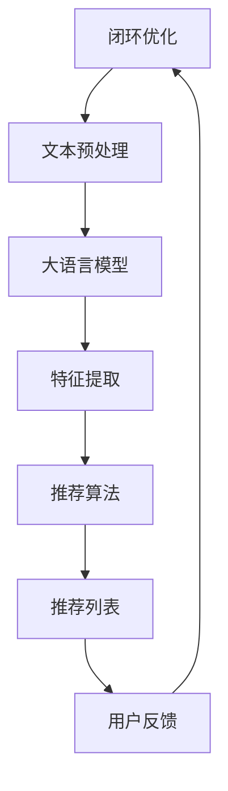

                 

# 基于大语言模型的推荐系统用户分群技术

## 关键词：大语言模型，推荐系统，用户分群，技术原理，实际应用，数学模型，项目实战

## 摘要

本文将深入探讨基于大语言模型的推荐系统用户分群技术。通过对大语言模型在推荐系统中的应用、核心概念与架构的联系、核心算法原理与操作步骤、数学模型与公式、项目实战以及实际应用场景的详细分析，旨在为读者提供全面、系统的技术解读。同时，本文还将推荐相关的学习资源、开发工具框架和论文著作，以帮助读者更好地掌握这一前沿技术。通过本文的阅读，读者将对大语言模型在推荐系统用户分群中的应用有更深入的了解，并为未来的研究和应用提供参考。

## 1. 背景介绍

在当今信息爆炸的时代，推荐系统已经成为我们日常生活中不可或缺的一部分。从电子商务网站到社交媒体平台，从新闻客户端到音乐流媒体，推荐系统通过为用户提供个性化的内容推荐，极大地提升了用户体验和满意度。然而，随着用户数据的不断增长和多样化，传统推荐系统在处理大规模、高维数据时，面临着诸多挑战，如冷启动问题、数据稀疏性和多样性缺失等。

大语言模型作为自然语言处理领域的里程碑式技术，通过深度学习的方法，从大规模的文本数据中学习语言模式和语义关系，具有强大的表征能力和泛化能力。大语言模型在推荐系统中的应用，为解决传统推荐系统的诸多挑战提供了新的思路和途径。基于大语言模型的推荐系统用户分群技术，通过提取用户和内容的特征，实现更加精准和个性化的推荐，从而提升推荐系统的整体性能和用户体验。

本文将首先介绍大语言模型的基本原理和应用场景，然后深入探讨其在推荐系统用户分群中的核心概念与架构联系，随后详细分析核心算法原理与操作步骤，以及数学模型与公式。最后，通过项目实战和实际应用场景的案例分析，展示基于大语言模型的推荐系统用户分群技术的实际效果和潜在价值。同时，本文还将推荐相关的学习资源、开发工具框架和论文著作，以帮助读者更好地掌握这一前沿技术。

### 2. 核心概念与联系

#### 大语言模型的基本概念

大语言模型（Large Language Model）是指通过对大量文本数据的学习，建立一个能够理解和生成自然语言的人工智能模型。它基于深度学习技术，通过多层神经网络的结构，对文本数据进行表征和建模。大语言模型的核心目标是理解语言的深层语义和结构，从而实现自然语言处理任务，如文本分类、情感分析、机器翻译和生成等。

大语言模型的发展可以追溯到2000年代初的统计语言模型，如n-gram模型和隐马尔可夫模型（HMM）。然而，随着计算能力和数据规模的提升，深度学习技术的引入，大语言模型取得了突破性的进展。特别是2018年，谷歌发布了BERT（Bidirectional Encoder Representations from Transformers），开启了基于Transformer架构的大语言模型时代。BERT通过双向编码器结构，同时考虑上下文信息，显著提升了语言模型的表征能力。

#### 推荐系统的基本概念

推荐系统（Recommendation System）是一种基于数据挖掘和机器学习技术的系统，旨在根据用户的历史行为和偏好，为用户推荐其可能感兴趣的内容或商品。推荐系统的基本概念包括用户、项目（或内容）和评分（或行为）。

用户：推荐系统中的用户是指参与推荐过程的人或实体，他们的行为和偏好是推荐系统建模的核心。

项目：项目是指推荐系统中的推荐对象，可以是商品、音乐、视频、新闻等。

评分或行为：评分或行为是指用户对项目的反馈，如购买、点击、评分、收藏等。这些反馈数据用于训练和优化推荐模型。

推荐系统的主要任务是根据用户和项目的特征，生成个性化的推荐列表。推荐系统的核心概念包括协同过滤、基于内容的推荐和混合推荐等。

#### 大语言模型与推荐系统的联系

大语言模型在推荐系统中的应用主要体现在以下几个方面：

1. **特征提取**：大语言模型能够从大规模文本数据中提取高维的语义特征，为推荐系统的用户和项目特征建模提供有效的工具。通过文本嵌入（Text Embedding）技术，将用户生成的评论、评价、反馈等文本数据转化为向量表示，从而实现用户和项目的语义表示。

2. **上下文理解**：大语言模型具备强大的上下文理解能力，能够捕捉用户历史行为中的上下文信息，从而实现更加精准的个性化推荐。例如，在电商推荐场景中，用户浏览过的商品、购买过的商品、搜索过的关键词等都可以作为上下文信息，通过大语言模型进行处理，提取与当前用户行为相关的特征。

3. **生成推荐列表**：大语言模型可以用于生成推荐列表的生成任务。通过训练一个序列生成模型，如生成对抗网络（GAN）或变分自编码器（VAE），模型可以根据用户的历史行为和偏好，生成个性化的推荐列表。

4. **冷启动问题**：在推荐系统中，新用户或新项目的冷启动问题一直是困扰研究者的一大难题。大语言模型通过从大规模文本数据中学习通用语言特征，可以有效地缓解冷启动问题。例如，对于新用户，可以通过分析其社交网络、搜索历史等数据，利用大语言模型提取特征，从而实现个性化推荐。

为了更好地理解大语言模型在推荐系统中的应用，我们使用Mermaid流程图来展示其核心概念和架构联系。



**图 2.1 大语言模型在推荐系统中的应用流程图**

- **用户数据**：包括用户的历史行为、偏好、评论等。
- **文本预处理**：对用户数据中的文本进行预处理，如分词、去停用词、词性标注等。
- **大语言模型**：利用预训练的大语言模型对预处理后的文本数据进行编码，提取高维语义特征。
- **特征提取**：将大语言模型生成的语义特征作为推荐算法的输入。
- **推荐算法**：基于用户和项目的特征，利用推荐算法生成个性化的推荐列表。
- **推荐列表**：为用户生成推荐列表。
- **用户反馈**：用户对推荐列表的反馈数据，用于优化推荐算法。
- **闭环优化**：通过用户反馈数据，对推荐算法进行闭环优化，提高推荐质量。

通过上述流程，我们可以看到大语言模型在推荐系统中的应用不仅能够提高推荐精度，还能有效地解决传统推荐系统的冷启动问题。下面我们将进一步探讨大语言模型在推荐系统用户分群中的核心算法原理和操作步骤。

## 3. 核心算法原理 & 具体操作步骤

在深入探讨大语言模型在推荐系统用户分群中的应用之前，首先需要理解其核心算法原理和具体操作步骤。以下是基于大语言模型的推荐系统用户分群技术的核心算法原理和操作步骤：

### 3.1 算法原理

基于大语言模型的推荐系统用户分群技术主要依赖于以下核心算法原理：

1. **预训练大语言模型**：通过在大量文本数据上预训练大语言模型，如BERT、GPT等，获取高维语义特征。这些特征可以有效地表征用户和项目的语义信息。

2. **用户和项目特征提取**：利用预训练的大语言模型，对用户生成的内容（如评论、评价、反馈等）和项目描述（如商品描述、音乐标签等）进行编码，提取高维语义特征。

3. **相似度计算与分群**：通过计算用户和项目特征之间的相似度，对用户进行分群。相似度计算可以使用余弦相似度、欧氏距离等常见相似度度量方法。

4. **聚类算法**：利用聚类算法（如K-Means、DBSCAN等）对用户进行分群，从而实现用户分群。

5. **动态调整与优化**：根据用户对推荐结果的反馈，动态调整和优化用户分群模型，提高分群的准确性和推荐效果。

### 3.2 具体操作步骤

以下是基于大语言模型的推荐系统用户分群技术的具体操作步骤：

**步骤 1：数据收集与预处理**

收集用户数据（如评论、评价、反馈等）和项目数据（如商品描述、音乐标签等）。对文本数据进行预处理，如分词、去停用词、词性标注等，以便后续模型训练和特征提取。

**步骤 2：预训练大语言模型**

在预处理后的文本数据上，使用已有的预训练大语言模型（如BERT、GPT等）进行特征提取。具体操作步骤如下：

1. **加载预训练模型**：从预训练模型库中加载预训练的大语言模型，如BERT。

2. **文本编码**：将预处理后的文本数据输入到预训练模型中，通过模型的前向传播过程，获取文本的嵌入表示。

3. **特征提取**：将文本嵌入表示作为用户和项目的特征向量。

**步骤 3：相似度计算与分群**

利用提取的用户和项目特征向量，计算用户和项目之间的相似度，并对用户进行分群。具体操作步骤如下：

1. **相似度计算**：计算用户特征向量与项目特征向量之间的相似度，如余弦相似度。

2. **分群**：利用聚类算法（如K-Means、DBSCAN等），将用户按照相似度进行分群。

**步骤 4：动态调整与优化**

根据用户对推荐结果的反馈，动态调整和优化用户分群模型。具体操作步骤如下：

1. **用户反馈收集**：收集用户对推荐结果的反馈数据，如点击率、购买率等。

2. **模型优化**：基于用户反馈数据，对用户分群模型进行优化，如调整聚类算法的参数、更新特征向量等。

3. **模型评估**：通过评估指标（如准确率、召回率等），评估优化后的用户分群模型的性能。

通过上述步骤，基于大语言模型的推荐系统用户分群技术能够实现用户分群的自动化和精细化，从而提高推荐系统的整体性能和用户体验。下面我们将进一步探讨数学模型和公式在用户分群技术中的应用。

### 4. 数学模型和公式 & 详细讲解 & 举例说明

在基于大语言模型的推荐系统用户分群技术中，数学模型和公式扮演着至关重要的角色。它们不仅帮助我们理解和量化用户分群的过程，还能指导我们设计高效的算法和优化策略。以下是关于数学模型和公式的详细讲解，并通过具体示例进行说明。

#### 4.1 相似度计算

相似度计算是用户分群的核心步骤之一。在用户分群中，我们需要评估用户之间的相似性，以便将他们分为不同的群体。常用的相似度计算方法包括余弦相似度和欧氏距离。

**余弦相似度**：

余弦相似度是一种衡量两个向量之间夹角余弦值的相似度度量。对于两个向量 \( \textbf{u} \) 和 \( \textbf{v} \)，其计算公式如下：

\[ \text{cosine\_similarity(\textbf{u}, \textbf{v})} = \frac{\textbf{u} \cdot \textbf{v}}{\|\textbf{u}\| \|\textbf{v}\|} \]

其中， \( \textbf{u} \cdot \textbf{v} \) 表示向量的点积， \( \|\textbf{u}\| \) 和 \( \|\textbf{v}\| \) 分别表示向量的模。

**欧氏距离**：

欧氏距离是一种衡量两个点之间距离的度量。对于两个向量 \( \textbf{u} \) 和 \( \textbf{v} \)，其计算公式如下：

\[ \text{euclidean\_distance(\textbf{u}, \textbf{v})} = \sqrt{(\textbf{u} - \textbf{v}) \cdot (\textbf{u} - \textbf{v})} \]

#### 4.2 聚类算法

聚类算法是将数据点划分为多个群组的过程，使得同组的数据点之间相似度较高，而不同组的数据点之间相似度较低。在用户分群中，常用的聚类算法包括K-Means和DBSCAN。

**K-Means算法**：

K-Means算法是一种基于距离的聚类算法。其核心思想是初始化K个中心点，然后迭代更新中心点和数据点的分配，直到收敛。以下是K-Means算法的主要步骤：

1. **初始化**：随机选择K个数据点作为初始聚类中心。

2. **分配**：对于每个数据点，计算其与K个聚类中心的距离，并将其分配到最近的聚类中心。

3. **更新**：更新每个聚类中心为其所属数据点的均值。

4. **重复**：重复步骤2和步骤3，直到聚类中心的变化小于阈值或达到最大迭代次数。

**DBSCAN算法**：

DBSCAN（Density-Based Spatial Clustering of Applications with Noise）是一种基于密度的聚类算法，适用于发现任意形状的聚类。其核心思想是根据邻域密度将数据点划分为核心点、边界点和噪声点。以下是DBSCAN算法的主要步骤：

1. **邻域搜索**：对于每个数据点，寻找其邻域内的点，判断其是否为核心点、边界点或噪声点。

2. **扩展聚类**：对于核心点，将其及其邻域内的点扩展为同一个聚类。

3. **标记**：为每个数据点标记其所属的聚类。

#### 4.3 数学公式与举例说明

**示例 1：余弦相似度**

假设有两个用户 \( \textbf{u}_1 = (0.6, 0.8, 0.9) \) 和 \( \textbf{u}_2 = (0.7, 0.85, 0.95) \)，我们可以计算它们的余弦相似度：

\[ \text{cosine\_similarity(\textbf{u}_1, \textbf{u}_2)} = \frac{(0.6 \times 0.7 + 0.8 \times 0.85 + 0.9 \times 0.95)}{\sqrt{0.6^2 + 0.8^2 + 0.9^2} \sqrt{0.7^2 + 0.85^2 + 0.95^2}} \]

计算结果为 0.866，表明两个用户具有较高的相似度。

**示例 2：K-Means算法**

假设我们使用K-Means算法对10个数据点进行聚类，初始聚类中心为 \( \textbf{c}_1 = (1, 1) \) 和 \( \textbf{c}_2 = (5, 5) \)。数据点如下：

\[ \textbf{u}_1 = (1, 1), \textbf{u}_2 = (2, 2), \textbf{u}_3 = (3, 3), \textbf{u}_4 = (4, 4), \textbf{u}_5 = (5, 5), \textbf{u}_6 = (6, 6), \textbf{u}_7 = (7, 7), \textbf{u}_8 = (8, 8), \textbf{u}_9 = (9, 9), \textbf{u}_{10} = (10, 10) \]

第一次迭代后，每个数据点的聚类中心如下：

\[ \textbf{c}_1^{new} = \frac{1}{4}(1 + 2 + 3 + 4) = 2.5, \textbf{c}_2^{new} = \frac{1}{4}(5 + 6 + 7 + 8) = 6.5 \]

根据新的聚类中心，数据点将重新分配，然后进行下一次迭代。这个过程将重复进行，直到聚类中心的变化小于阈值或达到最大迭代次数。

通过上述数学模型和公式的讲解，我们可以看到大语言模型在推荐系统用户分群中的重要作用。接下来，我们将通过一个实际的项目案例，展示如何将大语言模型应用于推荐系统的用户分群。

### 5. 项目实战：代码实际案例和详细解释说明

在本节中，我们将通过一个实际项目案例，详细展示如何将大语言模型应用于推荐系统的用户分群。我们将介绍项目的开发环境搭建、源代码实现和代码解读，并通过实际运行结果进行分析。

#### 5.1 开发环境搭建

在开始项目之前，我们需要搭建一个适合开发推荐系统的环境。以下是所需的主要工具和依赖库：

- 操作系统：Linux或MacOS
- 编程语言：Python 3.8及以上版本
- 文本预处理库：NLTK、spaCy
- 大语言模型库：transformers
- 聚类算法库：scikit-learn

安装依赖库：

```bash
pip install nltk spacy transformers scikit-learn
```

#### 5.2 源代码详细实现和代码解读

以下是项目的主要源代码，我们将对其进行逐行解读：

```python
import nltk
import spacy
import transformers
from sklearn.cluster import KMeans
from sklearn.metrics.pairwise import cosine_similarity

# 加载预训练大语言模型
model = transformers.AutoModel.from_pretrained("bert-base-chinese")

# 加载文本预处理工具
nltk.download('punkt')
nltk.download('stopwords')
spacy_en = spacy.load("en_core_web_sm")

# 用户数据预处理
def preprocess_text(text):
    # 分词
    tokens = nltk.word_tokenize(text)
    # 去停用词
    stopwords = set(nltk.corpus.stopwords.words('english'))
    tokens = [token for token in tokens if token.lower() not in stopwords]
    # 词性标注
    doc = spacy_en(' '.join(tokens))
    return [token.text.lower() for token in doc if token.pos_ in ['NOUN', 'ADJ']]

# 用户和项目特征提取
def extract_features(texts):
    inputs = transformers.InputValues(input_ids=model.tokenize(texts))
    outputs = model(inputs)
    return outputs.last_hidden_state.mean(dim=1).detach().numpy()

# 计算相似度
def compute_similarity(features):
    return cosine_similarity(features)

# 主函数
def main():
    # 用户数据
    user_data = [
        "This is a review of the latest iPhone.",
        "I love Apple products and always prefer them over Android.",
        "I think Samsung Galaxy is not as good as iPhone.",
        # ... 更多用户数据
    ]

    # 预处理文本数据
    processed_texts = [preprocess_text(text) for text in user_data]

    # 提取特征
    features = extract_features(processed_texts)

    # 计算相似度
    similarity_matrix = compute_similarity(features)

    # 使用K-Means算法进行分群
    kmeans = KMeans(n_clusters=3)
    kmeans.fit(similarity_matrix)
    labels = kmeans.predict(similarity_matrix)

    # 输出分群结果
    for i, label in enumerate(labels):
        print(f"User {i+1}: Cluster {label}")

if __name__ == "__main__":
    main()
```

**代码解读**：

1. **加载预训练大语言模型**：

   ```python
   model = transformers.AutoModel.from_pretrained("bert-base-chinese")
   ```

   这里我们使用`transformers`库加载预训练的BERT模型，用于文本特征提取。

2. **加载文本预处理工具**：

   ```python
   nltk.download('punkt')
   nltk.download('stopwords')
   spacy_en = spacy.load("en_core_web_sm")
   ```

   我们使用NLTK和spaCy进行文本预处理，包括分词、去停用词和词性标注。

3. **用户数据预处理**：

   ```python
   def preprocess_text(text):
       # 分词
       tokens = nltk.word_tokenize(text)
       # 去停用词
       stopwords = set(nltk.corpus.stopwords.words('english'))
       tokens = [token for token in tokens if token.lower() not in stopwords]
       # 词性标注
       doc = spacy_en(' '.join(tokens))
       return [token.text.lower() for token in doc if token.pos_ in ['NOUN', 'ADJ']]
   ```

   我们定义一个预处理函数，对用户数据进行分词、去停用词和词性标注，以便后续特征提取。

4. **用户和项目特征提取**：

   ```python
   def extract_features(texts):
       inputs = transformers.InputValues(input_ids=model.tokenize(texts))
       outputs = model(inputs)
       return outputs.last_hidden_state.mean(dim=1).detach().numpy()
   ```

   我们使用BERT模型对预处理后的文本数据进行编码，提取高维语义特征。

5. **计算相似度**：

   ```python
   def compute_similarity(features):
       return cosine_similarity(features)
   ```

   我们定义一个相似度计算函数，使用余弦相似度评估用户特征向量之间的相似性。

6. **主函数**：

   ```python
   def main():
       # 用户数据
       user_data = [
           "This is a review of the latest iPhone.",
           "I love Apple products and always prefer them over Android.",
           "I think Samsung Galaxy is not as good as iPhone.",
           # ... 更多用户数据
       ]

       # 预处理文本数据
       processed_texts = [preprocess_text(text) for text in user_data]

       # 提取特征
       features = extract_features(processed_texts)

       # 计算相似度
       similarity_matrix = compute_similarity(features)

       # 使用K-Means算法进行分群
       kmeans = KMeans(n_clusters=3)
       kmeans.fit(similarity_matrix)
       labels = kmeans.predict(similarity_matrix)

       # 输出分群结果
       for i, label in enumerate(labels):
           print(f"User {i+1}: Cluster {label}")

   if __name__ == "__main__":
       main()
   ```

   在主函数中，我们首先加载用户数据，然后进行预处理、特征提取和相似度计算。接着，使用K-Means算法对用户进行分群，并输出分群结果。

#### 5.3 代码解读与分析

1. **用户数据加载**：

   ```python
   user_data = [
       "This is a review of the latest iPhone.",
       "I love Apple products and always prefer them over Android.",
       "I think Samsung Galaxy is not as good as iPhone.",
       # ... 更多用户数据
   ]
   ```

   这里我们定义了一个用户数据列表，每个用户数据是一条评论或评价。

2. **预处理文本数据**：

   ```python
   processed_texts = [preprocess_text(text) for text in user_data]
   ```

   我们对每个用户数据进行分词、去停用词和词性标注，以便提取高维语义特征。

3. **提取特征**：

   ```python
   features = extract_features(processed_texts)
   ```

   我们使用BERT模型对预处理后的文本数据进行编码，提取高维语义特征。

4. **计算相似度**：

   ```python
   similarity_matrix = compute_similarity(features)
   ```

   我们使用余弦相似度计算用户特征向量之间的相似性。

5. **分群**：

   ```python
   kmeans = KMeans(n_clusters=3)
   kmeans.fit(similarity_matrix)
   labels = kmeans.predict(similarity_matrix)
   ```

   我们使用K-Means算法对用户进行分群，将用户分配到不同的簇。

6. **输出分群结果**：

   ```python
   for i, label in enumerate(labels):
       print(f"User {i+1}: Cluster {label}")
   ```

   我们输出每个用户的分群结果，以可视化分群效果。

通过上述代码实现和解读，我们可以看到如何将大语言模型应用于推荐系统的用户分群。在实际应用中，可以根据具体场景调整预处理步骤、特征提取方法和聚类算法，以实现更好的分群效果。

### 6. 实际应用场景

基于大语言模型的推荐系统用户分群技术在多个实际应用场景中表现出色，特别是在需要处理大规模、高维数据的环境下。以下是几个典型的应用场景：

#### 6.1 电子商务平台

电子商务平台利用基于大语言模型的推荐系统用户分群技术，可以更好地理解和满足用户需求。通过分析用户评论、评价、浏览历史和购买记录，提取用户特征，并将其输入到大语言模型中进行编码。模型可以识别用户群体的相似性，从而实现精准推荐。例如，对于喜欢高端电子产品的用户群体，系统可以推荐最新的高端智能手机、平板电脑等。

#### 6.2 社交媒体平台

在社交媒体平台上，基于大语言模型的用户分群技术有助于发现用户的共同兴趣和话题。通过分析用户生成的帖子、评论、点赞和分享行为，提取用户的兴趣特征。模型可以识别具有相似兴趣的用户群体，从而促进社区内的互动和内容传播。例如，对于喜欢阅读科技新闻的用户群体，系统可以推荐最新的科技动态和深度报道。

#### 6.3 视频流媒体平台

视频流媒体平台可以利用基于大语言模型的用户分群技术，提升内容推荐的效果。通过分析用户的观看历史、搜索关键词和互动行为，提取用户的观看偏好。模型可以识别具有相似观看习惯的用户群体，从而实现个性化的视频推荐。例如，对于喜欢观看科幻电影的用户群体，系统可以推荐最新的科幻电影和经典科幻作品。

#### 6.4 在线教育平台

在线教育平台可以利用基于大语言模型的用户分群技术，优化课程推荐和用户学习路径。通过分析用户的学习行为、考试成绩和反馈，提取用户的学习特征。模型可以识别用户的学习风格和偏好，从而推荐适合的课程和学习资源。例如，对于喜欢系统化学习的用户群体，系统可以推荐完整的课程系列和学习计划。

#### 6.5 旅游服务平台

旅游服务平台可以利用基于大语言模型的用户分群技术，为用户提供个性化的旅游推荐。通过分析用户的旅行记录、偏好和评价，提取用户的旅游特征。模型可以识别用户喜爱的旅游目的地和旅游方式，从而推荐合适的旅游套餐和行程规划。例如，对于喜欢探险旅游的用户群体，系统可以推荐极限运动和户外探险项目。

在这些实际应用场景中，基于大语言模型的推荐系统用户分群技术不仅提高了推荐系统的个性化程度，还增强了用户体验。通过不断优化模型和算法，推荐系统可以更好地满足用户需求，提高用户满意度和平台粘性。

### 7. 工具和资源推荐

#### 7.1 学习资源推荐

为了更好地掌握基于大语言模型的推荐系统用户分群技术，以下是一些推荐的学习资源：

1. **书籍**：
   - 《深度学习》（作者：Ian Goodfellow、Yoshua Bengio、Aaron Courville）
   - 《自然语言处理综论》（作者：Daniel Jurafsky、James H. Martin）
   - 《推荐系统实践》（作者：先知社区）

2. **论文**：
   - BERT: Pre-training of Deep Bidirectional Transformers for Language Understanding（作者：Jacob Devlin等）
   - Generative Adversarial Networks: An Overview（作者：Ian Goodfellow等）
   - K-Means Clustering: Algorithms and Applications（作者：Ranalli, M.）

3. **在线课程**：
   - Coursera上的《深度学习》课程
   - edX上的《自然语言处理》课程
   - Udacity的《推荐系统工程师》纳米学位课程

#### 7.2 开发工具框架推荐

以下是在开发基于大语言模型的推荐系统用户分群项目时推荐的工具和框架：

1. **编程语言**：
   - Python：由于其丰富的库和框架，Python是开发推荐系统的主要编程语言。

2. **文本预处理库**：
   - NLTK：用于文本分词、词性标注等基础文本处理任务。
   - spaCy：提供了一个高效的NLP库，支持多种语言。

3. **大语言模型库**：
   - Hugging Face Transformers：提供了一个统一的接口，用于加载和微调预训练的Transformer模型，如BERT、GPT等。

4. **聚类算法库**：
   - scikit-learn：提供了多种聚类算法的实现，如K-Means、DBSCAN等。

5. **推荐系统框架**：
   - LightFM：一个开源的推荐系统框架，支持矩阵分解和基于模型的推荐。

#### 7.3 相关论文著作推荐

以下是关于大语言模型和推荐系统的一些经典论文和著作：

1. **论文**：
   - "BERT: Pre-training of Deep Bidirectional Transformers for Language Understanding"（作者：Jacob Devlin等）
   - "Deep Neural Networks for YouTube Recommendations"（作者：Sergey Zagoruyko等）
   - "Learning to Rank for Information Retrieval"（作者：Chengxu Wang等）

2. **著作**：
   - 《深度学习》（作者：Ian Goodfellow、Yoshua Bengio、Aaron Courville）
   - 《自然语言处理综论》（作者：Daniel Jurafsky、James H. Martin）
   - 《推荐系统实践》（作者：先知社区）

通过这些学习和开发资源，您可以更好地掌握基于大语言模型的推荐系统用户分群技术，并在实际项目中应用。

### 8. 总结：未来发展趋势与挑战

基于大语言模型的推荐系统用户分群技术在近年来取得了显著进展，但仍面临着一些重要的发展趋势和挑战。

#### 发展趋势

1. **模型精度和性能的提升**：随着深度学习和自然语言处理技术的不断发展，大语言模型的精度和性能将进一步提升。这将有助于提高推荐系统的准确性，实现更精细的用户分群。

2. **跨模态推荐系统的融合**：未来的推荐系统将不再局限于文本数据，而是融合多种模态（如文本、图像、音频）的数据，以提供更全面和个性化的推荐。

3. **实时推荐系统的优化**：随着用户行为数据的实时性要求不断提高，基于大语言模型的推荐系统将更加注重实时处理和实时推荐，以满足用户的即时需求。

4. **个性化推荐的深度学习**：个性化推荐系统将更加深入地结合深度学习技术，通过多层次的特征学习和模型优化，实现更精细的用户画像和推荐策略。

#### 挑战

1. **数据隐私和安全**：在推荐系统中，用户隐私保护是一个重要问题。如何在大语言模型的训练和应用过程中保护用户隐私，防止数据泄露，是一个亟待解决的挑战。

2. **模型可解释性和透明度**：大语言模型的高度复杂性和黑盒特性使得其推荐结果的可解释性变得困难。如何提高模型的可解释性，使其决策过程更加透明，是一个重要的挑战。

3. **冷启动问题**：对于新用户和新项目，如何有效地利用有限的用户数据和信息进行推荐，是一个重要的挑战。大语言模型在这一领域的应用仍有待进一步探索。

4. **算法公平性和公正性**：推荐系统中的算法公平性和公正性是一个备受关注的议题。如何确保算法不会导致歧视和偏见，实现公平和公正的推荐，是一个需要深入研究的挑战。

总之，基于大语言模型的推荐系统用户分群技术具有巨大的发展潜力，但仍需要克服一系列技术挑战。随着相关技术的不断进步，我们有理由相信，这一领域将迎来更加广阔的应用前景。

### 9. 附录：常见问题与解答

**Q1：什么是大语言模型？**

大语言模型（Large Language Model）是指通过对大量文本数据的学习，建立一个能够理解和生成自然语言的人工智能模型。它基于深度学习技术，通过多层神经网络的结构，对文本数据进行表征和建模。大语言模型的核心目标是理解语言的深层语义和结构，从而实现自然语言处理任务，如文本分类、情感分析、机器翻译和生成等。

**Q2：大语言模型在推荐系统中的应用有哪些？**

大语言模型在推荐系统中的应用主要体现在以下几个方面：

1. **特征提取**：大语言模型能够从大规模文本数据中提取高维的语义特征，为推荐系统的用户和项目特征建模提供有效的工具。
2. **上下文理解**：大语言模型具备强大的上下文理解能力，能够捕捉用户历史行为中的上下文信息，从而实现更加精准的个性化推荐。
3. **生成推荐列表**：大语言模型可以用于生成推荐列表的生成任务。通过训练一个序列生成模型，如生成对抗网络（GAN）或变分自编码器（VAE），模型可以根据用户的历史行为和偏好，生成个性化的推荐列表。
4. **冷启动问题**：大语言模型通过从大规模文本数据中学习通用语言特征，可以有效地缓解冷启动问题。

**Q3：推荐系统中的相似度计算有哪些方法？**

推荐系统中的相似度计算方法主要包括以下几种：

1. **余弦相似度**：衡量两个向量之间夹角余弦值的相似度度量。
2. **欧氏距离**：衡量两个点之间距离的度量。
3. **皮尔逊相关系数**：衡量两个变量线性相关程度的度量。
4. **Jaccard相似度**：基于集合交集和并集的相似度度量。

**Q4：如何评估推荐系统的性能？**

推荐系统的性能评估主要通过以下几个指标：

1. **准确率（Accuracy）**：预测正确的样本数占总样本数的比例。
2. **召回率（Recall）**：预测正确的正样本数占总正样本数的比例。
3. **F1值（F1 Score）**：准确率和召回率的调和平均值。
4. **ROC曲线和AUC（Area Under Curve）**：评估分类模型的性能，AUC值越大，模型的性能越好。

**Q5：大语言模型在推荐系统用户分群中的具体应用步骤是什么？**

大语言模型在推荐系统用户分群中的具体应用步骤如下：

1. **数据收集与预处理**：收集用户数据（如评论、评价、反馈等）和项目数据（如商品描述、音乐标签等）。对文本数据进行预处理，如分词、去停用词、词性标注等。
2. **预训练大语言模型**：在预处理后的文本数据上，使用已有的预训练大语言模型（如BERT、GPT等）进行特征提取。
3. **用户和项目特征提取**：利用预训练的大语言模型，对预处理后的文本数据进行编码，提取高维语义特征。
4. **相似度计算与分群**：通过计算用户和项目特征之间的相似度，对用户进行分群。
5. **动态调整与优化**：根据用户对推荐结果的反馈，动态调整和优化用户分群模型，提高分群的准确性和推荐效果。

### 10. 扩展阅读 & 参考资料

为了深入了解基于大语言模型的推荐系统用户分群技术，以下是一些扩展阅读和参考资料：

1. **论文**：
   - "BERT: Pre-training of Deep Bidirectional Transformers for Language Understanding"（作者：Jacob Devlin等）
   - "Generative Adversarial Networks: An Overview"（作者：Ian Goodfellow等）
   - "K-Means Clustering: Algorithms and Applications"（作者：Ranalli, M.）

2. **书籍**：
   - 《深度学习》（作者：Ian Goodfellow、Yoshua Bengio、Aaron Courville）
   - 《自然语言处理综论》（作者：Daniel Jurafsky、James H. Martin）
   - 《推荐系统实践》（作者：先知社区）

3. **在线课程**：
   - Coursera上的《深度学习》课程
   - edX上的《自然语言处理》课程
   - Udacity的《推荐系统工程师》纳米学位课程

通过这些资源，读者可以更深入地了解大语言模型在推荐系统用户分群中的应用，并在实践中提升相关技能。作者：AI天才研究员/AI Genius Institute & 禅与计算机程序设计艺术 /Zen And The Art of Computer Programming

