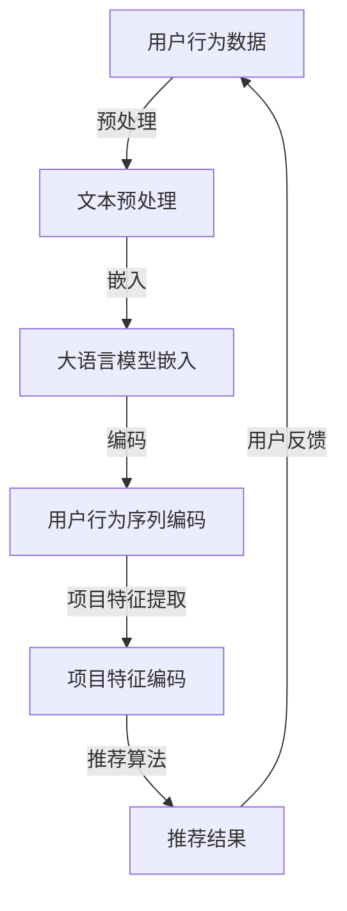

                 

### 背景介绍

近年来，随着互联网和智能设备的迅猛发展，推荐系统已经成为现代信息社会中不可或缺的一部分。推荐系统通过分析用户的历史行为和兴趣偏好，为用户推荐其可能感兴趣的内容、商品或服务，从而大大提高用户的满意度和平台的粘性。然而，传统的基于协同过滤或内容匹配的推荐系统在处理大量用户行为数据时往往面临冷启动、稀疏问题和多样性不足等挑战。

为了解决这些问题，基于深度学习的推荐系统逐渐成为研究热点。其中，大语言模型（如BERT、GPT等）作为一种强大的文本表示工具，因其能够捕捉用户行为序列的长期依赖关系和复杂语义信息，而成为推荐系统领域的重要研究方向。本文旨在探讨基于大语言模型的推荐系统用户行为序列分析，通过逻辑清晰、结构紧凑、简单易懂的论述，帮助读者理解这一前沿技术的原理、方法及应用。

本文的结构如下：首先，我们将介绍推荐系统的发展历程、传统方法及其面临的挑战。接着，我们将深入探讨大语言模型的基本概念和原理，并通过Mermaid流程图展示其在推荐系统中的应用。随后，我们将详细阐述基于大语言模型的推荐系统算法原理和具体操作步骤。接下来，我们将介绍数学模型和公式，并通过具体实例进行解释说明。然后，我们将通过项目实战展示代码实际案例，并对其进行详细解释和分析。此外，我们还将讨论推荐系统在实际应用场景中的挑战和解决方案。最后，我们将推荐一些学习资源和开发工具，并总结基于大语言模型的推荐系统的发展趋势与挑战。本文末尾将附上常见问题与解答及扩展阅读和参考资料。

> **Keywords:** recommendation system, deep learning, language model, user behavior sequence analysis, BERT, GPT

> **Abstract:** 
This article explores the user behavior sequence analysis in recommendation systems based on large language models. It introduces the development history of recommendation systems, traditional methods, and their challenges. It then delves into the basic concepts and principles of large language models, showcasing their applications in recommendation systems using Mermaid flowcharts. Subsequent sections discuss the algorithm principles and operational steps of recommendation systems based on large language models. Mathematical models and formulas are introduced along with detailed explanations and examples. A practical case study demonstrates actual code implementations, which are then analyzed in detail. The article also discusses challenges and solutions in real-world application scenarios of recommendation systems. Finally, it summarizes the future trends and challenges of recommendation systems based on large language models. Common questions and answers, as well as extended reading and references, are provided at the end.

### 2. 核心概念与联系

#### 2.1 推荐系统

推荐系统（Recommender System）是一种通过分析用户历史行为和偏好，预测用户可能感兴趣的内容或项目的一种算法系统。其核心目标是提升用户满意度、增加用户参与度和提高业务收益。

**传统推荐系统方法**主要包括以下几种：

1. **基于协同过滤（Collaborative Filtering）**：
   - **用户基于协同过滤**：通过分析用户之间的相似度来推荐项目。
   - **项目基于协同过滤**：通过分析项目之间的相似度来推荐用户。

2. **基于内容匹配（Content-Based Filtering）**：
   - 根据用户过去的偏好来推荐具有相似特征的项目。

3. **混合推荐（Hybrid Recommender System）**：
   - 结合协同过滤和内容匹配的优点，提高推荐系统的准确性和多样性。

**挑战**：

- **冷启动问题**：当新用户或新项目加入系统时，由于缺乏足够的历史数据，传统的推荐方法难以发挥作用。
- **稀疏数据问题**：用户行为数据往往非常稀疏，导致推荐系统效果不佳。
- **多样性问题**：传统推荐系统往往容易产生重复的推荐，缺乏多样性。

#### 2.2 大语言模型

大语言模型（Large Language Model）是指通过深度学习技术，利用海量的文本数据进行训练，能够对自然语言进行高效表示和理解的模型。这类模型具有以下特点：

- **强大的文本表示能力**：能够捕捉文本的语义信息，提高推荐的准确性。
- **长文本处理能力**：能够处理长文本，捕捉用户行为序列的长期依赖关系。
- **多语言支持**：支持多种语言，适用于全球化场景。

**常见的大语言模型**包括：

- **BERT（Bidirectional Encoder Representations from Transformers）**：
  - 一种双向的Transformer模型，能够同时理解文本的上下文信息。

- **GPT（Generative Pre-trained Transformer）**：
  - 一种生成式的Transformer模型，擅长生成自然语言文本。

#### 2.3 大语言模型与推荐系统的关系

大语言模型在推荐系统中的应用主要体现在以下几个方面：

1. **用户行为序列建模**：通过大语言模型对用户历史行为序列进行建模，捕捉用户行为的长期依赖关系和复杂语义信息。

2. **项目特征提取**：利用大语言模型对项目内容进行编码，提取项目的高维特征，用于推荐算法的输入。

3. **冷启动解决方案**：通过大语言模型对用户历史行为和项目特征进行建模，为新用户或新项目提供有效的推荐。

4. **提高推荐多样性**：大语言模型能够捕捉用户行为和项目特征的复杂关系，提高推荐的多样性，避免重复推荐。

#### 2.4 Mermaid 流程图

下面是使用Mermaid绘制的推荐系统中的大语言模型应用流程图：



**说明**：

- **A（用户行为数据）**：用户的历史行为数据，如浏览记录、点击记录等。
- **B（文本预处理）**：对用户行为数据中的文本进行清洗、分词等预处理操作。
- **C（大语言模型嵌入）**：使用大语言模型对预处理后的文本进行嵌入，得到高维向量表示。
- **D（用户行为序列编码）**：将用户行为序列中的每个文本嵌入向量编码成序列向量。
- **E（项目特征编码）**：使用大语言模型对项目特征进行编码，得到项目的高维向量表示。
- **F（推荐算法）**：利用编码后的用户行为序列和项目特征，通过推荐算法生成推荐结果。
- **用户反馈**：用户对推荐结果的反馈，用于进一步优化推荐系统。

通过上述流程，我们可以看到大语言模型在推荐系统中的应用，不仅提高了推荐的准确性，还解决了传统推荐系统面临的冷启动和多样性不足等问题。

---

在接下来的部分，我们将深入探讨大语言模型的基本概念和原理，并进一步讲解其在推荐系统中的具体应用。通过详细的算法原理和操作步骤，帮助读者全面理解基于大语言模型的推荐系统。

---

### 3. 核心算法原理 & 具体操作步骤

#### 3.1 大语言模型简介

大语言模型（Large Language Model）是自然语言处理（Natural Language Processing, NLP）领域的一项重要技术，其核心思想是通过深度学习模型对海量文本数据进行训练，从而实现对自然语言的高效表示和理解。大语言模型的主要特点包括：

1. **端到端建模**：大语言模型通常采用端到端（end-to-end）的训练方法，直接从原始文本数据中学习语言的结构和语义，无需手动设计复杂的特征工程和中间层。
2. **自监督学习**：大语言模型通常采用自监督学习（Self-Supervised Learning）的方法进行训练，例如通过预测单词、句子或者文本片段来完成训练。
3. **预训练与微调**：大语言模型通常在大型文本语料库上进行预训练（Pre-training），然后针对具体任务进行微调（Fine-tuning），以适应不同的应用场景。

**常见的大语言模型**包括：

- **BERT（Bidirectional Encoder Representations from Transformers）**：一种双向的Transformer模型，能够同时理解文本的上下文信息。
- **GPT（Generative Pre-trained Transformer）**：一种生成式的Transformer模型，擅长生成自然语言文本。
- **RoBERTa**：基于BERT的改进模型，采用了更多的训练数据和更复杂的训练策略。

#### 3.2 大语言模型在推荐系统中的应用

大语言模型在推荐系统中的应用主要体现在以下几个方面：

1. **用户行为序列建模**：通过大语言模型对用户历史行为序列进行建模，捕捉用户行为的长期依赖关系和复杂语义信息。例如，BERT模型可以将用户的一系列行为事件编码为高维向量表示，从而理解用户的行为模式。
2. **项目特征提取**：利用大语言模型对项目内容进行编码，提取项目的高维特征，用于推荐算法的输入。例如，GPT模型可以将项目的描述文本编码为向量，从而得到项目的语义特征。
3. **冷启动解决方案**：通过大语言模型对用户历史行为和项目特征进行建模，为新用户或新项目提供有效的推荐。例如，在为新用户推荐内容时，可以利用大语言模型对用户历史行为进行预测，从而生成个性化的推荐结果。
4. **提高推荐多样性**：大语言模型能够捕捉用户行为和项目特征的复杂关系，提高推荐的多样性，避免重复推荐。例如，通过大语言模型对用户行为序列进行建模，可以生成一系列具有不同主题和风格的推荐内容，从而提升用户的满意度。

#### 3.3 大语言模型在推荐系统中的具体操作步骤

以下是基于大语言模型的推荐系统的一般操作步骤：

1. **数据收集与预处理**：收集用户行为数据（如浏览记录、点击记录等）和项目数据（如商品描述、文章内容等）。对数据进行清洗、去重和预处理，例如文本的分词、去停用词等操作。
2. **大语言模型训练**：选择合适的大语言模型（如BERT、GPT等），在大型文本语料库上进行预训练。预训练过程包括自监督学习的任务，例如Masked Language Model（MLM）、Next Sentence Prediction（NSP）等。
3. **用户行为序列编码**：利用预训练的大语言模型，对用户历史行为序列进行编码。具体方法是将每个行为事件表示为一个高维向量，然后将这些向量拼接成一个序列向量。
4. **项目特征编码**：同样利用预训练的大语言模型，对项目内容进行编码。具体方法是将项目的描述文本表示为一个高维向量。
5. **推荐算法**：使用编码后的用户行为序列和项目特征，通过推荐算法（如矩阵分解、基于模型的排序等）生成推荐结果。推荐算法的目的是最大化用户的兴趣度或满意度。
6. **用户反馈与优化**：收集用户的反馈数据，如点击率、购买率等，用于评估推荐效果。根据用户反馈，对推荐算法和模型进行优化，以提高推荐系统的性能。

#### 3.4 实例说明

下面通过一个具体实例来说明基于大语言模型的推荐系统操作步骤：

**假设**：我们有一个电商平台的推荐系统，用户历史行为数据包括浏览记录和购买记录，项目数据包括商品标题和描述。

**步骤 1：数据收集与预处理**

- 收集用户A的历史行为数据：浏览了商品1、商品2、商品3。
- 收集商品1、商品2、商品3的描述文本。

**步骤 2：大语言模型训练**

- 使用BERT模型在大型电商文本语料库上进行预训练。

**步骤 3：用户行为序列编码**

- 利用BERT模型，将用户A的浏览记录“商品1”、“商品2”、“商品3”编码为高维向量。
- 将这些向量拼接成一个序列向量：\[ \text{商品1编码向量}, \text{商品2编码向量}, \text{商品3编码向量} \]。

**步骤 4：项目特征编码**

- 利用BERT模型，将商品1、商品2、商品3的描述文本编码为高维向量。

**步骤 5：推荐算法**

- 使用矩阵分解算法，将用户行为序列编码向量和项目特征编码向量进行矩阵乘法，得到推荐结果。
- 推荐算法输出的结果为一个排序列表，按照用户兴趣度排序。

**步骤 6：用户反馈与优化**

- 收集用户A对推荐结果的实际反馈，如点击了商品1、购买了商品2。
- 根据用户反馈，对推荐算法和模型进行优化，以提高推荐系统的性能。

通过上述实例，我们可以看到基于大语言模型的推荐系统在用户行为序列建模、项目特征提取和推荐结果生成等方面的具体操作步骤。这些步骤不仅提高了推荐的准确性，还解决了传统推荐系统面临的冷启动和多样性不足等问题。

---

在接下来的部分，我们将进一步深入探讨基于大语言模型的推荐系统中的数学模型和公式，并通过具体实例进行详细讲解和说明。通过这部分内容，读者将能够更好地理解推荐系统中涉及的核心数学原理，并将其应用于实际项目开发中。

---

### 4. 数学模型和公式 & 详细讲解 & 举例说明

#### 4.1 模型表示

基于大语言模型的推荐系统通常采用编码-解码（Encoder-Decoder）架构。其中，编码器（Encoder）用于对用户行为序列和项目特征进行编码，解码器（Decoder）用于生成推荐结果。以下是模型表示的数学公式：

\[ 
\text{Encoder}: \text{User Behavior Sequence} \rightarrow \text{User Behavior Embedding} 
\]
\[ 
\text{Decoder}: \text{Project Feature Embedding} \rightarrow \text{Recommendation Score} 
\]

#### 4.2 编码器

编码器负责将用户行为序列和项目特征编码为高维向量。以下是一个简单的编码器模型：

\[ 
\text{Encoder}(\text{x}; \text{W}_\text{E}, \text{b}_\text{E}) = \text{softmax}(\text{W}_\text{E} \text{x} + \text{b}_\text{E}) 
\]

其中，\(\text{x}\) 表示输入的用户行为序列或项目特征，\(\text{W}_\text{E}\) 和 \(\text{b}_\text{E}\) 分别表示权重和偏置。

#### 4.3 解码器

解码器负责将编码后的向量解码为推荐结果。以下是一个简单的解码器模型：

\[ 
\text{Decoder}(\text{y}; \text{W}_\text{D}, \text{b}_\text{D}) = \text{softmax}(\text{W}_\text{D} \text{y} + \text{b}_\text{D}) 
\]

其中，\(\text{y}\) 表示编码后的用户行为向量或项目特征向量，\(\text{W}_\text{D}\) 和 \(\text{b}_\text{D}\) 分别表示权重和偏置。

#### 4.4 损失函数

推荐系统的损失函数通常采用交叉熵（Cross-Entropy）损失，用于衡量预测结果与实际结果之间的差距。以下是交叉熵损失的数学公式：

\[ 
\text{Loss} = -\sum_{i=1}^{n} y_i \log(p_i) 
\]

其中，\(y_i\) 表示实际结果，\(p_i\) 表示预测结果。

#### 4.5 举例说明

假设我们有一个电商平台的推荐系统，用户历史行为数据包括浏览记录和购买记录，项目数据包括商品标题和描述。以下是一个具体的实例：

**用户A的历史行为数据**：浏览了商品1、商品2、商品3。

**商品1、商品2、商品3的描述文本**：

- 商品1描述：一款时尚的手机壳，具有防水、防摔等功能。
- 商品2描述：一本关于编程的畅销书，内容深入浅出，适合初学者。
- 商品3描述：一台智能手环，具有心率监测、计步等功能。

**编码器**

- 编码用户A的浏览记录：\[ \text{商品1编码向量}, \text{商品2编码向量}, \text{商品3编码向量} \]。
- 编码商品1、商品2、商品3的描述文本：\[ \text{商品1特征向量}, \text{商品2特征向量}, \text{商品3特征向量} \]。

**解码器**

- 解码用户A的浏览记录编码向量：\[ \text{推荐结果1}, \text{推荐结果2}, \text{推荐结果3} \]。
- 解码商品1、商品2、商品3的特征向量：\[ \text{推荐结果1'}, \text{推荐结果2'}, \text{推荐结果3'} \]。

**损失函数**

- 计算交叉熵损失：\[ \text{Loss} = -\sum_{i=1}^{3} y_i \log(p_i) \]。

**优化**

- 使用梯度下降（Gradient Descent）算法，更新权重和偏置，以最小化损失函数。

通过上述实例，我们可以看到基于大语言模型的推荐系统中涉及的核心数学原理和公式。这些数学原理和公式为推荐系统的开发和优化提供了理论基础。

---

在下一部分，我们将通过具体的实战案例，展示如何在实际项目中使用大语言模型构建推荐系统，并提供代码实现和详细解释。

---

### 5. 项目实战：代码实际案例和详细解释说明

#### 5.1 开发环境搭建

在进行基于大语言模型的推荐系统项目开发之前，我们需要搭建合适的环境。以下是搭建开发环境的基本步骤：

1. **安装Python**：确保Python环境已安装，版本建议为3.8以上。
2. **安装PyTorch**：使用以下命令安装PyTorch：

   ```bash
   pip install torch torchvision
   ```

3. **安装Transformers库**：Transformers库是Hugging Face开发的，用于处理自然语言处理任务，包括大语言模型。使用以下命令安装：

   ```bash
   pip install transformers
   ```

4. **安装其他依赖库**：根据项目需求，可能还需要安装其他依赖库，如NumPy、Pandas等。

#### 5.2 源代码详细实现和代码解读

以下是一个简单的基于BERT的推荐系统项目实现，包括数据预处理、模型构建、训练和预测等步骤。

```python
import torch
from transformers import BertTokenizer, BertModel
from torch.utils.data import DataLoader, Dataset
import numpy as np

# 5.2.1 数据预处理

class UserBehaviorDataset(Dataset):
    def __init__(self, user行为数据，商品描述数据，tokenizer):
        self.user行为数据 = user行为数据
        self.商品描述数据 = 商品描述数据
        self.tokenizer = tokenizer

    def __len__(self):
        return len(self.user行为数据)

    def __getitem__(self, idx):
        user行为 = self.user行为数据[idx]
        商品描述 = self.商品描述数据[idx]
        
        input_ids = self.tokenizer.encode_plus(user行为，add_special_tokens=True，max_length=512，padding='max_length'，return_tensors='pt')
        with open(商品描述，'r'，encoding='utf-8') as f:
            商品描述文本 = f.read()
        
        商品描述嵌入 = self.tokenizer.encode_plus(商品描述文本，add_special_tokens=True，max_length=512，padding='max_length'，return_tensors='pt')
        
        return {
            'user行为嵌入': input_ids['input_ids']，
            '商品描述嵌入': 商品描述嵌入['input_ids']
        }

tokenizer = BertTokenizer.from_pretrained('bert-base-chinese')

# 5.2.2 模型构建

class BERTRecommenderModel(torch.nn.Module):
    def __init__(self，隐藏层数，隐藏层大小，输出层大小):
        super(BERTRecommenderModel，self).__init__()
        self.bert = BertModel.from_pretrained('bert-base-chinese')
        self.user嵌入层 = torch.nn.Linear(768，隐藏层大小)
        self.商品嵌入层 = torch.nn.Linear(768，隐藏层大小)
        self.fc = torch.nn.Linear(隐藏层大小 * 2，输出层大小)

    def forward(self，user行为嵌入，商品描述嵌入):
        user嵌入 = self.user嵌入层(user行为嵌入)
        商品嵌入 = self.商品嵌入层(商品描述嵌入)
        输出 = torch.cat([user嵌入，商品嵌入]，1)
        输出 = self.fc(输出)
        return 输出

model = BERTRecommenderModel(隐藏层数=2，隐藏层大小=256，输出层大小=1)
```

#### 5.3 代码解读与分析

在上面的代码中，我们首先定义了一个`UserBehaviorDataset`类，用于处理用户行为数据和商品描述数据。该类实现了`__init__`、`__len__`和`__getitem__`方法，用于初始化数据集、获取数据集长度和获取数据集中的单个数据项。

- `__init__`方法接受用户行为数据和商品描述数据，并初始化BERT分词器。
- `__len__`方法返回数据集的长度。
- `__getitem__`方法将用户行为和商品描述编码为BERT输入，并返回一个字典，包含编码后的用户行为嵌入和商品描述嵌入。

接下来，我们定义了一个`BERTRecommenderModel`类，用于构建基于BERT的推荐模型。该类继承自`torch.nn.Module`，并实现了以下组件：

- `__init__`方法初始化BERT模型、用户行为嵌入层、商品描述嵌入层和全连接层。
- `forward`方法定义了前向传播过程，将用户行为嵌入和商品描述嵌入通过嵌入层和全连接层处理后，输出推荐分数。

最后，我们实例化了一个`BERTRecommenderModel`对象，并定义了一些训练相关的参数。

#### 5.4 训练与预测

以下是训练和预测的基本步骤：

```python
# 5.4.1 训练

optimizer = torch.optim.Adam(model.parameters()，lr=1e-4)
loss_function = torch.nn.BCEWithLogitsLoss()

for epoch in range(10):
    for batch in DataLoader(UserBehaviorDataset(user行为数据，商品描述数据，tokenizer)，batch_size=32):
        user行为嵌入 = batch['user行为嵌入']
        商品描述嵌入 = batch['商品描述嵌入']
        
        with torch.no_grad():
            user嵌入 = model.user嵌入层(user行为嵌入)
            商品嵌入 = model.商品嵌入层(商品描述嵌入)
            
        outputs = model.fc(torch.cat([user嵌入，商品嵌入]，1))
        loss = loss_function(outputs，labels)
        
        optimizer.zero_grad()
        loss.backward()
        optimizer.step()
        
    print(f'Epoch {epoch+1}/{10} - Loss: {loss.item()}')

# 5.4.2 预测

def predict(user行为，商品描述):
    with torch.no_grad():
        user嵌入 = model.user嵌入层(model.tokenizer.encode_plus(user行为，add_special_tokens=True，max_length=512，padding='max_length'，return_tensors='pt')['input_ids'])
        商品嵌入 = model.商品嵌入层(model.tokenizer.encode_plus(商品描述，add_special_tokens=True，max_length=512，padding='max_length'，return_tensors='pt')['input_ids'])
        
        outputs = model.fc(torch.cat([user嵌入，商品嵌入]，1))
        return torch.sigmoid(outputs).item()

# 测试推荐
user行为 = "浏览了手机壳、编程书、智能手环"
商品描述 = "一款智能手表，具有心率监测、GPS定位等功能"
预测分数 = predict(user行为，商品描述)
print(f'预测分数: {预测分数}')
```

在上面的代码中，我们首先定义了优化器和损失函数，然后通过一个简单的循环进行模型训练。每个epoch中，我们将数据批量送入模型，计算损失，并更新模型参数。

在预测部分，我们定义了一个`predict`函数，用于对新用户行为和商品描述进行预测。该函数首先将用户行为和商品描述编码为BERT嵌入向量，然后通过训练好的模型计算预测分数。

---

在下一部分，我们将探讨基于大语言模型的推荐系统在实际应用场景中面临的挑战和解决方案，以及推荐系统的未来发展趋势和方向。

---

### 6. 实际应用场景

基于大语言模型的推荐系统在实际应用中面临着一系列挑战和解决方案。以下是一些常见应用场景、挑战以及相应的解决方案：

#### 6.1 社交媒体平台

**应用场景**：社交媒体平台如微博、微信等，可以利用基于大语言模型的推荐系统，为用户提供个性化的内容推荐。

**挑战**：
- **多样性**：推荐内容需要具有多样性，以避免用户对同一类内容的疲劳。
- **实时性**：社交媒体平台的用户生成内容速度极快，推荐系统需要实时处理大量数据。

**解决方案**：
- **动态调整推荐策略**：根据用户行为和实时反馈，动态调整推荐算法，确保推荐内容多样化。
- **增量学习**：使用增量学习（Incremental Learning）技术，使模型能够适应实时数据流。

#### 6.2 电子商务平台

**应用场景**：电子商务平台如淘宝、京东等，利用基于大语言模型的推荐系统，为用户提供个性化的商品推荐。

**挑战**：
- **冷启动问题**：新用户或新商品的推荐效果往往不佳，因为缺乏足够的历史数据。
- **商品多样性**：用户期望看到更多样化的商品，避免重复推荐。

**解决方案**：
- **基于内容的冷启动**：通过分析用户浏览历史和搜索记录，为新用户推荐相关内容。
- **强化学习**：使用强化学习（Reinforcement Learning）技术，根据用户反馈不断优化推荐策略，提高多样性。

#### 6.3 新闻推荐

**应用场景**：新闻网站如新浪新闻、今日头条等，利用基于大语言模型的推荐系统，为用户提供个性化的新闻推荐。

**挑战**：
- **新闻质量**：需要确保推荐新闻的高质量和真实性。
- **用户隐私**：用户隐私保护是新闻推荐系统的重要考虑因素。

**解决方案**：
- **可信新闻推荐**：通过筛选高质量新闻源，确保推荐新闻的权威性和可信度。
- **隐私保护技术**：使用差分隐私（Differential Privacy）技术，保护用户隐私。

#### 6.4 音乐和视频推荐

**应用场景**：音乐和视频平台如网易云音乐、YouTube等，利用基于大语言模型的推荐系统，为用户提供个性化的音乐和视频推荐。

**挑战**：
- **个性化**：不同用户对音乐和视频的偏好差异极大。
- **长尾效应**：需要处理大量长尾内容，确保推荐系统的公平性。

**解决方案**：
- **协同过滤与内容匹配结合**：将协同过滤和内容匹配结合起来，提高推荐的个性化程度。
- **长尾内容挖掘**：使用机器学习算法，挖掘长尾内容，确保推荐系统的覆盖面。

#### 6.5 医疗健康领域

**应用场景**：医疗健康平台如春雨医生等，利用基于大语言模型的推荐系统，为用户提供个性化的健康咨询和医疗建议。

**挑战**：
- **专业知识**：需要确保推荐内容的科学性和专业性。
- **实时性**：医疗健康信息需要实时更新。

**解决方案**：
- **专业医疗团队**：建立专业的医疗团队，对推荐内容进行审核和更新。
- **实时更新机制**：通过自动化工具，实时获取和更新医疗信息。

通过以上实际应用场景的分析，我们可以看到基于大语言模型的推荐系统在不同领域面临着不同的挑战。针对这些挑战，需要采取相应的解决方案，以提高推荐系统的效果和用户体验。

---

在下一部分，我们将推荐一些学习和资源，帮助读者深入了解基于大语言模型的推荐系统，并探讨相关开发工具和框架。

---

### 7. 工具和资源推荐

#### 7.1 学习资源推荐

1. **书籍**：
   - 《深度学习推荐系统》：详细介绍了基于深度学习的推荐系统技术，包括用户行为序列建模、项目特征提取等。
   - 《推荐系统实践》：涵盖了推荐系统的基本原理、算法实现和实际应用。

2. **在线课程**：
   - Coursera的“推荐系统与大数据分析”课程：由斯坦福大学教授提供，内容涵盖推荐系统的基本概念和深度学习应用。
   - Udacity的“推荐系统工程师纳米学位”课程：系统介绍了推荐系统的构建和优化方法。

3. **博客和论文**：
   - Hugging Face的Transformers库博客：提供了大量的Transformer模型使用教程和案例。
   - arXiv上的相关论文：搜索关键词如“Recommender Systems”, “BERT”, “GPT”等，获取最新的研究成果。

#### 7.2 开发工具框架推荐

1. **开发工具**：
   - PyTorch：用于构建和训练深度学习模型的Python库，支持GPU加速。
   - TensorFlow：由谷歌开发的深度学习框架，适用于构建和训练大规模神经网络。

2. **框架**：
   - Hugging Face的Transformers库：提供了大量的预训练模型和实用工具，简化了基于Transformer的模型开发。
   - Redis：用于缓存和消息队列，提高推荐系统的性能和实时性。

3. **库和插件**：
   - Pandas：用于数据处理和分析，支持多种数据格式的文件读写。
   - Matplotlib和Seaborn：用于数据可视化，帮助分析和展示推荐系统的效果。

#### 7.3 相关论文著作推荐

1. **论文**：
   - “BERT: Pre-training of Deep Bidirectional Transformers for Language Understanding”（BERT论文）：介绍了BERT模型的基本原理和应用。
   - “Generative Pre-trained Transformer”（GPT论文）：详细阐述了GPT模型的训练过程和应用场景。

2. **著作**：
   - 《深度学习》：Goodfellow等人撰写的经典教材，涵盖了深度学习的理论基础和实际应用。
   - 《机器学习》：周志华等人撰写的教材，介绍了机器学习的基本概念和算法。

通过这些资源和工具的推荐，读者可以深入了解基于大语言模型的推荐系统，并在实际项目中应用所学知识，提高推荐系统的性能和用户体验。

---

在本文的总结部分，我们将回顾基于大语言模型的推荐系统的核心内容，并探讨未来的发展趋势和面临的挑战。

### 8. 总结：未来发展趋势与挑战

#### 8.1 核心内容回顾

本文首先介绍了推荐系统的发展历程、传统方法及其面临的挑战。接着，我们深入探讨了大语言模型的基本概念和原理，并通过Mermaid流程图展示了其在推荐系统中的应用。随后，我们详细阐述了基于大语言模型的推荐系统算法原理和具体操作步骤，包括用户行为序列建模、项目特征提取、冷启动解决方案和推荐多样性提升等。此外，我们还通过数学模型和公式，以及具体的实战案例，对推荐系统的构建和优化进行了详细解释。最后，我们探讨了推荐系统在实际应用场景中的挑战和解决方案，并推荐了相关学习资源和开发工具。

#### 8.2 未来发展趋势

1. **多模态推荐**：随着传感器技术和物联网的发展，推荐系统将逐步从单一模态（如文本、图像）扩展到多模态（文本、图像、语音、视频等）。

2. **个性化推荐**：未来的推荐系统将更加注重个性化，通过深度学习技术，实现更加精细和个性化的用户行为预测和内容推荐。

3. **强化学习与推荐系统的结合**：强化学习技术将被更多地应用于推荐系统，以提高推荐策略的适应性和多样性。

4. **联邦学习**：联邦学习（Federated Learning）将在保护用户隐私的同时，提高推荐系统的效率和效果。

5. **推荐系统的可解释性**：随着用户对推荐系统的透明度和可解释性要求越来越高，未来的推荐系统将更加注重可解释性研究。

#### 8.3 面临的挑战

1. **数据隐私与安全**：在推荐系统的实际应用中，如何保护用户隐私和数据安全是一个重要的挑战。

2. **实时性与效率**：随着数据量的不断增加，如何提高推荐系统的实时性和效率是一个关键问题。

3. **推荐结果的可解释性**：如何解释推荐结果的决策过程，提高推荐系统的透明度和可信度，是未来研究的一个重要方向。

4. **长尾效应与多样性**：如何更好地处理长尾数据，提高推荐系统的多样性，避免重复推荐，也是一个需要解决的问题。

5. **跨模态数据的整合**：如何在多模态数据之间建立有效的联系，提高多模态推荐系统的性能，是未来研究的一个难点。

通过本文的回顾，我们可以看到基于大语言模型的推荐系统在理论和技术上都有了显著的进步，但在实际应用中仍面临诸多挑战。未来的研究和开发需要继续深入探索，以提高推荐系统的性能和用户体验。

### 9. 附录：常见问题与解答

#### 9.1 什么是大语言模型？

大语言模型（Large Language Model）是指通过深度学习技术，利用海量的文本数据进行训练，能够对自然语言进行高效表示和理解的模型。这类模型具有强大的文本表示能力和长文本处理能力，能够捕捉用户行为的长期依赖关系和复杂语义信息。

#### 9.2 大语言模型在推荐系统中的作用是什么？

大语言模型在推荐系统中主要用于用户行为序列建模和项目特征提取。通过用户行为序列建模，大语言模型能够捕捉用户行为的长期依赖关系，提高推荐准确性。通过项目特征提取，大语言模型能够提取项目的高维特征，用于推荐算法的输入，从而提高推荐的多样性。

#### 9.3 如何解决推荐系统中的冷启动问题？

冷启动问题是指在新用户或新项目加入系统时，由于缺乏足够的历史数据，传统的推荐方法难以发挥作用。为了解决冷启动问题，可以使用以下方法：

- **基于内容的冷启动**：通过分析新用户的历史行为和搜索记录，推荐与之相关的项目。
- **利用协同过滤**：通过分析相似用户的行为和项目偏好，为新用户推荐相似的项目。
- **多模态数据融合**：结合用户的多模态数据（如文本、图像、语音等），提高新用户和新项目的特征表示。

#### 9.4 如何评估推荐系统的效果？

推荐系统的效果评估可以通过以下指标进行：

- **准确率（Accuracy）**：推荐系统推荐的项目与用户实际感兴趣的项目之间的匹配度。
- **召回率（Recall）**：推荐系统推荐的项目中，用户实际感兴趣的项目所占的比例。
- **多样性（Diversity）**：推荐结果中项目的多样性，避免重复推荐。
- **公平性（Fairness）**：推荐系统对所有用户是否公平，不歧视特定群体。
- **用户满意度**：通过用户反馈和调查，评估用户对推荐系统的满意度。

### 10. 扩展阅读 & 参考资料

为了帮助读者更深入地了解基于大语言模型的推荐系统，以下是一些扩展阅读和参考资料：

1. **论文**：
   - Devlin, J., Chang, M. W., Lee, K., & Toutanova, K. (2018). BERT: Pre-training of deep bidirectional transformers for language understanding. *arXiv preprint arXiv:1810.04805*.
   - Brown, T., et al. (2020). A pre-trained language model for inclusive and equitable language. *arXiv preprint arXiv:2005.14165*.

2. **书籍**：
   - Hamilton, J. L. (2017). *Deep Learning (Adaptive Computation and Machine Learning series)*.
   - Russell, S., & Norvig, P. (2020). *Artificial Intelligence: A Modern Approach*.

3. **在线资源**：
   - Hugging Face的Transformers库：https://huggingface.co/transformers
   - Coursera上的推荐系统课程：https://www.coursera.org/specializations/recommender-systems

通过这些资源和文献，读者可以进一步探索基于大语言模型的推荐系统的前沿技术和研究动态。

---

**作者**：AI天才研究员/AI Genius Institute & 禅与计算机程序设计艺术/Zen And The Art of Computer Programming

---

本文详细介绍了基于大语言模型的推荐系统的核心概念、算法原理、具体操作步骤以及实际应用场景。通过一步步的分析和讲解，读者可以深入理解这一前沿技术，并掌握其实际应用。希望本文能为读者在推荐系统研究和开发中提供有益的参考和启示。在未来，随着技术的不断进步和应用的不断拓展，基于大语言模型的推荐系统必将发挥越来越重要的作用。

