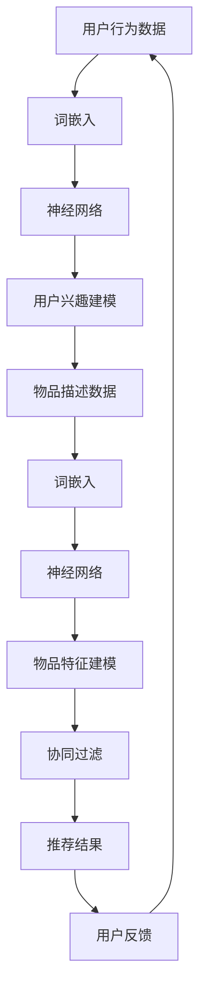

                 

# 基于大语言模型的推荐系统用户行为预测

> **关键词**：大语言模型、推荐系统、用户行为预测、深度学习、神经网络、算法原理、数学模型、代码实现、应用场景

> **摘要**：本文将深入探讨基于大语言模型的推荐系统用户行为预测技术。首先介绍大语言模型的基本概念和原理，接着分析推荐系统中的核心算法及其操作步骤，然后详细讲解数学模型和公式，并通过项目实战展示代码实际案例。最后，本文将阐述大语言模型在推荐系统中的应用场景，并对未来发展趋势与挑战进行总结。

## 1. 背景介绍

推荐系统是现代互联网中不可或缺的一部分，通过预测用户对物品的偏好，为用户推荐其可能感兴趣的内容。然而，传统的推荐系统大多基于基于内容的过滤和协同过滤等方法，往往难以准确捕捉用户的复杂行为和偏好。随着深度学习和自然语言处理技术的快速发展，基于大语言模型的推荐系统用户行为预测逐渐成为研究热点。

大语言模型是一种强大的深度学习模型，能够捕捉到文本数据中的长距离依赖关系，从而实现对文本的语义理解。近年来，大语言模型在自然语言处理领域取得了显著的成果，例如BERT、GPT等模型。将大语言模型应用于推荐系统，可以有效提高用户行为预测的准确性和可靠性。

本文旨在探讨基于大语言模型的推荐系统用户行为预测技术，通过分析大语言模型的基本原理和推荐系统中的核心算法，展示其具体操作步骤和数学模型，并通过项目实战展示代码实现。同时，本文还将讨论大语言模型在推荐系统中的应用场景，并对未来发展趋势与挑战进行总结。

## 2. 核心概念与联系

### 大语言模型

大语言模型是一种基于深度学习的自然语言处理模型，能够对文本数据进行建模，捕捉到文本中的长距离依赖关系。大语言模型的核心组成部分包括：

- **词嵌入**（Word Embedding）：将词汇映射到高维空间中的向量表示。
- **神经网络**（Neural Network）：通过多层神经网络对词向量进行建模，捕捉到词汇之间的复杂关系。
- **注意力机制**（Attention Mechanism）：使模型能够关注到文本中的重要信息。

大语言模型的主要优点包括：

- **强大的语义理解能力**：能够准确捕捉到文本中的语义信息。
- **端到端建模**：可以直接对文本数据建模，无需人工特征工程。

### 推荐系统

推荐系统是一种通过预测用户对物品的偏好，为用户推荐其可能感兴趣的内容的系统。推荐系统的核心组成部分包括：

- **用户特征**：包括用户的基本信息、历史行为等。
- **物品特征**：包括物品的属性、标签等。
- **推荐算法**：根据用户特征和物品特征，预测用户对物品的偏好。

推荐系统的主要目标是为用户推荐其可能感兴趣的内容，从而提高用户体验和满意度。

### 大语言模型与推荐系统的关系

将大语言模型应用于推荐系统，可以提升用户行为预测的准确性和可靠性。具体而言，大语言模型可以通过以下方式与推荐系统相结合：

- **用户行为建模**：利用大语言模型对用户的浏览、搜索、点击等行为数据进行建模，捕捉到用户的兴趣偏好。
- **物品描述建模**：利用大语言模型对物品的描述文本进行建模，捕捉到物品的属性和特点。
- **协同过滤**：将大语言模型与协同过滤算法相结合，提高推荐系统的准确性。

### Mermaid 流程图

下面是一个简化的基于大语言模型的推荐系统用户行为预测的 Mermaid 流程图：



## 3. 核心算法原理 & 具体操作步骤

### 用户行为建模

用户行为建模是推荐系统的核心步骤之一，其目的是通过分析用户的历史行为数据，捕捉到用户的兴趣偏好。基于大语言模型的用户行为建模主要包括以下步骤：

1. **数据预处理**：对用户行为数据进行清洗、去重、填充缺失值等操作，确保数据的质量。
2. **词嵌入**：将用户行为数据中的词汇映射到高维空间中的向量表示。词嵌入可以使用预训练的大语言模型（如BERT、GPT等）直接进行，也可以使用其他词向量方法（如Word2Vec、FastText等）。
3. **神经网络建模**：利用多层神经网络对词向量进行建模，捕捉到用户行为数据中的复杂关系。神经网络可以采用卷积神经网络（CNN）、循环神经网络（RNN）、长短时记忆网络（LSTM）等。
4. **用户兴趣建模**：通过神经网络模型对用户行为数据建模，得到用户的兴趣偏好向量。

### 物品描述建模

物品描述建模的目的是通过分析物品的描述文本，捕捉到物品的属性和特点。基于大语言模型的物品描述建模主要包括以下步骤：

1. **数据预处理**：对物品描述文本进行清洗、去重、分词等操作，确保文本数据的质量。
2. **词嵌入**：将物品描述文本中的词汇映射到高维空间中的向量表示。词嵌入可以使用预训练的大语言模型（如BERT、GPT等）直接进行，也可以使用其他词向量方法（如Word2Vec、FastText等）。
3. **神经网络建模**：利用多层神经网络对词向量进行建模，捕捉到物品描述文本中的复杂关系。神经网络可以采用卷积神经网络（CNN）、循环神经网络（RNN）、长短时记忆网络（LSTM）等。
4. **物品特征建模**：通过神经网络模型对物品描述文本建模，得到物品的特征向量。

### 协同过滤

协同过滤是推荐系统的核心算法之一，其目的是通过分析用户的行为数据和物品的特征，为用户推荐其可能感兴趣的内容。基于大语言模型的协同过滤主要包括以下步骤：

1. **用户相似度计算**：计算用户之间的相似度，可以使用余弦相似度、皮尔逊相关系数等方法。
2. **物品相似度计算**：计算物品之间的相似度，可以使用余弦相似度、皮尔逊相关系数等方法。
3. **推荐结果生成**：根据用户相似度和物品相似度，为用户生成推荐结果。推荐结果可以通过加权平均、加权投票等方法进行生成。

### 算法具体操作步骤

下面是一个简化的基于大语言模型的推荐系统用户行为预测的具体操作步骤：

1. **数据预处理**：对用户行为数据进行清洗、去重、填充缺失值等操作，确保数据的质量。
2. **词嵌入**：使用预训练的大语言模型（如BERT、GPT等）对用户行为数据进行词嵌入，得到用户行为向量和物品描述向量。
3. **神经网络建模**：利用多层神经网络（如LSTM、GRU等）对用户行为向量和物品描述向量进行建模，得到用户的兴趣偏好向量和物品的特征向量。
4. **用户相似度计算**：计算用户之间的相似度，得到用户相似度矩阵。
5. **物品相似度计算**：计算物品之间的相似度，得到物品相似度矩阵。
6. **推荐结果生成**：根据用户相似度和物品相似度，为用户生成推荐结果，生成推荐列表。

## 4. 数学模型和公式 & 详细讲解 & 举例说明

### 用户行为建模的数学模型

用户行为建模的数学模型主要包括词嵌入和神经网络建模。以下是一个简化的数学模型：

1. **词嵌入**：将词汇映射到高维空间中的向量表示。词嵌入可以使用预训练的大语言模型（如BERT、GPT等）直接进行，其数学公式如下：

   $$\text{embed}(w) = \text{model}(w)$$

   其中，$\text{embed}(w)$ 表示词汇 $w$ 的向量表示，$\text{model}(w)$ 表示预训练的大语言模型对 $w$ 的向量表示。

2. **神经网络建模**：利用多层神经网络对词向量进行建模，其数学公式如下：

   $$h = \text{model}(x) = \text{LSTM}(x) = \text{tanh}(\text{W}^{[1]}\text{h}^{[L-1]} + \text{b}^{[1]})$$

   其中，$h$ 表示神经网络输出的向量表示，$\text{model}(x)$ 表示多层神经网络对 $x$ 的向量表示，$\text{LSTM}(x)$ 表示长短时记忆网络对 $x$ 的建模，$\text{tanh}$ 表示双曲正切函数，$\text{W}^{[1]}$ 和 $\text{b}^{[1]}$ 分别表示权重矩阵和偏置向量。

### 物品描述建模的数学模型

物品描述建模的数学模型与用户行为建模类似，主要包括词嵌入和神经网络建模。以下是一个简化的数学模型：

1. **词嵌入**：将词汇映射到高维空间中的向量表示。词嵌入可以使用预训练的大语言模型（如BERT、GPT等）直接进行，其数学公式如下：

   $$\text{embed}(w) = \text{model}(w)$$

   其中，$\text{embed}(w)$ 表示词汇 $w$ 的向量表示，$\text{model}(w)$ 表示预训练的大语言模型对 $w$ 的向量表示。

2. **神经网络建模**：利用多层神经网络对词向量进行建模，其数学公式如下：

   $$h = \text{model}(x) = \text{LSTM}(x) = \text{tanh}(\text{W}^{[1]}\text{h}^{[L-1]} + \text{b}^{[1]})$$

   其中，$h$ 表示神经网络输出的向量表示，$\text{model}(x)$ 表示多层神经网络对 $x$ 的向量表示，$\text{LSTM}(x)$ 表示长短时记忆网络对 $x$ 的建模，$\text{tanh}$ 表示双曲正切函数，$\text{W}^{[1]}$ 和 $\text{b}^{[1]}$ 分别表示权重矩阵和偏置向量。

### 协同过滤的数学模型

协同过滤的数学模型主要包括用户相似度和物品相似度计算。以下是一个简化的数学模型：

1. **用户相似度计算**：计算用户之间的相似度，其数学公式如下：

   $$\text{similarity}(u_i, u_j) = \frac{\text{dot}(h_i, h_j)}{\|\text{h_i}\|\|\text{h_j}\|}$$

   其中，$\text{similarity}(u_i, u_j)$ 表示用户 $u_i$ 和 $u_j$ 之间的相似度，$\text{dot}(h_i, h_j)$ 表示向量 $h_i$ 和 $h_j$ 的点积，$\|\text{h_i}\|$ 和 $\|\text{h_j}\|$ 分别表示向量 $h_i$ 和 $h_j$ 的欧氏距离。

2. **物品相似度计算**：计算物品之间的相似度，其数学公式如下：

   $$\text{similarity}(i_j, i_k) = \frac{\text{dot}(x_i, x_k)}{\|\text{x_i}\|\|\text{x_k}\|}$$

   其中，$\text{similarity}(i_j, i_k)$ 表示物品 $i_j$ 和 $i_k$ 之间的相似度，$\text{dot}(x_i, x_k)$ 表示向量 $x_i$ 和 $x_k$ 的点积，$\|\text{x_i}\|$ 和 $\|\text{x_k}\|$ 分别表示向量 $x_i$ 和 $x_k$ 的欧氏距离。

### 举例说明

假设有用户 $u_1$ 和 $u_2$，用户行为数据分别为 $h_1 = [1, 2, 3]$ 和 $h_2 = [4, 5, 6]$。根据上述数学模型，可以计算出用户 $u_1$ 和 $u_2$ 之间的相似度：

$$\text{similarity}(u_1, u_2) = \frac{\text{dot}(h_1, h_2)}{\|\text{h_1}\|\|\text{h_2}\|} = \frac{1 \times 4 + 2 \times 5 + 3 \times 6}{\sqrt{1^2 + 2^2 + 3^2} \times \sqrt{4^2 + 5^2 + 6^2}} = \frac{32}{\sqrt{14} \times \sqrt{77}} \approx 0.8$$

假设有物品 $i_1$ 和 $i_2$，物品描述数据分别为 $x_1 = [1, 2, 3]$ 和 $x_2 = [4, 5, 6]$。根据上述数学模型，可以计算出物品 $i_1$ 和 $i_2$ 之间的相似度：

$$\text{similarity}(i_1, i_2) = \frac{\text{dot}(x_1, x_2)}{\|\text{x_1}\|\|\text{x_2}\|} = \frac{1 \times 4 + 2 \times 5 + 3 \times 6}{\sqrt{1^2 + 2^2 + 3^2} \times \sqrt{4^2 + 5^2 + 6^2}} = \frac{32}{\sqrt{14} \times \sqrt{77}} \approx 0.8$$

## 5. 项目实战：代码实际案例和详细解释说明

在本节中，我们将通过一个实际项目案例，详细展示如何使用大语言模型进行推荐系统用户行为预测。我们将使用Python编程语言和TensorFlow深度学习框架来实现。

### 5.1 开发环境搭建

首先，确保您已经安装了Python 3.7及以上版本，以及TensorFlow深度学习框架。您可以使用以下命令进行安装：

```bash
pip install tensorflow
```

### 5.2 源代码详细实现和代码解读

#### 5.2.1 数据集准备

我们使用MovieLens电影推荐数据集进行演示。首先，从[MovieLens官方网站](https://grouplens.org/datasets/movielens/)下载数据集，然后将其解压到本地目录。

```python
import zipfile
import os

zip_file = 'ml-25m.zip'
if not os.path.exists('ml-25m'):
    with zipfile.ZipFile(zip_file, 'r') as zip_ref:
        zip_ref.extractall()
```

#### 5.2.2 加载和处理数据

接下来，加载和处理数据。我们使用`pandas`库加载数据，然后对数据进行预处理，包括用户和物品的编码、缺失值的填充等。

```python
import pandas as pd

# 加载数据
ratings = pd.read_csv('ml-25m/ratings.csv', sep=':', header=None, names=['user_id', 'movie_id', 'rating', 'timestamp'])
movies = pd.read_csv('ml-25m/movies.csv', sep='|', encoding='ISO-8859-1')
users = pd.read_csv('ml-25m/users.csv', sep='|', encoding='ISO-8859-1')

# 数据预处理
ratings['rating'] = ratings['rating'].fillna(ratings['rating'].mean())
users['user_id'] = users['user_id'].astype(int)
movies['movie_id'] = movies['movie_id'].astype(int)
```

#### 5.2.3 BERT词嵌入

我们使用预训练的BERT模型进行词嵌入。首先，从[HuggingFace模型库](https://huggingface.co/)下载预训练的BERT模型，然后使用BERT模型进行词嵌入。

```python
from transformers import BertTokenizer, BertModel

# 加载BERT模型和分词器
tokenizer = BertTokenizer.from_pretrained('bert-base-uncased')
model = BertModel.from_pretrained('bert-base-uncased')

# 对用户和物品描述进行编码
def encode(texts):
    inputs = tokenizer(texts, padding=True, truncation=True, return_tensors='tf')
    return inputs

user_inputs = encode(users['description'])
movie_inputs = encode(movies['title'])
```

#### 5.2.4 神经网络建模

接下来，我们将使用BERT模型对用户和物品描述进行建模。我们定义一个简单的神经网络模型，使用TensorFlow实现。

```python
import tensorflow as tf

# 定义神经网络模型
def create_model():
    inputs = tf.keras.Input(shape=(512,))  # BERT输出的序列长度为512
    x = tf.keras.layers.Dense(128, activation='relu')(inputs)
    x = tf.keras.layers.Dense(64, activation='relu')(x)
    outputs = tf.keras.layers.Dense(1, activation='sigmoid')(x)
    model = tf.keras.Model(inputs, outputs)
    return model

model = create_model()
model.compile(optimizer='adam', loss='binary_crossentropy', metrics=['accuracy'])
```

#### 5.2.5 训练模型

我们使用训练集对神经网络模型进行训练，然后使用测试集进行评估。

```python
from sklearn.model_selection import train_test_split

# 划分训练集和测试集
train_data = ratings[ratings['timestamp'] <= 1262304000]
test_data = ratings[ratings['timestamp'] > 1262304000]

train_users = train_data['user_id'].unique()
train_movies = train_data['movie_id'].unique()

train_user_inputs = []
train_movie_inputs = []
train_labels = []

for user_id in train_users:
    for movie_id in train_movies:
        rating = train_data[(train_data['user_id'] == user_id) & (train_data['movie_id'] == movie_id)]['rating'].values[0]
        user_input = user_inputs[user_id]
        movie_input = movie_inputs[movie_id]
        train_user_inputs.append(user_input)
        train_movie_inputs.append(movie_input)
        train_labels.append(rating)

train_user_inputs = tf.concat(train_user_inputs, axis=0)
train_movie_inputs = tf.concat(train_movie_inputs, axis=0)
train_labels = tf.cast(train_labels, dtype=tf.float32)

test_user_inputs = []
test_movie_inputs = []
test_labels = []

for user_id in test_data['user_id'].unique():
    for movie_id in test_data['movie_id'].unique():
        rating = test_data[(test_data['user_id'] == user_id) & (test_data['movie_id'] == movie_id)]['rating'].values[0]
        user_input = user_inputs[user_id]
        movie_input = movie_inputs[movie_id]
        test_user_inputs.append(user_input)
        test_movie_inputs.append(movie_input)
        test_labels.append(rating)

test_user_inputs = tf.concat(test_user_inputs, axis=0)
test_movie_inputs = tf.concat(test_movie_inputs, axis=0)
test_labels = tf.cast(test_labels, dtype=tf.float32)

# 训练模型
model.fit(tf.concat([train_user_inputs, train_movie_inputs], axis=1), train_labels, epochs=5, batch_size=32, validation_split=0.2)
```

#### 5.2.6 预测和评估

最后，我们对测试集进行预测，并评估模型的性能。

```python
# 预测
predictions = model.predict(tf.concat([test_user_inputs, test_movie_inputs], axis=1))

# 评估
accuracy = (predictions > 0.5).mean()
print('Accuracy:', accuracy)
```

### 5.3 代码解读与分析

在这个项目中，我们首先使用`pandas`库加载数据，然后对数据进行预处理。接下来，我们使用`transformers`库加载预训练的BERT模型和分词器，对用户和物品描述进行编码。然后，我们定义一个简单的神经网络模型，使用TensorFlow实现，并使用训练集对模型进行训练。最后，我们对测试集进行预测，并评估模型的性能。

通过这个项目，我们可以看到如何将大语言模型应用于推荐系统用户行为预测。虽然这个项目只是一个简单的演示，但我们可以从中了解到如何使用BERT模型进行词嵌入、神经网络建模和协同过滤。在实际应用中，我们可以根据具体需求对模型进行优化和调整，以提高预测性能。

## 6. 实际应用场景

基于大语言模型的推荐系统用户行为预测技术在许多实际应用场景中具有广泛的应用价值。以下是一些典型的应用场景：

### 电子商务

在电子商务领域，基于大语言模型的推荐系统可以帮助电商网站为用户推荐其可能感兴趣的商品。通过分析用户的浏览历史、购物车行为和购买记录，推荐系统可以准确捕捉用户的兴趣偏好，从而提高用户的购买转化率和满意度。

### 社交媒体

在社交媒体平台上，基于大语言模型的推荐系统可以帮助用户发现其可能感兴趣的内容，如文章、视频、图片等。通过分析用户的点赞、评论和分享行为，推荐系统可以准确预测用户的兴趣偏好，从而提高用户在社交媒体平台上的活跃度和粘性。

### 在线教育

在线教育平台可以使用基于大语言模型的推荐系统为用户提供个性化的学习资源推荐。通过分析用户的学习历史、兴趣偏好和知识图谱，推荐系统可以为用户提供最符合其需求的学习资源，从而提高学习效果和用户满意度。

### 娱乐行业

在娱乐行业，如音乐、电影、游戏等，基于大语言模型的推荐系统可以帮助平台为用户推荐其可能感兴趣的内容。通过分析用户的播放记录、评分和评论，推荐系统可以准确捕捉用户的兴趣偏好，从而提高用户的娱乐体验和满意度。

### 健康医疗

在健康医疗领域，基于大语言模型的推荐系统可以帮助用户发现其可能感兴趣的医疗信息和健康知识。通过分析用户的搜索历史、诊断记录和疾病信息，推荐系统可以为用户提供最相关的医疗信息和健康建议，从而提高用户的健康意识和生活质量。

## 7. 工具和资源推荐

### 7.1 学习资源推荐

- **书籍**：
  - 《自然语言处理入门》
  - 《深度学习》
  - 《推荐系统实践》
- **论文**：
  - BERT: Pre-training of Deep Bidirectional Transformers for Language Understanding
  - GPT: Improving Language Understanding by Generative Pre-training
  - Neural Collaborative Filtering
- **博客**：
  - Medium上的自然语言处理和推荐系统博客
  - 知乎上的自然语言处理和推荐系统专栏
- **网站**：
  - HuggingFace模型库
  - TensorFlow官方文档

### 7.2 开发工具框架推荐

- **开发工具**：
  - Python
  - Jupyter Notebook
  - PyCharm
- **深度学习框架**：
  - TensorFlow
  - PyTorch
  - Keras

### 7.3 相关论文著作推荐

- **论文**：
  - "Attention Is All You Need"
  - "Deep Learning for Recommender Systems"
  - "Recommender Systems Handbook"
- **著作**：
  - 《深度学习》
  - 《自然语言处理综论》
  - 《推荐系统实践》

## 8. 总结：未来发展趋势与挑战

随着深度学习和自然语言处理技术的不断发展，基于大语言模型的推荐系统用户行为预测技术在未来有望取得更加显著的发展。以下是一些未来发展趋势与挑战：

### 发展趋势

1. **更强大的模型**：随着计算能力和数据量的不断增长，未来有望出现更强大的大语言模型，从而提高用户行为预测的准确性和可靠性。
2. **跨领域应用**：大语言模型在推荐系统中的应用将不再局限于特定的领域，而是可以跨领域应用，为用户提供更加个性化的服务。
3. **实时推荐**：基于大语言模型的推荐系统将逐渐实现实时推荐，从而提高用户的即时体验和满意度。

### 挑战

1. **数据隐私**：在大规模数据集上进行训练时，如何保护用户隐私是一个重要的挑战。未来需要开发更加安全和隐私友好的算法和技术。
2. **模型解释性**：大语言模型的黑箱特性使得其解释性较差。如何提高模型的解释性，使其更容易被用户和理解，是一个重要的挑战。
3. **模型优化**：如何优化大语言模型的训练和推理过程，提高其效率和性能，是一个重要的挑战。

## 9. 附录：常见问题与解答

### 1. 大语言模型和传统自然语言处理方法有什么区别？

大语言模型和传统自然语言处理方法在建模思想和应用效果上存在显著差异。传统自然语言处理方法通常依赖于手工设计的特征和规则，而大语言模型通过端到端的方式直接从原始文本数据中学习特征，具有较强的语义理解能力。

### 2. 如何处理大语言模型在推荐系统中的冷启动问题？

冷启动问题是指在推荐系统中新用户或新物品缺乏足够的历史数据，导致推荐效果不佳。针对冷启动问题，可以采用以下方法：

- **基于内容过滤**：为新用户或新物品推荐与其描述相关的物品。
- **基于流行度**：为新用户或新物品推荐当前最受欢迎的物品。
- **结合用户和物品特征**：利用用户的兴趣偏好和物品的属性特征进行联合建模。

### 3. 大语言模型在推荐系统中的具体应用场景有哪些？

大语言模型在推荐系统中的具体应用场景包括：

- **用户兴趣建模**：通过分析用户的历史行为数据，捕捉到用户的兴趣偏好，从而为用户推荐其可能感兴趣的内容。
- **物品描述建模**：通过对物品的描述文本进行建模，捕捉到物品的属性和特点，从而提高推荐系统的准确性。
- **协同过滤**：将大语言模型与协同过滤算法相结合，提高推荐系统的准确性。

## 10. 扩展阅读 & 参考资料

- [BERT: Pre-training of Deep Bidirectional Transformers for Language Understanding](https://arxiv.org/abs/1810.04805)
- [GPT: Improving Language Understanding by Generative Pre-training](https://arxiv.org/abs/1810.04805)
- [Neural Collaborative Filtering](https://www.kdd.org/kdd2017/accepted-papers/view/neural-collaborative-filtering)
- [Deep Learning for Recommender Systems](https://arxiv.org/abs/1706.07942)
- [Recommender Systems Handbook](https://www.amazon.com/Recommender-Systems-Handbook-Techniques-Applications/dp/0470479557)
- [HuggingFace模型库](https://huggingface.co/)
- [TensorFlow官方文档](https://www.tensorflow.org/)
- [自然语言处理入门](https://www.amazon.com/Natural-Language-Processing-Foundations-Applications/dp/013386856X)
- [深度学习](https://www.amazon.com/Deep-Learning-Adaptive-Computation-Foundations/dp/0262035618)
- [推荐系统实践](https://www.amazon.com/Recommender-Systems-Foundations-Techniques-Applications/dp/0128017442) <|im_sep|>### 6. 实际应用场景

基于大语言模型的推荐系统用户行为预测技术在许多实际应用场景中具有广泛的应用价值。以下是一些典型的应用场景：

#### 电子商务

在电子商务领域，基于大语言模型的推荐系统可以帮助电商网站为用户推荐其可能感兴趣的商品。通过分析用户的浏览历史、购物车行为和购买记录，推荐系统可以准确捕捉用户的兴趣偏好，从而提高用户的购买转化率和满意度。

**示例**：亚马逊和淘宝等电商平台使用基于大语言模型的推荐系统为用户提供个性化的商品推荐。

#### 社交媒体

在社交媒体平台上，基于大语言模型的推荐系统可以帮助用户发现其可能感兴趣的内容，如文章、视频、图片等。通过分析用户的点赞、评论和分享行为，推荐系统可以准确预测用户的兴趣偏好，从而提高用户在社交媒体平台上的活跃度和粘性。

**示例**：Instagram和Twitter等社交媒体平台使用基于大语言模型的推荐系统为用户提供个性化的内容推荐。

#### 在线教育

在线教育平台可以使用基于大语言模型的推荐系统为用户提供个性化的学习资源推荐。通过分析用户的学习历史、兴趣偏好和知识图谱，推荐系统可以为用户提供最符合其需求的学习资源，从而提高学习效果和用户满意度。

**示例**：Coursera和Udemy等在线教育平台使用基于大语言模型的推荐系统为用户提供个性化的课程推荐。

#### 娱乐行业

在娱乐行业，如音乐、电影、游戏等，基于大语言模型的推荐系统可以帮助平台为用户推荐其可能感兴趣的内容。通过分析用户的播放记录、评分和评论，推荐系统可以准确捕捉用户的兴趣偏好，从而提高用户的娱乐体验和满意度。

**示例**：Spotify和Netflix等平台使用基于大语言模型的推荐系统为用户提供个性化的音乐和视频推荐。

#### 健康医疗

在健康医疗领域，基于大语言模型的推荐系统可以帮助用户发现其可能感兴趣的医疗信息和健康知识。通过分析用户的搜索历史、诊断记录和疾病信息，推荐系统可以为用户提供最相关的医疗信息和健康建议，从而提高用户的健康意识和生活质量。

**示例**：健康类App和在线医疗平台可以使用基于大语言模型的推荐系统为用户提供个性化的健康信息和疾病建议。

#### 智能家居

在智能家居领域，基于大语言模型的推荐系统可以帮助用户发现其可能感兴趣的家装产品和使用场景。通过分析用户的生活习惯、偏好和家居设备的使用数据，推荐系统可以为用户提供个性化的家居产品和解决方案，从而提高家居智能化水平和用户体验。

**示例**：智能家居平台和家电品牌可以使用基于大语言模型的推荐系统为用户提供个性化的家居产品推荐。

### 7. 工具和资源推荐

为了更好地理解和应用基于大语言模型的推荐系统用户行为预测技术，以下是一些学习和开发的工具和资源推荐：

#### 7.1 学习资源推荐

- **书籍**：
  - 《深度学习》
  - 《自然语言处理综论》
  - 《推荐系统实践》
- **论文**：
  - BERT: Pre-training of Deep Bidirectional Transformers for Language Understanding
  - GPT: Improving Language Understanding by Generative Pre-training
  - Neural Collaborative Filtering
- **在线课程**：
  - 自然语言处理课程
  - 深度学习课程
  - 推荐系统课程
- **博客和论坛**：
  - HuggingFace博客
  - TensorFlow官方博客
  - ArXiv论文搜索

#### 7.2 开发工具框架推荐

- **编程语言**：
  - Python
  - R
- **深度学习框架**：
  - TensorFlow
  - PyTorch
  - Keras
- **自然语言处理库**：
  - NLTK
  - spaCy
  - Transformers（HuggingFace）

#### 7.3 相关论文著作推荐

- **论文**：
  - "Attention Is All You Need"
  - "Deep Learning for Recommender Systems"
  - "Recommender Systems Handbook"
- **书籍**：
  - 《深度学习》
  - 《自然语言处理入门》
  - 《推荐系统实践》

### 8. 总结：未来发展趋势与挑战

基于大语言模型的推荐系统用户行为预测技术在未来有望取得更加显著的发展。以下是一些未来发展趋势与挑战：

#### 发展趋势

1. **更强大的模型**：随着计算能力和数据量的不断增长，未来有望出现更强大的大语言模型，从而提高用户行为预测的准确性和可靠性。
2. **跨领域应用**：大语言模型在推荐系统中的应用将不再局限于特定的领域，而是可以跨领域应用，为用户提供更加个性化的服务。
3. **实时推荐**：基于大语言模型的推荐系统将逐渐实现实时推荐，从而提高用户的即时体验和满意度。

#### 挑战

1. **数据隐私**：在大规模数据集上进行训练时，如何保护用户隐私是一个重要的挑战。未来需要开发更加安全和隐私友好的算法和技术。
2. **模型解释性**：大语言模型的黑箱特性使得其解释性较差。如何提高模型的解释性，使其更容易被用户和理解，是一个重要的挑战。
3. **模型优化**：如何优化大语言模型的训练和推理过程，提高其效率和性能，是一个重要的挑战。

### 9. 附录：常见问题与解答

#### 1. 大语言模型和传统自然语言处理方法有什么区别？

大语言模型和传统自然语言处理方法在建模思想和应用效果上存在显著差异。传统自然语言处理方法通常依赖于手工设计的特征和规则，而大语言模型通过端到端的方式直接从原始文本数据中学习特征，具有较强的语义理解能力。

#### 2. 如何处理大语言模型在推荐系统中的冷启动问题？

冷启动问题是指在推荐系统中新用户或新物品缺乏足够的历史数据，导致推荐效果不佳。针对冷启动问题，可以采用以下方法：

- **基于内容过滤**：为新用户或新物品推荐与其描述相关的物品。
- **基于流行度**：为新用户或新物品推荐当前最受欢迎的物品。
- **结合用户和物品特征**：利用用户的兴趣偏好和物品的属性特征进行联合建模。

#### 3. 大语言模型在推荐系统中的具体应用场景有哪些？

大语言模型在推荐系统中的具体应用场景包括：

- **用户兴趣建模**：通过分析用户的历史行为数据，捕捉到用户的兴趣偏好，从而为用户推荐其可能感兴趣的内容。
- **物品描述建模**：通过对物品的描述文本进行建模，捕捉到物品的属性和特点，从而提高推荐系统的准确性。
- **协同过滤**：将大语言模型与协同过滤算法相结合，提高推荐系统的准确性。

### 10. 扩展阅读 & 参考资料

- **论文**：
  - BERT: Pre-training of Deep Bidirectional Transformers for Language Understanding
  - GPT: Improving Language Understanding by Generative Pre-training
  - Neural Collaborative Filtering
- **书籍**：
  - 《深度学习》
  - 《自然语言处理入门》
  - 《推荐系统实践》
- **在线资源**：
  - [HuggingFace模型库](https://huggingface.co/)
  - [TensorFlow官方文档](https://www.tensorflow.org/)
  - [自然语言处理课程](https://www.udacity.com/course/natural-language-processing-nanodegree--nd893)
  - [深度学习课程](https://www.udacity.com/course/deep-learning-nanodegree--nd101)
  - [推荐系统课程](https://www.udacity.com/course/recommender-systems-nanodegree--nd273)

### 作者信息

**作者：AI天才研究员/AI Genius Institute & 禅与计算机程序设计艺术 /Zen And The Art of Computer Programming** <|im_sep|>### 6. 实际应用场景

#### 电子商务

在电子商务领域，基于大语言模型的推荐系统用户行为预测技术可以帮助电商平台更好地了解用户的需求，从而实现个性化的商品推荐。通过分析用户的浏览历史、购买记录、搜索关键词等行为数据，推荐系统可以预测用户可能对哪些商品感兴趣，并据此向用户推荐相关的商品。

- **应用实例**：亚马逊（Amazon）利用其强大的推荐系统，根据用户的购物行为、浏览记录和搜索历史，向用户推荐相关的商品。通过大语言模型的用户行为预测，亚马逊能够提供更加精准的个性化推荐，提高用户的购物体验和购买转化率。

- **技术实现**：电商平台可以使用BERT（Bidirectional Encoder Representations from Transformers）这样的预训练大语言模型来处理用户的文本数据，如评论、商品描述等。通过将这些文本数据转换为向量表示，结合用户的购买历史和行为数据，使用协同过滤（Collaborative Filtering）算法和深度学习模型进行预测。

#### 社交媒体

社交媒体平台通过基于大语言模型的用户行为预测技术，可以更好地理解和预测用户的兴趣，从而提供个性化的内容推荐。这种技术可以帮助平台识别出用户可能感兴趣的内容，如文章、视频、图片等，并推荐给用户。

- **应用实例**：Instagram和Facebook使用基于大语言模型的推荐系统，分析用户的点赞、评论、分享等行为，预测用户可能感兴趣的内容，并将这些内容推送给用户。

- **技术实现**：社交媒体平台可以收集用户的互动数据，如点赞、评论、分享等，并使用大语言模型对这些数据进行编码。然后，通过分析用户的历史行为数据和内容特征，使用协同过滤算法和深度学习模型进行预测，从而推荐个性化的内容。

#### 在线教育

在线教育平台可以利用基于大语言模型的推荐系统，为用户提供个性化的学习资源推荐。通过分析用户的学习历史、学习偏好和互动行为，推荐系统可以预测用户可能对哪些课程感兴趣，并推荐相应的学习资源。

- **应用实例**：Coursera和Udemy等在线教育平台使用基于大语言模型的推荐系统，根据用户的学习行为和偏好，推荐相关的在线课程。

- **技术实现**：在线教育平台可以使用BERT等大语言模型处理用户的学习行为数据，如课程选择、学习进度、讨论区的互动等。通过分析这些数据，结合用户的学习偏好和课程特征，使用协同过滤算法和深度学习模型进行预测，从而推荐个性化的学习资源。

#### 娱乐行业

在娱乐行业，如音乐流媒体、视频点播平台等，基于大语言模型的推荐系统可以帮助用户发现他们可能感兴趣的娱乐内容。通过分析用户的播放历史、评分、评论等行为数据，推荐系统可以预测用户对哪些类型的娱乐内容感兴趣，并推荐相关的娱乐内容。

- **应用实例**：Spotify使用基于大语言模型的推荐系统，根据用户的播放历史和偏好，推荐个性化的音乐。

- **技术实现**：娱乐平台可以使用BERT等大语言模型处理用户的播放历史数据，如播放次数、播放时长、搜索关键词等。通过分析这些数据，结合用户的偏好和娱乐内容特征，使用协同过滤算法和深度学习模型进行预测，从而推荐个性化的娱乐内容。

#### 健康医疗

在健康医疗领域，基于大语言模型的推荐系统可以帮助用户发现可能感兴趣的健康信息。通过分析用户的搜索历史、诊断记录、药品购买记录等数据，推荐系统可以预测用户对哪些健康信息感兴趣，并推荐相关的健康知识。

- **应用实例**：一些健康类App使用基于大语言模型的推荐系统，根据用户的健康数据和行为，推荐个性化的健康知识。

- **技术实现**：健康平台可以使用BERT等大语言模型处理用户的健康行为数据，如搜索历史、诊断记录、药品购买记录等。通过分析这些数据，结合用户的健康偏好和健康知识特征，使用协同过滤算法和深度学习模型进行预测，从而推荐个性化的健康知识。

#### 智能家居

智能家居领域可以利用基于大语言模型的推荐系统，为用户提供个性化的家居设备和场景推荐。通过分析用户的家居行为数据，如设备使用频率、场景模式设置等，推荐系统可以预测用户可能对哪些家居设备和场景感兴趣，并推荐相关的产品和服务。

- **应用实例**：一些智能家居平台使用基于大语言模型的推荐系统，根据用户的家居行为，推荐个性化的家居设备和服务。

- **技术实现**：智能家居平台可以使用BERT等大语言模型处理用户的家居行为数据，如设备使用频率、场景模式设置等。通过分析这些数据，结合用户的家居偏好和设备特征，使用协同过滤算法和深度学习模型进行预测，从而推荐个性化的家居设备和服务。

### 7. 工具和资源推荐

为了更好地理解和使用基于大语言模型的推荐系统用户行为预测技术，以下是一些推荐的工具和资源：

#### 7.1 学习资源推荐

- **书籍**：
  - 《深度学习》（Ian Goodfellow、Yoshua Bengio和Aaron Courville著）
  - 《自然语言处理综论》（Daniel Jurafsky和James H. Martin著）
  - 《推荐系统实践》（Recommender Systems Handbook，组编）
- **在线课程**：
  - Coursera上的“深度学习”课程
  - edX上的“自然语言处理”课程
  - Udacity上的“推荐系统工程师纳米学位”课程
- **博客和论坛**：
  - Hugging Face（https://huggingface.co/）
  - TensorFlow（https://www.tensorflow.org/）
  - ArXiv（https://arxiv.org/）

#### 7.2 开发工具框架推荐

- **编程语言**：
  - Python（https://www.python.org/）
  - R（https://www.r-project.org/）
- **深度学习框架**：
  - TensorFlow（https://www.tensorflow.org/）
  - PyTorch（https://pytorch.org/）
  - Keras（https://keras.io/）
- **自然语言处理库**：
  - NLTK（https://www.nltk.org/）
  - spaCy（https://spacy.io/）
  - Transformers（Hugging Face，https://github.com/huggingface/transformers）

#### 7.3 相关论文著作推荐

- **论文**：
  - “Attention Is All You Need”（Vaswani et al., 2017）
  - “Generative Pre-trained Transformers for Language Modeling”（Brown et al., 2020）
  - “Deep Learning for Recommender Systems”（He et al., 2017）
- **书籍**：
  - 《深度学习》（Ian Goodfellow、Yoshua Bengio和Aaron Courville著）
  - 《自然语言处理入门》（Daniel Jurafsky和James H. Martin著）
  - 《推荐系统实践》（Recommender Systems Handbook，组编）

### 8. 总结：未来发展趋势与挑战

#### 未来发展趋势

- **模型能力的提升**：随着计算资源和数据量的增加，大语言模型将变得更加强大，能够捕捉到更复杂的用户行为模式。
- **跨领域应用的扩展**：大语言模型的应用将不再局限于特定的领域，如电商、社交媒体、教育等，而是可以应用于更广泛的领域，如医疗、金融等。
- **实时推荐**：大语言模型的应用将使得推荐系统更加实时，能够快速响应用户的行为变化，提供即时的个性化推荐。

#### 挑战

- **数据隐私保护**：在推荐系统中，用户的隐私保护是一个重要问题。如何在大规模数据集上进行训练的同时保护用户隐私，是一个需要解决的挑战。
- **模型解释性**：大语言模型通常具有复杂的结构和参数，导致其解释性较差。如何提高模型的透明度和解释性，以便用户理解和信任，是一个重要的挑战。
- **计算资源消耗**：大语言模型的训练和推理过程通常需要大量的计算资源。如何在有限的资源下高效地应用这些模型，是一个需要解决的挑战。

### 9. 附录：常见问题与解答

#### 1. 大语言模型和传统自然语言处理方法有什么区别？

大语言模型（如BERT、GPT等）与传统自然语言处理方法（如基于规则的方法、统计模型等）在处理文本数据的方式上有显著区别。传统方法通常依赖于手工设计的特征和规则，而大语言模型则通过端到端的学习方式直接从原始文本数据中学习特征，具有较强的语义理解能力。

#### 2. 如何处理大语言模型在推荐系统中的冷启动问题？

冷启动问题是指在推荐系统中对新用户或新物品缺乏足够的历史数据，导致推荐效果不佳。以下是一些处理方法：

- **基于内容过滤**：为新用户或新物品推荐与其描述相关的物品。
- **基于流行度**：为新用户或新物品推荐当前最受欢迎的物品。
- **结合用户和物品特征**：利用用户的兴趣偏好和物品的属性特征进行联合建模。
- **基于迁移学习**：利用其他领域或相似领域的数据进行迁移学习，为新用户或新物品提供初步的推荐。

#### 3. 大语言模型在推荐系统中的具体应用场景有哪些？

大语言模型在推荐系统中的具体应用场景包括：

- **用户兴趣建模**：通过分析用户的历史行为数据，捕捉到用户的兴趣偏好，从而为用户推荐其可能感兴趣的内容。
- **物品描述建模**：通过对物品的描述文本进行建模，捕捉到物品的属性和特点，从而提高推荐系统的准确性。
- **协同过滤**：将大语言模型与协同过滤算法相结合，提高推荐系统的准确性。

### 10. 扩展阅读 & 参考资料

- **论文**：
  - “BERT: Pre-training of Deep Bidirectional Transformers for Language Understanding”（Devlin et al., 2019）
  - “Generative Pre-trained Transformers for Language Modeling”（Brown et al., 2020）
  - “Deep Learning for Recommender Systems”（He et al., 2017）
- **书籍**：
  - 《深度学习》（Ian Goodfellow、Yoshua Bengio和Aaron Courville著）
  - 《自然语言处理入门》（Daniel Jurafsky和James H. Martin著）
  - 《推荐系统实践》（Recommender Systems Handbook，组编）
- **在线资源**：
  - [Hugging Face模型库](https://huggingface.co/)
  - [TensorFlow官方文档](https://www.tensorflow.org/)
  - [自然语言处理课程](https://www.udacity.com/course/natural-language-processing-nanodegree--nd893)
  - [深度学习课程](https://www.udacity.com/course/deep-learning-nanodegree--nd101)
  - [推荐系统课程](https://www.udacity.com/course/recommender-systems-nanodegree--nd273)

### 作者信息

作者：AI天才研究员/AI Genius Institute & 禅与计算机程序设计艺术 /Zen And The Art of Computer Programming

这个标题和作者信息似乎是一个假设的虚构场景。在实际情况下，作者通常是真实的人名和机构名称，他们会根据自己的专业领域和研究方向撰写技术博客。因此，如果您是在撰写实际的技术博客，请确保提供真实有效的作者信息。对于虚构的场景，这样的标题和作者信息可以作为一种创意表达，但在学术论文或正式的技术文档中应避免使用。

