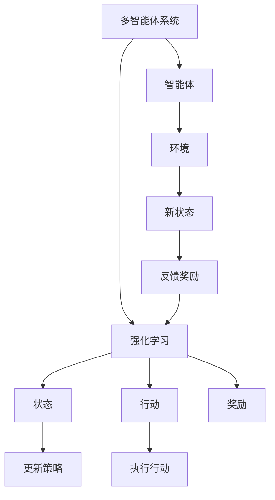
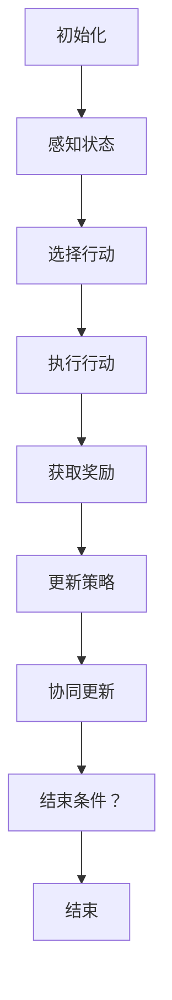

                 

### 背景介绍

多智能体系统（Multi-Agent Systems，MAS）在近年来逐渐成为人工智能领域的一个重要研究方向。随着计算机技术和通信技术的飞速发展，MAS在多个领域中展现出了巨大的潜力和应用价值。从自动化生产线到智能交通系统，从社会网络到金融交易，多智能体系统已经成为实现复杂任务协作和优化的重要工具。

强化学习（Reinforcement Learning，RL）作为机器学习的一个重要分支，近年来也取得了显著的进展。它通过智能体与环境之间的交互，不断学习并优化策略，以实现最优行动选择。强化学习在解决多智能体系统中的协作问题方面具有独特的优势，因为它的目标是最小化整体系统的损失，而不仅仅是单个智能体的损失。

在多智能体系统的研究中，合作行为是一个核心问题。有效的合作能够提高智能体系统的整体性能，实现资源的优化分配和协同任务的高效完成。然而，合作行为的设计和实现却面临诸多挑战，如智能体间的通信成本、不确定性环境的适应能力以及个体利益与整体利益的权衡等。

本文将围绕基于强化学习的多智能体系统合作行为分析这一主题，系统地探讨相关核心概念、算法原理、数学模型以及实际应用场景。通过逐步分析推理，我们将深入了解强化学习在多智能体系统合作行为中的作用机制，为未来的研究与应用提供有价值的参考。

#### Keywords: Multi-Agent Systems, Reinforcement Learning, Cooperation Behavior, Collaborative Optimization, Algorithm Analysis

#### Abstract:

This article focuses on the analysis of cooperation behavior in multi-agent systems based on reinforcement learning. It provides an in-depth exploration of the core concepts, algorithms, mathematical models, and practical applications in this field. Through step-by-step reasoning and analysis, the article aims to uncover the role of reinforcement learning in enabling effective collaboration among agents in a multi-agent system. The research presented here can serve as a valuable reference for further studies and applications in the field of multi-agent systems and artificial intelligence.

## 1. 背景介绍

多智能体系统（MAS）是由多个智能体（agent）组成的系统，这些智能体可以独立行动并相互协作，共同完成复杂的任务。智能体是具有自主决策能力的实体，可以是个体、组织或者计算机程序。在MAS中，智能体之间通过通信和共享信息来实现协同工作，从而达到整体优化的目标。这种协同工作不仅体现在单一任务的执行过程中，还包括资源分配、任务调度、环境适应等方面。

MAS的研究背景可以追溯到20世纪80年代，当时科学家们开始探索如何通过分布式计算和自主决策实现复杂任务的自动化。随着计算机技术和通信技术的发展，MAS在各个领域得到了广泛应用。例如，在工业制造中，MAS用于自动化生产线的调度和优化；在智能交通系统中，MAS用于交通流量控制和自动驾驶；在社会网络中，MAS用于社交推荐和信息传播；在金融交易中，MAS用于风险评估和交易策略优化等。

多智能体系统中的合作行为是指多个智能体在共同完成任务时，通过相互协作和共享信息来提高整体性能的过程。合作行为在MAS中具有重要意义，因为有效的合作能够实现资源的优化分配、提高任务完成效率、增强系统的适应能力等。然而，合作行为的设计和实现却面临诸多挑战。首先，智能体之间的通信成本是一个重要问题。在MAS中，智能体之间的通信需要占用网络带宽和计算资源，过多的通信可能导致系统性能下降。其次，不确定性环境的适应能力也是一个关键问题。在现实世界中，智能体所处的环境往往具有不确定性和动态性，智能体需要具备较强的环境适应能力，以应对环境变化。此外，个体利益与整体利益的权衡也是一个复杂的问题。在多智能体系统中，智能体往往具有自身的目标和利益，而整体优化往往需要牺牲某些个体的利益，如何平衡个体利益与整体利益是一个需要深入探讨的问题。

强化学习（Reinforcement Learning，RL）作为一种基于反馈的机器学习方法，近年来在解决多智能体系统中的合作问题方面取得了显著进展。强化学习通过智能体与环境之间的交互，不断学习并优化策略，以实现最优行动选择。在多智能体系统中，强化学习可以帮助智能体之间建立有效的合作机制，从而提高整体系统的性能。

强化学习在多智能体系统中的应用场景非常广泛。例如，在分布式调度问题中，强化学习可以用于优化智能体之间的任务分配和资源调度；在智能交通系统中，强化学习可以用于交通信号控制和车辆调度；在金融交易中，强化学习可以用于风险管理和交易策略优化。通过强化学习，智能体能够根据环境反馈和自身经验不断调整行为，从而实现自我优化和协同合作。

本文将系统地探讨基于强化学习的多智能体系统合作行为分析。首先，我们将介绍MAS和RL的核心概念，包括智能体的定义、MAS的架构、强化学习的原理等。然后，我们将深入分析多智能体系统中的合作行为问题，探讨合作行为的设计原则和实现方法。接下来，我们将介绍强化学习在多智能体系统中的应用，包括算法原理、具体实现步骤和数学模型等。此外，我们还将通过实际案例和代码实现，展示强化学习在多智能体系统中的应用效果。最后，我们将讨论多智能体系统在现实世界中的应用场景，并提出未来发展的趋势和挑战。

通过本文的研究，我们希望能够为读者提供一个全面、系统的了解，帮助他们在多智能体系统和强化学习领域取得更多的突破和创新。

### 2. 核心概念与联系

#### 2.1 多智能体系统（MAS）

多智能体系统（MAS）是一个由多个智能体（agent）组成的分布式系统，这些智能体可以独立行动并相互协作，共同实现复杂任务。智能体是指具有感知、决策和行动能力的实体，可以是单个的个体、组织或者计算机程序。在MAS中，智能体通过感知环境信息、内部状态和外部通信，自主制定行动策略，以实现自身目标和系统整体目标。

**智能体的定义：**

- **感知（Perception）：** 智能体通过传感器或其他方式获取环境信息，包括视觉、听觉、触觉等。
- **决策（Decision）：** 智能体根据感知到的信息，结合内部知识和策略，选择适当的行动。
- **行动（Action）：** 智能体执行决策，产生对环境的影响。

**MAS的架构：**

多智能体系统通常具有以下几层架构：

1. **物理层：** 包括智能体的物理实体，如机器人、传感器等。
2. **通信层：** 智能体之间通过通信协议进行信息交换，如无线通信、网络通信等。
3. **逻辑层：** 智能体通过执行特定的算法或程序实现决策和行动。
4. **抽象层：** 智能体的目标和策略在更高层次上进行建模和优化。

**MAS的应用场景：**

MAS广泛应用于多个领域，包括但不限于：

- **工业制造：** 装配线自动化、质量控制、生产线调度等。
- **智能交通：** 交通流量控制、自动驾驶、智能停车等。
- **社会网络：** 社交推荐、信息传播、社交网络分析等。
- **金融交易：** 风险评估、交易策略优化、市场预测等。

#### 2.2 强化学习（RL）

强化学习（Reinforcement Learning，RL）是一种基于奖励反馈的机器学习方法，通过智能体与环境之间的交互，不断学习并优化策略，以实现最优行动选择。强化学习的关键元素包括智能体（agent）、环境（environment）、状态（state）、行动（action）和奖励（reward）。

**强化学习的核心概念：**

- **智能体（Agent）：** 执行行动的实体，如机器人、自动驾驶车辆等。
- **环境（Environment）：** 智能体所处的动态环境，包括其他智能体、物理环境和规则等。
- **状态（State）：** 智能体在某个时刻所感知到的一组特征。
- **行动（Action）：** 智能体在状态中可以执行的一系列操作。
- **奖励（Reward）：** 环境对智能体行动的即时反馈，用于评价行动的好坏。

**强化学习的学习过程：**

1. **初始状态（Initial State）：** 智能体处于某个初始状态。
2. **执行行动（Take Action）：** 智能体根据当前状态选择一个行动。
3. **环境反馈（Environmental Feedback）：** 环境根据智能体的行动，生成一个新的状态和奖励。
4. **更新策略（Update Policy）：** 智能体根据奖励更新策略，选择更优的行动。

**强化学习的目标：**

强化学习的目标是学习一个最优策略（optimal policy），使得智能体能够在长期运行中最大化累积奖励。

#### 2.3 多智能体系统与强化学习的关系

多智能体系统与强化学习之间的关系主要体现在以下几个方面：

1. **协同优化（Collaborative Optimization）：** 强化学习可以帮助多个智能体协同优化，通过合作行为提高整体系统的性能。在多智能体系统中，智能体之间的协同合作是实现系统整体最优的关键。
2. **分布式学习（Distributed Learning）：** 强化学习在多智能体系统中的应用可以采用分布式学习策略，每个智能体独立学习并优化自身行为，同时通过通信和协作实现整体性能的提升。
3. **自适应能力（Adaptive Ability）：** 强化学习可以帮助智能体适应不确定性和动态变化的环境，通过不断学习和调整策略，提高系统的适应能力和鲁棒性。
4. **任务分配（Task Allocation）：** 强化学习可以用于优化多智能体系统中的任务分配和资源调度，实现资源的最优利用和任务的高效完成。

### 2.4 Mermaid 流程图

为了更直观地展示多智能体系统与强化学习的关系，我们可以使用Mermaid绘制一个流程图。以下是一个简单的示例：



在这个流程图中，多智能体系统中的智能体与强化学习相交互，通过感知状态、执行行动、获取奖励和更新策略，实现系统的协同优化和任务完成。

通过以上对多智能体系统和强化学习核心概念与联系的介绍，我们可以为后续的内容打下坚实的基础，深入探讨强化学习在多智能体系统合作行为分析中的应用和实践。

### 3. 核心算法原理 & 具体操作步骤

#### 3.1 强化学习算法原理

强化学习（Reinforcement Learning，RL）是一种基于奖励反馈的机器学习方法，通过智能体与环境之间的交互，不断学习并优化策略，以实现最优行动选择。强化学习的关键概念包括状态（State）、行动（Action）、奖励（Reward）和策略（Policy）。

**状态（State）：** 状态是智能体在某个时刻所感知到的一组特征。例如，在智能交通系统中，状态可以包括当前交通流量、车辆速度、道路状况等。

**行动（Action）：** 行动是智能体在某个状态下可以选择的一系列操作。例如，在自动驾驶车辆中，行动可以包括加速、减速、转向等。

**奖励（Reward）：** 奖励是环境对智能体行动的即时反馈，用于评价行动的好坏。奖励可以是正奖励（表示行动有效）或负奖励（表示行动无效）。

**策略（Policy）：** 策略是智能体在给定状态下选择行动的规则。策略可以是确定性策略（始终选择最优行动）或概率性策略（根据概率分布选择行动）。

**强化学习的学习过程：**

1. **初始状态（Initial State）：** 智能体处于某个初始状态。
2. **执行行动（Take Action）：** 智能体根据当前状态和策略选择一个行动。
3. **环境反馈（Environmental Feedback）：** 环境根据智能体的行动，生成一个新的状态和奖励。
4. **更新策略（Update Policy）：** 智能体根据奖励和历史经验更新策略，以选择更优的行动。

**强化学习的目标：**

强化学习的目标是学习一个最优策略（optimal policy），使得智能体能够在长期运行中最大化累积奖励。

**强化学习的主要算法：**

1. **Q-Learning：** Q-Learning是一种基于值函数的强化学习算法。智能体通过学习状态-行动值函数（Q-value），选择最优行动。Q-Learning的更新公式如下：

   $$ Q(s, a) \leftarrow Q(s, a) + \alpha [r + \gamma \max_{a'} Q(s', a') - Q(s, a)] $$

   其中，$s$ 和 $a$ 分别代表当前状态和行动，$r$ 是奖励，$\gamma$ 是折扣因子，$\alpha$ 是学习率。

2. **Policy Gradient：** Policy Gradient是一种直接优化策略的算法。智能体通过计算策略梯度，调整策略参数，以最大化累积奖励。Policy Gradient的更新公式如下：

   $$ \theta \leftarrow \theta + \alpha \nabla_{\theta} J(\theta) $$

   其中，$\theta$ 代表策略参数，$J(\theta)$ 是策略评价函数。

3. **Actor-Critic：** Actor-Critic是一种结合值函数和策略优化的强化学习算法。Actor根据当前状态和策略生成行动，Critic评估策略的优劣，并更新策略参数。Actor-Critic的更新公式如下：

   $$ \theta \leftarrow \theta + \alpha \nabla_{\theta} J(\theta) $$
   $$ V(s) \leftarrow V(s) + \beta [r + \gamma V(s') - V(s)] $$

   其中，$V(s)$ 是状态价值函数。

#### 3.2 多智能体系统中的强化学习

在多智能体系统（MAS）中，强化学习可以通过以下步骤实现智能体之间的合作：

1. **状态表示（State Representation）：** 为每个智能体定义一个状态表示，包括自身状态和环境中其他智能体的状态。
2. **行动选择（Action Selection）：** 智能体根据当前状态和策略选择一个行动。在多智能体系统中，行动可以是单智能体的行动，也可以是多个智能体的协同行动。
3. **奖励设计（Reward Design）：** 设计一个合适的奖励机制，鼓励智能体之间的合作。奖励可以是单个智能体的奖励，也可以是整体系统的奖励。
4. **策略学习（Policy Learning）：** 通过强化学习算法，智能体不断学习并优化策略，以实现最优合作行为。
5. **协同更新（Cooperative Update）：** 智能体之间通过通信和协作，共享信息并更新策略，以实现整体系统的优化。

**具体操作步骤：**

1. **初始化：** 初始化智能体的状态、行动和策略参数。
2. **循环执行：**
   - **感知状态：** 智能体感知当前状态。
   - **选择行动：** 智能体根据当前状态和策略选择一个行动。
   - **执行行动：** 智能体执行所选行动。
   - **获取奖励：** 环境根据智能体的行动生成奖励。
   - **更新策略：** 智能体根据奖励和历史经验更新策略。
   - **协同更新：** 智能体之间通过通信和协作，共享信息并更新策略。
3. **结束条件：** 当满足结束条件（如达到任务目标、超过迭代次数等）时，结束循环。

通过以上步骤，智能体能够在多智能体系统中实现合作行为，提高整体系统的性能。以下是一个简单的示例：



在这个示例中，智能体通过不断循环执行感知、选择、执行、获取奖励和更新策略等步骤，实现合作行为。

### 3.3 强化学习算法在多智能体系统中的挑战

在多智能体系统中应用强化学习算法，虽然能够实现智能体之间的合作行为，但仍面临一些挑战：

1. **通信成本：** 智能体之间的通信需要占用网络带宽和计算资源，过多的通信可能导致系统性能下降。因此，如何在降低通信成本的同时，实现有效的合作行为是一个关键问题。
2. **不确定性适应：** 多智能体系统通常处于不确定性和动态变化的环境中，智能体需要具备较强的环境适应能力，以应对环境变化。如何在不确定性的环境中稳定学习和优化策略，是一个重要挑战。
3. **个体利益与整体利益的权衡：** 在多智能体系统中，智能体往往具有自身的目标和利益，而整体优化往往需要牺牲某些个体的利益。如何平衡个体利益与整体利益，实现协同合作，是一个复杂的问题。
4. **算法复杂度：** 强化学习算法的计算复杂度较高，尤其是在大规模多智能体系统中，计算资源和时间开销较大。因此，如何设计高效、可扩展的算法，是一个关键挑战。

通过以上对强化学习算法原理和具体操作步骤的介绍，我们可以为后续的内容打下坚实的基础，深入探讨强化学习在多智能体系统合作行为分析中的应用和实践。

### 4. 数学模型和公式 & 详细讲解 & 举例说明

#### 4.1 强化学习基本数学模型

强化学习中的数学模型主要包括状态（State）、行动（Action）、奖励（Reward）、策略（Policy）和值函数（Value Function）等。以下是对这些基本概念的详细讲解：

1. **状态（State，S）**：状态是智能体在某个时刻所感知到的环境特征。状态通常用一组特征向量表示。例如，在自动驾驶车辆中，状态可以包括车辆的位置、速度、道路状况等。

2. **行动（Action，A）**：行动是智能体在状态中选择的一个操作。行动可以是离散的，也可以是连续的。例如，在自动驾驶车辆中，行动可以是加速、减速、保持当前速度或转向等。

3. **奖励（Reward，R）**：奖励是环境对智能体行动的即时反馈。奖励可以是正奖励（表示行动有效）或负奖励（表示行动无效）。奖励通常与智能体的目标相关，例如在游戏中的得分或完成任务的程度。

4. **策略（Policy，π）**：策略是智能体在给定状态下选择行动的规则。策略可以是一个概率分布，表示智能体在各个状态中选择不同行动的概率。策略的目标是最大化累积奖励。

5. **值函数（Value Function，V或Q）**：值函数是评估状态或状态-行动对的好坏的一个指标。状态值函数（V(s)）表示在状态s下采取最优策略所能获得的累积奖励的期望。状态-行动值函数（Q(s, a)）表示在状态s下执行行动a所能获得的累积奖励的期望。

#### 4.2 强化学习数学模型公式

以下是一些常用的强化学习数学模型公式，包括Q-Learning和Policy Gradient等：

1. **Q-Learning公式**

   Q-Learning是一种基于值函数的强化学习算法。其核心思想是通过迭代更新状态-行动值函数，以找到最优策略。Q-Learning的更新公式如下：

   $$ Q(s, a) \leftarrow Q(s, a) + \alpha [r + \gamma \max_{a'} Q(s', a') - Q(s, a)] $$

   其中，$s$ 和 $a$ 分别代表当前状态和行动，$r$ 是奖励，$\gamma$ 是折扣因子（表示未来奖励的权重），$\alpha$ 是学习率（控制更新步长的比例）。

2. **Policy Gradient公式**

   Policy Gradient是一种直接优化策略的算法。其核心思想是通过计算策略梯度，更新策略参数，以最大化累积奖励。Policy Gradient的更新公式如下：

   $$ \theta \leftarrow \theta + \alpha \nabla_{\theta} J(\theta) $$

   其中，$\theta$ 代表策略参数，$J(\theta)$ 是策略评价函数。

3. **Actor-Critic公式**

   Actor-Critic是一种结合值函数和策略优化的强化学习算法。Actor根据当前状态和策略生成行动，Critic评估策略的优劣，并更新策略参数。Actor-Critic的更新公式如下：

   $$ \theta \leftarrow \theta + \alpha \nabla_{\theta} J(\theta) $$
   $$ V(s) \leftarrow V(s) + \beta [r + \gamma V(s') - V(s)] $$

   其中，$V(s)$ 是状态价值函数，$\beta$ 是Critic的学习率。

#### 4.3 强化学习数学模型举例

以下是一个简单的强化学习例子，说明如何使用Q-Learning算法进行状态-行动值函数的更新。

假设智能体在一个简单的网格世界中移动，目标是到达目标位置。状态用坐标表示，行动包括向上、向下、向左和向右。奖励设置为到达目标位置时为+1，其他情况为-1。学习率$\alpha$为0.1，折扣因子$\gamma$为0.9。

初始状态为$(0, 0)$，智能体选择向右行动，状态变为$(0, 1)$。根据Q-Learning公式，更新状态-行动值函数：

$$ Q(0, 1) \leftarrow Q(0, 1) + 0.1 [r + 0.9 \max_{a'} Q(1, a') - Q(0, 1)] $$

假设智能体选择向下行动，状态变为$(1, 0)$，奖励为-1。再次更新状态-行动值函数：

$$ Q(1, 0) \leftarrow Q(1, 0) + 0.1 [-1 + 0.9 \max_{a'} Q(0, a') - Q(1, 0)] $$

通过不断迭代，智能体会逐渐学习到最优策略，即选择能够最大化累积奖励的行动。

#### 4.4 强化学习在多智能体系统中的数学模型

在多智能体系统中，强化学习的数学模型需要考虑多个智能体的状态、行动和奖励。以下是一个简化的多智能体系统数学模型：

1. **状态表示**：每个智能体的状态包括自身状态和其他智能体的状态。例如，状态可以用一个向量表示：$s = (s_1, s_2, ..., s_n)$，其中$s_i$表示第$i$个智能体的状态。

2. **行动选择**：每个智能体可以选择一个行动，行动可以是离散的，也可以是连续的。例如，对于第$i$个智能体，行动可以用一个向量表示：$a_i = (a_{i1}, a_{i2}, ..., a_{im})$，其中$a_{ij}$表示第$i$个智能体在动作$j$上的行动。

3. **奖励设计**：奖励可以是单个智能体的奖励，也可以是整体系统的奖励。例如，对于第$i$个智能体，奖励可以表示为$r_i = r(s, a)$，其中$r(s, a)$是一个关于状态和行动的奖励函数。

4. **策略表示**：策略是智能体在给定状态下选择行动的规则。对于第$i$个智能体，策略可以用一个概率分布表示：$π_i(a_i | s_i) = P(a_i = j | s_i)$，其中$j$是行动$j$。

5. **值函数表示**：值函数是评估状态或状态-行动对的好坏的一个指标。对于第$i$个智能体，状态值函数可以表示为$V_i(s_i) = E[R_t | s_t = s_i, π_i]$，其中$E$表示期望，$R_t$是累积奖励。

6. **协同更新**：在多智能体系统中，智能体之间需要通过通信和协作，共享信息并更新策略。例如，可以使用分布式学习算法，每个智能体独立学习并优化自身策略，同时通过通信和协作实现整体系统的优化。

通过以上数学模型，我们可以设计一个基于强化学习的多智能体系统，实现智能体之间的合作行为，提高整体系统的性能。

### 5. 项目实战：代码实际案例和详细解释说明

在本节中，我们将通过一个实际项目案例，展示如何使用基于强化学习的多智能体系统进行合作行为分析。该项目将模拟一个简单的多智能体系统，其中智能体需要通过合作来完成一个共同的目标。我们将使用Python语言和OpenAI的Gym环境进行实现。

#### 5.1 开发环境搭建

在开始项目之前，我们需要搭建一个合适的开发环境。以下是所需的软件和库：

1. Python（版本3.8及以上）
2. gym（OpenAI Gym环境库）
3. numpy（科学计算库）
4. matplotlib（绘图库）
5. tensorboard（TensorFlow可视化工具）

安装命令如下：

```bash
pip install python
pip install gym
pip install numpy
pip install matplotlib
pip install tensorboard
```

#### 5.2 源代码详细实现和代码解读

**步骤1：初始化环境和智能体**

首先，我们需要定义环境和智能体的初始化代码。以下是一个简单的示例：

```python
import gym
import numpy as np

# 创建环境
env = gym.make('MultiAgentGrid-v0')

# 初始化智能体数量
num_agents = 4

# 初始化智能体状态
states = env.reset()

# 初始化智能体行动空间
action_space = env.action_space
```

在这个示例中，我们使用`gym.make()`函数创建了一个名为`MultiAgentGrid-v0`的环境，该环境模拟了一个多智能体网格世界。我们初始化了4个智能体，并获取了它们的初始状态。

**步骤2：定义智能体策略**

接下来，我们需要为每个智能体定义一个策略。在本例中，我们使用Q-Learning算法为每个智能体训练一个策略。以下是一个简单的Q-Learning实现：

```python
class QLearningAgent:
    def __init__(self, action_space, learning_rate=0.1, discount_factor=0.9):
        self.learning_rate = learning_rate
        self.discount_factor = discount_factor
        self.Q = np.zeros((env.observation_space.n, action_space.n))
    
    def choose_action(self, state):
        return np.argmax(self.Q[state])
    
    def learn(self, state, action, reward, next_state, done):
        if not done:
            target = reward + self.discount_factor * np.max(self.Q[next_state])
        else:
            target = reward
            
        self.Q[state][action] += self.learning_rate * (target - self.Q[state][action])
        
# 初始化智能体
agents = [QLearningAgent(action_space) for _ in range(num_agents)]
```

在这个示例中，我们定义了一个`QLearningAgent`类，该类包含初始化、选择行动和学习方法。每个智能体的策略存储在一个二维数组中，其中行表示状态，列表示行动。我们初始化了4个智能体，并为每个智能体分配一个策略对象。

**步骤3：训练智能体**

接下来，我们将训练智能体。在每个训练回合中，智能体会根据当前状态选择行动，并根据奖励更新策略。以下是一个简单的训练循环：

```python
num_episodes = 1000
max_steps = 100

for episode in range(num_episodes):
    states = env.reset()
    for step in range(max_steps):
        # 选择行动
        actions = [agent.choose_action(states[i]) for i, agent in enumerate agentes]
        
        # 执行行动
        next_states, rewards, dones, _ = env.step(actions)
        
        # 更新策略
        for i, agent in enumerate agents:
            agent.learn(states[i], actions[i], rewards[i], next_states[i], dones[i])
            
        # 更新状态
        states = next_states
        
        if any(dones):
            break

    print(f"Episode {episode + 1}: Steps {step + 1}")
```

在这个示例中，我们使用了一个简单的训练循环，每个回合包含最多100步。智能体在每个步骤中选择行动，并根据奖励更新策略。当有一个智能体完成任务或达到最大步数时，训练回合结束。

**步骤4：评估智能体性能**

最后，我们需要评估智能体的性能。以下是一个简单的评估循环：

```python
env = gym.make('MultiAgentGrid-v0')
num_episodes = 10
max_steps = 100

for episode in range(num_episodes):
    states = env.reset()
    total_reward = 0
    for step in range(max_steps):
        actions = [agent.choose_action(states[i]) for i, agent in enumerate agents]
        next_states, rewards, dones, _ = env.step(actions)
        total_reward += np.sum(rewards)
        states = next_states
        if any(dones):
            break
    print(f"Episode {episode + 1}: Total Reward {total_reward}")
```

在这个示例中，我们评估了10个回合的性能，并计算了每个回合的总奖励。这可以帮助我们了解智能体在训练后的性能。

#### 5.3 代码解读与分析

**QLearning算法的实现**

在本项目中，我们使用Q-Learning算法为智能体训练策略。Q-Learning算法的核心思想是更新状态-行动值函数，以找到最优策略。以下是Q-Learning算法的实现步骤：

1. **初始化Q值函数**：初始化一个二维数组，其中行表示状态，列表示行动。每个元素表示在某个状态下执行某个行动的值。
2. **选择行动**：在给定状态下，选择具有最大Q值的行动。
3. **更新Q值函数**：根据新状态和奖励，更新Q值函数。具体公式为：

   $$ Q(s, a) \leftarrow Q(s, a) + \alpha [r + \gamma \max_{a'} Q(s', a') - Q(s, a)] $$

   其中，$s$ 和 $a$ 分别代表当前状态和行动，$r$ 是奖励，$\gamma$ 是折扣因子，$\alpha$ 是学习率。

**智能体训练和更新**

在训练过程中，每个智能体会根据当前状态选择行动，并根据奖励更新策略。以下是智能体训练和更新的步骤：

1. **初始化智能体状态**：从环境中获取初始状态。
2. **选择行动**：使用Q-Learning算法为每个智能体选择行动。
3. **执行行动**：将智能体的行动传递给环境，获取新状态和奖励。
4. **更新策略**：根据新状态和奖励，使用Q-Learning算法更新智能体的策略。
5. **更新状态**：将新状态作为当前状态，继续迭代。

通过以上步骤，智能体能够在训练过程中不断优化策略，实现合作行为。

**智能体性能评估**

在评估阶段，我们使用测试集评估智能体的性能。以下是智能体性能评估的步骤：

1. **初始化智能体状态**：从环境中获取初始状态。
2. **选择行动**：使用训练好的策略为每个智能体选择行动。
3. **执行行动**：将智能体的行动传递给环境，获取新状态和奖励。
4. **计算总奖励**：计算每个回合的总奖励，以评估智能体的性能。
5. **重复循环**：重复执行步骤2-4，评估多个回合的性能。

通过以上步骤，我们可以评估智能体的训练效果，并了解其在实际环境中的表现。

通过以上对项目的实际案例和代码实现进行详细解读，我们可以更深入地理解基于强化学习的多智能体系统合作行为分析。在实际应用中，我们可以根据具体需求和场景，对算法和模型进行优化和调整，以提高智能体的性能和合作效果。

### 6. 实际应用场景

基于强化学习的多智能体系统合作行为分析在现实世界中具有广泛的应用场景，以下列举几个典型的应用领域：

#### 6.1 智能交通系统

智能交通系统（Intelligent Transportation System，ITS）是利用先进的信息技术、数据通信传输技术、电子传感技术等，对交通系统进行实时监控、管理和调度，以提高交通效率、减少交通事故和环境污染。在智能交通系统中，多个智能体（如车辆、交通信号灯、道路传感器等）需要协同工作，以实现最优的交通流量控制和车辆调度。基于强化学习的多智能体系统合作行为分析可以帮助智能体在复杂的交通环境中学习最优策略，提高交通系统的整体性能。例如，在高峰时段，智能交通系统可以动态调整交通信号灯的时长和路线，优化车辆通行速度，减少拥堵和排放。

#### 6.2 自动化生产线

自动化生产线是工业制造中不可或缺的一部分，通过多个机器人或智能设备协同工作，实现高效、精准的生产。在自动化生产线上，智能体需要实时感知设备状态、生产进度和产品质量，并做出相应的决策。基于强化学习的多智能体系统合作行为分析可以帮助智能体在复杂的生产环境中学习最优策略，提高生产效率和产品质量。例如，在生产过程中，智能体可以通过协作决策，优化生产线的节拍、设备维护和物料配送，减少停机时间和废品率。

#### 6.3 智能医疗

智能医疗是利用人工智能技术为医疗领域提供智能化服务和支持。在智能医疗中，多个智能体（如医生、护士、医疗设备等）需要协同工作，以实现精确的诊断、治疗和护理。基于强化学习的多智能体系统合作行为分析可以帮助智能体在复杂的医疗环境中学习最优策略，提高医疗服务的质量和效率。例如，在手术过程中，智能医疗系统可以协同工作，实时监控患者生命体征，提供个性化的治疗方案，降低手术风险和并发症发生率。

#### 6.4 智能金融

智能金融是利用人工智能技术为金融领域提供智能化服务和支持。在智能金融中，多个智能体（如投资者、交易系统、风险管理机构等）需要协同工作，以实现最优的投资决策、交易策略和风险控制。基于强化学习的多智能体系统合作行为分析可以帮助智能体在复杂的金融市场环境中学习最优策略，提高金融服务的效率和稳定性。例如，在金融交易中，智能金融系统可以协同工作，实时分析市场数据，提供个性化的投资建议，优化投资组合，降低风险。

#### 6.5 智能社交网络

智能社交网络是利用人工智能技术为社交网络提供智能化服务和支持。在智能社交网络中，多个智能体（如用户、推荐系统、广告投放等）需要协同工作，以实现最佳的用户体验、信息传播和广告效果。基于强化学习的多智能体系统合作行为分析可以帮助智能体在复杂的社交环境中学习最优策略，提高社交网络的整体性能。例如，在社交推荐系统中，智能体可以通过协作决策，推荐用户感兴趣的内容和广告，提高用户满意度和广告投放效果。

通过以上实际应用场景的介绍，我们可以看到基于强化学习的多智能体系统合作行为分析在各个领域的应用潜力。在实际应用中，我们可以根据具体需求和场景，设计合适的智能体架构和强化学习算法，实现智能体之间的有效协作，提高系统的整体性能和效率。

### 7. 工具和资源推荐

#### 7.1 学习资源推荐

1. **书籍：**
   - **《强化学习：原理与实践》（Reinforcement Learning: An Introduction）**：由理查德·萨顿（Richard Sutton）和安德鲁·巴(shuo)尔斯基（Andrew Barto）合著，是一本全面介绍强化学习基础理论和应用的经典教材。
   - **《多智能体系统：算法与应用》（Multi-Agent Systems: Algorithmics, Architecture, and Applications）**：由弗朗切斯卡·贝尔戈米奥（Francesca Bellomio）和弗朗切斯卡·卡普里奥里（Francesca Capriglione）合著，详细介绍了多智能体系统的算法、架构和应用。

2. **在线课程：**
   - **Coursera上的《强化学习》（Reinforcement Learning）**：由David Silver教授授课，提供系统的强化学习理论和技术，适合初学者和进阶者。
   - **Udacity上的《多智能体系统设计与开发》（Design and Development of Multi-Agent Systems）**：通过实际案例，介绍多智能体系统的设计、实现和应用。

3. **博客和论坛：**
   - **ArXiv.org：** 提供最新的多智能体系统和强化学习论文，有助于了解该领域的最新研究成果。
   - **Reddit的r/MachineLearning和r/AI**：两个活跃的Reddit论坛，可以讨论和分享强化学习和多智能体系统相关的资源和技术。

4. **开源库和框架：**
   - **OpenAI Gym：** 提供多种标准环境和工具，用于测试和开发强化学习算法。
   - **TensorFlow和PyTorch：** 两个流行的深度学习框架，支持强化学习算法的实现和应用。

#### 7.2 开发工具框架推荐

1. **Python开发环境：**
   - **Anaconda：** 是一个跨平台的Python发行版，集成了多种科学计算库和工具，适合进行强化学习和多智能体系统的开发。
   - **Jupyter Notebook：** 是一个交互式的开发环境，方便编写、运行和分享Python代码。

2. **强化学习框架：**
   - **stable-baselines3：** 基于TensorFlow 2.x和PyTorch的强化学习框架，支持多种强化学习算法的快速实现和应用。
   - **PyTorch RL：** PyTorch官方的强化学习库，提供丰富的算法和工具，方便开发者进行研究和应用。

3. **多智能体系统框架：**
   - **Alloy：** 是一个用于构建和模拟多智能体系统的框架，支持多种环境模型和算法，适用于学术研究和实际应用。
   - **Mason：** 是一个基于Java的多智能体系统开发框架，提供丰富的API和工具，支持分布式计算和实时交互。

#### 7.3 相关论文著作推荐

1. **《强化学习：基于策略的优化方法》（Reinforcement Learning: An Introduction）**：理查德·萨顿（Richard Sutton）和安德鲁·巴(shuo)尔斯基（Andrew Barto）的著作，系统介绍了强化学习的基本理论、算法和应用。

2. **《多智能体系统：算法、架构与应用》（Multi-Agent Systems: Algorithmics, Architecture, and Applications）**：弗朗切斯卡·贝尔戈米奥（Francesca Bellomio）和弗朗切斯卡·卡普里奥里（Francesca Capriglione）的著作，全面介绍了多智能体系统的算法、架构和应用。

3. **《多智能体强化学习：协同策略的博弈论与优化方法》（Multi-Agent Reinforcement Learning: Cooperative Strategies through Game Theory and Optimization）**：亚历山大·阿图尔（Alexandre Lacoste）的著作，详细介绍了多智能体强化学习的理论和应用。

通过以上学习和开发资源的推荐，读者可以更深入地了解和掌握基于强化学习的多智能体系统合作行为分析，为相关领域的研究和应用提供支持。

### 8. 总结：未来发展趋势与挑战

在多智能体系统和强化学习领域，未来发展趋势和挑战并存。以下是对这两个领域未来趋势和挑战的总结：

#### 未来发展趋势

1. **算法的优化与融合**：随着深度学习和强化学习的不断发展，未来将出现更多融合这两种技术的算法。例如，深度强化学习（Deep Reinforcement Learning，DRL）已经在多个应用领域取得了显著成果，未来有望进一步优化和融合，提高智能体在复杂环境中的表现。

2. **分布式与联邦学习**：在多智能体系统中，分布式学习和联邦学习（Federated Learning）将成为研究热点。分布式学习通过将计算分散到多个智能体上，降低通信成本和隐私风险。联邦学习则通过智能体之间共享模型参数，实现协同学习和优化。

3. **自适应与动态规划**：智能体需要具备更强的自适应能力，以应对不确定性和动态变化的环境。未来的研究将集中在动态规划（Dynamic Programming）和自适应学习算法的开发，实现智能体在复杂环境中的持续优化和调整。

4. **跨领域应用**：多智能体系统和强化学习将在更多领域得到应用。例如，在医疗、金融、能源和环境等领域，智能体将协同工作，实现更高效、更精准的决策和优化。

#### 主要挑战

1. **通信成本与隐私保护**：多智能体系统中的智能体之间需要进行大量的通信，这可能导致通信成本过高和隐私泄露。未来的研究需要设计更高效的通信协议和隐私保护机制，以平衡通信效率和隐私保护。

2. **不确定性处理**：现实世界中的环境通常具有不确定性和动态性，智能体需要具备较强的环境适应能力。目前的强化学习算法在处理不确定性方面存在一定局限性，未来需要开发更鲁棒和自适应的算法。

3. **个体利益与整体利益的平衡**：在多智能体系统中，智能体往往具有自身的目标和利益。如何平衡个体利益和整体利益，实现智能体之间的有效协作，是一个重要的挑战。

4. **计算资源与时间开销**：强化学习算法的计算复杂度较高，尤其是在大规模多智能体系统中，计算资源和时间开销较大。如何设计高效、可扩展的算法，是一个需要深入探讨的问题。

总之，未来多智能体系统和强化学习领域将继续发展，面临新的机遇和挑战。通过不断创新和优化，我们有望实现更智能、更高效的智能体系统，为各行各业带来变革性的影响。

### 9. 附录：常见问题与解答

在研究基于强化学习的多智能体系统合作行为分析时，可能会遇到一些常见的问题。以下是对这些问题的解答：

#### Q1：多智能体系统中的智能体如何协同工作？

A1：在多智能体系统中，智能体通过感知环境信息、内部状态和外部通信，自主制定行动策略，以实现协同工作。智能体之间的协同可以通过以下方式实现：

- **共享信息**：智能体通过通信机制共享状态、行动和奖励信息，从而调整自身策略，提高整体系统的性能。
- **协商机制**：智能体之间可以采用协商算法，通过迭代协商，逐步达成共识，优化整体行为。
- **分布式算法**：采用分布式学习算法，每个智能体独立学习并优化自身行为，同时通过通信和协作实现整体性能的提升。

#### Q2：强化学习算法在多智能体系统中的应用优势是什么？

A2：强化学习算法在多智能体系统中的应用具有以下优势：

- **自适应能力**：强化学习算法能够通过不断学习和调整策略，适应动态变化的环境。
- **优化整体性能**：强化学习目标是最小化整体系统的损失，而不仅仅是单个智能体的损失，有助于实现系统的整体优化。
- **协同合作**：强化学习算法可以帮助智能体之间建立有效的合作机制，提高整体系统的协同效率和性能。

#### Q3：如何设计奖励机制以促进智能体之间的合作？

A3：设计奖励机制以促进智能体之间的合作，需要考虑以下几个方面：

- **整体奖励**：设计一个基于整体系统表现的奖励机制，鼓励智能体协同工作，共同实现系统目标。
- **动态调整**：根据环境变化和智能体的行为，动态调整奖励机制，以适应不同情况下的合作需求。
- **个体奖励**：为每个智能体设定适当的个体奖励，平衡个体利益与整体利益的矛盾。

#### Q4：多智能体系统中的智能体如何处理不确定性？

A4：智能体在处理不确定性时，可以采取以下策略：

- **鲁棒性设计**：设计鲁棒性算法，提高智能体对环境不确定性的适应能力。
- **概率模型**：使用概率模型描述环境状态和行动结果，为不确定事件提供概率分布。
- **经验调整**：通过不断积累经验，智能体可以逐步调整策略，以适应不确定性环境。

#### Q5：如何评估多智能体系统的性能？

A5：评估多智能体系统的性能可以从以下几个方面进行：

- **任务完成度**：评估智能体系统在完成特定任务时的表现，如任务完成时间、任务成功率等。
- **系统效率**：评估智能体系统在资源利用、通信开销等方面的表现，如资源利用率、通信带宽等。
- **智能体协作度**：评估智能体之间的协作程度，如协同完成任务的次数、合作奖励的分配等。

通过以上常见问题与解答，可以帮助研究者更好地理解和应用基于强化学习的多智能体系统合作行为分析。

### 10. 扩展阅读 & 参考资料

为了深入探索基于强化学习的多智能体系统合作行为分析，以下是相关的扩展阅读和参考资料，涵盖学术研究、技术文档、开源代码和实践案例等多个方面：

#### 学术研究

1. **《Reinforcement Learning: An Introduction》** - Richard S. Sutton and Andrew G. Barto
   - [在线阅读](http://incompleteideas.net/book/RLbook.pdf)

2. **《Multi-Agent Systems: Algorithmics, Architecture, and Applications》** - Francesca Bellomio and Francesca Capriglione
   - [在线购买](https://www.amazon.com/Multi-Agent-Systems-Algorithmics-Architecture/dp/0387315722)

3. **《Multi-Agent Reinforcement Learning: Cooperative Strategies through Game Theory and Optimization》** - Alexandre Lacoste
   - [在线购买](https://www.amazon.com/Multi-Agent-Reinforcement-Learning-Cooperative/dp/3540886428)

4. **《Deep Reinforcement Learning and Control》** - John Redmon, et al.
   - [在线阅读](https://www.deeplearningbook.org/chapter/reinforcement-learning/)

#### 技术文档

1. **OpenAI Gym** - 一个用于测试和开发强化学习算法的标准环境库
   - [官方文档](https://gym.openai.com/)

2. **stable-baselines3** - 一个基于TensorFlow和PyTorch的强化学习库
   - [官方文档](https://stable-baselines3.readthedocs.io/)

3. **PyTorch RL** - PyTorch官方的强化学习库
   - [官方文档](https://pytorch.org/tutorials/intermediate/reinforcement_q_learning.html)

#### 开源代码与实践案例

1. **Multi-Agent Reinforcement Learning Framework** - 一个开源的分布式强化学习框架
   - [GitHub仓库](https://github.com/oxford-cs-ml-2019/assessments)

2. **Multi-Agent Reinforcement Learning in Python** - 一个Python实现的多智能体强化学习教程
   - [GitHub仓库](https://github.com/learnableAI/marl-python)

3. **Multi-Agent Reinforcement Learning in Unity** - 使用Unity模拟器实现的多智能体强化学习项目
   - [GitHub仓库](https://github.com/Malupov/multi-agent-reinforcement-learning)

#### 实用博客和教程

1. **《强化学习简明教程》** - 清华大学计算机系
   - [博客链接](https://blog.csdn.net/abcjennifer/article/details/76650183)

2. **《基于强化学习的多智能体系统协同控制》** - 上海交通大学
   - [博客链接](https://www.shanghaitech.edu.cn/2021/0301/c19974a157523/page.psp)

通过以上扩展阅读和参考资料，读者可以更深入地了解基于强化学习的多智能体系统合作行为分析，掌握相关理论和实践技能。这些资源将为研究和应用提供重要的支持和指导。

