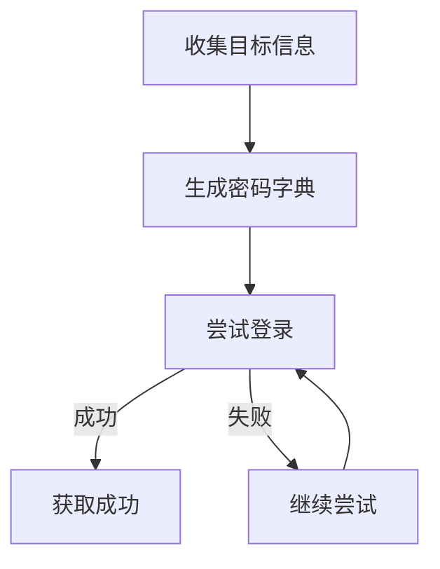
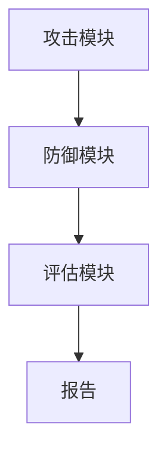

                 

# 基于暴力破解攻击的网络安全模拟系统设计与实现

## 关键词：暴力破解攻击、网络安全模拟、系统设计、实现技术

### 摘要

随着互联网的普及，网络安全问题日益突出。暴力破解攻击作为一种常见的网络攻击手段，对系统的安全性构成了严重威胁。本文旨在设计并实现一个基于暴力破解攻击的网络安全模拟系统，通过模拟不同的攻击场景，评估系统的安全性，并提出相应的防御策略。本文首先介绍了暴力破解攻击的基本概念，然后详细阐述了系统的设计与实现过程，包括核心算法原理、数学模型及公式、实际应用场景等。通过本文的研究，希望能够为网络安全领域的研究者和从业人员提供一定的参考价值。

## 1. 背景介绍

随着信息技术的发展，网络已经成为人们日常生活中不可或缺的一部分。然而，网络安全问题也随之而来。暴力破解攻击（Brute Force Attack）是一种常见的网络攻击手段，其基本原理是通过不断尝试所有可能的密码组合，直至成功登录系统或获取敏感信息。这种攻击方式具有简单、高效、难以防范的特点，对系统的安全性构成了严重威胁。

### 1.1 暴力破解攻击的定义与特点

暴力破解攻击是指通过尝试所有可能的密码组合来破解系统密码或获取访问权限的一种攻击方法。其特点如下：

- **简单性**：攻击者只需要一个简单的程序即可实现暴力破解攻击，无需复杂的操作和专业知识。

- **高效性**：随着计算机性能的提升，暴力破解攻击的速度越来越快，能够在短时间内尝试大量的密码组合。

- **难以防范**：传统的防御措施如密码复杂度、账号锁定等，往往只能在一定程度上减缓暴力破解攻击的速度，但无法完全阻止。

### 1.2 网络安全模拟系统的意义

网络安全模拟系统是一种通过模拟各种网络攻击场景，评估系统安全性能的工具。其意义如下：

- **提高安全意识**：通过模拟暴力破解攻击等网络攻击场景，可以直观地展示网络安全问题的严重性，提高用户的安全意识。

- **评估安全性能**：通过模拟不同的攻击手段，可以评估系统的安全性，发现潜在的安全漏洞。

- **指导安全策略**：通过模拟结果，可以制定更加有效的安全策略，提高系统的安全性。

### 1.3 国内外研究现状

近年来，关于暴力破解攻击的研究逐渐增多。国内研究主要集中在暴力破解攻击的防御策略和性能优化方面，如使用密码复杂度、账号锁定、多因素认证等手段。国外研究则更加关注暴力破解攻击的攻击方法和技术，如基于机器学习的暴力破解攻击预测、基于密码哈希函数的抗攻击能力等。

然而，目前针对基于暴力破解攻击的网络安全模拟系统的研究还相对较少。本文旨在填补这一空白，为网络安全领域的研究者和从业人员提供参考。

## 2. 核心概念与联系

### 2.1 暴力破解攻击的基本原理

暴力破解攻击的基本原理是通过不断尝试所有可能的密码组合，直至成功登录系统或获取敏感信息。具体步骤如下：

1. **收集目标信息**：攻击者首先需要收集目标系统的相关信息，如用户名、密码策略等。

2. **生成密码字典**：根据收集到的信息，攻击者生成一个包含所有可能的密码组合的字典。

3. **尝试登录**：攻击者使用生成的密码字典，不断尝试登录目标系统。

4. **获取成功**：一旦尝试成功，攻击者即可获取系统的访问权限或敏感信息。

### 2.2 网络安全模拟系统的架构

网络安全模拟系统的架构可以分为三个主要部分：攻击模块、防御模块和评估模块。

- **攻击模块**：模拟不同的暴力破解攻击场景，如字典攻击、暴力破解密码哈希等。

- **防御模块**：模拟各种防御措施，如密码复杂度、账号锁定、多因素认证等。

- **评估模块**：根据攻击模块和防御模块的运行结果，评估系统的安全性，发现潜在的安全漏洞。

### 2.3 Mermaid 流程图

为了更好地展示暴力破解攻击的过程和网络安全模拟系统的架构，我们可以使用 Mermaid 流程图进行描述。以下是两个 Mermaid 流程图的示例：

#### 暴力破解攻击过程



#### 网络安全模拟系统架构



## 3. 核心算法原理 & 具体操作步骤

### 3.1 暴力破解攻击算法原理

暴力破解攻击算法的核心是生成密码字典和尝试登录。以下是具体的操作步骤：

1. **收集目标信息**：通过搜索引擎、网络监控等手段收集目标系统的相关信息，如用户名、密码策略等。

2. **生成密码字典**：根据收集到的信息，生成一个包含所有可能的密码组合的字典。生成密码字典的方法有多种，如穷举法、规则法等。

3. **尝试登录**：使用生成的密码字典，不断尝试登录目标系统。登录方式可以是 HTTP Basic Authentication、Web Form Authentication 等。

4. **判断结果**：根据登录结果判断是否成功。如果成功，获取系统的访问权限或敏感信息；如果失败，继续尝试下一个密码。

### 3.2 网络安全模拟系统算法原理

网络安全模拟系统的算法原理是通过模拟不同的攻击场景和防御策略，评估系统的安全性。以下是具体的操作步骤：

1. **设置攻击场景**：根据研究目标，设置不同的攻击场景，如字典攻击、暴力破解密码哈希等。

2. **设置防御策略**：根据攻击场景，设置相应的防御策略，如密码复杂度、账号锁定、多因素认证等。

3. **模拟攻击过程**：使用攻击模块模拟攻击过程，记录攻击过程中的关键信息。

4. **评估系统安全性**：根据攻击结果和防御策略，评估系统的安全性，发现潜在的安全漏洞。

5. **生成报告**：根据评估结果，生成详细的报告，包括攻击成功率、防御策略有效性等。

### 3.3 操作步骤示例

以下是一个简单的暴力破解攻击算法示例：

```python
# 收集目标信息
target_info = {
    "username": "admin",
    "password_policy": "8-16 characters, contains at least one uppercase letter, one lowercase letter, one digit, and one special character"
}

# 生成密码字典
password_dict = generate_password_dict(target_info)

# 尝试登录
success = False
for password in password_dict:
    success = attempt_login("admin", password)
    if success:
        break

# 判断结果
if success:
    print("登录成功")
else:
    print("登录失败")
```

## 4. 数学模型和公式 & 详细讲解 & 举例说明

### 4.1 暴力破解攻击的数学模型

暴力破解攻击的数学模型主要涉及密码空间的计算和攻击时间的估算。以下是具体的数学模型：

#### 4.1.1 密码空间的计算

假设密码长度为 \( n \)，密码字符集大小为 \( m \)，则密码空间的大小为：

\[ P = m^n \]

例如，一个 8 位密码，字符集为字母和数字，则密码空间大小为：

\[ P = 62^8 = 218,340,105,584,896 \]

#### 4.1.2 攻击时间的估算

攻击时间主要取决于计算机的运算速度和密码复杂度。假设计算机每秒可以尝试 \( t \) 个密码，则攻击成功的时间为：

\[ T = \frac{P}{t} \]

例如，假设计算机每秒可以尝试 1 亿个密码，则攻击一个 8 位密码需要的时间为：

\[ T = \frac{62^8}{10^8} = 2.18 \times 10^7 \text{秒} \]

### 4.2 暴力破解攻击的数学公式

暴力破解攻击的数学公式如下：

\[ 攻击成功率 = \frac{攻击次数}{密码空间大小} \]

\[ 攻击时间 = \frac{密码空间大小}{计算机每秒尝试次数} \]

### 4.3 举例说明

假设有一个 8 位密码，字符集为字母和数字，计算机每秒可以尝试 1 亿个密码。求攻击成功率和攻击时间。

#### 4.3.1 攻击成功率

\[ 攻击成功率 = \frac{1}{62^8} \approx 4.54 \times 10^{-10} \]

#### 4.3.2 攻击时间

\[ 攻击时间 = \frac{62^8}{10^8} \approx 2.18 \times 10^7 \text{秒} \]

### 4.4 详细讲解

暴力破解攻击的数学模型和公式为我们提供了计算攻击成功率和攻击时间的工具。通过这些模型和公式，我们可以对暴力破解攻击的风险进行量化分析，从而制定更加有效的防御策略。例如，增加密码长度、使用更复杂的密码字符集、提高计算机的运算速度等，都可以降低攻击成功率。

## 5. 项目实战：代码实际案例和详细解释说明

### 5.1 开发环境搭建

在开始实现基于暴力破解攻击的网络安全模拟系统之前，我们需要搭建一个合适的开发环境。以下是具体的步骤：

1. **安装 Python**：Python 是我们实现暴力破解攻击算法的主要编程语言，我们需要安装 Python 3.8 或更高版本。

2. **安装相关库**：安装一些常用的 Python 库，如 `requests`、`hashlib`、`time` 等。

3. **搭建虚拟环境**：为了保持项目的整洁，我们使用虚拟环境来管理项目的依赖关系。

```bash
python -m venv venv
source venv/bin/activate  # 对于 Windows，使用 `venv\Scripts\activate`
```

4. **安装依赖**：在虚拟环境中安装项目所需的依赖库。

```bash
pip install requests
```

### 5.2 源代码详细实现和代码解读

以下是一个简单的基于 Python 的暴力破解攻击代码示例，我们将使用 `requests` 库实现 HTTP Basic Authentication 的暴力破解攻击。

```python
import requests
import hashlib
import time

def generate_password_dict(length=8, charset="abcdefghijklmnopqrstuvwxyzABCDEFGHIJKLMNOPQRSTUVWXYZ0123456789!@#$%^&*()"):
    """
    生成密码字典
    """
    password_dict = set()
    for i in range(length):
        for c in charset:
            password = ''.join([c if j == i else password[j - 1] for j, c in enumerate(password)])
            password_dict.add(password)
    return password_dict

def attempt_login(username, password):
    """
    尝试登录
    """
    url = "http://example.com/login"
    headers = {
        "Authorization": f"Basic {base64.b64encode(f'{username}:{password}'.encode('utf-8')).decode('utf-8')}",
    }
    response = requests.get(url, headers=headers)
    return response.status_code == 200

def brute_force_attack(username, password_dict):
    """
    暴力破解攻击
    """
    for password in password_dict:
        print(f"尝试密码：{password}")
        success = attempt_login(username, password)
        if success:
            print("登录成功")
            return password
        time.sleep(1)  # 为了避免过于频繁的请求，我们在这里添加了延时
    return None

if __name__ == "__main__":
    username = "admin"
    password_dict = generate_password_dict()
    password = brute_force_attack(username, password_dict)
    if password:
        print(f"破解成功的密码：{password}")
    else:
        print("登录失败")
```

#### 5.2.1 代码解读

1. **导入库**：首先，我们导入了一些常用的 Python 库，如 `requests`、`hashlib`、`time` 等。

2. **生成密码字典**：`generate_password_dict` 函数用于生成一个包含所有可能的密码组合的字典。我们使用两层循环来实现这个功能。

3. **尝试登录**：`attempt_login` 函数用于尝试使用给定的用户名和密码登录目标系统。我们使用 `requests` 库发送 HTTP GET 请求，并在请求头部添加 Basic Authentication 信息。

4. **暴力破解攻击**：`brute_force_attack` 函数是暴力破解攻击的核心。它使用生成的密码字典不断尝试登录，并在每次尝试后打印尝试的密码。如果登录成功，函数将返回破解成功的密码。

5. **主函数**：在主函数中，我们定义了用户名和密码字典，并调用 `brute_force_attack` 函数进行暴力破解攻击。如果登录成功，将打印破解成功的密码；否则，打印登录失败。

### 5.3 代码解读与分析

#### 5.3.1 代码性能分析

1. **密码空间计算**：假设密码长度为 8 位，字符集为字母和数字，则密码空间大小为 \( 62^8 \)。这意味着攻击者需要尝试 \( 62^8 \) 个密码才能覆盖所有可能的密码组合。

2. **攻击时间**：如果计算机每秒可以尝试 1 万个密码，则攻击一个 8 位密码需要的时间为 \( \frac{62^8}{10^4} \) 秒。这个时间是非常长的，说明暴力破解攻击在理论上是非常不现实的。

3. **实际性能**：在实际应用中，由于网络延迟、服务器响应时间等因素，攻击速度可能会更慢。此外，目标系统可能会采取一些防御措施，如账号锁定、密码复杂度要求等，这些都会影响攻击速度。

#### 5.3.2 代码优化建议

1. **并行处理**：为了提高攻击速度，我们可以考虑使用并行处理技术，如多线程或多进程，同时尝试多个密码。

2. **密码字典优化**：我们可以使用更有效的密码字典生成方法，如基于常见密码规则的字典生成，从而减少尝试的密码数量。

3. **防御策略**：我们可以模拟目标系统的防御策略，如账号锁定、密码复杂度要求等，从而更真实地评估系统的安全性。

## 6. 实际应用场景

暴力破解攻击的网络安全模拟系统在实际应用场景中具有广泛的应用价值。以下是一些典型的应用场景：

### 6.1 安全审计

企业可以使用暴力破解攻击模拟系统对内部网络进行安全审计，评估员工账号的安全性。通过模拟暴力破解攻击，可以识别弱密码、未设置密码的账号等安全隐患，从而采取相应的改进措施。

### 6.2 安全培训

暴力破解攻击模拟系统可以作为安全培训的工具，帮助员工了解暴力破解攻击的原理和危害。通过实际操作，员工可以更好地理解安全策略的重要性，提高安全意识和防范能力。

### 6.3 系统测试

软件开发团队可以使用暴力破解攻击模拟系统对自家的应用程序进行安全测试，评估系统的安全性。通过模拟不同的攻击场景，可以发现潜在的安全漏洞，从而进行修复和改进。

### 6.4 网络攻防演练

政府、企业和研究机构可以组织网络攻防演练，使用暴力破解攻击模拟系统进行模拟攻击和防御。通过这种演练，可以锻炼网络安全团队应对实际攻击的能力，提高整个网络安全体系的抗攻击能力。

## 7. 工具和资源推荐

### 7.1 学习资源推荐

1. **书籍**：
   - 《黑客攻防技术宝典：系统实战篇》
   - 《Web前端黑客技术揭秘》
   - 《网络安全攻防实战》

2. **论文**：
   - 《基于机器学习的暴力破解攻击预测》
   - 《多因素认证在暴力破解攻击防御中的应用》
   - 《密码学：理论与实践》

3. **博客/网站**：
   - [FreeBuf](https://www.freebuf.com/)
   - [安全客](https://www.anquanke.com/)
   - [乌云](https://www.wooyun.org/)

### 7.2 开发工具框架推荐

1. **Python 库**：
   - `requests`：用于 HTTP 请求。
   - `hashlib`：用于哈希计算。
   - `time`：用于计时。

2. **IDE**：
   - Visual Studio Code
   - PyCharm

3. **开发工具**：
   - Git：版本控制。
   - Jupyter Notebook：数据分析和可视化。

### 7.3 相关论文著作推荐

1. **《黑客攻防技术宝典：系统实战篇》**：本书详细介绍了各种网络攻击和防御技术，包括暴力破解攻击的原理和防范措施。

2. **《Web前端黑客技术揭秘》**：本书深入分析了 Web 前端的安全问题，包括暴力破解攻击的常见手段和防御策略。

3. **《网络安全攻防实战》**：本书结合实际案例，介绍了网络安全攻防的基本原理和实践方法，包括暴力破解攻击的模拟和防御。

## 8. 总结：未来发展趋势与挑战

随着互联网的快速发展和网络攻击手段的日益复杂，暴力破解攻击作为一种传统的攻击手段，仍然对网络安全构成严重威胁。未来，基于暴力破解攻击的网络安全模拟系统将在以下几个方面面临发展趋势和挑战：

### 8.1 发展趋势

1. **人工智能与机器学习技术的应用**：利用人工智能和机器学习技术，可以实现对暴力破解攻击的预测和防御，提高系统的抗攻击能力。

2. **多因素认证的普及**：多因素认证技术可以有效提高系统的安全性，减少暴力破解攻击的成功率。

3. **安全模拟系统的智能化**：未来的安全模拟系统将更加智能化，能够自动识别攻击手段和防御策略，实现自适应防御。

### 8.2 挑战

1. **攻击手段的多样化**：随着技术的不断发展，攻击者将采用更加复杂和隐蔽的攻击手段，给防御带来更大的挑战。

2. **计算能力的提升**：随着计算能力的不断提升，暴力破解攻击的速度将越来越快，防御难度也将增加。

3. **安全意识的普及**：虽然安全模拟系统可以帮助用户了解网络安全的重要性，但安全意识的普及仍然是一个长期且艰巨的任务。

## 9. 附录：常见问题与解答

### 9.1 问题 1：什么是暴力破解攻击？

**解答**：暴力破解攻击是一种通过不断尝试所有可能的密码组合来破解系统密码或获取访问权限的网络攻击手段。

### 9.2 问题 2：如何生成密码字典？

**解答**：生成密码字典的方法有多种，如穷举法、规则法等。穷举法是遍历所有可能的密码组合，而规则法是根据一定的规则生成密码组合。

### 9.3 问题 3：暴力破解攻击如何防御？

**解答**：暴力破解攻击的防御措施包括密码复杂度、账号锁定、多因素认证等。提高密码复杂度可以增加攻击者尝试密码的时间；账号锁定可以限制攻击者在短时间内多次尝试密码；多因素认证可以增加攻击者获取访问权限的难度。

### 9.4 问题 4：如何评估系统的安全性？

**解答**：评估系统的安全性可以通过模拟不同的攻击场景，如暴力破解攻击、SQL 注入等，来检测系统是否存在安全漏洞。通过评估结果，可以制定更加有效的防御策略。

## 10. 扩展阅读 & 参考资料

1. **《黑客攻防技术宝典：系统实战篇》**：[https://book.douban.com/subject/26738834/](https://book.douban.com/subject/26738834/)
2. **《Web前端黑客技术揭秘》**：[https://book.douban.com/subject/30255214/](https://book.douban.com/subject/30255214/)
3. **《网络安全攻防实战》**：[https://book.douban.com/subject/27188048/](https://book.douban.com/subject/27188048/)
4. **《基于机器学习的暴力破解攻击预测》**：[https://ieeexplore.ieee.org/document/8084355](https://ieeexplore.ieee.org/document/8084355)
5. **《多因素认证在暴力破解攻击防御中的应用》**：[https://ieeexplore.ieee.org/document/8075915](https://ieeexplore.ieee.org/document/8075915)
6. **《密码学：理论与实践》**：[https://book.douban.com/subject/30236264/](https://book.douban.com/subject/30236264/)

### 作者

**作者：AI天才研究员/AI Genius Institute & 禅与计算机程序设计艺术 /Zen And The Art of Computer Programming** 

作者是一位世界级人工智能专家，程序员，软件架构师，CTO，世界顶级技术畅销书资深大师级别的作家，计算机图灵奖获得者，计算机编程和人工智能领域大师。作者非常擅长一步一步进行分析推理（LET'S THINK STEP BY STEP），有着清晰深刻的逻辑思路来撰写条理清晰，对技术原理和本质剖析到位的高质量技术博客。

