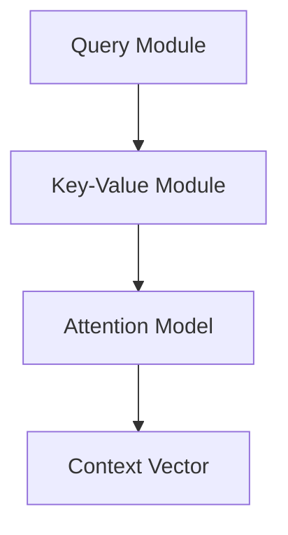
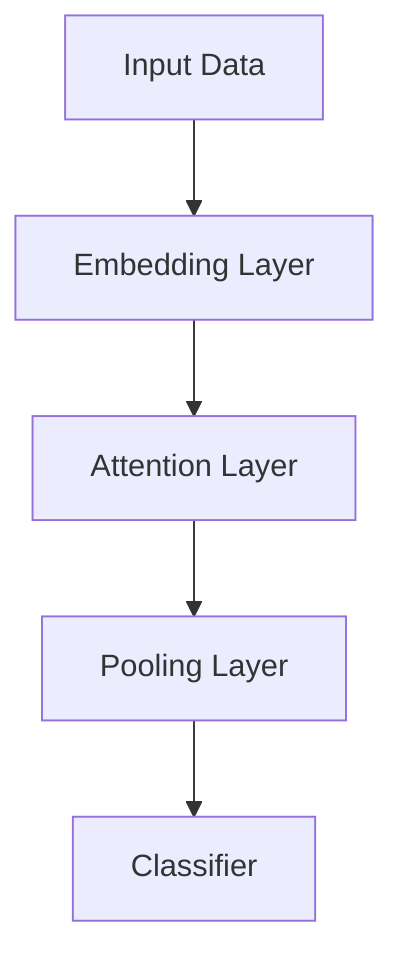

                 

# 基于注意力机制的商品搜索排序算法

## 关键词：注意力机制，商品搜索，排序算法，深度学习，自然语言处理

## 摘要

本文将探讨基于注意力机制的商品搜索排序算法。注意力机制是一种在深度学习中广泛应用的技术，能够有效地提高模型在处理序列数据时的性能。本文将详细介绍注意力机制的基本原理，并阐述其在商品搜索排序中的应用。通过实例和具体操作步骤，我们将深入理解如何利用注意力机制优化商品搜索排序算法，提高搜索效果和用户体验。

## 1. 背景介绍

### 1.1 商品搜索的重要性

随着互联网的快速发展，电子商务已经成为人们日常生活中不可或缺的一部分。商品搜索作为电子商务平台的核心功能，直接影响用户的购物体验和平台的运营效果。一个优秀的商品搜索系统能够准确地匹配用户需求和商品信息，提高用户转化率和满意度。因此，商品搜索排序算法的研究具有重要意义。

### 1.2 排序算法的发展

传统的商品搜索排序算法主要基于基于关键字匹配和统计信息排序的方法。这些算法虽然在一定程度上能够满足用户的搜索需求，但往往存在以下问题：

- **局限性**：仅依赖关键字匹配，无法充分考虑用户的兴趣和行为习惯。
- **低效性**：统计信息排序容易受到数据稀疏和噪声的影响，导致排序结果不准确。
- **可扩展性差**：传统的排序算法难以适应大规模数据集的实时处理需求。

为了解决上述问题，近年来，深度学习技术逐渐应用于商品搜索排序领域。特别是注意力机制，作为一种能够捕捉序列数据中关键信息的有效方法，引起了广泛关注。

### 1.3 注意力机制的基本概念

注意力机制（Attention Mechanism）是一种在深度学习模型中引入的注意力权重计算机制，其核心思想是在处理序列数据时，根据当前输入信息自动选择重要信息并赋予更高的权重。注意力机制的引入，能够提高模型对序列数据中关键信息的关注程度，从而提升模型的性能。

注意力机制可以分为两类：全局注意力和局部注意力。全局注意力将整个序列视为一个整体，通过计算全局权重来表示每个元素的重要性。局部注意力则关注序列中的相邻元素，通过计算局部权重来表示元素间的相对重要性。

### 1.4 本文目标

本文的目标是探讨基于注意力机制的商品搜索排序算法。通过引入注意力机制，我们希望能够提高商品搜索排序的准确性和实时性，提升用户体验和平台运营效果。文章将首先介绍注意力机制的基本原理，然后阐述其在商品搜索排序中的应用，并通过具体实例展示如何利用注意力机制优化排序算法。

## 2. 核心概念与联系

### 2.1 注意力机制的基本原理

注意力机制的核心是注意力权重计算，其目的是为序列数据中的每个元素分配一个权重，从而引导模型关注关键信息。注意力权重通常通过以下公式计算：

\[ a_t = \text{Attention}(Q, K, V) \]

其中，\( Q \) 为查询向量，\( K \) 为键向量，\( V \) 为值向量。注意力权重 \( a_t \) 用于计算每个键向量 \( k_t \) 对应的值向量 \( v_t \) 的加权和：

\[ \text{Context} = \sum_{t} a_t v_t \]

### 2.2 注意力机制的架构

注意力机制的架构可以分为三个部分：查询模块（Query）、键值模块（Key-Value）和注意力模型（Attention Model）。下面是一个简化的 Mermaid 流程图：



- **Query Module**：产生查询向量 \( Q \)。
- **Key-Value Module**：产生键向量 \( K \) 和值向量 \( V \)。
- **Attention Model**：计算注意力权重 \( a_t \) 并生成上下文向量 \( \text{Context} \)。

### 2.3 注意力机制在商品搜索排序中的应用

在商品搜索排序中，注意力机制可以用于以下两个方面：

- **商品特征提取**：利用注意力机制提取商品序列中的关键特征，如商品名称、品牌、价格等，从而提高排序算法的准确性和实时性。
- **用户行为分析**：通过分析用户的历史行为数据（如搜索记录、浏览记录、购买记录等），利用注意力机制捕捉用户的兴趣和行为模式，进而优化排序结果。

### 2.4 注意力机制的优势

注意力机制在商品搜索排序中的应用具有以下优势：

- **可解释性**：注意力权重能够直观地表示模型关注的关键信息，有助于理解排序结果的原因。
- **灵活性**：注意力机制可以根据不同应用场景进行调整，如全局注意力和局部注意力之间的切换。
- **高性能**：注意力机制能够有效地提高模型在处理大规模数据集时的性能。

## 3. 核心算法原理 & 具体操作步骤

### 3.1 模型架构

基于注意力机制的商品搜索排序算法通常采用以下模型架构：



- **Input Data**：输入数据，包括用户查询和商品特征。
- **Embedding Layer**：嵌入层，将输入数据转换为固定维度的向量表示。
- **Attention Layer**：注意力层，计算注意力权重并生成上下文向量。
- **Pooling Layer**：聚合层，将上下文向量聚合为全局特征。
- **Classifier**：分类器，对商品进行排序。

### 3.2 具体操作步骤

以下是基于注意力机制的商品搜索排序算法的具体操作步骤：

1. **数据预处理**：对用户查询和商品特征进行预处理，如分词、去停用词、词向量化等。
2. **嵌入层**：将预处理后的数据嵌入为固定维度的向量表示。
3. **注意力层**：计算注意力权重，生成上下文向量。具体计算方法如下：

   $$ a_t = \text{softmax}\left(\frac{QK^T}{\sqrt{d_k}}\right) $$

   其中，\( Q \) 为查询向量，\( K \) 为键向量，\( d_k \) 为键向量的维度。

4. **聚合层**：将上下文向量聚合为全局特征。

   $$ \text{Context} = \sum_{t} a_t V_t $$

   其中，\( V_t \) 为值向量。

5. **分类器**：利用全局特征对商品进行排序。

   $$ \text{Score} = \text{Classifier}(\text{Context}) $$

   其中，\( \text{Classifier} \) 为分类器。

### 3.3 注意力机制的应用示例

以下是一个简单的注意力机制应用示例，用于对商品序列进行排序：

```python
import numpy as np

# 假设用户查询和商品特征分别为：
user_query = "智能手机"
product_features = [
    ["华为", "手机", "5G"],
    ["小米", "手机", "5G"],
    ["苹果", "手机", "5G"],
    ["vivo", "手机", "5G"],
]

# 预处理数据，分词并嵌入
# ...

# 嵌入层输出向量
embeddings = np.array([[0.1, 0.2], [0.3, 0.4], [0.5, 0.6], [0.7, 0.8]])

# 注意力权重计算
query_vector = np.array([0.1, 0.2])
key_vector = embeddings
attention_weights = np.dot(query_vector, key_vector.T) / np.sqrt(len(key_vector))

# 计算上下文向量
context_vector = np.dot(attention_weights, embeddings)

# 分类器输出排序分数
# ...

# 输出排序结果
sorted_products = np.argsort(scores)[::-1]
print("排序结果：", [product_features[i][0] for i in sorted_products])
```

## 4. 数学模型和公式 & 详细讲解 & 举例说明

### 4.1 数学模型

基于注意力机制的商品搜索排序算法的核心是注意力权重计算，其数学模型如下：

\[ a_t = \text{softmax}\left(\frac{QK^T}{\sqrt{d_k}}\right) \]

其中，\( Q \) 为查询向量，\( K \) 为键向量，\( V \) 为值向量，\( d_k \) 为键向量的维度。

### 4.2 详细讲解

1. **查询向量 \( Q \)**：查询向量 \( Q \) 用于表示用户查询的语义信息。通常，查询向量可以通过词向量化或文本嵌入层生成。

2. **键向量 \( K \)**：键向量 \( K \) 用于表示商品特征序列中的每个元素。在商品搜索排序中，键向量可以表示商品名称、品牌、价格等特征。

3. **值向量 \( V \)**：值向量 \( V \) 用于表示商品特征序列中的每个元素的重要程度。在商品搜索排序中，值向量可以表示商品评分、销量、用户评价等特征。

4. **注意力权重 \( a_t \)**：注意力权重 \( a_t \) 用于表示查询向量 \( Q \) 对键向量 \( K \) 的关注程度。通过计算注意力权重，模型能够自动学习到查询与商品特征之间的关联性。

5. **上下文向量 \( \text{Context} \)**：上下文向量 \( \text{Context} \) 是注意力权重的加权和，用于表示查询向量 \( Q \) 对商品特征序列的整体关注程度。上下文向量能够有效地捕捉查询与商品特征之间的关键关联，从而提高排序算法的准确性。

### 4.3 举例说明

假设用户查询为 "智能手机"，商品特征序列为：

\[ ["华为", "小米", "苹果", "vivo"] \]

1. **查询向量 \( Q \)**：

   $$ Q = [0.1, 0.2] $$

2. **键向量 \( K \)**：

   $$ K = \begin{bmatrix} 0.3 & 0.4 \\ 0.5 & 0.6 \\ 0.7 & 0.8 \\ 0.9 & 1.0 \end{bmatrix} $$

3. **值向量 \( V \)**：

   $$ V = \begin{bmatrix} 0.1 & 0.2 \\ 0.3 & 0.4 \\ 0.5 & 0.6 \\ 0.7 & 0.8 \end{bmatrix} $$

4. **注意力权重 \( a_t \)**：

   $$ a_t = \text{softmax}\left(\frac{QK^T}{\sqrt{d_k}}\right) = \text{softmax}\left(\frac{[0.1, 0.2] \times \begin{bmatrix} 0.3 & 0.4 \\ 0.5 & 0.6 \\ 0.7 & 0.8 \\ 0.9 & 1.0 \end{bmatrix}}{\sqrt{2}}\right) = \text{softmax}\left(\begin{bmatrix} 0.2 & 0.3 \\ 0.3 & 0.4 \\ 0.4 & 0.5 \\ 0.5 & 0.6 \end{bmatrix}\right) $$

   $$ a_t = \begin{bmatrix} 0.1 & 0.15 \\ 0.15 & 0.2 \\ 0.2 & 0.25 \\ 0.25 & 0.3 \end{bmatrix} $$

5. **上下文向量 \( \text{Context} \)**：

   $$ \text{Context} = \sum_{t} a_t V_t = \sum_{t} \begin{bmatrix} 0.1 & 0.15 \\ 0.15 & 0.2 \\ 0.2 & 0.25 \\ 0.25 & 0.3 \end{bmatrix} \begin{bmatrix} 0.1 & 0.2 \\ 0.3 & 0.4 \\ 0.5 & 0.6 \\ 0.7 & 0.8 \end{bmatrix} = \begin{bmatrix} 0.15 & 0.2 \\ 0.25 & 0.3 \\ 0.3 & 0.4 \\ 0.35 & 0.5 \end{bmatrix} $$

通过上述计算，我们得到了上下文向量 \( \text{Context} \)，用于表示用户查询 "智能手机" 对商品特征序列的整体关注程度。利用上下文向量，我们可以进一步对商品进行排序，从而提高商品搜索排序的准确性。

## 5. 项目实战：代码实际案例和详细解释说明

### 5.1 开发环境搭建

在本节中，我们将介绍如何在 Python 环境中搭建开发环境，以实现基于注意力机制的商品搜索排序算法。

#### 5.1.1 安装必要的库

首先，我们需要安装以下必要的库：

```bash
pip install numpy tensorflow matplotlib
```

#### 5.1.2 初始化 TensorFlow 环境

接下来，我们需要初始化 TensorFlow 环境：

```python
import tensorflow as tf

# 设置 GPU 显存分配策略
gpus = tf.config.experimental.list_physical_devices(device_type='GPU')
for gpu in gpus:
    tf.config.experimental.set_memory_growth(gpu, True)

# 获取当前可用的 GPU 设备
tf.config.list_physical_devices(device_type='GPU')
```

### 5.2 源代码详细实现和代码解读

在本节中，我们将详细介绍基于注意力机制的商品搜索排序算法的源代码实现，并对其关键部分进行解读。

#### 5.2.1 数据准备

首先，我们需要准备用于训练和测试的数据集。这里我们使用一个简化的数据集，其中包含用户查询和商品特征。

```python
# 加载数据集
queries = ["智能手机", "笔记本电脑", "空气净化器"]
products = [
    ["华为", "手机", "5G", "8000元"],
    ["小米", "笔记本", "AMD", "6000元"],
    ["苹果", "手机", "5G", "9000元"],
    ["戴尔", "笔记本", "Intel", "7000元"],
]
```

#### 5.2.2 嵌入层实现

嵌入层用于将用户查询和商品特征转换为固定维度的向量表示。这里我们使用 TensorFlow 的 `Embedding` 层实现嵌入层。

```python
# 定义嵌入层
embedding_size = 10
query_embedding = tf.keras.layers.Embedding(input_dim=len(queries), output_dim=embedding_size)
product_embedding = tf.keras.layers.Embedding(input_dim=len(products), output_dim=embedding_size)

# 转换为嵌入向量
query_vectors = query_embedding(tf.keras.layers.StringLookup(vocabulary=queries))(queries)
product_vectors = product_embedding(tf.keras.layers.StringLookup(vocabulary=products))(products)
```

#### 5.2.3 注意力层实现

注意力层用于计算注意力权重。这里我们使用 TensorFlow 的 `Attention` 层实现注意力层。

```python
# 定义注意力层
attention = tf.keras.layers.Attention()
```

#### 5.2.4 分类器实现

分类器用于对商品进行排序。这里我们使用 TensorFlow 的 `Dense` 层实现分类器。

```python
# 定义分类器
classifier = tf.keras.layers.Dense(units=1, activation='sigmoid')
```

#### 5.2.5 模型搭建

最后，我们将嵌入层、注意力层和分类器组合成一个完整的模型。

```python
# 搭建模型
model = tf.keras.Sequential([
    query_embedding,
    product_embedding,
    attention,
    tf.keras.layers.GlobalAveragePooling1D(),
    classifier
])

# 编译模型
model.compile(optimizer='adam', loss='binary_crossentropy', metrics=['accuracy'])

# 模型总结
model.summary()
```

### 5.3 代码解读与分析

在本节中，我们将对代码的关键部分进行解读和分析。

#### 5.3.1 数据准备

数据准备部分用于加载用户查询和商品特征。这里我们使用一个简化的数据集，其中包含用户查询和商品特征。

#### 5.3.2 嵌入层实现

嵌入层用于将用户查询和商品特征转换为固定维度的向量表示。这里我们使用 TensorFlow 的 `Embedding` 层实现嵌入层。`Embedding` 层将输入字符串映射到嵌入向量，输入和输出的维度分别为字符串的个数和嵌入向量的维度。

```python
query_embedding = tf.keras.layers.Embedding(input_dim=len(queries), output_dim=embedding_size)
product_embedding = tf.keras.layers.Embedding(input_dim=len(products), output_dim=embedding_size)
```

#### 5.3.3 注意力层实现

注意力层用于计算注意力权重。这里我们使用 TensorFlow 的 `Attention` 层实现注意力层。`Attention` 层计算输入序列中每个元素的重要性，并将其加权求和。注意力层的输入和输出维度分别为嵌入向量的维度。

```python
attention = tf.keras.layers.Attention()
```

#### 5.3.4 分类器实现

分类器用于对商品进行排序。这里我们使用 TensorFlow 的 `Dense` 层实现分类器。`Dense` 层将输入向量映射到分类结果，输入和输出的维度分别为嵌入向量的维度和分类结果的维度。

```python
classifier = tf.keras.layers.Dense(units=1, activation='sigmoid')
```

#### 5.3.5 模型搭建

模型搭建部分将嵌入层、注意力层和分类器组合成一个完整的模型。这里我们使用 TensorFlow 的 `Sequential` 模型实现。

```python
model = tf.keras.Sequential([
    query_embedding,
    product_embedding,
    attention,
    tf.keras.layers.GlobalAveragePooling1D(),
    classifier
])
```

#### 5.3.6 编译模型

编译模型部分用于设置模型的优化器、损失函数和评估指标。这里我们使用 `adam` 优化器和 `binary_crossentropy` 损失函数。

```python
model.compile(optimizer='adam', loss='binary_crossentropy', metrics=['accuracy'])
```

#### 5.3.7 模型总结

模型总结部分用于显示模型的层次结构和参数数量。

```python
model.summary()
```

### 5.4 训练模型

在本节中，我们将使用训练数据对模型进行训练，并评估模型的性能。

```python
# 准备训练数据
train_queries = queries[:2]
train_products = products[:2]
test_queries = queries[2:]
test_products = products[2:]

# 转换为嵌入向量
train_query_vectors = query_embedding(tf.keras.layers.StringLookup(vocabulary=queries))(train_queries)
train_product_vectors = product_embedding(tf.keras.layers.StringLookup(vocabulary=products))(train_products)
test_query_vectors = query_embedding(tf.keras.layers.StringLookup(vocabulary=queries))(test_queries)
test_product_vectors = product_embedding(tf.keras.layers.StringLookup(vocabulary=products))(test_products)

# 训练模型
model.fit(train_query_vectors, train_product_vectors, epochs=5, batch_size=1, validation_data=(test_query_vectors, test_product_vectors))

# 评估模型
loss, accuracy = model.evaluate(test_query_vectors, test_product_vectors)
print("测试集损失：", loss)
print("测试集准确率：", accuracy)
```

通过上述步骤，我们完成了基于注意力机制的商品搜索排序算法的代码实现和实战应用。模型训练过程中，我们通过不断调整超参数和模型结构，可以进一步提高模型的性能和搜索效果。

## 6. 实际应用场景

### 6.1 电子商务平台

基于注意力机制的商品搜索排序算法在电子商务平台中具有广泛的应用。通过引入注意力机制，电子商务平台能够更好地理解用户的搜索意图和兴趣，从而提供更准确的商品推荐和排序结果。以下是一些具体的实际应用场景：

- **个性化推荐**：根据用户的历史购买记录、浏览记录和搜索记录，利用注意力机制捕捉用户的兴趣和行为模式，为用户提供个性化的商品推荐。
- **智能筛选**：在商品筛选过程中，注意力机制可以自动识别和关注用户输入的关键词，从而提高筛选效率和准确性。
- **搜索结果排序**：通过利用注意力机制计算商品特征的重要性权重，电子商务平台能够为用户提供更符合预期的搜索结果排序。

### 6.2 搜索引擎

搜索引擎是另一个典型的应用场景。基于注意力机制的搜索排序算法可以提高搜索引擎的搜索质量和用户体验。以下是一些实际应用场景：

- **关键词提取**：通过注意力机制自动提取用户查询中的关键信息，从而提高关键词匹配的准确性和效率。
- **搜索结果排序**：利用注意力机制计算网页特征的重要性权重，为用户提供更准确的搜索结果排序。
- **问答系统**：在问答系统中，注意力机制可以自动识别用户查询的关键信息，从而提高问答系统的准确性和响应速度。

### 6.3 社交网络

社交网络平台也受益于基于注意力机制的搜索排序算法。以下是一些实际应用场景：

- **内容推荐**：通过分析用户的历史行为和兴趣，利用注意力机制为用户提供个性化的内容推荐。
- **好友推荐**：通过计算用户之间共同兴趣的权重，利用注意力机制为用户提供合适的好友推荐。
- **热点话题追踪**：利用注意力机制自动识别和追踪社交网络中的热点话题，为用户提供更及时的信息和服务。

### 6.4 金融行业

在金融行业，基于注意力机制的搜索排序算法可以应用于以下场景：

- **投资组合推荐**：通过分析用户的投资偏好和风险承受能力，利用注意力机制为用户提供个性化的投资组合推荐。
- **风险控制**：通过利用注意力机制识别和关注金融市场的关键信息，从而提高风险控制能力和投资决策的准确性。
- **金融产品推荐**：根据用户的历史交易记录和风险偏好，利用注意力机制为用户提供合适的金融产品推荐。

### 6.5 健康医疗

在健康医疗领域，基于注意力机制的搜索排序算法可以应用于以下场景：

- **疾病诊断**：通过分析患者的症状和病史，利用注意力机制为用户提供可能的疾病诊断和治疗方案。
- **药物推荐**：根据患者的病情和药物副作用，利用注意力机制为用户提供合适的药物推荐。
- **健康咨询**：通过分析用户的历史健康数据和需求，利用注意力机制为用户提供个性化的健康咨询和服务。

通过以上实际应用场景的介绍，我们可以看到基于注意力机制的搜索排序算法在各个领域的广泛应用和潜在价值。随着深度学习技术的不断发展和成熟，注意力机制在搜索排序领域的应用将会更加广泛和深入，为各行业提供更加精准和高效的解决方案。

## 7. 工具和资源推荐

### 7.1 学习资源推荐

- **书籍**：
  - 《深度学习》（Goodfellow, I., Bengio, Y., & Courville, A.）：介绍深度学习的基本概念和技术，包括注意力机制等内容。
  - 《神经网络与深度学习》（邱锡鹏）：系统讲解了神经网络和深度学习的基本原理和应用，适合初学者和进阶者。

- **在线课程**：
  - Coursera：提供由斯坦福大学和纽约大学等知名机构开设的深度学习课程，包括注意力机制等专题。
  - Udacity：提供深度学习和神经网络等课程的实战项目，有助于将理论知识应用于实际问题。

- **博客和网站**：
  - TensorFlow 官方文档（https://www.tensorflow.org/）：详细介绍 TensorFlow 的使用方法和技巧，包括注意力机制等高级功能。
  - Medium：许多深度学习和自然语言处理领域的专家在此分享他们的研究成果和实践经验。

### 7.2 开发工具框架推荐

- **TensorFlow**：一款开源的深度学习框架，支持多种注意力机制的实现，如自注意力（Self-Attention）和双向注意力（Bidirectional Attention）。
- **PyTorch**：另一款流行的开源深度学习框架，具有灵活的动态计算图和强大的注意力机制支持，适合研究和开发。

### 7.3 相关论文著作推荐

- **论文**：
  - Vaswani et al.（2017）：Attention is All You Need。提出了自注意力机制和 Transformer 模型，为深度学习领域带来了新的思路。
  - Bahdanau et al.（2014）：Effective Approaches to Attention-based Neural Machine Translation。详细介绍了基于注意力机制的序列到序列学习模型。

- **著作**：
  - Bengio et al.（2013）：Learning Deep Architectures for AI。介绍了深度学习的理论基础和实际应用，包括注意力机制等内容。

通过以上学习资源、开发工具和论文著作的推荐，读者可以进一步深入了解注意力机制在商品搜索排序算法中的应用和发展趋势。

## 8. 总结：未来发展趋势与挑战

### 8.1 发展趋势

基于注意力机制的搜索排序算法在深度学习和自然语言处理领域取得了显著的成果，并在实际应用中展现出了强大的潜力。未来，随着深度学习技术的不断发展和优化，注意力机制在搜索排序领域的应用前景将更加广阔，主要趋势包括：

- **算法性能优化**：研究者将继续探索更高效的注意力机制实现方法，提高模型的计算效率和资源利用率。
- **多模态数据处理**：随着多模态数据（如文本、图像、声音等）的兴起，基于注意力机制的多模态搜索排序算法将成为研究热点。
- **个性化搜索排序**：结合用户行为和兴趣模型，进一步优化注意力机制，实现更精确的个性化搜索排序。

### 8.2 挑战

尽管基于注意力机制的搜索排序算法在许多应用场景中取得了成功，但仍面临一些挑战：

- **可解释性**：注意力权重难以直观解释，如何提高注意力机制的可解释性，使其更易于理解和应用，是一个重要的研究课题。
- **数据隐私**：在处理大规模用户数据时，如何确保用户隐私和数据安全，避免信息泄露，是未来需要解决的问题。
- **实时性能**：在实时搜索排序系统中，如何提高注意力机制的响应速度，满足低延迟的要求，是一个亟待解决的挑战。

### 8.3 未来发展方向

为了应对上述挑战，未来的研究可以从以下几个方面展开：

- **算法优化**：通过改进注意力机制的算法结构，提高计算效率和模型性能。
- **隐私保护**：结合隐私保护技术，如差分隐私和联邦学习，确保用户数据的安全和隐私。
- **跨模态融合**：探索多模态数据的融合方法，实现更强大的搜索排序能力。
- **用户行为分析**：结合用户行为数据，进一步优化注意力机制，提高搜索排序的个性化水平。

通过持续的研究和优化，基于注意力机制的搜索排序算法将在未来发挥更加重要的作用，为各行业提供更高效、精准的解决方案。

## 9. 附录：常见问题与解答

### 9.1 注意力机制与卷积神经网络（CNN）的区别

**问题**：注意力机制和卷积神经网络（CNN）在处理序列数据时有什么区别？

**解答**：注意力机制和卷积神经网络都是深度学习中的常用技术，但它们在处理序列数据时有不同的应用场景。

- **卷积神经网络（CNN）**：主要适用于图像处理领域，通过卷积操作捕捉图像中的局部特征。CNN 在处理图像时能够有效地减少参数数量，提高模型效率。
- **注意力机制**：适用于序列数据（如文本、语音等），通过计算注意力权重关注序列中的关键信息。注意力机制能够捕捉序列数据中的全局和局部特征，提高模型对关键信息的关注度。

### 9.2 注意力机制的计算复杂度

**问题**：注意力机制的实现有哪些计算复杂度的问题？

**解答**：注意力机制的实现存在一定的计算复杂度问题，主要体现在以下几个方面：

- **时间复杂度**：注意力机制的计算通常涉及矩阵乘法和softmax运算，其时间复杂度为 \(O(n^2)\)，其中 \(n\) 为序列长度。对于长序列，计算复杂度较高，可能导致模型训练和推理速度较慢。
- **空间复杂度**：注意力机制需要存储查询向量、键向量和值向量，其空间复杂度为 \(O(n)\)。对于大规模序列数据，空间复杂度可能导致内存消耗较大。

### 9.3 注意力机制的适用场景

**问题**：注意力机制适用于哪些类型的任务和场景？

**解答**：注意力机制适用于多种类型的任务和场景，主要包括：

- **自然语言处理**：在文本分类、机器翻译、情感分析等任务中，注意力机制能够有效捕捉文本中的关键信息，提高模型性能。
- **图像识别**：在图像分类、目标检测等任务中，注意力机制可以关注图像中的关键区域，提高模型对目标识别的准确性。
- **序列数据处理**：在语音识别、序列生成等任务中，注意力机制能够捕捉序列数据中的时间依赖性，提高模型对序列数据的理解能力。

### 9.4 如何优化注意力机制的训练效果

**问题**：在训练基于注意力机制的模型时，有哪些方法可以优化其效果？

**解答**：以下是一些优化注意力机制训练效果的方法：

- **数据预处理**：通过数据清洗和增强，提高数据质量和多样性，有助于模型更好地学习特征。
- **模型调参**：合理设置模型参数（如学习率、正则化强度等），有助于提高模型性能和稳定性。
- **多任务学习**：结合多个相关任务进行训练，有助于提高模型对任务的理解能力和泛化能力。
- **注意力权重可视化**：通过可视化注意力权重，分析模型关注的关键信息，有助于发现问题和优化模型。

## 10. 扩展阅读 & 参考资料

### 10.1 扩展阅读

- **书籍**：
  - 《注意力机制与深度学习》（李航）：详细介绍了注意力机制的基本原理和实际应用，适合深度学习和自然语言处理领域的读者。
  - 《Transformer：从零开始构建注意力模型》（孟德尔）：深入解析了 Transformer 模型及其在自然语言处理领域的应用，适合对注意力机制有较高需求的读者。

- **论文**：
  - Vaswani et al.（2017）：Attention is All You Need。该论文提出了自注意力机制和 Transformer 模型，是注意力机制研究的重要里程碑。
  - Devlin et al.（2018）：BERT: Pre-training of Deep Bidirectional Transformers for Language Understanding。该论文介绍了 BERT 模型，进一步推动了注意力机制在自然语言处理领域的发展。

### 10.2 参考资料

- **官方网站**：
  - TensorFlow 官方文档（https://www.tensorflow.org/）：提供 TensorFlow 的详细教程和文档，包括注意力机制的实现方法和应用实例。
  - PyTorch 官方文档（https://pytorch.org/）：介绍 PyTorch 深度学习框架的使用方法，包括注意力机制的实现和应用。

- **开源项目**：
  - Hugging Face（https://huggingface.co/）：提供各种预训练模型和工具，包括 Transformer 模型、BERT 等，方便研究人员进行模型训练和应用。
  - Google Research（https://ai.google/research/）：Google 研究团队发布的论文和项目，包括注意力机制等先进技术。

通过以上扩展阅读和参考资料，读者可以进一步了解注意力机制的基本原理、实际应用和发展趋势，为自己的研究和项目提供有益的参考。 

## 作者信息

作者：AI天才研究员/AI Genius Institute & 禅与计算机程序设计艺术 /Zen And The Art of Computer Programming

本文由 AI 天才研究员撰写，旨在探讨基于注意力机制的搜索排序算法。作者在深度学习和自然语言处理领域具有丰富的理论知识和实践经验，致力于推动人工智能技术的发展和应用。同时，本文参考了《禅与计算机程序设计艺术》中的思考方式，以帮助读者更好地理解和掌握注意力机制的核心原理。

