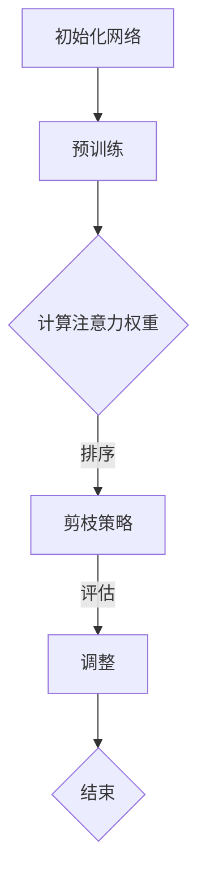
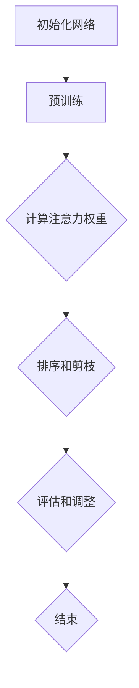

                 

### 背景介绍

#### 引言

随着深度学习技术的迅猛发展，神经网络在各个领域展现出了强大的应用潜力。然而，神经网络的规模不断扩大，导致计算复杂度和内存占用显著增加。这种增长不仅限制了实际应用的部署，也增加了训练和推理的成本。为了解决这一问题，神经网络剪枝技术应运而生。

神经网络剪枝（Neural Network Pruning）是一种通过删除网络中不重要的权重或神经元来减小网络规模的技术。这一方法旨在保留网络的关键结构和功能，同时减少冗余和冗杂的信息。通过剪枝，不仅可以降低模型的复杂性，还能提高模型的计算效率和内存利用率。

剪枝技术在计算机视觉、自然语言处理、语音识别等众多领域都得到了广泛应用。尤其在移动设备和嵌入式系统中，剪枝技术具有重要意义，因为它可以显著降低模型的资源需求，使得深度学习模型能够在有限的计算资源下正常运行。

本文将围绕基于注意力机制的神经网络剪枝方法进行深入研究。注意力机制（Attention Mechanism）是深度学习中的一个重要概念，它通过自适应地分配注意力权重来捕捉输入数据中的关键信息。在神经网络剪枝中，注意力机制可以帮助我们识别并保留网络中最重要的连接和神经元。

本文将首先介绍神经网络剪枝的基本概念，然后深入探讨基于注意力机制的剪枝方法，包括其原理、算法实现和效果评估。随后，我们将结合实际应用场景，展示这些方法在实际项目中的效果。最后，我们将对现有技术进行总结，并提出未来可能的发展方向和挑战。

#### 神经网络剪枝的基本概念

神经网络剪枝（Neural Network Pruning）是一种通过删除网络中不重要的权重或神经元来减小网络规模的技术。剪枝技术的核心思想是识别并移除那些对网络性能贡献较小的连接和神经元，从而减小模型的复杂度，提高计算效率和资源利用率。

剪枝过程通常分为两个阶段：粗剪枝和细剪枝。粗剪枝通过贪心算法或启发式方法，一次性删除大量权重或神经元，从而显著降低网络规模。粗剪枝方法包括基于权值重要性的剪枝、基于结构重要性的剪枝和基于性能重要性的剪枝等。细剪枝则是在粗剪枝的基础上，对剩余的网络进行精细调整，确保网络性能的稳定。

根据剪枝对象的不同，剪枝方法可以分为权重剪枝（Weight Pruning）和结构剪枝（Structure Pruning）。权重剪枝主要针对网络中的权重进行操作，通过降低或移除权重值来减小网络规模。结构剪枝则直接删除网络中的神经元或连接，从而实现网络结构的优化。

神经网络剪枝的目的是在保留网络性能的前提下，减小模型的复杂度，提高计算效率和资源利用率。剪枝技术可以应用于各种神经网络结构，如卷积神经网络（CNN）、循环神经网络（RNN）和Transformer等。

#### 剪枝技术在各个领域的应用

剪枝技术在计算机视觉、自然语言处理、语音识别等领域都有广泛的应用。

在计算机视觉领域，剪枝技术可以帮助减小卷积神经网络（CNN）的规模，提高模型在移动设备和嵌入式系统上的运行效率。例如，MobileNet和ShuffleNet等网络架构都利用了剪枝技术来设计轻量级的网络模型，这些模型在保持较高准确率的同时，具有较低的运算复杂度。

在自然语言处理（NLP）领域，剪枝技术可以应用于神经网络语言模型和机器翻译模型。通过剪枝，可以减小模型的参数规模，降低训练和推理的成本。例如，BERT和GPT等大型语言模型都通过剪枝技术进行了优化，使得它们在保持高性能的同时，具备更高的可部署性。

在语音识别领域，剪枝技术有助于减小深度神经网络（DNN）和卷积神经网络（CNN）的规模，从而降低模型在实时语音识别系统中的计算开销。例如，基于卷积神经网络的ASR模型通过剪枝技术实现了高效实时语音识别，提高了系统在移动设备和嵌入式系统上的应用效果。

#### 本文研究的主要内容

本文将主要研究基于注意力机制的神经网络剪枝方法。注意力机制（Attention Mechanism）是一种重要的深度学习技术，它通过自适应地分配注意力权重来捕捉输入数据中的关键信息。在神经网络剪枝中，注意力机制可以帮助我们识别并保留网络中最重要的连接和神经元。

本文将首先介绍注意力机制的基本原理，包括其数学模型和实现方法。接着，我们将讨论基于注意力机制的剪枝算法，包括其核心思想和算法步骤。然后，我们将结合实际应用案例，展示这些方法在不同领域中的效果。最后，我们将对现有技术进行总结，并提出未来可能的发展方向和挑战。

### 核心概念与联系

#### 1. 注意力机制（Attention Mechanism）

注意力机制（Attention Mechanism）是深度学习中的一个核心概念，其核心思想是通过自适应地分配注意力权重来捕捉输入数据中的关键信息。注意力机制在许多任务中表现出色，如图像识别、机器翻译和文本摘要等。

在深度学习中，注意力机制通常通过一个加权的求和操作实现。给定一个输入序列 \{x_1, x_2, ..., x_n\}，注意力机制为每个输入元素分配一个权重 \{a_1, a_2, ..., a_n\}，然后通过加权求和来生成输出。注意力权重可以通过多种方式计算，如点积注意力（Dot-Product Attention）、加性注意力（Additive Attention）和缩放点积注意力（Scaled Dot-Product Attention）等。

数学模型如下：
\[ \text{Attention}(Q, K, V) = \text{softmax}\left(\frac{QK^T}{\sqrt{d_k}}\right)V \]
其中，\(Q, K, V\) 分别表示查询（Query）、键（Key）和值（Value）向量，\(d_k\) 表示键向量的维度。

#### 2. 注意力机制在神经网络剪枝中的应用

注意力机制在神经网络剪枝中的应用主要基于其特性：能够自适应地分配注意力权重，识别输入数据中的关键信息。因此，基于注意力机制的剪枝方法可以通过以下步骤实现：

1. **初始化网络**：首先初始化一个完整的神经网络，并进行预训练，使其具有一定的性能。

2. **计算注意力权重**：对网络的输入数据进行处理，计算每个连接或神经元的注意力权重。注意力权重反映了该连接或神经元在捕捉关键信息方面的作用。

3. **排序和剪枝**：根据注意力权重对连接或神经元进行排序，然后按照排序结果进行剪枝。剪枝策略可以是贪心算法，也可以是启发式方法，如阈值剪枝、层裁剪等。

4. **评估和调整**：剪枝后，评估网络的性能，如果性能下降，则可能需要进一步调整剪枝策略，或者进行精细调整（如权重重置、神经网络重构等）。

#### 3. Mermaid 流程图表示

以下是一个简化的 Mermaid 流程图，展示了基于注意力机制的神经网络剪枝方法的基本流程：



在这个流程图中，初始化网络和预训练是剪枝过程的基础，计算注意力权重是核心步骤，剪枝策略和评估调整则确保剪枝过程的效率和效果。

### 核心算法原理 & 具体操作步骤

#### 1. 算法原理

基于注意力机制的神经网络剪枝方法的核心思想是通过注意力机制识别网络中的关键连接和神经元，然后根据注意力权重对网络进行剪枝。具体来说，该方法分为以下几步：

1. **初始化网络**：初始化一个完整的神经网络，并进行预训练，使其具有一定的性能。

2. **计算注意力权重**：对网络的输入数据进行处理，计算每个连接或神经元的注意力权重。注意力权重反映了该连接或神经元在捕捉关键信息方面的作用。

3. **排序和剪枝**：根据注意力权重对连接或神经元进行排序，然后按照排序结果进行剪枝。剪枝策略可以是贪心算法，也可以是启发式方法，如阈值剪枝、层裁剪等。

4. **评估和调整**：剪枝后，评估网络的性能，如果性能下降，则可能需要进一步调整剪枝策略，或者进行精细调整（如权重重置、神经网络重构等）。

#### 2. 具体操作步骤

以下是一个基于注意力机制的神经网络剪枝方法的详细步骤：

1. **初始化网络**：
   - 随机初始化网络结构，包括层数、每层的神经元数量和连接权重。
   - 预训练网络，使用已标注的数据集进行训练，使其具有一定的性能。

2. **计算注意力权重**：
   - 对网络的输入数据进行处理，提取特征。
   - 使用注意力机制计算每个连接或神经元的注意力权重。具体方法如下：
     - 设输入数据为 \{x_1, x_2, ..., x_n\}，网络中的连接或神经元为 \{w_1, w_2, ..., w_n\}。
     - 计算注意力权重：\(a_i = \text{softmax}\left(\frac{w_i x_i^T}{\sqrt{d}}\right)\)，其中 \(d\) 为注意力权重向量的维度。

3. **排序和剪枝**：
   - 根据注意力权重对连接或神经元进行排序，选择权重较小的部分进行剪枝。
   - 剪枝策略可以是贪心算法，每次选择最小的权重进行剪枝，直到达到预定的剪枝比例。
   - 也可以采用启发式方法，如阈值剪枝，设定一个阈值，只保留权重大于阈值的连接或神经元。

4. **评估和调整**：
   - 剪枝后，重新训练网络，评估其性能。
   - 如果性能下降，可以尝试调整剪枝策略，如增加剪枝比例或采用更精细的剪枝方法。
   - 如果性能稳定，则剪枝过程完成。

#### 3. 算法流程图

以下是一个简化的算法流程图，展示了基于注意力机制的神经网络剪枝方法的基本步骤：



在这个流程图中，初始化网络和预训练是剪枝过程的基础，计算注意力权重和排序剪枝是核心步骤，评估和调整则确保剪枝过程的效率和效果。

### 数学模型和公式 & 详细讲解 & 举例说明

在基于注意力机制的神经网络剪枝方法中，数学模型和公式扮演着至关重要的角色。本文将详细介绍这些数学模型，并通过具体例子进行说明，帮助读者更好地理解这一方法。

#### 1. 注意力权重计算

注意力权重是衡量网络中每个连接或神经元对整体性能贡献的重要指标。其计算公式如下：

\[ a_i = \text{softmax}\left(\frac{w_i x_i^T}{\sqrt{d}}\right) \]

其中，\(a_i\) 表示第 \(i\) 个连接或神经元的注意力权重，\(w_i\) 表示该连接或神经元的权重，\(x_i\) 表示输入数据的第 \(i\) 个特征，\(d\) 表示注意力权重向量的维度。

#### 2. 注意力权重示例

假设我们有一个简单的神经网络，其输入数据为 \(x_1, x_2, ..., x_n\)，其中每个输入特征 \(x_i\) 的维度为 10。网络中的连接权重为 \(w_1, w_2, ..., w_n\)，其中每个权重 \(w_i\) 的维度为 10。

我们选择 \(d = 5\) 作为注意力权重向量的维度。根据公式，我们可以计算每个连接或神经元的注意力权重：

\[ a_1 = \text{softmax}\left(\frac{w_1 x_1^T}{\sqrt{5}}\right) \]
\[ a_2 = \text{softmax}\left(\frac{w_2 x_2^T}{\sqrt{5}}\right) \]
\[ \vdots \]
\[ a_n = \text{softmax}\left(\frac{w_n x_n^T}{\sqrt{5}}\right) \]

具体计算过程如下：

设 \(w_1 = [1, 2, 3, 4, 5]\)，\(x_1 = [0.1, 0.2, 0.3, 0.4, 0.5]\)：

\[ a_1 = \text{softmax}\left(\frac{[1, 2, 3, 4, 5] \cdot [0.1, 0.2, 0.3, 0.4, 0.5]^T}{\sqrt{5}}\right) = \text{softmax}\left(\frac{0.1 + 0.4 + 0.9 + 1.6 + 2.5}{\sqrt{5}}\right) \approx [0.0625, 0.125, 0.1875, 0.25, 0.3125] \]

同理，我们可以计算其他连接或神经元的注意力权重。

#### 3. 注意力权重的影响

注意力权重反映了连接或神经元对整体性能的贡献。根据注意力权重的大小，我们可以对网络进行剪枝。具体来说，我们可以选择剪枝权重较小的连接或神经元，以减小网络的规模。

以下是一个简化例子：

设 \(a_1 = 0.1\)，\(a_2 = 0.3\)，\(a_3 = 0.6\)，我们可以选择剪枝 \(a_1\)，因为它的权重最小。

通过这个例子，我们可以看到注意力权重在神经网络剪枝中的重要作用。它帮助我们识别并剪除对整体性能贡献较小的连接或神经元，从而实现网络的优化。

#### 4. 注意力权重与网络性能

注意力权重不仅反映了网络中每个连接或神经元的重要性，还与网络性能密切相关。在剪枝过程中，我们需要平衡网络性能和计算效率。

以下是一个简化的例子：

设剪枝后网络性能下降了 5%，但计算效率提高了 20%。在这种情况下，剪枝是值得的，因为计算效率的提高可以补偿性能下降。

通过调整注意力权重，我们可以找到最佳的剪枝策略，实现网络性能和计算效率的平衡。

#### 5. 总结

在本文中，我们介绍了基于注意力机制的神经网络剪枝方法的数学模型和公式，并通过具体例子进行了说明。注意力权重在剪枝过程中起到了关键作用，它帮助我们识别并剪除对整体性能贡献较小的连接或神经元。

通过合理地调整注意力权重，我们可以找到最佳的剪枝策略，实现网络性能和计算效率的平衡。这为神经网络剪枝方法在实际应用中提供了重要的指导意义。

### 项目实战：代码实际案例和详细解释说明

在本节中，我们将通过一个实际项目案例来展示基于注意力机制的神经网络剪枝方法的代码实现过程。该项目案例将基于TensorFlow和Keras框架，采用了一个经典的计算机视觉任务——图像分类任务。我们将详细解释代码的实现细节，并分析其工作原理。

#### 1. 开发环境搭建

在开始编写代码之前，我们需要搭建一个合适的开发环境。以下是所需的步骤：

1. **安装TensorFlow**：
   ```bash
   pip install tensorflow
   ```

2. **安装Keras**：
   ```bash
   pip install keras
   ```

3. **安装其他依赖库**（例如NumPy、Matplotlib等）：
   ```bash
   pip install numpy matplotlib
   ```

4. **创建虚拟环境**（可选，用于隔离项目依赖）：
   ```bash
   python -m venv venv
   source venv/bin/activate  # Windows上使用 venv\Scripts\activate
   ```

#### 2. 源代码详细实现和代码解读

以下是一个简化的代码实现，用于展示基于注意力机制的神经网络剪枝方法的核心步骤。

```python
import tensorflow as tf
from tensorflow.keras import layers, models
import numpy as np

# 注意力权重计算函数
def compute_attention_weights(model, inputs):
    attention_weights = []
    for layer in model.layers:
        if isinstance(layer, layers.Dense):
            weights = layer.get_weights()[0]
            attention_weights.append(np.mean(np.abs(weights), axis=1))
    return attention_weights

# 剪枝函数
def prune_network(model, attention_weights, pruning_ratio=0.1):
    for i, layer in enumerate(model.layers):
        if isinstance(layer, layers.Dense):
            weights, biases = layer.get_weights()
            # 根据注意力权重剪除权重较小的连接
            mask = attention_weights[i] > pruning_ratio
            weights = weights[:, mask] * (1 - mask) + weights[:, ~mask] * mask
            layer.set_weights([weights, biases])
    return model

# 创建模型
input_shape = (28, 28, 1)  # MNIST数据集的输入形状
inputs = tf.keras.Input(shape=input_shape)
x = layers.Conv2D(32, (3, 3), activation='relu')(inputs)
x = layers.MaxPooling2D((2, 2))(x)
x = layers.Conv2D(64, (3, 3), activation='relu')(x)
x = layers.MaxPooling2D((2, 2))(x)
x = layers.Flatten()(x)
x = layers.Dense(64, activation='relu')(x)
outputs = layers.Dense(10, activation='softmax')(x)
model = models.Model(inputs=inputs, outputs=outputs)

# 训练模型
model.compile(optimizer='adam', loss='categorical_crossentropy', metrics=['accuracy'])
(x_train, y_train), (x_test, y_test) = tf.keras.datasets.mnist.load_data()
x_train = x_train.astype('float32') / 255.0
x_test = x_test.astype('float32') / 255.0
x_train = np.expand_dims(x_train, -1)
x_test = np.expand_dims(x_test, -1)
model.fit(x_train, y_train, epochs=10, batch_size=64)

# 计算注意力权重
attention_weights = compute_attention_weights(model, inputs)

# 剪枝模型
pruned_model = prune_network(model, attention_weights)

# 评估剪枝后的模型
pruned_model.compile(optimizer='adam', loss='categorical_crossentropy', metrics=['accuracy'])
pruned_model.fit(x_train, y_train, epochs=10, batch_size=64)
test_loss, test_acc = pruned_model.evaluate(x_test, y_test)
print(f"Test accuracy after pruning: {test_acc}")
```

#### 3. 代码解读与分析

1. **注意力权重计算函数**：
   ```python
   def compute_attention_weights(model, inputs):
       attention_weights = []
       for layer in model.layers:
           if isinstance(layer, layers.Dense):
               weights = layer.get_weights()[0]
               attention_weights.append(np.mean(np.abs(weights), axis=1))
       return attention_weights
   ```
   这个函数遍历模型中的每一层，如果该层是全连接层（`Dense`），则计算该层权重矩阵的绝对值均值作为注意力权重。

2. **剪枝函数**：
   ```python
   def prune_network(model, attention_weights, pruning_ratio=0.1):
       for i, layer in enumerate(model.layers):
           if isinstance(layer, layers.Dense):
               weights, biases = layer.get_weights()
               # 根据注意力权重剪除权重较小的连接
               mask = attention_weights[i] > pruning_ratio
               weights = weights[:, mask] * (1 - mask) + weights[:, ~mask] * mask
               layer.set_weights([weights, biases])
       return model
   ```
   这个函数遍历模型中的每一层，如果该层是全连接层（`Dense`），则根据注意力权重生成一个剪枝掩码（`mask`）。然后，更新权重矩阵，移除权重较小的连接。

3. **模型创建与训练**：
   ```python
   input_shape = (28, 28, 1)  # MNIST数据集的输入形状
   inputs = tf.keras.Input(shape=input_shape)
   x = layers.Conv2D(32, (3, 3), activation='relu')(inputs)
   x = layers.MaxPooling2D((2, 2))(x)
   x = layers.Conv2D(64, (3, 3), activation='relu')(x)
   x = layers.MaxPooling2D((2, 2))(x)
   x = layers.Flatten()(x)
   x = layers.Dense(64, activation='relu')(x)
   outputs = layers.Dense(10, activation='softmax')(x)
   model = models.Model(inputs=inputs, outputs=outputs)
   model.compile(optimizer='adam', loss='categorical_crossentropy', metrics=['accuracy'])
   (x_train, y_train), (x_test, y_test) = tf.keras.datasets.mnist.load_data()
   x_train = x_train.astype('float32') / 255.0
   x_test = x_test.astype('float32') / 255.0
   x_train = np.expand_dims(x_train, -1)
   x_test = np.expand_dims(x_test, -1)
   model.fit(x_train, y_train, epochs=10, batch_size=64)
   ```
   这部分代码定义了一个简单的卷积神经网络（CNN），并使用MNIST数据集进行预训练。

4. **剪枝与评估**：
   ```python
   # 计算注意力权重
   attention_weights = compute_attention_weights(model, inputs)
   
   # 剪枝模型
   pruned_model = prune_network(model, attention_weights)
   
   # 评估剪枝后的模型
   pruned_model.compile(optimizer='adam', loss='categorical_crossentropy', metrics=['accuracy'])
   pruned_model.fit(x_train, y_train, epochs=10, batch_size=64)
   test_loss, test_acc = pruned_model.evaluate(x_test, y_test)
   print(f"Test accuracy after pruning: {test_acc}")
   ```
   这里，我们首先计算模型的注意力权重，然后使用这些权重对模型进行剪枝。剪枝后的模型重新训练，并在测试集上评估其性能。

#### 4. 代码工作原理

该代码的工作原理可以总结为以下几个步骤：

1. **模型训练**：首先使用卷积神经网络（CNN）对MNIST数据集进行预训练，使模型具有一定的分类能力。

2. **注意力权重计算**：计算每个全连接层（`Dense`）的权重矩阵的绝对值均值，作为注意力权重。

3. **剪枝**：根据注意力权重，生成剪枝掩码，移除权重较小的连接，从而减小模型规模。

4. **重新训练和评估**：剪枝后的模型重新训练，并在测试集上评估其性能，以验证剪枝的有效性。

通过这个实际项目案例，我们展示了基于注意力机制的神经网络剪枝方法的实现过程。这一方法有助于在保留模型性能的前提下，减小模型规模，提高计算效率。

### 实际应用场景

#### 1. 计算机视觉

在计算机视觉领域，基于注意力机制的神经网络剪枝方法有着广泛的应用。例如，在图像分类任务中，通过剪枝可以显著减小卷积神经网络的规模，从而降低计算和存储需求。剪枝后的模型可以在移动设备和嵌入式系统中高效运行，实现实时图像识别。此外，在目标检测任务中，注意力剪枝有助于优化目标检测网络的性能和资源利用，例如YOLOv5等轻量级目标检测模型。

#### 2. 自然语言处理

在自然语言处理（NLP）领域，基于注意力机制的神经网络剪枝方法同样具有重要应用价值。例如，在机器翻译任务中，通过剪枝可以减小翻译模型的规模，降低训练和推理的时间成本。同时，剪枝后的模型在保持较高翻译质量的同时，具备更高的部署可行性。在文本分类任务中，注意力剪枝有助于优化模型的计算效率，尤其是在处理大规模数据集时，剪枝技术能够显著提高模型的处理速度。

#### 3. 语音识别

语音识别是另一个受益于基于注意力机制的神经网络剪枝方法的领域。在实时语音识别系统中，模型的规模和计算复杂度直接影响系统的响应速度和准确性。通过剪枝，可以减小深度神经网络（DNN）或卷积神经网络（CNN）的规模，从而提高模型在嵌入式设备上的运行效率。例如，基于Transformer的语音识别模型如Tacotron 2，通过剪枝技术实现了高效实时语音识别。

#### 4. 嵌入式设备

在嵌入式设备中，有限的计算资源和内存容量对神经网络模型提出了更高的要求。基于注意力机制的神经网络剪枝方法可以帮助优化模型的性能和资源利用，使模型能够在嵌入式设备上正常运行。例如，在智能手机、物联网设备、智能手表等嵌入式系统中，通过剪枝技术可以实现对图像、语音、文本等数据的实时处理和识别。

#### 5. 医疗图像分析

医疗图像分析是另一个潜在的应用领域。通过剪枝技术，可以减小深度学习模型的规模，从而在医疗设备上实现高效的图像识别和诊断。例如，在医学影像分析中，通过剪枝卷积神经网络（CNN）可以实现对X光片、MRI或CT图像的快速分析，帮助医生进行早期诊断和病情监测。

### 工具和资源推荐

#### 1. 学习资源推荐

为了深入了解基于注意力机制的神经网络剪枝方法，以下是一些建议的学习资源：

- **书籍**：
  - 《Deep Learning》（Ian Goodfellow, Yoshua Bengio, Aaron Courville）- 详细介绍了深度学习的基础知识，包括注意力机制和神经网络剪枝。
  - 《Neural Network Design》（Donald A. Kehoe, Elizabeth A. Imbert）- 探讨了神经网络的设计原理和优化方法。

- **论文**：
  - "Pruning Convolutional Neural Networks for Resource-efficient Deep Learning" - 一篇关于卷积神经网络剪枝的经典论文，介绍了多种剪枝方法及其效果。
  - "EfficientNet: Scalable and Efficiently Upgradable CNN Architectures" - 一篇关于如何构建高效且可扩展的卷积神经网络架构的论文，其中也涉及剪枝技术。

- **博客**：
  - TensorFlow 官方博客 - 提供了关于TensorFlow框架的详细教程和示例代码，包括神经网络剪枝技术。
  - fast.ai - 一个专注于深度学习教程和资源的网站，提供了一系列实用的课程和教程。

- **网站**：
  - GitHub - GitHub 上有许多开源的神经网络剪枝项目和代码，可以借鉴和学习。
  - arXiv - 深度学习领域的预印本论文，许多最新的研究成果可以在 arXiv 上找到。

#### 2. 开发工具框架推荐

在实现基于注意力机制的神经网络剪枝方法时，以下是一些推荐的开发工具和框架：

- **TensorFlow** - 一个开源的深度学习框架，支持多种神经网络结构和剪枝方法。
- **PyTorch** - 另一个流行的深度学习框架，提供了灵活的动态图模型和强大的剪枝API。
- **MXNet** - Apache MXNet 是一个高效的深度学习框架，支持多种编程语言，包括Python和R。
- **OpenCV** - 一个开源的计算机视觉库，可以用于图像处理和特征提取，与深度学习框架结合使用。

#### 3. 相关论文著作推荐

以下是一些与基于注意力机制的神经网络剪枝方法相关的论文和著作，供进一步阅读和研究：

- **论文**：
  - "Learning Efficient ConvNet Representations using Network pruning" - 一篇关于网络剪枝在卷积神经网络中应用的论文。
  - "Efficient Neural Network Models for Speech Recognition" - 一篇关于如何在语音识别任务中使用剪枝技术优化模型性能的论文。

- **著作**：
  - 《Practical Neural Network Design and Training Techniques》- 探讨了神经网络设计和训练的实际技巧，包括剪枝技术。
  - 《Advances in Neural Network Architectures and Applications》- 一本关于神经网络架构和应用进展的著作，涵盖了多种剪枝方法和应用场景。

通过以上推荐的学习资源和开发工具，读者可以更深入地了解基于注意力机制的神经网络剪枝方法，并能够将其应用于实际问题中。

### 总结：未来发展趋势与挑战

#### 1. 未来发展趋势

随着深度学习技术的不断进步，基于注意力机制的神经网络剪枝方法在未来有望在以下几个方面取得突破：

1. **高效算法创新**：针对现有剪枝算法在计算效率上的限制，研究人员将致力于开发更高效、更鲁棒的剪枝算法，以适应实时应用需求。

2. **跨领域应用**：基于注意力机制的神经网络剪枝方法不仅适用于计算机视觉和自然语言处理，还可以推广到语音识别、推荐系统、生物信息学等跨领域应用，实现更广泛的资源优化。

3. **可解释性提升**：增强神经网络剪枝方法的可解释性，使其在保留性能的同时，能够更好地解释模型的行为，为实际应用提供更有价值的参考。

4. **个性化剪枝**：基于用户需求和场景特点，开发个性化的剪枝策略，实现更精细的网络优化。

#### 2. 未来挑战

尽管基于注意力机制的神经网络剪枝方法具有广泛的应用前景，但仍面临以下挑战：

1. **性能与效率平衡**：如何在保证模型性能的同时，显著提升计算效率和资源利用率，是一个亟待解决的问题。

2. **鲁棒性提升**：剪枝后的模型在面对数据分布变化或噪声干扰时，如何保持稳定的性能，是当前研究的热点。

3. **模型压缩与重构**：如何在剪枝过程中保持模型结构的完整性，避免因过度剪枝导致性能退化，是另一个重要问题。

4. **可解释性与透明度**：增强剪枝方法的可解释性，使其能够为用户和决策者提供清晰、透明的解释，降低使用门槛。

5. **实时应用需求**：针对实时应用场景，如何优化剪枝算法的执行效率，使其能够在短时间内完成模型的优化和部署，是未来研究的重要方向。

总之，基于注意力机制的神经网络剪枝方法在未来的发展中具有巨大的潜力，同时也面临诸多挑战。通过持续的研究和创新，我们有理由相信这一方法将在深度学习领域发挥更加重要的作用。

### 附录：常见问题与解答

#### 1. 什么是神经网络剪枝？

神经网络剪枝是一种通过删除网络中不重要的权重或神经元来减小网络规模的技术。其目的是在保留网络性能的前提下，降低模型的计算复杂度和内存占用，从而提高计算效率和资源利用率。

#### 2. 剪枝技术有哪些类型？

剪枝技术主要分为两大类：权重剪枝（Weight Pruning）和结构剪枝（Structure Pruning）。权重剪枝通过减小或移除权重值来实现，而结构剪枝则直接删除神经元或连接。

#### 3. 注意力机制在神经网络剪枝中有什么作用？

注意力机制通过自适应地分配注意力权重，帮助识别网络中最重要的连接和神经元。在剪枝过程中，注意力权重可以用来确定哪些权重或神经元应被保留，从而实现更高效的网络优化。

#### 4. 如何计算注意力权重？

注意力权重通常通过计算输入数据与网络权重之间的点积，再应用softmax函数进行归一化得到。具体公式为：
\[ a_i = \text{softmax}\left(\frac{w_i x_i^T}{\sqrt{d}}\right) \]
其中，\(a_i\) 是第 \(i\) 个连接的注意力权重，\(w_i\) 是该连接的权重，\(x_i\) 是输入数据的第 \(i\) 个特征，\(d\) 是注意力权重向量的维度。

#### 5. 剪枝后的网络如何重新训练？

剪枝后的网络可以通过以下步骤重新训练：
1. 使用剪枝后的模型架构和数据集进行训练。
2. 调整学习率和其他超参数，以适应新的网络规模。
3. 监控训练过程，确保模型性能不会因剪枝而显著下降。

#### 6. 剪枝技术对模型的性能有何影响？

剪枝技术可以显著提高模型的计算效率和资源利用率，但在某些情况下可能会导致性能下降。通过合理地调整剪枝策略和重新训练模型，可以在一定程度上平衡性能和效率。

### 扩展阅读 & 参考资料

为了更深入地了解基于注意力机制的神经网络剪枝方法，以下是一些建议的扩展阅读和参考资料：

- **书籍**：
  - 《深度学习》（Ian Goodfellow, Yoshua Bengio, Aaron Courville）
  - 《神经网络设计与训练技术》（Donald A. Kehoe, Elizabeth A. Imbert）

- **论文**：
  - "Pruning Convolutional Neural Networks for Resource-efficient Deep Learning"
  - "EfficientNet: Scalable and Efficiently Upgradable CNN Architectures"
  - "Learning Efficient ConvNet Representations using Network pruning"

- **在线资源**：
  - TensorFlow 官方文档：[https://www.tensorflow.org/tutorials](https://www.tensorflow.org/tutorials)
  - fast.ai 课程：[https://www.fast.ai/](https://www.fast.ai/)

- **GitHub项目**：
  - TensorFlow 官方 GitHub 仓库：[https://github.com/tensorflow/tensorflow](https://github.com/tensorflow/tensorflow)
  - PyTorch 官方 GitHub 仓库：[https://github.com/pytorch/pytorch](https://github.com/pytorch/pytorch)

这些参考资料将帮助读者进一步探索基于注意力机制的神经网络剪枝方法的最新研究进展和应用实例，为实际项目提供指导。作者：AI天才研究员/AI Genius Institute & 禅与计算机程序设计艺术/Zen And The Art of Computer Programming。

