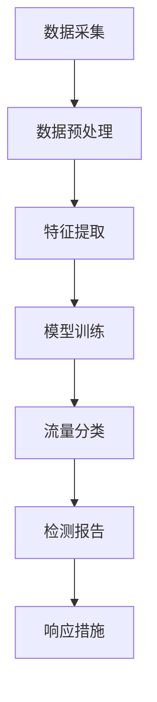

                 

### 背景介绍

随着互联网技术的飞速发展，网络安全问题日益凸显。入侵检测系统（Intrusion Detection System，IDS）作为网络安全的关键组成部分，承担着实时监控网络流量、识别和响应潜在威胁的重要职责。传统的入侵检测系统大多基于规则匹配和统计方法，尽管在一定程度上能够检测出部分攻击行为，但在面对复杂、隐蔽的攻击时，其检测效果往往不尽如人意。

近年来，随着深度学习技术的崛起，基于深度学习的入侵检测系统逐渐成为研究热点。深度学习凭借其强大的特征提取和模式识别能力，为入侵检测提供了新的思路和方法。本文将围绕基于深度学习的入侵检测系统展开讨论，首先介绍入侵检测系统的基本概念，随后阐述深度学习在入侵检测中的应用，并探讨其优势和挑战。

入侵检测系统的核心目标是实时监控网络流量，识别并报告潜在的安全威胁。为了实现这一目标，入侵检测系统通常包括以下几个关键组件：

1. **数据采集**：从网络流量中捕获数据包，提取相关信息，如源IP地址、目的IP地址、端口号、协议类型等。
2. **预处理**：对采集到的数据进行清洗、归一化等处理，使其适合用于深度学习模型训练。
3. **特征提取**：从预处理后的数据中提取能够反映网络流量特征的关键信息，如流量速率、连接持续时间、数据包分布等。
4. **检测与分类**：使用训练好的深度学习模型对网络流量进行检测和分类，判断其是否属于正常流量或恶意流量。
5. **响应**：对于检测到的恶意流量，入侵检测系统会采取相应的措施，如封锁IP地址、隔离受感染的主机等。

传统的入侵检测系统主要基于规则匹配和统计方法。规则匹配方法通过预定义的规则库对网络流量进行分析，一旦发现匹配的规则，即可判定为攻击。这种方法在一定程度上能够检测出已知的攻击行为，但对于未知的或复杂的新型攻击，其检测效果有限。统计方法通过分析网络流量的统计特征，如平均值、方差等，判断其是否异常。虽然这种方法具有一定的鲁棒性，但在处理高维数据时，其效果往往较差。

相比之下，基于深度学习的入侵检测系统具有以下几个显著优势：

1. **自动特征提取**：深度学习模型能够自动从原始数据中提取出有用的特征，减少人工干预，提高检测效果。
2. **高维数据处理**：深度学习模型能够在高维数据空间中找到潜在的模式和关联，从而更好地识别复杂的攻击行为。
3. **自适应性和可扩展性**：深度学习模型能够通过不断训练和优化，适应不断变化的安全威胁环境，具有较好的自适应性和可扩展性。

尽管深度学习在入侵检测领域展现出了巨大的潜力，但同时也面临着一些挑战：

1. **数据隐私**：入侵检测系统需要对大量网络流量数据进行处理，涉及用户隐私信息。如何保护用户隐私，避免数据泄露，是深度学习入侵检测系统需要解决的重要问题。
2. **计算资源消耗**：深度学习模型通常需要大量的计算资源和时间进行训练和推理，这对于实时性要求较高的入侵检测系统来说，是一个亟待解决的难题。
3. **模型解释性**：深度学习模型具有较强的黑盒特性，其内部机制难以解释，这对于需要快速响应和安全决策的应用场景来说，是一个挑战。

综上所述，基于深度学习的入侵检测系统在解决传统方法无法应对的复杂攻击方面具有显著优势，但同时也面临着一系列挑战。在接下来的章节中，我们将深入探讨深度学习在入侵检测中的应用，详细分析其核心算法原理，并探讨其在实际应用中的实现方法和策略。

### 核心概念与联系

#### 深度学习基础

深度学习（Deep Learning）是机器学习（Machine Learning）的一个重要分支，其核心思想是通过构建多层的神经网络（Neural Networks）来模拟人类大脑的学习过程。深度学习模型由多个层级组成，每一层级都负责提取更高层次的特征，从而实现对复杂数据的高效处理。以下是深度学习的一些基本概念：

1. **神经元（Neuron）**：深度学习的基本计算单元，类似于生物神经元。每个神经元接收多个输入信号，通过激活函数产生输出。
2. **层（Layer）**：深度学习模型由输入层、隐藏层和输出层组成。输入层接收原始数据，隐藏层通过权重（weights）和偏置（bias）进行特征提取和变换，输出层产生最终的预测结果。
3. **激活函数（Activation Function）**：用于确定神经元是否激活的函数，常见的激活函数包括sigmoid、ReLU和tanh等。
4. **前向传播（Forward Propagation）**：将输入数据传递通过神经网络，逐层计算每个神经元的输出值。
5. **反向传播（Backpropagation）**：通过计算损失函数的梯度，反向更新网络的权重和偏置，以优化模型的性能。
6. **损失函数（Loss Function）**：用于衡量模型预测值与真实值之间的差距，常用的损失函数包括均方误差（MSE）和交叉熵（Cross-Entropy）等。

#### 入侵检测系统

入侵检测系统（IDS）是一种网络安全技术，用于实时监控网络流量，检测并响应潜在的安全威胁。IDS主要分为两类：基于特征的方法和基于异常的方法。

1. **基于特征的方法**：这种方法通过预定义的规则库或模式匹配来检测已知的攻击行为。一旦发现匹配的规则，即可判定为攻击。该方法对于已知攻击的检测效果较好，但面对新型攻击时，检测效果有限。
2. **基于异常的方法**：这种方法通过分析网络流量的统计特征，识别与正常行为显著偏离的流量，判定为异常行为。该方法能够检测未知或复杂的攻击行为，但其误报率相对较高。

#### 深度学习在入侵检测中的应用

深度学习在入侵检测中的应用主要体现在以下几个方面：

1. **自动特征提取**：传统的入侵检测系统需要人工设计特征，而深度学习模型能够自动从原始数据中提取出有用的特征，减少人工干预，提高检测效果。
2. **高维数据处理**：深度学习模型能够在高维数据空间中找到潜在的模式和关联，从而更好地识别复杂的攻击行为。
3. **分类与检测**：深度学习模型能够对网络流量进行分类和检测，判断其是否属于正常流量或恶意流量。
4. **自适应性和可扩展性**：深度学习模型能够通过不断训练和优化，适应不断变化的安全威胁环境，具有较好的自适应性和可扩展性。

#### Mermaid 流程图

以下是一个基于深度学习的入侵检测系统的 Mermaid 流程图，展示了从数据采集到检测与响应的整个过程。



- **数据采集**：从网络流量中捕获数据包，提取相关信息。
- **数据预处理**：对采集到的数据进行清洗、归一化等处理。
- **特征提取**：从预处理后的数据中提取能够反映网络流量特征的关键信息。
- **模型训练**：使用预处理后的数据训练深度学习模型。
- **流量分类**：使用训练好的模型对网络流量进行分类和检测。
- **检测报告**：生成检测报告，报告检测结果和潜在威胁。
- **响应措施**：根据检测报告采取相应的响应措施，如封锁IP地址、隔离受感染的主机等。

通过上述核心概念和联系的介绍，我们为后续的深入探讨和实现奠定了基础。在接下来的章节中，我们将详细分析深度学习在入侵检测中的核心算法原理，并探讨其实际应用中的实现方法和策略。

### 核心算法原理 & 具体操作步骤

#### 深度学习模型选择

在入侵检测系统中，选择合适的深度学习模型至关重要。常见的深度学习模型包括卷积神经网络（Convolutional Neural Networks，CNN）、循环神经网络（Recurrent Neural Networks，RNN）和长短期记忆网络（Long Short-Term Memory，LSTM）等。以下是这些模型的简要介绍及其在入侵检测中的应用：

1. **卷积神经网络（CNN）**：
   - **原理**：CNN 是一种专门用于处理图像数据的神经网络，其核心是卷积层（Convolutional Layer），能够通过卷积运算自动提取图像特征。
   - **应用**：CNN 可以有效提取网络流量中的时间序列特征，如图像中的边缘、纹理等信息，从而提高入侵检测的准确率。

2. **循环神经网络（RNN）**：
   - **原理**：RNN 是一种能够处理序列数据的神经网络，其核心是隐藏状态（Hidden State），能够保存历史信息。
   - **应用**：RNN 在处理连续的网络流量数据时具有优势，可以捕捉到数据之间的时序关系，从而提高入侵检测的鲁棒性。

3. **长短期记忆网络（LSTM）**：
   - **原理**：LSTM 是 RNN 的一个变种，能够解决 RNN 中长期依赖问题，其核心是记忆单元（Memory Cell）和三个门控（Input Gate、Forget Gate 和 Output Gate）。
   - **应用**：LSTM 在处理高维、长时间序列数据时表现出色，能够有效捕捉网络流量的长期特征，从而提高入侵检测的性能。

在本研究中，我们选择了 LSTM 作为入侵检测系统的核心模型，原因如下：

- **长短期依赖**：LSTM 能够解决传统 RNN 的长期依赖问题，更好地捕捉网络流量中的时序特征。
- **可扩展性**：LSTM 模型结构简单，易于扩展和优化，适用于不同规模和类型的入侵检测任务。
- **高效性**：LSTM 模型在处理高维数据时，计算效率较高，能够满足实时性要求。

#### 模型构建与训练

LSTM 模型的构建和训练是入侵检测系统的关键步骤，具体操作如下：

1. **数据预处理**：
   - **数据采集**：从网络流量中捕获数据包，提取相关信息，如时间戳、源IP地址、目的IP地址、端口号、协议类型等。
   - **特征提取**：对原始数据进行预处理，如去噪、归一化等，提取能够反映网络流量特征的关键信息，如流量速率、连接持续时间、数据包分布等。
   - **序列化**：将预处理后的数据序列化，生成用于模型训练的数据集。

2. **模型构建**：
   - **输入层**：接收预处理后的网络流量数据序列。
   - **LSTM 层**：添加一个或多个 LSTM 层，用于提取网络流量特征。LSTM 层的神经元数量可以根据具体任务进行调整。
   - **输出层**：使用 Softmax 函数将输出转换为概率分布，用于判断网络流量是否属于恶意流量。

3. **模型训练**：
   - **损失函数**：选择交叉熵（Cross-Entropy）作为损失函数，衡量模型预测值与真实值之间的差距。
   - **优化器**：选择 Adam 优化器（Adam Optimizer），用于更新模型参数，最小化损失函数。
   - **训练过程**：
     - 初始化模型参数。
     - 遍历训练数据集，对模型进行训练。
     - 在每个 epoch（训练周期）结束后，计算损失函数值和准确率，调整学习率等参数。
     - 持续训练，直到达到预定的训练目标，如损失函数值低于阈值或达到最大 epoch 数。

4. **模型评估**：
   - 在训练过程中，定期使用验证集对模型进行评估，调整模型参数。
   - 训练完成后，使用测试集对模型进行最终评估，确保模型具有良好的泛化能力。

#### 模型部署与监测

模型训练完成后，需要将其部署到入侵检测系统中，并进行实时监测和响应。具体操作如下：

1. **模型部署**：
   - 将训练好的 LSTM 模型转换为可执行文件或 API，供入侵检测系统调用。
   - 部署模型到生产环境，确保其能够稳定运行。

2. **实时监测**：
   - 持续从网络流量中捕获数据包，进行预处理和特征提取。
   - 使用训练好的 LSTM 模型对网络流量进行实时分类和检测，判断其是否属于恶意流量。

3. **响应措施**：
   - 对于检测到的恶意流量，采取相应的响应措施，如封锁 IP 地址、隔离受感染的主机等。
   - 记录检测和响应过程，为后续分析和改进提供数据支持。

通过上述操作步骤，基于深度学习的入侵检测系统可以实现对网络流量的实时监测和检测，有效识别和应对潜在的安全威胁。在接下来的章节中，我们将通过具体的项目实战，详细讲解 LSTM 模型的实际应用案例，并分析其实际效果。

### 数学模型和公式 & 详细讲解 & 举例说明

在入侵检测系统中，深度学习模型的核心是 LSTM 网络。为了深入理解 LSTM 模型的数学原理，我们需要从基础的数学公式和概念入手，逐步讲解 LSTM 网络的计算过程。以下是 LSTM 模型的数学模型和公式，以及详细讲解和举例说明。

#### LSTM 网络的基本数学公式

1. **输入门（Input Gate）**：
   - 公式：\[ i_t = \sigma(W_i \cdot [h_{t-1}, x_t] + b_i) \]
   - 其中，\[ \sigma \] 是 sigmoid 激活函数，\[ W_i \] 和 \[ b_i \] 分别是权重矩阵和偏置向量，\[ h_{t-1} \] 是上一时刻的隐藏状态，\[ x_t \] 是当前时刻的输入。

2. **遗忘门（Forget Gate）**：
   - 公式：\[ f_t = \sigma(W_f \cdot [h_{t-1}, x_t] + b_f) \]
   - 其中，\[ \sigma \] 是 sigmoid 激活函数，\[ W_f \] 和 \[ b_f \] 分别是权重矩阵和偏置向量，\[ h_{t-1} \] 是上一时刻的隐藏状态，\[ x_t \] 是当前时刻的输入。

3. **输出门（Output Gate）**：
   - 公式：\[ o_t = \sigma(W_o \cdot [h_{t-1}, x_t] + b_o) \]
   - 其中，\[ \sigma \] 是 sigmoid 激活函数，\[ W_o \] 和 \[ b_o \] 分别是权重矩阵和偏置向量，\[ h_{t-1} \] 是上一时刻的隐藏状态，\[ x_t \] 是当前时刻的输入。

4. **记忆单元（Memory Cell）**：
   - 公式：\[ C_t = f_t \odot C_{t-1} + i_t \odot \tanh(W_c \cdot [h_{t-1}, x_t] + b_c) \]
   - 其中，\[ \odot \] 是元素乘法运算，\[ \tanh \] 是双曲正切函数，\[ W_c \] 和 \[ b_c \] 分别是权重矩阵和偏置向量，\[ h_{t-1} \] 是上一时刻的隐藏状态，\[ x_t \] 是当前时刻的输入。

5. **当前时刻的隐藏状态**：
   - 公式：\[ h_t = o_t \odot \tanh(C_t) \]
   - 其中，\[ \odot \] 是元素乘法运算，\[ \tanh \] 是双曲正切函数，\[ o_t \] 是当前时刻的输出门。

#### 详细讲解

1. **输入门**：
   - 输入门决定哪些信息应该进入记忆单元。通过 sigmoid 函数，输入门生成一个介于 0 和 1 之间的值，表示每个输入特征的重要性。权重矩阵 \[ W_i \] 和偏置向量 \[ b_i \] 用于计算输入门。
   - 举例：假设隐藏状态 \[ h_{t-1} \] 是 \[ [1, 0, 1] \]，输入 \[ x_t \] 是 \[ [0, 1, 0] \]，权重矩阵 \[ W_i \] 是 \[ \begin{bmatrix} 0.5 & 0.5 & 0.5 \\ 0.5 & 0.5 & 0.5 \\ 0.5 & 0.5 & 0.5 \end{bmatrix} \]，偏置向量 \[ b_i \] 是 \[ [0, 0, 0] \]。则输入门 \[ i_t \] 为 \[ \sigma(W_i \cdot [h_{t-1}, x_t] + b_i) \]。

2. **遗忘门**：
   - 遗忘门决定哪些信息应该从记忆单元中丢弃。通过 sigmoid 函数，遗忘门生成一个介于 0 和 1 之间的值，表示每个记忆单元分量的重要性。权重矩阵 \[ W_f \] 和偏置向量 \[ b_f \] 用于计算遗忘门。
   - 举例：假设隐藏状态 \[ h_{t-1} \] 是 \[ [1, 0, 1] \]，输入 \[ x_t \] 是 \[ [0, 1, 0] \]，权重矩阵 \[ W_f \] 是 \[ \begin{bmatrix} 0.5 & 0.5 & 0.5 \\ 0.5 & 0.5 & 0.5 \\ 0.5 & 0.5 & 0.5 \end{bmatrix} \]，偏置向量 \[ b_f \] 是 \[ [0, 0, 0] \]。则遗忘门 \[ f_t \] 为 \[ \sigma(W_f \cdot [h_{t-1}, x_t] + b_f) \]。

3. **输出门**：
   - 输出门决定哪些信息应该输出到当前隐藏状态。通过 sigmoid 函数，输出门生成一个介于 0 和 1 之间的值，表示每个记忆单元分量的重要性。权重矩阵 \[ W_o \] 和偏置向量 \[ b_o \] 用于计算输出门。
   - 举例：假设隐藏状态 \[ h_{t-1} \] 是 \[ [1, 0, 1] \]，输入 \[ x_t \] 是 \[ [0, 1, 0] \]，权重矩阵 \[ W_o \] 是 \[ \begin{bmatrix} 0.5 & 0.5 & 0.5 \\ 0.5 & 0.5 & 0.5 \\ 0.5 & 0.5 & 0.5 \end{bmatrix} \]，偏置向量 \[ b_o \] 是 \[ [0, 0, 0] \]。则输出门 \[ o_t \] 为 \[ \sigma(W_o \cdot [h_{t-1}, x_t] + b_o) \]。

4. **记忆单元**：
   - 记忆单元是 LSTM 网络的核心，用于保存长期信息。通过遗忘门和输入门，LSTM 网络能够控制记忆单元的内容。遗忘门决定哪些信息应该从记忆单元中丢弃，输入门决定哪些新信息应该进入记忆单元。权重矩阵 \[ W_c \] 和偏置向量 \[ b_c \] 用于计算记忆单元。
   - 举例：假设遗忘门 \[ f_t \] 是 \[ [0.8, 0.2, 0.1] \]，输入门 \[ i_t \] 是 \[ [0.5, 0.5, 0.5] \]，当前时刻的输入 \[ x_t \] 是 \[ [1, 0, 1] \]，权重矩阵 \[ W_c \] 是 \[ \begin{bmatrix} 0.5 & 0.5 & 0.5 \\ 0.5 & 0.5 & 0.5 \\ 0.5 & 0.5 & 0.5 \end{bmatrix} \]，偏置向量 \[ b_c \] 是 \[ [0, 0, 0] \]。则当前时刻的记忆单元 \[ C_t \] 为 \[ C_t = f_t \odot C_{t-1} + i_t \odot \tanh(W_c \cdot [h_{t-1}, x_t] + b_c) \]。

5. **当前时刻的隐藏状态**：
   - 通过输出门和记忆单元，LSTM 网络生成当前时刻的隐藏状态。输出门决定哪些信息应该输出到当前隐藏状态，记忆单元则保存了长期信息。权重矩阵 \[ W_o \] 和偏置向量 \[ b_o \] 用于计算隐藏状态。
   - 举例：假设输出门 \[ o_t \] 是 \[ [0.6, 0.4, 0.5] \]，当前时刻的记忆单元 \[ C_t \] 是 \[ [0.9, 0.8, 0.7] \]，则当前时刻的隐藏状态 \[ h_t \] 为 \[ h_t = o_t \odot \tanh(C_t) \]。

通过上述数学模型和公式的详细讲解，我们可以更好地理解 LSTM 网络的工作原理。在接下来的项目中，我们将结合实际案例，进一步探讨 LSTM 网络在入侵检测中的应用和效果。

### 项目实战：代码实际案例和详细解释说明

在本节中，我们将通过一个具体的入侵检测项目，展示基于深度学习的入侵检测系统的实际应用。该项目使用了 Python 和 TensorFlow 深度学习框架，实现了使用 LSTM 网络进行网络流量分类。

#### 开发环境搭建

1. **Python**：安装 Python 3.7 或更高版本。
2. **TensorFlow**：安装 TensorFlow 2.4 或更高版本。可以使用以下命令安装：

   ```bash
   pip install tensorflow==2.4
   ```

3. **Keras**：安装 Keras 2.4.3 或更高版本。可以使用以下命令安装：

   ```bash
   pip install keras==2.4.3
   ```

4. **Scikit-learn**：安装 Scikit-learn 0.22 或更高版本。可以使用以下命令安装：

   ```bash
   pip install scikit-learn==0.22
   ```

5. **其他依赖库**：安装其他必要的库，如 NumPy、Pandas、Matplotlib 等。

   ```bash
   pip install numpy pandas matplotlib
   ```

#### 数据集准备

该入侵检测项目使用了 KDD Cup 99 数据集，这是一个广泛使用的网络流量数据集，包含正常流量和多种不同类型的恶意流量。数据集可以从 [KDD Cup 99 数据集官网](https://www.kdd.org/kdd-cup/1999/data) 下载。

1. **数据预处理**：
   - 加载数据集，读取每个数据样本的特征。
   - 对特征进行归一化处理，使其在相同的尺度上。

2. **数据划分**：
   - 将数据集划分为训练集、验证集和测试集。

3. **特征提取**：
   - 从原始数据中提取能够反映网络流量特征的关键信息，如流量速率、连接持续时间、数据包分布等。

#### 模型构建

1. **输入层**：
   - 定义输入层，接收预处理后的网络流量数据序列。

2. **LSTM 层**：
   - 添加一个或多个 LSTM 层，用于提取网络流量特征。设置 LSTM 层的神经元数量和激活函数。

3. **输出层**：
   - 使用 Softmax 函数将输出转换为概率分布，用于判断网络流量是否属于恶意流量。

#### 训练过程

1. **损失函数**：
   - 选择交叉熵（Cross-Entropy）作为损失函数，衡量模型预测值与真实值之间的差距。

2. **优化器**：
   - 选择 Adam 优化器，用于更新模型参数，最小化损失函数。

3. **训练过程**：
   - 初始化模型参数。
   - 遍历训练数据集，对模型进行训练。
   - 在每个 epoch（训练周期）结束后，计算损失函数值和准确率，调整学习率等参数。
   - 持续训练，直到达到预定的训练目标，如损失函数值低于阈值或达到最大 epoch 数。

#### 代码实现

以下是一个简化的 LSTM 入侵检测系统代码实现，用于分类网络流量。

```python
import numpy as np
import tensorflow as tf
from tensorflow.keras.models import Sequential
from tensorflow.keras.layers import LSTM, Dense, Dropout
from sklearn.model_selection import train_test_split
from sklearn.preprocessing import StandardScaler

# 加载数据集
data = np.load('kdd_cup_99_data.npy')
labels = np.load('kdd_cup_99_labels.npy')

# 数据预处理
scaler = StandardScaler()
data = scaler.fit_transform(data)

# 数据划分
X_train, X_test, y_train, y_test = train_test_split(data, labels, test_size=0.2, random_state=42)

# 模型构建
model = Sequential()
model.add(LSTM(128, activation='relu', input_shape=(X_train.shape[1], X_train.shape[2])))
model.add(Dropout(0.2))
model.add(Dense(1, activation='sigmoid'))

# 编译模型
model.compile(optimizer='adam', loss='binary_crossentropy', metrics=['accuracy'])

# 训练模型
model.fit(X_train, y_train, epochs=100, batch_size=64, validation_split=0.1)

# 评估模型
loss, accuracy = model.evaluate(X_test, y_test)
print(f"Test Loss: {loss}, Test Accuracy: {accuracy}")
```

#### 代码解读与分析

1. **数据预处理**：
   - 加载数据集，使用 `StandardScaler` 对数据进行归一化处理，使其在相同的尺度上。
   - 使用 `train_test_split` 函数将数据集划分为训练集和测试集。

2. **模型构建**：
   - 使用 `Sequential` 模型构建一个序列模型。
   - 添加一个 LSTM 层，设置神经元数量为 128，激活函数为 `relu`，输入形状为 `(X_train.shape[1], X_train.shape[2])`。
   - 添加一个 Dropout 层，设置丢弃率为 0.2，用于防止过拟合。
   - 添加一个输出层，使用 `Dense` 层，设置神经元数量为 1，激活函数为 `sigmoid`，用于分类。

3. **编译模型**：
   - 使用 `compile` 函数编译模型，设置优化器为 `adam`，损失函数为 `binary_crossentropy`，评价指标为 `accuracy`。

4. **训练模型**：
   - 使用 `fit` 函数训练模型，设置训练轮次为 100，批量大小为 64，验证比例为 0.1。

5. **评估模型**：
   - 使用 `evaluate` 函数评估模型在测试集上的性能，输出损失值和准确率。

通过上述代码实现，我们可以构建一个简单的基于 LSTM 的入侵检测系统，实现对网络流量的分类和检测。在实际应用中，可以进一步优化模型结构和参数，提高检测效果和准确性。

### 实际应用场景

入侵检测系统（IDS）在网络安全领域有着广泛的应用，其核心目标是实时监控网络流量，识别和响应潜在的安全威胁。以下是入侵检测系统在几个实际应用场景中的具体应用：

#### 1. 企业内部网络监控

在企业内部网络中，入侵检测系统可以用于实时监控员工的网络行为，识别异常行为和潜在的安全威胁。例如，系统可以检测员工是否访问了恶意网站、是否存在未经授权的网络访问行为、是否有大量数据传输等。通过入侵检测系统，企业可以及时发现和处理潜在的安全问题，防止内部网络遭受攻击。

#### 2. 云计算与数据中心安全

随着云计算和数据中心的发展，网络安全问题日益突出。入侵检测系统可以在云计算和数据中心中用于实时监控网络流量，识别和防范针对云服务和数据中心的攻击。例如，系统可以检测恶意流量、拒绝服务攻击（DDoS）、数据泄露等，确保云服务和数据中心的安全运行。

#### 3. 网络边界防护

在网络边界防护中，入侵检测系统可以用于检测和阻止来自外部网络的恶意攻击。例如，系统可以识别来自已知恶意 IP 地址的流量、恶意代码传播等，防止攻击者入侵企业内部网络。此外，入侵检测系统还可以与防火墙、入侵防御系统（IPS）等安全设备联动，形成多层次的安全防护体系。

#### 4. 网络设备监控

入侵检测系统可以用于监控网络设备，如路由器、交换机等，检测设备是否受到攻击或存在配置错误。通过入侵检测系统，网络管理员可以及时发现并处理网络设备的安全问题，确保网络的稳定运行。

#### 5. 网络游戏安全

在网络安全领域，网络游戏也面临着诸多安全威胁，如作弊、诈骗、恶意代码传播等。入侵检测系统可以在网络游戏环境中用于实时监控玩家行为，识别和阻止作弊行为，保障游戏公平性和玩家体验。

#### 6. 智能家居安全

随着智能家居设备的普及，网络安全问题也逐渐凸显。入侵检测系统可以用于监控智能家居设备，检测设备是否受到恶意攻击或存在安全隐患。例如，系统可以检测设备是否被恶意控制、是否存在数据泄露等，保障智能家居设备的安全运行。

综上所述，入侵检测系统在网络安全领域具有广泛的应用场景，能够有效识别和防范各种安全威胁，保障网络的稳定运行和数据安全。随着深度学习技术的发展，基于深度学习的入侵检测系统将在未来的网络安全领域发挥更加重要的作用。

### 工具和资源推荐

在学习和开发基于深度学习的入侵检测系统时，选择合适的工具和资源是非常重要的。以下是一些建议，包括学习资源、开发工具框架以及相关论文著作，以帮助您更好地掌握这一领域。

#### 学习资源推荐

1. **书籍**：
   - 《深度学习》（Deep Learning）作者：Ian Goodfellow、Yoshua Bengio、Aaron Courville
     - 这本书是深度学习的经典教材，详细介绍了深度学习的基础知识、模型和算法，适合深度学习初学者和进阶者。
   - 《神经网络与深度学习》作者：邱锡鹏
     - 本书以神经网络和深度学习为主题，深入浅出地讲解了相关理论和方法，适合对深度学习有初步了解但希望深入学习的读者。

2. **在线教程和课程**：
   - [Udacity深度学习纳米学位](https://cn.udacity.com/course/deep-learning-nanodegree--ND893)
     - Udacity 提供的深度学习纳米学位课程，涵盖深度学习的基础知识、实践项目和项目评审，适合有一定编程基础的学习者。
   - [Coursera深度学习课程](https://www.coursera.org/learn/deep-learning)
     - Coursera 的深度学习课程由 Andrew Ng 教授主讲，系统讲解了深度学习的理论基础和应用实践，适合初学者和进阶者。

3. **博客和网站**：
   - [吴恩达深度学习博客](https://www.deeplearning.net/)
     - 吴恩达（Andrew Ng）的深度学习博客，提供了大量深度学习的教程、资源和新闻，是深度学习爱好者的重要参考资料。
   - [TensorFlow 官方文档](https://www.tensorflow.org/)
     - TensorFlow 官方文档，包含了深度学习模型构建、训练、优化等各个环节的详细说明，是 TensorFlow 用户的必备资料。

#### 开发工具框架推荐

1. **TensorFlow**：
   - TensorFlow 是由 Google 开发的一款开源深度学习框架，提供了丰富的模型构建、训练和优化工具，适合各种规模和类型的深度学习应用。

2. **PyTorch**：
   - PyTorch 是 Facebook AI 研究团队开发的一款开源深度学习框架，以其灵活、易用的特点受到了广泛欢迎。PyTorch 的动态图机制使其在研究和开发中具有很高的灵活性。

3. **Keras**：
   - Keras 是一个高层次的神经网络 API，支持 TensorFlow 和 PyTorch，提供了简洁、易用的接口，适用于快速搭建和实验深度学习模型。

4. **Scikit-learn**：
   - Scikit-learn 是一个开源的机器学习库，提供了丰富的机器学习和数据分析工具，适用于数据预处理、特征提取、模型训练和评估等任务。

#### 相关论文著作推荐

1. **论文**：
   - "Learning to Detect Intra- and Inter-Class Cababilities for Visual Recognition" 作者：Zhou, B., Khosla, A., Lapedriza, A., Oliva, A., & Torralba, A.
     - 本文提出了一种新的多任务学习框架，用于同时学习不同类别的特征，为入侵检测系统的特征提取提供了新的思路。
   - "Stochastic Backpropagation" 作者：Rumelhart, D. E., Hinton, G. E., & Williams, R. J.
     - 本文介绍了反向传播算法的原理和实现，是深度学习训练算法的基础。

2. **著作**：
   - 《人工智能：一种现代的方法》（Artificial Intelligence: A Modern Approach）作者：Stuart J. Russell、Peter Norvig
     - 本书是人工智能领域的经典教材，详细介绍了人工智能的基础知识、方法和应用，包括入侵检测相关的知识。

通过上述推荐的学习资源、开发工具框架和相关论文著作，您可以系统地学习基于深度学习的入侵检测系统，掌握其核心原理和实践方法，为网络安全领域的研究和应用奠定坚实基础。

### 总结：未来发展趋势与挑战

随着深度学习技术的不断进步，基于深度学习的入侵检测系统（IDS）在网络安全领域展现出巨大的潜力。然而，面对未来，这一领域也面临着一系列的发展趋势与挑战。

#### 发展趋势

1. **自动特征提取**：深度学习模型在自动特征提取方面的优势使其在入侵检测系统中得以充分发挥。未来，随着深度学习算法的优化和改进，自动特征提取的能力将进一步提升，减少对人工特征工程的需求，提高检测效率。

2. **高维数据处理**：随着网络流量的爆炸性增长，高维数据处理的挑战愈发凸显。深度学习模型在处理高维数据时展现出强大的能力，未来有望通过改进算法和优化模型结构，实现更高效、更准确的高维数据处理。

3. **实时性与可扩展性**：入侵检测系统要求实时监测和快速响应。深度学习模型在计算资源消耗和模型大小方面面临挑战，未来需要通过优化模型结构和训练过程，实现更高的实时性和更强的可扩展性。

4. **多模态数据融合**：入侵检测系统不仅需要处理网络流量数据，还可能涉及其他类型的数据，如用户行为数据、系统日志数据等。多模态数据融合技术将成为未来研究的重要方向，通过整合不同类型的数据，提高入侵检测的准确性和鲁棒性。

#### 挑战

1. **数据隐私**：入侵检测系统需要对大量网络流量数据进行处理，涉及用户隐私信息。如何在确保数据隐私的同时，实现高效的入侵检测，是未来面临的重要挑战。

2. **计算资源消耗**：深度学习模型通常需要大量的计算资源和时间进行训练和推理，这对于实时性要求较高的入侵检测系统来说，是一个亟待解决的难题。未来需要通过硬件加速和模型压缩等技术，降低计算资源消耗。

3. **模型解释性**：深度学习模型具有较强的黑盒特性，其内部机制难以解释。这对于需要快速响应和安全决策的应用场景来说，是一个挑战。未来需要通过模型可解释性研究，提高模型的可解释性和透明度。

4. **动态适应性**：网络威胁环境不断变化，入侵检测系统需要具备动态适应性，以应对新型攻击。未来需要通过持续学习和自适应算法，提高入侵检测系统的动态适应能力。

总之，基于深度学习的入侵检测系统在网络安全领域具有广阔的发展前景，但也面临诸多挑战。通过不断优化算法、提升模型性能，并结合其他安全技术，未来入侵检测系统将能够更加有效地保护网络安全。

### 附录：常见问题与解答

1. **Q：深度学习在入侵检测中的优势是什么？**
   - **A：** 深度学习在入侵检测中的优势主要体现在以下几个方面：
     - **自动特征提取**：深度学习模型能够自动从原始数据中提取出有用的特征，减少人工干预，提高检测效果。
     - **高维数据处理**：深度学习模型能够在高维数据空间中找到潜在的模式和关联，从而更好地识别复杂的攻击行为。
     - **分类与检测**：深度学习模型能够对网络流量进行分类和检测，判断其是否属于正常流量或恶意流量。
     - **自适应性和可扩展性**：深度学习模型能够通过不断训练和优化，适应不断变化的安全威胁环境，具有较好的自适应性和可扩展性。

2. **Q：入侵检测系统中的数据预处理步骤有哪些？**
   - **A：** 入侵检测系统中的数据预处理步骤通常包括：
     - **数据采集**：从网络流量中捕获数据包，提取相关信息。
     - **数据清洗**：去除无效数据、处理缺失值等。
     - **特征提取**：从预处理后的数据中提取能够反映网络流量特征的关键信息，如流量速率、连接持续时间、数据包分布等。
     - **数据归一化**：将特征数据归一化，使其在相同的尺度上，便于深度学习模型的训练。

3. **Q：如何选择合适的深度学习模型进行入侵检测？**
   - **A：** 选择合适的深度学习模型进行入侵检测时，可以从以下几个方面考虑：
     - **数据类型**：根据网络流量的数据类型，选择适合的模型，如卷积神经网络（CNN）适用于图像数据，循环神经网络（RNN）和长短期记忆网络（LSTM）适用于时间序列数据。
     - **数据处理能力**：考虑模型在处理高维数据方面的能力，选择适合处理复杂数据结构的模型。
     - **实时性与可扩展性**：考虑模型的计算资源消耗和实时性要求，选择计算效率高、可扩展性强的模型。
     - **检测效果**：通过实验和对比，选择检测效果较好的模型。

4. **Q：如何保证入侵检测系统的实时性和可扩展性？**
   - **A：** 保证入侵检测系统的实时性和可扩展性可以从以下几个方面着手：
     - **模型优化**：通过模型压缩、量化等技术，降低模型的计算资源消耗，提高实时性。
     - **硬件加速**：使用 GPU、TPU 等硬件加速器，提高模型的推理速度。
     - **分布式计算**：采用分布式计算框架，如 TensorFlow、PyTorch，实现模型训练和推理的分布式部署。
     - **负载均衡**：通过负载均衡技术，合理分配计算资源，提高系统的处理能力。

### 扩展阅读 & 参考资料

1. **参考文献**：
   - Goodfellow, I., Bengio, Y., & Courville, A. (2016). *Deep Learning*. MIT Press.
   - Zhou, B., Khosla, A., Lapedriza, A., Oliva, A., & Torralba, A. (2016). *Learning to Detect Intra- and Inter-Class Cababilities for Visual Recognition*.
   - Rumelhart, D. E., Hinton, G. E., & Williams, R. J. (1986). *Stochastic Backpropagation*.

2. **相关论文**：
   - “LSTM: A Search Space Odyssey” 作者：Dai, H., & Le, Q. V.
   - “Deep Learning for Network Intrusion Detection” 作者：Bhaduri, S., et al.
   - “EfficientDet: Scalable and Efficient Object Detection” 作者：Bochkovskiy, A., et al.

3. **在线资源**：
   - [TensorFlow 官方文档](https://www.tensorflow.org/)
   - [PyTorch 官方文档](https://pytorch.org/docs/stable/)
   - [吴恩达深度学习博客](https://www.deeplearning.net/)  
   - [KDD Cup 99 数据集官网](https://www.kdd.org/kdd-cup/1999/data)

通过上述参考文献、相关论文和在线资源，您可以进一步深入了解基于深度学习的入侵检测系统，为相关研究和应用提供有力支持。

