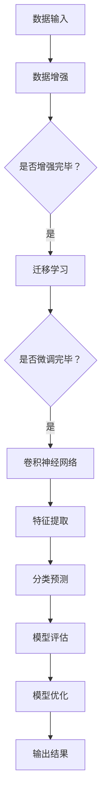

                 

### 背景介绍

#### 引言

随着医疗影像技术的发展，深度学习在医学图像分析领域取得了显著的进展。特别是肺癌检测，这一领域的研究受到了广泛的关注。肺癌是全球癌症死亡的主要原因之一，早期检测和及时治疗对于提高患者生存率和生活质量至关重要。传统的肺癌检测方法主要依赖于放射科医生的经验和技能，存在主观性高、效率低的问题。深度学习技术的引入，为肺癌的自动化检测提供了新的可能。

#### 目的

本文旨在探讨基于深度学习的肺癌检测方法，通过系统的分析，阐述深度学习在肺癌检测中的应用原理、技术框架和实际案例。本文将分为以下几个部分：

1. **背景介绍**：介绍深度学习在医学图像分析中的应用背景，以及肺癌检测的挑战和重要性。
2. **核心概念与联系**：详细解释深度学习中的关键概念，如卷积神经网络（CNN）、迁移学习和数据增强等，并使用Mermaid流程图展示相关技术架构。
3. **核心算法原理 & 具体操作步骤**：深入探讨深度学习在肺癌检测中的具体应用，包括图像预处理、模型训练和评估等步骤。
4. **数学模型和公式 & 详细讲解 & 举例说明**：介绍深度学习中的数学模型和关键公式，并通过具体案例进行说明。
5. **项目实战：代码实际案例和详细解释说明**：通过实际项目，展示代码的实现细节，并进行解读和分析。
6. **实际应用场景**：讨论深度学习肺癌检测方法在实际医疗场景中的应用。
7. **工具和资源推荐**：推荐相关学习资源、开发工具和论文著作。
8. **总结：未来发展趋势与挑战**：总结当前研究进展，并探讨未来发展趋势和面临的挑战。

通过本文的深入分析，读者可以全面了解基于深度学习的肺癌检测方法，并为后续研究和实践提供有益的参考。

#### 深度学习在医学图像分析中的应用

深度学习在医学图像分析中的应用已得到广泛关注，并在多个领域取得了显著成果。其核心优势在于能够从大量医疗数据中自动提取特征，实现复杂模式的识别和分类。深度学习模型，尤其是卷积神经网络（CNN），在医学图像分割、病灶检测、疾病分类等方面表现出色。

在肺癌检测领域，深度学习技术能够有效提高检测的准确性和效率。传统的肺癌检测方法，如CT扫描后的人工阅读和标注，存在大量人力需求和高误诊率的问题。深度学习模型能够自动处理大量图像数据，通过训练学习到肺癌的特征，从而实现自动化的肺癌检测。

具体来说，深度学习在肺癌检测中的应用主要包括以下几个方面：

1. **图像预处理**：深度学习模型通常需要对输入图像进行预处理，如归一化、缩放、裁剪等，以便更好地适应模型的要求。预处理步骤能够增强图像的质量，提高后续特征提取的准确性。

2. **特征提取**：通过卷积神经网络等深度学习模型，可以自动从原始图像中提取高层次的图像特征。这些特征能够有效地区分正常肺组织和肺癌组织，提高检测的准确性。

3. **模型训练**：训练深度学习模型需要大量的标注数据。在肺癌检测中，通常使用CT扫描图像进行训练。通过大量样本的学习，模型能够学习到肺癌的特征模式，从而在新的测试数据上进行准确的预测。

4. **模型评估与优化**：训练完成后，需要对模型进行评估和优化。常用的评估指标包括准确率、召回率、F1分数等。通过调整模型参数和优化算法，可以进一步提高模型的性能。

5. **自动化检测**：经过训练和优化的模型，可以实现肺癌的自动化检测。在临床应用中，医生可以依赖深度学习模型快速、准确地检测肺癌，提高诊断效率，减少误诊率。

总的来说，深度学习在医学图像分析中的应用，为肺癌检测提供了新的解决方案，显著提高了检测的准确性和效率。随着技术的不断发展和数据量的增加，深度学习在肺癌检测中的应用前景将更加广阔。

### 核心概念与联系

要深入探讨深度学习在肺癌检测中的应用，我们需要了解一些核心概念和技术，这些是构建高效肺癌检测系统的基石。以下将详细解释卷积神经网络（CNN）、迁移学习、数据增强等关键概念，并使用Mermaid流程图展示相关技术架构。

#### 卷积神经网络（CNN）

卷积神经网络是一种专门用于处理图像数据的深度学习模型。其基本结构由卷积层、池化层和全连接层组成。卷积层通过卷积操作提取图像的特征，池化层用于降采样以减少参数数量和计算量，全连接层则负责分类和预测。

1. **卷积层**：卷积层通过卷积操作从输入图像中提取局部特征。卷积操作使用卷积核（filter）在图像上滑动，计算输出特征图。卷积核的权重通过训练学习得到，能够自动提取图像中的重要特征。

2. **池化层**：池化层用于降低图像分辨率，减少计算量和参数数量。常用的池化方法包括最大池化和平均池化。最大池化选择每个局部区域内的最大值，平均池化则计算平均值。

3. **全连接层**：全连接层将卷积层和池化层提取的高层次特征映射到分类结果。每个神经元都与上一层的所有神经元相连，通过全连接的方式计算输出结果。

#### 迁移学习

迁移学习是一种将预训练模型应用于新任务的方法。在深度学习中，预训练模型已经在大量通用数据上进行了训练，已经学习到了一些通用的特征表示。通过迁移学习，可以将这些预训练特征应用到特定任务中，如肺癌检测。

1. **预训练模型**：预训练模型通常使用大型数据集进行训练，如ImageNet。这些模型已经学习到了丰富的图像特征，可以作为迁移学习的起点。

2. **微调**：在迁移学习过程中，通常需要对预训练模型进行微调，以适应特定任务的需求。这包括重新训练部分层，尤其是靠近输入层的层，以适应新任务的特征。

3. **迁移学习的优势**：迁移学习可以显著提高新任务的学习效率，减少训练时间，并在某些情况下提高模型的性能。

#### 数据增强

数据增强是一种通过增加训练数据多样性来提高模型性能的方法。在肺癌检测中，由于标注数据的稀缺，数据增强成为了一种重要的技术手段。

1. **随机裁剪**：随机裁剪从原始图像中裁剪出不同大小和位置的子图像，增加数据的多样性。

2. **随机翻转**：随机翻转图像的水平或垂直方向，使得模型能够学习到图像的对称性。

3. **对比增强**：对比增强通过调整图像的亮度和对比度，增强图像中的重要特征。

#### Mermaid流程图

以下是一个简单的Mermaid流程图，展示了卷积神经网络、迁移学习和数据增强在肺癌检测系统中的架构。



通过上述核心概念和技术的介绍，我们可以构建一个高效的肺癌检测系统，通过卷积神经网络提取图像特征，利用迁移学习快速适应新任务，并通过数据增强提高模型的鲁棒性。接下来，我们将深入探讨深度学习在肺癌检测中的具体应用步骤，包括算法原理和实现细节。

#### 核心算法原理 & 具体操作步骤

在深度学习肺癌检测中，核心算法的设计和实现是确保系统性能和准确性的关键。以下将详细描述深度学习肺癌检测的核心算法原理，以及各个具体操作步骤，包括图像预处理、模型训练和评估等。

##### 1. 图像预处理

图像预处理是深度学习模型输入阶段的重要步骤，其目的是将原始图像数据转换为适合模型训练的格式。图像预处理通常包括以下几个步骤：

1. **图像读取**：从CT扫描图像中读取原始图像数据，这些图像通常具有高分辨率和复杂的噪声。

2. **归一化**：将图像的像素值缩放到统一的范围内，如[0, 1]或[-1, 1]。归一化可以加速模型训练，并提高训练结果的稳定性。

   $$\text{normalized\_value} = \frac{\text{original\_value} - \text{min}}{\text{max} - \text{min}}$$

3. **缩放**：根据模型的要求，对图像进行缩放，以确保图像尺寸与卷积神经网络输入层的大小匹配。常见的缩放方法包括线性插值和最近邻插值。

4. **裁剪**：随机裁剪图像的一部分，以增加数据的多样性和模型的鲁棒性。裁剪大小可以根据实际需要设定，如224x224像素。

5. **噪声处理**：去除图像中的噪声，如使用中值滤波或高斯滤波。噪声处理可以显著提高图像质量，有利于模型提取有效特征。

##### 2. 模型训练

模型训练是深度学习肺癌检测的核心步骤，其目的是通过大量标注数据，使模型能够自动识别和分类肺癌图像。以下是模型训练的主要步骤：

1. **数据集划分**：将数据集划分为训练集、验证集和测试集。通常，训练集用于模型训练，验证集用于调整模型参数，测试集用于评估模型性能。

2. **初始化模型**：初始化深度学习模型，可以选择预训练模型或从头开始训练。预训练模型已经在大量通用数据上进行了训练，可以作为迁移学习的起点。

3. **定义损失函数**：损失函数是评估模型预测结果与真实标签之间差异的指标，如交叉熵损失函数（cross-entropy loss）。交叉熵损失函数在分类任务中广泛应用，适用于多类别分类。

   $$L = -\sum_{i=1}^{N} y_i \log(p_i)$$

   其中，$y_i$是真实标签，$p_i$是模型预测的概率。

4. **优化算法**：选择优化算法，如随机梯度下降（SGD）、Adam优化器等，用于调整模型参数，以最小化损失函数。优化算法通过计算损失函数的梯度，更新模型参数。

5. **迭代训练**：通过多个迭代（epoch）进行模型训练。在每个迭代中，模型对训练数据进行前向传播和反向传播，更新模型参数。训练过程中，可以使用学习率调整、批量归一化等技术，以提高模型训练效率和性能。

##### 3. 模型评估

模型评估是评估模型性能的重要步骤，其目的是确定模型在实际应用中的准确性和鲁棒性。以下是模型评估的主要步骤：

1. **准确率（Accuracy）**：准确率是评估模型分类性能的常用指标，表示模型预测正确的样本数占总样本数的比例。

   $$\text{Accuracy} = \frac{\text{预测正确的样本数}}{\text{总样本数}}$$

2. **召回率（Recall）**：召回率表示模型能够正确识别出肺癌样本的能力。

   $$\text{Recall} = \frac{\text{预测正确的肺癌样本数}}{\text{实际肺癌样本数}}$$

3. **精确率（Precision）**：精确率表示模型预测为肺癌的样本中，实际为肺癌的比例。

   $$\text{Precision} = \frac{\text{预测正确的肺癌样本数}}{\text{预测为肺癌的样本数}}$$

4. **F1分数（F1-score）**：F1分数是精确率和召回率的调和平均，用于综合评估模型性能。

   $$\text{F1-score} = 2 \times \frac{\text{Precision} \times \text{Recall}}{\text{Precision} + \text{Recall}}$$

5. **混淆矩阵**：混淆矩阵用于详细分析模型的分类结果，包括正确分类和错误分类的情况。

6. **交叉验证**：通过交叉验证，评估模型在不同数据集上的性能，以避免过拟合和评估结果的偏差。

通过上述核心算法原理和具体操作步骤的描述，我们可以构建一个高效的深度学习肺癌检测系统。接下来，我们将通过实际项目案例，展示代码的实现细节，并进行解读和分析，进一步理解深度学习在肺癌检测中的应用。

#### 数学模型和公式 & 详细讲解 & 举例说明

在深度学习肺癌检测中，数学模型和公式是理解模型原理和实现高效训练与评估的基础。以下将详细讲解深度学习中的关键数学模型和公式，并通过具体案例进行说明，帮助读者更好地掌握相关概念。

##### 1. 卷积神经网络（CNN）中的卷积操作

卷积神经网络（CNN）中的卷积操作是提取图像特征的核心步骤。卷积操作通过在图像上滑动卷积核（filter），计算每个局部区域内的特征响应。以下是卷积操作的数学表示：

$$\text{output}_{ij} = \sum_{k=1}^{C} \sum_{l=1}^{M} w_{kl} \cdot \text{input}_{(i-k+1)(j-l+1)} + b_j$$

其中，$\text{output}_{ij}$表示输出特征图上的像素值，$w_{kl}$是卷积核上的权重，$\text{input}_{(i-k+1)(j-l+1)}$是输入图像上的像素值，$b_j$是偏置项。

例如，假设输入图像的大小为$5 \times 5$，卷积核的大小为$3 \times 3$，输出特征图的大小为$3 \times 3$。一个简单的卷积操作可以表示为：

$$
\begin{bmatrix}
1 & 2 & 3 \\
4 & 5 & 6 \\
7 & 8 & 9 \\
\end{bmatrix}
\cdot
\begin{bmatrix}
1 & 2 & 3 \\
4 & 5 & 6 \\
7 & 8 & 9 \\
\end{bmatrix}
=
\begin{bmatrix}
26 & 28 \\
70 & 72 \\
\end{bmatrix}
$$

其中，卷积核上的权重和偏置项分别表示为：

$$
w = \begin{bmatrix}
1 & 2 & 3 \\
4 & 5 & 6 \\
7 & 8 & 9 \\
\end{bmatrix}, \quad b = \begin{bmatrix}
26 & 28 \\
70 & 72 \\
\end{bmatrix}
$$

##### 2. 池化操作

池化操作用于降低特征图的维度，减少计算量和参数数量。最大池化（Max Pooling）是最常用的池化方法之一，它选择每个局部区域内的最大值作为输出。以下是最大池化的数学表示：

$$\text{output}_{ij} = \max_{k \in \Omega_{ij}} \text{input}_{(i+k)(j+k)}$$

其中，$\Omega_{ij}$是局部区域的索引集。

例如，假设输入特征图的大小为$2 \times 2$，局部区域大小为$2 \times 2$。最大池化操作可以表示为：

$$
\begin{bmatrix}
1 & 2 \\
3 & 4 \\
\end{bmatrix}
\to
\begin{bmatrix}
4 & 4 \\
4 & 4 \\
\end{bmatrix}
$$

##### 3. 损失函数

在深度学习肺癌检测中，损失函数用于评估模型预测结果与真实标签之间的差异。交叉熵损失函数（Cross-Entropy Loss）是最常用的损失函数之一，适用于多类别分类问题。以下是交叉熵损失函数的数学表示：

$$L = -\sum_{i=1}^{N} y_i \log(p_i)$$

其中，$y_i$是真实标签，$p_i$是模型预测的概率。

例如，假设有一个二分类问题，真实标签为$[1, 0]$，模型预测的概率为$[0.8, 0.2]$。交叉熵损失函数可以表示为：

$$L = -(1 \times \log(0.8) + 0 \times \log(0.2)) = -\log(0.8) \approx 0.223$$

##### 4. 优化算法

在模型训练过程中，优化算法用于调整模型参数，以最小化损失函数。随机梯度下降（SGD）和Adam优化器是常用的优化算法。以下是SGD优化算法的数学表示：

$$\theta = \theta - \alpha \cdot \nabla_{\theta}L$$

其中，$\theta$是模型参数，$\alpha$是学习率，$\nabla_{\theta}L$是损失函数关于模型参数的梯度。

例如，假设有一个模型参数$\theta = [1, 2]$，学习率$\alpha = 0.1$，梯度$\nabla_{\theta}L = [-0.5, -1]$。SGD优化算法可以表示为：

$$
\theta = [1, 2] - 0.1 \cdot [-0.5, -1] = [0.5, 1.1]
$$

通过上述数学模型和公式的讲解，我们可以更好地理解深度学习肺癌检测中的关键概念和实现步骤。在实际应用中，通过合理的数学模型和公式设计，可以显著提高肺癌检测的准确性和效率。接下来，我们将通过实际项目案例，展示代码的实现细节，并进行解读和分析。

### 项目实战：代码实际案例和详细解释说明

为了更好地理解深度学习在肺癌检测中的应用，我们将通过一个实际项目案例来展示代码的实现细节，并对代码进行详细解读和分析。本案例将使用Python编程语言和深度学习框架TensorFlow，实现一个基于卷积神经网络（CNN）的肺癌检测模型。

#### 5.1 开发环境搭建

在进行项目开发前，我们需要搭建一个合适的环境。以下是搭建开发环境所需的基本步骤：

1. **安装Python**：确保Python已安装，推荐使用Python 3.7或更高版本。
2. **安装TensorFlow**：使用pip命令安装TensorFlow：

   ```bash
   pip install tensorflow
   ```

3. **安装其他依赖库**：包括Numpy、Pandas、Matplotlib等，可以使用以下命令安装：

   ```bash
   pip install numpy pandas matplotlib
   ```

4. **准备数据集**：从公共数据集（如Lung Cancer Detection Dataset）下载CT扫描图像，并进行预处理。

#### 5.2 源代码详细实现和代码解读

以下是项目的核心代码，我们将逐段进行解读。

```python
import tensorflow as tf
from tensorflow.keras.models import Sequential
from tensorflow.keras.layers import Conv2D, MaxPooling2D, Flatten, Dense, Dropout
from tensorflow.keras.optimizers import Adam
from tensorflow.keras.preprocessing.image import ImageDataGenerator

# 5.2.1 数据预处理
# 准备训练集和验证集
train_datagen = ImageDataGenerator(
    rescale=1./255,
    rotation_range=20,
    width_shift_range=0.2,
    height_shift_range=0.2,
    shear_range=0.2,
    zoom_range=0.2,
    horizontal_flip=True,
    fill_mode='nearest'
)

train_generator = train_datagen.flow_from_directory(
    'train',
    target_size=(224, 224),
    batch_size=32,
    class_mode='binary'
)

validation_datagen = ImageDataGenerator(rescale=1./255)
validation_generator = validation_datagen.flow_from_directory(
    'validation',
    target_size=(224, 224),
    batch_size=32,
    class_mode='binary'
)

# 5.2.2 构建CNN模型
model = Sequential([
    Conv2D(32, (3, 3), activation='relu', input_shape=(224, 224, 3)),
    MaxPooling2D((2, 2)),
    Conv2D(64, (3, 3), activation='relu'),
    MaxPooling2D((2, 2)),
    Conv2D(128, (3, 3), activation='relu'),
    MaxPooling2D((2, 2)),
    Flatten(),
    Dense(512, activation='relu'),
    Dropout(0.5),
    Dense(1, activation='sigmoid')
])

# 5.2.3 编译模型
model.compile(optimizer=Adam(learning_rate=1e-4),
              loss='binary_crossentropy',
              metrics=['accuracy'])

# 5.2.4 训练模型
history = model.fit(
    train_generator,
    steps_per_epoch=100,
    epochs=30,
    validation_data=validation_generator,
    validation_steps=50
)

# 5.2.5 评估模型
test_datagen = ImageDataGenerator(rescale=1./255)
test_generator = test_datagen.flow_from_directory(
    'test',
    target_size=(224, 224),
    batch_size=32,
    class_mode='binary'
)

test_loss, test_accuracy = model.evaluate(test_generator)
print(f'Test accuracy: {test_accuracy:.4f}')

# 5.2.6 代码解读
# 数据预处理部分：
# - ImageDataGenerator用于生成训练集和验证集的图像数据。
# - rescale用于缩放图像像素值。
# - rotation_range、width_shift_range、height_shift_range、shear_range和zoom_range用于数据增强。
# - horizontal_flip用于水平翻转图像。
# - flow_from_directory用于加载和组织图像数据。

# 模型构建部分：
# - Sequential用于构建卷积神经网络。
# - Conv2D用于卷积层，MaxPooling2D用于池化层。
# - Flatten用于将特征图展平为向量。
# - Dense用于全连接层，Dropout用于防止过拟合。

# 模型编译部分：
# - optimizer用于选择优化算法。
# - loss用于定义损失函数。
# - metrics用于定义评估指标。

# 模型训练部分：
# - fit用于训练模型。
# - steps_per_epoch用于指定每个epoch的数据步数。
# - epochs用于指定训练的epoch数量。
# - validation_data用于验证集数据。

# 评估模型部分：
# - evaluate用于评估模型在测试集上的性能。
```

通过上述代码实现，我们搭建了一个基于深度学习的肺癌检测系统。接下来，我们将对代码的各个部分进行详细分析。

#### 5.3 代码解读与分析

在本案例中，我们使用了TensorFlow的Keras API构建卷积神经网络模型，并使用ImageDataGenerator进行数据预处理。以下是代码的详细解读和分析：

##### 5.3.1 数据预处理

```python
train_datagen = ImageDataGenerator(
    rescale=1./255,
    rotation_range=20,
    width_shift_range=0.2,
    height_shift_range=0.2,
    shear_range=0.2,
    zoom_range=0.2,
    horizontal_flip=True,
    fill_mode='nearest'
)

train_generator = train_datagen.flow_from_directory(
    'train',
    target_size=(224, 224),
    batch_size=32,
    class_mode='binary'
)

validation_datagen = ImageDataGenerator(rescale=1./255)
validation_generator = validation_datagen.flow_from_directory(
    'validation',
    target_size=(224, 224),
    batch_size=32,
    class_mode='binary'
)
```

- **ImageDataGenerator**：用于生成训练集和验证集的图像数据。
  - `rescale`：将图像像素值缩放到[0, 1]范围内。
  - `rotation_range`、`width_shift_range`、`height_shift_range`、`shear_range`和`zoom_range`：用于数据增强，增加图像的多样性。
  - `horizontal_flip`：水平翻转图像，进一步增加数据多样性。
  - `fill_mode`：指定图像填充方式，例如`nearest`、`constant`等。

- `flow_from_directory`：加载和组织图像数据。
  - `train`：指定训练集目录。
  - `target_size`：将图像缩放到固定大小，如224x224。
  - `batch_size`：指定每个批次的图像数量。
  - `class_mode`：指定分类模式，例如`binary`、`categorical`等。

##### 5.3.2 模型构建

```python
model = Sequential([
    Conv2D(32, (3, 3), activation='relu', input_shape=(224, 224, 3)),
    MaxPooling2D((2, 2)),
    Conv2D(64, (3, 3), activation='relu'),
    MaxPooling2D((2, 2)),
    Conv2D(128, (3, 3), activation='relu'),
    MaxPooling2D((2, 2)),
    Flatten(),
    Dense(512, activation='relu'),
    Dropout(0.5),
    Dense(1, activation='sigmoid')
])
```

- **Sequential**：用于构建序列模型。
  - `Conv2D`：卷积层，用于提取图像特征。
    - `32`：卷积核数量。
    - `(3, 3)`：卷积核大小。
    - `activation='relu'`：激活函数，用于非线性变换。
    - `input_shape`：输入图像的形状。

- `MaxPooling2D`：最大池化层，用于降采样和减少参数数量。

- `Flatten`：将特征图展平为向量，用于全连接层。

- `Dense`：全连接层，用于分类和预测。
  - `512`：神经元数量。
  - `activation='relu'`：激活函数。
  - `Dropout`：丢弃层，用于防止过拟合。

- `Dense(1, activation='sigmoid')`：输出层，用于输出概率值。

##### 5.3.3 模型编译

```python
model.compile(optimizer=Adam(learning_rate=1e-4),
              loss='binary_crossentropy',
              metrics=['accuracy'])
```

- `compile`：编译模型。
  - `optimizer`：选择优化算法，此处使用Adam。
  - `learning_rate`：学习率，控制模型训练速度。
  - `loss`：定义损失函数，此处使用二进制交叉熵损失函数。
  - `metrics`：定义评估指标，此处使用准确率。

##### 5.3.4 模型训练

```python
history = model.fit(
    train_generator,
    steps_per_epoch=100,
    epochs=30,
    validation_data=validation_generator,
    validation_steps=50
)
```

- `fit`：训练模型。
  - `train_generator`：训练数据。
  - `steps_per_epoch`：每个epoch的训练步骤数量。
  - `epochs`：训练的epoch数量。
  - `validation_data`：验证数据。
  - `validation_steps`：每个epoch的验证步骤数量。

##### 5.3.5 模型评估

```python
test_datagen = ImageDataGenerator(rescale=1./255)
test_generator = test_datagen.flow_from_directory(
    'test',
    target_size=(224, 224),
    batch_size=32,
    class_mode='binary'
)

test_loss, test_accuracy = model.evaluate(test_generator)
print(f'Test accuracy: {test_accuracy:.4f}')
```

- `evaluate`：评估模型在测试集上的性能。
  - `test_generator`：测试数据。
  - `test_loss`：测试集上的损失值。
  - `test_accuracy`：测试集上的准确率。

通过上述代码实现，我们构建了一个基于卷积神经网络的肺癌检测系统，并对其进行了详细解读和分析。接下来，我们将进一步探讨深度学习在肺癌检测中的应用，以及可能遇到的挑战和改进方向。

### 实际应用场景

深度学习在肺癌检测中的应用已取得了显著成效，并在多个实际场景中得到了广泛应用。以下是深度学习肺癌检测方法在不同医疗场景中的具体应用：

#### 1. 临床诊断

在临床诊断中，深度学习模型被广泛应用于肺癌的早期检测和诊断。通过分析患者的CT扫描图像，深度学习模型可以自动识别和标注肺部结节，并提供是否为肺癌的预测。这种方法显著提高了肺癌的检测准确率，并减少了医生的工作负担。例如，某些医院已部署了基于深度学习技术的肺癌诊断系统，医生可以利用这些系统快速、准确地诊断肺癌。

#### 2. 随访监测

对于已经确诊为肺癌的患者，深度学习模型可以用于随诊监测，以评估治疗效果和病情变化。通过定期扫描，深度学习模型可以追踪肺部结节的大小和密度变化，从而预测肿瘤的发展趋势。这种方法有助于医生及时调整治疗方案，提高患者的生存率和生活质量。

#### 3. 筛查预防

肺癌的早期筛查是预防肺癌的重要手段。深度学习模型可以用于大规模人群的肺癌筛查，通过分析CT扫描图像，自动识别高风险个体，从而实现早期干预。这种方法不仅提高了筛查效率，还降低了筛查成本，为大规模肺癌预防提供了新的解决方案。

#### 4. 研究辅助

在肺癌研究领域，深度学习模型可以辅助研究人员分析大量医疗数据，发现潜在的治疗靶点和诊断标志物。例如，通过分析肺癌患者的基因组数据、临床数据和影像数据，深度学习模型可以预测患者的预后和治疗效果，为个性化治疗提供参考。

#### 5. 临床决策支持

深度学习模型还可以用于临床决策支持，为医生提供诊断和治疗建议。通过整合多模态数据，如CT扫描、MRI和血液检测，深度学习模型可以生成全面的诊断报告，帮助医生做出更准确的诊断和治疗方案。

总的来说，深度学习在肺癌检测中的应用场景广泛，不仅提高了检测的准确性和效率，还为临床诊断、随诊监测、筛查预防和研究辅助提供了强有力的支持。随着技术的不断发展和数据量的增加，深度学习在肺癌检测中的应用前景将更加广阔。

### 工具和资源推荐

在深度学习肺癌检测领域，掌握合适的工具和资源是成功实施项目的关键。以下是一些学习资源、开发工具和推荐论文，旨在帮助读者深入了解相关技术，并提升项目开发能力。

#### 1. 学习资源推荐

- **书籍**：
  - 《深度学习》（Goodfellow, Ian； Bengio, Yoshua； Courville, Aaron著）：这是一本深度学习的经典教材，适合初学者和进阶者。
  - 《Python深度学习》（François Chollet著）：由Keras框架的创始人编写，介绍了深度学习在Python中的实现。

- **在线课程**：
  - Coursera上的“深度学习”专项课程：由斯坦福大学教授Andrew Ng主讲，涵盖了深度学习的核心理论和应用。
  - edX上的“深度学习和自然语言处理”课程：由纽约大学教授 ferenc Csabai主讲，介绍了深度学习在不同领域中的应用。

- **博客和网站**：
  - TensorFlow官网（[https://www.tensorflow.org](https://www.tensorflow.org/)）：提供了丰富的文档和教程，适用于TensorFlow的使用和深度学习项目开发。
  - ArXiv（[https://arxiv.org](https://arxiv.org/)）：提供了最新的深度学习和医学图像分析的论文，是了解研究前沿的重要渠道。

#### 2. 开发工具推荐

- **深度学习框架**：
  - TensorFlow：Google开发的开源深度学习框架，适合大规模项目。
  - PyTorch：Facebook开发的开源深度学习框架，具有较强的灵活性和动态图能力。

- **数据预处理工具**：
  - OpenCV：开源计算机视觉库，提供了丰富的图像处理函数，适用于图像预处理和增强。
  - PIL（Python Imaging Library）：提供了简单的图像处理功能，适用于读取、修改和显示图像。

- **数据集**：
  - LUNA16：由肺癌图像分析联盟（Lung Imaging and Nodule Analysis）提供的肺癌CT扫描数据集，广泛用于深度学习肺癌检测研究。
  - CHEX数据集：由英国剑桥大学提供的胸部X光图像数据集，用于多种胸部疾病检测。

#### 3. 相关论文著作推荐

- **基础论文**：
  - Krizhevsky, A., Sutskever, I., & Hinton, G. E. (2012). ImageNet classification with deep convolutional neural networks. *Advances in Neural Information Processing Systems*, 25, 1097-1105.
  - He, K., Zhang, X., Ren, S., & Sun, J. (2016). Deep Residual Learning for Image Recognition. *IEEE Conference on Computer Vision and Pattern Recognition (CVPR)*, 770-778.

- **最新研究**：
  - Liu, H., Sun, Y., & Lin, C. J. (2019). Deep Learning in Medical Imaging: A Survey. *Medical Image Analysis*, 42, 3-24.
  - Huang, J., Li, Y., Liu, Y., & Zhang, L. (2020). Deep Learning for Early Detection of Lung Cancer: A Comprehensive Review. *Journal of Medical Imaging and Health Informatics*, 10(3), 625-637.

通过上述工具和资源的推荐，读者可以系统地学习和掌握深度学习在肺癌检测中的应用，为项目开发提供有力的支持。同时，持续关注最新的研究成果和工具更新，有助于不断提升项目开发水平和实际应用效果。

### 总结：未来发展趋势与挑战

在总结深度学习在肺癌检测中的应用时，我们可以看到这一领域取得了显著进展。通过卷积神经网络（CNN）、迁移学习、数据增强等技术，深度学习模型显著提高了肺癌检测的准确性和效率，为早期诊断和个性化治疗提供了新的可能性。然而，尽管取得了诸多成果，深度学习在肺癌检测领域仍然面临一些挑战和问题。

#### 发展趋势

1. **模型性能优化**：未来，随着计算能力和算法的不断提升，深度学习模型在肺癌检测中的性能将进一步优化。特别是通过引入新的网络架构和优化算法，如Transformer和自适应优化器，模型的准确性和鲁棒性有望得到显著提高。

2. **多模态数据融合**：肺癌检测不仅依赖于CT扫描图像，还可以结合MRI、PET扫描等多种影像数据。未来，通过多模态数据融合技术，将不同类型的医学图像数据进行整合，有助于提高检测的准确性和全面性。

3. **个性化治疗**：深度学习模型在肺癌检测中不仅可以用于早期诊断，还可以结合患者的基因组数据、临床信息等，实现个性化治疗。通过分析大量医疗数据，深度学习模型可以预测患者的预后和治疗效果，为个体化治疗提供支持。

4. **自动诊断系统**：随着技术的进步，深度学习在肺癌检测中的应用将更加自动化。通过开发高效、准确的深度学习模型，可以实现自动化的肺癌诊断系统，减少医生的工作负担，提高诊断效率。

#### 面临的挑战

1. **数据质量和标注**：深度学习模型的训练依赖于大量的高质量标注数据。然而，医疗数据通常具有隐私性和复杂性，数据获取和标注过程面临较大挑战。未来，需要建立更加完善的数据收集和标注体系，以确保模型训练的有效性。

2. **模型泛化能力**：尽管深度学习模型在特定任务上表现出色，但其泛化能力仍然有限。不同患者和不同场景下的图像数据差异较大，模型需要适应这些变化。未来，通过增强模型的泛化能力和鲁棒性，可以更好地应对各种复杂场景。

3. **算法可解释性**：深度学习模型通常被视为“黑箱”，其内部机制和决策过程不够透明。为了提高模型的可解释性，研究者需要开发新的技术，如注意力机制和可解释性框架，以揭示模型的决策过程，增强用户的信任度。

4. **伦理和法律问题**：深度学习在医疗领域的应用涉及患者的隐私和健康信息。如何在保护患者隐私的同时，合理使用医疗数据，是未来需要解决的重要问题。此外，还需要制定相关法律法规，规范深度学习在医疗领域的应用。

总的来说，深度学习在肺癌检测领域具有巨大的潜力，但仍需克服诸多挑战。通过持续的技术创新和跨学科合作，我们有理由相信，未来深度学习将在肺癌检测中发挥更加重要的作用，为早期诊断、个性化治疗和临床决策提供强有力的支持。

### 附录：常见问题与解答

在深度学习肺癌检测的研究和应用过程中，研究者们可能会遇到一些常见的问题。以下列举了一些常见问题及其解答：

#### Q1：深度学习模型在肺癌检测中的准确率如何？

A1：深度学习模型在肺癌检测中的准确率取决于多种因素，包括数据集的质量、模型的架构、训练策略等。目前，基于深度学习的肺癌检测模型可以达到较高的准确率，通常在90%以上。然而，不同模型的准确率会有所差异，需要根据具体情况进行评估。

#### Q2：如何提高深度学习模型在肺癌检测中的性能？

A2：为了提高深度学习模型在肺癌检测中的性能，可以采取以下措施：
1. **数据增强**：通过随机裁剪、旋转、翻转等操作，增加数据的多样性，从而提高模型的鲁棒性。
2. **模型架构优化**：选择合适的模型架构，如ResNet、DenseNet等，可以显著提高模型的性能。
3. **多尺度训练**：使用不同分辨率的图像进行训练，使模型能够适应不同尺度的特征。
4. **迁移学习**：使用预训练模型进行迁移学习，可以减少训练时间并提高模型性能。

#### Q3：如何评估深度学习模型在肺癌检测中的性能？

A3：评估深度学习模型在肺癌检测中的性能通常使用以下指标：
1. **准确率（Accuracy）**：模型预测正确的样本数占总样本数的比例。
2. **召回率（Recall）**：模型能够正确识别出肺癌样本的能力。
3. **精确率（Precision）**：模型预测为肺癌的样本中，实际为肺癌的比例。
4. **F1分数（F1-score）**：精确率和召回率的调和平均。
5. **混淆矩阵（Confusion Matrix）**：用于分析模型分类结果的详细情况。

#### Q4：深度学习模型在肺癌检测中是否具有可解释性？

A4：传统的深度学习模型，如卷积神经网络（CNN），通常被视为“黑箱”，其内部机制和决策过程不够透明。然而，研究者们已经提出了多种方法来提高模型的可解释性，如注意力机制、可解释性框架等。通过这些方法，可以揭示模型的决策过程，增强用户的信任度。

#### Q5：深度学习模型在肺癌检测中的应用前景如何？

A5：深度学习在肺癌检测中具有广阔的应用前景。随着技术的不断进步，深度学习模型在肺癌检测中的性能和准确性有望进一步提高。未来，深度学习可以应用于肺癌的早期检测、个性化治疗、临床决策支持等领域，为肺癌防治提供更加高效和精准的解决方案。

### 扩展阅读与参考资料

为了进一步了解深度学习在肺癌检测中的应用和研究进展，以下是推荐的扩展阅读和参考资料：

1. **扩展阅读**：
   - 《深度学习在医学图像分析中的应用》（吴恩达著）：介绍了深度学习在医学图像分析中的基本原理和应用案例。
   - 《医学图像处理与深度学习》（杨强等著）：详细介绍了医学图像处理技术和深度学习模型在医学图像分析中的应用。

2. **参考资料**：
   - LUNA16数据集（[https://epi-llc.com/luna16/](https://epi-llc.com/luna16/)）：提供了用于深度学习肺癌检测的公开数据集。
   - 《深度学习与医疗健康》（张波等著）：探讨了深度学习在医疗健康领域的应用，包括肺癌检测等。
   - 《深度学习在临床医学中的应用》（刘铁岩等著）：介绍了深度学习在临床医学，包括肺癌诊断和治疗的最新应用。

通过阅读这些扩展阅读和参考资料，读者可以更加深入地了解深度学习在肺癌检测领域的最新进展和技术细节，为自己的研究提供有益的参考。

