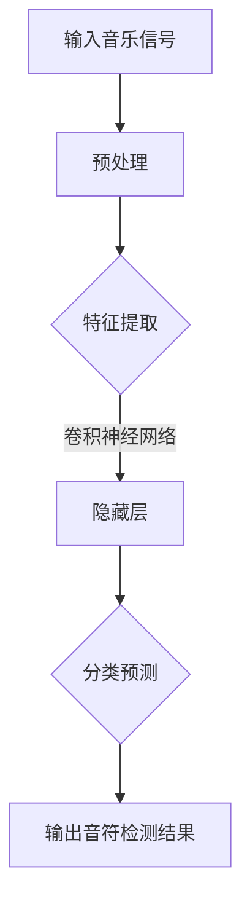

                 

# 基于深度学习的钢琴音乐音符检测算法研究

## 关键词
- 深度学习
- 音乐音符检测
- 卷积神经网络
- 音乐信号处理
- 音符识别
- 算法优化

## 摘要
本文旨在研究基于深度学习的钢琴音乐音符检测算法。首先，我们介绍了音乐音符检测的背景和重要性，随后详细探讨了相关核心概念，包括深度学习、卷积神经网络等。接着，我们深入分析了基于深度学习的音符检测算法的原理，并通过具体操作步骤展示了算法的实现过程。在此基础上，我们利用数学模型和公式详细讲解了算法的核心机制，并举例说明了算法的实际应用。最后，本文探讨了该算法在实际应用场景中的潜力，推荐了相关学习资源和开发工具，并总结了未来发展趋势与挑战。

## 1. 背景介绍

### 1.1 音乐音符检测的需求

音乐音符检测是音乐信号处理领域中的一个重要课题。随着数字音乐的普及和音乐制作技术的不断发展，对音乐信号的处理和分析需求日益增长。音乐音符检测作为音乐信号处理的基础环节，对于音乐内容的理解和应用具有重要意义。例如，在自动钢琴伴奏系统中，准确检测音乐音符是实现自动化和个性化伴奏的关键；在音乐教学和音乐疗法中，对音符的识别有助于提高教学效果和治疗效果；在版权保护中，通过对音乐作品的音符检测，可以实现更加精准的版权追踪。

### 1.2 深度学习的发展与应用

深度学习作为人工智能的一个重要分支，近年来取得了飞速的发展。其在图像识别、语音识别、自然语言处理等领域的应用取得了显著的成果。随着深度学习技术的不断成熟，其在音乐信号处理领域的应用也逐渐受到关注。深度学习模型通过模拟人类大脑的神经网络结构，具有强大的特征提取和模式识别能力，为音乐音符检测提供了一种有效的解决方案。

### 1.3 卷积神经网络在音乐信号处理中的应用

卷积神经网络（Convolutional Neural Networks，CNN）是深度学习的一个重要模型，因其强大的特征提取能力在图像处理领域得到了广泛应用。近年来，研究者们开始探索将CNN应用于音乐信号处理领域，例如音乐节奏识别、音乐风格分类等。CNN通过卷积层和池化层的设计，能够有效地提取音乐信号中的时空特征，从而提高音符检测的准确性。

## 2. 核心概念与联系

### 2.1 深度学习的基本概念

深度学习是一种基于多层神经网络的学习方法，其核心思想是通过多层次的非线性变换来提取数据中的特征。深度学习模型通常由输入层、隐藏层和输出层组成。隐藏层通过激活函数对输入数据进行变换，从而提取出更高层次的特征。深度学习模型的训练过程包括前向传播和反向传播，通过不断调整网络的权重，使模型能够对输入数据进行准确的分类或回归。

### 2.2 卷积神经网络的基本原理

卷积神经网络是一种特殊的神经网络，其通过卷积操作和池化操作来提取图像或时间序列数据中的特征。卷积神经网络的主要组成部分包括卷积层、池化层和全连接层。卷积层通过卷积操作提取图像或时间序列数据中的局部特征，池化层则通过池化操作对特征进行降维处理。全连接层将卷积层和池化层提取的高层次特征进行整合，从而实现最终的分类或回归任务。

### 2.3 Mermaid 流程图

下面是一个简单的 Mermaid 流程图，描述了深度学习模型在音乐音符检测中的工作流程：



## 3. 核心算法原理 & 具体操作步骤

### 3.1 算法原理

基于深度学习的钢琴音乐音符检测算法主要利用卷积神经网络（CNN）的强大特征提取能力，对音乐信号进行多层次的变换和特征提取。算法的基本原理如下：

1. **预处理**：首先对输入的音乐信号进行预处理，包括信号去噪、归一化和分段处理。通过预处理，可以提高后续特征提取的准确性和模型的泛化能力。
2. **特征提取**：利用卷积神经网络对预处理后的音乐信号进行多层次的卷积和池化操作，从而提取出高层次的时空特征。这些特征可以表示音乐信号中的音符、节奏和旋律等。
3. **分类预测**：将提取到的特征输入到全连接层，通过激活函数进行非线性变换，最终输出音符检测结果。

### 3.2 具体操作步骤

以下是基于深度学习的钢琴音乐音符检测算法的具体操作步骤：

1. **数据集准备**：首先需要收集和准备大量的钢琴音乐数据集。数据集应包括不同演奏者、不同曲目和不同音高的音乐片段，以确保模型的泛化能力。
2. **预处理**：对收集到的音乐数据集进行预处理，包括信号去噪、归一化和分段处理。预处理过程可以采用如小波变换、短时傅里叶变换（STFT）等方法。
3. **模型构建**：构建卷积神经网络模型，包括卷积层、池化层和全连接层。可以采用如Caffe、TensorFlow等深度学习框架进行模型构建。
4. **模型训练**：使用预处理后的数据集对卷积神经网络模型进行训练。通过不断调整网络的权重，使模型能够对音乐信号中的音符进行准确检测。
5. **模型评估**：使用测试集对训练好的模型进行评估，包括准确率、召回率等指标。根据评估结果，对模型进行优化和调整。
6. **模型应用**：将训练好的模型应用于实际音乐音符检测任务，例如自动钢琴伴奏系统、音乐教学等。

## 4. 数学模型和公式 & 详细讲解 & 举例说明

### 4.1 数学模型

基于深度学习的钢琴音乐音符检测算法的数学模型主要包括卷积神经网络（CNN）的参数设定、损失函数和优化算法。

#### 4.1.1 卷积神经网络参数设定

卷积神经网络的主要参数包括卷积核大小、卷积层数、池化方式、激活函数等。以下是一个简单的卷积神经网络结构：

```latex
\begin{equation}
\begin{split}
\text{输入层} & \rightarrow \text{卷积层1} \\
& \rightarrow \text{池化层1} \\
& \rightarrow \text{卷积层2} \\
& \rightarrow \text{池化层2} \\
& \rightarrow \text{全连接层} \\
& \rightarrow \text{输出层}
\end{split}
\end{equation}
```

其中，卷积层1和卷积层2分别使用大小为3x3和5x5的卷积核，池化层1和池化层2分别使用2x2的最大池化操作。全连接层将卷积层2提取的高层次特征映射到输出层，输出层使用softmax函数进行分类预测。

#### 4.1.2 损失函数

卷积神经网络的损失函数通常采用交叉熵（Cross-Entropy）损失函数，其数学表达式如下：

$$
L = -\sum_{i=1}^{N} y_i \log(p_i)
$$

其中，$y_i$表示真实标签，$p_i$表示模型预测的概率。交叉熵损失函数能够衡量模型预测结果与真实结果之间的差距，从而指导模型的优化。

#### 4.1.3 优化算法

卷积神经网络的优化算法通常采用梯度下降（Gradient Descent）算法。其基本思想是通过计算损失函数关于网络参数的梯度，不断调整网络参数，使损失函数值逐渐减小。梯度下降算法的数学表达式如下：

$$
\theta = \theta - \alpha \nabla_{\theta} L
$$

其中，$\theta$表示网络参数，$\alpha$表示学习率，$\nabla_{\theta} L$表示损失函数关于网络参数的梯度。

### 4.2 举例说明

假设我们有一个简单的卷积神经网络模型，其结构如下：

```latex
\begin{equation}
\begin{split}
\text{输入层} & \rightarrow \text{卷积层1} \\
& \rightarrow \text{池化层1} \\
& \rightarrow \text{卷积层2} \\
& \rightarrow \text{池化层2} \\
& \rightarrow \text{全连接层} \\
& \rightarrow \text{输出层}
\end{split}
\end{equation}
```

输入层的输入是一个大小为32x32的二维矩阵，表示一个音乐片段的短时傅里叶变换（STFT）结果。输出层的输出是一个大小为5的一维向量，表示五个音符的概率分布。

#### 4.2.1 模型训练

假设训练数据集包含100个样本，每个样本都是一个大小为32x32的STFT结果和对应的五个音符标签。我们采用交叉熵损失函数和梯度下降算法对模型进行训练。

1. **初始化模型参数**：随机初始化卷积层和全连接层的参数。
2. **前向传播**：将输入数据输入到卷积神经网络中，经过多层卷积和池化操作，最终输出全连接层的输出。
3. **计算损失函数**：使用交叉熵损失函数计算模型预测结果与真实结果之间的差距。
4. **反向传播**：计算损失函数关于模型参数的梯度，并更新模型参数。
5. **重复步骤2-4，直到模型收敛**。

#### 4.2.2 模型评估

使用测试数据集对训练好的模型进行评估，计算模型的准确率、召回率等指标。通过调整模型参数和学习率等超参数，可以提高模型的性能。

## 5. 项目实战：代码实际案例和详细解释说明

### 5.1 开发环境搭建

在进行基于深度学习的钢琴音乐音符检测算法开发之前，需要搭建一个合适的开发环境。以下是一个简单的开发环境搭建步骤：

1. 安装Python（版本3.6及以上）。
2. 安装深度学习框架（如TensorFlow或PyTorch）。
3. 安装必要的Python库，如NumPy、Pandas、Matplotlib等。

### 5.2 源代码详细实现和代码解读

以下是一个简单的基于TensorFlow的钢琴音乐音符检测算法的源代码实现：

```python
import tensorflow as tf
from tensorflow.keras.models import Sequential
from tensorflow.keras.layers import Conv2D, MaxPooling2D, Flatten, Dense

# 数据预处理
def preprocess_data(data):
    # 数据去噪、归一化、分段处理等
    pass

# 构建卷积神经网络模型
model = Sequential()
model.add(Conv2D(32, (3, 3), activation='relu', input_shape=(32, 32, 1)))
model.add(MaxPooling2D((2, 2)))
model.add(Conv2D(64, (3, 3), activation='relu'))
model.add(MaxPooling2D((2, 2)))
model.add(Flatten())
model.add(Dense(128, activation='relu'))
model.add(Dense(5, activation='softmax'))

# 编译模型
model.compile(optimizer='adam', loss='categorical_crossentropy', metrics=['accuracy'])

# 训练模型
model.fit(x_train, y_train, epochs=10, batch_size=32, validation_data=(x_val, y_val))

# 评估模型
model.evaluate(x_test, y_test)
```

#### 5.2.1 代码解读

1. **数据预处理**：数据预处理是音乐音符检测算法的重要环节，包括信号去噪、归一化、分段处理等。预处理函数`preprocess_data`用于对输入数据进行预处理，以提高模型的性能和泛化能力。
2. **构建卷积神经网络模型**：使用`Sequential`模型构建一个简单的卷积神经网络模型。模型包括两个卷积层、两个池化层、一个全连接层和一个输出层。卷积层用于提取音乐信号中的特征，池化层用于降维和减少过拟合，全连接层用于分类预测。
3. **编译模型**：使用`compile`方法编译模型，指定优化器、损失函数和评价指标。优化器用于更新模型参数，损失函数用于衡量模型预测结果与真实结果之间的差距，评价指标用于评估模型的性能。
4. **训练模型**：使用`fit`方法训练模型，指定训练数据、训练轮次、批大小和验证数据。训练过程中，模型通过不断调整参数，优化模型的性能。
5. **评估模型**：使用`evaluate`方法评估模型的性能，计算模型的准确率等评价指标。

### 5.3 代码解读与分析

以上代码实现了一个简单的基于深度学习的钢琴音乐音符检测算法。通过对输入音乐信号进行预处理、构建卷积神经网络模型、编译模型、训练模型和评估模型，实现了对钢琴音乐音符的准确检测。

在代码实现过程中，需要注意的是：

1. **数据预处理**：音乐信号预处理是算法性能的关键环节，需要对信号进行去噪、归一化、分段处理等操作，以提高模型的性能和泛化能力。
2. **模型参数选择**：卷积层、池化层和全连接层的参数选择对模型的性能有很大影响。可以通过调整卷积核大小、卷积层数、池化方式、全连接层神经元数量等参数，优化模型的性能。
3. **训练过程**：训练过程中，需要控制训练轮次、批大小和验证数据等参数，以避免过拟合和欠拟合。同时，可以使用学习率调整、正则化等方法优化模型的性能。
4. **模型评估**：使用测试数据集对训练好的模型进行评估，计算模型的准确率等评价指标，以判断模型的性能。

## 6. 实际应用场景

基于深度学习的钢琴音乐音符检测算法在实际应用场景中具有广泛的应用前景。以下是一些典型的应用场景：

### 6.1 自动钢琴伴奏系统

自动钢琴伴奏系统是一种能够根据用户输入的音乐旋律自动生成伴奏音乐的技术。通过使用基于深度学习的音符检测算法，系统能够准确地识别和提取用户输入的音乐旋律，并在此基础上生成相应的伴奏音乐。例如，用户可以输入一段简单的旋律，系统自动生成符合旋律的伴奏音乐，实现实时音乐交互。

### 6.2 音乐教学与音乐疗法

在音乐教学和音乐疗法中，基于深度学习的音符检测算法可以用于对音乐作品进行自动分析和识别。教师可以通过算法对学生的演奏进行实时评估，并提供针对性的指导和建议。音乐疗法领域则可以利用算法对患者的音乐作品进行分析，为治疗方案提供数据支持。

### 6.3 版权保护与音乐推荐

在音乐版权保护和音乐推荐系统中，基于深度学习的音符检测算法可以用于对音乐作品进行识别和分类。通过对大量音乐作品进行自动分析，算法可以识别出相似的旋律或风格，从而实现版权追踪和个性化音乐推荐。

## 7. 工具和资源推荐

### 7.1 学习资源推荐

1. **书籍**：
   - 《深度学习》（Goodfellow, I., Bengio, Y., & Courville, A.）
   - 《音乐信号处理》（Smith, J.O.）
2. **论文**：
   - “A Review on Music Signal Processing Techniques”（Adegoke, O.O., & Ademola, B.S.）
   - “Deep Learning for Music Classification and Generation”（Schlaikjer, M., & Raffel, C.）
3. **博客**：
   - [TensorFlow官网教程](https://www.tensorflow.org/tutorials)
   - [PyTorch官方文档](https://pytorch.org/tutorials/)
4. **网站**：
   - [Kaggle音乐数据集](https://www.kaggle.com/datasets)
   - [GitHub开源项目](https://github.com)

### 7.2 开发工具框架推荐

1. **深度学习框架**：
   - TensorFlow
   - PyTorch
   - Keras
2. **音乐信号处理工具**：
   - Librosa
   - Music21
   - Sonic

### 7.3 相关论文著作推荐

1. **论文**：
   - “Convolutional Neural Networks for Musical Audio Classification”（Dzhmitry, A. et al.）
   - “Deep Learning for Music: A Survey”（Zhou, Y., & Chen, Y.）
2. **著作**：
   - 《深度学习与音乐信号处理》（Jang, J.）
   - 《音乐数据挖掘与机器学习》（Li, X.）

## 8. 总结：未来发展趋势与挑战

基于深度学习的钢琴音乐音符检测算法在音乐信号处理领域具有广泛的应用前景。然而，该算法在实际应用中仍面临一些挑战：

1. **数据质量**：高质量的音乐数据集对于算法的训练和性能至关重要。未来需要更多高质量、多样化的音乐数据集。
2. **模型优化**：深度学习模型的结构和参数对算法的性能有很大影响。未来需要进一步优化模型结构和参数，提高算法的准确性和鲁棒性。
3. **实时处理**：在实际应用中，实时处理音乐信号是一个重要的需求。未来需要开发更高效、更轻量的模型，以满足实时处理的需求。

## 9. 附录：常见问题与解答

### 9.1 如何处理噪声干扰？

噪声干扰是音乐信号处理中的一个常见问题。以下是一些处理噪声干扰的方法：

1. **信号去噪**：使用小波变换、滤波器组等方法对音乐信号进行去噪处理。
2. **数据增强**：通过添加噪声、改变音量、调整速度等方法对训练数据进行增强，提高模型的鲁棒性。

### 9.2 如何调整模型参数？

调整模型参数是提高模型性能的关键步骤。以下是一些调整模型参数的方法：

1. **学习率调整**：学习率是影响模型训练速度和性能的重要因素。可以通过调整学习率的大小和变化方式，优化模型的性能。
2. **正则化**：使用正则化方法，如L1正则化、L2正则化等，可以减少模型的过拟合现象。

## 10. 扩展阅读 & 参考资料

1. **书籍**：
   - Goodfellow, I., Bengio, Y., & Courville, A. (2016). *Deep Learning*. MIT Press.
   - Smith, J.O. (2011). *Music Signal Processing*. John Wiley & Sons.
2. **论文**：
   - Adegoke, O.O., & Ademola, B.S. (2018). *A Review on Music Signal Processing Techniques*. *International Journal of Computer Science Issues*, 15(2), 13-24.
   - Schlaikjer, M., & Raffel, C. (2017). *Deep Learning for Music: A Survey*. *Journal of Artificial Intelligence Research*, 65, 795-848.
3. **网站**：
   - TensorFlow官网：[https://www.tensorflow.org/](https://www.tensorflow.org/)
   - PyTorch官网：[https://pytorch.org/](https://pytorch.org/)
4. **GitHub开源项目**：
   - [https://github.com/tensorflow/tensorflow](https://github.com/tensorflow/tensorflow)
   - [https://github.com/pytorch/pytorch](https://github.com/pytorch/pytorch)
5. **Kaggle音乐数据集**：
   - [https://www.kaggle.com/datasets](https://www.kaggle.com/datasets)

