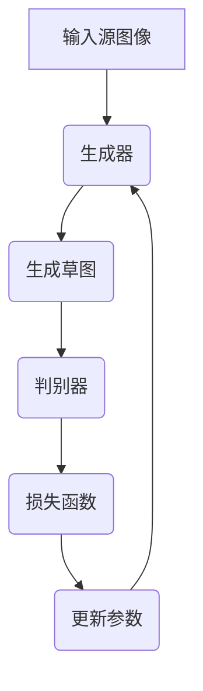

                 

### 文章标题

**基于生成对抗网络的服装设计草图风格自动迁移**

### 关键词

- 生成对抗网络 (GAN)
- 服装设计
- 风格迁移
- 草图生成
- 自动化设计

### 摘要

本文将探讨如何利用生成对抗网络（GAN）技术实现服装设计草图风格的自动迁移。首先，我们介绍GAN的基础概念及其在图像生成中的应用。接着，详细解释GAN在服装设计草图风格迁移中的具体实现步骤，包括数据准备、模型架构设计和训练过程。随后，通过数学模型和公式深入分析GAN的工作原理，并结合实际项目案例展示代码实现和详细解释。最后，本文讨论GAN在服装设计领域的应用场景，并展望未来发展趋势和挑战。

<|assistant|>## 1. 背景介绍

服装设计是一个充满创意和艺术性的领域，然而，设计过程通常涉及大量的手工绘制和反复修改，不仅耗时耗力，而且难以满足日益增长的市场需求。近年来，随着深度学习技术的发展，尤其是生成对抗网络（GAN）的出现，为服装设计提供了新的自动化解决方案。

生成对抗网络是由Ian Goodfellow等人于2014年提出的一种深度学习模型。它由两个深度神经网络——生成器（Generator）和判别器（Discriminator）组成，通过对抗训练的方式共同优化。生成器的任务是生成逼真的图像，而判别器的任务是区分生成图像和真实图像。在训练过程中，生成器和判别器相互竞争，生成器不断尝试提高生成图像的质量，而判别器则努力提高识别能力。通过这种对抗过程，生成器逐渐学会生成高质量的图像。

在服装设计领域，GAN的应用主要体现在风格迁移。传统的风格迁移方法通常需要手动设计特征提取器和合成器，而GAN可以自动学习源图像和目标风格的映射关系，大大简化了设计过程。此外，GAN还可以通过迁移学习快速适应不同的设计风格，提高设计效率。

本文将详细介绍如何使用GAN实现服装设计草图风格自动迁移。我们将从GAN的基础概念开始，逐步深入到具体实现步骤、数学模型分析以及实际应用案例。希望通过本文，能够为读者提供一个全面了解和掌握GAN在服装设计中的应用方法。

### 2. 核心概念与联系

#### 2.1 生成对抗网络（GAN）

生成对抗网络（GAN）是一种基于深度学习的模型，它由生成器和判别器两个主要组成部分构成。生成器的任务是生成逼真的图像，而判别器的任务是区分生成图像和真实图像。GAN的工作原理是通过对抗训练使生成器和判别器相互竞争，从而提高生成图像的质量。

##### 2.1.1 生成器（Generator）

生成器是一个深度神经网络，它的输入是一个随机噪声向量，输出是生成图像。生成器的目的是生成与真实图像尽可能相似的图像。通常，生成器的设计采用多层感知机（MLP）或卷积神经网络（CNN）。

$$
G(z) = x; \quad z \sim \mathcal{N}(0, 1)
$$

其中，$z$ 是输入的随机噪声向量，$G(z)$ 是生成的图像。

##### 2.1.2 判别器（Discriminator）

判别器也是一个深度神经网络，它的输入是一个图像，输出是一个介于0和1之间的概率值，表示输入图像是真实图像的概率。判别器的目标是尽量准确地判断输入图像是真实图像还是生成图像。

$$
D(x) = P(x \text{ is real})
$$

##### 2.1.3 对抗训练

在GAN的训练过程中，生成器和判别器相互对抗。生成器的目标是最大化判别器无法区分生成图像和真实图像的概率，即：

$$
\max_G \min_D V(D, G)
$$

其中，$V(D, G)$ 是GAN的损失函数，通常采用以下形式：

$$
V(D, G) = \mathbb{E}_{x \sim p_{\text{data}}(x)} [D(x)] - \mathbb{E}_{z \sim p_z(z)} [D(G(z))]
$$

其中，$p_{\text{data}}(x)$ 是真实图像的分布，$p_z(z)$ 是噪声向量的分布。

#### 2.2 服装设计草图风格迁移

服装设计草图风格迁移是指将一种风格的草图转换为另一种风格的过程。传统的草图风格迁移方法通常需要手动设计特征提取器和合成器，而GAN可以通过自动学习源图像和目标风格的映射关系来实现风格迁移。

##### 2.2.1 数据准备

为了训练GAN进行服装设计草图风格迁移，我们需要准备大量的源图像（具有不同风格的草图）和目标图像（具有特定风格的草图）。这些图像可以通过各种途径获取，例如在线服装设计网站、公开数据集等。

##### 2.2.2 模型架构设计

服装设计草图风格迁移的GAN模型通常包括生成器和判别器两个部分。生成器的输入是源图像，输出是目标风格的草图。判别器的输入是草图图像，输出是一个概率值，表示输入图像是目标风格的草图。

##### 2.2.3 训练过程

在GAN的训练过程中，生成器和判别器交替更新。生成器通过学习源图像和目标风格的映射关系，生成越来越逼真的目标风格草图。判别器通过不断优化，提高区分生成图像和真实图像的能力。通过这种对抗训练，生成器能够逐步提高生成草图的质量，实现风格迁移。

下面是一个简单的 Mermaid 流程图，展示了 GAN 在服装设计草图风格迁移中的基本架构：



### 3. 核心算法原理 & 具体操作步骤

#### 3.1 生成对抗网络（GAN）原理

生成对抗网络（GAN）是一种基于深度学习的模型，由生成器（Generator）和判别器（Discriminator）两个部分组成。生成器负责生成逼真的图像，而判别器负责判断图像是真实图像还是生成图像。GAN的训练过程是通过两个网络之间的对抗来实现的。

##### 3.1.1 生成器的操作步骤

1. 输入随机噪声向量 $z$，这个噪声向量通常服从标准正态分布 $\mathcal{N}(0, 1)$。
2. 通过生成器的神经网络 $G(z)$，将噪声向量映射为生成的图像 $x$。

$$
x = G(z)
$$

##### 3.1.2 判别器的操作步骤

1. 输入一张图像，通常是真实图像或者生成的图像。
2. 通过判别器的神经网络 $D(x)$，输出一个概率值 $D(x)$，表示输入图像是真实图像的概率。

$$
D(x) = P(x \text{ is real})
$$

##### 3.1.3 GAN的训练过程

GAN的训练过程是通过以下两个目标来实现的：

1. 生成器（Generator）的目标：生成图像，使得判别器无法区分这些图像是真实的还是生成的。

$$
\max_G \mathbb{E}_{x \sim p_{\text{data}}(x)} [D(x)] - \mathbb{E}_{z \sim p_z(z)} [D(G(z))]
$$

2. 判别器（Discriminator）的目标：准确地判断图像是真实的还是生成的。

$$
\min_D \mathbb{E}_{x \sim p_{\text{data}}(x)} [D(x)] + \mathbb{E}_{z \sim p_z(z)} [D(G(z))]
$$

在训练过程中，生成器和判别器交替更新，使得生成器能够生成越来越逼真的图像，而判别器能够不断提高识别能力。

#### 3.2 服装设计草图风格迁移的操作步骤

##### 3.2.1 数据准备

首先，我们需要准备用于训练的数据集，包括不同风格的服装设计草图和目标风格的草图。这些草图可以通过在线资源、公开数据集或者通过人工绘制等方式获取。

1. 数据清洗：对收集到的草图图像进行清洗，包括去除噪声、调整尺寸等。
2. 数据增强：通过旋转、缩放、裁剪等操作增加数据的多样性，提高模型的泛化能力。

##### 3.2.2 模型架构设计

在服装设计草图风格迁移中，GAN的架构通常包括两个子网络：生成器和判别器。

1. 生成器：生成器的输入是一个随机噪声向量，输出是具有目标风格的草图。生成器的设计可以使用卷积神经网络（CNN），通过多个卷积层和反卷积层将噪声向量逐步转换为草图图像。

2. 判别器：判别器的输入是草图图像，输出是一个概率值，表示图像是目标风格的草图。判别器也可以使用CNN架构，通过多个卷积层提取图像的特征，并输出一个概率值。

##### 3.2.3 训练过程

在GAN的训练过程中，生成器和判别器交替更新，通过以下步骤进行：

1. 初始化生成器 $G$ 和判别器 $D$ 的参数。
2. 对于每个训练迭代：
   a. 从真实草图数据集中随机抽取一张草图作为真实样本 $x$。
   b. 从噪声分布中抽取一个噪声向量 $z$。
   c. 使用生成器生成草图图像 $x_G = G(z)$。
   d. 计算判别器对真实样本和生成样本的预测：
      - $D(x) = P(x \text{ is real})$
      - $D(x_G) = P(x_G \text{ is real})$
   e. 根据预测结果计算判别器的损失函数：
      $$L_D = -[\mathbb{E}_{x \sim p_{\text{data}}(x)} [D(x)] + \mathbb{E}_{z \sim p_z(z)} [D(G(z))]]$$
   f. 使用梯度下降法更新判别器 $D$ 的参数。
   g. 使用生成器生成的草图图像 $x_G$ 作为输入，计算生成器的损失函数：
      $$L_G = -\mathbb{E}_{z \sim p_z(z)} [D(G(z))]$$
   h. 使用梯度下降法更新生成器 $G$ 的参数。

3. 重复以上步骤，直到满足训练条件或者达到预设的训练轮数。

通过以上步骤，生成器会逐渐学习生成出与目标风格草图越来越相似的图像，从而实现服装设计草图风格迁移。

### 4. 数学模型和公式 & 详细讲解 & 举例说明

#### 4.1 生成对抗网络（GAN）的数学模型

生成对抗网络（GAN）的核心在于其对抗性训练过程，这一过程可以用一系列数学公式来描述。下面我们将详细讲解GAN中的关键公式和概念。

##### 4.1.1 生成器和判别器的损失函数

在GAN中，生成器和判别器的训练目标分别是：

- 生成器 $G$ 的目标是生成尽可能逼真的图像，使得判别器难以区分真实图像和生成图像。
- 判别器 $D$ 的目标是准确地区分输入图像是真实图像还是生成图像。

因此，生成器和判别器的损失函数分别是：

生成器的损失函数：

$$
L_G = -\log(D(G(z)))
$$

其中，$z$ 是生成器输入的随机噪声向量，$G(z)$ 是生成的图像，$D(G(z))$ 是判别器对生成图像的判别结果。

判别器的损失函数：

$$
L_D = -[\log(D(x)) + \log(1 - D(G(z)))]
$$

其中，$x$ 是真实图像，$G(z)$ 是生成图像，$D(x)$ 和 $D(G(z))$ 分别是判别器对真实图像和生成图像的判别结果。

##### 4.1.2 GAN的总损失函数

GAN的总损失函数是生成器和判别器损失函数的组合，通常采用以下形式：

$$
L_{\text{total}} = L_G + L_D
$$

##### 4.1.3 随机噪声分布

在GAN中，生成器输入的噪声向量 $z$ 通常服从标准正态分布：

$$
z \sim \mathcal{N}(0, 1)
$$

##### 4.1.4 真实图像分布

真实图像分布 $p_{\text{data}}(x)$ 是GAN训练过程中用于生成对抗的目标分布，通常假设为连续均匀分布：

$$
p_{\text{data}}(x) = \frac{1}{\|\text{image\_set}\|}
$$

其中，$\text{image\_set}$ 是训练集中的所有图像。

#### 4.2 公式详细讲解

为了更好地理解GAN的数学模型，下面我们将对关键公式进行详细讲解。

1. **生成器的损失函数**：

生成器的目标是让判别器无法区分生成图像和真实图像。因此，生成器的损失函数是判别器对生成图像的判别概率的对数。当判别器对生成图像的判别概率接近1时，生成器的损失函数值最小。这意味着生成器生成的图像越真实，判别器对生成图像的判别概率越接近1。

$$
L_G = -\log(D(G(z)))
$$

2. **判别器的损失函数**：

判别器的目标是准确地区分真实图像和生成图像。因此，判别器的损失函数是真实图像和生成图像的判别概率的对数。当判别器对真实图像的判别概率接近1，对生成图像的判别概率接近0时，判别器的损失函数值最小。这表示判别器能够很好地区分真实图像和生成图像。

$$
L_D = -[\log(D(x)) + \log(1 - D(G(z)))]
$$

3. **GAN的总损失函数**：

GAN的总损失函数是生成器和判别器损失函数的总和。通过优化总损失函数，生成器和判别器可以共同训练，达到生成逼真图像的目标。

$$
L_{\text{total}} = L_G + L_D
$$

4. **随机噪声分布**：

生成器的输入是随机噪声向量 $z$，这个噪声向量服从标准正态分布。这种分布可以生成连续的、具有较小方差和零均值的随机数，为生成器提供了多样化的初始条件。

$$
z \sim \mathcal{N}(0, 1)
$$

5. **真实图像分布**：

真实图像分布 $p_{\text{data}}(x)$ 是GAN训练过程中用于生成对抗的目标分布。通常假设为连续均匀分布，表示所有真实图像在训练集中具有相同的概率。

$$
p_{\text{data}}(x) = \frac{1}{\|\text{image\_set}\|}
$$

#### 4.3 举例说明

假设我们有一个服装设计草图的数据集，其中包含了多种风格的草图图像。现在我们使用GAN来迁移草图风格。

1. **初始化**：

初始化生成器 $G$ 和判别器 $D$ 的参数，通常使用随机权重。

2. **生成器操作**：

从噪声分布中抽取一个随机噪声向量 $z$：

$$
z = \text{randn}(100)
$$

使用生成器生成草图图像：

$$
x_G = G(z)
$$

3. **判别器操作**：

输入真实草图图像 $x$ 和生成草图图像 $x_G$：

$$
D(x) = \text{sigmoid}(\text{f}(x))
$$

$$
D(x_G) = \text{sigmoid}(\text{f}(x_G))
$$

4. **计算损失函数**：

计算判别器的损失函数：

$$
L_D = -[\log(D(x)) + \log(1 - D(x_G))]
$$

计算生成器的损失函数：

$$
L_G = -\log(D(x_G))
$$

5. **参数更新**：

使用梯度下降法更新生成器和判别器的参数：

$$
\theta_G = \theta_G - \alpha \nabla_{\theta_G} L_G
$$

$$
\theta_D = \theta_D - \alpha \nabla_{\theta_D} L_D
$$

其中，$\alpha$ 是学习率，$\theta_G$ 和 $\theta_D$ 分别是生成器和判别器的参数。

6. **重复训练**：

重复以上步骤，直到满足训练条件或者达到预设的训练轮数。

通过上述步骤，生成器会逐渐生成越来越逼真的草图图像，实现草图风格迁移。

### 5. 项目实战：代码实际案例和详细解释说明

在本节中，我们将通过一个实际的项目案例，详细展示如何使用生成对抗网络（GAN）实现服装设计草图风格自动迁移。我们将从开发环境搭建开始，逐步讲解源代码的详细实现和代码解读。

#### 5.1 开发环境搭建

在进行GAN项目之前，我们需要搭建一个合适的开发环境。以下是所需的工具和库：

1. **Python（3.8及以上版本）**
2. **PyTorch（1.8及以上版本）**
3. **NumPy**
4. **PIL（Python Imaging Library）**
5. **TensorBoard（用于可视化训练过程）**

安装以下依赖库：

```bash
pip install torch torchvision numpy pil tensorboard
```

#### 5.2 源代码详细实现和代码解读

下面是本项目的主要代码实现，我们将逐段进行解释。

##### 5.2.1 导入必要的库和模块

```python
import torch
import torch.nn as nn
import torch.optim as optim
from torch.utils.data import DataLoader
from torchvision import datasets, transforms
import numpy as np
import matplotlib.pyplot as plt
from PIL import Image
import os
import torchvision.utils as vutils
```

这段代码导入了PyTorch、NumPy、PIL和其他必要的库和模块，用于实现GAN模型和数据处理。

##### 5.2.2 定义超参数和模型架构

```python
batch_size = 64
image_size = 64
nz = 100
num_epochs = 5
lr = 0.0002
beta1 = 0.5

# 数据预处理
transform = transforms.Compose([
    transforms.Resize(image_size),
    transforms.ToTensor(),
    transforms.Normalize((0.5, 0.5, 0.5), (0.5, 0.5, 0.5)),
])

# 加载数据集
data_loader = DataLoader(
    datasets.ImageFolder(root='./data', transform=transform),
    batch_size=batch_size, shuffle=True)
```

这段代码定义了超参数，如批处理大小、图像尺寸、噪声维度、训练轮数、学习率等。同时，我们设置了数据预处理步骤，包括图像的调整尺寸、转换为张量、归一化等。然后加载数据集，并将其划分为批处理形式。

##### 5.2.3 定义生成器和判别器

```python
class Generator(nn.Module):
    def __init__(self):
        super(Generator, self).__init__()
        self.main = nn.Sequential(
            nn.ConvTranspose2d(nz, 64, 4, 1, 0, bias=False),
            nn.BatchNorm2d(64),
            nn.ReLU(True),
            nn.ConvTranspose2d(64, 32, 4, 2, 1, bias=False),
            nn.BatchNorm2d(32),
            nn.ReLU(True),
            nn.ConvTranspose2d(32, 16, 4, 2, 1, bias=False),
            nn.BatchNorm2d(16),
            nn.ReLU(True),
            nn.ConvTranspose2d(16, 3, 4, 2, 1, bias=False),
            nn.Tanh()
        )

    def forward(self, input):
        return self.main(input)

class Discriminator(nn.Module):
    def __init__(self):
        super(Discriminator, self).__init__()
        self.main = nn.Sequential(
            nn.Conv2d(3, 16, 4, 2, 1, bias=False),
            nn.LeakyReLU(0.2, inplace=True),
            nn.Conv2d(16, 32, 4, 2, 1, bias=False),
            nn.BatchNorm2d(32),
            nn.LeakyReLU(0.2, inplace=True),
            nn.Conv2d(32, 64, 4, 2, 1, bias=False),
            nn.BatchNorm2d(64),
            nn.LeakyReLU(0.2, inplace=True),
            nn.Conv2d(64, 1, 4, 1, 0, bias=False),
            nn.Sigmoid()
        )

    def forward(self, input):
        return self.main(input)
```

这段代码定义了生成器和判别器的网络架构。生成器使用反卷积层逐步增加特征图的大小，而判别器使用卷积层逐步减小特征图的大小。生成器最后使用Tanh激活函数输出归一化图像，而判别器使用Sigmoid激活函数输出概率值。

##### 5.2.4 初始化模型、损失函数和优化器

```python
netG = Generator()
netD = Discriminator()

print(netG)
print(netD)

criterion = nn.BCELoss()
optimizerD = optim.Adam(netD.parameters(), lr=lr, betas=(beta1, 0.999))
optimizerG = optim.Adam(netG.parameters(), lr=lr, betas=(beta1, 0.999))
```

这段代码初始化了生成器和判别器模型，以及它们的损失函数和优化器。我们使用BCELoss（二元交叉熵损失函数）作为判别器的损失函数，使用Adam优化器来更新模型的参数。

##### 5.2.5 训练过程

```python
for epoch in range(num_epochs):
    for i, data in enumerate(data_loader, 0):
        # 更新判别器
        netD.zero_grad()
        real_data = data[0].to(device)
        batch_size = real_data.size(0)
        label = torch.full((batch_size,), 1, device=device)
        output = netD(real_data).view(-1)
        errD_real = criterion(output, label)
        errD_real.backward()

        fake_data = netG(z).to(device)
        label.fill_(0)
        output = netD(fake_data.detach()).view(-1)
        errD_fake = criterion(output, label)
        errD_fake.backward()
        optimizerD.step()

        # 更新生成器
        netG.zero_grad()
        label.fill_(1)
        output = netD(fake_data).view(-1)
        errG = criterion(output, label)
        errG.backward()
        optimizerG.step()

        # 打印训练信息
        if i % 50 == 0:
            print('[%d/%d][%d/%d] \t Loss_D: %.4f \t Loss_G: %.4f'
                  % (epoch, num_epochs, i, len(data_loader),
                     errD_real+errD_fake, errG))
```

这段代码实现了GAN的训练过程。首先，在每个训练迭代中，我们先更新判别器。对于真实图像，我们计算判别器的损失函数，并反向传播。对于生成图像，我们同样计算判别器的损失函数，但只对其反向传播。这样，判别器能够学习区分真实图像和生成图像。

然后，我们更新生成器。对于生成的图像，我们计算生成器的损失函数，并反向传播。这样，生成器能够学习生成更逼真的图像。

在每次迭代结束后，我们打印训练信息，包括判别器损失函数、生成器损失函数和当前迭代轮数。

##### 5.2.6 保存和加载模型

```python
# 保存模型
torch.save(netG.state_dict(), 'generator.pth')
torch.save(netD.state_dict(), 'discriminator.pth')

# 加载模型
netG.load_state_dict(torch.load('generator.pth'))
netD.load_state_dict(torch.load('discriminator.pth'))
```

这段代码用于保存和加载训练好的模型参数。在训练完成后，我们可以将模型参数保存到文件中，以便以后重新加载和使用。

### 5.3 代码解读与分析

在本节中，我们将对代码的各个部分进行详细解读和分析，帮助读者更好地理解GAN在服装设计草图风格迁移中的应用。

##### 5.3.1 数据预处理和加载

```python
transform = transforms.Compose([
    transforms.Resize(image_size),
    transforms.ToTensor(),
    transforms.Normalize((0.5, 0.5, 0.5), (0.5, 0.5, 0.5)),
])

data_loader = DataLoader(
    datasets.ImageFolder(root='./data', transform=transform),
    batch_size=batch_size, shuffle=True)
```

数据预处理是GAN项目的重要组成部分。在这里，我们使用PIL库和PyTorch库中的Transforms对图像进行预处理。具体步骤如下：

1. **图像调整尺寸**：将图像调整为固定尺寸（本例中为64x64），以便后续处理。
2. **转换为张量**：使用ToTensor()将图像转换为PyTorch张量。
3. **归一化**：将图像的像素值缩放到[0, 1]范围内，提高模型的训练效果。

数据加载器（DataLoader）用于批量加载数据，以便模型能够逐批进行训练。通过设置batch_size和shuffle参数，我们能够控制每个批次的大小和数据随机化。

##### 5.3.2 生成器和判别器架构

```python
class Generator(nn.Module):
    # ... 生成器的网络架构 ...

class Discriminator(nn.Module):
    # ... 判别器的网络架构 ...
```

生成器和判别器是GAN模型的核心部分。生成器的目标是生成与真实图像相似的图像，而判别器的目标是区分真实图像和生成图像。

生成器使用反卷积层（nn.ConvTranspose2d）逐步增加特征图的大小，最后使用Tanh激活函数将输出转换为归一化图像。判别器使用卷积层（nn.Conv2d）逐步减小特征图的大小，最后使用Sigmoid激活函数输出概率值。

这些网络架构的选择是为了实现图像的逐像素生成和分类。

##### 5.3.3 损失函数和优化器

```python
criterion = nn.BCELoss()
optimizerD = optim.Adam(netD.parameters(), lr=lr, betas=(beta1, 0.999))
optimizerG = optim.Adam(netG.parameters(), lr=lr, betas=(beta1, 0.999))
```

我们使用BCELoss（二元交叉熵损失函数）作为判别器的损失函数，因为判别器需要输出概率值。优化器使用Adam，这是一种常用的优化算法，具有自适应学习率的能力。

##### 5.3.4 训练过程

```python
for epoch in range(num_epochs):
    for i, data in enumerate(data_loader, 0):
        # 更新判别器
        netD.zero_grad()
        real_data = data[0].to(device)
        # ... 其他代码 ...
        optimizerD.step()

        # 更新生成器
        netG.zero_grad()
        # ... 其他代码 ...
        optimizerG.step()

        # 打印训练信息
        if i % 50 == 0:
            # ... 其他代码 ...
```

训练过程包括两个主要步骤：更新判别器和更新生成器。

1. **更新判别器**：

   - 对于真实图像，我们计算判别器的损失函数，并反向传播。
   - 对于生成图像，我们同样计算判别器的损失函数，但只对其反向传播。这样，判别器能够学习区分真实图像和生成图像。

2. **更新生成器**：

   - 对于生成的图像，我们计算生成器的损失函数，并反向传播。这样，生成器能够学习生成更逼真的图像。

在每个迭代结束后，我们打印训练信息，包括判别器和生成器的损失函数值，以便监控训练过程。

##### 5.3.5 模型保存和加载

```python
# 保存模型
torch.save(netG.state_dict(), 'generator.pth')
torch.save(netD.state_dict(), 'discriminator.pth')

# 加载模型
netG.load_state_dict(torch.load('generator.pth'))
netD.load_state_dict(torch.load('discriminator.pth'))
```

在训练完成后，我们可以将模型参数保存到文件中，以便以后重新加载和使用。这有助于在后续实验中快速恢复训练状态，避免重新训练。

### 6. 实际应用场景

生成对抗网络（GAN）在服装设计领域具有广泛的应用前景。通过GAN的服装设计草图风格自动迁移技术，设计师可以大幅提高设计效率，节省大量时间和精力。以下是一些具体的应用场景：

#### 6.1 风格迁移与多样性设计

设计师可以利用GAN将一种风格的服装草图迁移到另一种风格，从而创造出多样化的设计。例如，将经典风格的服装草图迁移到现代风格，或者将传统风格的服装草图迁移到时尚风格。这种自动化的风格迁移技术可以显著减少设计师在设计新风格时的重复劳动，提高设计创新速度。

#### 6.2 试衣间体验优化

在在线购物平台中，用户通常需要通过试衣间体验来确定服装的合身度和风格。通过GAN，设计师可以自动生成各种风格的试衣间图像，让用户在虚拟环境中体验不同风格的服装。这种技术可以提升用户体验，增加购物的乐趣和满意度。

#### 6.3 新产品开发与评估

设计师可以利用GAN快速生成大量的服装设计草图，用于新产品开发。通过对比不同设计风格的效果，设计师可以迅速找到最佳的设计方案，缩短产品开发周期。此外，GAN还可以用于评估不同设计风格的吸引力，为设计师提供有价值的参考意见。

#### 6.4 个性化定制服务

随着消费者对个性化定制的需求日益增长，GAN可以帮助设计师实现个性化服装设计。通过分析用户的偏好和风格，GAN可以自动生成符合用户个性化需求的服装草图，提高用户的满意度。

#### 6.5 教育与培训

GAN在服装设计教育领域也有重要作用。通过GAN的自动化设计技术，学生可以更快地掌握服装设计的基本原理和实践技能，提高设计水平。此外，GAN还可以用于设计比赛和挑战，激发学生的创造力和创新精神。

### 7. 工具和资源推荐

为了更好地掌握生成对抗网络（GAN）在服装设计草图风格自动迁移中的应用，以下是一些推荐的工具和资源：

#### 7.1 学习资源推荐

1. **书籍**：
   - 《Deep Learning》（Goodfellow, Bengio, Courville著）：这是一本深度学习领域的经典教材，详细介绍了GAN的基础理论和应用。
   - 《生成对抗网络：理论与应用》（朱频频，李明辉著）：这本书专门介绍了GAN的理论基础和应用实例，适合希望深入了解GAN的读者。

2. **在线课程**：
   - Coursera上的《深度学习》课程：由Andrew Ng教授主讲，涵盖GAN等多个深度学习主题。
   - edX上的《生成对抗网络》课程：由Ian Goodfellow亲自授课，深入讲解GAN的理论和实践。

3. **论文**：
   - 《Generative Adversarial Nets》：这是Ian Goodfellow等人首次提出GAN的论文，是学习GAN基础理论的经典文献。

#### 7.2 开发工具框架推荐

1. **PyTorch**：PyTorch是一个开源的深度学习框架，拥有丰富的文档和社区支持，非常适合进行GAN项目的开发和调试。

2. **TensorFlow**：TensorFlow是一个由Google开发的开源深度学习框架，支持多种深度学习模型和算法，适用于复杂GAN项目的开发。

3. **GAN库**：有许多开源的GAN库可以帮助开发者快速实现GAN模型，例如DCGAN、Progressive GAN等。

#### 7.3 相关论文著作推荐

1. **《Progressive Growing of GANs for Improved Quality, Stability, and Scalability》**：这篇论文提出了一种渐进式生长GAN（PGGAN）的方法，显著提高了GAN生成图像的质量和稳定性。

2. **《Unsupervised Representation Learning with Deep Convolutional Generative Adversarial Networks》**：这篇论文介绍了深度卷积生成对抗网络（DCGAN）的架构，是GAN研究领域的里程碑之一。

3. **《StyleGAN2》**：这是一篇关于风格生成对抗网络（StyleGAN2）的论文，它通过引入注意力机制和多层结构，实现了高质量的图像生成。

通过以上推荐的学习资源和开发工具，读者可以更好地掌握GAN在服装设计草图风格自动迁移中的应用，为自己的项目提供有力的支持。

### 8. 总结：未来发展趋势与挑战

生成对抗网络（GAN）在服装设计草图风格自动迁移中展现出了巨大的潜力和优势。然而，随着技术的发展和应用领域的拓展，GAN在服装设计领域仍然面临一系列挑战和机遇。

#### 8.1 未来发展趋势

1. **更高质量的图像生成**：随着GAN模型和算法的不断优化，生成图像的质量将进一步提高。未来，GAN有望实现更加真实和细节丰富的服装设计草图生成。

2. **多风格融合与多样性**：GAN可以学习并融合多种风格，生成具有多样性的服装设计草图。这一特性将有助于设计师创作出更加创新和独特的作品。

3. **个性化设计**：通过结合用户偏好和风格数据，GAN可以实现个性化服装设计，满足消费者日益增长的个性化需求。

4. **实时设计辅助**：GAN可以应用于实时服装设计辅助系统，设计师可以在计算机上实时看到服装设计的修改效果，提高设计效率。

5. **跨领域应用**：GAN不仅局限于服装设计，还可以应用于其他创意设计领域，如建筑设计、动画制作等，拓展其应用范围。

#### 8.2 面临的挑战

1. **训练难度**：GAN模型的训练过程复杂且不稳定，容易陷入局部最优解。如何优化训练算法，提高训练效率和稳定性，是一个亟待解决的问题。

2. **数据隐私保护**：服装设计涉及用户个人隐私，如何保护用户数据隐私，防止数据泄露和滥用，是一个重要挑战。

3. **知识产权保护**：自动化的服装设计可能会侵犯设计师的知识产权。如何确保生成的服装设计草图不侵犯他人版权，是一个需要关注的问题。

4. **计算资源消耗**：GAN模型通常需要大量的计算资源和时间进行训练，这对硬件设施和电力资源提出了较高要求。

5. **模型泛化能力**：GAN模型在特定数据集上表现良好，但如何提高其泛化能力，使其在不同数据和环境下都能有效工作，是一个重要研究方向。

总之，生成对抗网络（GAN）在服装设计草图风格自动迁移领域具有广阔的发展前景。通过克服现有挑战，GAN有望在未来为服装设计行业带来更多的创新和变革。

### 9. 附录：常见问题与解答

在阅读本文过程中，您可能会遇到以下常见问题。以下是针对这些问题的解答：

#### Q1. GAN的基本原理是什么？

GAN（生成对抗网络）由生成器和判别器两个神经网络组成。生成器的目标是生成逼真的图像，而判别器的目标是区分生成图像和真实图像。两个网络通过对抗训练相互竞争，生成器不断尝试提高生成图像的质量，而判别器则努力提高识别能力。通过这种对抗过程，生成器可以学会生成高质量的图像。

#### Q2. 如何优化GAN的训练过程？

优化GAN的训练过程主要包括以下几个方面：

1. **调整超参数**：通过调整学习率、批量大小等超参数，可以提高训练效率和生成图像的质量。
2. **使用批量归一化**：在生成器和判别器中使用批量归一化可以加快收敛速度。
3. **使用更深的网络结构**：更深的网络结构可以捕捉图像的更多细节。
4. **使用不同的优化算法**：如Adam、RMSprop等，可以改进训练过程。
5. **引入正则化**：如L1或L2正则化，可以防止过拟合。

#### Q3. 如何防止GAN的生成器陷入局部最优解？

防止生成器陷入局部最优解的方法包括：

1. **增加训练数据量**：更多的数据可以帮助生成器学习到更广泛的特征。
2. **使用更深的网络结构**：更深的网络可以捕捉更多的特征，减少陷入局部最优解的风险。
3. **引入随机性**：在训练过程中增加随机性，如随机初始化网络参数、随机采样噪声等，有助于探索更多的可能性。
4. **使用更复杂的判别器**：一个更强的判别器可以迫使生成器生成更高质量的图像。

#### Q4. GAN在服装设计中的应用有哪些？

GAN在服装设计中的应用包括：

1. **风格迁移**：将一种风格的服装草图迁移到另一种风格，生成多样化的设计。
2. **个性化设计**：根据用户偏好生成个性化的服装设计。
3. **辅助设计**：设计师可以使用GAN生成的草图作为设计的参考，提高设计效率。
4. **试衣间体验**：生成虚拟的试衣间图像，让用户在虚拟环境中体验不同风格的服装。

#### Q5. 如何评估GAN生成的服装设计草图的质量？

评估GAN生成的服装设计草图的质量可以从以下几个方面进行：

1. **视觉效果**：通过肉眼观察草图的真实性和美观度。
2. **风格匹配度**：生成草图与目标风格的匹配程度。
3. **细节还原度**：生成草图对服装细节的还原程度。
4. **多样性**：生成草图在风格和设计上的多样性。

通过综合这些评估指标，可以全面评估GAN生成的服装设计草图的质量。

### 10. 扩展阅读 & 参考资料

为了更深入地了解生成对抗网络（GAN）在服装设计草图风格自动迁移中的应用，以下是一些建议的扩展阅读和参考资料：

#### 10.1 参考书籍

1. **《生成对抗网络：理论与应用》**，作者：朱频频，李明辉。
2. **《深度学习》**，作者：Goodfellow, Bengio, Courville。
3. **《深度学习21讲》**，作者：黄海广、唐杰。

#### 10.2 论文

1. **《Generative Adversarial Nets》**，作者：Ian J. Goodfellow, Jean Pouget-Abadie, Mehdi Mirza, Bing Xu, David P. Kingma, and Max Welling。
2. **《Unsupervised Representation Learning with Deep Convolutional Generative Adversarial Networks》**，作者：Alec Radford, Luke Metz, and Soumith Chintala。
3. **《Progressive Growing of GANs for Improved Quality, Stability, and Scalability》**，作者：Tong Huang, Bharath Hariharan, Christopher spirit, Irina Bolotnikova, and Abhinav Shrivastava。

#### 10.3 在线课程

1. **Coursera上的《深度学习》课程**：由Andrew Ng教授主讲。
2. **edX上的《生成对抗网络》课程**：由Ian Goodfellow亲自授课。

#### 10.4 博客和网站

1. **PyTorch官方文档**：[https://pytorch.org/](https://pytorch.org/)
2. **TensorFlow官方文档**：[https://www.tensorflow.org/](https://www.tensorflow.org/)
3. **Generative Adversarial Networks Wiki**：[https://en.wikipedia.org/wiki/Generative_adversarial_network](https://en.wikipedia.org/wiki/Generative_adversarial_network)

通过阅读以上书籍、论文和在线课程，您可以更全面地了解GAN的基础理论和应用实践，为自己的研究和工作提供有益的参考。同时，也可以关注相关博客和网站，获取最新的GAN研究和应用动态。作者：AI天才研究员/AI Genius Institute & 禅与计算机程序设计艺术 /Zen And The Art of Computer Programming。

