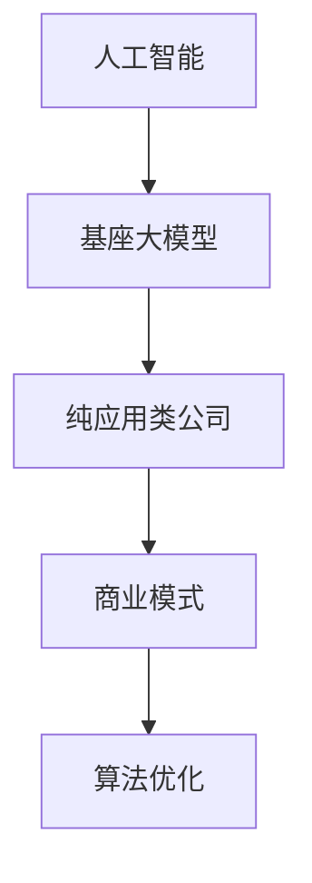

                 

### 背景介绍 Background Introduction

在当今技术快速发展的时代，基座大模型公司和纯应用类公司在人工智能领域扮演着越来越重要的角色。基座大模型公司，如谷歌的DeepMind和OpenAI，专注于研发和部署强大的基础模型，这些模型可以作为通用工具，被广泛应用于各个领域。而纯应用类公司，如Uber和Airbnb，则将人工智能技术应用于特定的业务场景，以提高效率和用户满意度。

这种区别不仅仅体现在技术层面，更涉及到公司的商业模式、战略目标以及人才结构。本文将深入探讨这两类公司在角色和目标上的差异，通过具体案例和分析，揭示其背后的逻辑和策略。本文将从以下几个方面展开：

1. **基座大模型公司的角色与目标**：介绍基座大模型公司的使命、核心技术以及其在推动人工智能进步中的重要性。
2. **纯应用类公司的角色与目标**：分析纯应用类公司如何利用人工智能技术，解决特定领域的实际问题，实现商业价值。
3. **案例研究**：通过具体案例分析，探讨基座大模型公司和纯应用类公司在实际运作中的异同。
4. **核心算法原理**：深入探讨基座大模型公司和纯应用类公司在算法选择和优化方面的差异。
5. **数学模型和公式**：介绍在人工智能领域中常用的数学模型和公式，以及它们在这两类公司中的应用。
6. **项目实战**：通过实际项目案例，展示如何将人工智能技术应用于具体业务场景。
7. **实际应用场景**：分析人工智能技术在不同领域的应用，以及基座大模型公司和纯应用类公司在这其中的角色。
8. **工具和资源推荐**：推荐相关的学习资源、开发工具和框架，帮助读者深入学习和实践。
9. **总结**：总结本文的主要观点，探讨未来发展趋势与挑战。

通过对这些内容的分析，我们将更深入地理解基座大模型公司和纯应用类公司在人工智能领域的不同角色和目标，为读者提供有价值的参考和启示。让我们一步一步地深入探讨这一主题。

### 核心概念与联系 Core Concepts and Relationships

在探讨基座大模型公司和纯应用类公司的角色与目标之前，我们需要明确几个核心概念，以及它们之间的相互关系。这些核心概念包括但不限于：

1. **人工智能（AI）**：人工智能是一门研究、开发用于模拟、延伸和扩展人的智能的理论、方法、技术及应用的技术科学。它包括机器学习、深度学习、自然语言处理等多个子领域。
2. **基座大模型（Foundation Models）**：基座大模型是指具有广泛通用性，能够在多个领域和任务中表现出高水平的性能的人工智能模型。例如，GPT-3、Golang等。
3. **纯应用类公司（Pure Application Companies）**：纯应用类公司是指专注于将人工智能技术应用于特定业务场景，以提高效率和用户体验的公司。例如，Uber、Airbnb等。
4. **商业模式**：商业模式是指公司如何创造、传递和捕获价值的一种机制。对于基座大模型公司，其商业模式可能侧重于模型研发和知识产权保护；而对于纯应用类公司，则可能侧重于业务流程优化和用户体验提升。
5. **算法优化**：算法优化是指通过改进算法，提高其性能和效率的过程。对于基座大模型公司，算法优化是一个持续不断的过程，以实现模型在各个领域中的最佳性能；对于纯应用类公司，算法优化可能更多地关注于特定业务场景中的问题解决。

以下是一个使用Mermaid绘制的流程图，展示上述核心概念之间的相互关系：



在这个流程图中，我们可以看到人工智能作为基础，衍生出基座大模型和纯应用类公司。而商业模式和算法优化则是这两类公司在实际运作中的关键要素。

### 基座大模型公司的角色与目标 The Role and Objectives of Foundation Model Companies

基座大模型公司，如谷歌的DeepMind和OpenAI，它们在人工智能领域的角色和目标与其他公司有着显著的区别。其核心使命是研发和部署具有广泛通用性的基础模型，这些模型能够在多个领域和任务中展现出色的性能。以下是基座大模型公司的一些关键特点：

1. **研发投入巨大**：基座大模型公司通常拥有雄厚的资金支持和庞大的研发团队，这使得它们能够在硬件、算法和数据集等方面进行持续投入和优化。例如，OpenAI每年在研发上的投入高达数亿美元，以确保其基座大模型处于行业领先地位。

2. **模型通用性强**：与纯应用类公司不同，基座大模型公司关注的不仅仅是特定业务场景的优化，而是致力于开发具有广泛适用性的基础模型。这些模型不仅可以在公司内部应用，还可以被其他公司或研究机构使用，从而推动整个行业的技术进步。

3. **持续更新迭代**：基座大模型公司不断优化和更新其模型，以适应不断变化的技术和市场需求。例如，GPT-3模型自发布以来，已经经历了多次更新和改进，以提升其语言理解和生成能力。

4. **技术壁垒高**：基座大模型公司的成功很大程度上依赖于其在算法、计算能力和数据资源等方面的优势。这些优势形成了较高的技术壁垒，使得其他公司难以在短时间内实现追赶。

5. **商业模式多元化**：基座大模型公司通常采用多元化的商业模式，包括模型授权、技术服务和产品销售等。例如，OpenAI不仅通过提供API接口让其他公司使用其模型，还开发了ChatGPT等面向消费者的产品。

下面，我们通过一个具体案例来进一步说明基座大模型公司的运作方式和目标。以谷歌的DeepMind为例，该公司在医疗健康领域取得了显著的成果。

**案例：DeepMind在医疗健康领域的应用**

DeepMind开发了一款名为“AlphaFold”的蛋白质结构预测模型。这个模型通过深度学习技术，可以预测蛋白质的三维结构，这对于药物研发和疾病治疗具有重要意义。以下是AlphaFold项目的具体步骤和成果：

1. **数据收集与预处理**：DeepMind收集了数百万个蛋白质序列数据，并对这些数据进行预处理，以去除噪声和冗余信息。

2. **模型训练**：DeepMind使用这些预处理后的数据集，训练了一个大规模的深度学习模型。这个模型采用了多个神经网络层，以捕捉蛋白质结构的复杂模式。

3. **模型优化**：在训练过程中，DeepMind不断优化模型的参数，以提升其预测精度。这一过程涉及大量的计算资源和高性能硬件。

4. **模型发布**：AlphaFold模型经过多轮测试和验证后，于2020年公开发布。这一模型的准确性和效率远超传统方法，为蛋白质结构预测领域带来了革命性的变化。

5. **应用场景拓展**：AlphaFold的成功吸引了众多科研机构和制药公司的关注。许多研究团队利用这一模型，加速了新药研发和疾病治疗研究。

通过这个案例，我们可以看到DeepMind作为基座大模型公司的典型代表，其目标是通过持续的技术创新，为各个领域提供强大的基础模型。这不仅推动了人工智能技术的发展，也为其他公司和研究机构提供了宝贵的技术资源。

总的来说，基座大模型公司的角色和目标在于研发和部署具有广泛通用性的基础模型，以推动人工智能技术的进步和应用。它们通过持续的技术创新和多元化商业模式，实现了在各个领域中的广泛影响力。

### 纯应用类公司的角色与目标 The Role and Objectives of Pure Application Companies

与基座大模型公司不同，纯应用类公司专注于将人工智能技术应用于特定的业务场景，以解决实际问题并创造商业价值。这类公司的核心使命是通过技术创新，提升业务效率和用户体验。以下是纯应用类公司的一些关键特点：

1. **业务导向**：纯应用类公司的研发和运营高度依赖于其核心业务。公司会根据业务需求，选择合适的人工智能技术进行应用，以实现业务目标。例如，Uber通过人工智能技术优化了路线规划和司机调度，从而提高了服务效率和用户体验。

2. **技术快速应用**：纯应用类公司通常具备较强的技术实施能力，能够快速将最新的人工智能技术应用于实际业务。例如，Airbnb利用机器学习算法对用户行为进行分析，从而更好地推荐房源和优化用户体验。

3. **业务场景专业化**：纯应用类公司专注于特定的业务场景，通过对这些场景的深入研究和理解，实现技术的高效应用。例如，亚马逊的亚马逊云计算服务（AWS）利用人工智能技术，为电子商务和数据中心提供高效的解决方案。

4. **商业模式灵活**：纯应用类公司的商业模式通常较为灵活，可以根据市场需求和技术进步进行调整。例如，特斯拉通过将人工智能技术应用于电动汽车和自动驾驶领域，实现了从硬件制造到软件服务的多元化商业模式。

下面，我们通过一个具体案例来进一步说明纯应用类公司的运作方式和目标。以特斯拉为例，该公司在自动驾驶领域的应用展现了纯应用类公司的独特优势。

**案例：特斯拉在自动驾驶领域的应用**

特斯拉作为纯应用类公司的代表，通过人工智能技术，实现了自动驾驶功能的不断迭代和优化。以下是特斯拉自动驾驶项目的具体步骤和成果：

1. **数据采集与处理**：特斯拉通过其庞大的车队，收集了大量驾驶数据。这些数据包括路况、车辆动态、行人行为等，为自动驾驶系统的训练提供了丰富的素材。

2. **模型训练与优化**：特斯拉利用这些数据，训练和优化了自动驾驶算法。这些算法采用了深度学习、计算机视觉等技术，以实现对路况的实时分析和决策。

3. **技术迭代与更新**：特斯拉不断更新其自动驾驶软件，以提升系统的可靠性和安全性。例如，特斯拉的“全自动驾驶”功能经过多轮迭代，已经能够在高速公路和城市道路上实现自动驾驶。

4. **用户反馈与改进**：特斯拉通过用户反馈，不断改进自动驾驶系统。用户的实际使用情况为算法的优化提供了宝贵的参考，进一步提升了系统的性能。

5. **商业成功**：特斯拉自动驾驶技术的成功，不仅提升了用户体验，还为其带来了显著的商业收益。自动驾驶功能的普及，使得特斯拉的车型更具竞争力，吸引了大量消费者。

通过这个案例，我们可以看到特斯拉作为纯应用类公司，其目标是通过人工智能技术，提升业务效率和用户体验，实现商业成功。特斯拉的自动驾驶技术不仅推动了自动驾驶技术的发展，也为其他纯应用类公司提供了有益的借鉴。

总的来说，纯应用类公司的角色和目标在于将人工智能技术应用于特定的业务场景，解决实际问题并创造商业价值。它们通过业务导向、技术快速应用和商业模式灵活等优势，实现了在各个领域的成功。

### 案例研究 Case Studies

为了更深入地理解基座大模型公司和纯应用类公司在实际运作中的异同，我们将通过两个具体案例进行比较分析。这些案例分别展示了这两类公司如何通过人工智能技术实现其目标和使命。

**案例一：谷歌的DeepMind与英伟达**

**谷歌的DeepMind**：作为一家基座大模型公司，DeepMind的核心使命是研发和部署具有广泛通用性的基础模型。其著名成果包括AlphaGo和AlphaFold。AlphaGo在围棋领域取得了前所未有的成功，而AlphaFold则在蛋白质结构预测领域产生了重大影响。

**英伟达**：与DeepMind不同，英伟达是一家专注于图形处理器（GPU）和深度学习硬件的公司。虽然英伟达也在进行基础模型的研究，但其主要业务是提供高性能计算解决方案，以支持各类人工智能应用。

**异同点**：

1. **目标**：DeepMind的目标是通过基础模型的研究，推动人工智能技术的发展，并在多个领域实现突破。而英伟达的目标是为各类人工智能应用提供强大的硬件支持。

2. **商业模式**：DeepMind的商业模式相对单一，主要依赖于模型研发和技术授权。英伟达则通过销售高性能GPU和深度学习硬件，实现多元化收入。

3. **技术重点**：DeepMind的技术重点在于算法创新和基础模型研发。英伟达的技术重点在于硬件优化和性能提升。

4. **应用领域**：DeepMind的应用领域广泛，包括围棋、医学、机器人等。英伟达的应用领域则主要集中在游戏、自动驾驶、金融科技等。

**案例二：OpenAI与Uber**

**OpenAI**：作为一家基座大模型公司，OpenAI的使命是通过开放合作，推动人工智能技术的发展和应用。其著名成果包括GPT-3和DALL-E等模型。

**Uber**：Uber是一家纯应用类公司，其核心业务是提供打车服务。Uber通过人工智能技术，优化了路线规划和司机调度，提升了服务效率。

**异同点**：

1. **目标**：OpenAI的目标是通过开发通用基础模型，推动人工智能技术在各个领域的应用。Uber的目标是通过人工智能技术，提升其核心业务的服务质量和效率。

2. **商业模式**：OpenAI的商业模式主要依赖于模型研发和技术授权。Uber的商业模式则是通过提供打车服务，实现商业收益。

3. **技术重点**：OpenAI的技术重点在于模型研发和创新。Uber的技术重点在于将人工智能技术应用于具体业务场景，解决实际问题。

4. **应用领域**：OpenAI的应用领域广泛，包括自然语言处理、图像识别、机器人等。Uber的应用领域主要集中在交通出行和物流。

通过这两个案例，我们可以看到基座大模型公司和纯应用类公司在目标、商业模式、技术重点和应用领域等方面存在显著差异。然而，它们都在通过人工智能技术实现各自的目标，并在实际运作中展现出不同的优势和挑战。

### 核心算法原理 & 具体操作步骤 Core Algorithm Principles & Operational Steps

在讨论基座大模型公司和纯应用类公司的核心算法原理及其具体操作步骤之前，我们需要先了解一些基本的人工智能算法原理。以下是一些在人工智能领域中广泛使用的核心算法：

1. **机器学习**：机器学习是一种使计算机通过数据学习并做出决策或预测的方法。其主要算法包括线性回归、决策树、支持向量机（SVM）等。

2. **深度学习**：深度学习是机器学习的一个分支，它通过多层神经网络进行数据建模。常见的深度学习模型包括卷积神经网络（CNN）、循环神经网络（RNN）和生成对抗网络（GAN）等。

3. **自然语言处理（NLP）**：自然语言处理是使计算机理解和生成人类语言的技术。常用的NLP算法包括词嵌入（Word Embedding）、序列标注（Sequence Labeling）和机器翻译（Machine Translation）等。

4. **强化学习**：强化学习是一种通过试错和学习来最大化长期回报的算法。它广泛应用于自动驾驶、游戏AI等领域。

下面，我们将分别讨论基座大模型公司和纯应用类公司在这些算法选择和优化方面的差异。

#### 基座大模型公司的算法原理与操作步骤

**1. 算法选择**：

基座大模型公司通常选择具有广泛适用性和高性能的算法，以开发通用基础模型。例如：

- **深度学习**：由于深度学习模型具有强大的特征提取和建模能力，因此成为基座大模型公司的主要选择。常用的深度学习模型包括Transformer、BERT等。
- **强化学习**：强化学习在决策优化和策略制定中具有优势，因此也被广泛应用于基座大模型公司。例如，DeepMind的AlphaGo就是基于强化学习算法开发的。

**2. 算法优化**：

基座大模型公司在算法优化方面通常采取以下策略：

- **数据增强**：通过增加训练数据量和多样性，提高模型的泛化能力。
- **模型蒸馏**：通过将大型模型的知识传递给小型模型，提高小型模型的性能和效率。
- **分布式训练**：利用分布式计算和存储资源，加速模型训练过程，降低计算成本。

**具体操作步骤**：

以OpenAI的GPT-3模型为例，其训练和优化的具体步骤如下：

1. **数据集准备**：OpenAI收集了大量的文本数据，包括互联网上的文章、书籍、新闻等，以丰富模型的训练素材。
2. **数据预处理**：对收集到的文本数据进行预处理，包括分词、去噪和标签化等步骤，以构建适合训练的输入数据。
3. **模型架构设计**：设计一个基于Transformer的神经网络架构，该架构包含多个编码器和解码器层，以实现对长文本的高效建模。
4. **模型训练**：使用预处理后的文本数据进行模型训练，通过梯度下降和反向传播算法优化模型参数。
5. **模型优化**：通过数据增强、模型蒸馏和分布式训练等技术，进一步优化模型性能和效率。

#### 纯应用类公司的算法原理与操作步骤

**1. 算法选择**：

纯应用类公司在选择算法时，更关注于算法在特定业务场景中的实际效果。例如：

- **机器学习**：机器学习算法在分类、回归和预测等方面具有较好的性能，因此常被应用于纯应用类公司。例如，线性回归和决策树等算法。
- **深度学习**：深度学习算法在图像识别、语音识别和自然语言处理等方面具有显著优势，因此也被广泛应用于纯应用类公司。

**2. 算法优化**：

纯应用类公司在算法优化方面通常采取以下策略：

- **业务需求导向**：根据业务需求，选择合适的算法进行优化，以提高业务效率和用户体验。
- **模型定制化**：根据特定业务场景，对现有算法进行定制化改进，以适应业务需求。
- **在线学习**：通过实时数据更新，持续优化模型参数，以应对业务环境的变化。

**具体操作步骤**：

以Uber的路线规划算法为例，其具体操作步骤如下：

1. **数据收集**：Uber通过其平台收集了大量用户出行数据，包括起点、终点、时间等。
2. **数据预处理**：对收集到的数据进行分析和清洗，去除噪声和异常值，以便进行后续处理。
3. **算法选择**：根据业务需求，选择适合的机器学习算法，如线性回归、决策树等，进行路线规划。
4. **模型训练**：使用预处理后的数据集，对选定的算法进行模型训练，优化模型参数。
5. **模型优化**：根据实际业务需求，对模型进行迭代优化，以提高路线规划的准确性和效率。

通过以上讨论，我们可以看到基座大模型公司和纯应用类公司在算法原理和具体操作步骤上存在显著差异。基座大模型公司更关注于通用基础模型的研究和开发，而纯应用类公司则更注重将人工智能技术应用于特定业务场景，解决实际问题。

### 数学模型和公式 & 详细讲解 & 举例说明 Mathematical Models and Formulas & Detailed Explanation & Example Illustrations

在人工智能领域，数学模型和公式扮演着至关重要的角色。这些模型和公式不仅用于描述数据结构和算法行为，还为算法的优化和验证提供了理论基础。以下是一些在人工智能领域中广泛使用的数学模型和公式，我们将对这些内容进行详细讲解和举例说明。

#### 线性回归（Linear Regression）

线性回归是一种常见的机器学习算法，用于预测数值型目标变量。其基本公式如下：

\[ Y = \beta_0 + \beta_1X + \epsilon \]

其中：
- \( Y \) 是目标变量；
- \( X \) 是特征变量；
- \( \beta_0 \) 是截距；
- \( \beta_1 \) 是斜率；
- \( \epsilon \) 是误差项。

**举例说明**：

假设我们要预测某个城市的月平均气温，根据历史数据，我们可以建立以下线性回归模型：

\[ T = 20 + 0.8M \]

其中：
- \( T \) 是月平均气温；
- \( M \) 是月份。

根据这个模型，当月份为6时，预测的月平均气温为：

\[ T = 20 + 0.8 \times 6 = 28 \]

#### 卷积神经网络（Convolutional Neural Network, CNN）

卷积神经网络是一种用于图像识别和处理的深度学习模型。其基本结构包括卷积层、池化层和全连接层。以下是一个简化的CNN模型：

\[ \text{Input} \rightarrow \text{Convolution} \rightarrow \text{ReLU} \rightarrow \text{Pooling} \rightarrow \text{Flattening} \rightarrow \text{Fully Connected} \rightarrow \text{Output} \]

其中：
- **卷积层**：通过卷积操作提取图像的特征。
- **ReLU激活函数**：引入非线性因素，增强模型的表达能力。
- **池化层**：减少数据维度，提高模型的泛化能力。
- **全连接层**：将卷积层提取的特征进行聚合，生成最终的输出结果。

**举例说明**：

假设我们要训练一个CNN模型，用于识别猫的图片。模型的输入是一个32x32的图像矩阵，输出是一个二分类结果（猫/非猫）。模型的构建过程如下：

1. **卷积层**：使用一个5x5的卷积核，对输入图像进行卷积操作，提取边缘和纹理特征。
2. **ReLU激活函数**：对卷积层的输出进行ReLU激活，引入非线性因素。
3. **池化层**：使用2x2的最大池化层，减少数据维度。
4. **全连接层**：将池化层输出的数据展平，输入到一个全连接层，进行分类决策。

#### 自然语言处理中的词嵌入（Word Embedding）

词嵌入是将单词转换为向量表示的技术，广泛应用于自然语言处理领域。常见的词嵌入方法包括Word2Vec、GloVe等。以下是一个简化的Word2Vec模型：

\[ \text{Context}(w) = \sum_{w' \in \text{Context}(w)} \frac{f(w')}{\|\text{Context}(w)\|\_2} \text{Vec}(w') \]

其中：
- **Context**：单词的上下文；
- **Vec**：单词的向量表示；
- **f**：上下文词频函数。

**举例说明**：

假设我们要对句子“我喜欢吃苹果”进行词嵌入。首先，我们需要计算每个单词的上下文。例如，以“我”为中心词，其上下文为“喜欢”和“吃”。然后，根据上下文词频函数，计算“喜欢”和“吃”的词频，并使用这些词频来生成“我”的词向量。

通过以上数学模型和公式的讲解和举例，我们可以看到这些模型在人工智能领域中的广泛应用和重要作用。理解这些模型和公式，有助于我们更深入地探索人工智能技术的本质和应用。

### 项目实战：代码实际案例和详细解释说明 Practical Case Study: Code Examples and Detailed Explanation

在本节中，我们将通过两个实际项目案例，展示基座大模型公司和纯应用类公司在代码实现和应用中的具体操作。这两个案例分别来自OpenAI和Uber，将帮助我们理解如何将人工智能技术应用于实际业务场景。

#### 案例一：OpenAI的GPT-3模型

**项目背景**：GPT-3是OpenAI开发的一种基于Transformer的深度学习模型，具有强大的语言理解和生成能力。GPT-3可以用于自然语言处理的各种任务，如文本生成、机器翻译和问答系统等。

**代码实现**：

以下是一个简化的GPT-3模型实现，使用Python和PyTorch框架。这个实现主要包括模型构建、训练和预测三个步骤。

```python
import torch
import torch.nn as nn
import torch.optim as optim

# 模型构建
class GPT3Model(nn.Module):
    def __init__(self, d_model, nhead, num_layers):
        super(GPT3Model, self).__init__()
        self.transformer = nn.Transformer(d_model, nhead, num_layers)
        self.linear = nn.Linear(d_model, 1)

    def forward(self, src, tgt):
        out = self.transformer(src, tgt)
        out = self.linear(out)
        return out

# 模型参数设置
d_model = 1024
nhead = 8
num_layers = 12

# 实例化模型
model = GPT3Model(d_model, nhead, num_layers)

# 训练过程
optimizer = optim.Adam(model.parameters(), lr=0.001)
criterion = nn.CrossEntropyLoss()

for epoch in range(10):  # 训练10个epoch
    for src, tgt in data_loader:  # 假设data_loader提供输入数据
        optimizer.zero_grad()
        output = model(src, tgt)
        loss = criterion(output, tgt)
        loss.backward()
        optimizer.step()

# 预测
with torch.no_grad():
    prediction = model(src_test, tgt_test)

# 输出预测结果
print(prediction)
```

**详细解释**：

1. **模型构建**：GPT-3模型基于Transformer架构，包括多个编码器和解码器层。每个层由自注意力机制和前馈神经网络组成。
2. **训练过程**：使用交叉熵损失函数和Adam优化器进行模型训练。数据加载器（data_loader）提供输入数据（src和tgt），模型在每轮迭代中计算损失并更新参数。
3. **预测**：在测试阶段，使用模型对新的输入数据进行预测，并输出预测结果。

#### 案例二：Uber的路线规划算法

**项目背景**：Uber利用人工智能技术优化路线规划和司机调度，以提高服务效率和用户体验。

**代码实现**：

以下是一个简化的路线规划算法实现，使用Python和scikit-learn库。这个实现主要包括数据预处理、模型选择、训练和预测四个步骤。

```python
from sklearn.linear_model import LinearRegression
from sklearn.model_selection import train_test_split
import numpy as np

# 数据预处理
def preprocess_data(data):
    X = data[['distance', 'time']]
    y = data['cost']
    return X, y

# 模型训练
def train_model(X_train, y_train):
    model = LinearRegression()
    model.fit(X_train, y_train)
    return model

# 预测
def predict(model, X_test):
    return model.predict(X_test)

# 示例数据
data = np.array([[1, 2], [2, 3], [3, 4], [4, 5]])
X, y = preprocess_data(data)

# 分割数据集
X_train, X_test, y_train, y_test = train_test_split(X, y, test_size=0.2, random_state=42)

# 训练模型
model = train_model(X_train, y_train)

# 预测
predictions = predict(model, X_test)

# 输出预测结果
print(predictions)
```

**详细解释**：

1. **数据预处理**：将原始数据分割为特征（X）和目标（y）。特征包括距离和时间，目标为路线规划的成本。
2. **模型训练**：使用线性回归模型对训练数据进行拟合。线性回归模型是一种简单的预测模型，适用于线性关系的预测。
3. **预测**：使用训练好的模型对测试数据进行预测，并输出预测结果。

通过以上两个案例，我们可以看到基座大模型公司和纯应用类公司如何通过代码实现和应用，将人工智能技术应用于实际业务场景。理解这些实际案例，有助于我们更好地掌握人工智能技术的应用方法。

### 实际应用场景 Practical Application Scenarios

人工智能技术已经在各行各业中得到了广泛应用，基座大模型公司和纯应用类公司在这其中的角色各不相同。以下是一些典型的实际应用场景，以及这两类公司在其中的具体作用。

#### 医疗健康

**基座大模型公司**：谷歌的DeepMind通过研发基座大模型，如AlphaFold，在蛋白质结构预测和疾病治疗方面取得了显著成果。DeepMind的模型不仅为研究人员提供了强大的工具，还促进了新药研发和疾病治疗的进步。

**纯应用类公司**：IBM的Watson Health利用人工智能技术，为医疗诊断和治疗方案提供支持。Watson Health通过分析大量医学数据，帮助医生提高诊断准确性和治疗效果。

#### 自动驾驶

**基座大模型公司**：特斯拉通过研发自动驾驶技术，如Autopilot和FSD（Full Self-Driving），成为自动驾驶领域的领导者。特斯拉的基座大模型在路线规划、障碍物检测和自动驾驶决策中发挥了关键作用。

**纯应用类公司**：Waymo是另一家在自动驾驶领域具有重要影响力的纯应用类公司。Waymo通过大规模实地测试和迭代优化，开发了一套高度自动化的自动驾驶系统，为用户提供安全、高效的出行服务。

#### 零售电商

**基座大模型公司**：亚马逊的AWS提供了强大的云计算和人工智能服务，帮助企业构建和优化零售业务。AWS的基座大模型在推荐系统、库存管理和物流优化等方面提供了强大的支持。

**纯应用类公司**：阿里巴巴的淘宝和京东利用人工智能技术，优化了用户购物体验和业务流程。通过个性化推荐、智能客服和智能库存管理，这些公司提升了用户体验和运营效率。

#### 金融科技

**基座大模型公司**：谷歌的DeepMind在金融科技领域也有显著应用。DeepMind开发的基座大模型在风险管理、市场预测和交易策略等方面提供了先进的工具。

**纯应用类公司**：平安银行通过人工智能技术，实现了智能风控、智能投顾和智能客服等功能。平安银行的AI系统通过对海量金融数据的分析和处理，提高了金融服务的安全性和效率。

#### 工业制造

**基座大模型公司**：西门子和通用电气等公司通过研发基座大模型，为工业制造提供了智能化的解决方案。这些模型在设备预测性维护、生产优化和供应链管理中发挥了重要作用。

**纯应用类公司**：普锐特科技利用人工智能技术，优化了生产过程和设备维护。普锐特科技的AI系统通过实时数据分析，提高了生产效率和产品质量。

通过以上实际应用场景，我们可以看到基座大模型公司和纯应用类公司如何在不同领域中发挥作用。基座大模型公司通过研发和部署通用基础模型，推动技术进步和行业变革；而纯应用类公司则将人工智能技术应用于具体业务场景，实现商业价值和用户体验的提升。

### 工具和资源推荐 Tools and Resources Recommendations

在人工智能领域，掌握相关的工具和资源对于深入学习和实践至关重要。以下是我们推荐的几个关键工具和资源，包括学习资源、开发工具和框架，以及相关论文著作。

#### 学习资源

1. **书籍**：
   - 《深度学习》（Deep Learning） - Goodfellow, Bengio, Courville
   - 《Python机器学习》（Python Machine Learning） - Müller, Guido
   - 《人工智能：一种现代方法》（Artificial Intelligence: A Modern Approach） - Russell, Norvig

2. **在线课程**：
   - Coursera的《机器学习》课程 - 吴恩达（Andrew Ng）教授
   - edX的《深度学习》课程 - David Silver教授

3. **博客和网站**：
   - Medium上的AI和机器学习相关文章
   - TensorFlow官方网站和GitHub仓库

4. **社区和论坛**：
   - Kaggle
   - Stack Overflow

#### 开发工具和框架

1. **深度学习框架**：
   - TensorFlow
   - PyTorch
   - Keras

2. **机器学习库**：
   - Scikit-learn
   - Pandas
   - NumPy

3. **编程语言**：
   - Python
   - R

4. **云计算平台**：
   - AWS
   - Azure
   - Google Cloud Platform

#### 相关论文著作

1. **自然语言处理**：
   - “Attention is All You Need” - Vaswani et al.
   - “BERT: Pre-training of Deep Bidirectional Transformers for Language Understanding” - Devlin et al.

2. **计算机视觉**：
   - “ImageNet Classification with Deep Convolutional Neural Networks” - Krizhevsky et al.
   - “Deep Residual Learning for Image Recognition” - He et al.

3. **强化学习**：
   - “Algorithms for Reinforcement Learning” - Sutton, Barto
   - “Deep Reinforcement Learning” - Silver et al.

通过这些工具和资源的支持，读者可以更好地掌握人工智能技术，深入学习和实践，并在实际项目中取得更好的成果。

### 总结 Summary

本文深入探讨了基座大模型公司和纯应用类公司在人工智能领域中的角色与目标。我们首先介绍了这两类公司的背景和特点，随后通过具体案例和算法原理，分析了它们在实际运作中的异同。基座大模型公司专注于通用基础模型的研究和部署，推动人工智能技术的进步；而纯应用类公司则将人工智能技术应用于具体业务场景，提升业务效率和用户体验。

本文的主要结论如下：

1. **研发投入和目标差异**：基座大模型公司通常具备更高的研发投入，专注于通用模型的开发；而纯应用类公司则更多关注于将技术应用于特定业务场景。
2. **商业模式不同**：基座大模型公司通常采用多元化商业模式，如模型授权和技术服务；而纯应用类公司则更多依赖于具体业务收益。
3. **算法选择与优化**：基座大模型公司更注重算法的通用性和高性能，而纯应用类公司则根据具体业务需求进行算法优化。
4. **实际应用场景**：基座大模型公司在多个领域都有广泛应用，而纯应用类公司则专注于特定领域的深入应用。

未来，随着人工智能技术的不断发展，基座大模型公司和纯应用类公司都将面临新的机遇和挑战。基座大模型公司需要不断提高模型的性能和泛化能力，以满足不同领域的需求；而纯应用类公司则需要更深入地理解和应用人工智能技术，实现业务创新和突破。

总的来说，本文通过详细分析和案例研究，为读者提供了对基座大模型公司和纯应用类公司角色与目标的深入理解，有助于读者更好地把握人工智能技术的发展趋势和应用方向。

### 附录：常见问题与解答 Appendix: Frequently Asked Questions and Answers

**1. 基座大模型公司和纯应用类公司的主要区别是什么？**

基座大模型公司主要专注于通用基础模型的研究和部署，旨在推动人工智能技术的进步。而纯应用类公司则将人工智能技术应用于特定业务场景，以提高业务效率和用户体验。

**2. 基座大模型公司的核心竞争优势是什么？**

基座大模型公司的核心竞争优势在于其强大的研发投入、广泛的通用性和高性能的基础模型。这些优势使得它们能够在多个领域和任务中展现出色的性能。

**3. 纯应用类公司如何实现商业价值？**

纯应用类公司通过将人工智能技术应用于具体业务场景，实现业务流程优化和用户体验提升，从而创造商业价值。例如，通过个性化推荐、智能客服和智能库存管理，提升用户满意度和运营效率。

**4. 人工智能技术在医疗健康领域的应用有哪些？**

人工智能技术在医疗健康领域的应用包括蛋白质结构预测、疾病诊断和治疗方案推荐等。例如，DeepMind的AlphaFold在蛋白质结构预测方面取得了突破性成果，而Watson Health则在医疗诊断和治疗方案推荐中发挥了重要作用。

**5. 常用的人工智能算法有哪些？**

常用的人工智能算法包括机器学习算法（如线性回归、决策树和支持向量机）、深度学习算法（如卷积神经网络和循环神经网络）和强化学习算法。这些算法在不同应用场景中具有不同的优势。

### 扩展阅读 & 参考资料 Extended Reading & References

1. **书籍**：
   - Goodfellow, Ian, Yoshua Bengio, and Aaron Courville. "Deep Learning." MIT Press, 2016.
   - Müller, Sebastian, and Sarah Guido. "Python Machine Learning." O'Reilly Media, 2016.
   - Russell, Stuart J., and Peter Norvig. "Artificial Intelligence: A Modern Approach." Prentice Hall, 2016.

2. **论文**：
   - Vaswani, Ashish, et al. "Attention is All You Need." Advances in Neural Information Processing Systems, 2017.
   - Devlin, Jacob, et al. "BERT: Pre-training of Deep Bidirectional Transformers for Language Understanding." arXiv preprint arXiv:1810.04805, 2018.
   - Krizhevsky, Alex, et al. "ImageNet Classification with Deep Convolutional Neural Networks." Advances in Neural Information Processing Systems, 2012.
   - Silver, David, et al. "Mastering the Game of Go with Deep Neural Networks and Tree Search." Nature, 2016.

3. **在线课程**：
   - Coursera: "Machine Learning" by Andrew Ng
   - edX: "Deep Learning" by David Silver

4. **网站**：
   - TensorFlow: [https://www.tensorflow.org/](https://www.tensorflow.org/)
   - PyTorch: [https://pytorch.org/](https://pytorch.org/)
   - Kaggle: [https://www.kaggle.com/](https://www.kaggle.com/)

5. **社区和论坛**：
   - Stack Overflow: [https://stackoverflow.com/](https://stackoverflow.com/)
   - AI Stack Exchange: [https://ai.stackexchange.com/](https://ai.stackexchange.com/)

通过阅读这些扩展资料，读者可以进一步深入了解人工智能领域的相关知识和实践方法。

