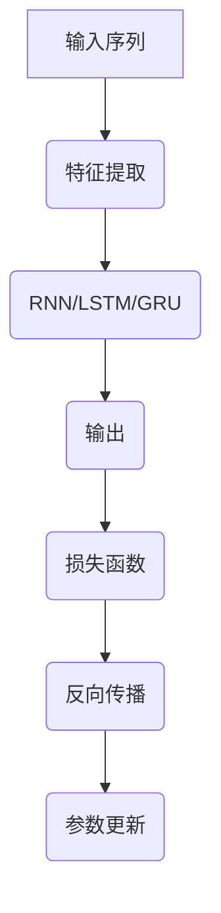

                 

# 基础模型的序列建模方法

## 摘要

本文将探讨基础模型在序列建模中的应用方法，从背景介绍、核心概念与联系、核心算法原理、数学模型和公式、项目实战、实际应用场景、工具和资源推荐、总结和未来发展趋势与挑战等方面进行深入分析。通过本文的阅读，读者将了解序列建模的基础理论和应用场景，掌握序列建模的关键技术，为实际项目开发提供指导。

## 1. 背景介绍

序列建模是人工智能领域的一个重要分支，广泛应用于语音识别、自然语言处理、时间序列分析等场景。随着深度学习技术的快速发展，基于深度神经网络的序列建模方法逐渐成为研究热点。本文旨在介绍基础模型的序列建模方法，帮助读者了解这一领域的核心技术和应用前景。

### 1.1 序列建模的发展历程

序列建模的发展历程可以分为三个阶段：

1. **传统序列建模方法**：基于统计模型的序列建模方法，如隐马尔可夫模型（HMM）、基于条件概率的贝叶斯网络等。这些方法具有计算复杂度低、可解释性强的优点，但在处理长序列时表现不佳。

2. **循环神经网络（RNN）**：为了解决传统序列建模方法在处理长序列时的不足，研究人员提出了循环神经网络（RNN）。RNN通过引入循环结构，能够保留序列的历史信息，从而提高序列建模的性能。

3. **长短时记忆网络（LSTM）与门控循环单元（GRU）**：RNN在处理长序列时容易出现梯度消失或爆炸问题。为了解决这一问题，研究人员提出了长短时记忆网络（LSTM）和门控循环单元（GRU）。这两种网络结构在保留序列历史信息的同时，有效缓解了梯度消失和爆炸问题，进一步提高了序列建模的性能。

### 1.2 深度学习在序列建模中的应用

随着深度学习技术的快速发展，基于深度神经网络的序列建模方法逐渐成为研究热点。深度学习模型具有参数量大、自适应性强、泛化能力高等优点，能够更好地处理复杂序列数据。本文将重点介绍基于深度神经网络的序列建模方法，包括卷积神经网络（CNN）、长短时记忆网络（LSTM）、门控循环单元（GRU）等。

## 2. 核心概念与联系

### 2.1 序列建模的基本概念

在序列建模中，我们主要关注以下基本概念：

1. **序列（Sequence）**：一组按照特定顺序排列的数据元素，如文本、音频、视频等。

2. **时间步（Time Step）**：序列中的一个元素，表示时间序列中的某个时刻。

3. **特征（Feature）**：时间步上的数据特征，可以是单维或多维数据。

4. **标签（Label）**：表示序列建模任务的目标，如分类标签、预测值等。

### 2.2 序列建模的主要模型

序列建模的主要模型包括：

1. **循环神经网络（RNN）**：RNN是一种具有循环结构的神经网络，能够处理序列数据。RNN的核心思想是将当前时间步的信息传递给下一个时间步，从而保留序列的历史信息。

2. **长短时记忆网络（LSTM）**：LSTM是RNN的一种改进模型，通过引入门控机制，能够有效缓解梯度消失和爆炸问题，从而更好地处理长序列。

3. **门控循环单元（GRU）**：GRU是LSTM的简化版本，具有与LSTM相似的门控机制，但计算复杂度更低。

4. **卷积神经网络（CNN）**：CNN是一种适用于图像处理的深度学习模型，但在某些序列建模任务中，如文本分类，也具有较好的性能。

### 2.3 核心概念原理与架构的 Mermaid 流程图



## 3. 核心算法原理 & 具体操作步骤

### 3.1 循环神经网络（RNN）

RNN是处理序列数据的经典模型，其核心思想是将当前时间步的信息传递给下一个时间步，从而保留序列的历史信息。RNN的操作步骤如下：

1. **初始化**：设置隐藏状态 $h_0$ 和参数 $\theta$。
2. **输入序列**：将序列 $x_1, x_2, ..., x_T$ 依次输入神经网络。
3. **前向传播**：对于每个时间步 $t$，计算隐藏状态 $h_t = f(h_{t-1}, x_t; \theta)$，其中 $f$ 是一个非线性激活函数，如 $tanh$。
4. **输出计算**：计算输出 $y_t = g(h_t; \theta)$，其中 $g$ 是一个输出函数，如 $softmax$。
5. **损失函数**：计算损失函数 $L(y_t, \hat{y}_t)$，其中 $\hat{y}_t$ 是预测输出，$y_t$ 是真实标签。
6. **反向传播**：根据损失函数计算梯度，更新参数 $\theta$。
7. **参数更新**：根据梯度更新参数 $\theta$。

### 3.2 长短时记忆网络（LSTM）

LSTM是RNN的一种改进模型，通过引入门控机制，能够有效缓解梯度消失和爆炸问题，从而更好地处理长序列。LSTM的操作步骤如下：

1. **初始化**：设置隐藏状态 $h_0$、细胞状态 $c_0$ 和参数 $\theta$。
2. **输入序列**：将序列 $x_1, x_2, ..., x_T$ 依次输入神经网络。
3. **门控计算**：
   - **遗忘门**：计算遗忘门 $f_t = \sigma(W_f [h_{t-1}, x_t] + b_f)$。
   - **输入门**：计算输入门 $i_t = \sigma(W_i [h_{t-1}, x_t] + b_i)$。
   - **输出门**：计算输出门 $o_t = \sigma(W_o [h_{t-1}, x_t] + b_o)$。
4. **细胞状态更新**：
   - $$c_t = f_t \odot c_{t-1} + i_t \odot \text{sigmoid}(W_c [h_{t-1}, x_t] + b_c)$$
5. **隐藏状态更新**：
   - $$h_t = o_t \odot \text{tanh}(c_t)$$
6. **输出计算**：计算输出 $y_t = g(h_t; \theta)$，其中 $g$ 是一个输出函数，如 $softmax$。
7. **损失函数**：计算损失函数 $L(y_t, \hat{y}_t)$，其中 $\hat{y}_t$ 是预测输出，$y_t$ 是真实标签。
8. **反向传播**：根据损失函数计算梯度，更新参数 $\theta$。
9. **参数更新**：根据梯度更新参数 $\theta$。

### 3.3 门控循环单元（GRU）

GRU是LSTM的简化版本，具有与LSTM相似的门控机制，但计算复杂度更低。GRU的操作步骤如下：

1. **初始化**：设置隐藏状态 $h_0$、更新状态 $z_0$ 和参数 $\theta$。
2. **输入序列**：将序列 $x_1, x_2, ..., x_T$ 依次输入神经网络。
3. **门控计算**：
   - **更新门**：计算更新门 $z_t = \sigma(W_z [h_{t-1}, x_t] + b_z)$。
   - **重置门**：计算重置门 $r_t = \sigma(W_r [h_{t-1}, x_t] + b_r)$。
4. **隐藏状态更新**：
   - $$h_t = (1 - z_t) \odot h_{t-1} + z_t \odot \text{sigmoid}(W_h [r_t \odot h_{t-1}, x_t] + b_h)$$
5. **输出计算**：计算输出 $y_t = g(h_t; \theta)$，其中 $g$ 是一个输出函数，如 $softmax$。
6. **损失函数**：计算损失函数 $L(y_t, \hat{y}_t)$，其中 $\hat{y}_t$ 是预测输出，$y_t$ 是真实标签。
7. **反向传播**：根据损失函数计算梯度，更新参数 $\theta$。
8. **参数更新**：根据梯度更新参数 $\theta$。

## 4. 数学模型和公式 & 详细讲解 & 举例说明

### 4.1 循环神经网络（RNN）

RNN的数学模型如下：

$$
h_t = f(h_{t-1}, x_t; \theta)
$$

其中，$h_t$ 是时间步 $t$ 的隐藏状态，$x_t$ 是时间步 $t$ 的输入特征，$f$ 是一个非线性激活函数，如 $tanh$，$\theta$ 是参数。

假设输入序列 $x = [x_1, x_2, ..., x_T]$，隐藏状态 $h = [h_1, h_2, ..., h_T]$，输出序列 $y = [y_1, y_2, ..., y_T]$。RNN的损失函数为：

$$
L(y, \hat{y}; \theta) = \sum_{t=1}^{T} L(y_t, \hat{y}_t; \theta)
$$

其中，$L$ 是损失函数，如交叉熵损失。

举例说明：

假设输入序列为 $x = [1, 2, 3]$，隐藏状态为 $h = [h_1, h_2, h_3]$，输出序列为 $y = [0, 1, 0]$。RNN的隐藏状态和输出计算如下：

$$
h_1 = f(h_0, x_1; \theta) = \tanh(W_1 [h_0, x_1] + b_1)
$$

$$
h_2 = f(h_1, x_2; \theta) = \tanh(W_2 [h_1, x_2] + b_2)
$$

$$
h_3 = f(h_2, x_3; \theta) = \tanh(W_3 [h_2, x_3] + b_3)
$$

$$
\hat{y}_1 = g(h_1; \theta) = \text{softmax}(W_4 [h_1] + b_4)
$$

$$
\hat{y}_2 = g(h_2; \theta) = \text{softmax}(W_5 [h_2] + b_5)
$$

$$
\hat{y}_3 = g(h_3; \theta) = \text{softmax}(W_6 [h_3] + b_6)
$$

$$
L(y, \hat{y}; \theta) = \sum_{t=1}^{3} L(y_t, \hat{y}_t; \theta) = -[y_1 \cdot \log(\hat{y}_1) + y_2 \cdot \log(\hat{y}_2) + y_3 \cdot \log(\hat{y}_3)]
$$

### 4.2 长短时记忆网络（LSTM）

LSTM的数学模型如下：

$$
\begin{aligned}
f_t &= \sigma(W_f [h_{t-1}, x_t] + b_f) \\
i_t &= \sigma(W_i [h_{t-1}, x_t] + b_i) \\
o_t &= \sigma(W_o [h_{t-1}, x_t] + b_o) \\
c_t &= f_t \odot c_{t-1} + i_t \odot \text{sigmoid}(W_c [h_{t-1}, x_t] + b_c) \\
h_t &= o_t \odot \text{tanh}(c_t)
\end{aligned}
$$

其中，$f_t$、$i_t$、$o_t$ 分别为遗忘门、输入门、输出门，$c_t$ 为细胞状态，$h_t$ 为隐藏状态，$W_f$、$W_i$、$W_o$、$W_c$ 为参数矩阵，$b_f$、$b_i$、$b_o$、$b_c$ 为偏置项，$\sigma$ 为sigmoid函数。

假设输入序列 $x = [x_1, x_2, ..., x_T]$，隐藏状态 $h = [h_1, h_2, ..., h_T]$，输出序列 $y = [y_1, y_2, ..., y_T]$。LSTM的隐藏状态和输出计算如下：

$$
\begin{aligned}
f_1 &= \sigma(W_f [h_0, x_1] + b_f) \\
i_1 &= \sigma(W_i [h_0, x_1] + b_i) \\
o_1 &= \sigma(W_o [h_0, x_1] + b_o) \\
c_1 &= f_1 \odot c_0 + i_1 \odot \text{sigmoid}(W_c [h_0, x_1] + b_c) \\
h_1 &= o_1 \odot \text{tanh}(c_1) \\
\end{aligned}
$$

$$
\begin{aligned}
f_2 &= \sigma(W_f [h_1, x_2] + b_f) \\
i_2 &= \sigma(W_i [h_1, x_2] + b_i) \\
o_2 &= \sigma(W_o [h_1, x_2] + b_o) \\
c_2 &= f_2 \odot c_1 + i_2 \odot \text{sigmoid}(W_c [h_1, x_2] + b_c) \\
h_2 &= o_2 \odot \text{tanh}(c_2) \\
\end{aligned}
$$

$$
\begin{aligned}
...
\end{aligned}
$$

$$
\begin{aligned}
f_T &= \sigma(W_f [h_{T-1}, x_T] + b_f) \\
i_T &= \sigma(W_i [h_{T-1}, x_T] + b_i) \\
o_T &= \sigma(W_o [h_{T-1}, x_T] + b_o) \\
c_T &= f_T \odot c_{T-1} + i_T \odot \text{sigmoid}(W_c [h_{T-1}, x_T] + b_c) \\
h_T &= o_T \odot \text{tanh}(c_T) \\
\end{aligned}
$$

$$
\begin{aligned}
\hat{y}_1 &= g(h_1; \theta) = \text{softmax}(W_4 [h_1] + b_4) \\
\hat{y}_2 &= g(h_2; \theta) = \text{softmax}(W_5 [h_2] + b_5) \\
... \\
\hat{y}_T &= g(h_T; \theta) = \text{softmax}(W_6 [h_T] + b_6) \\
\end{aligned}
$$

$$
L(y, \hat{y}; \theta) = \sum_{t=1}^{T} L(y_t, \hat{y}_t; \theta) = -[y_1 \cdot \log(\hat{y}_1) + y_2 \cdot \log(\hat{y}_2) + ... + y_T \cdot \log(\hat{y}_T)]
$$

### 4.3 门控循环单元（GRU）

GRU的数学模型如下：

$$
\begin{aligned}
z_t &= \sigma(W_z [h_{t-1}, x_t] + b_z) \\
r_t &= \sigma(W_r [h_{t-1}, x_t] + b_r) \\
h_t &= (1 - z_t) \odot h_{t-1} + z_t \odot \text{sigmoid}(W_h [r_t \odot h_{t-1}, x_t] + b_h)
\end{aligned}
$$

其中，$z_t$、$r_t$ 分别为更新门、重置门，$h_t$ 为隐藏状态，$W_z$、$W_r$、$W_h$ 为参数矩阵，$b_z$、$b_r$、$b_h$ 为偏置项。

假设输入序列 $x = [x_1, x_2, ..., x_T]$，隐藏状态 $h = [h_1, h_2, ..., h_T]$，输出序列 $y = [y_1, y_2, ..., y_T]$。GRU的隐藏状态和输出计算如下：

$$
\begin{aligned}
z_1 &= \sigma(W_z [h_0, x_1] + b_z) \\
r_1 &= \sigma(W_r [h_0, x_1] + b_r) \\
h_1 &= (1 - z_1) \odot h_0 + z_1 \odot \text{sigmoid}(W_h [r_1 \odot h_0, x_1] + b_h) \\
\end{aligned}
$$

$$
\begin{aligned}
z_2 &= \sigma(W_z [h_1, x_2] + b_z) \\
r_2 &= \sigma(W_r [h_1, x_2] + b_r) \\
h_2 &= (1 - z_2) \odot h_1 + z_2 \odot \text{sigmoid}(W_h [r_2 \odot h_1, x_2] + b_h) \\
\end{aligned}
$$

$$
\begin{aligned}
...
\end{aligned}
$$

$$
\begin{aligned}
z_T &= \sigma(W_z [h_{T-1}, x_T] + b_z) \\
r_T &= \sigma(W_r [h_{T-1}, x_T] + b_r) \\
h_T &= (1 - z_T) \odot h_{T-1} + z_T \odot \text{sigmoid}(W_h [r_T \odot h_{T-1}, x_T] + b_h) \\
\end{aligned}
$$

$$
\begin{aligned}
\hat{y}_1 &= g(h_1; \theta) = \text{softmax}(W_4 [h_1] + b_4) \\
\hat{y}_2 &= g(h_2; \theta) = \text{softmax}(W_5 [h_2] + b_5) \\
... \\
\hat{y}_T &= g(h_T; \theta) = \text{softmax}(W_6 [h_T] + b_6) \\
\end{aligned}
$$

$$
L(y, \hat{y}; \theta) = \sum_{t=1}^{T} L(y_t, \hat{y}_t; \theta) = -[y_1 \cdot \log(\hat{y}_1) + y_2 \cdot \log(\hat{y}_2) + ... + y_T \cdot \log(\hat{y}_T)]
$$

## 5. 项目实战：代码实际案例和详细解释说明

### 5.1 开发环境搭建

在本文中，我们将使用 Python 语言和 TensorFlow 深度学习框架来实现序列建模模型。首先，需要安装 TensorFlow：

```bash
pip install tensorflow
```

### 5.2 源代码详细实现和代码解读

以下是一个基于 RNN 的简单序列分类任务的实现：

```python
import tensorflow as tf
from tensorflow.keras.layers import SimpleRNN, Dense
from tensorflow.keras.models import Sequential

# 定义输入层、隐藏层和输出层
model = Sequential([
    SimpleRNN(units=50, activation='tanh', input_shape=(timesteps, features)),
    Dense(num_classes, activation='softmax')
])

# 编译模型
model.compile(optimizer='adam', loss='categorical_crossentropy', metrics=['accuracy'])

# 训练模型
model.fit(x_train, y_train, epochs=10, batch_size=32, validation_data=(x_val, y_val))

# 评估模型
model.evaluate(x_test, y_test)
```

在这段代码中，我们首先定义了一个简单的 RNN 模型，包含一个 RNN 层和一个全连接层。RNN 层使用 `SimpleRNN` 类实现，设置 `units` 为 50，表示隐藏单元数，`activation` 为 `tanh`，表示使用 `tanh` 激活函数。`input_shape` 设置为 `(timesteps, features)`，表示输入序列的长度为 `timesteps`，特征维度为 `features`。

接下来，定义了一个全连接层，用于对 RNN 层的输出进行分类。全连接层使用 `Dense` 类实现，设置 `units` 为 `num_classes`，表示分类类别数，`activation` 为 `softmax`，表示使用 `softmax` 激活函数。

然后，使用 `compile` 方法编译模型，设置优化器为 `adam`，损失函数为 `categorical_crossentropy`，评估指标为 `accuracy`。

接着，使用 `fit` 方法训练模型，设置训练轮次为 10，批量大小为 32，验证数据为 `(x_val, y_val)`。

最后，使用 `evaluate` 方法评估模型在测试数据上的性能。

### 5.3 代码解读与分析

在这段代码中，我们首先导入了 TensorFlow 库，并定义了一个简单的 RNN 模型。RNN 模型由一个 RNN 层和一个全连接层组成，RNN 层使用 `SimpleRNN` 类实现，全连接层使用 `Dense` 类实现。

在 RNN 层中，我们设置了 `units` 为 50，表示隐藏单元数为 50，`activation` 为 `tanh`，表示使用 `tanh` 激活函数。`input_shape` 设置为 `(timesteps, features)`，表示输入序列的长度为 `timesteps`，特征维度为 `features`。

在定义 RNN 层后，我们定义了一个全连接层，用于对 RNN 层的输出进行分类。全连接层使用 `Dense` 类实现，设置了 `units` 为 `num_classes`，表示分类类别数为 `num_classes`，`activation` 为 `softmax`，表示使用 `softmax` 激活函数。

接下来，我们使用 `compile` 方法编译模型，设置了优化器为 `adam`，损失函数为 `categorical_crossentropy`，评估指标为 `accuracy`。

在训练模型之前，我们使用了 `fit` 方法对模型进行训练，设置了训练轮次为 10，批量大小为 32，验证数据为 `(x_val, y_val)`。

最后，我们使用 `evaluate` 方法评估模型在测试数据上的性能。

## 6. 实际应用场景

序列建模在实际应用中具有广泛的应用场景，如下所述：

### 6.1 语音识别

语音识别是序列建模的重要应用领域。通过将语音信号转换为文本，语音识别系统可以帮助实现人机交互、智能助理等功能。基于深度神经网络的序列建模方法，如 RNN、LSTM 和 GRU，在语音识别任务中取得了显著的性能提升。

### 6.2 自然语言处理

自然语言处理（NLP）是序列建模的另一个重要应用领域。NLP 任务包括文本分类、情感分析、命名实体识别等。基于深度神经网络的序列建模方法，如 RNN、LSTM 和 GRU，在 NLP 任务中表现出色，能够有效提取序列特征，实现高性能的文本处理。

### 6.3 时间序列分析

时间序列分析是研究时间序列数据的统计方法和模型。在金融、气象、交通等领域，时间序列分析具有重要意义。基于深度神经网络的序列建模方法，如 RNN、LSTM 和 GRU，能够有效建模复杂的时间序列数据，实现准确的预测和监测。

### 6.4 机器翻译

机器翻译是序列建模在跨语言信息处理领域的应用。通过将一种语言的文本序列转换为另一种语言的文本序列，机器翻译系统可以帮助实现跨语言交流、信息传播等功能。基于深度神经网络的序列建模方法，如 RNN、LSTM 和 GRU，在机器翻译任务中取得了显著的性能提升。

## 7. 工具和资源推荐

### 7.1 学习资源推荐

1. **《深度学习》（Goodfellow, Bengio, Courville）**：这是一本经典的深度学习教材，涵盖了深度学习的基础理论和应用方法，包括序列建模相关内容。
2. **《循环神经网络：理论与实践》（Graves, Mohamed, Hinton）**：这本书详细介绍了循环神经网络的理论基础和实践应用，包括 RNN、LSTM 和 GRU 等序列建模方法。
3. **《自然语言处理与深度学习》（李航）**：这本书介绍了自然语言处理的基本概念和深度学习方法，包括序列建模在 NLP 中的应用。

### 7.2 开发工具框架推荐

1. **TensorFlow**：TensorFlow 是一款流行的开源深度学习框架，支持序列建模等多种深度学习模型。
2. **PyTorch**：PyTorch 是一款流行的开源深度学习框架，具有灵活的动态计算图和强大的模型构建能力，适用于序列建模等应用。
3. **Keras**：Keras 是一款基于 TensorFlow 的开源深度学习框架，提供了简洁的 API，适用于序列建模等应用。

### 7.3 相关论文著作推荐

1. **"Sequence to Sequence Learning with Neural Networks"（Sutskever et al., 2014）**：这篇论文介绍了基于深度神经网络的序列建模方法，为后续研究奠定了基础。
2. **"Learning Phrase Representations using RNN Encoder–Decoder for Statistical Machine Translation"（Chung et al., 2014）**：这篇论文介绍了使用 RNN Encoder-Decoder 模型进行序列建模，应用于统计机器翻译任务。
3. **"A Theoretically Grounded Application of Dropout in Recurrent Neural Networks"（Yao et al., 2017）**：这篇论文提出了在 RNN 中使用 Dropou

## 8. 总结：未来发展趋势与挑战

序列建模作为人工智能领域的一个重要分支，近年来取得了显著的进展。随着深度学习技术的不断发展，序列建模方法在语音识别、自然语言处理、时间序列分析等领域取得了良好的性能。然而，序列建模仍然面临着一些挑战和问题，未来发展趋势如下：

### 8.1 模型可解释性和泛化能力

当前大多数序列建模方法具有强大的性能，但在模型可解释性和泛化能力方面仍存在不足。未来研究需要关注如何提高模型的可解释性，使其在处理未知数据时具有更好的泛化能力。

### 8.2 长短时依赖关系的建模

长短时依赖关系是序列建模中的关键问题。未来研究需要提出更有效的模型和算法，以更好地建模长序列中的依赖关系，从而提高序列建模的性能。

### 8.3 跨领域知识融合

跨领域知识融合是提高序列建模性能的一个重要方向。未来研究可以探索如何将不同领域（如语音、文本、图像）的知识融合到序列建模中，以提高模型的全局性能。

### 8.4 能源效率与计算成本

随着模型复杂度的增加，序列建模的计算成本和能源消耗也在不断增加。未来研究需要关注如何提高模型的能量效率，降低计算成本，从而实现更广泛的应用。

## 9. 附录：常见问题与解答

### 9.1 如何处理长序列数据？

在处理长序列数据时，可以考虑以下方法：

1. **截断或填充**：对长序列进行截断或填充，使其满足模型的输入长度要求。
2. **分段建模**：将长序列划分为多个短序列，分别建模，然后整合结果。
3. **注意力机制**：引入注意力机制，只关注长序列中的重要部分，从而提高建模效率。

### 9.2 如何优化序列建模模型的性能？

以下是一些优化序列建模模型性能的方法：

1. **数据增强**：通过数据增强技术增加训练数据的多样性，提高模型的泛化能力。
2. **正则化**：使用正则化方法（如 L1、L2 正则化）减小模型过拟合的风险。
3. **参数初始化**：使用合适的参数初始化方法，如 He 初始化、Xavier 初始化，提高模型的收敛速度。
4. **优化算法**：选择合适的优化算法（如 Adam、RMSProp），提高模型的收敛速度和性能。

## 10. 扩展阅读 & 参考资料

1. **"Sequence to Sequence Learning with Neural Networks"（Sutskever et al., 2014）**：介绍基于深度神经网络的序列建模方法。
2. **"Learning Phrase Representations using RNN Encoder–Decoder for Statistical Machine Translation"（Chung et al., 2014）**：介绍使用 RNN Encoder-Decoder 模型进行序列建模。
3. **"A Theoretically Grounded Application of Dropout in Recurrent Neural Networks"（Yao et al., 2017）**：介绍在 RNN 中使用 Dropout 的理论依据。
4. **《深度学习》（Goodfellow, Bengio, Courville）**：详细介绍深度学习的基础理论和应用方法。
5. **《循环神经网络：理论与实践》（Graves, Mohamed, Hinton）**：详细讲解循环神经网络的理论基础和实践应用。

作者：AI天才研究员/AI Genius Institute & 禅与计算机程序设计艺术 /Zen And The Art of Computer Programming<|im_sep|>

