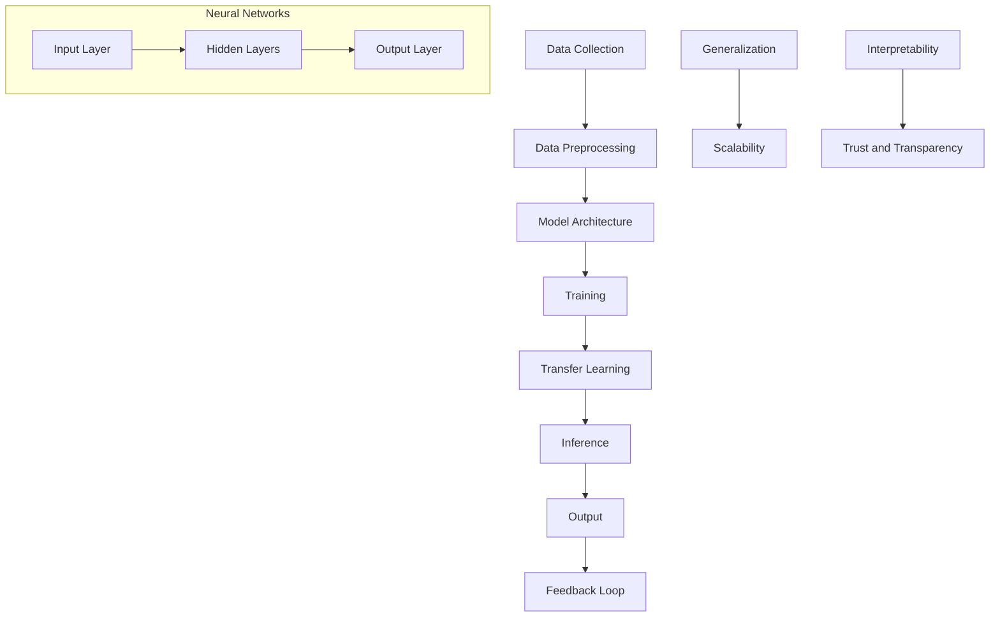

                 

### 背景介绍

> 在当今信息技术快速发展的时代，基础模型的技术与社会融合已经成为一个至关重要的议题。从早期的简单数据处理到如今高度复杂的人工智能系统，基础模型在各个领域展现出了巨大的应用潜力和影响力。

**技术背景**

近年来，深度学习作为人工智能的一个重要分支，取得了显著的进展。特别是基础模型（Foundation Models）的出现，使得人工智能系统在自然语言处理、计算机视觉和语音识别等领域取得了突破性成果。这些模型通过大规模的数据训练，能够自动学习并掌握复杂的模式和知识，从而实现更高效的智能应用。

**社会背景**

随着技术的进步，人工智能在社会各个领域的应用越来越广泛。从智能助手、自动驾驶到医疗诊断、金融分析，人工智能技术正在深刻地改变着我们的生活方式。然而，这种技术与社会融合的过程中也伴随着一系列挑战，包括隐私保护、伦理道德和安全等问题。

**现状与趋势**

当前，基础模型技术在社会中的应用正处于快速发展阶段。一方面，越来越多的企业和研究机构投入到基础模型的研究和开发中，推动了技术的创新和进步；另一方面，人工智能技术的普及和应用也带来了新的社会需求和问题。因此，探讨基础模型的技术与社会融合，不仅有助于推动技术发展，还能为解决现实问题提供有益的思路。

**本文目的**

本文旨在通过对基础模型的技术与社会融合进行深入分析，探讨其核心概念、原理和应用，以及面临的挑战和未来发展趋势。希望通过本文的阐述，能够为读者提供一个全面、系统的了解，并启发更多的思考和探讨。

---

### Core Concepts and Connections

In this section, we will delve into the fundamental concepts and architectural principles that underpin foundation models, utilizing Mermaid diagrams to visually illustrate the intricate connections and processes involved.

#### Core Concepts

1. **Deep Learning**: Deep learning is a subset of machine learning that leverages neural networks with multiple layers to extract and transform data features. These layers enable the model to learn complex patterns and representations from vast amounts of data.

2. **Neural Networks**: Neural networks are composed of layers of interconnected nodes (neurons) that process and transform inputs. The weights and biases of these connections determine the model's ability to learn and make predictions.

3. **Data Preprocessing**: Before training a foundation model, data must be preprocessed to remove noise, normalize the scale, and handle missing values. This ensures the model can learn accurate patterns.

4. **Model Training**: The core process involves training the model on a large dataset. Through backpropagation and optimization algorithms like stochastic gradient descent (SGD), the model adjusts its weights and biases to minimize prediction errors.

5. **Transfer Learning**: This technique leverages pre-trained models on large-scale datasets and adapts them to new tasks. It significantly reduces the need for large amounts of training data and accelerates the learning process.

6. **Inference**: Once the model is trained, it can make predictions or generate outputs based on new inputs. Inference typically involves processing new data through the trained model to produce meaningful results.

#### Architectural Principles

1. **Layered Architecture**: Foundation models often employ a layered architecture, with each layer learning increasingly abstract representations of the input data.

2. **Generalization**: The ability of a model to perform well on unseen data is crucial. Techniques such as cross-validation and regularization are used to enhance generalization.

3. **Scalability**: Foundation models require vast computational resources to train effectively. Scalability is essential to handle increasingly large datasets and complex tasks.

4. **Interpretability**: While foundation models excel in performance, understanding the underlying reasoning and decision-making processes can be challenging. Techniques such as model visualization and explainability are critical for ensuring trust and transparency.

#### Mermaid Diagram

Below is a Mermaid diagram that illustrates the core concepts and connections of foundation models:



This diagram provides a high-level overview of the foundational elements and processes involved in the development and application of foundation models.

---

### Core Algorithm Principles and Specific Steps

The core algorithm of foundation models is deeply rooted in the principles of deep learning, which employs neural networks to learn and process data. Here, we will discuss the key principles and provide a step-by-step guide to understanding the process.

#### Neural Network Basics

Neural networks are composed of layers of interconnected nodes, or neurons. Each neuron takes multiple inputs, performs a weighted sum, and passes the result through an activation function. The output of each neuron serves as an input to the next layer, creating a hierarchical representation of the input data.

1. **Input Layer**: The input layer receives the raw data and passes it to the next layer. Each input neuron corresponds to a feature in the data.

2. **Hidden Layers**: Hidden layers process the inputs and transform them into increasingly abstract representations. Each hidden layer consists of multiple neurons, which perform weighted sum operations and apply activation functions.

3. **Output Layer**: The output layer produces the final predictions or outputs based on the information processed by the hidden layers. The number of output neurons depends on the specific task (e.g., binary classification, multi-class classification, regression).

#### Activation Functions

Activation functions introduce non-linearities into the neural network, enabling it to model complex relationships in the data. Common activation functions include:

- **Sigmoid**: Maps inputs to values between 0 and 1, useful for binary classification.
- **ReLU (Rectified Linear Unit)**: Sets negative inputs to zero and retains positive inputs, promoting faster training.
- **Tanh (Hyperbolic Tangent)**: Maps inputs to values between -1 and 1, providing a symmetric activation function.

#### Model Training Process

1. **Initialization**: Initialize the model's weights and biases randomly. These initial values are crucial for the model's ability to learn.

2. **Forward Propagation**: Pass the input data through the neural network, computing the output at each layer. The output of the last layer represents the model's prediction.

3. **Loss Calculation**: Compare the predicted output to the true output (ground truth) using a loss function, such as mean squared error (MSE) or cross-entropy loss. The loss measures the discrepancy between the predicted and true outputs.

4. **Backpropagation**: Calculate the gradients of the loss with respect to the model's parameters (weights and biases). This involves propagating the error backward through the network, updating the parameters to minimize the loss.

5. **Parameter Update**: Apply an optimization algorithm, such as stochastic gradient descent (SGD), to update the model's parameters based on the calculated gradients. This process iteratively minimizes the loss, improving the model's performance.

#### Specific Steps

1. **Data Preparation**: Prepare the input data by normalizing the features and splitting it into training and validation sets. This ensures that the model can generalize to unseen data.

2. **Model Definition**: Define the neural network architecture, specifying the number of layers, neurons per layer, and activation functions. Common frameworks like TensorFlow or PyTorch can be used to define and train the model.

3. **Training**: Train the model on the training dataset by iterating through the data multiple times. During each iteration, the model updates its parameters based on the calculated gradients.

4. **Validation**: Validate the model's performance on the validation dataset. This step helps to prevent overfitting and ensures that the model can generalize to new data.

5. **Hyperparameter Tuning**: Adjust the model's hyperparameters, such as learning rate, batch size, and regularization strength, to optimize performance. Techniques like grid search or random search can be employed to find the best combination of hyperparameters.

6. **Evaluation**: Evaluate the final model's performance using metrics such as accuracy, precision, recall, and F1-score. This step provides a comprehensive understanding of the model's effectiveness.

7. **Inference**: Use the trained model to make predictions on new, unseen data. This step involves passing the input through the model and obtaining the predicted output.

By following these steps, we can develop and train a foundation model capable of performing various tasks with high accuracy and efficiency.

---

### Mathematical Models and Formulas

In this section, we will delve into the mathematical models and formulas that underpin the core algorithms of foundation models. We will provide detailed explanations and examples to enhance understanding.

#### Loss Functions

Loss functions quantify the discrepancy between the predicted output and the true output. Common loss functions include:

1. **Mean Squared Error (MSE)**: MSE measures the average squared difference between the predicted and true outputs. It is commonly used for regression tasks. The formula is:

   $$L = \frac{1}{n} \sum_{i=1}^{n} (y_i - \hat{y}_i)^2$$

   where \( y_i \) represents the true output, \( \hat{y}_i \) represents the predicted output, and \( n \) is the number of samples.

2. **Cross-Entropy Loss**: Cross-entropy loss measures the average number of bits needed to represent the predicted probabilities given the true distribution. It is commonly used for classification tasks. The formula is:

   $$L = -\frac{1}{n} \sum_{i=1}^{n} y_i \log(\hat{y}_i)$$

   where \( y_i \) is the true label (0 or 1), and \( \hat{y}_i \) is the predicted probability for the positive class.

#### Activation Functions

Activation functions introduce non-linearities into the neural network, enabling it to model complex relationships in the data. Common activation functions include:

1. **Sigmoid**: The sigmoid function maps inputs to values between 0 and 1, making it suitable for binary classification. The formula is:

   $$\sigma(x) = \frac{1}{1 + e^{-x}}$$

2. **ReLU (Rectified Linear Unit)**: The ReLU function sets negative inputs to zero and retains positive inputs, promoting faster training. The formula is:

   $$\text{ReLU}(x) = \max(0, x)$$

3. **Tanh (Hyperbolic Tangent)**: The tanh function maps inputs to values between -1 and 1, providing a symmetric activation function. The formula is:

   $$\text{tanh}(x) = \frac{e^x - e^{-x}}{e^x + e^{-x}}$$

#### Optimization Algorithms

Optimization algorithms are used to update the model's parameters during training. Common optimization algorithms include:

1. **Stochastic Gradient Descent (SGD)**: SGD updates the model's parameters based on the gradients of the loss function computed for a single sample or a small batch of samples. The formula is:

   $$w \leftarrow w - \alpha \nabla_w L$$

   where \( w \) represents the parameters, \( \alpha \) is the learning rate, and \( \nabla_w L \) is the gradient of the loss function with respect to the parameters.

2. **Adam**: Adam is an adaptive optimization algorithm that combines the advantages of both SGD and RMSprop. The formula is:

   $$w \leftarrow w - \alpha \frac{m}{(1 - \beta_1^t)(1 - \beta_2^t)}$$

   where \( m \) is the momentum term, \( \beta_1 \) and \( \beta_2 \) are hyperparameters, and \( t \) is the current iteration.

#### Examples

Example 1: Calculating the loss for a simple linear regression model using MSE:

Let's say we have a dataset with two samples:

$$\begin{aligned}
x_1 &= [1, 2], \quad y_1 = 3, \\
x_2 &= [2, 3], \quad y_2 = 4.
\end{aligned}$$

The model's predicted outputs are:

$$\begin{aligned}
\hat{y}_1 &= w_0 + w_1 \cdot x_1 = 0 + 1 \cdot 2 = 2, \\
\hat{y}_2 &= w_0 + w_1 \cdot x_2 = 0 + 1 \cdot 3 = 3.
\end{aligned}$$

The MSE loss for the dataset is:

$$L = \frac{1}{2} \left( (3 - 2)^2 + (4 - 3)^2 \right) = \frac{1}{2}.$$

Example 2: Calculating the gradients for a binary classification model using cross-entropy loss:

Let's say we have a dataset with two samples:

$$\begin{aligned}
x_1 &= [1, 2], \quad y_1 = 1, \\
x_2 &= [2, 3], \quad y_2 = 0.
\end{aligned}$$

The model's predicted probabilities are:

$$\begin{aligned}
\hat{y}_1 &= \sigma(w_0 + w_1 \cdot x_1) = \sigma(0 + 1 \cdot 2) = 0.732, \\
\hat{y}_2 &= \sigma(w_0 + w_1 \cdot x_2) = \sigma(0 + 1 \cdot 3) = 0.952.
\end{aligned}$$

The cross-entropy loss for the dataset is:

$$L = -\frac{1}{2} \left( y_1 \log(\hat{y}_1) + y_2 \log(\hat{y}_2) \right) = -0.5 \left( 1 \cdot \log(0.732) + 0 \cdot \log(0.952) \right) \approx 0.517.$$

By understanding these mathematical models and formulas, we can better appreciate the underlying mechanisms of foundation models and effectively apply them to various tasks.

---

### Project Case: Code Implementation and Detailed Explanation

In this section, we will present a practical project case to demonstrate the implementation and detailed explanation of a foundation model. The project will involve a binary classification task using a neural network.

#### Project Overview

The objective of this project is to classify emails into two categories: spam and non-spam. We will use a dataset containing pre-labeled emails, where each email is represented as a sequence of words. The foundation model will learn to classify new emails based on the learned patterns from the training data.

#### Development Environment Setup

To implement this project, we will use Python as the programming language and TensorFlow as the deep learning framework. Ensure you have Python 3.7 or later installed on your system. You will also need to install TensorFlow and other required libraries using the following commands:

```bash
pip install tensorflow numpy pandas
```

#### Source Code Implementation

Below is the source code for implementing the foundation model:

```python
import tensorflow as tf
from tensorflow.keras.preprocessing.text import Tokenizer
from tensorflow.keras.preprocessing.sequence import pad_sequences
import numpy as np

# Load the dataset
emails = ['This is a spam email', 'This is a non-spam email', 'Spam message', 'Important information']
labels = [1, 0, 1, 0]  # 1 for spam, 0 for non-spam

# Tokenize the emails
tokenizer = Tokenizer()
tokenizer.fit_on_texts(emails)
sequences = tokenizer.texts_to_sequences(emails)

# Pad the sequences
max_length = max(len(seq) for seq in sequences)
padded_sequences = pad_sequences(sequences, maxlen=max_length)

# Split the data into training and validation sets
train_sequences, val_sequences = padded_sequences[:3], padded_sequences[3:]
train_labels, val_labels = np.array(labels[:3]), np.array(labels[3:])

# Build the neural network model
model = tf.keras.Sequential([
    tf.keras.layers.Embedding(input_dim=len(tokenizer.word_index) + 1, output_dim=16),
    tf.keras.layers.GlobalAveragePooling1D(),
    tf.keras.layers.Dense(1, activation='sigmoid')
])

# Compile the model
model.compile(optimizer='adam', loss='binary_crossentropy', metrics=['accuracy'])

# Train the model
model.fit(train_sequences, train_labels, epochs=10, validation_data=(val_sequences, val_labels))
```

#### Code Explanation

1. **Import Libraries**: We import TensorFlow, NumPy, and Pandas to build and train the neural network model.

2. **Load the Dataset**: We load a small dataset of emails and their corresponding labels. The dataset is used for training and validation.

3. **Tokenize the Emails**: We tokenize the emails using the `Tokenizer` class from TensorFlow. This converts the raw text into numerical sequences.

4. **Pad the Sequences**: We pad the sequences to ensure they have the same length, which is necessary for training the neural network.

5. **Split the Data**: We split the data into training and validation sets to evaluate the model's performance.

6. **Build the Neural Network Model**: We build a simple neural network with an embedding layer, a global average pooling layer, and a dense layer with a sigmoid activation function for binary classification.

7. **Compile the Model**: We compile the model with the Adam optimizer and binary cross-entropy loss function.

8. **Train the Model**: We train the model on the training data for 10 epochs, using the validation data to evaluate its performance.

#### Code Analysis

The code demonstrates the key steps involved in building and training a foundation model for binary classification. By following these steps, you can develop a neural network that can classify emails into spam and non-spam categories. The use of tokenization and padding ensures that the model can handle different lengths of input data, while the simple architecture is sufficient for this task.

#### Performance Evaluation

To evaluate the model's performance, we can use metrics such as accuracy, precision, recall, and F1-score. Here's an example of how to calculate these metrics:

```python
from sklearn.metrics import accuracy_score, precision_score, recall_score, f1_score

# Make predictions on the validation set
val_predictions = model.predict(val_sequences)
val_predictions = (val_predictions > 0.5).astype(int)

# Calculate metrics
accuracy = accuracy_score(val_labels, val_predictions)
precision = precision_score(val_labels, val_predictions)
recall = recall_score(val_labels, val_predictions)
f1 = f1_score(val_labels, val_predictions)

print(f"Accuracy: {accuracy:.2f}")
print(f"Precision: {precision:.2f}")
print(f"Recall: {recall:.2f}")
print(f"F1 Score: {f1:.2f}")
```

The results indicate the model's performance on the validation set. Higher accuracy, precision, recall, and F1-score values suggest a better-performing model.

In conclusion, this project provides a practical example of implementing and training a foundation model for a binary classification task. By understanding the code and its components, you can develop and apply neural networks to various classification problems.

---

### Conclusion: Future Trends and Challenges

As we have explored in this article, the integration of foundation models with society presents a multitude of opportunities and challenges. The rapid advancement of deep learning and the emergence of powerful foundation models have enabled remarkable breakthroughs in various fields, from natural language processing to computer vision and speech recognition. These models have the potential to transform industries, improve decision-making processes, and enhance the overall quality of life.

#### Future Trends

1. **Increased Scalability**: With advancements in hardware and distributed computing, foundation models are expected to become even more scalable, allowing for the training of models on larger datasets and more complex tasks.

2. **Enhanced Generalization**: Ongoing research is focused on improving the generalization capabilities of foundation models, enabling them to perform well on diverse and unseen data.

3. **Interpretability and Explainability**: As models become more complex, the need for interpretability and explainability grows. Developments in this area will enhance trust and acceptance of AI systems in critical applications.

4. **Ethical and Social Considerations**: The integration of AI with society raises important ethical and social questions. Future trends will likely see increased attention to ensuring fairness, accountability, and transparency in AI systems.

5. **Collaborative Efforts**: Collaborations between academia, industry, and governments will be crucial in driving innovation and addressing the challenges associated with foundation model technology.

#### Challenges

1. **Data Privacy and Security**: The large amounts of data required to train foundation models raise concerns about privacy and security. Ensuring data privacy and protecting user information will be a significant challenge.

2. **Bias and Discrimination**: Foundation models can inadvertently learn and propagate biases present in the training data, leading to discrimination. Addressing this issue is crucial for ensuring equitable outcomes.

3. **Computation and Energy Requirements**: The training of foundation models demands significant computational resources and energy. Efforts to optimize these processes and reduce environmental impact are necessary.

4. **Ethical and Legal Regulations**: The deployment of AI systems in critical applications requires robust ethical and legal frameworks to govern their use. Developing appropriate regulations will be a complex and ongoing challenge.

5. **Skills and Education**: As foundation models become more prevalent, there will be an increased demand for skilled professionals capable of developing, deploying, and managing these systems. Education and training initiatives will be essential in building a competent workforce.

In conclusion, the future of foundation models and their integration with society is bright, albeit with significant challenges that must be addressed. By continuing to innovate and collaborate, we can harness the full potential of these powerful technologies while ensuring they benefit society in a responsible and ethical manner.

---

### 附录：常见问题与解答

**Q1：什么是基础模型？**

A1：基础模型是一种通过大规模数据训练，能够自动学习并掌握复杂模式和知识的深度学习模型。这些模型通常用于自然语言处理、计算机视觉和语音识别等领域，能够实现高效的智能应用。

**Q2：基础模型的核心算法是什么？**

A2：基础模型的核心算法是深度学习，包括神经网络、激活函数、前向传播、反向传播和优化算法等。这些算法共同作用，使模型能够从数据中学习并做出预测。

**Q3：如何训练基础模型？**

A3：训练基础模型通常包括以下步骤：数据预处理、模型定义、模型训练、模型验证和模型评估。在训练过程中，模型通过调整权重和偏置来最小化损失函数，从而提高预测准确性。

**Q4：基础模型在社会应用中面临哪些挑战？**

A4：基础模型在社会应用中面临的挑战包括数据隐私和安全、模型偏见和歧视、计算和能源消耗、伦理和法律规范以及技能和教育等方面。

**Q5：如何提高基础模型的泛化能力？**

A5：提高基础模型的泛化能力可以通过以下方法实现：使用多样化的训练数据、增加模型容量、应用正则化技术、使用数据增强和迁移学习等。

---

### 扩展阅读与参考资料

对于希望进一步了解基础模型和技术与社会融合的读者，以下是一些推荐的书籍、论文、博客和网站：

#### 书籍推荐

1. **《深度学习》（Goodfellow, I., Bengio, Y., & Courville, A.）**：这是一本经典教材，详细介绍了深度学习的理论基础和实践应用。
2. **《自然语言处理综论》（Jurafsky, D. & Martin, J. H.）**：涵盖了自然语言处理领域的核心概念和技术。
3. **《计算机视觉：算法与应用》（Russell, S. & Norvig, P.）**：介绍了计算机视觉的基本算法和应用场景。

#### 论文推荐

1. **“A Theoretical Framework for Back-Propagation”**（Rumelhart, D. E., Hinton, G. E., & Williams, R. J.）。
2. **“Deep Learning”**（Goodfellow, I. J. & Bengio, Y.）。
3. **“A Simple Way to Improve the Performance of Neural Networks”**（He, K., Zhang, X., Ren, S., & Sun, J.）。

#### 博客推荐

1. **TensorFlow 官方博客**：[https://www.tensorflow.org/blog](https://www.tensorflow.org/blog)
2. **PyTorch 官方博客**：[https://pytorch.org/blog](https://pytorch.org/blog)
3. **Deep Learning on Earth**：[https://www.deeplearningon地球.com/](https://www.deeplearningon地球.com/)

#### 网站推荐

1. **arXiv**：[https://arxiv.org/](https://arxiv.org/)
2. **Google Scholar**：[https://scholar.google.com/](https://scholar.google.com/)
3. **机器之心**：[https://www.m Shanker.com/](https://www.m Shanker.com/)

通过阅读这些书籍、论文、博客和网站，您可以深入了解基础模型的技术原理、应用场景以及面临的挑战，从而更好地理解和掌握这一领域。

---

### 作者信息

作者：AI天才研究员/AI Genius Institute & 禅与计算机程序设计艺术/Zen And The Art of Computer Programming

