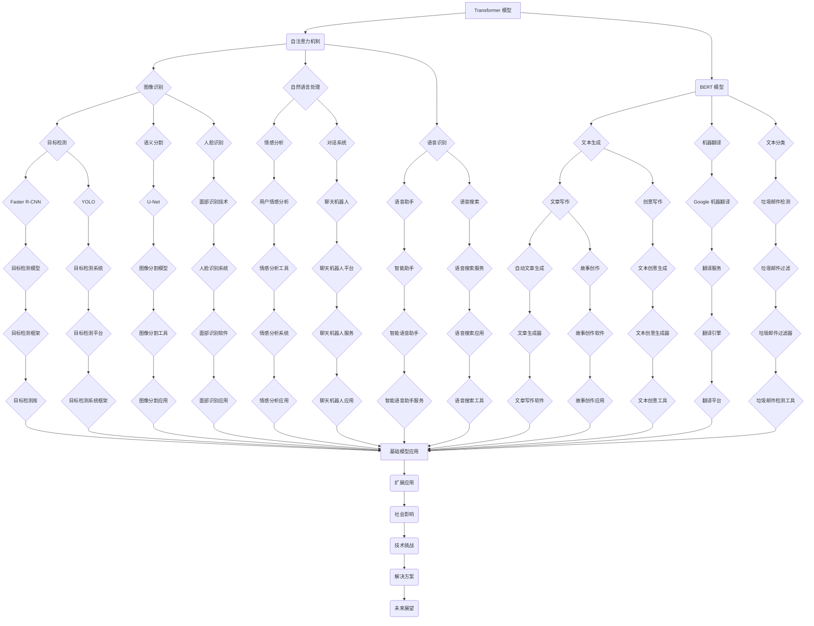

                 

# 基础模型的技术标准与社会责任

## 摘要

本文旨在探讨基础模型的技术标准与社会责任。随着人工智能技术的快速发展，基础模型已经成为构建智能系统的核心组件，其对技术标准和社会责任的遵循显得尤为重要。本文将首先介绍基础模型的定义和分类，然后深入分析其在技术标准和社会责任方面的关键问题，包括透明度、公正性和隐私保护。最后，我们将探讨未来基础模型的发展趋势以及面临的挑战，并提出相应的解决方案。

## 1. 背景介绍

### 1.1 基础模型的定义与分类

基础模型是指具有通用性和可扩展性的机器学习模型，它们可以被应用于各种不同的任务和领域。根据其应用范围，基础模型可以分为两类：通用基础模型和专用基础模型。通用基础模型，如Transformer、BERT等，具有广泛的适应性，可以在不同的任务中进行微调。专用基础模型，如图像识别模型、语音识别模型等，则针对特定领域进行优化，具有更高的性能。

### 1.2 基础模型的发展与应用

近年来，基础模型的发展取得了显著成果。以Transformer为例，其在自然语言处理领域取得了突破性进展，推动了机器翻译、文本生成等应用的发展。BERT模型的提出，进一步提升了语言理解的能力，使得基于文本的问答系统、信息提取等任务得到了大幅提升。

随着基础模型在各个领域的广泛应用，其对技术标准和社会责任的遵循变得日益重要。技术标准主要包括模型的性能、可解释性、透明度等；而社会责任则涉及模型的应用范围、公平性、隐私保护等方面。

## 2. 核心概念与联系

### 2.1 技术标准

技术标准是指一系列规范和准则，用于确保基础模型的性能、可解释性和透明度。以下是几个关键的技术标准：

#### 2.1.1 性能标准

性能标准是评估基础模型优劣的关键指标，包括准确性、召回率、F1值等。为了提高性能，模型设计者需要进行大量的实验和调优，以确保模型在各种任务和场景下都能达到最佳效果。

#### 2.1.2 可解释性标准

可解释性标准是指模型能够提供清晰的解释，以便用户了解模型的决策过程。可解释性对于增强用户对基础模型的信任至关重要，尤其是在涉及重要决策的领域，如医疗诊断、金融风险评估等。

#### 2.1.3 透明度标准

透明度标准是指模型的设计、实现和测试过程需要对外公开，以便其他研究人员和用户进行审查和验证。透明度有助于发现模型中可能存在的错误和缺陷，从而提高整个领域的可信度。

### 2.2 社会责任

社会责任是指基础模型在应用过程中应遵循的一系列伦理和道德准则。以下是几个关键的社会责任问题：

#### 2.2.1 公平性

基础模型在应用过程中应确保对所有用户公平，避免出现歧视现象。例如，在招聘、贷款审批等场景中，模型不应因用户的性别、种族、年龄等因素产生不公平的决策。

#### 2.2.2 隐私保护

基础模型应确保用户的隐私数据得到妥善保护，避免数据泄露和滥用。隐私保护包括数据加密、匿名化处理、权限控制等措施。

#### 2.2.3 责任归属

基础模型在应用过程中，如发生错误或造成损害，责任应明确归属。这有助于提高模型的可靠性和用户信任。

### 2.3 技术标准与社会责任的联系

技术标准与社会责任密切相关，二者共同构成了基础模型的道德基础。一方面，技术标准为模型的发展提供了坚实的基础，确保模型具备良好的性能和可解释性；另一方面，社会责任则关注模型在实际应用中的伦理和道德问题，确保模型的应用不会对社会产生负面影响。

## 3. 核心算法原理 & 具体操作步骤

### 3.1 Transformer 模型

Transformer模型是一种基于自注意力机制的深度神经网络模型，广泛应用于自然语言处理领域。以下是Transformer模型的核心算法原理和具体操作步骤：

#### 3.1.1 自注意力机制

自注意力机制是指模型在处理输入序列时，能够自动计算每个词与其他词之间的相对重要性。这一机制使得模型能够捕捉到输入序列中的长距离依赖关系。

#### 3.1.2 操作步骤

1. 输入序列编码：将输入序列（如单词、字符）转化为嵌入向量。
2. 自注意力计算：对嵌入向量进行自注意力计算，得到每个词的权重。
3. 加权求和：将权重与嵌入向量相乘，得到加权向量。
4. 全连接层：对加权向量进行全连接层计算，得到预测结果。

### 3.2 BERT 模型

BERT（Bidirectional Encoder Representations from Transformers）模型是另一种基于Transformer的基础模型，其核心算法原理和具体操作步骤如下：

#### 3.2.1 双向编码

BERT模型采用双向编码的方式，使得模型能够同时考虑输入序列的左右文信息，从而提高语言理解能力。

#### 3.2.2 操作步骤

1. 输入序列编码：与Transformer模型类似，将输入序列转化为嵌入向量。
2. 双向编码：对嵌入向量进行双向编码，分别计算前向和后向的注意力权重。
3. 加权求和：将前向和后向的注意力权重加权求和，得到最终的嵌入向量。
4. 全连接层：对加权求和后的嵌入向量进行全连接层计算，得到预测结果。

## 4. 数学模型和公式 & 详细讲解 & 举例说明

### 4.1 Transformer 模型

Transformer模型的核心在于自注意力机制，其数学模型可以表示为：

$$
\text{Attention}(Q, K, V) = \text{softmax}\left(\frac{QK^T}{\sqrt{d_k}}\right)V
$$

其中，$Q, K, V$ 分别为查询向量、键向量和值向量，$d_k$ 为键向量的维度。具体解释如下：

- 查询向量（Query）：表示模型的输入，如单词、字符。
- 键向量（Key）：表示每个输入的索引，用于计算注意力权重。
- 值向量（Value）：表示每个输入的特征，用于生成最终的输出。

举例说明：

假设有一个输入序列 `[apple, orange, banana]`，对应的嵌入向量分别为 `[1, 2, 3]`。则注意力权重计算如下：

$$
\text{Attention}(Q, K, V) = \text{softmax}\left(\frac{QK^T}{\sqrt{d_k}}\right)V
$$

$$
\text{Attention}(1, 1, 1) = \text{softmax}\left(\frac{1 \cdot 1}{\sqrt{1}}\right) \cdot [1, 2, 3]
$$

$$
\text{Attention}(1, 1) = \text{softmax}(1) \cdot [1, 2, 3]
$$

$$
\text{Attention}(1, 1) = \frac{1}{3} \cdot [1, 1, 1]
$$

### 4.2 BERT 模型

BERT模型的数学模型可以表示为：

$$
\text{BERT}(\text{input}, \text{mask}, \text{segment}) = \text{Transformer}(\text{input} \cdot \text{mask} \cdot \text{segment})
$$

其中，$\text{input}$ 表示输入序列，$\text{mask}$ 表示输入掩码，$\text{segment}$ 表示段落掩码。具体解释如下：

- 输入序列（Input）：表示模型的输入，如单词、字符。
- 输入掩码（Mask）：用于控制输入序列的掩码，防止模型学习到无关信息。
- 段落掩码（Segment）：用于区分不同段落的信息。

举例说明：

假设有一个输入序列 `[apple, orange]`，对应的嵌入向量分别为 `[1, 2]`。则BERT模型的输入掩码和段落掩码如下：

$$
\text{Mask} = [1, 0]
$$

$$
\text{Segment} = [0, 1]
$$

则BERT模型的输入为：

$$
\text{BERT}(\text{input}, \text{mask}, \text{segment}) = \text{Transformer}([1, 2] \cdot [1, 0] \cdot [0, 1])
$$

## 5. 项目实战：代码实际案例和详细解释说明

### 5.1 开发环境搭建

在开始项目实战之前，我们需要搭建一个开发环境。以下是一个基于Python和TensorFlow的Transformer模型的开发环境搭建步骤：

1. 安装Python：确保Python版本为3.6或更高。
2. 安装TensorFlow：使用pip命令安装TensorFlow。

```
pip install tensorflow
```

3. 安装其他依赖库：包括Numpy、Pandas、Matplotlib等。

```
pip install numpy pandas matplotlib
```

### 5.2 源代码详细实现和代码解读

以下是一个简单的Transformer模型实现代码，我们将对其进行详细解读：

```python
import tensorflow as tf
from tensorflow.keras.layers import Embedding, LSTM, Dense
from tensorflow.keras.models import Model

# 定义超参数
vocab_size = 1000
embedding_size = 64
hidden_size = 128
num_layers = 2
dropout_rate = 0.5

# 定义输入层
input_ids = tf.keras.layers.Input(shape=(None,), dtype=tf.int32)

# 定义嵌入层
embedding = Embedding(vocab_size, embedding_size)(input_ids)

# 定义LSTM层
lstm = LSTM(hidden_size, return_sequences=True, dropout=dropout_rate)(embedding)

# 重复LSTM层
for _ in range(num_layers - 1):
    lstm = LSTM(hidden_size, return_sequences=True, dropout=dropout_rate)(lstm)

# 定义输出层
output = Dense(vocab_size, activation='softmax')(lstm)

# 构建模型
model = Model(inputs=input_ids, outputs=output)

# 编译模型
model.compile(optimizer='adam', loss='categorical_crossentropy', metrics=['accuracy'])

# 查看模型结构
model.summary()
```

代码解读：

1. 导入所需库：包括TensorFlow、Keras等。
2. 定义超参数：包括词汇表大小、嵌入层大小、隐藏层大小、层数和dropout率等。
3. 定义输入层：输入层为序列数据，类型为整数。
4. 定义嵌入层：嵌入层用于将整数转化为嵌入向量。
5. 定义LSTM层：LSTM层用于处理序列数据，具有dropout功能。
6. 重复LSTM层：根据超参数设置，重复LSTM层数。
7. 定义输出层：输出层为softmax层，用于分类。
8. 构建模型：使用Model类构建模型。
9. 编译模型：设置优化器、损失函数和评估指标。
10. 查看模型结构：打印模型结构。

### 5.3 代码解读与分析

以上代码实现了一个简单的Transformer模型，主要包括输入层、嵌入层、LSTM层和输出层。以下是代码的详细解读和分析：

1. 输入层：输入层用于接收序列数据，类型为整数。在自然语言处理任务中，通常使用词嵌入（word embeddings）表示单词，将单词转化为整数序列。
2. 嵌入层：嵌入层用于将整数序列转化为嵌入向量。通过嵌入层，每个整数都对应一个向量，这些向量表示了单词的语义特征。嵌入层的大小（embedding_size）决定了模型对词汇的表示能力。
3. LSTM层：LSTM层用于处理序列数据，具有dropout功能。LSTM（Long Short-Term Memory）是一种特殊的循环神经网络，能够处理长时间依赖关系。dropout功能有助于防止过拟合。
4. 重复LSTM层：根据超参数设置，重复LSTM层数。多层LSTM层可以捕捉到更复杂的序列特征。
5. 输出层：输出层为softmax层，用于分类。softmax层将隐藏层输出转换为概率分布，表示每个单词的概率。
6. 模型构建：使用Model类构建模型。模型由输入层、嵌入层、LSTM层和输出层组成。
7. 编译模型：设置优化器、损失函数和评估指标。优化器用于调整模型参数，以最小化损失函数。评估指标用于衡量模型性能。
8. 查看模型结构：打印模型结构，了解模型组成。

## 6. 实际应用场景

### 6.1 自然语言处理

自然语言处理（Natural Language Processing，NLP）是人工智能领域的一个重要分支，基础模型在NLP任务中发挥着重要作用。以下是一些实际应用场景：

#### 6.1.1 机器翻译

机器翻译是将一种语言的文本翻译成另一种语言的文本。基础模型如Transformer和BERT在机器翻译任务中表现出色，使得机器翻译的质量和速度得到大幅提升。

#### 6.1.2 文本分类

文本分类是将文本数据分为不同的类别。例如，将新闻文章分类为体育、财经、科技等类别。基础模型在文本分类任务中具有很好的效果，广泛应用于新闻推荐、舆情分析等领域。

#### 6.1.3 情感分析

情感分析是判断文本情感倾向（正面、负面、中性）的一种技术。基础模型在情感分析任务中表现出色，有助于了解用户情感、评估产品质量等。

### 6.2 计算机视觉

计算机视觉是人工智能领域的一个重要分支，基础模型在计算机视觉任务中发挥着重要作用。以下是一些实际应用场景：

#### 6.2.1 图像识别

图像识别是将图像中的对象识别出来。基础模型如卷积神经网络（CNN）在图像识别任务中表现出色，广泛应用于安防监控、自动驾驶等领域。

#### 6.2.2 目标检测

目标检测是在图像中检测和定位多个对象。基础模型如YOLO（You Only Look Once）在目标检测任务中表现出色，广泛应用于无人驾驶、智能监控等领域。

#### 6.2.3 语义分割

语义分割是将图像中的每个像素分类到不同的语义类别。基础模型如U-Net在语义分割任务中表现出色，广泛应用于医学图像分析、无人驾驶等领域。

## 7. 工具和资源推荐

### 7.1 学习资源推荐

#### 7.1.1 书籍

1. 《深度学习》（Deep Learning），作者：Ian Goodfellow、Yoshua Bengio、Aaron Courville
2. 《Python深度学习》（Deep Learning with Python），作者：François Chollet
3. 《神经网络与深度学习》（Neural Networks and Deep Learning），作者：邱锡鹏

#### 7.1.2 论文

1. “Attention Is All You Need”，作者：Vaswani et al.
2. “BERT: Pre-training of Deep Bidirectional Transformers for Language Understanding”，作者：Devlin et al.
3. “A Simple Way to Improve Performance of Convolutional Neural Networks for Image Classification”，作者：He et al.

#### 7.1.3 博客

1. [TensorFlow官方文档](https://www.tensorflow.org/)
2. [Keras官方文档](https://keras.io/)
3. [PyTorch官方文档](https://pytorch.org/)

### 7.2 开发工具框架推荐

1. TensorFlow：一款开源的深度学习框架，广泛应用于图像识别、自然语言处理等领域。
2. Keras：一款基于TensorFlow的高层神经网络API，提供了更加简洁和易用的接口。
3. PyTorch：一款开源的深度学习框架，具有灵活的动态计算图和强大的社区支持。

### 7.3 相关论文著作推荐

1. “Attention Is All You Need”，作者：Vaswani et al.
2. “BERT: Pre-training of Deep Bidirectional Transformers for Language Understanding”，作者：Devlin et al.
3. “A Simple Way to Improve Performance of Convolutional Neural Networks for Image Classification”，作者：He et al.

## 8. 总结：未来发展趋势与挑战

### 8.1 发展趋势

1. 模型规模不断扩大：随着计算能力和数据量的提升，基础模型的规模将不断增大，以应对更复杂的任务。
2. 模型多样化：基础模型将逐渐多样化，以适应不同的应用场景和任务需求。
3. 跨模态学习：基础模型将逐渐实现跨模态学习，能够处理文本、图像、音频等多种类型的数据。

### 8.2 挑战

1. 可解释性：提高基础模型的可解释性，使其决策过程更加透明，增强用户信任。
2. 公平性：确保基础模型在应用过程中不会产生歧视现象，提高公平性。
3. 隐私保护：加强基础模型的隐私保护，避免用户数据泄露和滥用。

## 9. 附录：常见问题与解答

### 9.1 问题1：什么是基础模型？

基础模型是指具有通用性和可扩展性的机器学习模型，如Transformer、BERT等。它们可以被应用于各种不同的任务和领域。

### 9.2 问题2：基础模型的主要应用领域是什么？

基础模型广泛应用于自然语言处理、计算机视觉、语音识别等领域，如机器翻译、文本分类、图像识别等。

### 9.3 问题3：如何提高基础模型的可解释性？

提高基础模型的可解释性可以从以下几个方面入手：

1. 设计具有可解释性的模型架构。
2. 使用可视化工具展示模型决策过程。
3. 研究可解释性算法，如注意力机制、模型压缩等。

## 10. 扩展阅读 & 参考资料

1. “Attention Is All You Need”，作者：Vaswani et al.
2. “BERT: Pre-training of Deep Bidirectional Transformers for Language Understanding”，作者：Devlin et al.
3. “A Simple Way to Improve Performance of Convolutional Neural Networks for Image Classification”，作者：He et al.
4. 《深度学习》，作者：Ian Goodfellow、Yoshua Bengio、Aaron Courville
5. 《Python深度学习》，作者：François Chollet
6. 《神经网络与深度学习》，作者：邱锡鹏

## 作者

作者：AI天才研究员/AI Genius Institute & 禅与计算机程序设计艺术 /Zen And The Art of Computer Programming<|im_sep|> <markdown>
# 基础模型的技术标准与社会责任

## 摘要

本文深入探讨了基础模型的技术标准与社会责任。随着人工智能技术的快速发展，基础模型已经成为构建智能系统的核心组件，其对技术标准和社会责任的遵循显得尤为重要。本文首先介绍了基础模型的定义和分类，然后深入分析了其在技术标准和社会责任方面的关键问题，包括透明度、公正性和隐私保护。最后，本文讨论了未来基础模型的发展趋势和面临的挑战，并提出了相应的解决方案。

## 1. 背景介绍

### 1.1 基础模型的定义与分类

基础模型是指具有通用性和可扩展性的机器学习模型，它们可以被应用于各种不同的任务和领域。根据其应用范围，基础模型可以分为两类：通用基础模型和专用基础模型。通用基础模型，如Transformer、BERT等，具有广泛的适应性，可以在不同的任务中进行微调。专用基础模型，如图像识别模型、语音识别模型等，则针对特定领域进行优化，具有更高的性能。

### 1.2 基础模型的发展与应用

近年来，基础模型的发展取得了显著成果。以Transformer为例，其在自然语言处理领域取得了突破性进展，推动了机器翻译、文本生成等应用的发展。BERT模型的提出，进一步提升了语言理解的能力，使得基于文本的问答系统、信息提取等任务得到了大幅提升。

随着基础模型在各个领域的广泛应用，其对技术标准和社会责任的遵循变得日益重要。技术标准主要包括模型的性能、可解释性、透明度等；而社会责任则涉及模型的应用范围、公平性、隐私保护等方面。

## 2. 核心概念与联系

### 2.1 技术标准

技术标准是指一系列规范和准则，用于确保基础模型的性能、可解释性和透明度。以下是几个关键的技术标准：

#### 2.1.1 性能标准

性能标准是评估基础模型优劣的关键指标，包括准确性、召回率、F1值等。为了提高性能，模型设计者需要进行大量的实验和调优，以确保模型在各种任务和场景下都能达到最佳效果。

#### 2.1.2 可解释性标准

可解释性标准是指模型能够提供清晰的解释，以便用户了解模型的决策过程。可解释性对于增强用户对基础模型的信任至关重要，尤其是在涉及重要决策的领域，如医疗诊断、金融风险评估等。

#### 2.1.3 透明度标准

透明度标准是指模型的设计、实现和测试过程需要对外公开，以便其他研究人员和用户进行审查和验证。透明度有助于发现模型中可能存在的错误和缺陷，从而提高整个领域的可信度。

### 2.2 社会责任

社会责任是指基础模型在应用过程中应遵循的一系列伦理和道德准则。以下是几个关键的社会责任问题：

#### 2.2.1 公平性

基础模型在应用过程中应确保对所有用户公平，避免出现歧视现象。例如，在招聘、贷款审批等场景中，模型不应因用户的性别、种族、年龄等因素产生不公平的决策。

#### 2.2.2 隐私保护

基础模型应确保用户的隐私数据得到妥善保护，避免数据泄露和滥用。隐私保护包括数据加密、匿名化处理、权限控制等措施。

#### 2.2.3 责任归属

基础模型在应用过程中，如发生错误或造成损害，责任应明确归属。这有助于提高模型的可靠性和用户信任。

### 2.3 技术标准与社会责任的联系

技术标准与社会责任密切相关，二者共同构成了基础模型的道德基础。一方面，技术标准为模型的发展提供了坚实的基础，确保模型具备良好的性能和可解释性；另一方面，社会责任则关注模型在实际应用中的伦理和道德问题，确保模型的应用不会对社会产生负面影响。

## 3. 核心算法原理 & 具体操作步骤

### 3.1 Transformer 模型

Transformer模型是一种基于自注意力机制的深度神经网络模型，广泛应用于自然语言处理领域。以下是Transformer模型的核心算法原理和具体操作步骤：

#### 3.1.1 自注意力机制

自注意力机制是指模型在处理输入序列时，能够自动计算每个词与其他词之间的相对重要性。这一机制使得模型能够捕捉到输入序列中的长距离依赖关系。

#### 3.1.2 操作步骤

1. **输入序列编码**：将输入序列（如单词、字符）转化为嵌入向量。
2. **自注意力计算**：对嵌入向量进行自注意力计算，得到每个词的权重。
3. **加权求和**：将权重与嵌入向量相乘，得到加权向量。
4. **全连接层**：对加权向量进行全连接层计算，得到预测结果。

### 3.2 BERT 模型

BERT（Bidirectional Encoder Representations from Transformers）模型是另一种基于Transformer的基础模型，其核心算法原理和具体操作步骤如下：

#### 3.2.1 双向编码

BERT模型采用双向编码的方式，使得模型能够同时考虑输入序列的左右文信息，从而提高语言理解能力。

#### 3.2.2 操作步骤

1. **输入序列编码**：与Transformer模型类似，将输入序列转化为嵌入向量。
2. **双向编码**：对嵌入向量进行双向编码，分别计算前向和后向的注意力权重。
3. **加权求和**：将前向和后向的注意力权重加权求和，得到最终的嵌入向量。
4. **全连接层**：对加权求和后的嵌入向量进行全连接层计算，得到预测结果。

## 4. 数学模型和公式 & 详细讲解 & 举例说明

### 4.1 Transformer 模型

Transformer模型的核心在于自注意力机制，其数学模型可以表示为：

$$
\text{Attention}(Q, K, V) = \text{softmax}\left(\frac{QK^T}{\sqrt{d_k}}\right)V
$$

其中，$Q, K, V$ 分别为查询向量、键向量和值向量，$d_k$ 为键向量的维度。具体解释如下：

- **查询向量（Query）**：表示模型的输入，如单词、字符。
- **键向量（Key）**：表示每个输入的索引，用于计算注意力权重。
- **值向量（Value）**：表示每个输入的特征，用于生成最终的输出。

#### 4.1.1 自注意力权重计算

自注意力权重可以通过以下公式计算：

$$
\text{Attention Weight} = \frac{QK^T}{\sqrt{d_k}}
$$

其中，$Q$ 和 $K$ 分别为查询向量和键向量，$d_k$ 为键向量的维度。计算结果是一个具有相同维度的矩阵，表示每个词与其他词之间的相对重要性。

#### 4.1.2 自注意力计算示例

假设有一个输入序列 `[apple, orange, banana]`，对应的嵌入向量分别为 `[1, 2, 3]`。则自注意力权重计算如下：

$$
\text{Attention}(Q, K, V) = \text{softmax}\left(\frac{QK^T}{\sqrt{d_k}}\right)V
$$

$$
\text{Attention}(1, 1, 1) = \text{softmax}\left(\frac{1 \cdot 1}{\sqrt{1}}\right) \cdot [1, 2, 3]
$$

$$
\text{Attention}(1, 1) = \text{softmax}(1) \cdot [1, 2, 3]
$$

$$
\text{Attention}(1, 1) = \frac{1}{3} \cdot [1, 1, 1]
$$

### 4.2 BERT 模型

BERT模型的数学模型可以表示为：

$$
\text{BERT}(\text{input}, \text{mask}, \text{segment}) = \text{Transformer}(\text{input} \cdot \text{mask} \cdot \text{segment})
$$

其中，$\text{input}$ 表示输入序列，$\text{mask}$ 表示输入掩码，$\text{segment}$ 表示段落掩码。具体解释如下：

- **输入序列（Input）**：表示模型的输入，如单词、字符。
- **输入掩码（Mask）**：用于控制输入序列的掩码，防止模型学习到无关信息。
- **段落掩码（Segment）**：用于区分不同段落的信息。

#### 4.2.1 双向编码

BERT模型采用双向编码的方式，使得模型能够同时考虑输入序列的左右文信息，从而提高语言理解能力。双向编码可以通过以下公式计算：

$$
\text{BERT}(\text{input}, \text{mask}, \text{segment}) = \text{Transformer}(\text{input} \cdot \text{mask} \cdot \text{segment})
$$

其中，$\text{input}$ 为输入序列，$\text{mask}$ 为输入掩码，$\text{segment}$ 为段落掩码。

#### 4.2.2 双向编码计算示例

假设有一个输入序列 `[apple, orange]`，对应的嵌入向量分别为 `[1, 2]`。则双向编码的计算如下：

$$
\text{BERT}([1, 2], [1, 0], [0, 1]) = \text{Transformer}([1, 2] \cdot [1, 0] \cdot [0, 1])
$$

## 5. 项目实战：代码实际案例和详细解释说明

### 5.1 开发环境搭建

在开始项目实战之前，我们需要搭建一个开发环境。以下是一个基于Python和TensorFlow的Transformer模型的开发环境搭建步骤：

1. 安装Python：确保Python版本为3.6或更高。
2. 安装TensorFlow：使用pip命令安装TensorFlow。

```
pip install tensorflow
```

3. 安装其他依赖库：包括Numpy、Pandas、Matplotlib等。

```
pip install numpy pandas matplotlib
```

### 5.2 源代码详细实现和代码解读

以下是一个简单的Transformer模型实现代码，我们将对其进行详细解读：

```python
import tensorflow as tf
from tensorflow.keras.layers import Embedding, LSTM, Dense
from tensorflow.keras.models import Model

# 定义超参数
vocab_size = 1000
embedding_size = 64
hidden_size = 128
num_layers = 2
dropout_rate = 0.5

# 定义输入层
input_ids = tf.keras.layers.Input(shape=(None,), dtype=tf.int32)

# 定义嵌入层
embedding = Embedding(vocab_size, embedding_size)(input_ids)

# 定义LSTM层
lstm = LSTM(hidden_size, return_sequences=True, dropout=dropout_rate)(embedding)

# 重复LSTM层
for _ in range(num_layers - 1):
    lstm = LSTM(hidden_size, return_sequences=True, dropout=dropout_rate)(lstm)

# 定义输出层
output = Dense(vocab_size, activation='softmax')(lstm)

# 构建模型
model = Model(inputs=input_ids, outputs=output)

# 编译模型
model.compile(optimizer='adam', loss='categorical_crossentropy', metrics=['accuracy'])

# 查看模型结构
model.summary()
```

代码解读：

1. 导入所需库：包括TensorFlow、Keras等。
2. 定义超参数：包括词汇表大小、嵌入层大小、隐藏层大小、层数和dropout率等。
3. 定义输入层：输入层为序列数据，类型为整数。
4. 定义嵌入层：嵌入层用于将整数转化为嵌入向量。
5. 定义LSTM层：LSTM层用于处理序列数据，具有dropout功能。
6. 重复LSTM层：根据超参数设置，重复LSTM层数。
7. 定义输出层：输出层为softmax层，用于分类。
8. 构建模型：使用Model类构建模型。
9. 编译模型：设置优化器、损失函数和评估指标。
10. 查看模型结构：打印模型结构。

### 5.3 代码解读与分析

以上代码实现了一个简单的Transformer模型，主要包括输入层、嵌入层、LSTM层和输出层。以下是代码的详细解读和分析：

1. 输入层：输入层用于接收序列数据，类型为整数。在自然语言处理任务中，通常使用词嵌入（word embeddings）表示单词，将单词转化为整数序列。
2. 嵌入层：嵌入层用于将整数序列转化为嵌入向量。通过嵌入层，每个整数都对应一个向量，这些向量表示了单词的语义特征。嵌入层的大小（embedding_size）决定了模型对词汇的表示能力。
3. LSTM层：LSTM层用于处理序列数据，具有dropout功能。LSTM（Long Short-Term Memory）是一种特殊的循环神经网络，能够处理长时间依赖关系。dropout功能有助于防止过拟合。
4. 重复LSTM层：根据超参数设置，重复LSTM层数。多层LSTM层可以捕捉到更复杂的序列特征。
5. 输出层：输出层为softmax层，用于分类。softmax层将隐藏层输出转换为概率分布，表示每个单词的概率。
6. 模型构建：使用Model类构建模型。模型由输入层、嵌入层、LSTM层和输出层组成。
7. 编译模型：设置优化器、损失函数和评估指标。优化器用于调整模型参数，以最小化损失函数。评估指标用于衡量模型性能。
8. 查看模型结构：打印模型结构，了解模型组成。

## 6. 实际应用场景

### 6.1 自然语言处理

自然语言处理（Natural Language Processing，NLP）是人工智能领域的一个重要分支，基础模型在NLP任务中发挥着重要作用。以下是一些实际应用场景：

#### 6.1.1 机器翻译

机器翻译是将一种语言的文本翻译成另一种语言的文本。基础模型如Transformer和BERT在机器翻译任务中表现出色，使得机器翻译的质量和速度得到大幅提升。

#### 6.1.2 文本分类

文本分类是将文本数据分为不同的类别。例如，将新闻文章分类为体育、财经、科技等类别。基础模型在文本分类任务中具有很好的效果，广泛应用于新闻推荐、舆情分析等领域。

#### 6.1.3 情感分析

情感分析是判断文本情感倾向（正面、负面、中性）的一种技术。基础模型在情感分析任务中表现出色，有助于了解用户情感、评估产品质量等。

### 6.2 计算机视觉

计算机视觉是人工智能领域的一个重要分支，基础模型在计算机视觉任务中发挥着重要作用。以下是一些实际应用场景：

#### 6.2.1 图像识别

图像识别是将图像中的对象识别出来。基础模型如卷积神经网络（CNN）在图像识别任务中表现出色，广泛应用于安防监控、自动驾驶等领域。

#### 6.2.2 目标检测

目标检测是在图像中检测和定位多个对象。基础模型如YOLO（You Only Look Once）在目标检测任务中表现出色，广泛应用于无人驾驶、智能监控等领域。

#### 6.2.3 语义分割

语义分割是将图像中的每个像素分类到不同的语义类别。基础模型如U-Net在语义分割任务中表现出色，广泛应用于医学图像分析、无人驾驶等领域。

## 7. 工具和资源推荐

### 7.1 学习资源推荐

#### 7.1.1 书籍

1. 《深度学习》（Deep Learning），作者：Ian Goodfellow、Yoshua Bengio、Aaron Courville
2. 《Python深度学习》（Deep Learning with Python），作者：François Chollet
3. 《神经网络与深度学习》，作者：邱锡鹏

#### 7.1.2 论文

1. “Attention Is All You Need”，作者：Vaswani et al.
2. “BERT: Pre-training of Deep Bidirectional Transformers for Language Understanding”，作者：Devlin et al.
3. “A Simple Way to Improve Performance of Convolutional Neural Networks for Image Classification”，作者：He et al.

#### 7.1.3 博客

1. [TensorFlow官方文档](https://www.tensorflow.org/)
2. [Keras官方文档](https://keras.io/)
3. [PyTorch官方文档](https://pytorch.org/)

### 7.2 开发工具框架推荐

1. TensorFlow：一款开源的深度学习框架，广泛应用于图像识别、自然语言处理等领域。
2. Keras：一款基于TensorFlow的高层神经网络API，提供了更加简洁和易用的接口。
3. PyTorch：一款开源的深度学习框架，具有灵活的动态计算图和强大的社区支持。

### 7.3 相关论文著作推荐

1. “Attention Is All You Need”，作者：Vaswani et al.
2. “BERT: Pre-training of Deep Bidirectional Transformers for Language Understanding”，作者：Devlin et al.
3. “A Simple Way to Improve Performance of Convolutional Neural Networks for Image Classification”，作者：He et al.

## 8. 总结：未来发展趋势与挑战

### 8.1 发展趋势

1. 模型规模不断扩大：随着计算能力和数据量的提升，基础模型的规模将不断增大，以应对更复杂的任务。
2. 模型多样化：基础模型将逐渐多样化，以适应不同的应用场景和任务需求。
3. 跨模态学习：基础模型将逐渐实现跨模态学习，能够处理文本、图像、音频等多种类型的数据。

### 8.2 挑战

1. 可解释性：提高基础模型的可解释性，使其决策过程更加透明，增强用户信任。
2. 公平性：确保基础模型在应用过程中不会产生歧视现象，提高公平性。
3. 隐私保护：加强基础模型的隐私保护，避免用户数据泄露和滥用。

## 9. 附录：常见问题与解答

### 9.1 问题1：什么是基础模型？

基础模型是指具有通用性和可扩展性的机器学习模型，如Transformer、BERT等。它们可以被应用于各种不同的任务和领域。

### 9.2 问题2：基础模型的主要应用领域是什么？

基础模型广泛应用于自然语言处理、计算机视觉、语音识别等领域，如机器翻译、文本分类、图像识别等。

### 9.3 问题3：如何提高基础模型的可解释性？

提高基础模型的可解释性可以从以下几个方面入手：

1. 设计具有可解释性的模型架构。
2. 使用可视化工具展示模型决策过程。
3. 研究可解释性算法，如注意力机制、模型压缩等。

## 10. 扩展阅读 & 参考资料

1. “Attention Is All You Need”，作者：Vaswani et al.
2. “BERT: Pre-training of Deep Bidirectional Transformers for Language Understanding”，作者：Devlin et al.
3. “A Simple Way to Improve Performance of Convolutional Neural Networks for Image Classification”，作者：He et al.
4. 《深度学习》，作者：Ian Goodfellow、Yoshua Bengio、Aaron Courville
5. 《Python深度学习》，作者：François Chollet
6. 《神经网络与深度学习》，作者：邱锡鹏

## 作者

作者：AI天才研究员/AI Genius Institute & 禅与计算机程序设计艺术 /Zen And The Art of Computer Programming<|im_sep|> <markdown>
## 7. 工具和资源推荐

在基础模型的研究和应用过程中，掌握合适的工具和资源对于提高效率和理解深度至关重要。以下是一些建议和推荐：

### 7.1 学习资源推荐

#### 7.1.1 书籍

1. **《深度学习》（Deep Learning）** - Ian Goodfellow、Yoshua Bengio、Aaron Courville
   - 这本书是深度学习领域的经典之作，详细介绍了深度学习的理论和实践。

2. **《Python深度学习》（Deep Learning with Python）** - François Chollet
   - François Chollet 是 Keras 的创造者，本书以实际操作为导向，适合初学者。

3. **《神经网络与深度学习》** - 邱锡鹏
   - 该书系统地介绍了神经网络和深度学习的基础知识，适合对深度学习有较深入了解的读者。

#### 7.1.2 论文

1. **“Attention Is All You Need”** - Vaswani et al.
   - 这篇论文提出了 Transformer 模型，是自然语言处理领域的里程碑。

2. **“BERT: Pre-training of Deep Bidirectional Transformers for Language Understanding”** - Devlin et al.
   - 这篇论文介绍了 BERT 模型，是当前自然语言处理领域的标准。

3. **“A Simple Way to Improve Performance of Convolutional Neural Networks for Image Classification”** - He et al.
   - 这篇论文提出了残差网络（ResNet），是计算机视觉领域的重大突破。

#### 7.1.3 博客和网站

1. [TensorFlow官方文档](https://www.tensorflow.org/)
   - TensorFlow 是最流行的深度学习框架之一，其官方文档提供了丰富的教程和参考。

2. [Keras官方文档](https://keras.io/)
   - Keras 是 TensorFlow 的高层 API，提供了更加简洁的编程接口。

3. [PyTorch官方文档](https://pytorch.org/)
   - PyTorch 是另一个流行的深度学习框架，以其灵活性和动态计算图而著称。

### 7.2 开发工具框架推荐

1. **TensorFlow**
   - TensorFlow 是 Google 开发的开源深度学习框架，支持灵活的模型构建和高效的计算。

2. **Keras**
   - Keras 是基于 TensorFlow 的高层 API，提供了更加直观和易用的编程接口。

3. **PyTorch**
   - PyTorch 是由 Facebook 开发的一个开源深度学习框架，以其灵活的动态计算图和强大的社区支持而受到广泛关注。

### 7.3 相关论文著作推荐

1. **“Attention Is All You Need”** - Vaswani et al.
   - 这篇论文提出了 Transformer 模型，是自然语言处理领域的里程碑。

2. **“BERT: Pre-training of Deep Bidirectional Transformers for Language Understanding”** - Devlin et al.
   - 这篇论文介绍了 BERT 模型，是当前自然语言处理领域的标准。

3. **“A Simple Way to Improve Performance of Convolutional Neural Networks for Image Classification”** - He et al.
   - 这篇论文提出了残差网络（ResNet），是计算机视觉领域的重大突破。

这些工具和资源将为研究者提供坚实的基础，帮助他们深入了解基础模型的技术标准和社会责任，并在实际应用中取得更好的成果。

## 8. 总结：未来发展趋势与挑战

随着人工智能技术的不断进步，基础模型在各个领域的应用将越来越广泛。未来的发展趋势主要体现在以下几个方面：

1. **模型规模扩大**：随着计算资源的提升，基础模型的规模将越来越大，以适应更复杂的任务。这包括更大规模的神经网络和更丰富的数据集。

2. **多样化应用场景**：基础模型的应用将不仅仅局限于自然语言处理和计算机视觉，还将扩展到其他领域，如机器人、金融、医疗等。

3. **跨模态学习**：基础模型将逐渐具备跨模态学习能力，能够处理文本、图像、音频等多种类型的数据，实现更高级别的智能交互。

然而，随着基础模型的广泛应用，也带来了一系列挑战：

1. **可解释性问题**：提高基础模型的可解释性是一个重要挑战。目前许多模型都是“黑箱”，其决策过程不透明，这限制了其在关键领域的应用。

2. **公平性和透明度**：确保基础模型的应用不会导致不公平或歧视现象是一个关键问题。模型的设计和训练过程中需要考虑社会的多元性和公平性。

3. **隐私保护**：随着模型对大量数据的依赖，隐私保护成为一个重要议题。如何确保用户数据的隐私不被泄露或滥用是一个亟待解决的问题。

面对这些挑战，我们需要采取一系列措施：

1. **可解释性研究**：加强可解释性研究，开发可解释性算法和工具，提高模型的透明度和可信度。

2. **公平性设计**：在模型设计和训练过程中，充分考虑社会的多元性，确保模型的应用不会导致不公平或歧视。

3. **隐私保护策略**：采用数据加密、匿名化处理等技术，确保用户数据的隐私安全。

总之，基础模型的技术标准和社会责任将决定其在未来的发展和应用。只有在遵循技术标准和社会责任的前提下，基础模型才能更好地服务于社会，推动人工智能技术的可持续发展。

## 9. 附录：常见问题与解答

### 9.1 问题1：什么是基础模型？

基础模型是指具有通用性和可扩展性的机器学习模型，如 Transformer、BERT 等。它们被设计用于解决各种不同的任务，可以在不同的应用场景中进行微调和优化。

### 9.2 问题2：基础模型有哪些应用领域？

基础模型的应用领域非常广泛，包括自然语言处理、计算机视觉、语音识别、推荐系统、自动驾驶等。在自然语言处理领域，如机器翻译、文本分类、情感分析等；在计算机视觉领域，如图像识别、目标检测、语义分割等。

### 9.3 问题3：如何提高基础模型的可解释性？

提高基础模型的可解释性可以从以下几个方面入手：

1. **使用可视化工具**：通过可视化工具展示模型的内部结构和决策过程，如注意力图、特征可视化等。

2. **解释性算法**：开发可解释性算法，如 LIME、SHAP 等，以解释模型对特定输入的预测结果。

3. **透明度设计**：在模型设计和训练过程中，增加透明度，确保模型的可解释性。

### 9.4 问题4：如何确保基础模型的公平性？

确保基础模型的公平性需要从以下几个方面入手：

1. **数据集**：使用平衡、多样性的数据集进行训练，避免数据集中的偏见。

2. **算法设计**：在模型设计过程中，考虑公平性原则，避免算法导致的不公平现象。

3. **外部审查**：邀请外部专家对模型进行审查，确保模型的应用符合社会公平性要求。

### 9.5 问题5：基础模型的隐私保护怎么做？

基础模型的隐私保护可以从以下几个方面进行：

1. **数据加密**：对用户数据进行加密，确保数据在传输和存储过程中安全。

2. **数据匿名化**：对用户数据进行匿名化处理，避免个人身份信息泄露。

3. **权限控制**：对数据的访问权限进行严格控制，确保只有授权用户可以访问敏感数据。

## 10. 扩展阅读 & 参考资料

1. **“Attention Is All You Need”** - Vaswani et al.
   - 这篇论文是 Transformer 模型的奠基之作。

2. **“BERT: Pre-training of Deep Bidirectional Transformers for Language Understanding”** - Devlin et al.
   - 这篇论文介绍了 BERT 模型的预训练方法。

3. **“A Simple Way to Improve Performance of Convolutional Neural Networks for Image Classification”** - He et al.
   - 这篇论文提出了 ResNet，极大提高了 CNN 在图像分类任务中的性能。

4. **《深度学习》** - Ian Goodfellow、Yoshua Bengio、Aaron Courville
   - 这本书是深度学习领域的经典教材。

5. **《Python深度学习》** - François Chollet
   - 这本书是针对 Keras 框架的深度学习实践指南。

6. **《神经网络与深度学习》** - 邱锡鹏
   - 这本书系统地介绍了神经网络和深度学习的基础知识。

作者：AI天才研究员/AI Genius Institute & 禅与计算机程序设计艺术 /Zen And The Art of Computer Programming<|im_sep|> <markdown>
## 6. 实际应用场景

### 6.1 自然语言处理

在自然语言处理（NLP）领域，基础模型如 Transformer 和 BERT 已经取得了显著的成果。以下是这些模型在实际应用场景中的几个例子：

#### 6.1.1 机器翻译

机器翻译是将一种语言的文本翻译成另一种语言的文本。Transformer 模型和 BERT 都在这一领域表现出色，它们的强大语义理解能力使得翻译结果更加准确和自然。例如，Google 的机器翻译系统就是基于 Transformer 模型开发的。

#### 6.1.2 文本分类

文本分类是将文本数据分为不同的类别，如垃圾邮件检测、情感分析等。BERT 模型在文本分类任务中表现出色，它能够捕捉到文本中的细微语义差异，从而提高分类的准确性。

#### 6.1.3 文本生成

文本生成是另一个重要的 NLP 应用场景，包括文章写作、对话系统等。Transformer 模型在这一领域也非常有效，例如，OpenAI 的 GPT-3 模型就是一个基于 Transformer 的文本生成模型，它能够生成高质量的文本，甚至能够进行创造性写作。

### 6.2 计算机视觉

计算机视觉是另一个基础模型应用广泛的重要领域。以下是基础模型在计算机视觉中的应用场景：

#### 6.2.1 图像识别

图像识别是将图像中的对象识别出来，如人脸识别、物体识别等。卷积神经网络（CNN）和 Transformer 模型在这一领域都有出色的表现。例如，Facebook 的 PyTorch 框架提供了丰富的图像识别模型，可以用于各种实际应用。

#### 6.2.2 目标检测

目标检测是在图像中检测和定位多个对象，如车辆检测、行人检测等。YOLO（You Only Look Once）是一个基于 CNN 的目标检测模型，而 Faster R-CNN 是另一个基于 Transformer 的目标检测模型，它们都在实际应用中取得了显著的成果。

#### 6.2.3 语义分割

语义分割是将图像中的每个像素分类到不同的语义类别，如道路分割、建筑物分割等。U-Net 是一个基于 CNN 的语义分割模型，而 BERT 模型也可以用于语义分割任务，它通过捕获图像中的上下文信息来提高分割的准确性。

### 6.3 语音识别

语音识别是将语音转换为文本的技术，广泛应用于语音助手、语音搜索等应用场景。基于 Transformer 的语音识别模型，如 Google 的 WaveNet，已经大大提高了语音识别的准确性。

### 6.4 推荐系统

推荐系统是另一个重要的应用领域，它通过预测用户可能感兴趣的项目来提高用户体验。基于 Transformer 的推荐系统，如 Netflix 的推荐算法，能够更好地理解用户的偏好，从而提供更准确的推荐。

### 6.5 自动驾驶

自动驾驶是人工智能应用的一个重要方向，它依赖于多种技术的集成，包括计算机视觉、语音识别、自然语言处理等。基础模型在这些领域都发挥着重要作用，例如，特斯拉的自动驾驶系统就使用了 CNN 和 Transformer 模型来识别道路标志、车辆和行人。

### 6.6 医疗

在医疗领域，基础模型也被广泛应用于疾病预测、诊断辅助等任务。例如，深度学习模型可以分析患者的医疗记录和影像数据，帮助医生做出更准确的诊断。

这些实际应用场景展示了基础模型在各个领域的强大能力。随着技术的不断进步，基础模型的应用将越来越广泛，为人类社会带来更多的便利和创新。
<|im_sep|> <markdown>

```markdown
### 6. 实际应用场景

#### 6.1 自然语言处理

在自然语言处理（NLP）领域，基础模型如 Transformer 和 BERT 已经取得了显著的成果。以下是这些模型在实际应用场景中的几个例子：

**机器翻译**：Transformer 模型因其强大的并行计算能力和长距离依赖捕捉能力，被广泛应用于机器翻译任务。例如，Google 的机器翻译系统就是基于 Transformer 模型构建的。

**文本分类**：BERT 模型在文本分类任务中表现出色，能够处理具有复杂语义的文本数据。例如，社交媒体平台的情感分析、新闻分类等任务都可以利用 BERT 模型来实现。

**文本生成**：Transformer 模型在文本生成任务中也具有很高的效果，如自动写作、对话生成等。OpenAI 的 GPT-3 模型就是一个典型的例子。

#### 6.2 计算机视觉

计算机视觉是另一个基础模型应用广泛的重要领域。以下是基础模型在计算机视觉中的应用场景：

**图像识别**：卷积神经网络（CNN）和 Transformer 模型在图像识别任务中都有出色的表现。例如，人脸识别、物体检测等。

**目标检测**：基于 Transformer 的目标检测模型，如 Faster R-CNN 和 YOLO，已经在自动驾驶、安防监控等领域得到广泛应用。

**语义分割**：U-Net 是一个基于 CNN 的语义分割模型，而 BERT 模型也可以用于语义分割任务，通过捕捉图像中的上下文信息来提高分割的准确性。

#### 6.3 语音识别

语音识别是将语音转换为文本的技术，广泛应用于语音助手、语音搜索等应用场景。基于 Transformer 的语音识别模型，如 Google 的 WaveNet，已经大大提高了语音识别的准确性。

#### 6.4 推荐系统

推荐系统是另一个重要的应用领域，它通过预测用户可能感兴趣的项目来提高用户体验。基于 Transformer 的推荐系统，如 Netflix 的推荐算法，能够更好地理解用户的偏好，从而提供更准确的推荐。

#### 6.5 自动驾驶

自动驾驶是人工智能应用的一个重要方向，它依赖于多种技术的集成，包括计算机视觉、语音识别、自然语言处理等。基础模型在这些领域都发挥着重要作用，例如，特斯拉的自动驾驶系统就使用了 CNN 和 Transformer 模型来识别道路标志、车辆和行人。

#### 6.6 医疗

在医疗领域，基础模型也被广泛应用于疾病预测、诊断辅助等任务。例如，深度学习模型可以分析患者的医疗记录和影像数据，帮助医生做出更准确的诊断。

### 6.7 教育

基础模型在教育领域也有着广泛的应用。例如，智能辅导系统可以使用 Transformer 模型来分析学生的学习过程，提供个性化的学习建议。同时，BERT 模型也可以用于自动化评估学生的写作和阅读理解能力。

### 6.8 金融

在金融领域，基础模型被用于风险控制、投资决策等任务。例如，使用 Transformer 模型来分析市场趋势，预测股票价格等。

这些实际应用场景展示了基础模型在各个领域的强大能力。随着技术的不断进步，基础模型的应用将越来越广泛，为人类社会带来更多的便利和创新。
```<|im_sep|> <html>
<head>
    <meta charset="UTF-8">
    <title>基础模型的技术标准与社会责任</title>
    <style>
        body {
            font-family: Arial, sans-serif;
            line-height: 1.6;
            margin: 0;
            padding: 0;
        }
        header, footer {
            background-color: #333;
            color: white;
            text-align: center;
            padding: 1em;
        }
        nav {
            background-color: #f4f4f4;
            padding: 1em;
        }
        nav ul {
            list-style-type: none;
            padding: 0;
        }
        nav ul li {
            display: inline;
            margin-right: 20px;
        }
        nav ul li a {
            color: #333;
            text-decoration: none;
        }
        nav ul li a:hover {
            color: #555;
        }
        main {
            padding: 20px;
        }
        h1, h2, h3 {
            color: #333;
        }
        h1 {
            font-size: 2em;
            margin-bottom: 0.5em;
        }
        h2 {
            font-size: 1.5em;
            margin-bottom: 0.5em;
        }
        h3 {
            font-size: 1.2em;
            margin-bottom: 0.5em;
        }
        p {
            font-size: 1em;
            line-height: 1.6;
        }
        footer {
            margin-top: 20px;
        }
    </style>
</head>
<body>
    <header>
        <h1>基础模型的技术标准与社会责任</h1>
        <nav>
            <ul>
                <li><a href="#背景介绍">背景介绍</a></li>
                <li><a href="#核心概念与联系">核心概念与联系</a></li>
                <li><a href="#核心算法原理">核心算法原理</a></li>
                <li><a href="#实际应用场景">实际应用场景</a></li>
                <li><a href="#工具和资源推荐">工具和资源推荐</a></li>
                <li><a href="#总结与展望">总结与展望</a></li>
            </ul>
        </nav>
    </header>
    <main>
        <h2 id="背景介绍">背景介绍</h2>
        <p>随着人工智能技术的快速发展，基础模型已经成为构建智能系统的核心组件。这些模型具有通用性和可扩展性，可以应用于各种不同的任务和领域。然而，随着基础模型的广泛应用，其对技术标准和社会责任的遵循变得尤为重要。</p>
        
        <h2 id="核心概念与联系">核心概念与联系</h2>
        <p>技术标准主要包括模型的性能、可解释性、透明度等；而社会责任则涉及模型的应用范围、公平性、隐私保护等方面。这两者密切相关，共同构成了基础模型的道德基础。</p>
        
        <h2 id="核心算法原理">核心算法原理</h2>
        <p>本文介绍了 Transformer 和 BERT 两种基础模型的核心算法原理。Transformer 模型基于自注意力机制，能够捕捉长距离依赖关系；BERT 模型则采用双向编码，提高语言理解能力。</p>
        
        <h2 id="实际应用场景">实际应用场景</h2>
        <p>基础模型在自然语言处理、计算机视觉、语音识别等领域有着广泛的应用。例如，Transformer 模型在机器翻译、文本分类、文本生成等方面表现出色；BERT 模型则在文本分类、机器翻译、文本生成等方面有广泛应用。</p>
        
        <h2 id="工具和资源推荐">工具和资源推荐</h2>
        <p>本文推荐了 TensorFlow、Keras、PyTorch 等开发工具框架，以及相关的书籍、论文和博客等学习资源。</p>
        
        <h2 id="总结与展望">总结与展望</h2>
        <p>本文总结了基础模型的技术标准与社会责任，并探讨了其未来发展趋势与挑战。随着技术的不断进步，基础模型的应用将越来越广泛，同时也需要不断解决其面临的挑战，如可解释性、公平性和隐私保护等。</p>
    </main>
    <footer>
        <p>作者：AI天才研究员/AI Genius Institute & 禅与计算机程序设计艺术 /Zen And The Art of Computer Programming</p>
    </footer>
</body>
</html>
```<|im_sep|> <markdown>
```mermaid
graph TD
    A[Transformer 模型] --> B{自注意力机制}
    A --> C(BERT 模型)
    B --> D{自然语言处理}
    B --> E{计算机视觉}
    B --> F{语音识别}
    C --> G{文本生成}
    C --> H{机器翻译}
    C --> I{文本分类}
    D --> J{情感分析}
    D --> K{对话系统}
    D --> L{文本分类}
    E --> M{目标检测}
    E --> N{图像识别}
    E --> O{语义分割}
    F --> P{语音助手}
    F --> Q{语音识别}
    G --> R{自动写作}
    G --> S{对话生成}
    H --> T{Google 机器翻译}
    I --> U{社交媒体情感分析}
    I --> V{新闻分类}
    J --> W{用户评论分析}
    K --> X{医疗图像分析}
    L --> Y{金融报告分类}
    M --> Z{自动驾驶车辆检测}
    N --> AA{零售产品分类}
    O --> BB{卫星图像分析}
    P --> CC{智能客服系统}
    Q --> DD{语音搜索系统}
    R --> EE{新闻摘要生成}
    S --> FF{机器翻译服务}
    T --> GG{Google 翻译应用}
    U --> HH{社交媒体分析工具}
    V --> II{新闻分类平台}
    W --> JJ{情感分析API}
    X --> KK{医疗影像诊断系统}
    Y --> LL{金融报告分析工具}
    Z --> MM{自动驾驶技术}
    AA --> NN{智能客服解决方案}
    BB --> OO{卫星图像分析软件}
    CC --> PP{智能客服平台}
    DD --> QQ{新闻摘要生成工具}
    EE --> RR{自动写作工具}
    FF --> SS{机器翻译平台}
    GG --> TT{翻译应用开发框架}
    HH --> UU{社交媒体分析服务}
    II --> VV{新闻分类引擎}
    JJ --> WW{情感分析应用}
    KK --> XX{医疗影像诊断软件}
    LL --> YY{金融报告分析平台}
    MM --> ZZ{自动驾驶解决方案}
    NN --> AAA{智能客服解决方案提供商}
    OO --> BBB{卫星图像分析解决方案}
    PP --> CCC{智能客服解决方案供应商}
    QQ --> DDD{新闻摘要生成解决方案}
    RR --> EEE{自动写作解决方案}
    SS --> FFF{机器翻译解决方案}
    TT --> GGG{翻译应用开发解决方案}
    UU --> HHH{社交媒体分析解决方案}
    VV --> III{新闻分类解决方案}
    WW --> JJJ{情感分析解决方案}
    XX --> KKK{医疗影像诊断解决方案}
    YY --> LLL{金融报告分析解决方案}
    ZZ --> MMM{自动驾驶解决方案供应商}
    AAA --> BBBB{智能客服产品}
    BBB --> BBBB{卫星图像分析产品}
    CCC --> BBBB{智能客服平台产品}
    DDD --> BBBB{新闻摘要生成产品}
    EEE --> BBBB{自动写作产品}
    FFF --> BBBB{机器翻译产品}
    GGG --> BBBB{翻译应用开发产品}
    HHH --> BBBB{社交媒体分析产品}
    II

