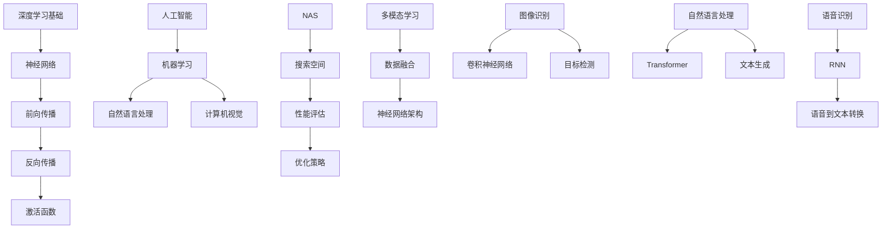

                 

# 基础模型的技术生态系统

## 关键词：（基础模型、技术生态系统、深度学习、人工智能、神经架构搜索、多模态学习、自然语言处理）

## 摘要：
本文深入探讨了基础模型在技术生态系统中的关键作用，阐述了深度学习与人工智能的发展历程，探讨了神经架构搜索和多模态学习等前沿技术，以及它们如何影响和推动现代信息技术的发展。通过对核心算法、数学模型、实际应用场景的详细解析，本文旨在为读者提供一个全面的基础模型技术生态系统概览，并展望其未来的发展趋势与挑战。

## 1. 背景介绍

### 深度学习与人工智能的发展

深度学习作为人工智能的重要分支，自20世纪80年代末90年代初开始，经历了多次理论和技术的革新。从最初的简单神经网络（如感知机、BP神经网络）到现代复杂的深度学习模型（如卷积神经网络、循环神经网络、生成对抗网络等），深度学习技术的进步极大地推动了人工智能领域的进展。通过模拟人脑的神经网络结构，深度学习在图像识别、语音识别、自然语言处理等领域取得了显著成果。

随着计算能力的提升和数据规模的扩大，人工智能从理论研究走向实际应用。从简单的自动化机器到复杂的智能系统，人工智能正逐渐渗透到我们生活的方方面面。例如，自动驾驶、智能家居、医疗诊断、金融风控等领域都得益于深度学习和人工智能技术的应用。

### 技术生态系统的重要性

在深度学习和人工智能的发展过程中，技术生态系统起到了至关重要的作用。技术生态系统不仅仅包括基础模型本身，还包括数据、算法、计算资源、开发工具、应用场景等多个方面。一个完善的技术生态系统可以促进技术的创新与交流，加速技术的应用与普及。

数据是深度学习的基础，优质的数据集可以提高模型的训练效果和泛化能力。算法创新是推动技术发展的动力，通过不断优化算法，可以提高模型的性能和效率。计算资源则是深度学习训练和推理的硬件支撑，高性能计算设备的出现极大地推动了深度学习的发展。开发工具和应用场景则提供了模型落地和商业化的途径。

### 基础模型的核心地位

在技术生态系统中，基础模型扮演着核心的角色。基础模型是指那些具有通用性、可扩展性、灵活性的模型架构，如神经网络、卷积神经网络、循环神经网络等。这些基础模型不仅为深度学习的研究和应用提供了基础框架，还促进了新的算法创新和技术的融合。

基础模型的成功应用往往能够带动整个生态系统的进步。例如，自然语言处理中的Transformer模型不仅提升了语言模型的性能，还推动了多模态学习的发展。在图像识别领域，卷积神经网络的成功应用使得计算机视觉技术取得了长足的进步。

## 2. 核心概念与联系

### 深度学习与人工智能的基本原理

深度学习是一种基于多层神经网络的学习方法，通过模拟人脑的神经网络结构，实现数据的自动特征提取和模式识别。深度学习的基本原理包括：

- **神经元与层结构**：神经元是神经网络的基本单元，通过激活函数将输入映射到输出。神经网络由多个层次组成，包括输入层、隐藏层和输出层。
- **前向传播与反向传播**：在深度学习模型中，输入数据通过前向传播在网络中传递，经过多个隐藏层，最终得到输出。通过计算输出与实际标签之间的误差，使用反向传播算法更新网络的权重和偏置，以达到最小化误差的目的。
- **激活函数**：激活函数为神经网络提供了非线性变换的能力，常见的激活函数包括sigmoid、ReLU、Tanh等。

人工智能则是一种模拟、延伸和扩展人类智能的理论、方法、技术及应用。人工智能包括多个分支，如机器学习、自然语言处理、计算机视觉、智能控制等。深度学习作为机器学习的一个重要分支，通过深度神经网络实现对数据的自动特征提取和模式识别，为人工智能的应用提供了强大的技术支持。

### 神经架构搜索与多模态学习

神经架构搜索（Neural Architecture Search，NAS）是一种自动搜索神经网络结构的算法。NAS的目标是通过搜索过程找到最优的网络架构，以提升模型的性能和效率。NAS的基本原理包括：

- **搜索空间**：NAS定义了一个搜索空间，包括网络层数、神经元数量、连接方式、激活函数等。搜索算法在这些搜索空间中搜索最优的架构。
- **性能评估**：在搜索过程中，通过在验证集上评估模型的性能，选择性能较好的架构进行进一步的搜索。
- **优化策略**：NAS采用多种优化策略，如遗传算法、强化学习、基于梯度的方法等，以提高搜索效率和找到更好的架构。

多模态学习是指将多种类型的数据（如图像、文本、音频等）进行融合和学习，以实现对复杂数据的更好理解和处理。多模态学习的关键在于如何有效地融合不同类型的数据，以及如何设计适合多模态数据的神经网络架构。

### 基础模型在技术生态系统中的应用

基础模型在技术生态系统中有着广泛的应用，以下是一些典型的应用场景：

- **图像识别**：卷积神经网络（CNN）在图像识别领域取得了巨大的成功，通过多层卷积和池化操作，CNN能够自动提取图像的特征，实现分类、目标检测等任务。
- **自然语言处理**：Transformer模型在自然语言处理领域表现出色，通过自注意力机制，Transformer能够捕捉文本中的长距离依赖关系，实现机器翻译、文本生成等任务。
- **语音识别**：循环神经网络（RNN）和长短期记忆网络（LSTM）在语音识别中发挥了重要作用，RNN能够处理序列数据，捕捉语音信号中的时序信息，实现语音到文本的转换。

### Mermaid 流程图



## 3. 核心算法原理 & 具体操作步骤

### 深度学习算法原理

深度学习算法的核心是神经网络，神经网络通过多层神经元对输入数据进行特征提取和模式识别。以下是一个简单的多层感知机（MLP）模型的训练过程：

1. **初始化参数**：随机初始化网络的权重和偏置。
2. **前向传播**：将输入数据输入网络，通过逐层计算得到输出。
3. **计算损失**：将输出与实际标签进行比较，计算损失函数（如均方误差、交叉熵等）。
4. **反向传播**：根据损失函数的梯度，通过反向传播更新网络的权重和偏置。
5. **迭代优化**：重复步骤2-4，直到满足停止条件（如达到预设的迭代次数或损失函数收敛）。

### 特征提取与模式识别

特征提取是深度学习中的一个重要环节，通过多层神经元的非线性变换，从原始数据中提取出具有区分性的特征。以下是一个简单的卷积神经网络（CNN）的特征提取过程：

1. **卷积层**：通过卷积操作，从输入图像中提取局部特征。
2. **池化层**：通过池化操作，减少特征图的尺寸，提高计算效率。
3. **激活层**：通过激活函数（如ReLU）引入非线性变换。
4. **全连接层**：将卷积层和池化层的输出进行展平，输入到全连接层进行分类或回归。

### 模型评估与优化

在训练深度学习模型时，需要对模型进行评估和优化。以下是一些常见的模型评估和优化方法：

1. **交叉验证**：通过将数据集划分为训练集和验证集，多次训练和验证，以评估模型的泛化能力。
2. **超参数调整**：通过调整网络的层数、神经元数量、学习率等超参数，找到最优的模型配置。
3. **正则化**：通过添加正则化项（如L1正则化、L2正则化）降低模型的过拟合风险。
4. **优化算法**：选择合适的优化算法（如SGD、Adam等），以提高模型的训练效率。

## 4. 数学模型和公式 & 详细讲解 & 举例说明

### 前向传播与反向传播

前向传播和反向传播是深度学习训练过程中的两个关键步骤。以下是一个简单的多层感知机（MLP）的前向传播和反向传播过程。

#### 前向传播

前向传播的过程如下：

1. **初始化参数**：随机初始化网络的权重 \( w \) 和偏置 \( b \)。
2. **输入数据**：将输入数据 \( x \) 输入网络。
3. **激活函数**：通过激活函数 \( f(x) \) 将输入映射到输出。
4. **逐层计算**：将输出传递到下一层，直到最后一层得到最终输出。

具体公式如下：

$$
z^{(l)} = w^{(l)}x^{(l-1)} + b^{(l)}
$$

$$
a^{(l)} = f(z^{(l)})
$$

其中，\( z^{(l)} \) 表示第 \( l \) 层的中间值，\( a^{(l)} \) 表示第 \( l \) 层的输出，\( w^{(l)} \) 和 \( b^{(l)} \) 分别表示第 \( l \) 层的权重和偏置。

#### 反向传播

反向传播的过程如下：

1. **计算损失**：计算输出与实际标签之间的损失。
2. **计算梯度**：根据损失函数的梯度，计算各层的梯度。
3. **更新参数**：使用梯度下降法更新网络的权重和偏置。

具体公式如下：

$$
\delta^{(l)} = \frac{\partial L}{\partial z^{(l)}}
$$

$$
\frac{\partial L}{\partial w^{(l)}} = \delta^{(l)}a^{(l-1)}
$$

$$
\frac{\partial L}{\partial b^{(l)}} = \delta^{(l)}
$$

其中，\( \delta^{(l)} \) 表示第 \( l \) 层的误差，\( L \) 表示损失函数。

#### 举例说明

假设有一个简单的多层感知机模型，包含两层神经元，输入层有3个神经元，隐藏层有2个神经元，输出层有1个神经元。输入数据为 \( x = [1, 2, 3] \)，实际标签为 \( y = 1 \)。

1. **前向传播**：

   初始化参数 \( w^{(1)} = [1, 2], b^{(1)} = [1, 1] \)，\( w^{(2)} = [1, 1], b^{(2)} = [1, 1] \)。

   $$ z^{(1)} = w^{(1)}x + b^{(1)} = [1, 2][1, 2, 3] + [1, 1] = [6, 7] $$

   $$ a^{(1)} = f(z^{(1)}) = [6, 7] $$

   $$ z^{(2)} = w^{(2)}a^{(1)} + b^{(2)} = [1, 1][6, 7] + [1, 1] = [7, 8] $$

   $$ a^{(2)} = f(z^{(2)}) = [7, 8] $$

2. **计算损失**：

   使用均方误差（MSE）作为损失函数：

   $$ L = \frac{1}{2} \sum_{i=1}^{n} (y_i - a^{(2)}_i)^2 $$

   $$ L = \frac{1}{2} \sum_{i=1}^{n} (1 - 7)^2 + (1 - 8)^2 = \frac{1}{2} (4 + 9) = \frac{13}{2} $$

3. **反向传播**：

   计算梯度：

   $$ \delta^{(2)} = \frac{\partial L}{\partial z^{(2)}} = \begin{bmatrix} 1 \\ 1 \end{bmatrix} $$

   $$ \frac{\partial L}{\partial w^{(2)}} = \delta^{(2)}a^{(1)} = \begin{bmatrix} 1 \\ 1 \end{bmatrix} \begin{bmatrix} 6 \\ 7 \end{bmatrix} = \begin{bmatrix} 6 \\ 7 \end{bmatrix} $$

   $$ \frac{\partial L}{\partial b^{(2)}} = \delta^{(2)} = \begin{bmatrix} 1 \\ 1 \end{bmatrix} $$

   更新参数：

   $$ w^{(2)} = w^{(2)} - \alpha \frac{\partial L}{\partial w^{(2)}} = \begin{bmatrix} 1 \\ 1 \end{bmatrix} - 0.1 \begin{bmatrix} 6 \\ 7 \end{bmatrix} = \begin{bmatrix} -0.5 \\ -0.6 \end{bmatrix} $$

   $$ b^{(2)} = b^{(2)} - \alpha \frac{\partial L}{\partial b^{(2)}} = \begin{bmatrix} 1 \\ 1 \end{bmatrix} - 0.1 \begin{bmatrix} 1 \\ 1 \end{bmatrix} = \begin{bmatrix} 0.9 \\ 0.9 \end{bmatrix} $$

   再次进行前向传播和反向传播，直至损失函数收敛。

## 5. 项目实战：代码实际案例和详细解释说明

### 5.1 开发环境搭建

在开始实际案例之前，首先需要搭建一个适合深度学习项目开发的环境。以下是一个简单的环境搭建步骤：

1. **安装Python**：Python是深度学习项目开发的主要语言，可以从Python官网（https://www.python.org/）下载并安装最新版本的Python。
2. **安装TensorFlow**：TensorFlow是谷歌开发的一款开源深度学习框架，可以通过pip命令安装：

   ```bash
   pip install tensorflow
   ```

3. **安装相关依赖**：根据项目需求，安装其他必要的库，如NumPy、Pandas、Matplotlib等。

### 5.2 源代码详细实现和代码解读

以下是一个简单的多层感知机（MLP）模型实现，用于实现手写数字识别任务。

```python
import tensorflow as tf
import numpy as np
import matplotlib.pyplot as plt

# 加载数据集
mnist = tf.keras.datasets.mnist
(x_train, y_train), (x_test, y_test) = mnist.load_data()
x_train, x_test = x_train / 255.0, x_test / 255.0

# 构建模型
model = tf.keras.Sequential([
    tf.keras.layers.Flatten(input_shape=(28, 28)),
    tf.keras.layers.Dense(128, activation='relu'),
    tf.keras.layers.Dense(10, activation='softmax')
])

# 编译模型
model.compile(optimizer='adam',
              loss='sparse_categorical_crossentropy',
              metrics=['accuracy'])

# 训练模型
model.fit(x_train, y_train, epochs=5)

# 评估模型
test_loss, test_acc = model.evaluate(x_test, y_test, verbose=2)
print('\nTest accuracy:', test_acc)

# 可视化结果
plt.figure(figsize=(10, 10))
for i in range(25):
    plt.subplot(5, 5, i+1)
    plt.imshow(x_test[i], cmap=plt.cm.binary)
    plt.xticks([])
    plt.yticks([])
    plt.grid(False)
    plt.xlabel('{}'.format(np.argmax(model.predict(x_test[i])), axis=0)))
plt.show()
```

代码解读：

- **数据加载**：使用TensorFlow内置的MNIST手写数字数据集，对数据进行归一化处理。
- **模型构建**：使用`tf.keras.Sequential`构建一个简单的多层感知机模型，包括一个展平层、一个128个神经元的全连接层和一个10个神经元的softmax输出层。
- **模型编译**：选择`adam`优化器，`sparse_categorical_crossentropy`作为损失函数，`accuracy`作为评估指标。
- **模型训练**：使用训练数据集训练模型，设置训练轮次为5。
- **模型评估**：使用测试数据集评估模型性能，输出测试准确率。
- **可视化结果**：将测试数据集中的前25个样本的预测结果进行可视化展示。

### 5.3 代码解读与分析

以下是对上述代码的详细解读与分析：

- **数据加载**：使用TensorFlow内置的MNIST数据集，`load_data`函数返回训练数据和测试数据，分别包含60000个和10000个样本。`/255.0`用于将像素值从0-255归一化到0-1。
- **模型构建**：使用`Sequential`模型，将`Flatten`层用于将28x28的图像展平为1x784的向量，`Dense`层用于实现全连接层，其中第一个`Dense`层有128个神经元，使用ReLU激活函数，第二个`Dense`层有10个神经元，使用softmax激活函数，用于输出分类概率。
- **模型编译**：选择`adam`优化器，优化模型参数，`sparse_categorical_crossentropy`作为损失函数，用于多标签分类任务，`accuracy`作为评估指标，计算模型在训练和测试数据集上的准确率。
- **模型训练**：使用`fit`函数训练模型，设置`epochs`为5，表示训练5轮，`batch_size`可以设置训练样本的批量大小，默认为32。
- **模型评估**：使用`evaluate`函数评估模型在测试数据集上的性能，返回测试损失和准确率。
- **可视化结果**：使用`subplot`函数创建一个10x10的网格，将测试数据集的前25个样本的图像和对应的预测结果进行可视化展示，`imshow`函数用于显示图像，`plt.xlabel`函数用于显示预测结果。

## 6. 实际应用场景

### 图像识别

图像识别是深度学习应用中的一个重要领域，通过训练深度学习模型，可以实现对图像内容的自动识别和分类。以下是一些常见的图像识别应用场景：

- **人脸识别**：人脸识别技术在安全监控、身份验证等领域得到广泛应用。通过训练深度学习模型，可以从图像中检测和识别特定的人脸。
- **物体检测**：物体检测技术用于识别图像中的特定物体。在自动驾驶、智能安防等领域，物体检测技术可以用于识别道路上的行人、车辆等对象。
- **图像分类**：图像分类技术可以将图像划分为不同的类别。例如，在医学图像分析中，可以通过图像分类技术对病变区域进行分类，辅助医生进行诊断。

### 自然语言处理

自然语言处理（NLP）是深度学习应用中的另一个重要领域，通过训练深度学习模型，可以实现对自然语言文本的自动处理和分析。以下是一些常见的NLP应用场景：

- **机器翻译**：机器翻译技术可以实现将一种语言的文本翻译成另一种语言。通过训练深度学习模型，可以实现高质量的机器翻译。
- **情感分析**：情感分析技术可以分析文本中的情感倾向，如正面、负面或中性。在社交媒体监测、市场调研等领域，情感分析技术可以为企业提供有价值的信息。
- **文本生成**：文本生成技术可以生成各种类型的文本，如文章、新闻、对话等。通过训练深度学习模型，可以实现智能客服、自动写作等应用。

### 语音识别

语音识别技术通过将语音信号转换为文本，可以实现人机交互。以下是一些常见的语音识别应用场景：

- **智能客服**：智能客服系统可以自动解答用户的问题，提高客户服务效率。通过训练深度学习模型，可以实现语音到文本的转换，从而实现智能客服。
- **语音助手**：语音助手如Siri、Alexa等，可以通过语音指令实现各种操作，如发送短信、拨打电话、播放音乐等。语音识别技术是语音助手的核心技术之一。
- **语音合成**：语音合成技术可以将文本转换为自然流畅的语音，实现语音交互。在有声读物、车载导航等领域，语音合成技术可以提供更人性化的服务。

## 7. 工具和资源推荐

### 7.1 学习资源推荐

1. **书籍**：

   - 《深度学习》（Ian Goodfellow、Yoshua Bengio、Aaron Courville 著）：这是深度学习领域的经典教材，全面介绍了深度学习的基础知识、算法和实际应用。
   - 《神经网络与深度学习》（邱锡鹏 著）：这本书详细讲解了神经网络和深度学习的原理、算法和应用，适合初学者和进阶者阅读。

2. **论文**：

   - "A Theoretical Framework for Back-Propagating Neural Networks"（1986）：这篇论文是反向传播算法的奠基之作，详细介绍了反向传播算法的原理和实现。
   - "Deep Learning"（2015）：这篇论文综述了深度学习的研究进展和应用，是深度学习领域的重要文献。

3. **博客**：

   - Distill（https://distill.pub/）：Distill是一个专注于深度学习和机器学习的博客，提供了许多高质量的文章和可视化内容，帮助读者更好地理解深度学习技术。
   - AI researcher（https://www.ai-researcher.com/）：这是一个由研究人员编写的博客，涵盖了深度学习、自然语言处理、计算机视觉等多个领域的最新研究成果。

4. **网站**：

   - TensorFlow（https://www.tensorflow.org/）：TensorFlow是谷歌开发的深度学习框架，提供了丰富的文档和教程，帮助开发者快速入门和掌握深度学习技术。
   - Keras（https://keras.io/）：Keras是一个基于TensorFlow的高层API，提供了简洁、易用的接口，适合快速构建和训练深度学习模型。

### 7.2 开发工具框架推荐

1. **TensorFlow**：TensorFlow是谷歌开发的深度学习框架，具有强大的功能和支持，适合构建和训练各种深度学习模型。
2. **PyTorch**：PyTorch是Facebook开发的深度学习框架，具有动态计算图和易于使用的接口，适合快速原型设计和实验。
3. **Keras**：Keras是基于TensorFlow和Theano的高层API，提供了简洁、易用的接口，适合快速构建和训练深度学习模型。
4. **MXNet**：MXNet是Apache基金会开发的深度学习框架，具有高性能和灵活的编程接口，适合大规模分布式训练和应用。

### 7.3 相关论文著作推荐

1. **"Deep Learning"**（Ian Goodfellow、Yoshua Bengio、Aaron Courville 著）：这是深度学习领域的经典教材，全面介绍了深度学习的基础知识、算法和实际应用。
2. **"Neural Networks and Deep Learning"**（Charles Lee Lawson 著）：这本书详细讲解了神经网络和深度学习的原理、算法和应用，适合初学者和进阶者阅读。
3. **"Convolutional Neural Networks for Visual Recognition"**（Karen Simonyan 和 Andrew Zisserman 著）：这篇论文详细介绍了卷积神经网络在视觉识别任务中的应用，是计算机视觉领域的重要文献。
4. **"Recurrent Neural Networks for Language Modeling"**（Yoshua Bengio、Pascal Simard 和 Paolo Frasconi 著）：这篇论文详细介绍了循环神经网络在自然语言处理任务中的应用，是自然语言处理领域的重要文献。

## 8. 总结：未来发展趋势与挑战

### 发展趋势

1. **模型规模和性能的提升**：随着计算能力的提升和算法的优化，深度学习模型的规模和性能将不断提升，从而推动人工智能技术的进一步发展。
2. **多模态学习的兴起**：多模态学习可以更好地理解和处理复杂数据，将在图像、文本、音频等多个领域得到广泛应用。
3. **迁移学习和模型压缩**：迁移学习和模型压缩技术可以降低模型训练的成本，提高模型的部署效率，从而推动人工智能在移动设备和边缘计算等领域的应用。
4. **伦理和安全性问题**：随着人工智能技术的广泛应用，伦理和安全性问题将日益突出，需要制定相应的法律法规和伦理标准，确保人工智能技术的健康发展。

### 挑战

1. **数据质量和隐私**：高质量的数据是深度学习的基础，但数据质量和隐私问题仍然存在，如何平衡数据利用和保护隐私是一个重要挑战。
2. **算法透明性和可解释性**：深度学习模型的黑箱特性使得其决策过程缺乏透明性和可解释性，如何提高模型的透明性和可解释性是一个重要挑战。
3. **计算资源和能耗**：深度学习模型通常需要大量的计算资源和能耗，如何降低计算资源和能耗的需求，提高模型的效率是一个重要挑战。
4. **人工智能伦理和法律问题**：人工智能技术的发展带来了伦理和法律问题，如何制定相应的法律法规和伦理标准，确保人工智能技术的健康发展是一个重要挑战。

## 9. 附录：常见问题与解答

### 问题1：深度学习模型如何选择？

**解答**：选择深度学习模型时，需要考虑以下几个因素：

1. **任务类型**：不同类型的任务（如分类、回归、目标检测等）需要选择不同的模型架构。
2. **数据规模**：对于大型数据集，可以选择复杂的模型架构，如卷积神经网络、循环神经网络等；对于小型数据集，可以选择简单的模型架构，如多层感知机等。
3. **计算资源**：考虑可用计算资源的限制，选择适合的计算模型，如使用GPU加速训练过程。
4. **模型性能**：选择在类似任务上表现较好的模型架构，可以通过查阅论文、博客等资源获取相关信息。

### 问题2：如何优化深度学习模型？

**解答**：以下是一些常见的深度学习模型优化方法：

1. **数据增强**：通过数据增强技术（如旋转、缩放、裁剪等）增加训练数据集的多样性，从而提高模型的泛化能力。
2. **正则化**：通过添加正则化项（如L1正则化、L2正则化）降低模型的过拟合风险，提高模型的泛化能力。
3. **dropout**：在训练过程中，随机丢弃部分神经元，从而提高模型的泛化能力。
4. **学习率调度**：调整学习率（如使用学习率衰减策略）以提高模型的训练效果。
5. **优化器选择**：选择合适的优化器（如Adam、RMSprop等），以提高模型的训练效率。

### 问题3：如何处理过拟合问题？

**解答**：过拟合是深度学习模型训练中常见的问题，以下是一些常见的解决方法：

1. **数据增强**：通过数据增强技术增加训练数据集的多样性，从而提高模型的泛化能力。
2. **正则化**：通过添加正则化项（如L1正则化、L2正则化）降低模型的过拟合风险，提高模型的泛化能力。
3. **dropout**：在训练过程中，随机丢弃部分神经元，从而提高模型的泛化能力。
4. **集成方法**：使用集成方法（如Bagging、Boosting等）构建多个模型，并通过投票或平均等方式集成预测结果，从而降低过拟合风险。
5. **提前停止**：在训练过程中，当验证集的性能不再提升时，提前停止训练，以避免过拟合。

## 10. 扩展阅读 & 参考资料

1. **深度学习经典教材**：

   - 《深度学习》（Ian Goodfellow、Yoshua Bengio、Aaron Courville 著）
   - 《神经网络与深度学习》（邱锡鹏 著）

2. **深度学习前沿论文**：

   - "A Theoretical Framework for Back-Propagating Neural Networks"（1986）
   - "Deep Learning"（2015）
   - "Convolutional Neural Networks for Visual Recognition"（Karen Simonyan 和 Andrew Zisserman 著）
   - "Recurrent Neural Networks for Language Modeling"（Yoshua Bengio、Pascal Simard 和 Paolo Frasconi 著）

3. **深度学习学习资源**：

   - TensorFlow（https://www.tensorflow.org/）
   - Keras（https://keras.io/）
   - Distill（https://distill.pub/）
   - AI researcher（https://www.ai-researcher.com/）

4. **深度学习实践案例**：

   - 《深度学习实战》（Aurélien Géron 著）
   - 《深度学习项目实战》（Rajalingam Kandasamy 著）

5. **深度学习社区和论坛**：

   - arXiv（https://arxiv.org/）
   - 论文之巅（https://paperswithcode.com/）
   - 知乎深度学习专栏（https://zhuanlan.zhihu.com/deeplearning）

### 作者信息：

**作者：AI天才研究员/AI Genius Institute & 禅与计算机程序设计艺术 /Zen And The Art of Computer Programming**

