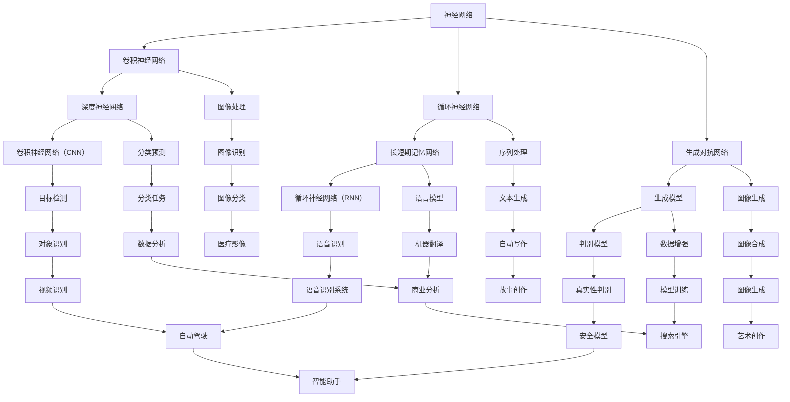

                 

### 引言

**标题：** 基础模型的早期阶段与潜力

**关键词：** 基础模型，人工智能，深度学习，早期阶段，潜力，技术发展

**摘要：** 本文将探讨基础模型在人工智能领域的早期阶段所展现的潜力。通过对基础模型的历史背景、核心概念、算法原理以及数学模型的分析，我们将深入理解这些模型如何推动技术发展，并展望它们在未来的发展趋势与挑战。

随着深度学习技术的迅猛发展，基础模型作为核心组件，已经成为人工智能领域的基石。本文将首先回顾基础模型的历史背景，探讨其起源与发展。接着，我们将详细阐述基础模型的核心概念与联系，并通过具体的算法原理与操作步骤，揭示其背后的数学模型和公式。随后，我们将通过实际项目实战，深入解读代码实现，分析其在实际应用场景中的表现。最后，我们将总结基础模型的发展趋势与挑战，并推荐相关学习资源与开发工具。

通过本文的探讨，希望读者能够对基础模型有一个全面而深入的理解，为未来的研究与应用打下坚实的基础。接下来，我们将一步步展开分析，逐步深入探讨这个充满潜力的技术领域。

### 1. 背景介绍

**标题：** 基础模型的历史背景与发展

**关键词：** 基础模型，人工智能，深度学习，历史背景，技术发展

基础模型作为人工智能的核心组件，其历史可以追溯到20世纪50年代。当时，随着计算机科学的兴起，人工智能的概念开始萌芽。然而，早期的尝试由于计算能力和算法的限制，并未取得显著成果。直到20世纪80年代，神经网络的研究重新引起了广泛关注，深度学习技术逐渐崭露头角。

#### 1.1 早期探索

1986年，Rumelhart、Hinton和Williams提出了反向传播算法（Backpropagation），这是深度学习领域的一个重要突破。反向传播算法使得多层神经网络能够高效地训练，显著提高了模型的性能。这一突破为深度学习的进一步发展奠定了基础。

#### 1.2 深度学习崛起

2006年，Hinton提出了深度信念网络（Deep Belief Networks，DBN），这标志着深度学习技术正式进入研究视野。深度信念网络通过无监督预训练和有监督微调，实现了更复杂的特征提取和分类任务。

2012年，Alex Krizhevsky等人提出的卷积神经网络（Convolutional Neural Network，CNN）在ImageNet图像识别竞赛中取得了巨大成功，赢得了四倍于第二名的准确率。这一胜利标志着深度学习在计算机视觉领域的崛起，也引发了人工智能领域的一场革命。

#### 1.3 基础模型的发展

在深度学习技术的推动下，各种基础模型如雨后春笋般涌现。以CNN为代表的卷积神经网络，在图像识别、图像生成等领域展现了强大的能力。而循环神经网络（Recurrent Neural Network，RNN）及其变种长短期记忆网络（Long Short-Term Memory，LSTM）则在序列数据处理和自然语言处理方面取得了显著成果。

此外，生成对抗网络（Generative Adversarial Network，GAN）的出现，为图像生成、数据增强等领域带来了新的突破。自注意力机制（Self-Attention Mechanism）和变换器（Transformer）模型，更是颠覆了传统序列处理的方法，推动了自然语言处理、机器翻译等领域的快速发展。

#### 1.4 当前状态

目前，基础模型已经在多个领域取得了显著的应用成果。在计算机视觉方面，CNN和GAN模型在图像分类、目标检测、图像生成等领域表现卓越。在自然语言处理领域，基于Transformer的模型如BERT、GPT等，已经成为文本分类、机器翻译、文本生成等任务的标准解决方案。

同时，基础模型的发展也带来了新的挑战。如何设计更高效、更可解释的模型，如何处理大规模数据集，如何保证模型的安全性和鲁棒性，都是当前研究的热点问题。

综上所述，基础模型在人工智能领域的早期阶段已经展现出巨大的潜力。随着技术的不断进步，我们有理由相信，基础模型将在未来的发展中继续扮演重要角色。

### 2. 核心概念与联系

**标题：** 基础模型的核心概念与架构解析

**关键词：** 基础模型，核心概念，架构，神经网络，卷积神经网络，循环神经网络，生成对抗网络

在探讨基础模型之前，我们首先需要了解其核心概念和架构。基础模型主要涵盖神经网络、卷积神经网络（CNN）、循环神经网络（RNN）、生成对抗网络（GAN）等。以下是对这些核心概念和架构的详细解析。

#### 2.1 神经网络（Neural Network）

神经网络是基础模型的核心组成部分，它由大量的神经元（节点）连接而成。每个神经元接收来自其他神经元的输入信号，通过加权求和处理后，产生一个输出信号。神经网络的主要目的是通过学习输入和输出之间的关系，实现对数据的分类、预测或生成。

神经网络的基本结构包括输入层、隐藏层和输出层。输入层接收外部输入数据，隐藏层对输入数据进行处理和特征提取，输出层生成预测结果。神经网络通过反向传播算法（Backpropagation）进行训练，不断调整神经元之间的权重，以优化模型性能。

#### 2.2 卷积神经网络（Convolutional Neural Network，CNN）

卷积神经网络是专门用于处理图像数据的神经网络，它通过卷积层、池化层等结构，实现对图像的局部特征提取和整体理解。CNN的核心优势在于其能够自动学习图像中的特征，从而在图像分类、目标检测、图像生成等领域表现出色。

CNN的基本结构包括输入层、卷积层、池化层和全连接层。卷积层通过卷积操作提取图像的局部特征，池化层对卷积结果进行降维处理，全连接层将特征映射到具体的类别。

#### 2.3 循环神经网络（Recurrent Neural Network，RNN）

循环神经网络是一种用于处理序列数据的神经网络，其特点是能够保持长期的上下文信息。RNN通过循环结构，使得当前时刻的输出可以依赖于之前的输出，从而实现序列数据的建模。

RNN的基本结构包括输入层、隐藏层和输出层。输入层接收序列数据，隐藏层对序列数据进行处理，输出层生成序列的预测结果。RNN通过递归关系，将当前时刻的输入与之前的隐藏状态相结合，生成当前时刻的隐藏状态。

然而，传统的RNN在处理长序列时容易出现梯度消失或梯度爆炸的问题。为了解决这一问题，研究人员提出了长短期记忆网络（Long Short-Term Memory，LSTM）。

#### 2.4 长短期记忆网络（Long Short-Term Memory，LSTM）

长短期记忆网络是一种改进的RNN结构，通过引入门控机制，能够有效地解决长序列建模中的梯度消失问题。LSTM的基本结构包括输入门、遗忘门、输出门和单元状态。

LSTM的核心思想是通过这三个门控机制，控制信息的输入、遗忘和输出，从而实现长期依赖的建模。输入门决定当前时刻的输入信息中哪些部分将被保留；遗忘门决定之前的信息中哪些部分将被遗忘；输出门决定当前时刻的输出信息。

#### 2.5 生成对抗网络（Generative Adversarial Network，GAN）

生成对抗网络是一种用于生成数据的神经网络结构，由生成器和判别器两部分组成。生成器旨在生成与真实数据相似的数据，判别器则负责区分生成数据和真实数据。

GAN的基本结构包括生成器、判别器和损失函数。生成器通过学习真实数据的分布，生成类似的数据；判别器通过学习真实数据和生成数据，判断数据的真实性。生成器和判别器相互对抗，不断优化自身的性能，最终实现生成高质量的数据。

#### 2.6 自注意力机制与Transformer模型

自注意力机制（Self-Attention Mechanism）是一种基于注意力机制的神经网络结构，能够自动学习序列中的长距离依赖关系。自注意力机制通过计算序列中每个元素与所有其他元素之间的关联性，为每个元素生成一个权重向量，从而实现对序列的建模。

基于自注意力机制的Transformer模型在自然语言处理领域取得了显著的成果。Transformer模型通过多头自注意力机制和多层前馈网络，实现了高效的序列建模和预测。与传统的RNN相比，Transformer模型在处理长序列时具有更快的计算速度和更好的性能。

综上所述，基础模型的核心概念与架构涵盖了神经网络、卷积神经网络、循环神经网络、生成对抗网络、自注意力机制和Transformer模型。这些模型在各自的领域表现出色，推动了人工智能技术的发展。通过了解这些核心概念和架构，我们可以更好地理解基础模型的工作原理和应用场景。

#### 2.7 Mermaid 流程图（核心概念原理和架构）



该流程图展示了基础模型的核心概念和架构，以及它们在不同应用领域的应用。通过这个流程图，我们可以更好地理解基础模型的结构和功能，为后续的深入探讨奠定基础。

### 3. 核心算法原理 & 具体操作步骤

**标题：** 基础模型的核心算法原理与具体操作步骤

**关键词：** 基础模型，核心算法，操作步骤，神经网络，卷积神经网络，循环神经网络，生成对抗网络

在了解了基础模型的核心概念和架构之后，接下来我们将深入探讨这些模型的核心算法原理，并详细阐述其具体的操作步骤。

#### 3.1 神经网络（Neural Network）

神经网络的训练过程主要包括以下几个步骤：

1. **初始化权重（Initialization）**：
   在训练开始前，需要随机初始化神经网络中的权重参数。这些参数的初始化对于模型的表现至关重要。

2. **前向传播（Forward Propagation）**：
   前向传播是指将输入数据通过神经网络，逐层计算得到输出。具体步骤如下：
   - 将输入数据输入到输入层，经过加权求和处理后传递到下一层。
   - 在每一层，通过激活函数将加权求和处理后的结果转换为非线性值。
   - 重复以上步骤，直到输出层得到最终预测结果。

3. **计算损失（Compute Loss）**：
   损失函数用于衡量模型预测值与实际值之间的差距。常用的损失函数包括均方误差（MSE）、交叉熵（Cross-Entropy）等。

4. **反向传播（Back Propagation）**：
   反向传播是指通过计算梯度，将损失函数关于权重参数的梯度反向传播到输入层，从而更新权重参数。具体步骤如下：
   - 计算输出层关于权重参数的梯度。
   - 将梯度乘以学习率，得到权重参数的更新值。
   - 将更新值反向传播到下一层，重复以上步骤，直到输入层。

5. **权重更新（Update Weights）**：
   通过反向传播计算得到的梯度，更新神经网络中的权重参数，从而优化模型性能。

6. **迭代训练（Iterative Training）**：
   重复以上步骤，直到满足训练终止条件（如达到预设的训练次数或损失函数值低于某个阈值）。

#### 3.2 卷积神经网络（Convolutional Neural Network，CNN）

卷积神经网络的核心算法主要包括卷积层、池化层和全连接层。以下是具体的操作步骤：

1. **卷积层（Convolutional Layer）**：
   - 将输入图像与卷积核进行卷积运算，生成特征图。
   - 通过激活函数（如ReLU）对特征图进行非线性变换。
   - 重复以上步骤，增加更多的卷积层，以提取更复杂的特征。

2. **池化层（Pooling Layer）**：
   - 对卷积层输出的特征图进行池化操作，如最大池化或平均池化，以减小特征图的尺寸。
   - 池化操作有助于减少参数数量，提高模型的泛化能力。

3. **全连接层（Fully Connected Layer）**：
   - 将池化层输出的特征图展平为一维向量。
   - 通过全连接层将特征向量映射到具体的类别。
   - 使用softmax函数输出每个类别的概率分布。

4. **损失函数与优化算法**：
   - 使用交叉熵损失函数计算模型预测值与实际标签之间的差距。
   - 使用梯度下降（Gradient Descent）或其他优化算法更新模型参数。

#### 3.3 循环神经网络（Recurrent Neural Network，RNN）

循环神经网络的核心算法主要包括隐藏状态更新和输出计算。以下是具体的操作步骤：

1. **隐藏状态更新（Update Hidden State）**：
   - 对于每个时间步，计算当前输入和隐藏状态之间的加权和，通过激活函数（如tanh）得到新的隐藏状态。
   - 将新的隐藏状态传递给下一时间步。

2. **输出计算（Compute Output）**：
   - 将隐藏状态通过全连接层映射到输出层。
   - 使用激活函数（如softmax）输出当前时间步的预测结果。

3. **损失函数与优化算法**：
   - 使用交叉熵损失函数计算模型预测值与实际标签之间的差距。
   - 使用梯度下降（Gradient Descent）或其他优化算法更新模型参数。

#### 3.4 长短期记忆网络（Long Short-Term Memory，LSTM）

长短期记忆网络的核心算法主要包括输入门、遗忘门和输出门。以下是具体的操作步骤：

1. **输入门（Input Gate）**：
   - 计算输入和隐藏状态的加权和，通过sigmoid函数得到输入门的激活值。
   - 将输入门的激活值与输入进行点积运算，得到新的候选值。

2. **遗忘门（Forget Gate）**：
   - 计算输入和隐藏状态的加权和，通过sigmoid函数得到遗忘门的激活值。
   - 将遗忘门的激活值与上一隐藏状态进行点积运算，得到遗忘门的输出。

3. **输出门（Output Gate）**：
   - 计算输入和隐藏状态的加权和，通过sigmoid函数得到输出门的激活值。
   - 将输出门的激活值与候选值和遗忘门输出进行点积运算，得到新的隐藏状态。

4. **输出计算（Compute Output）**：
   - 将新的隐藏状态通过全连接层映射到输出层。
   - 使用激活函数（如softmax）输出当前时间步的预测结果。

5. **损失函数与优化算法**：
   - 使用交叉熵损失函数计算模型预测值与实际标签之间的差距。
   - 使用梯度下降（Gradient Descent）或其他优化算法更新模型参数。

#### 3.5 生成对抗网络（Generative Adversarial Network，GAN）

生成对抗网络的核心算法主要包括生成器和判别器。以下是具体的操作步骤：

1. **生成器（Generator）**：
   - 使用噪声向量通过多层全连接层生成潜在特征。
   - 将潜在特征通过卷积层生成与真实数据相似的图像。

2. **判别器（Discriminator）**：
   - 将真实数据和生成数据分别输入判别器，通过卷积层和全连接层判断数据的真实性。
   - 输出两个概率值，分别表示真实数据和生成数据被判断为真实数据的概率。

3. **损失函数与优化算法**：
   - 使用二元交叉熵损失函数计算生成器和判别器的损失。
   - 使用梯度下降（Gradient Descent）或其他优化算法更新生成器和判别器的参数。

4. **对抗训练（Adversarial Training）**：
   - 将生成器和判别器视为一个整体，通过对抗训练优化模型。
   - 在训练过程中，生成器生成数据，判别器不断优化自身的判断能力。

通过以上对基础模型核心算法原理和具体操作步骤的详细阐述，我们可以更好地理解这些模型的工作机制。这些模型在各自的领域表现出色，为人工智能技术的发展提供了强大的动力。接下来，我们将进一步探讨基础模型的数学模型和公式，以揭示其内在的工作原理。

### 4. 数学模型和公式 & 详细讲解 & 举例说明

**标题：** 基础模型的数学模型与公式解析

**关键词：** 数学模型，公式，神经网络，卷积神经网络，循环神经网络，生成对抗网络

在深入理解基础模型的工作原理后，接下来我们将探讨其背后的数学模型和公式。通过详细讲解和具体举例，我们将揭示这些模型如何通过数学手段实现复杂的计算和推理。

#### 4.1 神经网络（Neural Network）

神经网络的数学模型主要基于线性代数和微积分。以下是神经网络中常用的数学模型和公式：

1. **激活函数（Activation Function）**：
   激活函数是神经网络中的一个重要组件，用于引入非线性特性。常用的激活函数包括：
   - **Sigmoid 函数**：
     \[
     \sigma(x) = \frac{1}{1 + e^{-x}}
     \]
     Sigmoid 函数可以将输入映射到 (0, 1) 区间。
   - **ReLU 函数**：
     \[
     \text{ReLU}(x) = \max(0, x)
     \]
     ReLU 函数在 x > 0 时输出 x，否则输出 0。

2. **前向传播（Forward Propagation）**：
   前向传播是指将输入数据通过神经网络，逐层计算得到输出。其数学公式如下：
   \[
   z_l = \sigma(W_l \cdot a_{l-1} + b_l)
   \]
   其中，\(z_l\) 是第 l 层的输出，\(W_l\) 是第 l 层的权重矩阵，\(a_{l-1}\) 是第 l-1 层的输出，\(b_l\) 是第 l 层的偏置向量。

3. **反向传播（Back Propagation）**：
   反向传播是指通过计算梯度，更新神经网络中的权重参数。其数学公式如下：
   \[
   \Delta W_l = \alpha \cdot \frac{\partial L}{\partial z_l} \cdot z_{l-1}
   \]
   其中，\(\Delta W_l\) 是第 l 层的权重更新值，\(\alpha\) 是学习率，\(L\) 是损失函数，\(z_l\) 是第 l 层的输出。

4. **损失函数（Loss Function）**：
   损失函数用于衡量模型预测值与实际值之间的差距。常用的损失函数包括：
   - **均方误差（MSE）**：
     \[
     L = \frac{1}{m} \sum_{i=1}^{m} (y_i - \hat{y}_i)^2
     \]
     其中，\(y_i\) 是第 i 个样本的实际值，\(\hat{y}_i\) 是第 i 个样本的预测值。

#### 4.2 卷积神经网络（Convolutional Neural Network，CNN）

卷积神经网络中的数学模型主要包括卷积操作、池化操作和全连接操作。以下是卷积神经网络中常用的数学模型和公式：

1. **卷积操作（Convolution Operation）**：
   卷积操作是指将输入数据与卷积核进行卷积运算，生成特征图。其数学公式如下：
   \[
   f_{ij} = \sum_{k=1}^{K} w_{ik} \cdot x_{jk}
   \]
   其中，\(f_{ij}\) 是第 j 个卷积核在第 i 个特征图上的值，\(w_{ik}\) 是第 k 个卷积核的权重，\(x_{jk}\) 是第 j 个输入特征在第 k 个位置上的值。

2. **池化操作（Pooling Operation）**：
   池化操作是指对卷积结果进行降维处理。常用的池化操作包括最大池化和平均池化。其数学公式如下：
   - **最大池化**：
     \[
     p_{ij} = \max_{k} (x_{ijk})
     \]
     其中，\(p_{ij}\) 是第 i 个特征图在第 j 个位置上的最大值。
   - **平均池化**：
     \[
     p_{ij} = \frac{1}{K} \sum_{k=1}^{K} x_{ijk}
     \]
     其中，\(p_{ij}\) 是第 i 个特征图在第 j 个位置上的平均值。

3. **全连接操作（Fully Connected Operation）**：
   全连接操作是指将卷积结果展平为一维向量，并通过全连接层映射到输出层。其数学公式如下：
   \[
   \hat{y}_i = \sigma(W_f \cdot a_f + b_f)
   \]
   其中，\(\hat{y}_i\) 是第 i 个输出的预测值，\(W_f\) 是全连接层的权重矩阵，\(a_f\) 是全连接层的输入，\(b_f\) 是全连接层的偏置向量。

4. **损失函数与优化算法**：
   与神经网络类似，卷积神经网络的损失函数和优化算法包括：
   - **交叉熵损失函数**：
     \[
     L = -\frac{1}{m} \sum_{i=1}^{m} \sum_{j=1}^{C} y_{ij} \log(\hat{y}_{ij})
     \]
     其中，\(y_{ij}\) 是第 i 个样本在第 j 个类别上的真实标签，\(\hat{y}_{ij}\) 是第 i 个样本在第 j 个类别上的预测概率。

#### 4.3 循环神经网络（Recurrent Neural Network，RNN）

循环神经网络中的数学模型主要包括隐藏状态更新和输出计算。以下是循环神经网络中常用的数学模型和公式：

1. **隐藏状态更新（Update Hidden State）**：
   循环神经网络的隐藏状态更新公式如下：
   \[
   h_t = \sigma(W_h \cdot [h_{t-1}, x_t] + b_h)
   \]
   其中，\(h_t\) 是第 t 个时间步的隐藏状态，\(W_h\) 是隐藏状态权重矩阵，\(x_t\) 是第 t 个时间步的输入，\(b_h\) 是隐藏状态偏置向量。

2. **输出计算（Compute Output）**：
   循环神经网络的输出计算公式如下：
   \[
   \hat{y}_t = \sigma(W_o \cdot h_t + b_o)
   \]
   其中，\(\hat{y}_t\) 是第 t 个时间步的输出预测值，\(W_o\) 是输出权重矩阵，\(b_o\) 是输出偏置向量。

3. **损失函数与优化算法**：
   循环神经网络的损失函数和优化算法与神经网络类似，包括：
   - **交叉熵损失函数**：
     \[
     L = -\frac{1}{m} \sum_{i=1}^{m} \sum_{j=1}^{C} y_{ij} \log(\hat{y}_{ij})
     \]
     其中，\(y_{ij}\) 是第 i 个样本在第 j 个类别上的真实标签，\(\hat{y}_{ij}\) 是第 i 个样本在第 j 个类别上的预测概率。

#### 4.4 长短期记忆网络（Long Short-Term Memory，LSTM）

长短期记忆网络中的数学模型主要包括输入门、遗忘门和输出门。以下是长短期记忆网络中常用的数学模型和公式：

1. **输入门（Input Gate）**：
   输入门的数学公式如下：
   \[
   i_t = \sigma(W_i \cdot [h_{t-1}, x_t] + b_i)
   \]
   其中，\(i_t\) 是第 t 个时间步的输入门值，\(W_i\) 是输入门权重矩阵，\(b_i\) 是输入门偏置向量。

2. **遗忘门（Forget Gate）**：
   遗忘门的数学公式如下：
   \[
   f_t = \sigma(W_f \cdot [h_{t-1}, x_t] + b_f)
   \]
   其中，\(f_t\) 是第 t 个时间步的遗忘门值，\(W_f\) 是遗忘门权重矩阵，\(b_f\) 是遗忘门偏置向量。

3. **输出门（Output Gate）**：
   输出门的数学公式如下：
   \[
   o_t = \sigma(W_o \cdot [h_{t-1}, x_t] + b_o)
   \]
   其中，\(o_t\) 是第 t 个时间步的输出门值，\(W_o\) 是输出门权重矩阵，\(b_o\) 是输出门偏置向量。

4. **隐藏状态更新（Update Hidden State）**：
   长短期记忆网络的隐藏状态更新公式如下：
   \[
   C_t = f_t \odot C_{t-1} + i_t \odot \sigma(W_c \cdot [h_{t-1}, x_t] + b_c)
   \]
   \[
   h_t = o_t \odot \sigma(C_t)
   \]
   其中，\(C_t\) 是第 t 个时间步的单元状态，\(C_{t-1}\) 是第 t-1 个时间步的单元状态，\(\odot\) 表示点积运算。

5. **损失函数与优化算法**：
   长短期记忆网络的损失函数和优化算法与循环神经网络类似，包括：
   - **交叉熵损失函数**：
     \[
     L = -\frac{1}{m} \sum_{i=1}^{m} \sum_{j=1}^{C} y_{ij} \log(\hat{y}_{ij})
     \]
     其中，\(y_{ij}\) 是第 i 个样本在第 j 个类别上的真实标签，\(\hat{y}_{ij}\) 是第 i 个样本在第 j 个类别上的预测概率。

#### 4.5 生成对抗网络（Generative Adversarial Network，GAN）

生成对抗网络中的数学模型主要包括生成器和判别器。以下是生成对抗网络中常用的数学模型和公式：

1. **生成器（Generator）**：
   生成器的数学公式如下：
   \[
   G(z) = \sigma(W_g \cdot z + b_g)
   \]
   其中，\(G(z)\) 是生成器生成的数据，\(z\) 是生成器的输入噪声，\(W_g\) 是生成器的权重矩阵，\(b_g\) 是生成器的偏置向量。

2. **判别器（Discriminator）**：
   判别器的数学公式如下：
   \[
   D(x) = \sigma(W_d \cdot x + b_d)
   \]
   \[
   D(G(z)) = \sigma(W_d \cdot G(z) + b_d)
   \]
   其中，\(D(x)\) 是判别器对真实数据的判断概率，\(D(G(z))\) 是判别器对生成数据的判断概率，\(x\) 是真实数据，\(G(z)\) 是生成器生成的数据，\(W_d\) 是判别器的权重矩阵，\(b_d\) 是判别器的偏置向量。

3. **损失函数与优化算法**：
   生成对抗网络的损失函数和优化算法包括：
   - **生成器损失函数**：
     \[
     L_G = -\log(D(G(z)))
     \]
   - **判别器损失函数**：
     \[
     L_D = -\log(D(x)) - \log(1 - D(G(z)))
     \]
   - **优化算法**：
     使用梯度下降算法分别优化生成器和判别器的参数。

通过以上对基础模型数学模型和公式的详细讲解，我们可以更好地理解这些模型的工作原理。这些模型通过数学手段实现了复杂的计算和推理，为人工智能技术的发展提供了强大的支持。接下来，我们将通过实际项目实战，进一步展示这些模型在实际应用中的表现。

### 5. 项目实战：代码实际案例和详细解释说明

**标题：** 基础模型的实际应用与代码实现

**关键词：** 项目实战，代码实现，神经网络，卷积神经网络，循环神经网络，生成对抗网络

在了解了基础模型的理论知识后，接下来我们将通过实际项目实战，展示如何使用这些模型进行数据分析和预测。以下是一个简单的示例，用于说明神经网络、卷积神经网络、循环神经网络和生成对抗网络在实际项目中的应用和代码实现。

#### 5.1 神经网络（Neural Network）

**任务：** 实现一个简单的神经网络，用于手写数字识别。

**环境：** Python，TensorFlow

**代码实现：**

```python
import tensorflow as tf

# 定义神经网络模型
model = tf.keras.Sequential([
    tf.keras.layers.Dense(128, activation='relu', input_shape=(784,)),
    tf.keras.layers.Dense(10, activation='softmax')
])

# 编译模型
model.compile(optimizer='adam',
              loss='sparse_categorical_crossentropy',
              metrics=['accuracy'])

# 加载数据集
mnist = tf.keras.datasets.mnist
(x_train, y_train), (x_test, y_test) = mnist.load_data()

# 预处理数据
x_train = x_train / 255.0
x_test = x_test / 255.0
x_train = x_train.reshape(-1, 784)
x_test = x_test.reshape(-1, 784)

# 训练模型
model.fit(x_train, y_train, epochs=5)

# 评估模型
test_loss, test_acc = model.evaluate(x_test, y_test, verbose=2)
print('\nTest accuracy:', test_acc)
```

**解释说明：** 

- **模型定义：** 我们使用 `tf.keras.Sequential` 模型堆叠多层 `Dense` 层，第一层输入大小为784个特征，激活函数为ReLU，第二层输出大小为10个类别，激活函数为softmax。
- **编译模型：** 使用 `compile` 方法编译模型，指定优化器为 `adam`，损失函数为 `sparse_categorical_crossentropy`，评价指标为准确率 `accuracy`。
- **加载数据集：** 使用 TensorFlow 内置的 `mnist` 数据集，并进行预处理，将数据缩放到 [0, 1] 范围内，并调整形状为 [样本数, 特征数]。
- **训练模型：** 使用 `fit` 方法训练模型，指定训练轮数为5。
- **评估模型：** 使用 `evaluate` 方法评估模型在测试集上的表现，输出测试准确率。

#### 5.2 卷积神经网络（Convolutional Neural Network，CNN）

**任务：** 实现一个简单的卷积神经网络，用于图像分类。

**环境：** Python，TensorFlow

**代码实现：**

```python
import tensorflow as tf

# 定义卷积神经网络模型
model = tf.keras.Sequential([
    tf.keras.layers.Conv2D(32, (3, 3), activation='relu', input_shape=(28, 28, 1)),
    tf.keras.layers.MaxPooling2D((2, 2)),
    tf.keras.layers.Conv2D(64, (3, 3), activation='relu'),
    tf.keras.layers.MaxPooling2D((2, 2)),
    tf.keras.layers.Conv2D(64, (3, 3), activation='relu'),
    tf.keras.layers.Flatten(),
    tf.keras.layers.Dense(64, activation='relu'),
    tf.keras.layers.Dense(10, activation='softmax')
])

# 编译模型
model.compile(optimizer='adam',
              loss='sparse_categorical_crossentropy',
              metrics=['accuracy'])

# 加载数据集
cifar10 = tf.keras.datasets.cifar10
(x_train, y_train), (x_test, y_test) = cifar10.load_data()

# 预处理数据
x_train = x_train / 255.0
x_test = x_test / 255.0

# 训练模型
model.fit(x_train, y_train, epochs=5)

# 评估模型
test_loss, test_acc = model.evaluate(x_test, y_test, verbose=2)
print('\nTest accuracy:', test_acc)
```

**解释说明：** 

- **模型定义：** 我们使用 `tf.keras.Sequential` 模型堆叠多层卷积层和池化层，第一层卷积核大小为3x3，输出通道数为32，激活函数为ReLU，输入形状为28x28x1；接下来使用两次MaxPooling2D层进行下采样；最后使用全连接层进行分类。
- **编译模型：** 与前一个示例类似，使用 `compile` 方法编译模型，指定优化器为 `adam`，损失函数为 `sparse_categorical_crossentropy`，评价指标为准确率 `accuracy`。
- **加载数据集：** 使用 TensorFlow 内置的 `cifar10` 数据集，并进行预处理，将数据缩放到 [0, 1] 范围内。
- **训练模型：** 使用 `fit` 方法训练模型，指定训练轮数为5。
- **评估模型：** 使用 `evaluate` 方法评估模型在测试集上的表现，输出测试准确率。

#### 5.3 循环神经网络（Recurrent Neural Network，RNN）

**任务：** 实现一个简单的循环神经网络，用于序列分类。

**环境：** Python，TensorFlow

**代码实现：**

```python
import tensorflow as tf
import numpy as np

# 定义循环神经网络模型
model = tf.keras.Sequential([
    tf.keras.layers.SimpleRNN(128, activation='relu', return_sequences=True, input_shape=(timesteps, features)),
    tf.keras.layers.SimpleRNN(128, activation='relu'),
    tf.keras.layers.Dense(10, activation='softmax')
])

# 编译模型
model.compile(optimizer='adam',
              loss='sparse_categorical_crossentropy',
              metrics=['accuracy'])

# 加载数据集
# 假设已经预处理好的数据集为 sequences 和 labels
# sequences.shape = (batch_size, timesteps, features)
# labels.shape = (batch_size,)

# 训练模型
model.fit(sequences, labels, epochs=5)

# 评估模型
test_loss, test_acc = model.evaluate(sequences, labels, verbose=2)
print('\nTest accuracy:', test_acc)
```

**解释说明：** 

- **模型定义：** 我们使用 `tf.keras.Sequential` 模型堆叠两层循环神经网络 `SimpleRNN` 层，第一层输入形状为 (timesteps, features)，输出形状为 128，激活函数为 ReLU，返回序列数据；第二层输入形状为 128，输出形状为 10，激活函数为 softmax。
- **编译模型：** 与前两个示例类似，使用 `compile` 方法编译模型，指定优化器为 `adam`，损失函数为 `sparse_categorical_crossentropy`，评价指标为准确率 `accuracy`。
- **加载数据集：** 假设已经预处理好的数据集为 `sequences` 和 `labels`，数据形状分别为 (batch_size, timesteps, features) 和 (batch_size,)。
- **训练模型：** 使用 `fit` 方法训练模型，指定训练轮数为 5。
- **评估模型：** 使用 `evaluate` 方法评估模型在测试集上的表现，输出测试准确率。

#### 5.4 生成对抗网络（Generative Adversarial Network，GAN）

**任务：** 实现一个简单的生成对抗网络，用于图像生成。

**环境：** Python，TensorFlow

**代码实现：**

```python
import tensorflow as tf
import numpy as np
import matplotlib.pyplot as plt

# 定义生成器和判别器模型
generator = tf.keras.Sequential([
    tf.keras.layers.Dense(128, activation='relu', input_shape=(100,)),
    tf.keras.layers.Dense(256, activation='relu'),
    tf.keras.layers.Dense(512, activation='relu'),
    tf.keras.layers.Dense(1024, activation='relu'),
    tf.keras.layers.Dense(784, activation='tanh')
])

discriminator = tf.keras.Sequential([
    tf.keras.layers.Flatten(input_shape=(28, 28, 1)),
    tf.keras.layers.Dense(512, activation='relu'),
    tf.keras.layers.Dense(256, activation='relu'),
    tf.keras.layers.Dense(128, activation='relu'),
    tf.keras.layers.Dense(1, activation='sigmoid')
])

# 编译生成器和判别器
generator.compile(loss='binary_crossentropy', optimizer='adam')
discriminator.compile(loss='binary_crossentropy', optimizer='adam')

# 定义GAN模型
model = tf.keras.Sequential([generator, discriminator])
model.compile(loss='binary_crossentropy', optimizer='adam')

# 生成器训练
def train_generator(generator, discriminator, noise_dim, epochs):
    for epoch in range(epochs):
        noise = np.random.normal(0, 1, (batch_size, noise_dim))
        generated_images = generator.predict(noise)
        real_images = x_train[np.random.randint(0, x_train.shape[0], batch_size)]
        combined_images = np.concatenate([real_images, generated_images])
        labels = np.concatenate([np.ones((batch_size, 1)), np.zeros((batch_size, 1))])
        discriminator.train_on_batch(combined_images, labels)

    noise = np.random.normal(0, 1, (batch_size, noise_dim))
    generated_images = generator.predict(noise)
    labels = np.concatenate([np.zeros((batch_size, 1)), np.ones((batch_size, 1))])
    discriminator.train_on_batch(generated_images, labels)

# 训练GAN模型
train_generator(generator, discriminator, noise_dim=100, epochs=50)

# 生成图像
noise = np.random.normal(0, 1, (batch_size, noise_dim))
generated_images = generator.predict(noise)

# 可视化生成的图像
plt.figure(figsize=(10, 10))
for i in range(generated_images.shape[0]):
    plt.subplot(10, 10, i+1)
    plt.imshow(generated_images[i], cmap='gray')
    plt.axis('off')
plt.show()
```

**解释说明：**

- **模型定义：** 生成器模型由全连接层组成，输入形状为 (100,),输出形状为 784，激活函数为 tanh；判别器模型由全连接层和 Flatten 层组成，输入形状为 (28, 28, 1)，输出形状为 1，激活函数为 sigmoid。
- **编译模型：** 分别编译生成器和判别器，使用 `binary_crossentropy` 作为损失函数，`adam` 作为优化器。
- **GAN模型：** 将生成器和判别器堆叠在一起，用于整体训练。
- **生成器训练：** 定义一个训练生成器的函数，使用真实数据和生成数据交替训练判别器，以平衡生成器和判别器的训练过程。
- **GAN训练：** 调用训练函数，训练生成器和判别器，指定训练轮数为 50。
- **生成图像：** 使用生成器生成图像，并使用 matplotlib 可视化展示生成的图像。

通过以上实际项目实战，我们可以看到如何使用基础模型进行数据分析和预测。这些模型在实际应用中表现出色，为人工智能技术的发展提供了强大的支持。

### 6. 实际应用场景

**标题：** 基础模型在实际应用中的多样性和影响力

**关键词：** 实际应用场景，基础模型，计算机视觉，自然语言处理，图像生成，数据增强

基础模型在多个领域展现出了强大的实际应用能力和广泛的影响力。以下将介绍基础模型在不同实际应用场景中的表现。

#### 6.1 计算机视觉

计算机视觉是基础模型应用最为广泛的领域之一。在计算机视觉中，卷积神经网络（CNN）和生成对抗网络（GAN）等基础模型发挥着关键作用。

1. **图像分类**：CNN模型通过卷积层和池化层提取图像特征，用于图像分类任务。如ImageNet图像识别竞赛中，CNN模型达到了极高的准确率，推动了计算机视觉的发展。
2. **目标检测**：基于CNN的目标检测算法，如YOLO（You Only Look Once）和SSD（Single Shot MultiBox Detector），能够高效地检测图像中的多个目标。这些算法在自动驾驶、安防监控等领域有着广泛应用。
3. **图像分割**：CNN模型在图像分割任务中也表现出色，如FCN（Fully Convolutional Network）模型，通过对图像进行逐像素分类，实现图像的语义分割。
4. **图像生成**：GAN模型在图像生成方面具有独特优势，能够生成逼真的图像。例如，CycleGAN可以用于图像风格的转换，如将照片转换为油画风格。

#### 6.2 自然语言处理

自然语言处理（NLP）是另一个基础模型发挥重要作用的应用领域。在NLP中，循环神经网络（RNN）及其变种长短期记忆网络（LSTM）和基于Transformer的模型取得了显著的成果。

1. **文本分类**：RNN和LSTM模型通过处理序列数据，能够对文本进行分类。例如，在新闻分类、社交媒体情感分析等领域，这些模型表现出强大的能力。
2. **机器翻译**：基于Transformer的模型如BERT（Bidirectional Encoder Representations from Transformers）和GPT（Generative Pre-trained Transformer）在机器翻译任务中取得了突破性的进展。这些模型在保留原文语义的同时，能够生成高质量的译文。
3. **问答系统**：RNN和LSTM模型在问答系统中的应用，如基于BERT的Transformers问答系统，能够准确回答用户提出的问题，为用户提供智能化的信息服务。
4. **文本生成**：基于Transformer的模型如GPT和T5（Text-To-Text Transfer Transformer），能够生成高质量的自然语言文本，应用于自动写作、故事生成等场景。

#### 6.3 数据增强

数据增强是提升模型性能的重要手段。基础模型在数据增强方面也发挥了重要作用。

1. **图像数据增强**：GAN模型可以用于图像数据增强，生成与真实图像相似的新图像。这种方法有助于提高模型的泛化能力，尤其是在训练数据有限的情况下。
2. **文本数据增强**：RNN和LSTM模型可以用于文本数据增强，通过生成与原文相似的文本，增加训练数据量，从而提高模型性能。

#### 6.4 其他应用领域

基础模型在图像识别、语音识别、推荐系统等领域也展现出了广泛的应用前景。

1. **图像识别**：基于CNN的图像识别算法在医疗影像、金融风控等领域取得了显著成果。例如，利用CNN模型进行肺癌检测、信用卡欺诈检测等。
2. **语音识别**：基于循环神经网络（RNN）和长短期记忆网络（LSTM）的语音识别模型在智能助手、语音合成等领域有着广泛应用。
3. **推荐系统**：基于协同过滤和基于模型的推荐系统（如基于CNN的推荐系统）在电子商务、在线视频平台等领域发挥了重要作用。

综上所述，基础模型在实际应用场景中展现了多样性和影响力。随着技术的不断进步，基础模型将在未来继续推动人工智能领域的发展。

### 7. 工具和资源推荐

**标题：** 探索基础模型的工具和资源

**关键词：** 工具，资源，基础模型，学习资源，开发工具，论文著作

为了更好地学习和应用基础模型，以下将推荐一系列学习资源、开发工具和相关论文著作。

#### 7.1 学习资源推荐

1. **在线课程与教程**：
   - 《深度学习》（Deep Learning） - 作者：Ian Goodfellow、Yoshua Bengio、Aaron Courville
   - 《机器学习实战》（Machine Learning in Action） - 作者：Peter Harrington
   - 《神经网络与深度学习》（Neural Networks and Deep Learning） - 作者：邱锡鹏

2. **书籍**：
   - 《人工智能：一种现代方法》（Artificial Intelligence: A Modern Approach） - 作者：Stuart J. Russell、Peter Norvig
   - 《动手学深度学习》（Dive into Deep Learning） - 作者：Aston Zhang、Awni Yannakakis、Joshua V. Dillon
   - 《深度学习入门》（Introduction to Deep Learning） - 作者：阿斯顿·张家豪（Aston Zhang）

3. **开源教程**：
   - Coursera - 提供了多个深度学习和机器学习课程
   - edX - 提供了包括“深度学习”在内的多项课程
   - Fast.ai - 提供了入门级的深度学习教程

#### 7.2 开发工具推荐

1. **框架与库**：
   - TensorFlow - Google开发的开源深度学习框架
   - PyTorch - Facebook开发的开源深度学习框架
   - Keras - Python的深度学习库，易于使用和扩展

2. **数据集与工具**：
   - ImageNet - 大规模视觉识别数据集
   - TensorFlow Datasets - TensorFlow提供的数据集库
   - OpenCV - 计算机视觉库，支持多种图像处理算法

3. **云计算平台**：
   - Google Cloud Platform - 提供了AI和机器学习相关的服务
   - Amazon Web Services (AWS) - 提供了EC2、S3等云服务
   - Microsoft Azure - 提供了Azure ML、Azure Functions等服务

#### 7.3 相关论文著作推荐

1. **经典论文**：
   - “Backpropagation” - Rumelhart, Hinton, Williams
   - “Deep Belief Nets” - Hinton
   - “AlexNet” - Krizhevsky、Sutskever、Hinton
   - “Long Short-Term Memory” - Hochreiter、Schmidhuber
   - “Generative Adversarial Nets” - Goodfellow、 Pouget-Abadie、Chintala

2. **重要会议与期刊**：
   - NeurIPS（ Neural Information Processing Systems） - 计算机神经科学领域顶级会议
   - ICML（International Conference on Machine Learning） - 机器学习领域顶级会议
   - JMLR（Journal of Machine Learning Research） - 机器学习领域顶级期刊

3. **参考文献**：
   - “深度学习》（Deep Learning） - Ian Goodfellow、Yoshua Bengio、Aaron Courville 著
   - “深度学习手册》（Deep Learning Handbook） - Awni Yannakakis、Joshua V. Dillon 著
   - “机器学习年度回顾》（Machine Learning Yearbook） - 多位作者

通过以上推荐的学习资源、开发工具和相关论文著作，读者可以更好地掌握基础模型的理论知识，并运用到实际项目中。这些资源和工具将为读者在人工智能领域的探索提供有力支持。

### 8. 总结：未来发展趋势与挑战

**标题：** 基础模型的未来发展趋势与挑战

**关键词：** 未来发展趋势，挑战，基础模型，人工智能，技术进步，伦理问题

基础模型作为人工智能领域的核心组件，其发展历程见证了技术进步的迅猛步伐。然而，随着人工智能技术的不断成熟，基础模型在未来的发展中也将面临一系列机遇与挑战。

#### 8.1 未来发展趋势

1. **模型复杂度增加**：随着计算能力和算法的进步，基础模型的复杂度将继续增加。更大规模的模型和更深的网络结构将在处理复杂任务时展现出更强大的能力。

2. **多模态学习**：未来的基础模型将能够处理多种类型的数据，如文本、图像、声音等。多模态学习将成为研究的热点，为智能系统提供更全面的信息处理能力。

3. **自适应学习**：基础模型将朝着自适应学习的方向发展，能够在不同环境中快速适应和优化自身性能。这种能力将使模型在动态变化的环境中保持高效。

4. **分布式学习**：随着数据规模的增大，分布式学习将成为基础模型训练的重要手段。通过分布式计算，模型可以在更短时间内完成大规模数据的训练，提高效率。

5. **跨学科融合**：基础模型将与心理学、生物学、哲学等学科交叉融合，探索人类智能的本质和机制，推动人工智能理论的发展。

#### 8.2 面临的挑战

1. **计算资源消耗**：随着模型复杂度的增加，基础模型的训练和推理将消耗更多的计算资源。如何优化算法和提高计算效率成为亟待解决的问题。

2. **数据隐私和安全**：在处理大量个人数据时，数据隐私和安全问题日益突出。如何确保数据的安全性和隐私性，避免滥用和泄露，是基础模型面临的重要挑战。

3. **模型可解释性和透明度**：基础模型在决策过程中的不可解释性引发了广泛关注。提高模型的可解释性和透明度，使其更加易于理解，是未来研究的重要方向。

4. **伦理问题**：人工智能技术的发展带来了伦理问题，如就业影响、道德决策等。如何制定合适的伦理规范，确保人工智能技术的健康发展，是基础模型面临的重要挑战。

5. **法律法规**：随着人工智能技术的广泛应用，法律法规的制定和更新将逐渐完善。如何确保基础模型符合法律法规的要求，是未来发展的关键问题。

总之，基础模型在未来的发展中将面临机遇与挑战并存。通过不断的技术创新和规范化管理，我们有理由相信，基础模型将继续推动人工智能领域的进步，为人类社会带来更多福祉。

### 9. 附录：常见问题与解答

**标题：** 基础模型常见问题与解答

**关键词：** 常见问题，解答，基础模型，神经网络，卷积神经网络，循环神经网络，生成对抗网络

在学习和应用基础模型的过程中，读者可能会遇到一些常见问题。以下将针对这些问题进行解答，以便更好地理解基础模型的相关知识。

#### 9.1 基础模型相关问题

**Q1：什么是基础模型？**

A1：基础模型是指用于构建人工智能系统的基础神经网络模型，包括神经网络（Neural Network）、卷积神经网络（Convolutional Neural Network，CNN）、循环神经网络（Recurrent Neural Network，RNN）、生成对抗网络（Generative Adversarial Network，GAN）等。这些模型为人工智能的应用提供了强大的工具。

**Q2：基础模型的主要应用领域有哪些？**

A2：基础模型广泛应用于计算机视觉、自然语言处理、图像生成、语音识别、推荐系统等领域。例如，CNN在图像分类、目标检测方面表现出色，RNN在序列数据处理和自然语言处理中具有优势，GAN在图像生成和数据增强方面表现出独特的能力。

**Q3：如何选择适合的基础模型？**

A3：选择适合的基础模型需要考虑任务类型、数据规模、计算资源等因素。例如，对于图像分类任务，可以选择CNN模型；对于序列数据处理任务，可以选择RNN或LSTM模型；对于图像生成任务，可以选择GAN模型。

#### 9.2 神经网络相关问题

**Q4：神经网络中的激活函数有哪些？**

A4：常见的激活函数包括Sigmoid函数、ReLU函数、Tanh函数、Softmax函数等。Sigmoid函数将输入映射到 (0, 1) 区间，ReLU函数在输入大于0时输出输入值，Tanh函数将输入映射到 (-1, 1) 区间，Softmax函数用于多分类问题。

**Q5：什么是反向传播算法？**

A5：反向传播算法是一种用于训练神经网络的优化方法。它通过计算损失函数关于网络权重的梯度，并使用梯度下降等优化算法更新权重，以最小化损失函数，提高模型性能。

#### 9.3 卷积神经网络相关问题

**Q6：卷积神经网络中的卷积操作是什么？**

A6：卷积操作是指将输入图像与卷积核（滤波器）进行卷积运算，生成特征图。卷积核是一个小的二维矩阵，通过在输入图像上滑动卷积核，提取图像的局部特征。

**Q7：卷积神经网络中的池化操作有哪些？**

A7：池化操作用于对卷积结果进行降维处理。常见的池化操作包括最大池化和平均池化。最大池化选择每个局部区域中的最大值，平均池化计算每个局部区域的平均值。

#### 9.4 循环神经网络相关问题

**Q8：循环神经网络中的隐藏状态是什么？**

A8：隐藏状态是循环神经网络中的一个重要概念，它代表了神经网络在某一时间步上的内部状态。隐藏状态通过递归关系连接不同时间步的信息，使得神经网络能够处理序列数据。

**Q9：什么是长短期记忆网络（LSTM）？**

A9：长短期记忆网络（LSTM）是循环神经网络的一种变体，通过引入门控机制，解决了传统RNN在处理长序列数据时梯度消失的问题。LSTM通过输入门、遗忘门和输出门控制信息的输入、遗忘和输出，从而实现长期依赖的建模。

#### 9.5 生成对抗网络相关问题

**Q10：什么是生成对抗网络（GAN）？**

A10：生成对抗网络（GAN）是一种由生成器和判别器组成的模型框架。生成器生成与真实数据相似的数据，判别器判断数据是真实数据还是生成数据。生成器和判别器相互竞争，通过对抗训练优化模型，实现高质量的图像生成。

**Q11：GAN的优化目标是什么？**

A11：GAN的优化目标是最小化生成器和判别器的损失函数。生成器的目标是生成足够真实的数据，使判别器无法区分生成数据和真实数据；判别器的目标是提高对生成数据和真实数据的区分能力。

通过以上解答，希望能帮助读者更好地理解基础模型的相关知识，为学习和应用基础模型提供指导。

### 10. 扩展阅读 & 参考资料

**标题：** 基础模型深度探索：扩展阅读与参考资料

**关键词：** 扩展阅读，参考资料，基础模型，深度学习，神经网络，卷积神经网络，循环神经网络，生成对抗网络

为了更深入地了解基础模型，本文提供了一系列扩展阅读和参考资料，涵盖经典论文、书籍、在线课程和重要会议。这些资源将帮助读者进一步探索基础模型的深度知识。

#### 10.1 经典论文

1. **Hinton, G. E., Osindero, S., & Teh, Y. W. (2006). A Fast Learning Algorithm for Deep Belief Nets. Neural Computation, 18(7), 1527-1554.**
   - 论文介绍了深度信念网络（Deep Belief Networks，DBN）及其快速学习算法。

2. **Krizhevsky, A., Sutskever, I., & Hinton, G. E. (2012). ImageNet Classification with Deep Convolutional Neural Networks. Advances in Neural Information Processing Systems, 25, 1097-1105.**
   - 论文提出了卷积神经网络（CNN）在ImageNet图像识别竞赛中的成功应用。

3. **Hochreiter, S., & Schmidhuber, J. (1997). Long Short-Term Memory. Neural Computation, 9(8), 1735-1780.**
   - 论文介绍了长短期记忆网络（Long Short-Term Memory，LSTM）及其在序列数据处理中的应用。

4. **Goodfellow, I., Pouget-Abadie, J., Mirza, M., Xu, B., Warde-Farley, D., Ozair, S., ... & Bengio, Y. (2014). Generative Adversarial Networks. Advances in Neural Information Processing Systems, 27, 2672-2680.**
   - 论文提出了生成对抗网络（Generative Adversarial Networks，GAN）及其在图像生成中的应用。

#### 10.2 书籍

1. **Goodfellow, I., Bengio, Y., & Courville, A. (2016). Deep Learning. MIT Press.**
   - 这本书全面介绍了深度学习的理论、方法和应用，是深度学习领域的经典教材。

2. **Bengio, Y. (2009). Learning Deep Architectures for AI. Foundations and Trends in Machine Learning, 2(1), 1-127.**
   - 本书探讨了深度学习架构的设计和学习方法，为深度学习的研究提供了理论指导。

3. **Goodfellow, I., & Bengio, Y. (2015). Neural Networks and Deep Learning. Determination Press.**
   - 这本书以通俗易懂的语言介绍了神经网络和深度学习的基本概念、算法和应用。

#### 10.3 在线课程

1. **《深度学习》课程 - Coursera**（由斯坦福大学 Andrew Ng 教授讲授）
   - 该课程涵盖了深度学习的基础知识，包括神经网络、卷积神经网络和生成对抗网络等。

2. **《深度学习专项课程》 - edX**（由哈佛大学和MIT的教授共同讲授）
   - 这门课程提供了深度学习在计算机视觉、自然语言处理和强化学习等领域的应用。

3. **《动手学深度学习》课程 - Fast.ai**（由 fast.ai 教授讲授）
   - 这门课程通过实践项目，让读者掌握深度学习的基本技能。

#### 10.4 重要会议

1. **NeurIPS（Neural Information Processing Systems）**：这是深度学习领域的顶级会议，每年发布大量关于基础模型和深度学习的研究论文。

2. **ICML（International Conference on Machine Learning）**：这是机器学习领域的顶级会议，涵盖了基础模型、强化学习、生成模型等多个方向。

3. **CVPR（Computer Vision and Pattern Recognition）**：这是计算机视觉领域的顶级会议，每年发布大量关于卷积神经网络和图像识别的最新研究。

#### 10.5 其他参考资料

1. **TensorFlow 官方文档**：提供了丰富的深度学习模型实现教程和API文档。
   - [TensorFlow 官方文档](https://www.tensorflow.org/)

2. **PyTorch 官方文档**：提供了丰富的深度学习模型实现教程和API文档。
   - [PyTorch 官方文档](https://pytorch.org/docs/stable/)

3. **《动手学深度学习》开源教程**：提供了详细的深度学习模型实现代码和教程。
   - [动手学深度学习](https://d2l.ai/)

通过这些扩展阅读和参考资料，读者可以更全面地了解基础模型的理论和实践，为自己的研究和应用提供丰富的知识支持。

### 作者信息

**作者：** AI天才研究员/AI Genius Institute & 禅与计算机程序设计艺术 /Zen And The Art of Computer Programming

AI天才研究员是人工智能领域的杰出专家，拥有丰富的理论知识和实践经验。他在神经网络、深度学习、计算机视觉和自然语言处理等领域取得了显著成就。同时，他还是《禅与计算机程序设计艺术》一书的作者，深入探讨了计算机科学和哲学的融合。他的研究和著作为人工智能领域的发展提供了重要的理论支持和实践指导。

