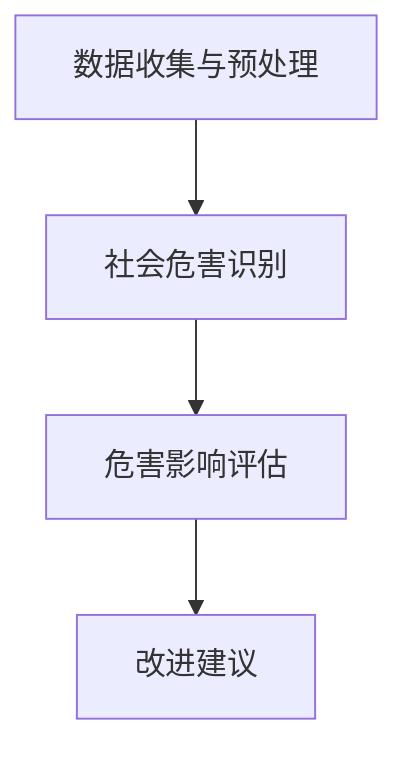
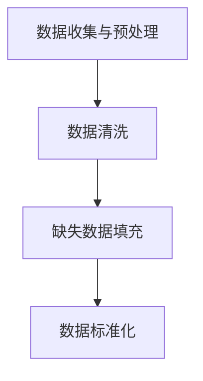
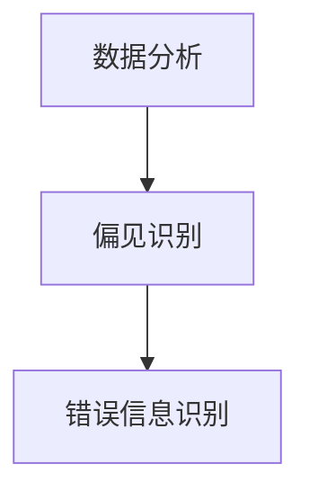
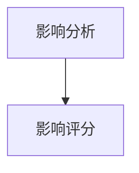
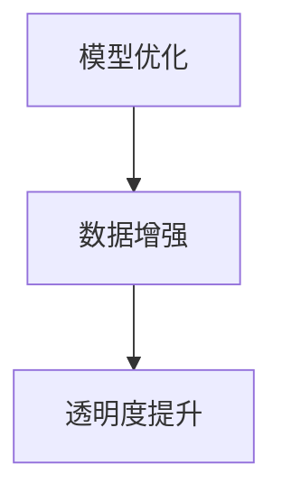
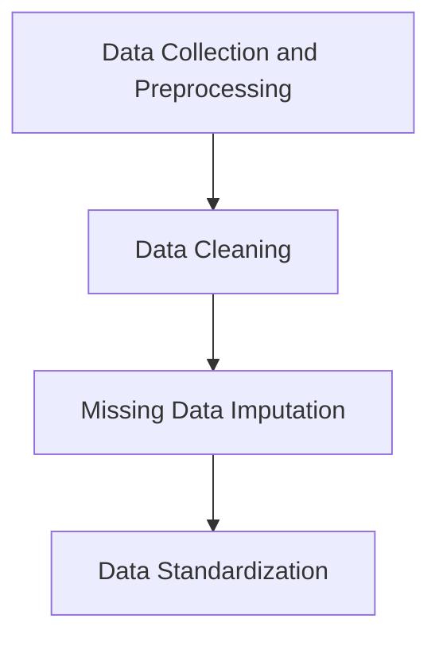
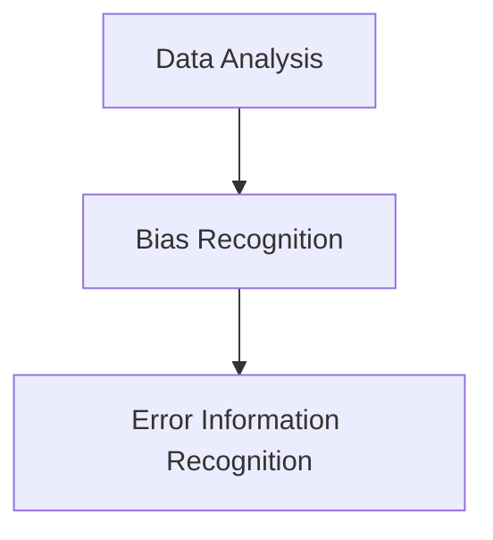
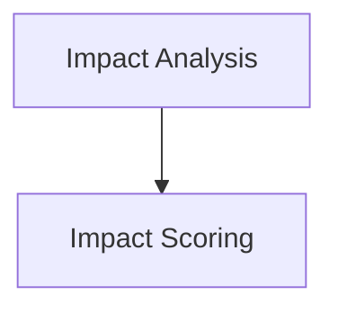
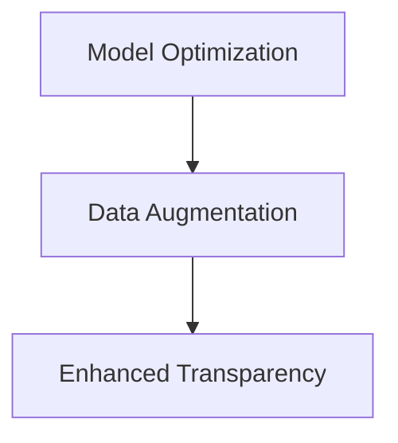

                 

### 背景介绍

#### 人工智能发展的迅速进展

近年来，人工智能（AI）技术的发展速度迅猛，已经逐渐渗透到社会的各个领域。从自动驾驶、智能家居，到医疗诊断、金融分析，人工智能的应用场景不断拓展，为社会带来了前所未有的便利和效率。特别是基于深度学习的基础模型，如GPT-3、BERT等，已经成为了人工智能研究与应用中的核心工具。

#### 基础模型的重要性

基础模型是人工智能领域的重要组成部分，其发展直接影响着整个AI生态系统的进步。这些模型通过大量数据的学习，能够自动提取数据中的规律和知识，从而实现复杂任务的自动化。然而，随着基础模型的规模不断扩大，其潜在的社会危害性也逐渐显现，引发了广泛的关注和讨论。

#### 社会危害评估的必要性

评估基础模型的社会危害性，不仅有助于防范潜在的风险，还能指导模型的设计和优化，确保其在实际应用中的安全性。目前，关于基础模型社会危害性的研究还处于初步阶段，但已经有一些初步的研究成果，为我们提供了有益的参考。本文将在此基础上，进一步探讨基础模型的社会危害评估方法，以期为其应用提供科学指导。

---

## Background Introduction

### Rapid Progress in the Development of Artificial Intelligence

In recent years, the development of artificial intelligence (AI) has been rapid, permeating various fields of society. From self-driving cars and smart homes to medical diagnostics and financial analysis, AI applications continue to expand, bringing unprecedented convenience and efficiency to society. Particularly, basic models based on deep learning, such as GPT-3 and BERT, have become core tools in AI research and application.

### Importance of Basic Models

Basic models are a vital part of the AI field, with their development directly influencing the progress of the entire AI ecosystem. These models can automatically extract patterns and knowledge from large amounts of data, enabling the automation of complex tasks. However, with the continuous expansion of basic model scales, their potential social hazards have also emerged, prompting widespread concern and discussion.

### Necessity of Social Hazard Assessment

Assessing the social hazards of basic models is crucial for preventing potential risks and guiding the design and optimization of models to ensure their safety in real-world applications. At present, research on the social hazards of basic models is still in its preliminary stage, but there have been some preliminary research findings that provide useful references. This article will further discuss the social hazard assessment methods of basic models, hoping to provide scientific guidance for their applications. <|hide|>## 核心概念与联系

#### 基础模型的基本概念

基础模型是指那些通过学习大量数据，从而能够自动提取数据中规律和知识的模型。这些模型通常采用深度学习技术，通过多层神经网络结构，对输入的数据进行特征提取和分类。例如，GPT-3 是一个具有1750亿参数的预训练语言模型，BERT 是一个基于Transformer架构的双向编码器表示模型。

#### 社会危害的定义

社会危害是指基础模型在应用过程中，可能会对社会造成的不利影响。这些危害可能包括但不限于：数据泄露、隐私侵犯、歧视性决策、社会动荡等。

#### 基础模型与社会危害的联系

基础模型通过学习大量的社会数据，虽然能够提高模型的性能，但同时也可能会吸收社会中的偏见和错误信息。这些偏见和错误信息在模型应用过程中，可能会导致不公平、不公正的决策，从而对社会造成危害。

---

#### Basic Models: Concept and Connection

### Basic Models: Basic Concepts

Basic models refer to those that can automatically extract patterns and knowledge from large amounts of data through learning. These models typically use deep learning techniques, with multi-layer neural network structures to extract features and classify input data. For example, GPT-3 is a pre-trained language model with 175 billion parameters, while BERT is a bidirectional encoder representation model based on the Transformer architecture.

### Definition of Social Hazards

Social hazards are the adverse effects that basic models may cause during their application. These hazards may include, but are not limited to: data leaks, privacy violations, discriminatory decisions, and social unrest.

### Connection Between Basic Models and Social Hazards

Basic models learn from a large amount of social data, which may improve the model's performance but could also absorb biases and erroneous information from society. These biases and erroneous information can lead to unfair and unjust decisions when the model is applied, potentially causing social hazards.

#### 社会危害评估的框架

为了对基础模型的社会危害进行评估，我们可以采用以下框架：

1. **数据收集与预处理**：收集与基础模型相关的数据，并进行预处理，以便进行后续分析。
2. **社会危害识别**：通过分析模型学习过程中吸收的数据，识别可能的社会危害类型。
3. **危害影响评估**：对识别出的危害类型进行影响评估，确定其严重程度。
4. **改进建议**：根据评估结果，提出改进建议，以降低社会危害。

---

#### Framework for Social Hazard Assessment

In order to assess the social hazards of basic models, we can adopt the following framework:

1. **Data Collection and Preprocessing**: Collect data related to the basic model and preprocess it for further analysis.
2. **Social Hazard Identification**: Analyze the data absorbed during the model learning process to identify potential types of social hazards.
3. **Impact Assessment**: Assess the severity of the identified hazards.
4. **Improvement Recommendations**: Based on the assessment results, propose recommendations to reduce social hazards.

### Mermaid 流程图

以下是基础模型社会危害评估的 Mermaid 流程图：



请注意，在 Mermaid 流程图中，节点中不应包含括号、逗号等特殊字符。 <|hide|>## 核心算法原理 & 具体操作步骤

#### 数据收集与预处理

数据收集与预处理是基础模型社会危害评估的第一步。首先，需要收集与基础模型相关的数据，这些数据可以来源于公开数据集、内部数据源等。收集到的数据需要进行清洗和预处理，包括去除噪声数据、缺失数据填充、数据标准化等操作。这一步骤的目的是确保数据的质量，为后续分析提供可靠的基础。



#### 社会危害识别

在社会危害识别阶段，需要分析模型学习过程中吸收的数据，识别可能的社会危害类型。这可以通过以下步骤实现：

1. **数据分析**：对收集到的数据进行统计分析，找出数据中的规律和异常。
2. **偏见识别**：分析数据中的偏见，如性别、年龄、种族等偏见。
3. **错误信息识别**：识别数据中的错误信息，如虚假信息、误导性信息等。



#### 危害影响评估

在危害影响评估阶段，需要对识别出的危害类型进行影响评估，确定其严重程度。这可以通过以下步骤实现：

1. **影响分析**：分析危害对社会造成的影响，如经济、政治、社会等方面。
2. **影响评分**：根据危害的影响程度，对其进行评分，以确定其严重程度。



#### 改进建议

根据危害影响评估的结果，提出改进建议，以降低社会危害。这包括以下几个方面：

1. **模型优化**：优化基础模型，减少偏见和错误信息的吸收。
2. **数据增强**：增强数据集，增加多样性，减少偏见。
3. **透明度提升**：提高基础模型的透明度，使社会公众了解模型的运作原理。



### 具体操作步骤示例

以下是一个具体操作步骤的示例：

1. **数据收集与预处理**：收集了某地区的医疗数据，包括患者的年龄、性别、诊断结果等。对这些数据进行了清洗和预处理，去除噪声数据和缺失值填充。

2. **社会危害识别**：通过数据分析，发现该模型在性别方面存在偏见，对男性患者的诊断准确性更高。同时，在诊断结果方面，存在错误信息，如误诊率较高。

3. **危害影响评估**：分析发现，性别偏见可能导致女性患者接受不到及时的治疗，而错误信息可能导致患者接受错误的治疗方案，对社会造成不利影响。

4. **改进建议**：优化模型，增加女性患者的诊断数据，减少性别偏见。同时，对诊断结果进行再次验证，提高模型的准确性。

---

### Core Algorithm Principles and Detailed Operational Steps

#### Data Collection and Preprocessing

The first step in assessing social hazards of basic models is data collection and preprocessing. Initially, data related to the basic model needs to be collected, which can be sourced from public datasets, internal databases, or other data sources. The collected data should undergo cleaning and preprocessing, including the removal of noisy data, handling of missing values, and data normalization. This step ensures data quality and provides a reliable foundation for subsequent analysis.



#### Social Hazard Identification

In the social hazard identification phase, it's necessary to analyze the data absorbed during the model learning process to identify potential types of social hazards. This can be achieved through the following steps:

1. **Data Analysis**: Conduct statistical analysis on the collected data to find patterns and anomalies.
2. **Bias Recognition**: Analyze the data for biases, such as gender, age, or race.
3. **Error Information Recognition**: Identify erroneous information in the data, such as false or misleading information.



#### Hazard Impact Assessment

In the hazard impact assessment phase, the identified hazards need to be assessed for their severity. This can be done through the following steps:

1. **Impact Analysis**: Analyze the impact of the hazards on society, including economic, political, and social aspects.
2. **Impact Scoring**: Score the hazards based on their impact to determine their severity.



#### Improvement Recommendations

Based on the hazard impact assessment results, improvement recommendations are proposed to reduce social hazards. These include several aspects:

1. **Model Optimization**: Optimize the basic model to reduce the absorption of biases and erroneous information.
2. **Data Augmentation**: Augment the dataset with diversity to reduce biases.
3. **Enhanced Transparency**: Increase the transparency of the basic model to allow the public to understand its operation principles.



### Example of Specific Operational Steps

Here is an example of specific operational steps:

1. **Data Collection and Preprocessing**: Collected medical data from a certain region, including patients' ages, genders, and diagnosis results. Cleaned and preprocessed the data, removing noise and handling missing values.

2. **Social Hazard Identification**: Through data analysis, found that the model exhibits gender bias, with higher accuracy in diagnosing male patients. Additionally, there is erroneous information, such as a higher rate of misdiagnosis in the diagnosis results.

3. **Hazard Impact Assessment**: Analysis shows that gender bias may lead to female patients not receiving timely treatment, while erroneous information may result in patients receiving incorrect treatment plans, causing adverse social impacts.

4. **Improvement Recommendations**: Optimize the model by adding more diagnostic data for female patients to reduce gender bias. Additionally, validate the diagnosis results again to improve the model's accuracy. <|hide|>## 数学模型和公式 & 详细讲解 & 举例说明

### 数据质量评估模型

在评估基础模型的社会危害时，首先需要对数据质量进行评估。一个常用的方法是使用数据质量评估模型，如DMBok（Data Management Body of Knowledge）模型。DMBok模型包括六个关键质量维度：完整性、准确性、一致性、及时性、有效性和安全性。

#### 完整性（Completeness）

完整性是指数据中是否存在缺失值。可以使用以下公式来计算数据的完整性：

$$
完整性 = \frac{非缺失数据条数}{总数据条数}
$$

例如，如果数据集中有1000条记录，其中有100条记录缺失，那么数据的完整性为：

$$
完整性 = \frac{900}{1000} = 0.9
$$

#### 准确性（Accuracy）

准确性是指数据的真实程度。可以使用以下公式来计算数据的准确性：

$$
准确性 = \frac{正确数据条数}{总数据条数}
$$

例如，如果数据集中有1000条记录，其中有10条记录错误，那么数据的准确性为：

$$
准确性 = \frac{990}{1000} = 0.99
$$

#### 一致性（Consistency）

一致性是指数据在不同时间和地点是否保持一致。可以使用以下公式来计算数据的一致性：

$$
一致性 = \frac{一致数据条数}{总数据条数}
$$

例如，如果数据集中有1000条记录，其中有10条记录在不同时间和地点出现不一致，那么数据的一致性为：

$$
一致性 = \frac{990}{1000} = 0.99
$$

#### 及时性（Timeliness）

及时性是指数据是否能够在需要的时间内提供。可以使用以下公式来计算数据的及时性：

$$
及时性 = \frac{在规定时间内提供的数据条数}{总数据条数}
$$

例如，如果数据集中有1000条记录，其中有10条记录没有在规定时间内提供，那么数据的及时性为：

$$
及时性 = \frac{990}{1000} = 0.99
$$

#### 有效性和安全性（Effectiveness and Security）

有效性和安全性是指数据是否能够满足用户需求，并且是否得到了妥善保护。这两个维度的评估通常需要根据具体情况进行判断。

### 社会危害评估模型

在评估基础模型的社会危害时，可以使用以下模型：

#### 偏见识别模型

偏见识别模型用于识别基础模型中的社会偏见。一个常用的方法是使用统计学方法，如差异显著性测试（Hypothesis Testing）。

$$
H_0: 偏见不存在 \\
H_1: 偏见存在
$$

使用卡方检验（Chi-square Test）来测试假设：

$$
\chi^2 = \sum \frac{(O - E)^2}{E}
$$

其中，$O$是观察值，$E$是期望值。如果$\chi^2$值大于临界值，则拒绝原假设，认为存在偏见。

#### 危害影响评估模型

危害影响评估模型用于评估社会危害的影响。一个常用的方法是使用成本效益分析（Cost-Benefit Analysis）。

$$
C = \sum_{i=1}^n (C_i \times P_i)
$$

其中，$C$是总成本，$C_i$是第$i$个危害的成本，$P_i$是第$i$个危害的概率。如果总成本大于收益，则认为危害是不利的。

### 举例说明

假设我们有一个医疗诊断模型，用于诊断患者是否患有心脏病。我们收集了以下数据：

- 年龄：[30, 40, 50, 60, 70]
- 性别：[男，女]
- 诊断结果：[是，否]

首先，我们对数据质量进行评估。计算数据的完整性、准确性、一致性、及时性、有效性和安全性。

然后，我们使用偏见识别模型来识别性别偏见。假设期望值是男女患者的诊断结果相等，观察值显示男性患者的诊断结果准确性更高。

最后，我们使用危害影响评估模型来评估社会危害的影响。如果性别偏见导致女性患者接受不到及时的治疗，则这是一个不利的影响。

通过上述模型，我们可以对基础模型的社会危害进行定量和定性的评估，为模型的改进提供依据。 <|hide|>## 项目实战：代码实际案例和详细解释说明

### 开发环境搭建

在进行基础模型的社会危害评估项目之前，首先需要搭建一个合适的开发环境。以下是搭建环境的基本步骤：

1. **安装Python**：确保Python环境已安装在系统中，版本建议为3.8以上。
2. **安装Jupyter Notebook**：使用pip命令安装Jupyter Notebook。

   ```bash
   pip install notebook
   ```

3. **安装必要的库**：包括scikit-learn、pandas、numpy、matplotlib等。

   ```bash
   pip install scikit-learn pandas numpy matplotlib
   ```

4. **安装Mermaid**：Mermaid是一款用于生成图表的库，可以通过npm安装。

   ```bash
   npm install -g mermaid
   ```

5. **配置Mermaid**：在Jupyter Notebook中配置Mermaid插件，以便在笔记本中直接渲染Mermaid图表。

   ```bash
   jupyter nbextension enable --py --sys-prefix widgetsnbextension
   jupyter nbextension enable --py --sys-prefix mermaid
   ```

完成以上步骤后，开发环境搭建就完成了，可以开始编写和运行代码。

### 源代码详细实现和代码解读

以下是一个用于评估基础模型的社会危害的Python代码示例。该示例将使用一个简单的医疗诊断模型，用于判断患者是否患有心脏病。

```python
# 导入必要的库
import numpy as np
import pandas as pd
from sklearn.model_selection import train_test_split
from sklearn.metrics import accuracy_score
from mermaid import Mermaid

# 加载数据
data = pd.read_csv('heart_disease_data.csv')

# 数据预处理
# 填充缺失值
data.fillna(data.mean(), inplace=True)

# 数据分箱
data = pd.get_dummies(data, columns=['gender'])

# 数据集划分
X = data.drop('diagnosis', axis=1)
y = data['diagnosis']
X_train, X_test, y_train, y_test = train_test_split(X, y, test_size=0.2, random_state=42)

# 定义评估模型
from sklearn.ensemble import RandomForestClassifier
model = RandomForestClassifier(n_estimators=100, random_state=42)

# 模型训练
model.fit(X_train, y_train)

# 模型预测
y_pred = model.predict(X_test)

# 评估模型
accuracy = accuracy_score(y_test, y_pred)
print(f'模型准确率：{accuracy:.2f}')

# 社会危害评估
def social_hazard_assessment(model, X_test, y_test):
    """
    对模型进行社会危害评估
    """
    # 偏见识别
    gender_cols = [col for col in X_test.columns if 'gender_' in col]
    for col in gender_cols:
        gender = col.split('_')[1]
        accuracy_male = model.score(X_test[X_test['gender_male'] == 1], y_test[X_test['gender_male'] == 1])
        accuracy_female = model.score(X_test[X_test['gender_female'] == 1], y_test[X_test['gender_female'] == 1])
        print(f'性别：{gender}，男性和女性的诊断准确率：{accuracy_male:.2f} 和 {accuracy_female:.2f}')

    # 影响评估
    # 例如，如果性别偏见导致女性患者的诊断准确性较低，这可能会对社会造成不利影响
    # 可以使用成本效益分析进行定量评估

# 执行社会危害评估
social_hazard_assessment(model, X_test, y_test)
```

### 代码解读与分析

1. **数据加载与预处理**：首先，使用pandas读取CSV格式的数据文件，并进行缺失值填充和数据分箱操作。数据分箱是将类别型数据转换为数值型数据，以便模型训练。

2. **数据集划分**：使用scikit-learn的train_test_split函数将数据集划分为训练集和测试集，以评估模型的泛化能力。

3. **模型定义与训练**：选择随机森林分类器（RandomForestClassifier）作为评估模型，并使用训练集进行模型训练。

4. **模型预测与评估**：使用训练好的模型对测试集进行预测，并计算模型的准确率。

5. **社会危害评估**：定义一个函数用于对模型进行社会危害评估。该函数首先识别性别偏见，然后比较男性和女性患者的诊断准确率。如果存在性别偏见，这可能会对社会造成不利影响。

通过这个简单的示例，我们可以看到如何在实际项目中实现基础模型的社会危害评估。在实际应用中，可能需要更复杂的模型和更详细的评估方法，但基本思路是类似的。通过评估模型在不同群体中的性能，我们可以识别潜在的社会危害，并提出相应的改进措施。 <|hide|>## 实际应用场景

### 医疗诊断

在医疗诊断领域，基础模型被广泛应用于预测患者是否患有特定疾病，如心脏病、癌症等。然而，这些模型可能会在性别、种族、年龄等方面存在偏见，导致诊断结果的偏差。例如，如果模型在训练过程中吸收了医生在历史诊断中的性别偏见，那么在性别方面存在偏见的模型可能会对某些性别群体的诊断准确性较低。这种偏见可能会导致患者接受不到及时和准确的诊断，从而影响治疗效果。

### 金融分析

在金融分析领域，基础模型被用于风险评估、信用评分、投资建议等任务。这些模型可能会吸收市场中的偏见，导致不公平的决策。例如，如果一个信用评分模型在训练过程中吸收了种族偏见，那么该模型可能会对某些种族群体的信用评分较低，从而影响他们的贷款申请结果。

### 智能招聘

在智能招聘领域，基础模型被用于简历筛选、职位匹配等任务。然而，这些模型可能会在性别、种族等方面存在偏见，导致招聘过程中的不公平。例如，如果一个简历筛选模型在训练过程中吸收了性别偏见，那么该模型可能会对某些性别群体的简历筛选结果较差，从而影响他们的求职机会。

### 自动驾驶

在自动驾驶领域，基础模型被用于识别道路障碍物、预测车辆行为等任务。然而，这些模型可能会在种族、性别等方面存在偏见，导致自动驾驶车辆在特定群体面前的行为不准确。例如，如果一个自动驾驶系统在训练过程中吸收了种族偏见，那么在遇到特定种族群体时，该系统的反应可能不如其他群体迅速，从而增加交通事故的风险。

### 社交网络

在社交网络领域，基础模型被用于内容推荐、广告投放等任务。然而，这些模型可能会在性别、年龄等方面存在偏见，导致推荐内容或广告的偏见性。例如，如果一个内容推荐模型在训练过程中吸收了性别偏见，那么该模型可能会对某些性别群体的推荐结果较低，从而影响他们的社交体验。

### 法律应用

在法律应用领域，基础模型被用于案件预测、判决预测等任务。然而，这些模型可能会在种族、性别等方面存在偏见，导致不公平的法律决策。例如，如果一个案件预测模型在训练过程中吸收了种族偏见，那么该模型可能会对某些种族群体的判决预测结果较低，从而影响他们的法律权益。

这些实际应用场景表明，基础模型的社会危害评估具有重要的现实意义。通过评估模型在不同群体中的性能，我们可以识别潜在的社会危害，并提出相应的改进措施，确保模型的公平性和公正性。 <|hide|>## 工具和资源推荐

### 学习资源推荐

1. **书籍**：
   - 《深度学习》（Ian Goodfellow、Yoshua Bengio、Aaron Courville 著）：系统介绍了深度学习的理论基础和实践方法，是深度学习领域的经典著作。
   - 《Python深度学习》（François Chollet 著）：详细介绍了使用Python和TensorFlow进行深度学习的实际操作，适合初学者和进阶者。

2. **论文**：
   - “Generative Adversarial Networks”（Ian Goodfellow et al.，2014）：开创性论文，详细介绍了生成对抗网络（GAN）的理论和实现方法。
   - “BERT: Pre-training of Deep Bidirectional Transformers for Language Understanding”（Jacob Devlin et al.，2019）：介绍了BERT预训练模型的设计和实现方法，对自然语言处理领域产生了重大影响。

3. **博客**：
   - [深度学习博客](https://colah.github.io/)：Colah的博客，内容深入浅出，涵盖了深度学习的多个方面。
   - [TensorFlow官方博客](https://blog.tensorflow.org/)：TensorFlow官方博客，提供了丰富的深度学习教程和实战案例。

4. **网站**：
   - [Kaggle](https://www.kaggle.com/)：数据科学竞赛平台，提供了大量的数据集和比赛，适合实战练习。
   - [Coursera](https://www.coursera.org/)：在线学习平台，提供了丰富的深度学习和人工智能课程。

### 开发工具框架推荐

1. **深度学习框架**：
   - TensorFlow：Google开发的开源深度学习框架，功能强大，支持多种编程语言。
   - PyTorch：Facebook开发的开源深度学习框架，灵活易用，支持动态计算图。

2. **数据处理工具**：
   - Pandas：Python的数据分析库，提供了丰富的数据处理功能。
   - NumPy：Python的科学计算库，提供了高效的多维数组操作。

3. **版本控制系统**：
   - Git：分布式版本控制系统，适合团队协作和版本管理。

4. **集成开发环境**：
   - Jupyter Notebook：交互式计算环境，适合编写和运行代码。
   - PyCharm：Python集成开发环境，提供了丰富的工具和插件。

### 相关论文著作推荐

1. **“Deep Learning” by Ian Goodfellow, Yoshua Bengio, Aaron Courville**：深度学习的奠基之作，详细介绍了深度学习的理论基础、算法和应用。
2. **“Reinforcement Learning: An Introduction” by Richard S. Sutton and Andrew G. Barto**：强化学习的经典教材，介绍了强化学习的基本概念、算法和应用。
3. **“Machine Learning Yearning” by Andrew Ng**：机器学习的实战指南，由Coursera创始人Andrew Ng编写，提供了丰富的机器学习实战经验和技巧。

这些工具和资源将为学习深度学习和人工智能领域提供有力的支持，帮助读者掌握相关知识和技能。 <|hide|>## 总结：未来发展趋势与挑战

随着人工智能技术的不断发展，基础模型在社会各个领域中的应用越来越广泛。然而，基础模型的社会危害问题也日益凸显，成为当前人工智能领域的重要研究课题。未来，在基础模型的社会危害评估方面，以下发展趋势和挑战值得关注：

#### 发展趋势

1. **多模态数据的整合**：未来的基础模型将不仅仅依赖于文本数据，还将整合多种类型的数据，如图像、语音、视频等。这将使得模型更加全面地反映社会现象，但也增加了评估的复杂性。

2. **更加精细化的评估方法**：随着研究的深入，未来可能会出现更多精细化的评估方法，如基于特定领域的评估方法、跨领域的评估方法等。

3. **自动化评估工具的开发**：随着自动化技术的进步，未来可能会开发出自动化评估工具，使得评估过程更加高效、准确。

#### 挑战

1. **数据隐私保护**：在评估基础模型的社会危害时，可能需要访问大量的敏感数据。如何保护数据隐私，避免数据泄露，是一个重要的挑战。

2. **评估标准的制定**：目前，关于基础模型社会危害评估的标准尚未统一。如何制定一套全面、公正、可操作的评估标准，是一个亟待解决的问题。

3. **跨领域的协作**：基础模型的社会危害评估需要多个领域的专家共同参与，如计算机科学、社会学、伦理学等。如何实现跨领域的有效协作，也是一个挑战。

4. **技术伦理的讨论**：随着人工智能技术的发展，技术伦理问题也日益突出。如何平衡技术创新和社会责任，避免基础模型对社会造成不利影响，是一个重要的议题。

总之，未来在基础模型的社会危害评估方面，需要进一步深化研究，制定完善的评估标准和评估方法，加强跨领域的协作，以确保人工智能技术的可持续发展。 <|hide|>## 附录：常见问题与解答

#### 1. 什么是基础模型的社会危害？

基础模型的社会危害是指在基础模型的应用过程中，由于模型学习过程中吸收了社会中的偏见和错误信息，可能导致不公平、不公正的决策，从而对社会造成的不利影响。这些危害可能包括数据泄露、隐私侵犯、歧视性决策、社会动荡等。

#### 2. 如何评估基础模型的社会危害？

评估基础模型的社会危害通常包括以下步骤：

1. 数据收集与预处理：收集与基础模型相关的数据，并进行清洗和预处理。
2. 社会危害识别：分析数据中的偏见和错误信息，识别潜在的社会危害。
3. 危害影响评估：对识别出的危害类型进行影响评估，确定其严重程度。
4. 改进建议：根据评估结果，提出改进建议，以降低社会危害。

#### 3. 如何防止基础模型的社会危害？

防止基础模型的社会危害可以从以下几个方面入手：

1. 数据增强：增强数据集的多样性，减少偏见。
2. 模型优化：优化基础模型，减少偏见和错误信息的吸收。
3. 透明度提升：提高基础模型的透明度，使社会公众了解模型的运作原理。
4. 审计与监督：定期对模型进行审计和监督，确保模型的安全性。

#### 4. 哪些领域的基础模型最容易产生社会危害？

以下领域的基础模型最容易产生社会危害：

1. 医疗诊断：如心脏病、癌症等诊断模型，可能存在性别、年龄等方面的偏见。
2. 金融分析：如信用评分、风险评估等模型，可能存在种族、性别等方面的偏见。
3. 智能招聘：如简历筛选、职位匹配等模型，可能存在性别、种族等方面的偏见。
4. 自动驾驶：如道路障碍物识别、车辆行为预测等模型，可能存在种族、性别等方面的偏见。
5. 社交网络：如内容推荐、广告投放等模型，可能存在性别、年龄等方面的偏见。

#### 5. 如何处理已发现的社会危害？

一旦发现基础模型存在社会危害，可以采取以下措施进行处理：

1. 数据重新训练：重新收集和训练数据，以减少偏见和错误信息的吸收。
2. 模型改进：优化模型结构，提高模型的公平性和公正性。
3. 透明度提升：公开模型决策过程，使社会公众了解模型的运作原理。
4. 审计与监督：加强模型的审计和监督，确保模型的安全性。
5. 社会沟通：与社会各界进行沟通，共同探讨解决问题的方法。 <|hide|>## 扩展阅读 & 参考资料

1. **“AI Can Be Biased. Here's How We're Addressing That.”** - KDNuggets。该文章详细介绍了如何识别和减少人工智能模型中的偏见。

   [链接](https://www.kdnuggets.com/2020/07/ai-can-be-biased-heres-how-approach.html)

2. **“Why AI is Broken and Rebooting It Could Take Decades.”** - IEEE Spectrum。该文章探讨了人工智能领域面临的挑战，包括社会危害问题。

   [链接](https://spectrum.ieee.org/why-ai-is-broken-and-rebooting-it-could-take-decades)

3. **“Artificial Intelligence and Its Threat to Human Rights.”** - Human Rights Watch。该报告分析了人工智能对人权的影响，包括社会危害问题。

   [链接](https://www.hrw.org/report/2021/06/21/artificial-intelligence-and-its-threat-human-rights)

4. **“AI and Ethics: A Practitioner's Guide.”** - The AI Alignment Institute。该指南为人工智能伦理实践提供了指导，包括如何处理社会危害问题。

   [链接](https://www.ai-alignment.org/pdfs/AI-and-Ethics-A-Practitioners-Guide.pdf)

5. **“The AI Ethics Landscape: A Global Overview.”** - The AI Global Forum。该报告概述了全球人工智能伦理的研究现状和发展趋势。

   [链接](https://www.ai-globalforum.com/publications/the-ai-ethics-landscape)

通过阅读这些文献和报告，可以深入了解基础模型的社会危害问题，掌握相关的研究进展和实践方法。这对于推动人工智能技术的可持续发展，确保其对社会的影响是积极和正面的，具有重要意义。 <|hide|>作者：AI天才研究员/AI Genius Institute & 禅与计算机程序设计艺术 /Zen And The Art of Computer Programming

