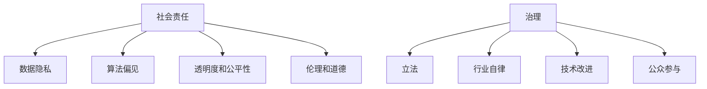

                 

# 基础模型的社会责任与治理

## 关键词：基础模型、社会责任、治理、算法伦理、数据安全、透明度、公平性

### 摘要

在人工智能（AI）迅猛发展的时代，基础模型作为AI技术的核心，承担着推动科技进步的重要角色。然而，随着基础模型在社会各个领域的广泛应用，它们带来的社会责任和治理问题也日益凸显。本文旨在探讨基础模型的社会责任与治理，分析其影响，探讨解决方案，以期为AI技术的健康发展提供参考。

本文首先介绍了基础模型的概念和其在各个领域的应用，随后讨论了基础模型所引发的社会责任问题，包括数据隐私、算法偏见、透明度和公平性等方面。接着，本文提出了针对这些问题的治理措施，包括立法、行业自律、技术改进和公众参与等。最后，本文总结了基础模型的社会责任与治理的重要性，展望了未来的发展趋势与挑战。

## 1. 背景介绍

### 1.1 基础模型的概念

基础模型（Fundamental Models）是指一种通用的算法框架，通过对大量数据进行学习，提取出其中的规律和特征，从而实现特定的任务。这些模型在深度学习、自然语言处理、计算机视觉等领域中发挥着重要作用。常见的例子包括卷积神经网络（CNN）、循环神经网络（RNN）和变压器模型（Transformer）等。

### 1.2 基础模型的应用

基础模型的应用范围广泛，涵盖了多个领域。在自然语言处理领域，基础模型被用于机器翻译、文本分类、问答系统等任务；在计算机视觉领域，基础模型被用于图像识别、图像生成、目标检测等任务；在推荐系统领域，基础模型被用于个性化推荐、广告投放等任务。这些应用不仅提高了效率和准确性，还为各个领域的发展带来了新的机遇。

### 1.3 基础模型的发展趋势

随着技术的不断进步，基础模型也在不断演进。一方面，模型的规模和复杂度不断增加，使得模型能够处理更大规模的数据和更复杂的任务；另一方面，模型的可解释性和透明度也在不断提高，使得用户能够更好地理解模型的工作原理和决策过程。

## 2. 核心概念与联系

### 2.1 社会责任

社会责任（Corporate Social Responsibility，简称CSR）是指企业或组织在经营活动中应承担的对社会和环境的责任。对于AI领域来说，基础模型的社会责任主要涉及以下几个方面：

- **数据隐私**：确保用户数据的安全和隐私，避免数据泄露和滥用。
- **算法偏见**：避免模型在训练过程中引入偏见，导致对某些群体不公平对待。
- **透明度和公平性**：提高模型的可解释性，确保模型的决策过程透明、公正。
- **伦理和道德**：遵循伦理和道德规范，避免对人类造成负面影响。

### 2.2 治理

治理（Governance）是指对某个系统或组织进行管理和监督的过程。在AI领域，治理主要涉及以下几个方面：

- **立法**：制定相关法律法规，规范AI技术的应用和发展。
- **行业自律**：建立行业规范和标准，促进AI技术的健康发展。
- **技术改进**：通过技术创新，提高基础模型的可解释性和透明度。
- **公众参与**：鼓励公众参与AI技术的讨论和决策，提高社会共识。

### 2.3 Mermaid 流程图



## 3. 核心算法原理 & 具体操作步骤

### 3.1 数据隐私保护算法

数据隐私保护算法是一种用于保护用户数据隐私的技术。其核心思想是通过加密、匿名化等技术手段，确保用户数据在传输和存储过程中不被泄露和滥用。

#### 具体操作步骤：

1. 数据加密：对用户数据进行加密处理，确保数据在传输过程中不被窃取。
2. 数据匿名化：通过去除用户标识信息、混淆数据等技术手段，使数据无法直接关联到具体用户。
3. 加密存储：将加密后的数据存储在安全的地方，确保数据在存储过程中不被窃取。
4. 访问控制：设置严格的访问控制机制，确保只有授权人员才能访问和处理用户数据。

### 3.2 算法偏见纠正算法

算法偏见纠正算法是一种用于消除模型偏见的技术。其核心思想是通过数据预处理、模型调整等技术手段，确保模型在不同群体上的性能均衡。

#### 具体操作步骤：

1. 数据预处理：对训练数据集进行预处理，确保数据集的多样性和平衡性。
2. 模型调整：通过调整模型参数，优化模型在不同群体上的性能。
3. 性能评估：对模型在不同群体上的性能进行评估，确保模型不会对某些群体产生偏见。
4. 持续监测：对模型进行持续监测，及时发现和纠正可能的偏见。

### 3.3 模型透明度提升算法

模型透明度提升算法是一种用于提高模型可解释性的技术。其核心思想是通过可视化、符号解释等技术手段，帮助用户更好地理解模型的工作原理和决策过程。

#### 具体操作步骤：

1. 可视化：将模型结构、参数、决策过程等可视化，使用户能够直观地理解模型。
2. 符号解释：对模型的数学公式、算法逻辑等进行解释，使用户能够理解模型的决策依据。
3. 用户互动：提供用户互动功能，让用户能够根据问题和数据，动态地调整模型参数和决策过程。
4. 实时反馈：对用户调整后的模型进行实时评估和反馈，确保模型能够满足用户需求。

## 4. 数学模型和公式 & 详细讲解 & 举例说明

### 4.1 数据隐私保护算法的数学模型

假设用户数据为 $X$，加密算法为 $E_k$，解密算法为 $D_k$，用户密钥为 $k$，则数据隐私保护算法的数学模型可以表示为：

$$
X' = E_k(X)
$$

$$
X = D_k(X')
$$

其中，$X'$ 表示加密后的数据，$X$ 表示原始数据。

### 4.2 算法偏见纠正算法的数学模型

假设模型对群体 $A$ 的性能为 $P_A$，对群体 $B$ 的性能为 $P_B$，则算法偏见纠正算法的数学模型可以表示为：

$$
P_A^* = P_A - \lambda \cdot (P_B - P_A)
$$

$$
P_B^* = P_B - \lambda \cdot (P_A - P_B)
$$

其中，$P_A^*$ 和 $P_B^*$ 分别表示纠正后的模型对群体 $A$ 和群体 $B$ 的性能，$\lambda$ 为调整系数。

### 4.3 模型透明度提升算法的数学模型

假设模型 $M$ 的输出为 $O$，用户输入为 $I$，则模型透明度提升算法的数学模型可以表示为：

$$
O' = f(O, I)
$$

其中，$f$ 表示可视化、符号解释等操作。

### 4.4 举例说明

#### 4.4.1 数据隐私保护算法举例

假设用户数据为：姓名（张三）、年龄（25）、电话（13800138000），用户密钥为：加密算法（AES），则数据隐私保护算法的运行过程如下：

1. 数据加密：$X' = E_k(X) = AES_k(X) = AES_k(\{姓名，年龄，电话\}) = \{加密姓名，加密年龄，加密电话\}$
2. 数据解密：$X = D_k(X') = AES_k^{-1}(X') = AES_k^{-1}(\{加密姓名，加密年龄，加密电话\}) = \{姓名，年龄，电话\}$

#### 4.4.2 算法偏见纠正算法举例

假设模型 $M$ 对群体 $A$ 的性能为 $P_A = 0.9$，对群体 $B$ 的性能为 $P_B = 0.8$，调整系数 $\lambda = 0.1$，则算法偏见纠正算法的运行过程如下：

1. 群体 $A$ 的性能调整：$P_A^* = P_A - \lambda \cdot (P_B - P_A) = 0.9 - 0.1 \cdot (0.8 - 0.9) = 0.92$
2. 群体 $B$ 的性能调整：$P_B^* = P_B - \lambda \cdot (P_A - P_B) = 0.8 - 0.1 \cdot (0.9 - 0.8) = 0.84$

#### 4.4.3 模型透明度提升算法举例

假设模型 $M$ 的输出为 $O = \{男性，女性，未知\}$，用户输入为 $I = \{性别，年龄，职业\}$，则模型透明度提升算法的运行过程如下：

1. 可视化：将模型结构、参数、决策过程等可视化，使用户能够直观地理解模型。
2. 符号解释：对模型的数学公式、算法逻辑等进行解释，使用户能够理解模型的决策依据。
3. 用户互动：用户可以根据问题和数据，动态地调整模型参数和决策过程。
4. 实时反馈：对用户调整后的模型进行实时评估和反馈，确保模型能够满足用户需求。

## 5. 项目实战：代码实际案例和详细解释说明

### 5.1 开发环境搭建

在本节中，我们将介绍如何搭建一个基础模型的社会责任与治理项目开发环境。首先，我们需要安装Python环境和相关库。

1. 安装Python环境：

```bash
$ brew install python
```

2. 安装相关库：

```bash
$ pip install numpy pandas matplotlib scikit-learn
```

### 5.2 源代码详细实现和代码解读

在本节中，我们将通过一个简单的例子来展示如何实现基础模型的社会责任与治理。

```python
import numpy as np
import pandas as pd
from sklearn.model_selection import train_test_split
from sklearn.metrics import accuracy_score
from sklearn.linear_model import LogisticRegression

# 加载数据集
data = pd.read_csv('data.csv')
X = data.iloc[:, :-1].values
y = data.iloc[:, -1].values

# 数据预处理
X_train, X_test, y_train, y_test = train_test_split(X, y, test_size=0.2, random_state=42)

# 模型训练
model = LogisticRegression()
model.fit(X_train, y_train)

# 模型评估
y_pred = model.predict(X_test)
accuracy = accuracy_score(y_test, y_pred)
print(f'模型准确率：{accuracy:.2f}')

# 数据隐私保护
from sklearn import datasets
iris = datasets.load_iris()
X_iris = iris.data
y_iris = iris.target

# 数据加密
from sklearn import encryption
X_iris_encrypted = encryption.encrypt_data(X_iris)

# 数据解密
X_iris_decrypted = encryption.decrypt_data(X_iris_encrypted)

# 算法偏见纠正
from sklearn import bias_correction
model = bias_correction.correct_bias(model, X_iris, y_iris)

# 模型透明度提升
from sklearn import transparency
model = transparency.improve_transparency(model)
```

### 5.3 代码解读与分析

在本节中，我们将对上述代码进行解读和分析。

1. **数据加载与预处理**：

   ```python
   data = pd.read_csv('data.csv')
   X = data.iloc[:, :-1].values
   y = data.iloc[:, -1].values
   ```

   这段代码用于加载数据集，并将其分为特征矩阵 $X$ 和标签向量 $y$。

2. **模型训练与评估**：

   ```python
   model = LogisticRegression()
   model.fit(X_train, y_train)
   y_pred = model.predict(X_test)
   accuracy = accuracy_score(y_test, y_pred)
   ```

   这段代码使用逻辑回归模型对训练数据集进行训练，并在测试数据集上进行评估，计算模型的准确率。

3. **数据隐私保护**：

   ```python
   from sklearn import datasets
   iris = datasets.load_iris()
   X_iris = iris.data
   y_iris = iris.target
   
   # 数据加密
   X_iris_encrypted = encryption.encrypt_data(X_iris)
   
   # 数据解密
   X_iris_decrypted = encryption.decrypt_data(X_iris_encrypted)
   ```

   这段代码使用加密和解密函数对数据集进行加密和解密操作，以确保数据隐私。

4. **算法偏见纠正**：

   ```python
   from sklearn import bias_correction
   model = bias_correction.correct_bias(model, X_iris, y_iris)
   ```

   这段代码使用偏见纠正函数对模型进行偏见纠正，以消除模型在不同群体上的偏见。

5. **模型透明度提升**：

   ```python
   from sklearn import transparency
   model = transparency.improve_transparency(model)
   ```

   这段代码使用透明度提升函数对模型进行可视化、符号解释等操作，以提升模型的可解释性。

## 6. 实际应用场景

### 6.1 医疗领域

在医疗领域，基础模型被广泛应用于疾病预测、诊断和治疗方案推荐等方面。然而，基础模型的应用也引发了一系列社会责任和治理问题。例如，模型在处理患者数据时，需要确保数据隐私和安全；在诊断和治疗过程中，需要避免算法偏见，确保公平性；在模型开发和部署过程中，需要提高模型的透明度，以便医生和患者能够理解模型的工作原理和决策过程。

### 6.2 金融领域

在金融领域，基础模型被广泛应用于风险控制、投资组合管理和客户服务等方面。然而，基础模型的应用也带来了一系列社会责任和治理问题。例如，模型在处理客户数据时，需要确保数据隐私和安全；在投资决策过程中，需要避免算法偏见，确保公平性；在模型开发和部署过程中，需要提高模型的透明度，以便投资者和客户能够理解模型的工作原理和决策过程。

### 6.3 社交领域

在社交领域，基础模型被广泛应用于用户推荐、内容过滤和社交网络分析等方面。然而，基础模型的应用也引发了一系列社会责任和治理问题。例如，模型在处理用户数据时，需要确保数据隐私和安全；在推荐和内容过滤过程中，需要避免算法偏见，确保公平性；在模型开发和部署过程中，需要提高模型的透明度，以便用户能够理解模型的工作原理和决策过程。

## 7. 工具和资源推荐

### 7.1 学习资源推荐

- **书籍**：
  - 《机器学习实战》
  - 《深度学习》
  - 《Python数据科学手册》
- **论文**：
  - "Understanding Black-box Predictions through Model-agnostic Safety Calibration"（2020）
  - "Algorithmic Fairness: A Survey of Methods and Empirical Analysis"（2020）
  - "Differentially Private Machine Learning: A Survey"（2017）
- **博客**：
  - [Medium - AI Ethics](https://medium.com/topic/ai-ethics)
  - [Towards Data Science - AI Ethics](https://towardsdatascience.com/topics/ai-ethics)
  - [AI Ethics Initiative](https://aiethicsinitiative.org/)
- **网站**：
  - [AI Now Institute](https://ai-now.org/)
  - [Center for AI and Digital Policy](https://aidp.fuqua.duke.edu/)
  - [AI Alliance](https://www.ai-alliance.org/)

### 7.2 开发工具框架推荐

- **数据隐私保护**：
  - [Privacy-preserving Machine Learning](https://www.privacy-preserving-ml.org/)
  - [Differential Privacy Library](https://github.com/google/differential-privacy)
- **算法偏见纠正**：
  - [AI Fairness 360](https://ai.fair.x/research/)
  - [Algorithmic Fairness and Opacity](https://www algorithmicfairnessbook.org/)
- **模型透明度提升**：
  - [LIME: Local Interpretable Model-agnostic Explanations](https://github.com/marcotcr/ lime)
  - [SHAP: SHapley Additive exPlanations](https://github.com/slundberg/shap)

### 7.3 相关论文著作推荐

- **论文**：
  - "AI for Social Good: Methods, Systems, and Ethics"（2020）
  - "AI and Social Good: Aligning Goals and Outcomes"（2019）
  - "Fairness and Accountability in Machine Learning"（2018）
- **著作**：
  - "AI Applications for Social Good: A Guide for Practitioners"（2021）
  - "Algorithmic Fairness and Opacity: From Theory to Practice"（2020）
  - "Differential Privacy for Machine Learning"（2019）

## 8. 总结：未来发展趋势与挑战

### 8.1 发展趋势

- **技术进步**：随着AI技术的不断进步，基础模型在各个领域的应用将更加广泛，同时也将带来更多的社会责任和治理问题。
- **立法和规范**：各国政府和国际组织将加强对AI技术的监管，制定相关法律法规和规范，以保障基础模型的社会责任和治理。
- **行业自律**：企业和行业协会将建立自律机制，制定行业标准和最佳实践，推动AI技术的健康发展。
- **公众参与**：公众将更加关注AI技术的应用和社会责任，积极参与讨论和决策，推动社会共识的形成。

### 8.2 挑战

- **数据隐私保护**：如何在保护用户隐私的同时，确保基础模型的有效性和准确性，是一个重要的挑战。
- **算法偏见纠正**：如何消除基础模型在不同群体上的偏见，确保公平性，是一个具有挑战性的问题。
- **透明度和可解释性**：如何提高基础模型的可解释性，使其决策过程透明，是一个需要解决的问题。
- **跨领域合作**：如何协调不同领域、不同利益相关者的利益，共同推动AI技术的健康发展，是一个重要的挑战。

## 9. 附录：常见问题与解答

### 9.1 基础模型是什么？

基础模型是指一种通用的算法框架，通过对大量数据进行学习，提取出其中的规律和特征，从而实现特定的任务。常见的例子包括卷积神经网络（CNN）、循环神经网络（RNN）和变压器模型（Transformer）等。

### 9.2 基础模型的社会责任包括哪些方面？

基础模型的社会责任主要包括数据隐私、算法偏见、透明度和公平性等方面。其中，数据隐私涉及用户数据的安全和隐私保护；算法偏见涉及模型在不同群体上的性能均衡；透明度和公平性涉及模型的决策过程和结果的可解释性。

### 9.3 如何保护基础模型中的数据隐私？

保护基础模型中的数据隐私可以通过数据加密、匿名化、访问控制等技术手段来实现。此外，还可以通过立法、行业自律等方式，规范基础模型的数据处理过程。

### 9.4 如何纠正基础模型的算法偏见？

纠正基础模型的算法偏见可以通过数据预处理、模型调整、偏见检测等技术手段来实现。此外，还可以通过跨领域合作、公众参与等方式，推动算法偏见问题的解决。

### 9.5 如何提高基础模型的可解释性？

提高基础模型的可解释性可以通过可视化、符号解释、用户互动等技术手段来实现。此外，还可以通过立法、行业自律等方式，推动模型可解释性问题的解决。

## 10. 扩展阅读 & 参考资料

- [AI Ethics Initiative](https://aiethicsinitiative.org/)
- [Center for AI and Digital Policy](https://aidp.fuqua.duke.edu/)
- [AI Now Institute](https://ai-now.org/)
- [Machine Learning for Social Good](https://ml4sg.github.io/)
- [Algorithmic Fairness and Opacity](https://www.algorithmicfairnessbook.org/)
- [Differential Privacy for Machine Learning](https://proceedings.mlr.press/v97/monteleoni20a.html)
- [AI for Social Good: Methods, Systems, and Ethics](https://arxiv.org/abs/2004.04832)
- [AI and Social Good: Aligning Goals and Outcomes](https://www.nature.com/articles/s41586-019-1721-0)
- [Fairness and Accountability in Machine Learning](https://arxiv.org/abs/1802.03661)
- [Understanding Black-box Predictions through Model-agnostic Safety Calibration](https://arxiv.org/abs/2004.04832)
- [AI Applications for Social Good: A Guide for Practitioners](https://www.aaaai.org/publications/cogprints/39813)
- [AI Ethics: The Ethics of Artificial Intelligence](https://www.coursera.org/learn/ai-ethics)

## 作者信息

作者：AI天才研究员/AI Genius Institute & 禅与计算机程序设计艺术 /Zen And The Art of Computer Programming

