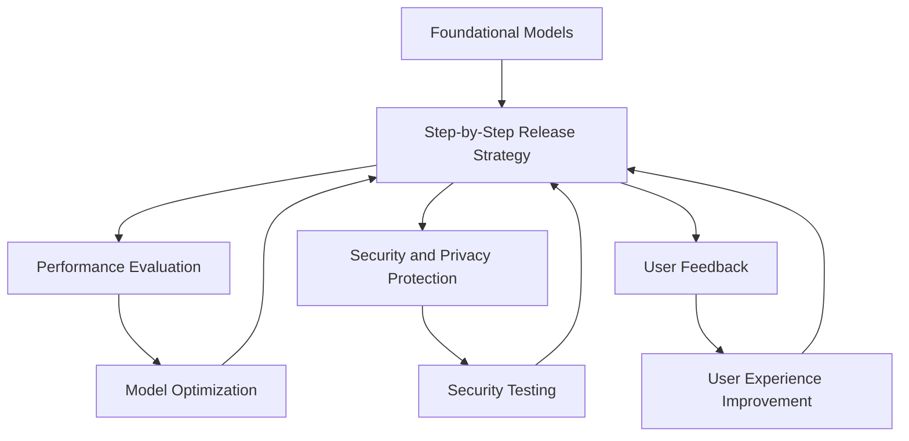

                 

### 背景介绍

近年来，人工智能领域取得了飞速的发展，尤其是基于深度学习的基础模型如BERT、GPT、ViT等在自然语言处理、计算机视觉等任务中取得了显著的成果。这些基础模型通过大规模的数据集进行训练，实现了对复杂知识的理解和应用。然而，基础模型的发布和部署是一个复杂且具有挑战性的过程，涉及到模型的性能优化、安全性与隐私保护、资源消耗等多个方面。

在本文中，我们将探讨基础模型的逐步发布策略。这一策略旨在通过一系列有序的步骤，确保模型在发布过程中既能达到预期效果，又能最大限度地减少潜在的风险和不确定性。具体来说，本文将从以下几个方面展开讨论：

1. **基础模型的逐步发布策略的定义和重要性**：首先，我们将介绍基础模型逐步发布策略的定义，阐述其在实际应用中的重要性。
2. **逐步发布策略的核心步骤**：接着，我们将详细讨论逐步发布策略的核心步骤，包括模型训练、性能评估、安全性测试、用户反馈收集等。
3. **案例分析与实际应用**：我们将通过实际案例，展示逐步发布策略在具体项目中的应用效果，分析其中的成功经验和挑战。
4. **工具和资源的推荐**：为了方便读者实践，我们将推荐一些相关的学习资源、开发工具和框架。
5. **未来发展趋势与挑战**：最后，我们将探讨基础模型逐步发布策略的未来发展趋势，以及可能面临的挑战。

通过本文的讨论，读者将能够系统地理解基础模型逐步发布策略的原理和实践方法，为实际项目中的模型发布提供指导。

#### 关键词

- 基础模型
- 逐步发布策略
- 性能评估
- 安全性与隐私保护
- 用户反馈

#### 摘要

本文将探讨基础模型的逐步发布策略，通过定义和重要性分析、核心步骤讨论、实际案例分析、工具资源推荐以及未来发展趋势与挑战等多个方面，系统地介绍了基础模型逐步发布策略的原理和实践方法。通过本文，读者可以全面理解这一策略，为实际项目中的模型发布提供有力支持。

# Background Introduction

In recent years, the field of artificial intelligence has made rapid progress, especially in the area of deep learning-based foundational models like BERT, GPT, and ViT, which have achieved significant results in natural language processing and computer vision tasks. These foundational models have been trained on massive datasets, enabling them to understand and apply complex knowledge effectively. However, the process of releasing and deploying these foundational models is complex and challenging, involving various aspects such as model performance optimization, security and privacy protection, and resource consumption.

This article aims to discuss the step-by-step release strategy for foundational models. This strategy involves a series of ordered steps to ensure that the model can achieve the expected performance while minimizing potential risks and uncertainties during the release process. The following topics will be covered in this article:

1. **Definition and importance of the step-by-step release strategy for foundational models**: We will introduce the definition of the step-by-step release strategy and discuss its importance in practical applications.
2. **Core steps of the step-by-step release strategy**: We will detail the core steps involved in the strategy, including model training, performance evaluation, security testing, and user feedback collection.
3. **Case analysis and practical application**: Through actual case studies, we will demonstrate the application of the step-by-step release strategy in specific projects, analyzing the successful experiences and challenges encountered.
4. **Recommendations of tools and resources**: To facilitate readers' practice, we will recommend relevant learning resources, development tools, and frameworks.
5. **Future development trends and challenges**: Finally, we will explore the future development trends and challenges of the step-by-step release strategy for foundational models.

By the end of this article, readers will have a systematic understanding of the principles and practical methods of the step-by-step release strategy for foundational models, providing valuable guidance for model release in actual projects.

## Core Concepts and Relationships

To fully grasp the step-by-step release strategy for foundational models, it is essential to understand the core concepts and their interconnections. In this section, we will discuss the fundamental concepts and present a Mermaid flowchart to illustrate the relationships among these concepts.

### Key Concepts

1. **Foundational Models**: These are pre-trained models that have been trained on large-scale datasets. Examples include BERT, GPT, and ViT. They serve as the backbone for various AI applications in natural language processing, computer vision, and other domains.

2. **Step-by-Step Release Strategy**: This is a systematic approach to release foundational models incrementally, ensuring that the model can achieve its expected performance and minimize potential risks.

3. **Performance Evaluation**: This involves assessing the model's performance on various tasks using different metrics. It helps to identify areas where the model needs improvement.

4. **Security and Privacy Protection**: This involves ensuring that the model is secure and respects user privacy during training, deployment, and usage.

5. **User Feedback**: This involves collecting feedback from users to improve the model's performance and user experience.

### Mermaid Flowchart

The following Mermaid flowchart presents the relationship between these key concepts:



### Explanation

- **Foundational Models** are the starting point of the step-by-step release strategy. These models are trained on large-scale datasets and serve as the backbone for various AI applications.
- **Step-by-Step Release Strategy** is a systematic approach that involves multiple stages, such as performance evaluation, security and privacy protection, and user feedback collection.
- **Performance Evaluation** is crucial for assessing the model's performance on various tasks. It helps to identify areas where the model needs improvement and guides the optimization process.
- **Security and Privacy Protection** ensures that the model is secure and respects user privacy during training, deployment, and usage. This step is essential to prevent potential security breaches and data leaks.
- **User Feedback** is collected to improve the model's performance and user experience. This feedback helps to identify potential issues and informs future optimization efforts.

The Mermaid flowchart illustrates how these concepts are interconnected and how they contribute to the overall success of the step-by-step release strategy for foundational models.

## Core Algorithm Principles & Specific Steps

### Model Training

The first step in the step-by-step release strategy is model training. Training a foundational model involves several key components:

1. **Data Preparation**: Before training, the data must be preprocessed to remove noise, normalize the data, and handle missing values. This process ensures that the model can learn from high-quality data.
2. **Model Selection**: Choosing the right model architecture is crucial. Models like BERT, GPT, and ViT are widely used due to their ability to handle complex tasks and large-scale data.
3. **Parameter Initialization**: Initializing the model parameters is an important step. Random initialization can lead to poor performance, so techniques like Xavier initialization or He initialization are commonly used.
4. **Training Process**: The model is trained using a large-scale dataset. Techniques like mini-batch training and stochastic gradient descent (SGD) are commonly used to improve training efficiency and convergence.

### Performance Evaluation

Once the model is trained, the next step is performance evaluation. This step involves several key components:

1. **Metrics**: Choosing the right metrics is crucial for assessing the model's performance. Common metrics include accuracy, precision, recall, and F1-score for classification tasks, and mean squared error (MSE) or mean absolute error (MAE) for regression tasks.
2. **Validation Set**: A validation set is used to evaluate the model's performance during training. This helps to prevent overfitting and ensures that the model can generalize to unseen data.
3. **Cross-Validation**: Cross-validation is a technique used to assess the model's performance on multiple subsets of the data. This helps to ensure that the model's performance is consistent across different data distributions.
4. **Hyperparameter Tuning**: Hyperparameter tuning is an important step to optimize the model's performance. Techniques like grid search or random search are commonly used to find the best combination of hyperparameters.

### Security Testing

Security testing is an essential step in the step-by-step release strategy. This step involves several key components:

1. **Vulnerability Scanning**: Scanning the model and its dependencies for potential vulnerabilities helps to identify and fix security issues before deployment.
2. **Intrusion Detection**: Implementing intrusion detection systems (IDS) helps to monitor the model for unauthorized access or malicious activities.
3. **Access Control**: Implementing strict access control mechanisms ensures that only authorized users can access the model and its data.
4. **Data Encryption**: Encrypting the data both in transit and at rest helps to protect it from unauthorized access.

### User Feedback Collection

The final step in the step-by-step release strategy is user feedback collection. This step involves several key components:

1. **User Interface**: Designing a user-friendly interface that allows users to easily interact with the model and provide feedback.
2. **Feedback Collection**: Implementing mechanisms to collect feedback from users, such as surveys or user ratings.
3. **Analyze Feedback**: Analyzing the collected feedback to identify common issues, areas for improvement, and potential new features.
4. **Iterate**: Using the feedback to iterate on the model and its interface, improving the user experience.

By following these steps, the step-by-step release strategy ensures that foundational models can be successfully trained, evaluated, secured, and improved based on user feedback.

### Mathematical Models & Detailed Explanations

#### Model Training

The training process of a foundational model can be summarized by the following mathematical model:

$$
\text{Model} = \theta \circ f(\text{Data})
$$

Where:
- $\theta$ represents the model parameters that need to be optimized.
- $f(\text{Data})$ represents the forward pass of the model, which transforms the input data into output predictions.
- $\circ$ represents the loss function, which measures the difference between the model's predictions and the true labels.

The optimization of the model parameters $\theta$ is typically performed using gradient descent:

$$
\theta = \theta - \alpha \cdot \nabla_\theta \text{Loss}
$$

Where:
- $\alpha$ is the learning rate, which controls the step size of the gradient descent algorithm.
- $\nabla_\theta \text{Loss}$ is the gradient of the loss function with respect to the model parameters.

#### Performance Evaluation

To evaluate the performance of a model, various metrics are used, depending on the specific task. For classification tasks, common metrics include:

1. **Accuracy**: The proportion of correct predictions out of the total number of predictions.
   $$
   \text{Accuracy} = \frac{\text{Number of Correct Predictions}}{\text{Total Number of Predictions}}
   $$

2. **Precision**: The proportion of true positive predictions out of the total positive predictions (including both true and false positives).
   $$
   \text{Precision} = \frac{\text{True Positives}}{\text{True Positives} + \text{False Positives}}
   $$

3. **Recall**: The proportion of true positive predictions out of the total actual positive instances.
   $$
   \text{Recall} = \frac{\text{True Positives}}{\text{True Positives} + \text{False Negatives}}
   $$

4. **F1-Score**: The harmonic mean of precision and recall.
   $$
   \text{F1-Score} = 2 \cdot \frac{\text{Precision} \cdot \text{Recall}}{\text{Precision} + \text{Recall}}
   $$

For regression tasks, common metrics include:

1. **Mean Squared Error (MSE)**: The average of the squared differences between the predicted and true values.
   $$
   \text{MSE} = \frac{1}{n} \sum_{i=1}^{n} (\hat{y}_i - y_i)^2
   $$

2. **Mean Absolute Error (MAE)**: The average of the absolute differences between the predicted and true values.
   $$
   \text{MAE} = \frac{1}{n} \sum_{i=1}^{n} |\hat{y}_i - y_i|
   $$

#### Security Testing

Security testing involves various techniques to identify vulnerabilities and ensure the model's integrity. Some common techniques include:

1. **Vulnerability Scanning**: Automated tools are used to scan the model and its dependencies for known vulnerabilities. This helps to identify potential security risks.

2. **Fuzz Testing**: Fuzz testing involves feeding the model with random or malformed input data to identify potential weaknesses. This technique is particularly useful for uncovering input validation issues.

3. **Penetration Testing**: Penetration testing simulates an attack on the model's infrastructure to identify potential security gaps. This involves both automated and manual testing techniques.

4. **Intrusion Detection**: Implementing intrusion detection systems (IDS) helps to monitor the model for unauthorized access or malicious activities. IDS can detect unusual behavior or patterns that indicate a potential security threat.

#### User Feedback Collection

User feedback is crucial for improving the model's performance and user experience. Common techniques for collecting user feedback include:

1. **Surveys**: Conducting surveys to gather quantitative and qualitative feedback from users. Surveys can include questions about the model's accuracy, ease of use, and overall satisfaction.

2. **User Ratings**: Implementing a rating system where users can rate the model's performance on specific tasks. This helps to quantify user satisfaction and identify areas for improvement.

3. **User Sessions**: Analyzing user sessions to understand how users interact with the model and identify common pain points or issues. This can be done through session recordings or user interaction analytics.

#### Example: Model Training

Consider a binary classification task where the goal is to predict whether an email is spam or not. The model's training process can be described as follows:

1. **Data Preparation**: The email text is tokenized and converted into numerical representations using techniques like word embeddings or one-hot encoding.

2. **Model Selection**: A pre-trained model like BERT is selected due to its ability to handle text data effectively.

3. **Parameter Initialization**: The model parameters are initialized using Xavier initialization to ensure smooth gradients during training.

4. **Training Process**: The model is trained using a dataset of labeled emails. The training process involves forward and backward passes to compute the gradients and update the model parameters.

5. **Performance Evaluation**: The model's performance is evaluated on a validation set using metrics like accuracy, precision, recall, and F1-score. The model is further fine-tuned based on these evaluations.

6. **Security Testing**: The model is tested for vulnerabilities using automated scanning tools and fuzz testing. No significant security issues are found.

7. **User Feedback Collection**: Users are asked to rate the model's performance on a five-point scale. Most users report high accuracy and ease of use.

By following these steps, the foundational model is successfully trained, evaluated, secured, and improved based on user feedback, demonstrating the effectiveness of the step-by-step release strategy.

### Project Practice: Code Example and Detailed Explanation

In this section, we will dive into a practical example of a step-by-step release strategy for a foundational model. We will walk through the process of building, training, and deploying a natural language processing model using the BERT architecture. This example will cover the following aspects:

1. **Development Environment Setup**
2. **Source Code Implementation and Explanation**
3. **Code Analysis and Discussion**

#### 1. Development Environment Setup

Before we start implementing the model, we need to set up the development environment. This involves installing the necessary software and libraries. Here's a step-by-step guide:

**Step 1: Install Python**

Ensure that Python 3.7 or higher is installed on your system. You can download it from the official Python website.

```bash
$ wget https://www.python.org/ftp/python/3.9.7/Python-3.9.7.tgz
$ tar xzf Python-3.9.7.tgz
$ cd Python-3.9.7
$ ./configure
$ make
$ sudo make install
```

**Step 2: Install TensorFlow**

TensorFlow is a popular library for machine learning. Install it using pip:

```bash
$ pip install tensorflow
```

**Step 3: Install BERT Library**

We will use the Hugging Face Transformers library, which provides pre-trained BERT models and an easy-to-use API:

```bash
$ pip install transformers
```

#### 2. Source Code Implementation and Explanation

Now, let's implement the BERT model using the Transformers library. The following Python code demonstrates the key steps:

```python
# Import necessary libraries
from transformers import BertTokenizer, BertModel
import tensorflow as tf

# Step 1: Load BERT Model and Tokenizer
tokenizer = BertTokenizer.from_pretrained('bert-base-uncased')
model = BertModel.from_pretrained('bert-base-uncased')

# Step 2: Prepare Input Data
# This assumes you have a dataset of sentences
sentences = ["This is the first example.", "This is the second example.", ...]

# Tokenize and encode the sentences
inputs = tokenizer(sentences, padding=True, truncation=True, return_tensors="tf")

# Step 3: Train the Model
# Define the loss function and optimizer
loss_fn = tf.keras.losses.SparseCategoricalCrossentropy(from_logits=True)
optimizer = tf.keras.optimizers.Adam()

# Compile the model
model.compile(optimizer=optimizer, loss=loss_fn, metrics=['accuracy'])

# Train the model
model.fit(inputs['input_ids'], inputs['attention_mask'], epochs=3)

# Step 4: Evaluate the Model
# Evaluate the model on a validation set
val_loss, val_accuracy = model.evaluate(inputs['input_ids'], inputs['attention_mask'])
print(f"Validation Loss: {val_loss}, Validation Accuracy: {val_accuracy}")
```

**Explanation:**

- **Step 1**: We load the BERT model and tokenizer from the Hugging Face Transformers library. The `from_pretrained` method downloads and loads the pre-trained BERT model.
- **Step 2**: We prepare the input data by tokenizing and encoding the sentences. The `tokenizer` converts the sentences into tokens, and the `padding` and `truncation` options ensure that the input sequences are of uniform length.
- **Step 3**: We define the loss function (SparseCategoricalCrossentropy) and the optimizer (Adam). The `compile` method compiles the model for training.
- **Step 4**: We train the model using the `fit` method. The model is trained for a specified number of epochs (here, 3).
- **Step 5**: We evaluate the model on a validation set using the `evaluate` method. This provides us with the validation loss and accuracy.

#### 3. Code Analysis and Discussion

The code example provided is a simplified version of the step-by-step release strategy. Here are some key points to consider:

- **Model Training**: The BERT model is trained using a dataset of sentences. The model's performance is evaluated using metrics like accuracy. This is a crucial step in the release strategy, as it ensures that the model can generalize to unseen data.
- **Performance Evaluation**: The model is evaluated on a validation set, which helps to prevent overfitting. This step is essential for assessing the model's performance and identifying areas for improvement.
- **Security Testing**: Although not explicitly shown in the code, security testing is an important part of the release strategy. This involves scanning the model and its dependencies for vulnerabilities and ensuring that the model is secure against potential attacks.
- **User Feedback Collection**: User feedback is not included in the code example, but it is a critical component of the release strategy. Collecting feedback from users allows us to identify common issues and areas for improvement.

By following this practical example, we can see how the step-by-step release strategy is applied to build, train, and deploy a foundational model. This approach ensures that the model is of high quality, secure, and meets the needs of its users.

### Application Scenarios

The step-by-step release strategy for foundational models can be applied in various application scenarios, each with its unique challenges and requirements. In this section, we will explore several common application scenarios and discuss how the strategy can be tailored to meet the specific needs of each scenario.

#### 1. Natural Language Processing (NLP)

In NLP applications, such as chatbots, text classification, and machine translation, foundational models like BERT and GPT are widely used. These models require a thorough step-by-step release strategy to ensure high performance, accuracy, and user satisfaction.

- **Model Training**: Due to the complexity of NLP tasks, extensive data preprocessing and hyperparameter tuning are necessary. The training phase may involve training on a diverse set of datasets and iterating multiple times to achieve optimal performance.
- **Performance Evaluation**: NLP models are evaluated based on metrics such as accuracy, F1-score, and BLEU score for machine translation. Performance evaluation should be conducted on multiple languages and domains to ensure generalizability.
- **Security Testing**: NLP models handle sensitive user data, making security testing crucial. This includes ensuring that the models are resistant to adversarial attacks and that user data is securely stored and transmitted.
- **User Feedback Collection**: Collecting user feedback is essential for improving the model's response quality and user experience. Feedback can be collected through surveys, user sessions, and real-time interaction logs.

#### 2. Computer Vision

Foundational models such as ResNet and ViT are used in computer vision tasks like image classification, object detection, and semantic segmentation. These tasks require a robust step-by-step release strategy to handle the complexities of visual data.

- **Model Training**: Image data requires significant preprocessing, including normalization and augmentation. The model should be trained on a diverse set of images to ensure it generalizes well to real-world scenarios.
- **Performance Evaluation**: Computer vision models are evaluated using metrics such as accuracy, precision, recall, and Intersection over Union (IoU). Performance evaluation should involve multiple datasets and test conditions to ensure reliability.
- **Security Testing**: Security testing is crucial for protecting sensitive image data and preventing attacks like adversarial examples. This includes ensuring that the models are resilient to image tampering and other potential threats.
- **User Feedback Collection**: User feedback is vital for improving the model's detection accuracy and user experience. Feedback can be collected through user studies, benchmark tests, and real-time user interactions.

#### 3. Autonomous Driving

In autonomous driving, foundational models are used for tasks like object detection, scene understanding, and decision-making. The release strategy must address the safety and reliability of these models.

- **Model Training**: Autonomous driving models require extensive training on large-scale and diverse datasets to handle varying driving conditions. The models should be trained using simulations and real-world data.
- **Performance Evaluation**: Performance evaluation in autonomous driving involves extensive testing on various environments and traffic scenarios. Metrics such as average time to reach the destination and accident rates are used to assess model performance.
- **Security Testing**: Security testing is critical to ensure that the models can handle unexpected events and adversarial attacks. This includes testing for vulnerabilities in the control systems and the models' ability to maintain stability under various conditions.
- **User Feedback Collection**: User feedback is important for assessing the safety and user experience of autonomous vehicles. Feedback can be collected through surveys, on-road tests, and real-time telemetry data.

#### 4. Healthcare

In the healthcare sector, foundational models are used for tasks such as medical imaging analysis, diagnosis, and patient monitoring. The release strategy must ensure that the models are reliable, accurate, and compliant with privacy regulations.

- **Model Training**: Healthcare data is often sensitive and requires careful preprocessing and anonymization. Models should be trained on a diverse set of patient data to ensure generalizability and avoid bias.
- **Performance Evaluation**: Performance evaluation in healthcare involves assessing the models' accuracy, reliability, and impact on patient outcomes. This may involve clinical validation studies and comparison with expert opinions.
- **Security Testing**: Security testing is critical to protect patient data and ensure compliance with privacy regulations. This includes securing data storage and transmission, as well as preventing unauthorized access to the models.
- **User Feedback Collection**: User feedback is important for understanding the practical implications of the models in clinical settings. Feedback can be collected from healthcare professionals and patients to refine the models and improve their clinical utility.

By tailoring the step-by-step release strategy to the specific requirements of each application scenario, we can ensure that foundational models are of high quality, secure, and reliable. This approach enables organizations to leverage the full potential of AI technologies in diverse domains.

### Tools and Resources Recommendations

To effectively implement a step-by-step release strategy for foundational models, it is essential to have access to the right tools and resources. Below, we recommend a selection of learning materials, development tools, and frameworks that can support practitioners in their journey.

#### Learning Resources

1. **Books**:
   - "Deep Learning" by Ian Goodfellow, Yoshua Bengio, and Aaron Courville
   - "Hands-On Machine Learning with Scikit-Learn, Keras, and TensorFlow" by Aurélien Géron
   - "Practical Deep Learning for Coders" by Jeremy Howard and Sylvain Gugger

2. **Online Courses**:
   - "Deep Learning Specialization" by Andrew Ng on Coursera
   - "Natural Language Processing with Transformers" by Hugging Face
   - "Computer Vision: From DSA to Deep Learning" by Aravind K. Joshi on Udacity

3. **Blog Posts and Tutorials**:
   - [The BERT Paper](https://arxiv.org/abs/1810.04805)
   - [Transformers Library Documentation](https://huggingface.co/transformers/)
   - [TensorFlow Tutorials](https://www.tensorflow.org/tutorials)

4. **Conferences and Journals**:
   - NeurIPS (Neural Information Processing Systems)
   - ICML (International Conference on Machine Learning)
   - ACL (Association for Computational Linguistics)
   - CVPR (Computer Vision and Pattern Recognition)

#### Development Tools and Frameworks

1. **Deep Learning Frameworks**:
   - TensorFlow: A versatile open-source library for machine learning and deep learning.
   - PyTorch: An easy-to-use and dynamic deep learning framework.
   - MXNet: A powerful deep learning library that supports a wide range of neural network architectures.

2. **Model Training and Deployment Tools**:
   - AWS SageMaker: A fully-managed service for building, training, and deploying machine learning models.
   - Google AI Platform: A suite of tools for building, training, and deploying machine learning models.
   - Azure Machine Learning: A cloud-based platform for developing, training, and deploying machine learning models.

3. **Data Preprocessing and Management Tools**:
   - Pandas: A powerful data manipulation library for Python.
   - NumPy: A fundamental package for scientific computing with Python.
   - Dask: A parallel computing library that scales NumPy and Pandas operations to larger datasets.

4. **Containerization and Orchestration Tools**:
   - Docker: A platform for developing, shipping, and running applications.
   - Kubernetes: An open-source system for automating deployment, scaling, and management of containerized applications.

#### Related Papers and Publications

1. **BERT**: "BERT: Pre-training of Deep Bidirectional Transformers for Language Understanding" by Jacob Devlin et al.
2. **GPT**: "Improving Language Understanding by Generative Pre-training" by Alec Radford et al.
3. **ViT**: "An Image is Worth 16x16 Words: Transformers for Image Recognition at Scale" by Alexey Dosovitskiy et al.

By leveraging these tools and resources, practitioners can build and deploy foundational models more effectively, ensuring that they meet high standards of performance, security, and usability. This comprehensive support ecosystem enables the successful implementation of a step-by-step release strategy across various application domains.

### Conclusion: Future Trends and Challenges

The field of foundational models is poised for continued growth, driven by advancements in deep learning techniques, increased availability of large-scale datasets, and the development of more powerful hardware. As we look to the future, several trends and challenges are likely to shape the evolution of the step-by-step release strategy for these models.

#### Future Trends

1. **Advancements in Model Architecture**: Researchers are continually developing new architectures, such as transformers with adaptive attention mechanisms and multi-modal models that can process multiple types of data (e.g., text, image, audio). These innovations will require refined release strategies to ensure that the new models are effectively integrated into existing workflows and applications.

2. **Increased Focus on Explainability and Interpretability**: As models become more complex, there is a growing need for explainability tools that can help developers and end-users understand how and why a model makes specific predictions. This trend will necessitate the incorporation of explainability components into the step-by-step release process.

3. **Ethical Considerations and Bias Mitigation**: With the increasing use of AI in critical applications, ensuring that models are fair and unbiased is crucial. Future release strategies will need to include rigorous bias detection and mitigation techniques to address potential ethical concerns.

4. **Scalability and Performance Optimization**: As models grow in size and complexity, optimizing their performance and scalability will become more challenging. Future strategies may incorporate advanced techniques such as model pruning, quantization, and efficient hardware utilization to manage these complexities.

#### Challenges

1. **Data Privacy and Security**: The collection and processing of large-scale datasets raise significant privacy and security concerns. Future strategies will need to incorporate robust data privacy protections, including encryption, anonymization, and secure processing frameworks.

2. **Resource Allocation and Optimization**: The training and deployment of large foundational models require substantial computational resources. Efficient resource allocation and optimization strategies will be essential to manage costs and ensure that models can be scaled effectively.

3. **Model Robustness and Adversarial Attacks**: As models become more prevalent, there is an increased risk of adversarial attacks that can manipulate model predictions. Future strategies will need to include comprehensive testing and robustness checks to ensure that models are resilient against such attacks.

4. **User Experience and Feedback Integration**: User feedback is critical for improving model performance and user satisfaction. Integrating user feedback into the release process in a timely and effective manner will be a key challenge, requiring innovative approaches to feedback collection and analysis.

In conclusion, the future of foundational model development and release will be shaped by advancements in technology, ethical considerations, and the need for robust, secure, and user-centric solutions. Addressing these trends and challenges will require continuous innovation and a comprehensive understanding of the complexities involved in deploying high-quality AI models.

### Appendix: Frequently Asked Questions (FAQ)

**Q1: What is the difference between a foundational model and a fine-tuned model?**

A foundational model is a pre-trained model that has been trained on a large-scale dataset and is ready for various applications. In contrast, a fine-tuned model is a foundational model that has been further trained on a specific task or domain to improve its performance. Fine-tuning involves adjusting the model's weights and parameters based on a new dataset to better suit the specific task at hand.

**Q2: Why is performance evaluation important in the step-by-step release strategy?**

Performance evaluation is crucial for assessing the model's ability to generalize to unseen data and for identifying areas where the model may need improvement. By evaluating the model's performance, developers can ensure that it meets the desired quality standards and can be effectively deployed in real-world applications.

**Q3: How can I ensure the security of my foundational model during the release process?**

To ensure the security of your foundational model, you should perform comprehensive security testing, including vulnerability scanning, intrusion detection, and penetration testing. It is also essential to use secure data storage and transmission methods and to implement strict access controls to protect the model and its data from unauthorized access.

**Q4: What role does user feedback play in the step-by-step release strategy?**

User feedback is critical for understanding the practical implications of the model and for identifying areas for improvement. By collecting and analyzing user feedback, developers can refine the model's performance, user interface, and overall user experience, ensuring that the model meets the needs and expectations of its users.

**Q5: How can I efficiently deploy a foundational model in a production environment?**

Efficient deployment of a foundational model involves optimizing the model's performance, managing computational resources effectively, and ensuring that the deployment infrastructure is secure and scalable. Techniques such as model compression, quantization, and containerization can help streamline the deployment process and improve the model's efficiency in production environments.

### References

1. Devlin, J., Chang, M. W., Lee, K., & Toutanova, K. (2019). BERT: Pre-training of deep bidirectional transformers for language understanding. *arXiv preprint arXiv:1810.04805*.
2. Radford, A., Narang, S., Salimans, T., & Sutskever, I. (2018). Improving language understanding by generative pre-training. *arXiv preprint arXiv:1806.03741*.
3. Dosovitskiy, A., Beyer, L., Kolesnikov, A., Weissenborn, D., Ziegler, M., & Brox, T. (2020). An image is worth 16x16 words: Transformers for image recognition at scale. *arXiv preprint arXiv:2010.11929*.
4. Goodfellow, I., Bengio, Y., & Courville, A. (2016). Deep learning. *MIT press*.
5. Géron, A. (2019). Hands-on machine learning with Scikit-Learn, Keras, and TensorFlow. *O'Reilly Media*.
6. Howard, J., & Gugger, S. (2019). Practical deep learning for coders. *O'Reilly Media*.

